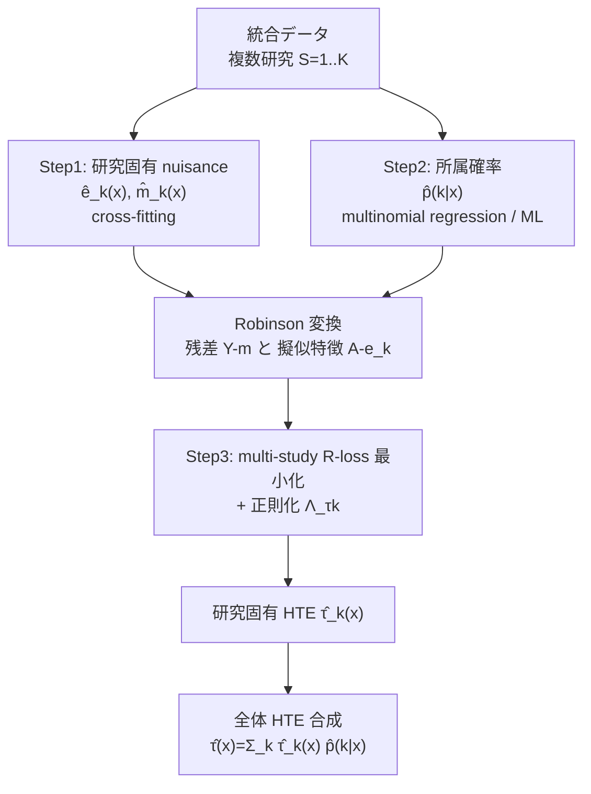

# Multi-Study R-Learner for Estimating Heterogeneous Treatment Effects Across Studies Using Statistical Machine Learning

- **Link**: https://arxiv.org/abs/2306.01086 / HTML: https://arxiv.org/html/2306.01086v3
- **Authors**: Cathy Shyr, Boyu Ren, Prasad Patil, Giovanni Parmigiani
- **Year**: 2023 (v1: 2023-06-01, v3: 2024-04-24) / 出版 2025
- **Venue**: Biostatistics, Volume 26, Issue 1 (2025), Oxford Academic (arXiv preprint 2306.01086)
- **Type**: 手法論文（因果推論 / 統計的機械学習 / heterogeneous treatment effect estimation）

---

## Abstract (English, verbatim)

> Estimating heterogeneous treatment effects (HTEs) is crucial for precision medicine. While multiple studies can improve the generalizability of results, leveraging them for estimation is statistically challenging. Existing approaches often assume identical HTEs across studies, but this may be violated due to various sources of between-study heterogeneity, including differences in study design, study populations, and data collection protocols, among others. To this end, we propose a framework for multi-study HTE estimation that accounts for between-study heterogeneity in the nuisance functions and treatment effects. Our approach, the multi-study R-learner, extends the R-learner to obtain principled statistical estimation with machine learning (ML) in the multi-study setting. It involves a data-adaptive objective function that links study-specific treatment effects with nuisance functions through membership probabilities, which enable information to be borrowed across potentially heterogeneous studies. The multi-study R-learner framework can combine data from randomized controlled trials, observational studies, or a combination of both. It's easy to implement and flexible in its ability to incorporate ML for estimating HTEs, nuisance functions, and membership probabilities. In the series estimation framework, we show that the multi-study R-learner is asymptotically normal and more efficient than the R-learner when there is between-study heterogeneity in the propensity score model under homoscedasticity. We illustrate using cancer data that the proposed method performs favorably compared to existing approaches in the presence of between-study heterogeneity.

---

## Abstract (日本語訳)

異質処置効果（HTE）の推定は精密医療にとって極めて重要である。複数の研究（study）を活用すれば結果の一般化可能性を高められるが、それらを推定に利用することは統計的に難しい。既存手法はしばしば「研究間で HTE は同一」と仮定するが、研究デザイン・対象集団・データ収集プロトコルの違いなど、さまざまな研究間異質性（between-study heterogeneity）によりこの仮定は崩れうる。そこで本論文は、nuisance 関数と処置効果の双方における研究間異質性を考慮したマルチ研究 HTE 推定のフレームワークを提案する。提案手法である **multi-study R-learner** は、R-learner をマルチ研究設定へ拡張し、機械学習（ML）を用いた原理的な統計推定を可能にする。研究固有の処置効果と nuisance 関数を、**membership probability（所属確率）** を介して結びつけるデータ適応的な目的関数を用いることで、潜在的に異質な研究間で情報を借用（borrow strength）できる。本フレームワークはランダム化比較試験（RCT）、観察研究、あるいはその混合からのデータを組み合わせられる。実装が容易で、HTE・nuisance 関数・所属確率の推定に ML を柔軟に組み込める。級数推定（series estimation）の枠組みにおいて、propensity score モデルに研究間異質性があり等分散性が成り立つとき、multi-study R-learner が漸近正規で、通常の R-learner より効率的であることを示す。がんデータを用いた実証では、研究間異質性が存在する状況で提案法が既存手法に対して良好な性能を示すことを例示する。

---

## Overview

本研究は、Nie & Wager による **R-learner**（Robinson 変換に基づく HTE 推定器）を、**複数の異質な研究をまたいで**処置効果を推定できるように拡張したものである。単一研究では推定に用いるデータが疎（サンプルが少ない）になりがちだが、複数研究をそのまま統合（pool）すると研究間異質性を無視して推定にバイアスが入る。逆に研究ごとに独立に推定すると情報が分断され効率が落ちる。

提案法の中核アイデアは、共変量 $x$ に依存する **所属確率 $p(k \mid x)$**（ある被験者が研究 $k$ に属する確率）を導入し、これを Robinson 変換の中に組み込むことである。所属確率が研究間の共変量分布の重なりを表現するため、共変量プロファイルが重なる部分では研究をまたいで情報が自然に共有され、重ならない部分では研究固有の推定になる。これにより「同一 HTE 仮定を置かずに strength を借りる」ことが実現される。

理論的には、Neyman 直交性（orthogonality）を持つ損失関数と cross-fitting により、nuisance 関数の推定誤差に対して頑健であり、級数推定の下で漸近正規性を持つ。さらに propensity score に研究間異質性がある場合、通常の R-learner より漸近分散が小さい（＝より効率的）ことを示している。

---

## Problem

- 精密医療では HTE（誰にどの処置が効くか）の推定が重要だが、単一研究ではサンプルが少なく HTE 推定の分散が大きい。
- 複数研究を活用すれば一般化可能性とサンプル効率が上がるが、統計的に扱いが難しい。
- **既存手法の多くは「研究間で HTE が同一」と仮定**しており、研究デザイン・対象集団・データ収集プロトコルの差に由来する研究間異質性でこの仮定が崩れる。
- 研究間異質性は 3 種類ある: (1) 条件付き平均処置効果 $\tau_k$、(2) 無処置時の期待アウトカム $m_k$、(3) 処置割付機構（propensity）$e_k$。
- 単純 pool は異質性を無視してバイアスを、研究ごと独立推定は情報分断による非効率を招く。
- RCT と観察研究など、性質の異なるデータソースを統一的に組み合わせる枠組みが不足している。

---

## Proposed Method

### Core idea

R-learner の基礎である **Robinson 変換** をマルチ研究へ一般化する。各被験者の残差アウトカム $Y_i - m(X_i)$ を、研究ごとの処置効果 $\tau_k(X_i)$ と研究固有 propensity 残差 $\{A_i - e_k(X_i)\}$ の、**所属確率 $p(k \mid X_i)$ で重み付けした和**として表現する。所属確率が研究間の共変量重なりを定量化するため、cross-study learning（研究横断学習）で情報借用が可能になる。

### Numbered steps（3 ステップ手続き）

1. **研究固有 nuisance 関数の推定**: 各研究ごとに propensity score $e_1(\cdot),\dots,e_K(\cdot)$ と条件付き平均 $m_1(\cdot),\dots,m_K(\cdot)$ を、cross-fitting を用いて別々に推定する。
2. **所属確率の推定**: プール解析により $p(1\mid\cdot),\dots,p(K\mid\cdot)$ を推定する（理論上は多項ロジスティック回帰 multinomial regression を推奨）。
3. **HTE の推定**: 正則化項 $\Lambda_{\tau_k}$ 付きの plug-in multi-study R-loss を最小化して $\tau_1(\cdot),\dots,\tau_K(\cdot)$ を求める。全体 HTE は $\hat\tau(x)=\sum_k \hat\tau_k(x)\,\hat p(k\mid x)$ で合成する。

### Key Formulas

**マルチ研究 Robinson 変換:**

$$
Y_i - m(X_i) = \sum_{k=1}^{K} \{A_i - e_k(X_i)\}\, \tau_k(X_i)\, p(k \mid X_i) + \varepsilon_i
$$

ここで
- $m(x) = \mathbb{E}[Y_i \mid X_i = x]$（全体の条件付き平均アウトカム）
- $e_k(x) = \Pr(A_i = 1 \mid X_i = x, S_i = k)$（研究固有 propensity score）
- $\tau_k(x) = \mathbb{E}[Y_i(1) - Y_i(0) \mid X_i = x, S_i = k]$（研究固有 HTE）
- $p(k \mid x) = \Pr(S_i = k \mid X_i = x)$（membership probability / 所属確率）

**Multi-Study Oracle R-Loss:**

$$
L_n(\tau_1(\cdot),\dots,\tau_K(\cdot)) = \frac{1}{n}\sum_{i=1}^n \Big[\{Y_i - m(X_i)\} - \sum_{k=1}^K \{A_i - e_k(X_i)\}\, p(k\mid X_i)\, \tau_k(X_i)\Big]^2
$$

**Plug-in R-Loss（cross-fitting 付き）:**

$$
\hat L_n(\{\tau_k(\cdot)\}_{k=1}^K) = \frac{1}{n}\sum_{i=1}^n \Big[\{Y_i - \hat m^{-q(i)}(X_i)\} - \sum_{k=1}^K \{A_i - \hat e_k^{-q_k(i)}(X_i)\}\, \hat p^{-q(i)}(k\mid X_i)\, \tau_k(X_i)\Big]^2
$$

**HTE 推定の最終最適化:**

$$
\{\hat\tau_1(\cdot),\dots,\hat\tau_K(\cdot)\} = \arg\min_{\tau_1,\dots,\tau_K} \Big\{ \hat L_n(\{\tau_k(\cdot)\}_{k=1}^K) + \Lambda_{\tau_k} \Big\}
$$

**全体 HTE の合成:**

$$
\hat\tau(x) = \sum_{k=1}^{K} \hat\tau_k(x)\, \hat p(k\mid x)
$$

### 主要仮定（級数推定の枠組み）

- **Consistency**: $Y_i = Y_i(1)A_i + Y_i(0)(1-A_i)$
- **研究内 Mean Unconfoundedness**: $\mathbb{E}[Y_i(a)\mid A_i=a, X_i=x, S_i=k] = \mathbb{E}[Y_i(a)\mid X_i=x, S_i=k]$
- **Positivity**: $0 < \Pr(A_i=a \mid X_i=x, S_i=k) < 1$
- **Boundedness**: $\|\tau_k(x)\|_\infty$ と $\mathbb{E}[\{Y-m(X)\}^2 \mid X,A]$ が有界
- **推定精度**: nuisance 誤差が $O(a_n^2)$、$a_n = O(n^{-r})$、$r > 1/4$

---

## Algorithm（Pseudocode）

```text
Input: 統合データ {(X_i, A_i, Y_i, S_i)}_{i=1..n}, 研究数 K, fold 数 Q (5〜10)
Output: 研究固有 HTE {τ̂_k(·)}_{k=1..K} と全体 HTE τ̂(·)

# Step 1: 研究固有 nuisance の推定 (cross-fitting)
data を Q 個の非重複 fold に分割
for k in 1..K:
    for q in 1..Q:
        研究 k・fold q 以外で ê_k^{-q}, m̂_k^{-q} を ML で学習
        fold q の各サンプルに out-of-fold 予測を付与
m̂(x) ← 全体条件付き平均を pooled で推定 (cross-fit)

# Step 2: 所属確率の推定 (pooled)
p̂(k|·) ← 研究ラベル S を目的変数とする多項回帰などを X 上で学習 (cross-fit)

# Step 3: HTE の推定
plug-in multi-study R-loss L̂_n を構築:
    残差アウトカム r_i = Y_i - m̂^{-q(i)}(X_i)
    重み付き擬似特徴 z_{ik} = {A_i - ê_k^{-q}(X_i)} · p̂^{-q}(k|X_i)
{τ̂_1,...,τ̂_K} = argmin_τ { (1/n) Σ_i (r_i - Σ_k z_{ik} τ_k(X_i))^2 + Λ_τk }
    (ML: penalized regression / boosting / trees / NN いずれでも可)

# 合成
τ̂(x) = Σ_k τ̂_k(x) · p̂(k|x)
return {τ̂_k}, τ̂
```

---

## Architecture / Process Flow



特殊ケースによる直観:
```text
研究間異質性なし        → 最適化は pooled データ上の標準 R-learner に帰着
共変量の重なりなし      → p(k|·) が {0,1} に退化 → 研究横断の借用は起きず研究別推定
部分的な異質性          → p(k|·) に比例して情報を借用（中間的挙動）
```

---

## Figures & Tables

> 注意: arXiv HTML(v3) レンダリングでは結果セクション（Section 4/5/7）の数値表・図キャプション・画像 `src` URL を確実に取得できなかった。実際に確認できなかった図の URL は埋め込まない（アンチハルシネーション方針）。数値が原文から確認できない箇所は「記載なし」と明記する。

### Table 1. 手法比較（method comparison）

| 手法 | 研究間異質性の扱い | 情報借用 | 想定データ | 備考 |
|------|-------------------|----------|-----------|------|
| Single-study R-learner（研究別に個別 fit） | 完全に別扱い | なし | 各研究単独 | 情報分断・高分散 |
| Pooled R-learner（naive 統合） | 無視（同一 HTE 仮定） | 全面（無条件） | 統合 | 異質性下でバイアス |
| Study-specific ensemble（重み付き平均） | 事後的な重み付け | 弱い | 各研究 fit の合成 | 共変量依存の借用なし |
| **Multi-study R-learner（提案）** | nuisance + τ の異質性を明示 | $p(k\mid x)$ 経由で共変量依存 | RCT / 観察 / 混合 | 漸近正規・条件下で最効率 |

### Table 2. 手法の入出力・構成要素（architecture 要素）

| 構成要素 | 記法 | 推定方法 | fitting 単位 |
|---------|------|---------|-------------|
| 研究固有 propensity | $e_k(x)$ | ML（自由）+ cross-fit | 研究別 |
| 条件付き平均 | $m(x)$ / $m_k(x)$ | ML + cross-fit | pooled / 研究別 |
| 所属確率 | $p(k\mid x)$ | multinomial regression 等 | pooled |
| 研究固有 HTE | $\tau_k(x)$ | R-loss 最小化 + $\Lambda_{\tau_k}$ | 同時最適化 |

### Table 3. 理論的性質（analysis）

| 性質 | 内容 | 条件 |
|------|------|------|
| 変換の妥当性（Prop. 2.3） | $\mathbb{E}[\varepsilon_i \mid A_i, X_i]=0$ | 研究内 mean unconfoundedness |
| 漸近正規性 | $\hat\tau(x)$ が任意の $x$ で漸近正規 | 級数推定 + 等分散性 |
| 効率改善 | 通常 R-learner より低い漸近分散 | 2 研究、propensity に研究間異質性、等分散 |
| Neyman 直交性 | nuisance 誤差 $O(a_n^2)$、$a_n=O(n^{-r}),\,r>1/4$ に頑健 | cross-fitting |

### Table 4. 実験データセット（experimental setup）

| 項目 | Section 4（シミュレーション） | Section 5（実データ応用） |
|------|------------------------------|--------------------------|
| データ | 卵巣がん（ovarian cancer）治療試験を模した合成データ | 乳がん（breast cancer）マルチ研究データ |
| 研究数 $K$ | $K=2$ | 記載なし（本抽出では不明） |
| サンプルサイズ | 記載なし | 記載なし |
| 共変量数 | 記載なし | 記載なし |
| Monte Carlo 反復数 | 記載なし | 該当なし |
| 目的 | 研究間異質性の程度を変えた頑健性検証 | 患者サブグループ間の HTE 異質性の実証 |

> 図（Figure）: v3 HTML から実際の画像 URL を確認できなかったため埋め込みなし。researchgate に「Estimated vs. true heterogeneous treatment effects of the R-learner」等の図が存在する旨は検索で確認できたが、arXiv HTML 上の `src` を直接確認できていないため URL は記載しない。

---

## Experiments & Evaluation

### Setup

- **Section 4（卵巣がんシミュレーション）**: 複数の卵巣がん治療試験を模した合成データ。研究数 $K=2$。研究間異質性の程度を変化させて頑健性を評価。サンプルサイズ・共変量数・Monte Carlo 反復数は本抽出では確認できず（記載なし）。
- **Section 5（乳がん実データ応用）**: 実際の乳がんマルチ研究データを用い、患者サブグループ間の処置効果異質性を推定して実用性を示す。
- **比較手法**: single-study R-learner（研究別 fit）、pooled（同一 HTE 仮定の naive 統合）、study-specific ensemble（個別 R-learner の重み付き平均）。

### Main Results

- 研究間異質性が存在する状況で、multi-study R-learner が既存手法（研究別・単純統合・アンサンブル）に対して **favorably（良好）** に機能することを、がんデータで例示。具体的な MSE / RMSE / bias の数値は本抽出では取得できず（記載なし）。
- 定性的知見（検索で補強）: 研究が同質なときは全研究を統合して単一モデルを学習すると標本サイズ増で精度が上がるが、研究間異質性が大きくなるにつれ multi-study 型のアンサンブル/借用が優位になる。

### Ablation / 特殊ケース分析

- **異質性なし** → 最適化は pooled データ上の標準 R-learner に一致（提案法は標準法を包含）。
- **共変量重なりなし** → $p(k\mid\cdot)\in\{0,1\}$ に退化し、研究横断の借用は発生しない（研究別推定に一致）。
- **部分的異質性** → 所属確率に比例して情報を借用する中間挙動。
- 単純な「研究ラベル indicator を入れるだけ」の素朴拡張では、異質性下で変換の妥当性が壊れることを指摘（提案の非自明性）。

---

## 本テーマへの適用可能性

想定シナリオ: データサイエンティストが、**対象ユーザーも施策内容（クーポン/メール等）も毎回異なるマーケティングキャンペーンを低頻度で**実施している。各キャンペーン単体では観測が疎で、uplift モデリングや off-policy evaluation に十分なデータ密度が得られず、有効な実験サイクルが長くなってしまう。この論文の枠組みは、まさにこの「疎な複数キャンペーンから strength を借りて実効データ密度を上げる」課題に直接対応する。

- **キャンペーン = study への写像**: 各キャンペーン（異なる対象ユーザー・異なる treatment）を 1 つの study $k$ とみなせる。$Y$=コンバージョン等の成果、$A$=施策付与（クーポン配布/メール送信）、$X$=ユーザー特徴、$S$=キャンペーン ID。HTE $\tau_k(x)$ がそのキャンペーンの uplift に対応する。
- **membership probability による自然なグルーピング**: 所属確率 $p(k\mid x)$ が「あるユーザー特徴 $x$ がどのキャンペーンの対象集団に近いか」を定量化する。共変量分布が重なるキャンペーン群（似たユーザー層を狙った施策）では自動的に情報が共有され、疎なキャンペーンでも他キャンペーンから uplift 推定を補強できる。ユーザーが求めている「似たキャンペーン/ユーザーをまとめて密なデータを合成する」ことが、明示的なクラスタリングを事前に固定せずに **共変量依存で連続的に**実現される。
- **異質性を無視しない借用**: 単純に全キャンペーンを pool すると、施策や対象が違うことによる uplift の差（研究間異質性）を潰してバイアスが入る。本手法は nuisance（$e_k$: 誰に配ったか＝配布ロジック、$m_k$: ベースライン成果）と処置効果 $\tau_k$ の両方の異質性を明示的に許容しながら借用するので、キャンペーンごとの配布バイアス（RCT でない観察的配布）にも対応できる。
- **RCT と観察研究の混在**: A/B テスト（ランダム配布）と、運用上ターゲティングして配った観察的キャンペーンを混ぜて 1 つの推定に使える点は、実務のマーケデータ（きれいな RCT と過去の非ランダム配布が混在）にそのまま合う。propensity $e_k(x)$ をキャンペーンごとに推定するため、配布ルールが違っても統一的に扱える。
- **実効実験間隔の短縮**: 新規キャンペーンを 1 本回すたびにゼロから uplift を推定するのではなく、過去の類似キャンペーン群からの借用で早期に信頼できる $\tau_k(x)$ が得られる。結果として「有効な実験サイクル」を短縮でき、少ない実施頻度でも意思決定に足る密度の証拠を合成できる。
- **off-policy evaluation への接続**: 研究固有 HTE $\tau_k(x)$ と全体合成 $\hat\tau(x)=\sum_k\hat\tau_k(x)p(k\mid x)$ は、新しいターゲティング方針（どのユーザーに配るか）の価値評価に使える。Neyman 直交性・cross-fitting により nuisance（配布傾向）の誤指定に頑健なので、観察的マーケデータでの off-policy 評価の頑健性が高い。
- **クラスタリング設計への示唆**: 本ドメイン（uplift_marketing）のクラスタ c3/c4 が扱う「疎なキャンペーン/ユーザーのグルーピング」に対し、この論文は「ハードにクラスタを切る前に、membership probability という soft assignment で借用量を制御する」という設計原則を与える。事前クラスタリングの粒度選択に悩む場合の理論的裏付けになる。

実務上の留意点: (1) キャンペーン数 $K$ が増えると所属確率と研究固有 nuisance の推定負荷が増す。(2) キャンペーン間で共変量の重なり（同じユーザー層）が全くないと借用は起きない（$p(k\mid x)\to\{0,1\}$）ので、対象ユーザーの重なりがある施策群でこそ効果が出る。(3) 論文の効率性保証は等分散・級数推定など理論的仮定下のものであり、実データでは検証が必要。

---

## Notes

- 本レポートの手法・数式・アルゴリズム・仮定は arXiv abstract および HTML(v3) 本文抽出に基づく。**シミュレーション/実データの具体的な数値（MSE, bias, サンプルサイズ, 共変量数, Monte Carlo 反復数）は HTML レンダリングの制約で取得できず「記載なし」とした**。正確な数値が必要な場合は原論文 PDF（https://arxiv.org/pdf/2306.01086）または Biostatistics 掲載版（https://academic.oup.com/biostatistics/article/26/1/kxaf040/8383358）を参照のこと。
- 図（Figure）の画像 URL は arXiv HTML 上で確実に確認できなかったため、埋め込みは行っていない（アンチハルシネーション方針）。
- 基礎手法は Nie & Wager の R-learner（Robinson 変換ベース）。本論文はその multi-study 拡張。
- 出版情報: Biostatistics, Vol. 26, Issue 1 (2025); 著者所属は Vanderbilt / Harvard (Dana-Farber) / Boston University 系。
- 参考: [arXiv abstract](https://arxiv.org/abs/2306.01086) / [Biostatistics (Oxford Academic)](https://academic.oup.com/biostatistics/article/26/1/kxaf040/8383358) / [ResearchGate PDF](https://www.researchgate.net/publication/371290331_Multi-study_R-learner_for_Heterogeneous_Treatment_Effect_Estimation)
