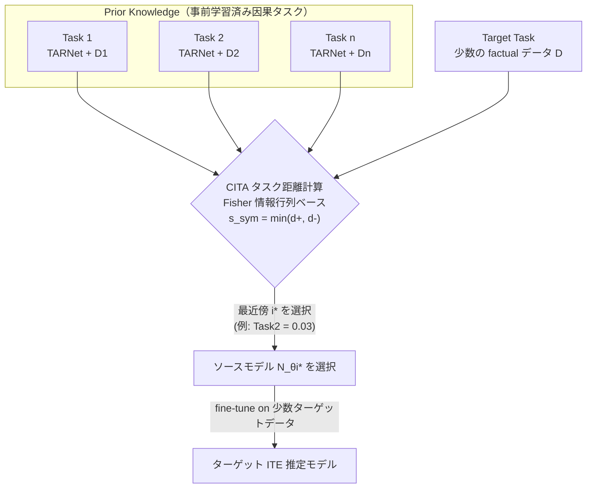

# Transfer Learning for Individual Treatment Effect Estimation

- **Link**: https://arxiv.org/abs/2210.00380 (PDF: https://arxiv.org/pdf/2210.00380)
- **Authors**: Ahmed Aloui\*, Juncheng Dong\*, Cat P. Le, Vahid Tarokh (\*Equal Contribution) — Department of Electrical and Computer Engineering, Duke University
- **Year**: 2022 (v1: 2022-10-01 / v3: 2023-06-05)
- **Venue**: UAI 2023 (39th Conference on Uncertainty in Artificial Intelligence, PMLR v216, aloui23a)
- **Type**: 会議論文（理論 + 実験）

---

## Abstract (English, verbatim)

> This work considers the problem of transferring causal knowledge between tasks for Individual Treatment Effect (ITE) estimation. To this end, we theoretically assess the feasibility of transferring ITE knowledge and present a practical framework for efficient transfer. A lower bound is introduced on the ITE error of the target task to demonstrate that ITE knowledge transfer is challenging due to the absence of counterfactual information. Nevertheless, we establish generalization upper bounds on the counterfactual loss and ITE error of the target task, demonstrating the feasibility of ITE knowledge transfer. Subsequently, we introduce a framework with a new Causal Inference Task Affinity (CITA) measure for ITE knowledge transfer. Specifically, we use CITA to find the closest source task to the target task and utilize it for ITE knowledge transfer. Empirical studies are provided, demonstrating the efficacy of the proposed method. We observe that ITE knowledge transfer can significantly (up to 95%) reduce the amount of data required for ITE estimation.

## Abstract（日本語訳）

本研究は、Individual Treatment Effect (ITE) 推定のためにタスク間で因果知識を転移する問題を扱う。まず理論的に ITE 知識転移の実現可能性を評価し、効率的な転移のための実用フレームワークを提示する。ターゲットタスクの ITE 誤差に対する下界を導入し、反実仮想（counterfactual）情報が欠落しているために ITE 知識転移が本質的に困難であることを示す。それにもかかわらず、ターゲットタスクの counterfactual loss と ITE 誤差に対する汎化上界を確立し、ITE 知識転移が可能であることを示す。続いて、ITE 知識転移のための新しい **Causal Inference Task Affinity (CITA)** 尺度を備えたフレームワークを導入する。具体的には、CITA を用いてターゲットタスクに最も近いソースタスクを見つけ、それを ITE 知識転移に活用する。実験によって提案手法の有効性を示し、ITE 知識転移によって ITE 推定に必要なデータ量を **最大 95% 削減** できることを観察した。

---

## Overview

医療・社会政策などで重要な ITE（＝CATE, Conditional Average Treatment Effect）推定は、ランダム化比較試験（RCT）による大量データ収集を要し、費用と時間がかかる。本論文は「類似する別の因果推論タスクで得た知識を転移すれば、少ないデータでターゲットタスクの ITE を推定できるのではないか」という問いに答える。

因果推論における転移学習の核心的困難は **the fundamental problem of causal inference**（Rubin 1974, Holland 1986）にある。ある個体に対し treatment と control の両方の結果を同時に観測することは不可能なので、ITE の真値 τ(x) も PEHE の直接評価も、実データからは決してできない（counterfactual data は inaccessible）。

本論文の 3 つの貢献:
1. **理論**: ITE 知識転移の下界（困難さ）と、counterfactual loss / ITE 誤差に対する汎化上界（実現可能性）を確立。
2. **CITA**: 因果推論タスクの「対称性」（treatment ラベルの入れ替えに対する不変性）を捉える task affinity 尺度を提案。測定不能な counterfactual loss と強く相関することを理論・実験で示す。
3. **フレームワーク + データセット**: 因果転移学習に適した一連の因果推論データセットを構築し、最大 95% のデータ削減を実証。

---

## Problem（課題リスト）

- **反実仮想の不可観測性**: τ(x)=E[Y1−Y0|X] の真値も PEHE も実データで測れない。通常の教師あり転移学習の validation set 相当が存在しない。
- **ソースモデル選択の落とし穴**: 単に factual loss が低いソースモデルを選んでも、（測定できない）counterfactual loss が非常に大きい場合があり、ターゲットで破滅的に失敗しうる（Theorem 4.1 が示す）。
- **negative transfer**: 適切なソースを選ばないと転移がむしろ性能を悪化させる（Standley et al. 2020）。
- **非因果（spurious）相関**: 通常の転移学習では背景色などの非因果特徴に依存しやすく、因果知識の転移では特に有害。
- **既存 task affinity の不適合**: 既存の task affinity（Le et al. 2022b 等）は因果タスク固有の「treatment ラベル対称性」を捉えられない。
- **RCT データ収集の高コスト**: ITE 推定に十分なサンプルを毎回集めるのは費用・時間の面で非現実的。

---

## Proposed Method

### 核となるアイデア

各因果推論タスクを、そのデータで十分に学習させた TARNet（Shalit et al. 2017）で表現し、**Fisher 情報行列**に基づく距離 **CITA** を用いて、ターゲットタスクに最も近いソースタスクを選ぶ。そのソースモデルをターゲットデータで fine-tune することで、少数データでも高精度な ITE 推定を実現する。CITA は因果タスクの **対称性**（treatment 群と control 群の役割入れ替えに対する不変性）を取り込むよう設計され、測定不能な counterfactual loss と強く相関する「代理指標」として機能する。

### 手順

1. 各ソースタスク i について、そのデータ (X_i, A_i, Y_i) で TARNet N_{θ_i} を十分に学習させる。
2. Fisher 情報行列に基づき、ソース i → ターゲット T のタスク距離 d_i^+ を計算する（TAS）。
3. treatment ラベルを反転させたターゲット T'（a→1−a）に対する距離 d_i^− も計算する。
4. 対称化: s_{sym,i} = min(d_i^+, d_i^−)。これにより treatment ラベルの付け替えに不変な affinity を得る（=CITA）。
5. 最も近いソース i* = argmin_i s_{sym,i} を選択する。
6. 選ばれたソースモデル N_{θ_{i*}} をターゲットデータ (X_t, A_t, Y_t) で fine-tune し、ITE を推定する。

### Key Formulas

**ITE / CATE の定義（Def 3.1）:**
$$\forall x \in \mathcal{X}, \quad \tau(x) = \mathbb{E}[Y^1 - Y^0 \mid X = x]$$

**PEHE（Def 3.4, 性能指標）:**
$$\varepsilon_{PEHE}(\hat{f}) = \int_{\mathcal{X}} \big(\hat{\tau}(x) - \tau(x)\big)^2 \, p_F(x)\, dx$$

**IPM（分布間距離, Eq.9）:**
$$\mathrm{IPM}_G(p, q) := \sup_{g \in G} \left| \int_S g(s)\big(p(s) - q(s)\big)\, ds \right|$$

**TARNet の学習目的（Eq.10, balancing weight α）:**
$$\mathcal{L}(\Phi, h) = \frac{1}{N}\sum_{i=1}^{N} w_i \cdot \ell_{(\Phi,h)}(x_i, a_i, y_i) + \alpha \cdot \mathrm{IPM}_G\big(\{\Phi(x_i)\}_{i:a_i=0}, \{\Phi(x_i)\}_{i:a_i=1}\big)$$
ここで $w_i = \frac{a_i}{2v} + \frac{1-a_i}{2(1-v)}$, $v = \frac{1}{N}\sum a_i$。

**下界 = 転移の困難さ（Theorem 4.1, u = p_F^T(A=1)）:**
$$\epsilon_F^{T}(\hat{f}^S) + u\,\epsilon_{CF}^{T,a=0}(\hat{f}^S) \le \varepsilon_{PEHE}^{T}(\hat{f}^S)$$
（factual loss を小さくするだけでは PEHE を保証できない ＝ counterfactual を無視できない）

**汎化上界 = 転移の実現可能性（Theorem 4.2, L1 距離 V(p,q)=∫|p−q|ds）:**
$$\varepsilon_{PEHE}^{T}(\hat{f}) \le 4\epsilon_F^S(\hat{f}) + 4V(p_F^T, p_F^S) + 2V(p_F^T, p_{CF}^T) + 4\,\mathbb{E}_{(x,a)\sim p_F^T}\big[|f^S(x,a) - f^T(x,a)|\big]$$
（IPM 版は Theorem 4.3、TARNet 用 balancing 版は Theorem 4.5 で提示）

**Fisher 情報行列（Def 5.1）:**
$$F_{s,t} = \mathbb{E}_{D \sim D_t}\big[\nabla_\theta L(\theta_s, D)\,\nabla_\theta L(\theta_s, D)^T\big]$$

**Task Affinity Score（Def 5.2, Frobenius ノルム, 0≤d≤1）:**
$$d[s,t] = \frac{1}{\sqrt{2}}\,\big\| F_{s,s}^{1/2} - F_{s,t}^{1/2} \big\|_F$$

**CITA（対称化タスク親和性）:**
$$d_{sym}[s,t] = \min_{\sigma \in \mathbb{S}_{M+1}} \big(d_\sigma\big), \quad d_\sigma = \frac{1}{\sqrt{2}}\big\| F_{a,a}^{1/2} - F_{a,\sigma(t)}^{1/2}\big\|_F$$
バイナリ処置では σ が treatment ラベルの入れ替えに対応し、s_{sym} = min(d^+, d^−)。

---

## Algorithm（擬似コード）

```
Algorithm 1: Task-Aware ITE Knowledge Transfer

Data:  Source tasks S = {(X_i, A_i, Y_i)}, 1 <= i <= m
       Target task: T = (X_t, A_t, Y_t)
Input: Causal Inference Models N_{θ1}, N_{θ2}, ..., N_{θm}
Output: Causal Inference model for the target task T

1  Function TAS(X_s, A_s, X_s, A_s, N_{θs}):
2      Compute F_{s,s} using N_{θs} with X_s, A_s
3      Compute F_{s,t} using N_{θs} with X_t, A_t
4      return d[s,t] = (1/√2) || F_{s,s}^{1/2} − F_{s,t}^{1/2} ||_F

5  Function Main:                       # Find the closest tasks in S
6      for i = 1, 2, ..., m do
7          Train N_{θi} for source task i using (X_i, A_i, Y_i)
8          # distance source i -> target T
9          d_i^+ = TAS(X_i, A_i, X_t, A_t, N_{θi})
10         # distance source i -> target T' (treatments inverted)
11         d_i^- = TAS(X_i, A_i, X_t, 1 − A_t, N_{θi})
12         CITA: s_{sym,i} = min(d_i^+, d_i^-)
13     return closest task: i* = argmin_i s_{sym,i}   # ITE Knowledge Transfer
14     Fine-tune N_{θ_{i*}} with target task's data (X_t, A_t, Y_t)
15 return N_{θ_{i*}}
```

---

## Architecture / Process Flow



処理フロー要約: 全ソースタスクを TARNet で事前学習 → 各ソースとターゲット間の CITA（対称化 Fisher 距離）を算出 → 最近傍ソースを選択 → 少数のターゲットデータで fine-tune → ITE 推定。

---

## Figures & Tables

> 注: arXiv の HTML 版（/html/2210.00380）は 404 で取得できなかったため、画像 URL の埋め込みは行わない。以下は PDF から確認したキャプションと数値を転記したもの。

### Figure 1（キャプション）
> Inaccessibility to counterfactual data (e.g., a parallel universe where the treatments are reversed) makes transferring causal knowledge more challenging.
（反実仮想データにアクセスできない＝処置が反転した「並行世界」を観測できないことが因果知識転移を困難にする、という概念図。）

### Figure 2（キャプション）
> Overview of transfer learning in causal inference. Task affinity (CITA) is used to identify the closest task(s) from prior tasks. The models and datasets from the relevant prior tasks are transferred to the target task.
（Prior Knowledge の複数因果タスク → CITA でタスク距離を計算し最近傍タスク（図中では Task2 = 0.03）を選び、そのモデル/データをターゲットに転移して fine-tune する全体像。）

### Figure 3（キャプション）
> The symmetry of CITA. p (on the x-axis) denotes the probability of flipping treatment assignments of the original dataset. Left column: CITA; right column: non-symmetrized task affinity.
（Jobs/Twins で処置反転確率 p を変化させた際、CITA は p=1 で最小・p=0.5 で最大となり対称性を捉える。非対称版はこの対称性を捉えられない。）

### Figure 4（キャプション）
> CITA vs. Counterfactual Error on causal inference datasets. CITA strongly correlates with the (immeasurable) counterfactual loss.
（IHDP, RKHS, Heat, Movement で、複数の balancing weight α に対し CITA（=Task Distance）と counterfactual loss が強い正の相関を示す散布図。点が α によらず密集＝ハイパラにロバスト。）

### Table 1 — 構築した因果推論データセット一覧

| Name     | Type           | Task | CF Avail | Subject         | #Task | #Sample |
|----------|----------------|------|----------|-----------------|-------|---------|
| IHDP     | Semi-Synthetic | REG  | YES      | Health          | 100   | 747     |
| Twins    | Real-World     | CLS  | NO       | Health          | 11    | 2000    |
| Jobs     | Real-World     | CLS  | NO       | Social Sciences | 10    | 619     |
| RKHS     | Synthetic      | REG  | YES      | Mathematics     | 100   | 2000    |
| Movement | Synthetic      | REG  | YES      | Physics         | 12    | 4000    |
| Heat     | Synthetic      | CLS  | YES      | Physics         | 20    | 4000    |

（REG/CLS=回帰/分類, CF Avail=反実仮想データの利用可否）

### Table 2 — 因果知識転移が性能と必要データ量に与える影響（メイン結果）

| Dataset      | IHDP     | RKHS   | Movement | Heat     |
|--------------|----------|--------|----------|----------|
| ORI Size     | 747      | 2000   | 4000     | 4000     |
| TL Size      | 150      | 50     | 750      | 500      |
| W/O TL (I)   | 0.61     | 0.68   | 0.021    | 6.7e-6   |
| W/O TL (P)   | 0.97     | 0.96   | 0.025    | 1.4e-5   |
| W TL (P)     | 0.65     | 0.46   | 0.011    | 4.2e-6   |
| **Data Gain**| > 80%    | > 95%  | > 80%    | > 85%    |
| **Perf Gain**| > 30%    | > 50%  | > 55%    | > 70%    |

- **ORI/TL Size**: TL なし / あり で必要なデータ数。
- **W/O TL (I)**: ideal（達成不能な、最小 ε_PEHE を持つモデル）。
- **W/O TL (P)**: practice（最小 training loss を持つモデル）。
- **W TL (P)**: 転移学習ありの性能（practice）。
- **Data Gain**: TL によるデータ削減率。**Perf Gain**: 誤差削減率。

読み方の例（RKHS）: TL なしでは 2000 サンプルで practice の ε_PEHE=0.96 だが、TL ありでは **わずか 50 サンプル**（>95% 削減）で ε_PEHE=0.46（>50% 改善）を達成。かつ TL なしの理想値 0.68 すら下回っている。

---

## Experiments & Evaluation

### Setup
- **モデル**: TARNet（Shalit et al. 2017, 表現学習 Φ + 2 ヘッド h による counterfactual balancing）。
- **距離**: Fisher 情報行列の平方根の Frobenius 距離（TAS）を対称化した CITA。
- **データセット**: 上記 Table 1 の 6 種（IHDP, Twins, Jobs, RKHS, Movement, Heat）。IHDP は半合成、RKHS/Movement/Heat は合成（反実仮想を計算可能）、Twins/Jobs は実世界（反実仮想不可）。
- **評価指標**: ε_PEHE（合成/半合成で反実仮想が既知のもののみ算定可能）。
- **手順**: ターゲットタスクを固定し、複数の balancing weight α に対して training データを徐々に拡大しながら最小 ε_PEHE を記録（scratch 学習）。次に CITA で最近傍ソースを選び、少数のターゲットデータで転移学習した性能と比較。

### Main Results（具体数値）
- **データ削減**: 転移により必要 training データが **75%〜95% 削減**（Table 2）。RKHS で >95%、IHDP/Movement で >80%、Heat で >85%。
- **性能改善（Perf Gain）**: Heat で >70%、Movement で >55%、RKHS で >50%、IHDP で >30% の誤差削減。
- 具体値: RKHS で ε_PEHE 0.96→0.46、Heat で 1.4e-5→4.2e-6、Movement で 0.025→0.011、IHDP で 0.97→0.65（いずれも practice 値）。

### Ablation / 分析実験
- **CITA の対称性（Sec 6.2, Fig.3）**: Jobs/Twins で処置ラベルを確率 p で反転。p=1 の改変データが元データに最も近く（正しく最小）、p=0.5 で最遠（完全シャッフル＝正しく最大）。CITA は対称性を捉えるが、非対称な既存 task affinity（Le et al. 2022b）は捉えられない。
- **CITA と counterfactual loss の相関（Sec 6.3, Fig.4）**: IHDP, RKHS, Movement, Heat（反実仮想既知）で、CITA が測定不能な counterfactual loss と強く正相関。異なる balancing weight α に対しても点が密集し、**ハイパーパラメータ変化にロバスト**。validation データを持てない因果推論設定で特に有用。
- **W/O TL の (I) ideal vs (P) practice の比較**: 転移ありの practice が、多くの場合 TL なしの ideal（達成不能な下限）に匹敵または凌駕することを示す。

---

## 本テーマへの適用可能性

**課題設定の対応**: データサイエンティストが「たまにしか実施しない」クーポン/メール等のマーケティングキャンペーンを、毎回異なるターゲットユーザー層・異なる施策（treatment）で打つ。各キャンペーン単独では uplift モデリング（＝ITE 推定）や off-policy evaluation に十分なサンプルが集まらず、実験間隔も長くなる。本論文の枠組みはこの構造にほぼ直接対応する。

- **キャンペーン＝因果推論タスク**: 各キャンペーンを (X=ユーザー特徴, A=施策の有無/種類, Y=購買・反応) の因果推論タスクとみなせば、過去キャンペーン群＝ソースタスク集合 S、今回の新規（データ希薄な）キャンペーン＝ターゲットタスク T という Algorithm 1 の設定にそのまま乗る。

- **「似たキャンペーンをグループ化して密なデータを合成」の実現手段としての CITA**: 「どのキャンペーンが似ているか」を、単なる特徴分布の近さや売上の近さでなく、**Fisher 情報行列ベースの CITA** という因果構造上の距離で定量化できる。これは「反実仮想（＝クーポンを配らなかった場合の当該ユーザーの反応）を測れない」というマーケの本質的困難（本論文の fundamental problem）を回避しつつ、測定不能な counterfactual loss と強く相関する代理指標で最近傍キャンペーンを選べることを意味する。つまり「借りる強さ（borrow strength）」を因果的に妥当な形で選択できる。

- **有効データ密度の増加 / 実験間隔の短縮**: Table 2 のとおり、最近傍ソースからの転移で必要データ量が **75〜95%** 削減される。マーケ文脈では「新キャンペーンで RCT 相当のサンプルが揃うのを待たずに」、過去の類似キャンペーンで学習済みモデルを fine-tune することで、少数の初期反応データだけで uplift 推定が立ち上がる。結果として**実効的な実験間隔（十分な精度に達するまでの時間）を大幅短縮**できる。

- **対称性の活用（treatment ラベル反転不変）**: CITA は「treatment と control の役割入れ替え」に不変。異なるキャンペーンで施策の符号化（どちらを介入とみなすか）が揃っていなくても、d^+ と d^− の min を取ることでロバストにマッチングできる。複数種類のクーポン/メール文面（M+1 種の treatment）を扱う多施策設定にも Def 5.2 の σ∈S_{M+1} で拡張可能（ただし M が大きい/連続処置では計算が難しくなる、という限界も明記されている）。

- **off-policy evaluation への含意**: 本手法は ITE モデル（TARNet）を転移するため、得られた ITE 推定をそのまま policy 評価（誰にどのクーポンを配るべきか）に流用できる。ソース選択が counterfactual loss と相関する CITA で行われるため、negative transfer（無関係な過去キャンペーンを混ぜて性能悪化）のリスクを、validation データなしでも低減できる。

- **実装上の注意**: (1) 各過去キャンペーンで TARNet を十分に学習させておく前処理が必要（Algorithm 1 line 7）。(2) 特徴空間 X はタスク間で共通（同一次元）である前提。ユーザー特徴が大きく異なる場合は heterogeneous feature space 版（Bica & van der Schaar 2022, 本論文の関連研究）の併用検討が要る。(3) 本論文は「population 分布と因果メカニズムの双方が変わる」ケースを扱う点がマーケの現実（季節・商品・顧客層が毎回変わる）と整合する。

- **クラスタリング的運用への橋渡し**: 本テーマの「似たキャンペーン/ユーザーをグループ化してデータを合成」という発想に対し、CITA はキャンペーン間のペアワイズ距離行列を与える。この距離行列を階層クラスタリング等に投入すれば、「同一クラスタ内のキャンペーンをまとめて一つの密なデータプールとして扱う」運用や、「新キャンペーンをどの既存クラスタに割り当てるか」の判断に直接使える。

---

## Notes

- arXiv HTML 版（https://arxiv.org/html/2210.00380）は 404 のため取得不可。本レポートは arXiv PDF（v3, 2023-06-05）と UAI 2023 情報に基づく。図の実 URL は確認できていないため画像埋め込みは省略した。
- 公式出版: UAI 2023 / PMLR v216（proceedings.mlr.press/v216/aloui23a.html）。UAI ポスター: auai.org/uai2023/posters/189.pdf。
- コード公開の有無は本文中に明記なし（記載なし）。
- 理論はバイナリ処置（M=1）で提示されるが、任意の正整数 M（多施策）へ拡張可能と明記。連続処置・大きな M では CITA の (M+1)! 最小化が困難になる限界あり。
- 前提条件: overlap（0<p(a=1|x)<1）と conditional unconfoundedness（(Y1,Y0)⊥A|X）を仮定。観測共変量で交絡が説明できることが必要——マーケでも未観測交絡があると保証が崩れる点に注意。
- NSF（National AI Institute for Edge Computing, Grant #2112562）支援。
