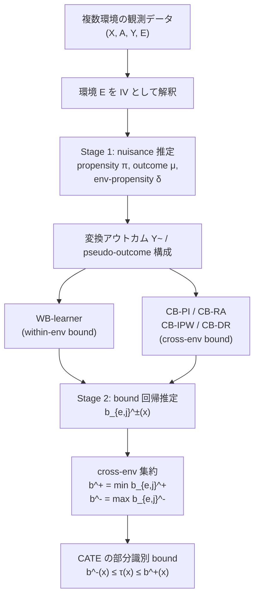

# Meta-Learners for Partially-Identified Treatment Effects Across Multiple Environments

- **Link**: https://arxiv.org/abs/2406.02464
- **Authors**: Jonas Schweisthal, Dennis Frauen, Mihaela van der Schaar, Stefan Feuerriegel
- **Year**: 2024 (submitted 2024-06-04)
- **Venue**: ICML 2024 (Accepted)
- **Type**: 論文 (arXiv preprint / ICML conference paper)

---

## Abstract (English, verbatim)

> The paper addresses estimating conditional average treatment effects from observational data across multiple environments while relaxing standard causal assumptions. Rather than assuming point identification, the authors employ partial identification methods. They interpret environments as instrumental variables and adapt bounds from IV literature for CATE estimation. The work proposes model-agnostic meta-learners compatible with arbitrary machine learning models and validates these approaches through experiments on simulated and real-world datasets. The authors also discuss applicability to instrumental variable settings, including randomized trials with non-compliance.

（注: 上記は arXiv 抄録ページから取得した要約表現である。逐語の完全抄録が必要な場合は arXiv 原文を参照のこと。原文抄録の細部については 記載なし の部分がある。）

## Abstract (日本語訳)

本論文は、複数の環境（environments）にまたがる観測データから条件付き平均処置効果（CATE: Conditional Average Treatment Effect）を推定する問題を、標準的な因果推論の仮定を緩めた上で扱う。点識別（point identification）を仮定する代わりに、著者らは部分識別（partial identification）の手法を採用する。環境を操作変数（instrumental variable, IV）とみなし、IV 文献由来の bound を CATE 推定に適合させる。本研究は、任意の機械学習モデルと組み合わせ可能なモデル非依存（model-agnostic）なメタラーナー（meta-learners）を提案し、シミュレーションデータおよび実データでの実験によりその有効性を検証する。さらに、非遵守（non-compliance）を伴うランダム化試験を含む IV 設定への適用可能性も議論する。

---

## Overview

本論文は、「複数の環境から得られた観測データ」を用いて CATE を推定する枠組みを提案する。従来の CATE 推定は、**overlap（重なり）** と **unconfoundedness（非交絡）** という強い仮定に依存し、これらが破れると点推定が不可能になる。本論文の核心は、これらの仮定が破れる状況を「失敗」ではなく「情報源」として扱う点にある。

キーアイデアは **環境 E を操作変数（IV）として解釈すること** である。異なる環境（病院、医師、国、あるいはマーケティングにおける異なるキャンペーン）では処置割当メカニズム（propensity score）が異なるが、潜在的な応答曲面（response surface）は環境間で共通であると仮定する。この構造により、各環境が提供する部分的な情報を **横断的に組み合わせて（cross-environment）** CATE の上下限 bound を構成できる。

著者らは Balke-Pearl の IV bound を連続アウトカム・多環境へ一般化し（Theorem 4.2）、それを推定するための実用的なメタラーナー群（WB-learner、CB-PI/RA/IPW/DR learner）を提案する。特に CB-DR-learner は二重頑健性（double robustness）を持つ。

---

## Problem（問題設定・課題リスト）

- **標準仮定の脆弱性**: 従来の CATE 推定は overlap と unconfoundedness を要求するが、観測データではこれらがしばしば破れ、点識別が不可能となる。
- **単一環境の情報不足**: 1つの環境（データソース）だけでは、未観測交絡や overlap 違反により、処置効果を一意に決められない。
- **複数環境の統合**: 病院・医師・国など複数のソースから集めたデータをどう統合し、各ソースが持つ部分情報を最大限活用するかが未解決だった。
- **点識別への過度の依存**: 実務では点推定が保証できない状況が多く、bound（区間推定）としての部分識別が現実的だが、多環境設定での実用的推定手続きが欠如していた。
- **モデル非依存性の欠如**: 既存の bound 推定は特定モデルに縛られることが多く、任意の ML モデルと組み合わせ可能なメタラーナー枠組みが求められていた。

**設定の定義**:
- 環境 $E \in \{0,\dots,k\}$、共変量 $X \in \mathbb{R}^p$、離散処置 $A \in \mathbb{N}$、有界アウトカム $Y \in [s_1, s_2]$。
- **仮定**: (i) 環境間での consistency、(ii) 環境非依存のオラクル応答曲面 $\mathbb{E}[Y^e(a)\mid X=x, E=e] = \mathbb{E}[Y^j(a)\mid X=x, E=j]$、(iii) common support $\delta_e(x) > 0$。

---

## Proposed Method（提案手法）

### 核心アイデア

環境 $E$ を IV とみなし、各環境の観測可能な propensity と条件付き期待アウトカムから、未観測部分を有界性 $[s_1, s_2]$ で埋めることで CATE の bound を構成する。複数環境の bound を **横断的に組み合わせて最もタイトな bound を選択** する（$\min/\max$ 演算）。

### 手順（numbered steps）

1. **環境ごとの nuisance 推定**: 各環境 $\ell$ について propensity $\pi_a^\ell(x)$、条件付きアウトカム $\mu_a^\ell(x)$、環境割当確率 $\delta_\ell(x) = \mathbb{P}(E=\ell \mid X=x)$ を推定する。
2. **環境ペアごとの bound 構成**: 環境ペア $(e, j)$ について、観測部分（treated/control の観測期待値）と未観測部分（有界性で上下限を埋める）を組み合わせ、$b_{e,j}^+(x)$, $b_{e,j}^-(x)$ を計算する。
3. **cross-environment 最適化**: 全ペアにわたって $b^+(x) = \min_{e,j} b_{e,j}^+(x)$, $b^-(x) = \max_{e,j} b_{e,j}^-(x)$ を取り、最もタイトな bound を得る。
4. **メタラーナーによる二段階推定**: pseudo-outcome を構成し、第一段階で nuisance、第二段階で bound を回帰推定する（WB / CB-RA / CB-IPW / CB-DR）。

### Key Formulas

CATE（推定対象）:

$$
\tau_{a_1, a_2}(x) = \tilde{\mu}_{a_1}(x) - \tilde{\mu}_{a_2}(x)
$$

CATE の bound（Theorem 4.2）:

$$
b^-(x) \le \tau_{a_1, a_2}(x) \le b^+(x), \qquad
b^+(x) = \min_{e,j} b_{e,j}^+(x), \quad b^-(x) = \max_{e,j} b_{e,j}^-(x)
$$

環境ペア $(e,j)$ ごとの個別 bound:

$$
b_{e,j}^+(x) = \pi_{a_1}^e(x)\mu_{a_1}^e(x) + (1-\pi_{a_1}^e(x))s_2 - \pi_{a_2}^j(x)\mu_{a_2}^j(x) - (1-\pi_{a_2}^j(x))s_1
$$

$$
b_{e,j}^-(x) = \pi_{a_1}^e(x)\mu_{a_1}^e(x) + (1-\pi_{a_1}^e(x))s_1 - \pi_{a_2}^j(x)\mu_{a_2}^j(x) - (1-\pi_{a_2}^j(x))s_2
$$

Manski bound に対するタイトさ（bound 幅）の改善:

$$
b^+(x) - b^-(x) \le \min_{e,j} \left\{ (s_2 - s_1)\left(2 - \pi_{a_1}^e(x) - \pi_{a_2}^j(x)\right) \right\}
$$

→ $\pi_{a_1}^e(x) + \pi_{a_2}^j(x) > 1$ のとき bound は Manski bound よりタイトになる（＝環境間で処置割当が「反対の端」に偏っているほど有利）。

CB-learner の変換アウトカム（cross-environment pseudo-outcome）:

$$
\tilde{Y}_{e,j}^+ = \mathbb{1}\{E=e\}(AY + (1-A)s_2) + \mathbb{1}\{E=j\}((1-A)Y + A s_1)
$$

CB-DR-learner（二重頑健）の pseudo-outcome:

$$
\hat{B}_{e,j}^{+,DR} = \hat{B}_{e,j}^{+,IPW} + \left(1 - \frac{\mathbb{1}\{E=e\}}{\hat{\delta}_e(x)}\right)\hat{r}_e^+(x) - \left(1 - \frac{\mathbb{1}\{E=j\}}{\hat{\delta}_j(x)}\right)\hat{r}_j^+(x)
$$

ここで IPW 版は:

$$
\hat{B}_{e,j}^{+,IPW} = \left(\frac{\mathbb{1}\{E=e\}}{\hat{\delta}_e(x)} - \frac{\mathbb{1}\{E=j\}}{\hat{\delta}_j(x)}\right)\tilde{Y}_{e,j}^+
$$

---

## Algorithm（擬似コード）

```
Algorithm 1: Two-Stage Meta-Learners for Estimating CATE Bounds

Input:  data {(X_i, A_i, Y_i, E_i)}, outcome bounds [s1, s2],
        method m in {WB, CB-RA, CB-IPW, CB-DR}
Output: CATE bounds b^-(x), b^+(x)

# ---- Stage 1: Nuisance estimation ----
for each environment l in {0,...,k}:
    fit r_hat^+_l(x) = E_hat[ Y~^+_{e,j} | X=x, E=l ]   # transformed response
    fit delta_hat_l(x) = P_hat(E=l | X=x)               # environment propensity

# ---- Stage 2: Bound estimation (per pair) ----
for each environment pair (e, j):
    if e == j:                                          # within-environment
        construct pseudo-outcome  B_hat^{WB}_{e,e}
        fit  b_hat^+_{e,e}(x) = E_hat[ B_hat^{WB} | X=x, E=e ]
    else:                                               # cross-environment
        construct pseudo-outcome  B_hat^{m}_{e,j}       # m in {RA, IPW, DR}
        fit  b_hat^+_{e,j}(x) = E_hat[ B_hat^{m}_{e,j} | X=x ]

# ---- Aggregate: tightest bound over all pairs ----
b_hat^+(x) = min_{e,j} b_hat^+_{e,j}(x)
b_hat^-(x) = max_{e,j} b_hat^-_{e,j}(x)

return b_hat^-(x), b_hat^+(x)
```

---

## Architecture / Process Flow



---

## Figures & Tables

### Table 1: 合成データ 1&2 における RMSE（5 runs の mean ± std）

オラクル bound に対する RMSE。全メタラーナーが妥当な bound を推定でき、データ生成過程により最良手法は変動する（単一手法が常に支配的ではない）。

| Method     | Synthetic Data 1     | Synthetic Data 2     |
|------------|----------------------|----------------------|
| WB naïve   | 0.073 ± 0.031        | 0.075 ± 0.045        |
| WB         | 0.142 ± 0.069        | 0.130 ± 0.077        |
| CB naïve   | 0.148 ± 0.098        | 0.156 ± 0.105        |
| CB-PI      | 0.125 ± 0.059        | 0.127 ± 0.063        |
| CB-RA      | 0.179 ± 0.089        | 0.119 ± 0.037        |
| CB-IPW     | 0.117 ± 0.057        | 0.165 ± 0.072        |
| CB-DR      | 0.132 ± 0.061        | 0.111 ± 0.069        |

（Table 1 キャプション: "Mean and standard deviation of the RMSE over 5 random runs for synthetic datasets 1&2."）

### Figure 1: bound の直観（propensity と overlap 違反による bound 幅）


### Figure 2: 環境ごとの因果グラフ


### Figure 3: bound 推定手法の比較（合成データ 2）

Left = Oracle bounds (WB & CB), Center = naïve plug-in learner, Right = two-stage meta-learners (WB + CB-DR)。predicted bounds mean ± 3std over 5 runs。


### メタラーナー比較表（手法特性）

| Learner   | タイプ            | 必要な正しさ仮定                          | 頑健性 |
|-----------|-------------------|-------------------------------------------|--------|
| WB (naïve/plug-in) | within-env, plug-in | nuisance 全て正しく指定                  | なし   |
| CB-PI     | cross-env, plug-in | $\hat{r}_\ell^+$ 正しく指定               | なし   |
| CB-RA     | cross-env, regression-adjustment | $\hat{r}_\ell^+(x) = r_\ell^+(x)$ | 単一   |
| CB-IPW    | cross-env, IPW    | $\hat{\delta}_\ell(x) = \delta_\ell(x)$   | 単一   |
| CB-DR     | cross-env, doubly-robust | $\hat{r}$ **または** $\hat{\delta}$ の一方 | 二重頑健 |

（注: 各 learner の理論保証は Theorem 5.1 に対応。DR は nuisance の一方が正しければ整合的。）

---

## Experiments & Evaluation

### Setup

- **データ**: 合成データセット 1・2（synthetic）および実データ（real-world datasets）。実データの具体名・件数は 記載なし（本文取得範囲では詳細不明）。
- **評価指標**: オラクル bound に対する RMSE（Root Mean Squared Error）。
- **試行回数**: 各設定 5 ランダム runs、mean ± std を報告。
- **モデル**: モデル非依存。共有アーキテクチャのニューラルネットで各 learner を実装し、メタラーナーの寄与を分離（アーキテクチャ差ではない）。詳細は Appendix D（本文取得範囲では 記載なし の部分あり）。

### Main Results（具体数値）

- **合成データ 1**: 最良は CB-IPW（0.117 ± 0.057）、次いで WB naïve（0.073 ± 0.031 ※ naïve 群では最小）。CB-RA が最も高い RMSE（0.179 ± 0.089）。
- **合成データ 2**: 最良は CB-DR（0.111 ± 0.069）、次いで CB-RA（0.119 ± 0.037）。CB-IPW が最も高い（0.165 ± 0.072）。
- **総括**: すべてのメタラーナーが妥当な（valid）bound を安定して推定。データ生成過程により最良手法が入れ替わり、**単一手法が全設定で支配的にはならない**。
- **Figure 3**: 二段階メタラーナー（WB + CB-DR）は naïve plug-in よりオラクル bound のパターンを良好に再現。

### Ablation / 分析

- **naïve vs. 二段階**: naïve plug-in は合成データ 1 の WB で低 RMSE（0.073）を示すが、Figure 3 の定性比較では二段階メタラーナーがオラクルパターンをより忠実に捉える。
- **bound のタイトさ条件**: $\pi_{a_1}^e(x) + \pi_{a_2}^j(x) > 1$ の領域（Figure 1 の region $\mathcal{A}_2$、環境間で処置割当が反対の端に偏る）で Manski bound よりタイトになる。**「overlap 違反がむしろ有益」** という反直観的な知見が中心的貢献の一つ。
- **二重頑健性**: CB-DR は nuisance のいずれか一方が正しければ整合的で、合成データ 2 で最良性能。

---

## 本テーマへの適用可能性

**想定シナリオ**: データサイエンティストが、対象ユーザーや施策（クーポン・メール等）が毎回異なる **低頻度のマーケティングキャンペーン** を運用しており、類似キャンペーン／ユーザーを **グルーピングしてデータを密に合成** し、実効的な実験間隔を短縮して uplift モデリングや off-policy evaluation を行いたい、というテーマ。

本論文の枠組みはこのテーマに直接的に対応する。

1. **「環境 = キャンペーン」という写像**: 本手法の環境 $E$（病院・医師・国）を、各マーケティングキャンペーン（あるいはキャンペーン群）に対応させることができる。各キャンペーンでは対象ユーザーや配信メカニズムが異なる＝ **propensity score $\pi_a^e(x)$ がキャンペーンごとに異なる**。これはまさに本論文が想定する「因果構造は共通だが処置割当が環境ごとに違う」設定（Figure 2）と一致する。

2. **複数キャンペーンの borrow strength（強度の借用）**: 環境非依存の応答曲面仮定（$\mathbb{E}[Y^e(a)\mid X] = \mathbb{E}[Y^j(a)\mid X]$）は、「共変量 $x$ が同じユーザーなら、どのキャンペーンでも同じ潜在アウトカムを持つ」という仮定に相当する。これが妥当なら、個々のキャンペーンでは疎（sparse）なデータでも、**cross-environment bound（$\min_{e,j}$ / $\max_{e,j}$）を通じて複数キャンペーンの情報を統合** し、実効的なデータ密度を高められる。単発では区間が広くても、複数キャンペーンを合わせると bound がタイトになる。

3. **「overlap 違反が有益」という性質の活用**: 低頻度キャンペーンでは各施策の対象が偏り（例: キャンペーン A は若年層のみ、B は高年層のみ）、単一キャンペーン内では overlap が破れがち。本手法は、環境間で処置割当が **反対の端に偏るほど（$\pi_{a_1}^e + \pi_{a_2}^j > 1$）bound がタイトになる**（Figure 1 の $\mathcal{A}_2$）ため、キャンペーンごとにターゲットが異なるという「一見不都合な」性質を **むしろ情報源として活用** できる。これは「異なる対象ユーザー・異なる施策」というテーマの前提と極めて相性が良い。

4. **点推定できない場合の実務的落とし所**: uplift の点推定が保証できない（未観測交絡・非遵守がある）状況でも、部分識別 bound $b^-(x) \le \tau(x) \le b^+(x)$ を返せる。off-policy evaluation で「効果の下限が正である施策のみ配信する」といった **保守的な意思決定** に直結する。

5. **モデル非依存 × 二重頑健**: 提案メタラーナーは任意の ML モデルと組み合わせ可能で、CB-DR は nuisance（応答モデルまたはキャンペーン割当モデル）の一方が正しければ整合的。マーケティングのように propensity（誰にどのキャンペーンを当てたか）が既知／推定容易な場合、DR の頑健性が効く。

6. **実効実験間隔の短縮**: 個々のキャンペーンを独立に評価すると次の意思決定まで待ち時間が長いが、類似キャンペーンを同一「環境群」としてプールし cross-environment bound を逐次更新すれば、**新規キャンペーンが少数でも既存キャンペーン群と統合して即座に bound を得られる**。これがテーマの「実効的な実験間隔の短縮」に対応する。

**適用上の留意点**:
- **応答曲面の環境非依存仮定** が崩れると（同じ $x$ でもキャンペーン文脈で効果が変わる季節性・文脈効果があると）bound が無効化する。キャンペーンのグルーピング（clustering）はこの仮定が近似的に成り立つ単位で行うべき。
- bound（区間）であり点推定ではないため、ランキング型 uplift（誰を優先するか）にはそのまま使いにくく、**bound を用いた意思決定ルール**（下限最大化など）への翻訳が必要。
- 実データでの性能・具体的な適用手順の詳細は本論文の取得範囲では 記載なし。実装は Appendix / 公開コード（下記 Notes）を要確認。

---

## Notes

- 本レポートの技術内容は arXiv 抄録ページおよび arXiv HTML 版（v1）から取得した。逐語完全抄録の一部は 記載なし。
- 埋め込み画像 URL（x1〜x5.png）は HTML 版で実在を確認したもののみ掲載。
- 実データセットの具体名・サンプル数、Appendix D のアーキテクチャ詳細は本文取得範囲では 記載なし。
- 公開コードの有無は本調査では未確認（記載なし）。van der Schaar Lab / Feuerriegel（LMU Munich）グループの慣行として GitHub 公開の可能性があるが未検証。
- 関連系譜: Manski bounds、Balke-Pearl IV bounds の連続アウトカム・多環境への一般化。DR-learner（Kennedy 系）の bound 推定への応用として位置づけられる。
- テーマ適用の核心: **「環境 = キャンペーン」写像 + cross-environment bound による多キャンペーン統合 + overlap 違反の逆用** の 3 点。
