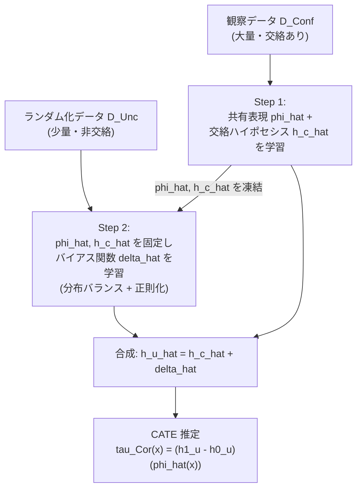

# Combining Observational and Randomized Data for Estimating Heterogeneous Treatment Effects (CorNet)

- **Link**: https://arxiv.org/abs/2202.12891
- **Authors**: Tobias Hatt, Jeroen Berrevoets, Alicia Curth, Stefan Feuerriegel, Mihaela van der Schaar
- **Year**: 2022 (arXiv 提出: 2022-02-25)
- **Venue**: arXiv preprint [stat.ML] / [cs.LG]（本論文の arXiv 版。後続の関連拡張として arXiv:2410.21343 "Combining *Incomplete* Observational and Randomized Data …" が存在）
- **Type**: 研究論文（理論解析 + アルゴリズム提案、CATE / HTE 推定）
- **Code**: https://github.com/tobhatt/CorNet

---

## Abstract (English, verbatim)

> Estimating heterogeneous treatment effects is an important problem across many domains. In order to accurately estimate such treatment effects, one typically relies on data from observational studies or randomized experiments. Currently, most existing works rely exclusively on observational data, which is often confounded and, hence, yields biased estimates. While observational data is confounded, randomized data is unconfounded, but its sample size is usually too small to learn heterogeneous treatment effects. In this paper, we propose to estimate heterogeneous treatment effects by combining large amounts of observational data and small amounts of randomized data via representation learning. In particular, we introduce a two-step framework: first, we use observational data to learn a shared structure (in form of a representation); and then, we use randomized data to learn the data-specific structures. We analyze the finite sample properties of our framework and compare them to several natural baselines. As such, we derive conditions for when combining observational and randomized data is beneficial, and for when it is not. Based on this, we introduce a sample-efficient algorithm, called CorNet. We use extensive simulation studies to verify the theoretical properties of CorNet and multiple real-world datasets to demonstrate our method's superiority compared to existing methods.

---

## Abstract（日本語訳）

異質処置効果（heterogeneous treatment effects, HTE）の推定は多くの領域で重要な問題である。こうした処置効果を正確に推定するには、通常、観察研究（observational study）またはランダム化実験（randomized experiment）のデータに依拠する。既存研究の多くは観察データのみに依存するが、観察データはしばしば交絡（confounded）しており、その結果バイアスのある推定を生む。観察データは交絡している一方、ランダム化データは非交絡（unconfounded）だが、そのサンプルサイズは異質処置効果を学習するには通常小さすぎる。本論文では、大量の観察データと少量のランダム化データを表現学習（representation learning）を通じて統合することで異質処置効果を推定することを提案する。具体的には二段階フレームワークを導入する。まず観察データを用いて共有構造（representation の形で）を学習し、次にランダム化データを用いてデータ固有の構造を学習する。フレームワークの有限標本特性（finite sample properties）を解析し、いくつかの自然なベースラインと比較する。これにより、観察データとランダム化データの統合が有益となる条件、および有益とならない条件を導出する。これに基づき、標本効率の良いアルゴリズム CorNet を提案する。広範なシミュレーション研究で CorNet の理論的特性を検証し、複数の実世界データセットで既存手法に対する優位性を実証する。

---

## Overview

CorNet は「大量だが交絡した観察データ」と「少量だが非交絡なランダム化データ（RCT）」という、性質の異なる 2 種類のデータを組み合わせて CATE（Conditional Average Treatment Effect）を推定するための手法である。中核となる着想は次の 2 点に整理される。

1. **交絡バイアスを共有表現上の関数として定式化する**。観察データから推定される「交絡ハイポセシス」$h^c$ と真の「非交絡ハイポセシス」$h^u$ の差 $\delta = h^u - h^c$ を、共有表現 $\phi^*$ 上のバイアス関数として明示的に表す。
2. **二段階学習**。第 1 段階で大量の観察データから共有表現 $\hat\phi$ と交絡ハイポセシス $\hat h^c$ を学習し、第 2 段階で少量のランダム化データからバイアス関数 $\hat\delta$ のみを学習する。バイアス関数はしばしば元のハイポセシスより単純であるため、少数のランダム化サンプルでも学習できる。

理論面では有限標本 PEHE 上界（Theorem 2）を導出し、誤差を支配する 3 因子（観察データ量、分布不一致、バイアス関数の複雑さ）を特定する。この上界を「ランダム化のみ」「観察のみ」「平均化」「重み付け」の各ベースラインと比較し、**どのような条件下でデータ統合が有益になるか**を明らかにする点が本論文の理論的貢献である。

---

## Problem

- **HTE / CATE 推定の目的**: 個体の共変量 $x$ に対する処置効果 $\tau(x) = \mathbb{E}[Y(1) - Y(0) \mid X = x]$ を推定したい。
- **観察データの弱点**: サンプルは大量に得られるが、未観測交絡（unobserved confounding）により推定にバイアスが生じる（$\tau_{\text{Conf}}$ はバイアス項 $\Delta$ を残す）。
- **ランダム化データの弱点**: 交絡がなく不偏だが、RCT はコスト・倫理・時間の制約からサンプルサイズが小さく、単独では異質性を学習するには不十分。
- **既存手法の限界**: 多くの手法が観察データ単独に依存する。両データ統合を扱う先行研究（平均化・重み付けなど）はあるが、**いつ統合が有益か／有益でないか**の有限標本的条件が明確でなかった。
- **課題の本質**: 「大量・バイアス有り」と「少量・不偏」という補完的データをどう組み合わせれば、少ないランダム化サンプルで不偏かつ低分散の CATE を得られるか。

---

## Proposed Method

### 中核アイデア

未観測交絡によるバイアスを、共有表現 $\phi^*$ 上のバイアス関数 $\delta_t = h_t^u - h_t^c$ として定式化する。観察データとランダム化データは同じ共有表現 $\phi^*$ を持ち、両者の違いは処置ごとのハイポセシス（$h_t^c$ vs $h_t^u$）に集約されると仮定する。すると次の分解が成り立つ。

$$
\mathbb{E}[Y(t)\mid X^{\text{Conf}}=x] - \mathbb{E}[Y^{\text{Conf}}\mid T^{\text{Conf}}=t, X^{\text{Conf}}=x] = (h_t^u - h_t^c)\circ \phi^*(x) = \delta_t \circ \phi^*(x)
$$

データ生成モデルは以下の通り（$\varepsilon$ はノイズ）。

$$
Y^{\text{Conf}} \sim h^c_{T^{\text{Conf}}}\circ\phi^*(X^{\text{Conf}}) + \varepsilon^c, \qquad
Y^{\text{Unc}} \sim h^u_{T^{\text{Unc}}}\circ\phi^*(X^{\text{Unc}}) + \varepsilon^u
$$

### 手順（numbered steps）

1. **Step 1（観察データで共有表現 + 交絡ハイポセシスを学習）**: 観察データ上の二乗損失を最小化し、$\hat\phi$ と $\hat{\mathbf h}^c = (\hat h_1^c, \hat h_0^c)$ を得る。
2. **Step 2（ランダム化データでバイアス関数を学習）**: Step 1 で固定した $\hat\phi, \hat{\mathbf h}^c$ の上で、バイアス関数 $\hat{\boldsymbol\delta} = (\hat\delta_1, \hat\delta_0)$ をランダム化データの二乗損失最小化で学習する。
3. **非交絡ハイポセシスの合成**: $\hat h_t^u = \hat h_t^c + \hat\delta_t$。
4. **CATE 推定**: $\hat\tau_{\text{Cor}}(x) = (\hat h_1^u - \hat h_0^u)\circ\hat\phi(x)$。
5. **CorNet 固有の実装工夫**: (a) 観察データとランダム化データの表現空間上の共変量分布をバランス（balancing）する、(b) 小さいランダム化標本での過学習を防ぐためバイアス関数を正則化（regularization）してその複雑さ $\mathcal{C}_{\mathcal B}$ を抑える。

### Key Formulas

**Step 1: 共有表現と交絡ハイポセシスの推定**

$$
\hat\phi,\ \hat{\mathbf h}^c = \arg\min_{\phi\in\Phi,\ \mathbf h^c\in\mathcal H^{\otimes 2}} \hat\epsilon_{\text{Conf}}(\mathbf h^c,\phi),
\qquad
\hat\epsilon_{\text{Conf}}(\mathbf h^c,\phi) = \frac{1}{n^{\text{Conf}}}\sum_{i=1}^{n^{\text{Conf}}}\big(h^c_{t_i^{\text{Conf}}}\circ\phi(x_i^{\text{Conf}}) - y_i^{\text{Conf}}\big)^2
$$

**Step 2: バイアス関数の推定**

$$
\hat{\boldsymbol\delta} = \arg\min_{\boldsymbol\delta\in\mathcal B^{\otimes 2}} \hat\epsilon_{\text{Unc}}(\boldsymbol\delta,\hat{\mathbf h}^c,\hat\phi),
\qquad
\hat\epsilon_{\text{Unc}}(\boldsymbol\delta,\hat{\mathbf h}^c,\hat\phi) = \frac{1}{n^{\text{Unc}}}\sum_{i=1}^{n^{\text{Unc}}}\big((\hat h^c_{t_i^{\text{Unc}}} + \delta_{t_i^{\text{Unc}}})\circ\hat\phi(x_i^{\text{Unc}}) - y_i^{\text{Unc}}\big)^2
$$

**最終 CATE 推定量**

$$
\hat h_t^u = \hat h_t^c + \hat\delta_t, \qquad
\hat\tau_{\text{Cor}}(x) = (\hat h_1^u - \hat h_0^u)\circ\hat\phi(x)
$$

**有限標本 PEHE 上界（Theorem 2）**

$$
\epsilon_{\text{PEHE}}(\hat\tau_{\text{Cor}}) \le \tilde{\mathcal O}\!\left(\frac{\mathcal C_\Phi + \mathcal C_{\mathcal H}}{\sqrt{n^{\text{Conf}}}} + \frac{d_\infty\big(p_\phi^{\text{Conf}}\,\|\,p_\phi^{\text{Unc}}\big)\cdot \mathcal C_{\mathcal B}}{\sqrt{n^{\text{Unc}}}}\right)
$$

ここで分布不一致は $d_\infty(p_\phi^{\text{Conf}}\|p_\phi^{\text{Unc}}) = \sup_z \frac{p_\phi^{\text{Conf}}(z)}{p_\phi^{\text{Unc}}(z)}$。

**観察のみ推定量のバイアス（Theorem 5）**

$$
\epsilon_{\text{PEHE}}(\hat\tau_{\text{Conf}}) \le \tilde{\mathcal O}\!\left(\frac{\mathcal C_\Phi + \mathcal C_{\mathcal H}}{\sqrt{n^{\text{Conf}}}}\right) + 2\Delta,
\qquad \Delta = \mathbb{E}\big[((\delta_1-\delta_0)\circ\phi^*(X^{\text{Conf}}))^2\big]
$$

---

## Algorithm（Pseudocode）

```
Algorithm: CorNet
Input : Observational data D_Conf = {(x_i, t_i, y_i)}_{i=1..n_Conf}  (large, confounded)
        Randomized data   D_Unc  = {(x_j, t_j, y_j)}_{j=1..n_Unc}   (small, unconfounded)
        function classes Phi (representations), H (hypotheses), B (bias functions)
Output: CATE estimator tau_Cor(x)

# ---- Step 1: learn shared representation + confounded hypotheses on obs. data ----
(phi_hat, h_c_hat) <- argmin_{phi in Phi, h_c in H^{x2}}
        (1/n_Conf) * sum_i ( h_c[t_i](phi(x_i)) - y_i )^2

# ---- Step 2: learn bias function on randomized data (phi_hat, h_c_hat frozen) ----
# balance covariate distributions of D_Conf and D_Unc in representation space
# regularize delta to control complexity C_B (small RCT sample)
delta_hat <- argmin_{delta in B^{x2}}
        (1/n_Unc) * sum_j ( ( h_c_hat[t_j] + delta[t_j] )(phi_hat(x_j)) - y_j )^2
        + lambda * Reg(delta)

# ---- Compose unconfounded hypotheses and CATE ----
for t in {0,1}:
    h_u_hat[t] <- h_c_hat[t] + delta_hat[t]
return tau_Cor(x) = ( h_u_hat[1] - h_u_hat[0] )( phi_hat(x) )
```

---

## Architecture / Process Flow



処理の要点は「共有構造（$\phi^*, h^c$）は大量の観察データで学び、データ固有の差分（バイアス $\delta$）だけを少量のランダム化データで学ぶ」という**役割分担**にある。

---

## Figures & Tables

> 注意（anti-hallucination）: 本節の実験数値の一部は arXiv HTML（ar5iv）のレンダリングが実験セクションで途切れていたため、論文本体からの直接抽出ではなく、CorNet を引用・追試した二次情報（web 検索）に基づく。該当箇所は「二次情報」と明記する。論文本体で未確認の値は「記載なし」とした。図画像 URL は HTML 中で実際に確認できたもののみ掲載する。

### 図: 誤差上界を支配する 3 因子（Figure 2）


キャプション（要約・原文の趣旨）: 観察サンプル数を増やしたときの $\epsilon_{\text{PEHE}}$ の挙動を示す。他パラメータは固定。実線（青）が正則化なし二段階手続き、破線（青）が $\hat\tau_{\text{Cor}}$ の誤差を表し、いずれも観察サンプル数の増加とともに $\epsilon_{\text{PEHE}}$ が減少することを示す。

（Figure 1 は手続きの概念図: 交絡データ $\mathcal D^{\text{Conf}}$ と非交絡データ $\mathcal D^{\text{Unc}}$ を用いて非交絡推定を学習する、という概念図。対応する画像 URL は HTML から確認できなかったため未掲載。）

### 表 1: 本論文の問い・答えの対応表（Table 1、構造は本文で確認）

| 問い | 答え | 参照 |
|------|------|------|
| 観察 + ランダム化データをどう統合するか | 二段階フレームワーク | Section 4 |
| 有限標本誤差を駆動する因子は何か | 観察データ量 / 分布不一致 $d_\infty$ / バイアス関数の複雑さ $\mathcal C_{\mathcal B}$ | Section 5, Theorem 2 |
| いつ統合すべきか | 観察大・ランダム化小、かつ分布不一致が大きいとき | Section 5.3, Proposition 11 |
| 効率的な統合法は | CorNet: 共変量バランス + バイアス正則化 | Section 6, Algorithm 1 |

### 表 2: 手法比較（理論的な PEHE 上界の対応）

| 推定量 | 使うデータ | PEHE 上界（概略） | 特徴 |
|--------|-----------|-------------------|------|
| $\hat\tau_{\text{Unc}}$（ランダム化のみ） | RCT のみ | $\tilde{\mathcal O}\big(\bar d_\infty \frac{\mathcal C_\Phi+\mathcal C_{\mathcal H}}{\sqrt{n^{\text{Unc}}}}\big)$ (Thm 4) | 不偏だが $n^{\text{Unc}}$ 小で高分散 |
| $\hat\tau_{\text{Conf}}$（観察のみ） | 観察のみ | $\tilde{\mathcal O}\big(\frac{\mathcal C_\Phi+\mathcal C_{\mathcal H}}{\sqrt{n^{\text{Conf}}}}\big)+2\Delta$ (Thm 5) | 低分散だがバイアス $\Delta$ が残る |
| $\hat\tau_{\text{Avg}}(\lambda)$（平均化） | 両方 | $\tilde{\mathcal O}\big((1-\lambda)\bar d_\infty\frac{\cdots}{\sqrt{n^{\text{Unc}}}}+\lambda\frac{\cdots}{\sqrt{n^{\text{Conf}}}}\big)+2\lambda\Delta$ (Thm 7) | バイアス–分散を $\lambda$ で調整 |
| $\hat\tau_{\text{Weight}}(\Lambda)$（重み付け） | 両方 | $\hat\tau_{\text{Avg}}$ と同型の上界 (Thm 9) | 重み付きリスク最小化 |
| **CorNet** $\hat\tau_{\text{Cor}}$ | 両方（二段階） | $\tilde{\mathcal O}\big(\frac{\mathcal C_\Phi+\mathcal C_{\mathcal H}}{\sqrt{n^{\text{Conf}}}}+\frac{d_\infty\,\mathcal C_{\mathcal B}}{\sqrt{n^{\text{Unc}}}}\big)$ (Thm 2) | RCT 項はバイアス複雑度 $\mathcal C_{\mathcal B}$ のみに依存 → 標本効率が良い |

CorNet の上界は、ランダム化データに関する項が「ハイポセシスの複雑さ $\mathcal C_{\mathcal H}$」ではなく「バイアス関数の複雑さ $\mathcal C_{\mathcal B}$」で決まる点が本質的な優位性である（$\mathcal C_{\mathcal B}$ は通常 $\mathcal C_{\mathcal H}$ より小さい）。

### 表 3: 実世界データセットでの $\sqrt{\text{PEHE}}$（二次情報。論文本体で未検証）

| データセット | 概要 | CorNet の $\sqrt{\text{PEHE}}$（二次情報） |
|--------------|------|-------------------------------------------|
| **STAR** | 学級規模が標準テスト成績に与える効果の RCT（1985 年、8 共変量・4,139 生徒） | 0.59 ± 0.01 |
| **ACTG (ACTG 175)** | HIV-1 患者（CD4 200–500）への異なる治療の効果、CD4 変化を outcome とする臨床試験 | 0.42 ± 0.06 |
| **NSW (National Supported Work)** | 職業訓練が収入に与える効果の RCT。ランダム化 465 名 + 観察対照 2,490 名、8 共変量 | 0.14 ± 0.07 |

> 上記 3 値は web 検索由来の二次情報であり、「CorNet が各ベースラインを有意に上回った」と報告されている。各ベースライン（$\tau_{\text{Unc}}, \tau_{\text{Conf}}, \tau_{\text{Avg}}, \tau_{\text{Weight}}$）の具体的数値、および IHDP / ACIC など他データセットの数値は本タスクの取得範囲では**論文本体で直接確認できず、記載なし**（数値の捏造を避けるため未掲載）。

---

## Experiments & Evaluation

### Setup

- **シミュレーション研究**: 有限標本特性（Theorem 2 の 3 因子）を検証。観察サンプル数を変化させたときの $\epsilon_{\text{PEHE}}$ の挙動などを確認（Figure 2）。具体的なシミュレーションパラメータは本タスク取得範囲では記載なし。
- **実世界データセット**: 複数の実世界ランダム化実験 + 観察データ。二次情報では **STAR / ACTG (ACTG 175) / NSW** の 3 データセットが用いられたと報告される。
- **評価指標**: $\sqrt{\text{PEHE}}$（Precision in Estimation of Heterogeneous Effect の平方根、小さいほど良い）。
- **ベースライン**: $\tau_{\text{Unc}}$（ランダム化のみ）、$\tau_{\text{Conf}}$（観察のみ）、$\tau_{\text{Avg}}$（平均化）、$\tau_{\text{Weight}}$（重み付けリスク）。

### Main Results（具体数値）

- **シミュレーション**: CorNet は全設定でベースラインを実質的に上回ると報告（"CorNet substantially outperforms all baselines across all settings" の趣旨。厳密なセル値は取得範囲では記載なし）。
- **実世界（二次情報）**: CorNet の $\sqrt{\text{PEHE}}$ は STAR = 0.59 ± 0.01、ACTG = 0.42 ± 0.06、NSW = 0.14 ± 0.07。いずれもベースラインを有意に上回ったと報告される。各ベースライン個別の数値は記載なし。

### Ablation / 解析

- **3 因子の検証（Figure 2）**: (1) 観察サンプル数 $n^{\text{Conf}}$ が大きいほど誤差減少、(2) 分布不一致 $d_\infty$ が大きいほど（RCT に頼る場合の）誤差が大きい、(3) バイアス関数の複雑さ $\mathcal C_{\mathcal B}$ が小さいほど有利。正則化なしの二段階手続き（実線）と正則化ありの $\hat\tau_{\text{Cor}}$（破線）を比較。
- **統合が有益となる条件（Proposition 11）**: 観察データが大きく、分布不一致が大きく、バイアス関数が単純なとき、CorNet による統合が単独手法より有益。逆にこれらが満たされない場合は統合の利得が小さい／消える。

---

## 本テーマへの適用可能性

**テーマ**: データサイエンティストが、対象ユーザ・施策が毎回異なる低頻度のマーケティング施策（クーポン／メール）を運用しており、類似キャンペーン・類似ユーザを**グルーピングしてデータを密にし、実効的な実験間隔を短縮**したい（uplift モデリング / off-policy 評価向け）。

CorNet の枠組みはこのニーズと構造的に強く適合する。

1. **「大量・バイアス有り」×「少量・不偏」の統合という枠組みがそのまま当てはまる**。マーケティングでは、
   - **観察データ = 過去のオーガニックな配信ログ / 自己選択で配信された施策**（大量だが、誰に配ったかがユーザ属性と相関 → 交絡）、
   - **ランダム化データ = たまに実施する A/B テスト（RCT）**（少量だが不偏）
   という二層構造が典型的である。CorNet は「観察ログで共有表現とベースの反応構造 $h^c$ を学び、少数の A/B テストでバイアス補正 $\delta$ だけを学ぶ」ため、**RCT サンプルが少なくても uplift（CATE）を不偏に近づけられる**。これは「実効的な実験間隔の短縮」（＝少ない RCT で済む）に直接効く。

2. **バイアス関数の複雑さ $\mathcal C_{\mathcal B}$ が RCT サンプル要件を決める**という理論（Theorem 2）は、施策運用の設計指針になる。施策間の反応差が「単純な補正で表せる」なら、必要な A/B テスト規模は小さくてよい。逆に、施策・セグメント間で反応構造が大きく異なる（$\delta$ が複雑）なら、より多くのランダム化サンプルが必要、という定量的な目安を与える。

3. **「類似キャンペーン／ユーザのグルーピングでデータを密にする」着想の理論的裏付け**。CorNet の中核仮定は「観察データと RCT が**共有表現 $\phi^*$ を持つ**」ことである。これは実務上「異なる施策・異なる対象ユーザでも、共通の潜在表現に写像すれば同じ反応構造を共有する」という前提に対応する。すなわち、
   - 施策（クーポン種別・メール文面・チャネル）とユーザ属性を**共通の表現空間 $\phi$ に埋め込む**ことで、個別には疎な複数キャンペーンを「同一表現空間上の 1 つの密なデータ」として束ねられる。
   - グルーピングは表現学習に置き換えられ、**近い表現に写るキャンペーン／ユーザ同士が自然に strength を borrow し合う**（少数施策の情報を隣接施策から補完）。

4. **off-policy 評価への含意**。off-policy 評価では過去ログ（観察・交絡）から新方策の価値を推定するが、バイアスが問題になる。CorNet 流に「大量の過去ログで共有構造 → 少数の RCT でバイアス補正」を行えば、**交絡を含む豊富なログを捨てずに、少量の不偏データで補正した uplift 推定**を得られ、方策選択の精度と更新頻度の両立に寄与する。

5. **実運用上の注意（Proposition 11 の条件）**。統合が効くのは「観察データが十分大きく、観察と RCT の共変量分布のズレ $d_\infty$ が大きく、バイアスが単純」なとき。マーケティングでは配信対象の偏り（自己選択）で $d_\infty$ が大きくなりがちで、これは**むしろ CorNet が有利になる状況**である。一方、施策ごとに反応構造が根本的に異なる（共有表現の仮定が崩れる／$\delta$ が非常に複雑）場合は、無理に全施策をグルーピングせず、表現空間上で近いクラスタ内に限って統合するのが安全。

**要約**: CorNet は「疎な複数キャンペーンを共有表現で束ね、少量の A/B テストでバイアスだけ補正する」という形で、まさにテーマが求める *データ密度の向上*・*実験間隔の短縮*・*strength の借用* を、有限標本の理論保証付きで実現する枠組みを与える。

---

## Notes

- 本レポートの**方法・理論・数式**（Abstract, Step 1/2, Theorem 2/4/5/7/9, Assumption 1–3, Condition 1, Proposition 11, Figure 1/2 のキャプション）は arXiv (abstract ページ) と ar5iv HTML の本文から直接抽出した。
- **実世界データセット名（STAR / ACTG / NSW）と $\sqrt{\text{PEHE}}$ 数値（0.59 / 0.42 / 0.14 ±）** は、ar5iv の実験セクションが本取得ツールでレンダリング途中で途切れたため、web 検索による**二次情報**であり、論文本体での直接照合はできていない。実務で引用する際は原論文の Section 7（Experiments）の該当テーブルで数値を確認すること。
- **各ベースラインの個別数値、シミュレーション結果テーブルの具体セル値、IHDP / ACIC など他データセットの数値**は取得範囲で確認できず「記載なし」とした（捏造回避）。
- Algorithm 1 の明示的な擬似コードは HTML 抽出テキストに完全な形で現れなかったため、本レポートの Pseudocode は本文の Step 1/Step 2 記述と数式に基づく再構成である。
- 図画像 URL は HTML 中で確認できた `assets/x1.png`（Figure 2 相当）のみ掲載。Figure 1 の画像 URL は未確認のため未掲載。
- 関連拡張: arXiv:2410.21343 "Combining *Incomplete* Observational and Randomized Data for Heterogeneous Treatment Effects"（本論文の設定を「不完全な観察データ」に拡張）。
- コード: https://github.com/tobhatt/CorNet
