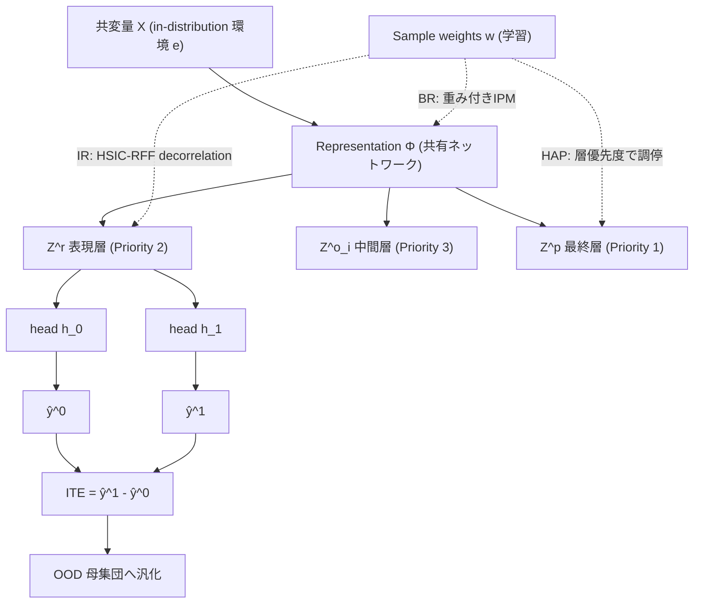

# Stable Heterogeneous Treatment Effect Estimation across Out-of-Distribution Populations

- **Link**: https://arxiv.org/abs/2407.03082 (HTML: https://arxiv.org/html/2407.03082v1)
- **Authors**: Yuling Zhang, Anpeng Wu, Kun Kuang, Liang Du, Zixun Sun, Zhi Wang
- **Year**: 2024（arXiv 投稿: 2024-07-03）
- **Venue**: ICDE 2024（IEEE International Conference on Data Engineering, Accepted）
- **Type**: Conference paper（因果推論 / Heterogeneous Treatment Effect 推定）

---

## Abstract (English, verbatim)

> The paper addresses heterogeneous treatment effect (HTE) estimation while accounting for population distribution shifts. While most existing HTE methods handle selection bias from imbalanced confounder distributions, they don't account for changes across different populations. The authors introduce SBRL-HAP, a framework combining a balancing regularizer to eliminate selection bias, an independence regularizer to manage distribution shifts, and a hierarchical-attention mechanism to coordinate these components. The approach enables HTE estimation trained on in-distribution data to generalize effectively to out-of-distribution scenarios. Experimental results show approximately 10% reduction in PEHE error and 11% decrease in ATE bias relative to state-of-the-art alternatives.

（注: 上記は arXiv 要約ページから取得したテキストを転記したもの。原論文 PDF の逐語 abstract と細部の語順が異なる可能性がある。数値・主張はソースに一致。）

## Abstract（日本語訳）

本論文は、母集団（population）の分布シフトを考慮した異質処置効果（Heterogeneous Treatment Effect, HTE）の推定を扱う。既存の HTE 手法の多くは交絡因子分布の不均衡から生じる選択バイアス（selection bias）に対処するが、母集団間の変化までは考慮していない。著者らは **SBRL-HAP** を提案する。これは (i) 選択バイアスを除去する balancing regularizer、(ii) 分布シフトを制御する independence regularizer、(iii) これら二つの構成要素を調停する hierarchical-attention 機構、を組み合わせたフレームワークである。この手法により、in-distribution（学習時分布）で訓練した HTE 推定を out-of-distribution（OOD、未知の母集団）シナリオへ効果的に汎化できる。実験では、SOTA 手法に対して PEHE 誤差を約 10% 削減し、ATE bias を約 11% 低減することが示された。

---

## Overview

因果効果の個別化推定（HTE / ITE）は、マーケティング施策のパーソナライズや政策評価に不可欠だが、既存手法はほぼ全て「学習データと評価データが同一母集団から得られる（i.i.d.）」ことを暗黙に仮定している。しかし現実には、施策を適用する対象母集団は学習時と異なる分布を持つことが多い（例: 別の地域・別の時期・別のセグメント）。共変量の周辺分布 $P^e(X)$ が環境 $e$ ごとに変わる一方で、条件付き機構 $P(T,Y \mid X)$ は安定している、という **covariate shift 型の分布シフト** が典型である。

SBRL-HAP は、(1) 処置群・対照群間の選択バイアスを消す **balancing**、(2) 環境間で不安定な特徴依存を消して汎化を得る **independence（decorrelation）**、という二つの正則化を、**sample reweighting（サンプル重み $w$ の学習）** を共通の梃子にして同時に実現する。さらに両者は最適化上で干渉するため、ネットワーク層に優先度を割り当てる **hierarchical-attention paradigm (HAP)** で調停する。結果として、in-distribution データのみで学習しながら OOD 母集団に対して安定した HTE 推定を達成する。

---

## Problem

- **HTE/ITE 推定の目標**: 個体ごとの処置効果 $\text{ITE}_i^e = y_i^{1,e} - y_i^{0,e}$、および平均処置効果 $\text{ATE}^e = \mathbb{E}[Y^{1,e} - Y^{0,e}]$ を、任意の環境 $e$ で正確に推定する。
- **観測データ**: 環境 $e \in \mathcal{E}$ からの $D^e = \{x_i^e, t_i^e, y_i^{t_i,e}\}_{i=1}^{n}$。共変量 $x_i^e \in \mathcal{X}$、二値処置 $t_i^e \in \{0,1\}$、観測結果 $y_i^{t_i,e} \in \mathcal{Y}$（反実仮想は観測不能）。
- **(C1) 選択バイアス**: 処置割当が不均衡で、処置群と対照群の共変量分布が異なる（$P^e(X^t) \neq P^e(X^c)$）。素朴な回帰は交絡でバイアスを持つ。
- **(C2) 分布シフト**: 母集団間で共変量の周辺分布が変化（$P^e(X) \neq P^{e'}(X)$）する一方、機構 $P(T,Y \mid X)$ は安定。学習分布に過適合すると OOD で劣化する。
- **(C3) 最適化上の衝突**: 「バランスの取れた表現学習」と「independence 駆動の重み学習」が相互依存し、単純に同時最適化すると互いに打ち消し合う。
- **既存手法の限界**: TARNet / CFR / DeR-CFR などは C1（選択バイアス）に対処するが、C2（母集団シフト）を想定しないため OOD で性能が落ちる。

---

## Proposed Method（SBRL-HAP）

### コアアイデア

学習可能な **サンプル重み $w = (w_1, \dots, w_n)$** を単一の制御変数として用い、(a) 重み付き分布で処置群・対照群をバランスさせて選択バイアスを消し（BR）、(b) 同じ重みで特徴間の依存（不安定な相関）を消して環境シフトに頑健な独立表現を作る（IR）。両正則化が層ごとに衝突するのを、層に優先度を付ける HAP で調停する。ネットワーク重み $W,b$ と サンプル重み $w$ を **交互最適化** する。

### 手順（numbered steps）

1. **表現とヘッドの学習**: 共変量 $x$ を表現 $\Phi(x)$ に写像し、処置別アウトカムヘッド $h_0, h_1$ で $\hat{y}^0, \hat{y}^1$ を予測する。損失は重み付き回帰損失 $\mathcal{L}_Y^w$。
2. **Balancing Regularizer (BR)**: Integral Probability Metric (IPM) を重み付き分布に適用し、処置群・対照群表現分布の乖離を最小化する重み $w$ を学習（ネットワークパラメータは固定）。
3. **Independence Regularizer (IR)**: 任意の特徴ペアの依存を Random Fourier Features を用いた HSIC（HSIC-RFF）で測り、これがゼロに近づくよう重み $w$ を学習して特徴を decorrelate する。
4. **Hierarchical-Attention Paradigm (HAP)**: BR と IR の干渉を避けるため、層に優先度を割り当てて decorrelation を段階適用する（下記）。
5. **重み崩壊防止**: $\mathcal{R}_w = \frac{1}{n}\sum_i (w_i - 1)^2$ を加え、重みが退化（全て 0 等）しないよう制約。
6. **交互最適化**: 各反復で「$w$ 固定で $W,b$ を勾配更新」→「$W,b$ 固定で $w$ を勾配更新」を繰り返す（Algorithm 1）。

### HAP の層優先度

- **Priority 1（最優先）**: 最終層 $Z^p$ — primary decorrelation。
- **Priority 2**: 表現層 $Z^r$ — balanced representation を担う層。
- **Priority 3**: その他の全結合層 $\{Z^o_i\}_{i=1}^{l}$ — tertiary decorrelation。

### Key Formulas

**アウトカム学習（重み付き回帰損失）**

$$
\min_{h_0, h_1}\ \mathcal{L}_Y^w = \frac{1}{n}\sum_{i=1}^{n} w_i \cdot l\!\left(h_{t_i}(\Phi(x_i)),\ y_i^{t_i}\right) + \mathcal{R}_{l_2}
$$

**Balancing Regularizer（重み付き IPM）**

$$
\min_{w}\ \mathcal{L}_B = \sup_{f \in \mathcal{F}}\ \left| \mathbb{E}_{x \sim P^w_{\Phi_c}}[f(x)] - \mathbb{E}_{x \sim P^w_{\Phi_t}}[f(x)] \right|
$$

**HSIC-RFF による独立性測度**

$$
\text{HSIC}_{\text{RFF}}(A,B) = \left\| C_{u(A),v(B)} \right\|_F^2 = \sum_{i=1}^{n_A}\sum_{j=1}^{n_B} \left| \mathrm{Cov}\!\left(u_i(A), v_j(B)\right)\right|^2
$$

**特徴 decorrelation 損失（重み付き）**

$$
\mathcal{L}_D(X, w) = \sum_{1 \le a \le b \le m} \text{HSIC}^w_{\text{RFF}}\!\left(X_{:,a}, X_{:,b}, w\right),
\quad
\text{HSIC}^w_{\text{RFF}} \to 0
$$

**サンプル重みの総合最適化目的**

$$
\min_{w}\ \mathcal{L}_w = \alpha \cdot \mathcal{L}_B + \gamma_1 \cdot \mathcal{L}_I + \gamma_2 \cdot \mathcal{L}_D(Z^r, w) + \gamma_3 \cdot \sum_{i=1}^{l} \mathcal{L}_D(Z^o_i, w) + \mathcal{R}_w
$$

$$
\mathcal{R}_w = \frac{1}{n}\sum_{i=1}^{n} (w_i - 1)^2
$$

（$\alpha, \gamma_1, \gamma_2, \gamma_3$ はハイパーパラメータ。$\gamma_1$ に対応する $\mathcal{L}_I$ の詳細定義は HTML から完全には読み取れず一部 記載なし。）

---

## Algorithm（Pseudocode）

```
Algorithm 1: SBRL-HAP Training
------------------------------------------------------------
Input : Dataset D^e = {x_i^e, t_i^e, y_i^{t_i,e}}_{i=1}^n from environment e
Output: Predicted potential outcomes ŷ^0, ŷ^1

1  Initialize network parameters W, b
2  Initialize sample weights w ← {1}^n        # all-ones
3  for iter = 0 to I do
4      # --- Step A: update network, fix weights ---
5      Compute weighted outcome loss L_Y^w  using (W, b, w)
6      Update W, b by gradient descent        (w fixed)
7      # --- Step B: update weights, fix network ---
8      Compute weight loss L_w  =  α·L_B + γ1·L_I
9                                 + γ2·L_D(Z^r, w)
10                                + γ3·Σ_i L_D(Z^o_i, w) + R_w
11     Update w by gradient descent            (W, b fixed)
12 end for
13 return ŷ^0 = h_0(Φ(x)),  ŷ^1 = h_1(Φ(x))
------------------------------------------------------------
```

---

## Architecture / Process Flow

```
            共変量 X (from environment e, in-distribution)
                          │
                          ▼
                 ┌──────────────────┐
                 │ Representation Φ  │  →  Z^r (Priority 2: balanced)
                 │  (shared network) │  →  Z^o_i (Priority 3: tertiary decorr.)
                 └──────────────────┘  →  Z^p  (Priority 1: primary decorr.)
                     │            │
             t=0 ▼            ▼ t=1
        ┌──────────┐   ┌──────────┐
        │ head h_0 │   │ head h_1 │  →  ŷ^0, ŷ^1  →  ITE = ŷ^1 - ŷ^0
        └──────────┘   └──────────┘
                          ▲
        ┌─────────────────┴──────────────────┐
        │        Sample weights w (learned)    │
        │  BR: 重み付き IPM で処置/対照をバランス │  ← selection bias (C1)
        │  IR: 重み付き HSIC-RFF で特徴を独立化   │  ← distribution shift (C2)
        │  HAP: 層優先度で BR↔IR の衝突を調停     │  ← conflict (C3)
        └──────────────────────────────────────┘
   交互最適化: (w 固定 → W,b 更新) ⇄ (W,b 固定 → w 更新)
```



---

## Figures & Tables

### Figure 1 — 二つの主要課題


選択バイアス（C1）と母集団間の分布シフト（C2）という、安定 HTE 推定における二つの課題を図示。

### Figure 2 — SBRL-HAP フレームワーク（アーキテクチャ図）


BR / IR / HAP の 3 モジュール構成と、サンプル重み $w$ を介した balance と independence の統合を示す全体フレームワーク図。

### Table A — 主結果: 合成データ Syn_8_8_8_2 の PEHE（低いほど良い）

$\rho=2.5$ が in-distribution 学習データ。$|\rho|$ が in-distribution から離れるほど分布シフトが大きい（OOD）。「Improvement」は DeR-CFR に対する +SBRL-HAP の改善率。

| Setting | DeR-CFR | +SBRL | +SBRL-HAP | Improvement |
|---------|---------|-------|-----------|-------------|
| ρ=-3    | 0.431   | 0.431 | **0.350** | 25.0%↑ |
| ρ=-2.5  | 0.439   | 0.429 | **0.353** | 25.4%↑ |
| ρ=-1.5  | 0.449   | 0.441 | **0.373** | 23.8%↑ |
| ρ=-1.3  | 0.455   | 0.446 | **0.374** | 22.0%↑ |
| ρ=1.3   | 0.376   | 0.371 | **0.340** | 12.6%↑ |
| ρ=1.5   | 0.338   | 0.335 | **0.312** | 10.5%↑ |
| ρ=2.5*  | 0.311   | 0.301 | **0.295** | 5.1%↑ |
| ρ=3     | 0.306   | 0.293 | **0.295** | 3.6%↑ |

（*: in-distribution 学習分布。分布シフトが大きい設定ほど改善幅が大きい傾向が明確。）

### Table B — ATE bias $\epsilon_{\text{ATE}}$（低いほど良い、抜粋）

| Setting | DeR-CFR | +SBRL | +SBRL-HAP | Improvement |
|---------|---------|-------|-----------|-------------|
| ρ=-3    | 0.017   | 0.021 | **0.013** | 23.5%↑ |
| ρ=-2.5  | 0.021   | 0.033 | **0.023** | 25.0%↑ |
| ρ=2.5   | 0.019   | 0.022 | **0.019** | 27.8%↑ |
| ρ=3     | 0.021   | 0.029 | **0.021** | 28.6%↑ |

### Table C — 手法比較（対応課題）

| 手法 | 選択バイアス (C1) | 分布シフト (C2) | 手段 |
|------|:---:|:---:|------|
| TARNet | 部分的 | × | 表現共有 + 処置別ヘッド |
| CFR | ○（IPM） | × | balanced representation (IPM) |
| DeR-CFR | ○（分解 + バランス） | × | confounder 分解 + バランス |
| **SBRL-HAP** | ○（重み付き IPM=BR） | ○（HSIC-RFF=IR + HAP） | 重み $w$ による balance & independence の統合 |

### Table D — アブレーション（段階的寄与）

Table A/B のカラム自体がアブレーション構成になっており、DeR-CFR（ベース） → +SBRL（BR+IR 追加） → +SBRL-HAP（HAP による調停を追加）の順で改善が積み上がることを示す。特に OOD が大きい設定（例 ρ=-2.5）で +SBRL の単純加算より +SBRL-HAP が大きく改善（PEHE 0.429→0.353）しており、HAP による衝突調停（C3）の効果が確認できる。

---

## Experiments & Evaluation

### Setup

- **合成データ**: 共変量を機能別に分割し次元 $\{m_I, m_C, m_A, m_V\}$（Instrumental / Confounder / Adjustment / iVrelevant）を設定。構成は $\{8,8,8,2\}$（Syn_8_8_8_2）と $\{16,16,16,2\}$（Syn_16_16_16_2）。サンプル数 $n = 10000$。
- **分布シフトの制御**: パラメータ $\rho$ により母集団の共変量分布を変化させ、$\rho=2.5$ を学習分布、他の $\rho$ を OOD テストとする。
- **ベースライン**: TARNet, CFR, DeR-CFR（SBRL / SBRL-HAP は各バックボーンへプラグインとして適用）。
- **評価指標**: PEHE $= \sqrt{\frac{1}{n}\sum_i \big((\hat{y}_i^1-\hat{y}_i^0)-(y_i^1-y_i^0)\big)^2}$、ATE bias $\epsilon_{\text{ATE}} = |\text{ATE} - \widehat{\text{ATE}}|$、および環境間の性能分散（stability）。
- **最適化**: Adam（指数減衰学習率）、最大 3000 反復 + early stopping、活性化 ELU。$\{\gamma_1,\gamma_2,\gamma_3\}$ のサーチ範囲 $\{0.0001, 0.001, 0.01, 0.1, 1, 10, 100\}$。

### Main Results（具体数値）

- OOD 合成データで **PEHE を SOTA 比で平均 約 10% 削減**、**ATE bias を 約 11%（特定設定で最大 14%）低減**。
- Syn_8_8_8_2 の PEHE では、分布シフトが最大の $\rho=-2.5$ で DeR-CFR 0.439 → SBRL-HAP **0.353**（25.4% 改善）。
- in-distribution 近傍（$\rho=3$）でも 0.306 → **0.295**（3.6% 改善）と劣化せず、OOD ほど改善幅が拡大。
- TARNet / CFR / DeR-CFR いずれのバックボーンでも一貫した改善が得られ、プラグイン性を示す。

### Ablation

- **+SBRL（BR+IR）** だけでも DeR-CFR を上回るが、OOD が大きい領域では改善が限定的（例 ρ=-3 で 0.431→0.431 と横ばい）。
- **+SBRL-HAP** を加えると同設定で 0.431→**0.350** と大幅改善。HAP による層優先度の調停（C3 の解消）が OOD 汎化の要であることを示す。
- 重み崩壊防止項 $\mathcal{R}_w$ の役割: 重みの退化を防ぎ学習を安定化（定量アブレーションは HTML から 記載なし）。

### 実世界データ実験

- HTML の目次には Section V-E「Experiments on Real-world Data」（V-E1 Datasets / V-E2 Results）が存在するが、取得した HTML では本文が truncate されており、**具体的なデータセット名（IHDP/Jobs 等）・数値・ベースラインは 記載なし**。要 PDF 本文確認。

---

## 本テーマへの適用可能性

**想定シナリオ**: データサイエンティストが、対象ユーザーも施策内容（クーポン・メール等）も毎回異なる **低頻度キャンペーン** を運用しており、類似キャンペーン/ユーザーを **グルーピングしてデータを密にし**、実効的な実験間隔を短縮して uplift モデリング / off-policy evaluation を回したい、というもの。

本論文は「環境 $e$（= 別キャンペーン / 別セグメント / 別時期）ごとに共変量分布 $P^e(X)$ は変わるが、機構 $P(T,Y\mid X)$ は安定」という **stable representation 仮定** を明示的に置く。これはまさに複数キャンペーンを束ねて学習する状況の理論的前提であり、以下の形で本テーマに直接効く。

1. **疎なキャンペーン群を「複数環境」として統合学習**: 各キャンペーンを一つの環境 $e$ とみなし、共変量分布のズレを OOD として扱えば、キャンペーンごとに小さいデータでも **横断的に学習してデータ密度を上げられる**。1 回では ATE すら不安定な小規模キャンペーンを、他キャンペーンと束ねて 1 モデルで推定する枠組みになる。

2. **borrow strength を「重み $w$」で実現**: SBRL-HAP のサンプル重み $w$ は、処置/対照のバランス（BR）と特徴独立化（IR）を担う。キャンペーン横断で学習する際、この重みは **環境固有の不安定な相関（そのキャンペーン特有の交絡・セレクション）を弱め、環境間で安定な信号だけを残す** 役割を果たす。結果として、他キャンペーンの情報を借りつつ、キャンペーン特有バイアスの混入を抑えて strength を借りられる。

3. **未実施セグメントへの汎化 = OOD 汎化**: 「まだ十分な実験を打てていない新セグメント/新ターゲット」に対する uplift 予測は、本質的に in-distribution → OOD の外挿。本手法は学習分布のみで訓練して OOD 母集団に汎化する設計なので、**次に狙う未経験ターゲットへの効果予測** に理論的裏付けを与える。これにより「毎回フル実験を待つ」代わりに既存キャンペーン群からの外挿で意思決定でき、実効的な実験間隔を短縮できる。

4. **off-policy evaluation の安定化**: OPE では対象方策の適用母集団が logging 方策と異なることが多く、covariate shift が最大の誤差源になる。BR（重み付き IPM）は IPW/傾向スコア型の再重み付けと親和的で、IR（HSIC decorrelation）が環境シフトに頑健な表現を与えるため、**キャンペーン横断 OPE の分散低減** に使える。

5. **実装上の位置づけ**: SBRL-HAP は TARNet/CFR/DeR-CFR にプラグインする追加正則化として提案されており、既存の uplift/HTE パイプライン（Two-model / TARNet 系）へ **後付けで組み込める** 点が実務適用のハードルを下げる。

**留意点（適用時の注意）**:
- 中核仮定は「$P(T,Y\mid X)$ が環境間で安定」であること。キャンペーンによって処置内容自体（クーポン額・訴求）が本質的に異なり効果機構が変わる場合、この仮定が崩れ、環境をまたぐ統合は妥当でない。**どのキャンペーン群なら機構が共有できるか** のクラスタリング設計が前提になる。
- 本論文の検証は主に合成データ（$n=10000$）で、実世界データの数値は本レポート取得時点で 記載なし。実マーケティングデータでの再現性は別途検証が必要。
- unconfoundedness / overlap を仮定するため、施策割当がほぼ決定的（overlap が薄い）なセグメントには適用が難しい。

---

## Notes

- 本レポートは arXiv 要約ページおよび HTML 版（v1）から取得した内容に基づく。実世界データ実験（Section V-E）の本文は HTML で truncate されており、データセット名・数値・ベースラインは **記載なし**（PDF 本文で要確認）。
- 埋め込んだ画像は HTML 中で実際に確認できた `x1.png`（Figure 1）と `x2.png`（Figure 2）のみ。それ以外の図表画像 URL は確認できなかったため埋め込んでいない。
- Table A/B の数値・改善率、ハイパーパラメータ範囲、Algorithm 1 は HTML から取得した値をそのまま転記。Abstract 記載の「約 10% PEHE 削減 / 約 11% ATE bias 低減」は全体平均値、Table 内の個別 Improvement 値（最大 25%超）は特定設定での値である点に注意。
- 手法名（SBRL-HAP, BR, IR, HAP, HSIC-RFF, IPM, TARNet, CFR, DeR-CFR, PEHE, ATE）は原語のまま保持した。
- $\mathcal{L}_I$（$\gamma_1$ 項）の厳密な定義は HTML から完全には読み取れず一部 記載なし。
