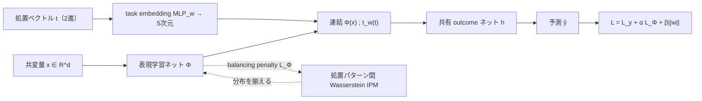

# Multiple Treatments Causal Effects Estimation with Task Embeddings and Balanced Representation Learning (CISI-Net)

- **Link**: https://arxiv.org/abs/2511.09814
- **Authors**: Yuki Murakami, Takumi Hattori, Kohsuke Kubota
- **Year**: 2025 (submitted November 12, 2025)
- **Venue**: arXiv (stat.ME — Statistics > Methodology)
- **Type**: 方法論論文（深層学習による多重処置の因果効果推定）

---

## Abstract (English)

The simultaneous application of multiple treatments is increasingly common in many fields, such as healthcare and marketing. In such scenarios, it is important to estimate the single treatment effects and the interaction treatment effects that arise from treatment combinations. Previous studies have proposed using independent outcome networks with subnetworks for interactions, or combining task embedding networks that capture treatment similarity with variational autoencoders. However, these methods suffer from the lack of parameter sharing among related treatments, or the estimation of unnecessary latent variables reduces the accuracy of causal effect estimation. To address these issues, we propose a novel deep learning framework that incorporates a task embedding network and a representation learning network with the balancing penalty. The task embedding network enables parameter sharing across related treatment patterns because it encodes elements common to single effects and contributions specific to interaction effects. The representation learning network with the balancing penalty learns representations nonparametrically from observed covariates while reducing distances in representation distributions across different treatment patterns. This process mitigates selection bias and avoids model misspecification. Simulation studies demonstrate that the proposed method outperforms existing baselines, and application to real-world marketing datasets confirms the practical implications and utility of our framework.

## Abstract (日本語訳)

医療やマーケティングなど多くの分野で、複数の処置（treatment）を同時に適用することが一般的になりつつある。こうした状況では、単一処置効果（single treatment effect）と、処置の組み合わせから生じる交互作用効果（interaction treatment effect）の双方を推定することが重要である。既存研究では、交互作用用のサブネットワークを持つ独立した outcome ネットワークを用いる手法や、処置間の類似性を捉える task embedding ネットワークと変分オートエンコーダ（VAE）を組み合わせる手法が提案されてきた。しかし、これらの手法は関連する処置間でパラメータが共有されないこと、あるいは不要な潜在変数の推定によって因果効果推定の精度が低下することという問題を抱えていた。本研究ではこれらの課題に対処するため、task embedding ネットワークと balancing penalty を伴う表現学習ネットワークを組み込んだ新しい深層学習フレームワーク（CISI-Net）を提案する。task embedding ネットワークは、単一効果に共通する要素と交互作用効果に固有の寄与をエンコードするため、関連する処置パターン間でのパラメータ共有を可能にする。balancing penalty を伴う表現学習ネットワークは、観測共変量からノンパラメトリックに表現を学習しつつ、異なる処置パターン間の表現分布の距離を縮小する。この過程が選択バイアスを緩和し、モデル誤特定を回避する。シミュレーション研究により提案手法が既存ベースラインを上回ることを示し、実世界のマーケティングデータセットへの適用により実務的示唆と有用性を確認した。

---

## Overview

CISI-Net（Common-Interaction Shared Interaction Net のような命名。論文では task embedding と balanced representation を統合したネットワーク）は、**複数処置が同時に施される観測データ**から、各処置単体の平均効果（ASE）と、複数処置の組み合わせによる交互作用効果（AIE）を同時に推定する深層学習フレームワークである。中核となるアイデアは 2 つ:

1. **task embedding ネットワーク**による処置パターン間のパラメータ共有 — 処置の 2 進ベクトル $\bm{t}$ を MLP で連続埋め込みに変換し、「単一効果に共通する成分」と「交互作用に固有の成分」をエンコードする。これにより、データがまばらな処置組み合わせでも、関連する処置から情報を借りて（borrow strength）安定的に推定できる。
2. **balancing penalty（IPM ベース）を伴う表現学習** — 共変量 $\bm{x}$ を潜在表現 $\Phi(\bm{x})$ に写像し、異なる処置パターン間で表現分布を近づける。これが選択バイアスを補正する。

マーケティング領域では、複数のキャンペーン（クーポン・プロモーション）を同一ユーザに重ねて配信する状況が頻繁に生じ、各キャンペーン単体の効果と組み合わせの相乗・カニバリ効果を分離することが実務的に重要である点が動機となっている。

## Problem（解決すべき課題）

- 複数処置を同時適用する場合、処置パターン数は組み合わせ的に増加（$K$ 処置で最大 $2^K$ パターン）し、各パターンのサンプルが**まばら（sparse）**になる。
- 既存手法 NCoRE は交互作用用の独立サブネットワークを使うが、**関連処置間でパラメータが共有されない**ため、まばらデータで不安定。
- 既存手法 TECE-VAE は task embedding と VAE を組み合わせるが、**不要な潜在変数の推定**がノイズとなり精度低下、モデル誤特定のリスクがある。
- 観測データでは処置割り当てが共変量に依存する（selection bias）ため、単純な回帰では偏りが生じる。

## Proposed Method（提案手法）

### 中核アイデア

処置ベクトル $\bm{t}$（各処置の有無を示す 2 進ベクトル）を連続的な task embedding へ写像することで、**類似した処置パターンが埋め込み空間で近くなる**ようにし、パラメータ共有を実現する。同時に、共変量の表現分布を処置パターン間で揃える balancing penalty で選択バイアスを除去する。

### 手順

1. **表現学習**: 共変量 $\bm{x} \in \mathbb{R}^d$ を写像 $\Phi: \mathbb{R}^d \to \mathbb{R}^p$ で潜在表現へ変換。
2. **task embedding**: 2 進処置ベクトル $\bm{t}$ を $t_w(\bm{t}) = \mathrm{MLP}_w(\bm{t})$ で $q$ 次元（実装では 5 次元）の埋め込みへ変換。
3. **outcome 予測**: 表現 $\Phi(\bm{x})$ と埋め込み $t_w(\bm{t})$ を連結し、共有ネットワーク $h: \mathbb{R}^{p+q} \to \mathbb{R}$ で outcome を予測。
4. **balancing penalty 適用**: 処置パターンのペアごとに表現分布の IPM（Wasserstein 距離）を計算し、損失に加える。
5. **重み付き予測損失**: 処置パターンの出現頻度の逆数で重み付けし、まばらなパターンの過小評価を防ぐ。
6. 学習済みモデルから ASE / AIE を推定。

### Key Formulas（主要数式）

条件付き平均潜在アウトカム:
$$\mu(\bm{x}, \bm{t}) := \mathbb{E}[Y(\bm{t}) \mid \bm{X} = \bm{x}]$$

平均単一効果（Average Single Effect, ASE）:
$$\tau_{\mathrm{ASE}}(k) := \mathbb{E}_{\bm{X}}[\mu(\bm{x}, \bm{t}_{+k}) - \mu(\bm{x}, \bm{0})]$$

平均交互作用効果（Average Interaction Effect, AIE）— 包除原理（inclusion-exclusion）で定義:
$$\tau_{\mathrm{AIE}}(S) := \mathbb{E}_{\bm{X}}\left[\sum_{Q \subseteq S}(-1)^{|S|-|Q|}\mu(\bm{x}, \bm{t}_{(+Q)})\right]$$

総合損失:
$$L = L_y + \alpha L_{\Phi}(\Phi, \bm{t}) + \beta\|\bm{w}\|_2$$

頻度逆数で重み付けした予測損失:
$$L_y = \frac{1}{N}\sum_{i=1}^N w_i(\bm{t}_i)(y_i - \hat{y}_i)^2, \quad w_i(\bm{t}_i) = \frac{1}{2}\left(\frac{1}{N}\sum_{j=1}^N \mathbb{I}[\bm{t}_i = \bm{t}_j]\right)^{-1}$$

balancing penalty（処置パターンペアにわたる IPM の平均）:
$$L_{\Phi} = \frac{1}{\binom{|T|}{2}}\sum_{\{\bm{a}, \bm{b}\} \in \binom{T}{2}} \mathrm{IPM}(S_{\bm{a}}, S_{\bm{b}})$$

推定誤差指標:
$$\epsilon_{\mathrm{ASE}}(k) = |\tau_{\mathrm{ASE}}(k) - \hat{\tau}_{\mathrm{ASE}}(k)|, \quad \epsilon_{\mathrm{AIE}}(S) = |\tau_{\mathrm{AIE}}(S) - \hat{\tau}_{\mathrm{AIE}}(S)|$$

## Algorithm（擬似コード）

```text
Input: {(x_i, t_i, y_i)}_{i=1..N}, coefficients α, β, epochs E
Initialize: Φ (repr. net), MLP_w (task embedding), h (outcome net)

for epoch in 1..E:
  for minibatch B:
    # 1. 表現学習
    r_i = Φ(x_i)                          for i in B
    # 2. task embedding
    e_i = MLP_w(t_i)                       for i in B
    # 3. outcome 予測
    ŷ_i = h([r_i ; e_i])                   for i in B
    # 4. 頻度逆数重み付き予測損失
    L_y = mean_i w_i(t_i) (y_i - ŷ_i)^2
    # 5. balancing penalty（処置パターンペアごとの Wasserstein IPM）
    L_Φ = mean over pattern-pairs {a,b} of Wasserstein(Φ(S_a), Φ(S_b))
    # 6. 総合損失で更新
    L = L_y + α L_Φ + β ||w||_2
    backprop, Adam step (lr=1e-5)

# 推定
for each single k:      τ̂_ASE(k) = mean_x [ h([Φ(x); MLP_w(t_{+k})]) − h([Φ(x); MLP_w(0)]) ]
for each subset S:      τ̂_AIE(S) = mean_x Σ_{Q⊆S} (−1)^{|S|−|Q|} h([Φ(x); MLP_w(t_{+Q})])
```

## Architecture / Process Flow



## Figures & Tables

論文 HTML には以下の図が確認された（実際に確認した画像 URL のみ埋め込み）。


### 表 1: シミュレーション主要結果（Dataset 1、完全観測、K=3、N=50,000）— 推定誤差（低いほど良い）

| Method | ε_ASE(1) | ε_ASE(2) | ε_ASE(3) | ε_AIE({1,2}) | ε_AIE({2,3}) | ε_AIE({1,3}) | ε_AIE({1,2,3}) |
|--------|---|---|---|---|---|---|---|
| TARNet | 0.11±0.10 | 0.11±0.07 | 0.10±0.07 | 0.18±0.15 | 0.16±0.12 | 0.18±0.14 | 0.34±0.29 |
| CFR-WASS | 0.12±0.09 | 0.10±0.08 | 0.10±0.06 | 0.19±0.12 | 0.17±0.12 | 0.17±0.13 | 0.30±0.19 |
| NCoRE | 0.10±0.08 | 0.10±0.08 | 0.10±0.08 | 0.17±0.12 | 0.16±0.10 | 0.15±0.11 | 0.23±0.18 |
| TECE-VAE | 0.13±0.10 | 0.13±0.10 | 0.12±0.09 | 0.12±0.08 | 0.14±0.10 | 0.13±0.11 | 0.21±0.15 |
| **CISI-Net** | **0.10±0.07** | **0.09±0.08** | **0.08±0.07** | **0.12±0.10** | **0.13±0.10** | **0.12±0.10** | **0.12±0.10** |

特に 3 処置交互作用 ε_AIE({1,2,3}) で CISI-Net は 0.12 と、次点 TECE-VAE の 0.21 を大きく上回る。

### 表 2: Dataset 2（潜在共変量シナリオ）主要結果

| Method | ε_ASE(1) | ε_ASE(2) | ε_ASE(3) | ε_AIE({1,2}) | ε_AIE({2,3}) | ε_AIE({1,3}) | ε_AIE({1,2,3}) |
|--------|---|---|---|---|---|---|---|
| TARNet | 0.17±0.15 | 0.19±0.16 | 0.16±0.15 | 0.19±0.12 | 0.18±0.12 | 0.17±0.12 | 0.29±0.22 |
| CFR-WASS | 0.17±0.14 | 0.19±0.17 | 0.17±0.16 | 0.19±0.15 | 0.18±0.14 | 0.21±0.14 | 0.33±0.26 |
| NCoRE | 0.19±0.17 | 0.21±0.19 | 0.19±0.18 | 0.23±0.17 | 0.22±0.16 | 0.20±0.17 | 0.28±0.22 |
| TECE-VAE | 0.19±0.15 | 0.22±0.16 | 0.20±0.16 | 0.32±0.21 | 0.16±0.14 | 0.17±0.14 | 0.22±0.17 |
| **CISI-Net** | **0.17±0.16** | **0.18±0.16** | **0.16±0.14** | **0.18±0.15** | **0.14±0.11** | **0.16±0.11** | **0.22±0.16** |

### 表 3: アブレーション（Table 2 相当、Dataset 1）— TE=task embedding、BP=balancing penalty

| TE | BP | ε_ASE(1) | ε_ASE(2) | ε_ASE(3) | ε_AIE({1,2}) | ε_AIE({2,3}) | ε_AIE({1,3}) | ε_AIE({1,2,3}) |
|---|---|---|---|---|---|---|---|---|
| ✗ | ✗ | 0.10±0.07 | 0.11±0.07 | 0.10±0.05 | 0.18±0.10 | 0.25±0.14 | 0.25±0.10 | 0.66±0.04 |
| ✓ | ✗ | 0.11±0.09 | 0.11±0.08 | 0.09±0.07 | 0.18±0.15 | 0.19±0.15 | 0.21±0.14 | 0.14±0.10 |
| ✗ | ✓ | 0.10±0.08 | 0.10±0.07 | 0.10±0.06 | 0.16±0.11 | 0.23±0.14 | 0.25±0.13 | 0.59±0.07 |
| ✓ | ✓ | **0.10±0.07** | **0.09±0.08** | **0.08±0.07** | **0.12±0.10** | **0.13±0.10** | **0.12±0.10** | **0.12±0.10** |

**task embedding が交互作用効果推定に決定的に効く**ことが明白: TE なしでは ε_AIE({1,2,3}) が 0.59–0.66 と極端に悪化し、TE を入れると 0.12–0.14 まで改善。

### 表 4: 手法比較（設計上の差異）

| 手法 | パラメータ共有 | 潜在変数 | バイアス補正 | 交互作用の扱い |
|------|--------------|---------|-------------|--------------|
| TARNet | なし | なし | なし | 明示なし |
| CFR-WASS | なし | なし | Wasserstein IPM | 明示なし |
| NCoRE | 独立サブネット | なし | なし | 専用サブネット |
| TECE-VAE | task embedding | VAE 潜在変数 | なし | embedding 経由 |
| **CISI-Net** | **task embedding（共通/交互作用分離）** | なし | **IPM balancing penalty** | **包除原理 + 共有ネット** |

## Experiments & Evaluation

### Setup

- **アーキテクチャ**: 全結合層 200 ユニット × 隠れ層 3、leaky ReLU。task embedding 出力 5 次元。
- **balancing 係数**: $\alpha = 0.1$。IPM は Wasserstein 距離。
- **学習**: Adam、学習率 $10^{-5}$、バッチ 128、L2 正則化 $10^{-5}$、30 エポック。
- **データ分割**: 訓練 70% / テスト 30%、100 個の独立データセットで平均。

### Main Results

- 3 つのシミュレーションデータセット（Dataset 1: 完全観測、Dataset 2: 潜在共変量、Dataset 3: 交互作用なし）すべてで、特に高次交互作用効果の推定誤差を大幅に削減。
- Dataset 1 の ε_AIE({1,2,3}) で CISI-Net 0.12 vs ベースライン 0.21–0.34。

### Ablation

- 表 3 の通り、task embedding が高次交互作用推定に不可欠。balancing penalty は選択バイアスがある設定（Dataset 2）で追加的に寄与。

### 実世界マーケティング応用

- **Dataset 1**（3 プロモーション CP1–CP3）: CP1 単独 ~2%、CP2 単独 ~15%、CP3 単独 ~42%、組み合わせ 0.2–1%、全 3 種 ~0.2%。アウトカムはキャンペーン後 1 ヶ月の標準化総支払額。共変量 71 変数（サービス利用・デモグラフィック）。同一マーチャントのプロモ間で**正の交互作用**を検出。
- **Dataset 2**（2 プロモーション CP4–CP5）: CP4 単独 ~29%、CP5 単独 ~4%、両方 ~1%。競合マーチャント間で**負の交互作用（カニバリゼーション）**を検出。

## 本テーマへの適用可能性

本テーマ（散発的なマーケティングキャンペーン: 異なる対象ユーザ・異なる施策のクーポン/メールを、まばらに実施。類似キャンペーン/ユーザをグルーピングしてデータを高密度化し、実質的な実験間隔を短縮したい）に対して、CISI-Net は極めて直接的に適用できる。

- **キャンペーンの「グルーピング」を task embedding が自動で実現**: 各キャンペーン（クーポン種別・メール種別）を 2 進処置ベクトルの 1 要素とみなせば、MLP_w による埋め込みが「似たキャンペーン同士を埋め込み空間で近づける」。これはまさに本テーマが求める「類似キャンペーンのグルーピングによる情報の借用（borrow strength）」を、明示的なクラスタリングなしに end-to-end で達成する。図 2 の埋め込み類似性可視化は、どのキャンペーンが実効的に同一グループとして扱われているかを診断できる。
- **まばらな組み合わせでも安定推定**: 表 3 のアブレーションが示すように、組み合わせ（同一ユーザに複数クーポンを重ねて配信した稀なケース）の効果推定は、パラメータ共有がないと ε_AIE が 0.66 まで崩壊する。task embedding によるパラメータ共有で 0.12 まで改善するため、**「複数キャンペーンを重ねた少数サンプル」からでも交互作用効果を復元でき、実質的なデータ密度を高められる**。
- **実験間隔の短縮への寄与**: ASE（各キャンペーン単体効果）と AIE（組み合わせ効果）を包除原理で分離推定するため、全組み合わせを個別に十分な期間実験しなくても、単体効果+共有パラメータから組み合わせ効果を外挿できる。これは新しいキャンペーンの都度フル実験を回す必要を減らし、実効的な実験サイクルを短縮する。
- **選択バイアス補正が観測ログに有効**: 本テーマのようにキャンペーン対象が過去行動で選ばれる（ランダム割り当てでない）場合、balancing penalty が処置パターン間の共変量表現分布を揃え、観測データからのバイアスを軽減する。off-policy 的なログデータからの効果推定に相性が良い。
- **注意点**: SUTVA（干渉なし）・ignorability・overlap を仮定するため、キャンペーンの外部性（口コミ等）が強い場合や、あるユーザ群に特定キャンペーンが全く割り当たらない（overlap 破れ）場合は補正しきれない。まばらすぎるパターンには依然として最低限のサンプルが必要。

## Notes

- 手法の正式名称は本文中 "CISI-Net"。ベースラインは TARNet / CFR-WASS（Shalit et al., 2017）、TECE-VAE（Saini et al., 2019）、NCoRE（Parbhoo et al., 2021）。
- コード公開の有無は取得情報からは**記載なし**。
- 実世界データセットの具体名（企業名）は匿名化されており**記載なし**。処置分布は概算値（"~2%" 等）で報告されている。
- 図の画像 URL は arXiv HTML 版で確認した x1–x5.png を埋め込んだ。各図の厳密なキャプション全文は取得要約に基づく簡略記載。
