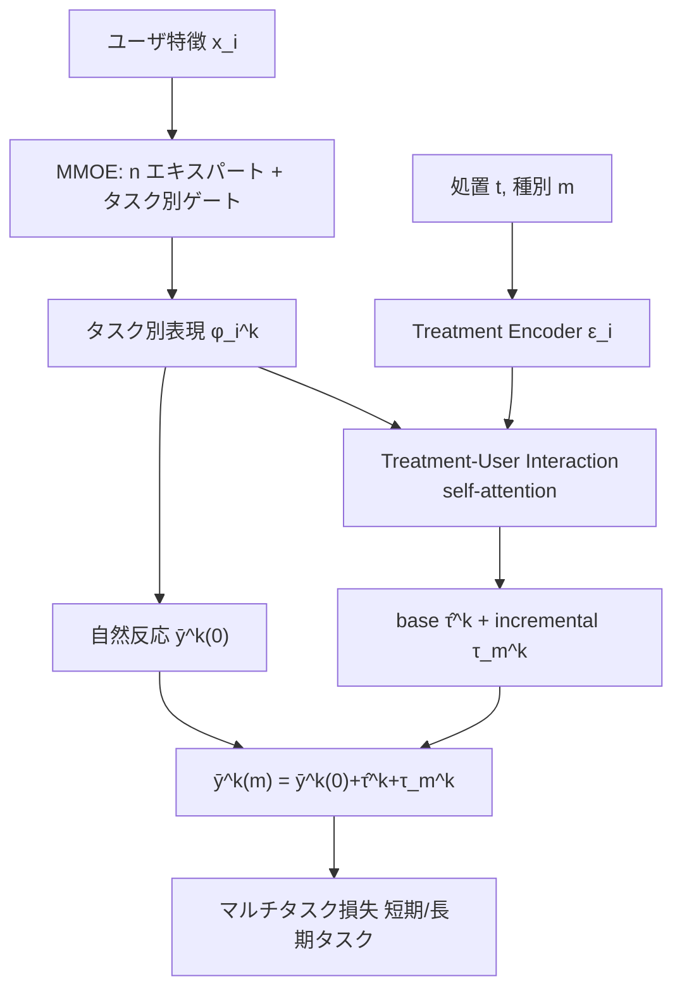

# Multi-Treatment Multi-Task Uplift Modeling for Enhancing User Growth (MTMT)

- **Link**: https://arxiv.org/abs/2408.12803
- **Authors**: Yuxiang Wei, Zhaoxin Qiu, Yingjie Li, Yuke Sun, Xiaoling Li
- **Year**: 2024 (submitted August 23, 2024)
- **Venue**: arXiv (cs.LG — Machine Learning)
- **Type**: 応用論文（uplift モデリング、ゲームプラットフォームで本番デプロイ）

---

## Abstract (English)

The paper addresses uplift modeling for online user growth by proposing a network that estimates treatment effects in a multi-task scenario. Rather than examining single treatments, the researchers conceptualize the problem through causal inference with tiered responses—a base effect from offering treatment and an incremental effect from specific treatment types. The model employs separate encoders for user features and treatments. It utilizes a multi-gate mixture of experts (MMOE) network to encode relevant user features, explicitly learning inter-task relations. The approach includes a treatment-user interaction module to capture correlations between treatments and user characteristics. The study validates the approach using both public and proprietary datasets across various settings, demonstrating practical effectiveness. The solution has been deployed in a gaming platform to improve user experience.

## Abstract (日本語訳)

本論文は、オンラインユーザ成長のための uplift モデリングを扱い、マルチタスク設定で処置効果を推定するネットワークを提案する。単一処置を検討するのではなく、階層的（tiered）な反応という因果推論の枠組みで問題を捉える。すなわち、処置を提供すること自体による基礎効果（base effect）と、特定の処置種別による増分効果（incremental effect）に分解する。モデルはユーザ特徴と処置に対して別々のエンコーダを用いる。関連するユーザ特徴をエンコードするために multi-gate mixture of experts（MMOE）ネットワークを用い、タスク間関係を明示的に学習する。さらに、処置とユーザ特性の相関を捉える treatment-user interaction モジュールを備える。公開データセットと独自データセットの両方、さまざまな設定で有効性を検証し、実用性を示した。本ソリューションはゲームプラットフォームに実装され、ユーザ体験の向上に用いられている。

---

## Overview

MTMT（Multi-Treatment Multi-Task）は、**複数の処置種別（例: ボーナスの種類 A/B）** と **複数の反応タスク（例: 翌日ログイン=短期、7 日エンゲージメント=長期）** を同時に扱う uplift モデルである。中核となる観察は「処置間の反応差（どのボーナスを配るか）は、処置 vs 対照の反応差（そもそもボーナスを配るか）よりもはるかに小さい」という点で、これを踏まえ効果を 2 段階（tiered）に分解する:

- **base uplift** $\hat{\tau}^k(x_i)$: 何らかの処置を提供するか否かの効果。
- **incremental uplift** $\tau_m^k(x_i)$: どの特定処置 $m$ を提供するかの追加効果。

MMOE でタスク間関係を、self-attention ベースの treatment-user interaction モジュールで処置とユーザ特徴の相関を捉える。

## Problem（解決すべき課題）

- 従来の uplift モデルは**単一処置・単一タスク**に焦点を当て、複数処置・複数タスクの複雑な相互作用を見落とす。
- 処置間の反応差が小さいため、素朴に処置別の効果を別々に推定すると信号が弱く不安定。
- 複数の反応（短期/長期）を独立に学習するとタスク間の情報が活用されない。
- 処置とユーザ特徴の相関（どのユーザにどの処置が効くか）を明示的に捉える仕組みが必要。

## Proposed Method（提案手法）

### 中核アイデア: 階層的（tiered）効果分解

処置効果を「base（処置有無）」と「incremental（処置種別）」に分離し、後者は前者の上に加算する。これにより、弱い処置間差の信号を、強い base 効果と分けて安定的に学習できる。

### 手順

1. **Task-Oriented Feature Encoder（MMOE）**: ユーザ特徴 $x_i$ を $n$ 個のエキスパートネット（ResNet18 バックボーン）で処理し、タスク別ゲート $\mathcal{G}^k = \mathrm{softmax}(W_g^k x_i)$ で重み付けしてタスク別表現 $\phi_i^k$ を生成。
2. **User-Treatment Feature Interaction Module**: 処置を query、ユーザ特徴を key/value とする self-attention で相互作用表現 $\psi_{i,m}^k$ を計算。
3. **自然反応（対照）予測**: $\bar{y}_i^k(0) = W^{proj}_i \phi_i^k$。
4. **処置反応予測**: $\bar{y}_i^k(m) = \bar{y}_i^k(0) + \hat{\tau}^k(x_i) + \tau_m^k(x_i)$。
5. マルチタスク損失で end-to-end 学習。

### Key Formulas（主要数式）

総合効果の分解（base + incremental）:
$$\Gamma_m^k(x_i) = \hat{\tau}^k(x_i) + \tau_m^k(x_i)\cdot\mathbb{I}\{\hat{t}=1\}$$

MMOE によるタスク別特徴表現:
$$\phi_i^k = \mathcal{G}^k(x_i)\cdot\{\mathcal{E}^1(x_i), \mathcal{E}^2(x_i), \ldots, \mathcal{E}^n(x_i)\}, \quad \mathcal{G}^k = \mathrm{softmax}(W_g^k x_i)$$

treatment-user interaction（self-attention）:
$$\psi_{i,m}^k = \mathrm{softmax}\left(\frac{(W^{\mathcal{T}}\epsilon_i)(W^u\phi_i^k)^\top}{\sqrt{d_u}}\right)W^{u'}\phi_i^k$$

処置反応予測:
$$\bar{y}_i^k(0) = W^{proj}_i\phi_i^k, \qquad \bar{y}_i^k(m) = \bar{y}_i^k(0) + \hat{\tau}^k(x_i) + \tau_m^k(x_i)$$

学習目的（対照群 C と処置群 T にわたるマルチタスク損失）:
$$\sum_{k=1}^{N}\left[\sum_{i\in C}\mathcal{L}(y_i, \bar{y}_i^k(0)) + \sum_{i\in T}\mathcal{L}(y_i, \bar{y}_i^k(0) + \hat{\tau}^k(x_i) + \tau_m^k(x_i))\right]$$

## Algorithm（擬似コード）

```text
Input: {(x_i, t_i, m_i, {y_i^k})}, experts n, tasks K
for minibatch B:
  # 1. MMOE タスク別エンコード
  for k in 1..K:
    experts = [E^1(x_i), ..., E^n(x_i)]
    g_k = softmax(W_g^k x_i)
    φ_i^k = g_k · experts
  # 2. 処置埋め込み
  ε_i = TreatmentEncoder(t_i, m_i)
  # 3. treatment-user interaction（self-attention）
  ψ_{i,m}^k = Attention(query=W^T ε_i, key/value=W^u φ_i^k)
  # 4. 反応予測
  ȳ_i^k(0) = W^proj φ_i^k                         # 自然反応（対照）
  ȳ_i^k(m) = ȳ_i^k(0) + τ̂^k(x_i) + τ_m^k(x_i)     # 処置反応（base+incremental）
  # 5. マルチタスク損失（対照/処置で分岐）
  L = Σ_k [ Σ_{i∈C} MSE(y_i, ȳ_i^k(0)) + Σ_{i∈T} MSE(y_i, ȳ_i^k(m)) ]
  AdamW step (lr=0.001)
```

## Architecture / Process Flow



## Figures & Tables

論文 HTML から確認した図・表を以下に示す（数値は本文報告値）。

### 表 1: 単一処置性能（QINI、高いほど良い）

| 手法 | CRITEO QINI | Product 短期 QINI | Product 長期 QINI |
|------|---|---|---|
| S-Learner | 0.0703 | 0.0420 | 0.131 |
| T-Learner | 0.0706 | 0.0421 | 0.111 |
| FlexTENet | 0.0779 | 0.0321 | 0.111 |
| **MTMT** | **0.164** | **0.0886** | **0.360** |

MTMT は CRITEO で 0.164 と、次点 FlexTENet 0.0779 の 2 倍以上。長期タスクでも 0.360 と大幅に優越。

### 表 2: 複数処置性能（処置別 QINI）

| 手法 | Bonus A QINI | Bonus B QINI |
|------|---|---|
| M3TN | 0.0162 | 0.00107 |
| EFIN | 0.0142 | **0.0294** |
| **MTMT** | **0.0324** | **0.0291** |

MTMT は Bonus A で最良（0.0324）、Bonus B でも EFIN とほぼ同等（0.0291 vs 0.0294）。

### 表 3: アブレーション（Product データセット）

| 構成 | QINI | AUUC | LIFT@30 |
|------|---|---|---|
| interaction モジュールなし | 0.0426 | 0.0881 | 0.00849 |
| feature enhancer なし | 0.0759 | 0.145 | 0.0474 |
| **Full MTMT** | **0.0886** | **0.155** | **0.0638** |

treatment-user interaction モジュールの除去が最も性能を落とす（QINI 0.0886 → 0.0426）。

### 表 4: 手法比較（設計上の差異）

| 手法 | 複数処置 | 複数タスク | tiered 分解 | 相互作用モジュール |
|------|--------|----------|-----------|------------------|
| S/T-Learner | ✗ | ✗ | ✗ | ✗ |
| FlexTENet | ✗ | ✗ | ✗ | ✗ |
| M3TN | ✓ | ✗ | 部分的 | ✗ |
| EFIN | ✓ | ✗ | ✗ | ✓（interaction あり） |
| **MTMT** | **✓** | **✓（MMOE）** | **✓（base+incremental）** | **✓（self-attention）** |

### 図（本文記載、画像 URL は取得要約では未確認のため未埋め込み）

- Figure 4: base 効果（平均 0.055）が incremental 効果を大幅に上回ることの可視化。tiered 推定の動機を裏付ける。

## Experiments & Evaluation

### Setup

- **公開データ**: CRITEO — 1,400 万サンプル、連続特徴 12、2 値ターゲット（visit）。
- **本番データ**: ゲームプラットフォーム、1,000 万超サンプル、約 700 特徴。タスク 2 種（翌日ログイン=短期、7 日エンゲージメント=長期）。処置=base（ボーナス有無）+ secondary（ボーナス種別 A/B）。
- **評価指標**: QINI（正規化）、AUUC（正規化）、LIFT@30。
- **学習**: 損失 MSE、最適化 AdamW（lr=0.001）、バッチ 15,360、50 エポック。

### Main Results

- 表 1 の通り、CRITEO QINI で MTMT 0.164 vs ベースライン最良 0.0779。本番短期 0.0886、長期 0.360 でいずれも最良。
- 複数処置設定（表 2）でも既存 uplift 手法 M3TN・EFIN を上回る、または同等。

### Ablation

- treatment-user interaction モジュールが最重要（除去で QINI が半減以下）。feature enhancer も寄与。

### Deployment

- ゲームプラットフォームに実装済み。推定効果に基づきユーザをバケットにランク付けし、パーソナライズされたボーナス配布を実施。

## 本テーマへの適用可能性

本テーマ（散発的なマーケティングキャンペーンで、対象ユーザ・施策が異なる。類似キャンペーン/ユーザをグルーピングして密度を高め、実験間隔を短縮したい）に対し、MTMT の設計思想は直接的に有用である。

- **「処置種別のグルーピング」を base+incremental 分解で実現**: 本テーマの複数クーポン/メール施策を「共通の base 効果 + 施策固有の incremental 効果」に分解する発想は、**まばらな施策別データを共有の base 効果に集約して密度を高める**アプローチそのものである。処置間差の信号が弱くても、強い base 効果を全施策で共有学習することで、各施策のサンプルが少なくても安定推定できる。表 2 が示すように、まばらな Bonus B（QINI 0.0291）でも実用的な推定が得られている。
- **MMOE によるタスク（=反応指標）横断の情報共有**: 短期（開封・クリック）と長期（購買・継続）を同時に学習し、タスク間関係をゲートで明示的にモデル化する。散発キャンペーンでは長期アウトカムの観測が特にまばらになるため、短期指標から情報を借りて長期効果推定を安定化でき、**実効的なデータ密度と実験サイクルの短縮**に寄与する。
- **treatment-user interaction による「ユーザ×施策」の類似性活用**: self-attention が「どのユーザにどの施策が効くか」を捉えるため、明示的なユーザセグメント分割をせずとも、類似ユーザ×類似施策への効果を暗黙にプールする。これは本テーマの「類似ユーザのグルーピング」を end-to-end で近似する。
- **本番運用実績**: ゲームプラットフォームでの実デプロイ（ユーザをバケットにランクしてボーナス配布）は、本テーマの「散発キャンペーンの意思決定支援」にそのまま流用できる運用パターンを示している。
- **注意点**: MTMT は基本的に RCT/準実験ログを前提とした uplift（傾向スコア補正の明示的言及は取得情報では**記載なし**）であり、強い選択バイアスがある観測ログには CISI-Net（2511.09814）のような balancing 補正の併用が望ましい。また本番データは 1,000 万超サンプルで検証されており、極端に小規模なキャンペーンでの挙動は本論文では検証されていない。

## Notes

- 手法名は "MTMT"（Multi-Treatment Multi-Task）。ベースラインは S-Learner / T-Learner / FlexTENet（単一処置）、M3TN / EFIN（複数処置）。
- 本番データセット・企業名は匿名（ゲームプラットフォーム）で具体名は**記載なし**。
- コード公開の有無は取得情報からは**記載なし**。
- 図の画像 URL は取得要約に含まれていなかったため埋め込みは行っていない（Figure 4 の内容は本文記載として言及のみ）。
- 数式中の記号は arXiv HTML の表記に基づく近似的な LaTeX 表現。
