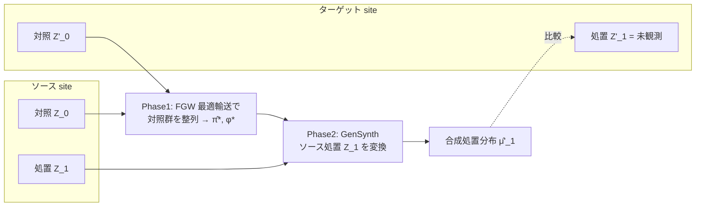

# Distributional Treatment Effect Estimation across Heterogeneous Sites via Optimal Transport (OTSynth)

- **Link**: https://arxiv.org/abs/2511.09759
- **Authors**: Borna Bateni, Yubai Yuan, Qi Xu, Annie Qu
- **Year**: 2025 (submitted November 12, 2025)
- **Venue**: arXiv (stat.ME — Statistics > Methodology)
- **Type**: 方法論論文（最適輸送による分布的処置効果の site 間転移）

---

## Abstract (English)

The researchers propose a framework for creating synthetic counterfactual treatment data at a target site by combining full treatment and control data from a source site with control data from the target. Rather than focusing on average effects, they adopt a distributional perspective modeling treatment and control as probability measures. Cross-site heterogeneity is formalized as a transformation mapping the source site's joint feature-outcome distribution to the target site. This transformation is learned by aligning control group distributions between sites using optimal transport methods, then applied to source treatment data to generate synthetic target treatment distributions. The authors establish theoretical guarantees for consistency and asymptotic convergence. Their simulation studies and real-world application to xenograft patient data demonstrate the framework successfully recovers full distributional properties of treatment effects across heterogeneous sites.

## Abstract (日本語訳)

本研究は、ターゲット site における合成的な反実仮想（counterfactual）処置データを生成するフレームワークを提案する。これは、ソース site の完全な処置・対照データと、ターゲット site の対照データのみを組み合わせて行う。平均効果に焦点を当てるのではなく、処置群・対照群を確率測度としてモデル化する分布的視点を採用する。site 間の異質性（heterogeneity）は、ソース site の共同（特徴×アウトカム）分布をターゲット site へ写す変換として定式化される。この変換は、最適輸送（optimal transport）を用いて site 間の対照群分布を整列（align）させることで学習し、それをソースの処置データに適用して合成ターゲット処置分布を生成する。著者は一致性（consistency）と漸近収束の理論保証を確立する。シミュレーション研究と、患者由来異種移植（xenograft）データへの実応用により、site 間の異質性を越えて処置効果の完全な分布的性質を復元できることを示す。

---

## Overview

OTSynth は、**あるターゲット site で処置群のデータが（まだ）存在しない**状況で、別のソース site の完全データ（処置+対照）と、ターゲット site の対照データのみから、**ターゲット site の処置群の分布を合成**する手法である。平均処置効果（ATE）ではなく、アウトカムの**分布全体**（分散・分位点など）を復元することを目的とする。

中核は、site 間の異質性を「押し出し変換（push-forward transformation）$\varphi: \mathcal{Z} \to \mathcal{Z}'$」として定式化し、両 site の**対照群分布を最適輸送で整列**することで $\varphi$ を学習、これをソースの処置データに適用してターゲット処置分布を合成する点。Fused Gromov-Wasserstein（FGW）損失を用い、特徴の整列と幾何構造の保存を同時に達成する。

## Problem（解決すべき課題）

- 新しい site / 集団で処置を実施していない（処置群データがない）が、その site での処置効果分布を知りたい。
- site 間で特徴分布・アウトカム生成メカニズムが異質（heterogeneous）であり、ソース site の結果をそのまま転用できない。
- 平均効果だけでなく分散・分位点など**分布全体**の情報が意思決定に必要（例: リスク・裾の挙動）。
- 単純な位置シフト仮定（unconfounded location）では非線形な site 間差を捉えられない。

## Proposed Method（提案手法）

### 中核アイデア

両 site の対照群という「共通の基準」を最適輸送で整列させることで、site 間変換 $\varphi \approx T$ を学習する。学習した変換をソース処置データに適用すれば、ターゲット site の処置分布を合成できる。

### 手順

1. **Phase 1 — OT ベース転移計量学習（OTTML）**: ソース対照 $Z_0$ とターゲット対照 $Z_0'$ の分布を、正則化 Fused Gromov-Wasserstein 損失で整列し、輸送計画 $\hat\pi^*$ と変換 $\varphi^*$ を同時学習。
2. **Phase 2 — 合成処置生成（GenSynth）**: 学習した $(\hat\pi^*, \varphi^*)$ を用い、各ソース処置点 $z_{1j}$ に対しターゲット空間の合成処置点 $z'_{1j}(\text{synth})$ を最適化で生成。
3. 合成点の経験測度 $\hat\mu_1'$ をターゲット処置分布の推定とする。

### Key Formulas（主要数式）

Phase 1（転移計量学習）— 正則化 FGW 損失の最小化:
$$(\hat\pi^*, \varphi^*) = \arg\inf_{\hat\pi\in\Pi(\hat\mu_0,\hat\mu_0'),\, \varphi\in\Phi}\left\{\mathcal{L}_{\mathrm{FGW}_\alpha}(\hat\pi, d'_\varphi) + \lambda\cdot\mathcal{L}_G(\hat\pi, d'_\varphi)\right\}$$

FGW 損失は特徴整列・幾何構造・グラフ整合性の 3 項:
- 特徴整列: $(1-\alpha)\cdot\mathcal{K}(z_{0i}, z'_{0k})$
- 構造幾何: $\alpha\cdot|d_Z(z_{0i}, z_{0j}) - d'_{Z'}(z'_{0k}, z'_{0l})|$
- グラフ整合ペナルティ: $\lambda\cdot d'_\varphi(\varphi(z_{0i}), z'_{0k})$

Phase 2（合成処置生成）— 各ソース処置点に対して:
$$z'_{1j}(\text{synth}) = \arg\inf_{z'\in\mathcal{Z}'}\left\{\sum_{i,k}|d_Z(z_{0i}, z_{1j}) - d'_{\varphi^*}(z'_{0k}, z')|\cdot\hat\pi^*_{ik} + \lambda_S\cdot d'_{\varphi^*}(z', \varphi^*(z_{1j}))\right\}$$

### 主要仮定と理論

- **Assumption 3.1（Parallel Effect Modification）**: 共有全単射 $T$ が存在し $T_\#\mu_0 = \mu_0'$ かつ $T_\#\mu_1 = \mu_1'$。「unconfounded location」仮定を緩和。
- **Assumption 3.2（Feature-Alignment Structure）**: 安定特徴部分空間 $\mathcal{H}$ が存在し、整列カーネル $\mathcal{K}$ が条件を満たす。
- **Assumption 3.3（Support Condition）**: $\mu_1 \ll \mu_0$（標準的な positivity）。
- **Lemma 3.1**: $n_0, n_0' \to \infty$ で $d'_{\varphi^*} \to d'_T$（μ_0'⊗μ_0'-a.e.）、$\hat\pi^* \Rightarrow \pi_T$（弱収束）。
- **Theorem 3.1**: 各 $z$ で $d'_T(\hat z(z), T(z)) \to 0$、経験測度 $\hat\mu_1' \Rightarrow \mu_1' = T_\#\mu_1$（弱収束）。

## Algorithm（擬似コード）

```text
Algorithm 1: OTSynth
Input: Z_0, Z_1 (ソース処置+対照); Z'_0 (ターゲット対照);
       kernel K; metric d_Z; params α*, λ, λ_S

# Phase 1: OT 転移計量学習
OTTML(Z_0, Z'_0, d_Z):
  α ← 0
  while not converged:
    勾配降下で π̂^(k), φ^(k) を更新:
      min  L_FGW_α(π̂^(k), d'_φ^(k)) + λ·L_G(π̂^(k), d'_φ^(k))
    if iteration k > threshold:  α ← α*   # 幾何項を徐々に導入
  return d'_φ*, π̂*

# Phase 2: 合成処置生成
GenSynth(Z_1, Z_0, Z'_0, π̂*, d'_φ*):
  for each z_1j in Z_1:
    z'_1j(synth) = arg min_{z'} L_S(z' | z_1j, (π̂*, φ*), λ_S)
  return Z'_1(synth) = [z'_1j(synth)]
```

## Architecture / Process Flow



## Figures & Tables

以下は本文で確認した図・表。画像 URL は取得要約で明示された記載に基づく（arXiv HTML 図番号 Figure 1/2 として言及）。厳密な画像ファイル URL は取得要約に含まれていなかったため、確実に確認できたキャプションのみ記す。

- **Figure 1**: 押し出し作用素 $\varphi: \mathcal{Z} \to \mathcal{Z}'$ が測度 $\mu$ を $\mu'$（$\mu'(A) = \mu(\varphi^{-1}(A))$）へ写す図示。
- **Figure 2**: 6 シナリオ × 8 手法にわたる合成ターゲット処置の比較。合成点（橙）と oracle 点（青）の (X,Y) 同時分布。最下段は各シナリオの oracle 変換 $T$。

### 表 1: シミュレーション — Y の周辺統計量（50 回平均 ± SE、抜粋）

| シナリオ | Model | Mean | Std Dev | Median |
|---------|-------|------|---------|--------|
| 1-Linear | Oracle | 24.89(0.26) | 6.57(0.21) | 24.91(0.38) |
| 1-Linear | OTSynth(linear) | 25.99(1.18) | 6.57(0.36) | 26.00(1.22) |
| 1-Linear | OTSynth(n.net) | 22.12(0.94) | 5.89(0.36) | 22.01(1.09) |
| 3-Strong NL | Oracle | 5.69(0.16) | 4.23(0.13) | 6.94(0.19) |
| 3-Strong NL | OTSynth(linear) | 30.34(37.74) | 12.56(13.21) | 30.46(38.16) |
| 3-Strong NL | OTSynth(n.net) | 5.60(0.54) | 4.16(0.32) | 5.32(0.63) |
| 6-d=30 | Oracle | 27.80(0.29) | 6.38(0.21) | 27.75(0.34) |
| 6-d=30 | OTSynth(n.net) | 25.69(0.74) | 5.87(0.26) | 25.68(0.79) |

強非線形（シナリオ3）では OTSynth(n.net) が oracle にほぼ一致（Mean 5.60 vs 5.69）する一方、線形版は破綻（Mean 30.34）。

### 表 2: 分布距離指標（Mean ± SE、低いほど良い、抜粋）

| シナリオ | Model | W1(Y)↓ | Hellinger(Y)↓ | KL(Y)↓ | Energy(Z)↓ | Sliced W1(Z)↓ |
|---------|-------|--------|---------------|--------|-----------|---------------|
| 1-Linear | OTSynth(linear) | 1.35(0.90) | 0.15(0.03) | 0.25(0.14) | 0.24(0.28) | 0.66(0.40) |
| 3-Strong NL | OTSynth(linear) | 24.68(37.80) | 0.71(0.15) | 2.42(1.42) | 31.76(60.11) | 11.38(17.44) |
| 3-Strong NL | OTSynth(n.net) | 1.21(0.18) | 0.27(0.02) | 0.43(0.15) | 0.23(0.06) | 0.56(0.07) |
| 6-d=30 | OTSynth(n.net) | 2.13(0.77) | 0.19(0.04) | 0.46(0.24) | 0.37(0.12) | 0.48(0.07) |

### 表 3: 実データ（PDX xenograft）— がん種転移性能（低いほど良い）

| Source:Target | Model | Mean | W1↓ | Hellinger↓ | KL↓ |
|---|---|---|---|---|---|
| BRCA:NSCLC | OTSynth(n.net) | 3.237 | 0.470 | 0.717 | 1.684 |
| BRCA:NSCLC | Oracle | 3.273 | — | — | — |
| BRCA:CM | OTSynth(n.net) | 2.900 | 0.185 | 0.481 | 1.997 |
| BRCA:CM | Oracle | 3.049 | — | — | — |
| BRCA:CRC | OTSynth(n.net) | 3.895 | 0.404 | 0.373 | 0.586 |
| BRCA:PDAC | OTSynth(n.net) | 3.564 | 0.206 | 0.372 | 0.411 |

### 表 4: 手法比較（設計上の差異）

| 手法 | 対象 | site 間変換 | 非線形対応 | 出力 |
|------|------|-----------|----------|------|
| TWFE | 平均 | 位置シフト | ✗ | ATE |
| MatchSynth | 分布 | マッチング | 限定的 | 合成分布 |
| GenSynth / GANSynth | 分布 | 生成モデル | ✓ | 合成分布 |
| **OTSynth(linear)** | **分布** | **OT（線形変換）** | ✗ | 合成分布 |
| **OTSynth(n.net)** | **分布** | **OT（NN 変換）** | **✓** | **合成分布** |

## Experiments & Evaluation

### Setup

- **シミュレーション**: 6 シナリオ（1: 線形アフィン T、2: 平滑非線形、3: 強非線形、4: 不連続レジーム、5: 非 RCT 共変量不均衡、6: 高次元 d=30）。$n_0 = n_0' = 1000$、$n_1 = n_1' = 500$、50 回反復。
- **ベースライン**: TWFE、MatchSynth、GenSynth、GANSynth、OTSynth(linear)、OTSynth(n.net)。

### Main Results

- 線形設定でベースライン比「分布距離の桁違いの削減」。
- 強非線形（シナリオ3）で NN 版が支配的（W1=1.21 vs GenSynth=2.88）。
- 非 RCT（シナリオ5）でも頑健。d=30（シナリオ6）で NN 版 W1=2.13 vs MatchSynth=12.93。

### 実データ（PDX xenograft）

- 5 がん種（BRCA, NSCLC, CM, CRC, PDAC）、処置=BKM120（Buparlisib）、反応=log time-to-tumor-doubling、40 ゲノム特徴（sparse PCA）。BRCA をソースに 4 転移すべてで oracle に近い分布を復元。

## 本テーマへの適用可能性

本テーマ（散発的なマーケティングキャンペーンで、対象ユーザ・施策が site/セグメントごとに異なる。類似キャンペーン/ユーザをグルーピングして密度を高め、実験間隔を短縮したい）に対し、OTSynth の「対照群を橋渡しに処置分布を合成する」発想は特に強力である。

- **「新セグメント/新キャンペーンでの処置群データ不在」を合成で埋める**: 本テーマでは、あるユーザセグメント（ターゲット site）でまだキャンペーンを打っていない（=処置群データがない）が、別の似たセグメント（ソース site）では既にキャンペーン結果があるという状況が頻繁に起きる。OTSynth は、両セグメントで共通して観測できる**「非対象ユーザ=対照群」を橋渡し**にして、ソースの処置効果分布をターゲットセグメントへ転移し、合成処置データを生成できる。これは**実験を打たずに実効データ密度を高める**直接的な手段となる。
- **分布全体の転移が uplift/OPE で重要**: 本テーマは off-policy 評価も志向するため、平均効果だけでなく分散・分位点（コンバージョン額の裾など）が必要。OTSynth は W1・Hellinger・KL で評価されるように分布全体を復元するため、意思決定のリスク評価に使える。
- **非 RCT・共変量不均衡に頑健**: シナリオ5（非 RCT）でも機能するため、キャンペーン対象が過去行動で選ばれる観測ログ的な状況にも適用余地がある。
- **site 間異質性 = セグメント間異質性のモデル化**: 「site 間の押し出し変換 $\varphi$」は、そのまま「セグメント A → セグメント B の分布変換」と読み替えられる。異なる対象ユーザ群のキャンペーンをグルーピングし、一方の結果を他方へ翻訳することで、複数の散発キャンペーンを統合して密度化できる。
- **注意点**: Parallel Effect Modification（対照群を揃えれば処置群も同じ変換で揃うという仮定）が成立しない場合（対照と処置で site 間差の構造が異なる場合）は誤った合成を生む。また対照群データが両 site で十分にないと OT 整列が不安定。強非線形では NN 版が必須（線形版は破綻）。合成データはあくまで推定であり、実データの代替として過信は禁物。

## Notes

- 手法名は "OTSynth"（線形変換版と neural network 変換版の 2 種）。FGW = Fused Gromov-Wasserstein。
- コード公開の有無は取得情報からは**記載なし**。
- 実データは医療（PDX xenograft）であり、マーケティングへの適用は本テーマ側の類推。
- 表 1–3 の一部セルはソース要約に含まれた抜粋値。ベースライン各手法の全数値は本論文表を参照（要約では OTSynth 系と Oracle 中心に抽出）。厳密な画像ファイル URL は取得要約に含まれなかったため画像埋め込みは行っていない。
