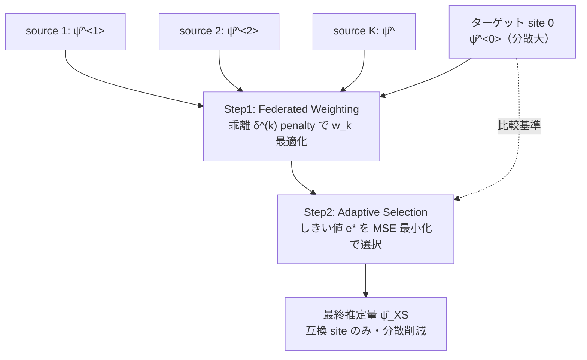

# Heterogeneity-Aware Federated Causal Inference Leveraging Effect-Measure Transportability (PFWS)

- **Link**: https://arxiv.org/abs/2510.16317
- **Authors**: Siqi Cao, Shu Yang
- **Year**: 2025（v1: 2025-10-18、v2: 2025-11-20）
- **Venue**: arXiv (stat.ME — Statistics > Methodology)
- **Type**: 方法論論文（連合因果推論、transportability による site 選択）

---

## Abstract (English)

Federated learning of causal estimands offers a powerful strategy to improve estimation efficiency by leveraging data from multiple study sites while preserving privacy. Existing literature has primarily focused on the average treatment effect using single data source, whereas our work addresses a broader class of causal measures across multiple sources. We derive and compare semiparametrically efficient estimators under two transportability assumptions, which impose different restrictions on the data likelihood and illustrate the efficiency-robustness tradeoff. This estimator also permits the incorporation of flexible machine learning algorithms for nuisance functions while maintaining parametric convergence rates and nominal coverage. To further handle scenarios where some source sites violate transportability, we propose a Post-Federated Weighting Selection (PFWS) framework, which is a two-step procedure that adaptively identifies compatible sites and achieves the semiparametric efficiency bound asymptotically. This framework mitigates the efficiency loss of weighting methods and the instability and computational burden of direct site selection in finite samples. Through extensive simulations and real-data analysis, we demonstrate that our PFWS framework achieves superior variance efficiency compared with the target-only analyses across diverse transportability scenarios.

## Abstract (日本語訳)

因果推定量の連合学習は、プライバシーを保ちつつ複数の研究 site のデータを活用して推定効率を高める強力な戦略である。既存研究は主に単一データソースの平均処置効果に焦点を当てていたが、本研究は複数ソースにわたるより広いクラスの因果測度（causal measures）を扱う。データ尤度に異なる制約を課す 2 つの transportability 仮定の下で半パラメトリック効率的な推定量を導出・比較し、効率と頑健性のトレードオフを示す。この推定量は、パラメトリック収束レートと名目被覆率を保ちつつ、nuisance 関数に柔軟な機械学習を組み込むことを許す。さらに一部のソース site が transportability を破る状況に対処するため、Post-Federated Weighting Selection（PFWS）フレームワークを提案する。これは、互換な site を適応的に特定し、漸近的に半パラメトリック効率境界を達成する 2 段階手続きである。本フレームワークは、重み付け法の効率損失と、有限標本での直接的 site 選択の不安定性・計算負荷の双方を緩和する。広範なシミュレーションと実データ解析により、PFWS が多様な transportability シナリオでターゲットのみの解析を上回る分散効率を達成することを示す。

---

## Overview

複数 site の観測データから、ターゲット site の因果測度（ATE に限らずリスク比など広いクラス）を、**プライバシーを保ちつつ効率的に推定**する連合因果推論。中核は 2 つ:

1. **2 つの transportability 仮定**下での半パラメトリック効率的推定量の導出と比較（効率-頑健性トレードオフの明示）。
2. **PFWS（Post-Federated Weighting Selection）**: 一部ソース site が transportability を破っても、互換な site を適応的に選び、漸近的に効率境界を達成する 2 段階手続き。

これにより、「ターゲット site だけのデータでは不十分だが、互換なソース site から安全に情報を借りる」ことを、誤った site の混入リスクを制御しながら実現する。

## Problem（解決すべき課題）

- 既存の連合因果推論は主に単一ソースの ATE に限定。より広い因果測度（リスク比等）や複数ソースは未対応。
- ソース site から情報を借りたいが、**一部の site は transportability（ターゲットと互換な効果構造）を満たさない**。互換でない site を混ぜるとバイアス。
- 単純な重み付け法は効率損失、直接的 site 選択は有限標本で不安定かつ計算負荷大。
- プライバシー制約で個人データを集約できない。

## Proposed Method（提案手法）

### 中核アイデア

2 種類の transportability 仮定を使い分ける:
- **Condition 1(k)**: 処置効果の transportability $\tau^{(0)}(X) = \tau^{(k)}(X)$（緩い）。
- **Condition 2(k)**: 条件付きアウトカムの transportability $\mu_a^{(0)}(X) = \mu_a^{(k)}(X)$（厳しい）。

Condition 2 は厳しいがより高効率。両方成立時は Condition 2 の効率境界が小さい（Theorem 3）。破られた site は PFWS で自動除外。

### 手順

1. **EIF 導出**: 各 transportability 仮定下で効率的影響関数（EIF）を導出（Theorem 1: Condition 1、Theorem 2: Condition 2）。密度比 $q^{(k)}(x)$ で共変量分布の異質性を補正。
2. **Federated Weighting（Step 1）**: 各 site の推定量とターゲットとの乖離 $\hat\delta^{(k)}$ を penalty として重み $w_k$ を最適化。
3. **Adaptive Selection（Step 2）**: しきい値 $e^*$ をブートストラップで MSE 最小化により選び、$\hat w_k \geq e^*$ の site のみ採用。
4. 選択された site で最終推定量 $\hat\psi_{XS}^{(0)}$ を構成（漸近正規、選択 site のみに依存する分散）。

### Key Formulas（主要数式）

Condition 1 下の効率的影響関数（Theorem 1）:
$$\varphi_1^{(0)}(V) = \frac{I(S=0)\{\mu_1^{(0)}(X)-\psi_1^{(0)}\} + \sum_{k=0}^{K}\frac{C_{1k}}{\sum_j C_{1j}}H_1^{(k)}(V)}{\mathrm{pr}(S=0)}$$

Condition 2 下の項（Theorem 2、密度比 $q^{(k)}$ 付き）:
$$H_2^{(k)}(V) = \frac{I(S=k)Aq^{(k)}(X)\{Y-\mu_1(X)\}}{\pi^{(k)}(X)}$$

密度比重み: $q^{(k)}(x) = \dfrac{\mathrm{pr}(S=0|X)}{\mathrm{pr}(S=k|X)}$。

PFWS Step 1（Federated Weighting 損失、乖離 penalty 付き）:
$$Q(w) = \mathbb{P}_n\left\{\left(\hat\varphi_1^{(0)\langle 0\rangle} - \sum_{k\neq 0}w_k\hat\varphi_1^{(0)\langle k\rangle}\right)^2\right\} + \lambda_n\sum_{k\neq 0}|w_k|(\hat\delta^{(k)})^2$$
$$\text{s.t. } 0\leq w_k\leq 1,\ \sum_k w_k=1, \quad \hat\delta^{(k)} = |\hat\psi_1^{(0)\langle k\rangle} - \hat\psi_1^{(0)\langle 0\rangle}|$$

PFWS Step 2（Adaptive Selection、しきい値 $e$ の MSE 推定を最小化）:
$$\widehat{\mathrm{MSE}}(e) = (\hat\psi_e^{(0)} - \hat\psi^{(0)\langle 0\rangle})^2 + 2\widehat{\mathrm{cov}}(\hat\psi_e^{(0)}, \hat\psi^{(0)\langle 0\rangle}) - \hat V(\hat\psi^{(0)\langle 0\rangle})$$

### 理論結果

- **Theorem 3**: 両条件成立時、Condition 2 の半パラメトリック効率境界 < Condition 1。
- **Theorem 4–6**: multiple robustness（$\tau(x)$ 正しいか、$\pi^{(k)}$ と $\mu_0^{(k)}$ が同時に誤特定でなければ一致）、rate robustness（ML nuisance でもパラメトリック収束）、local efficiency。
- **Theorem 7 & 8**: 非互換 site で $\hat w_k \to_p 0$、最終推定量は選択 site のみに依存する分散で漸近正規。

## Algorithm（擬似コード）

```text
PFWS: Post-Federated Weighting Selection
Input: target site 0, source sites 1..K; EIF estimates φ̂^(k); λ_n; bootstrap B

# Step 1: Federated Weighting
solve  min_w  Q(w) = P_n[(φ̂^<0> − Σ_{k≠0} w_k φ̂^<k>)^2] + λ_n Σ |w_k| δ̂^(k)^2
       s.t. 0 ≤ w_k ≤ 1, Σ w_k = 1
       δ̂^(k) = |ψ̂^<k> − ψ̂^<0>|          # site k のターゲットとの乖離

# Step 2: Adaptive Selection（Algorithm 1）
for threshold e in grid E:
  select sites  S_e = { k : ŵ_k ≥ e }
  ψ̂_e = 選択 site で再推定
  M̂SE(e) = (ψ̂_e − ψ̂^<0>)^2 + 2 cov̂(ψ̂_e, ψ̂^<0>) − V̂(ψ̂^<0>)   # B ブートストラップで推定
e* = argmin_e M̂SE(e)
return ψ̂_{XS} = ψ̂_{e*}   # 互換 site のみで構成、漸近正規
```

## Architecture / Process Flow



## Figures & Tables

### 表 1: 実データ eICU — リスク比推定（narrow CI ほど良い）

| Method | Estimate | SE | 95% CI |
|--------|----------|-----|---------|
| DR-t（ターゲットのみ） | 1.08 | 0.32 | [0.44, 1.71] |
| **FSMR1（PFWS）** | **0.97** | **0.22** | **[0.54, 1.39]** |

FSMR1 は site 243 を transportable として選択し、DR-t より狭い CI（SE 0.32 → 0.22）を達成。

### 表 2: シミュレーションシナリオ設計

| シナリオ | 設定 | 内容 |
|---------|------|------|
| Scenario 1 | 処置効果 transportable、アウトカムシフトあり | Case 1.1: シフトなし / Case 1.2: bμ^(1)=-10, bμ^(2)=15 |
| Scenario 2 | アウトカムシフト、transportability 可変 | 2.1 全 transportable / 2.2 部分 / 2.3 なし |

### 表 3: シミュレーション結果の定性まとめ（M=500 反復、n=1000、3 sites）

| ケース | MR1 | MR2 | FSMR1（PFWS） | DR-t |
|-------|-----|-----|--------------|------|
| 1.2（誤特定あり） | 最も効率的 | Condition 2 成立時のみ効率的 | — | — |
| 2.1（全 transportable） | — | — | MR1 に一致、DR-t より高効率 | 基準 |
| 2.2（部分 transportable） | — | — | 有効被覆、DR-t は不整合 | 不整合 |
| 2.3（transportable なし） | — | — | ≈ DR-t（最悪ケース境界） | 基準 |

### 表 4: 手法比較（設計上の差異）

| 手法 | 情報借用 | 非互換 site 対応 | 因果測度 | 効率 |
|------|---------|----------------|---------|------|
| DR-t（target-only） | なし | 影響なし | 汎用 | ターゲット分散のみ（大） |
| 単純 pooling | 全 site 使用 | ✗（バイアス混入） | ATE 中心 | 高いがバイアスリスク |
| 重み付け法（naive） | ソフト重み | ✓（効率損失） | 汎用 | 効率損失 |
| 直接 site 選択 | ハード選択 | ✓（不安定・重い） | 汎用 | 有限標本で不安定 |
| **PFWS (FSMR1)** | **適応的選択** | **✓（δ penalty + 適応しきい値）** | **広いクラス** | **半パラ効率境界（漸近）** |

## Experiments & Evaluation

### Setup

- **シミュレーション**: M=500 反復、n=1000、3 sites。Scenario 1（処置効果 transportable + アウトカムシフト）、Scenario 2（transportability 可変: 全/部分/なし）。指標: バイアス、SE、MSE、CI 被覆率。
- **実データ**: eICU Collaborative Research Database。ターゲット site 167（n=158）、ソース site 199（n=76）/243（n=84）/449（n=86）。処置=昇圧薬（vasopressor）投与、アウトカム=院内死亡、共変量 8（年齢・体重・体温・血糖・BUN・クレアチニン・WBC・血小板）。

### Main Results

- Scenario 1.2（誤特定あり）: MR1 が最も効率的。MR2 は Condition 2 が成立し nuisance が正しい時のみ効率的。
- Scenario 2.2（部分 transportable）: FSMR1 が有効被覆を維持、DR-t は不整合。
- Scenario 2.3（transportable なし）: FSMR1 は DR-t に一致（最悪ケースでも劣化しない安全設計）。
- eICU: FSMR1 が site 243 を選択、リスク比 0.97（SE 0.22）で DR-t（1.08、SE 0.32）より狭い CI。

## 本テーマへの適用可能性

本テーマ（散発的なマーケティングキャンペーンで、対象ユーザ・施策が異なる。類似キャンペーン/ユーザをグルーピングして密度を高め、実験間隔を短縮したい）に対し、PFWS の「**互換なキャンペーンだけを安全に束ねる**」設計は実務上きわめて価値が高い。

- **「どのキャンペーンが借用に使えるか」を自動判定**: 本テーマの核心課題は「似たキャンペーンをグルーピングしたいが、実は効果構造が違うキャンペーンを混ぜるとバイアスになる」こと。PFWS はまさにこの問題に対し、**transportability を破るキャンペーン（=効果構造が現ターゲットと非互換）を $\hat w_k \to 0$ で自動的に除外**し、互換なキャンペーンだけから情報を借りる。Theorem 7/8 が非互換 site の除外を理論保証するため、「間違ったグルーピングによるバイアス」を制御できる。
- **ターゲットのみ分析からの分散削減 = 実験間隔短縮**: eICU 実データで DR-t（ターゲットのみ）の SE 0.32 が FSMR1 で 0.22 に縮小したように、**新キャンペーン単独では推定精度が足りなくても、過去の互換キャンペーンを借りることで有効サンプルを増やし、より短い観測期間で結論を出せる**。これは本テーマの「実効的な実験間隔の短縮」に直接対応する。
- **最悪ケースでも劣化しない安全性**: Scenario 2.3（互換キャンペーンが 1 つもない）でも FSMR1 は DR-t に一致するため、「借りられるものがなければ単独分析に自然に退化する」。誤った借用でターゲット単独より悪化するリスクがない点が、散発キャンペーンの意思決定で安心して使える理由になる。
- **広い因果測度に対応**: ATE だけでなくリスク比などにも対応するため、マーケティングの多様な KPI（コンバージョン率比、ROI 比など）に適用しやすい。
- **プライバシー/組織境界**: 連合設計なので、異なるチーム・パートナーのキャンペーンデータを個人情報を出さずに統合できる。
- **注意点**: 各キャンペーン（site）で局所的に nuisance（傾向スコア・アウトカムモデル）を推定できる程度のサンプルは必要で、超小規模キャンペーンばかりでは推定が不安定。また transportability の判定は共変量ベースの効果構造の一致に依存するため、観測されない交絡でキャンペーン間差が生じている場合は誤選択の余地がある。

## Notes

- 手法名: 2 つの transportability 条件下の推定量 MR1/MR2、および PFWS フレームワーク（実装名 FSMR1）。ベースライン: DR-t（target-only）。
- 実データは医療（eICU）。マーケティングへの適用は本テーマ側の類推。
- コード公開の有無は取得情報からは**記載なし**。
- 表 3 は取得要約の定性記述をまとめたもので、個別のバイアス/SE/MSE 数値は要約に含まれていない（**具体値は記載なし**）。図（forest plot、τ-ratio 診断）の画像 URL は取得要約に含まれなかったため画像埋め込みは行っていない。
