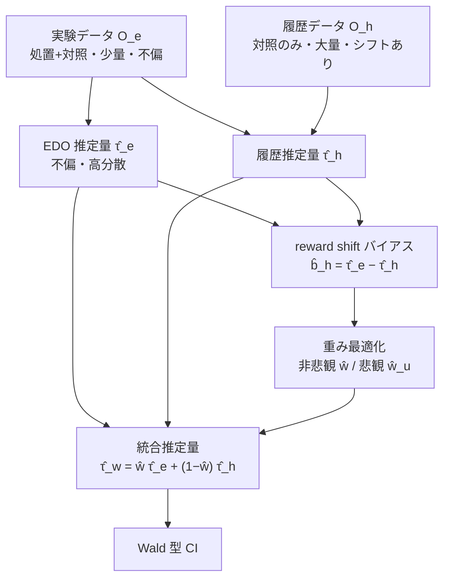

# Combining Experimental and Historical Data for Policy Evaluation

- **Link**: https://arxiv.org/abs/2406.00317
- **Authors**: Ting Li, Chengchun Shi, Qianglin Wen, Yang Sui, Yongli Qin, Chunbo Lai, Hongtu Zhu
- **Year**: 2024（submitted June 1, 2024）
- **Venue**: arXiv (stat.ML — Statistics > Machine Learning)
- **Type**: 方法論論文（実験+履歴データ統合による方策評価、ライドシェア実応用）

---

## Abstract (English)

This paper studies policy evaluation with multiple data sources, especially in scenarios that involve one experimental dataset with two arms, complemented by a historical dataset generated under a single control arm. We propose novel data integration methods that linearly integrate base policy value estimators constructed based on the experimental and historical data, with weights optimized to minimize the mean square error (MSE) of the resulting combined estimator. We further apply the pessimistic principle to obtain more robust estimators, and extend these developments to sequential decision making. Theoretically, we establish non-asymptotic error bounds for the MSEs of our proposed estimators, and derive their oracle, efficiency and robustness properties across a broad spectrum of reward shift scenarios. Numerical experiments and real-data-based analyses from a ridesharing company demonstrate the superior performance of the proposed estimators.

## Abstract (日本語訳)

本論文は、複数データソースを用いた方策評価（policy evaluation）を、特に「2 アーム（処置・対照）の実験データ 1 つ」と「単一の対照アームの下で生成された履歴データ」を補完的に用いるシナリオで研究する。実験データと履歴データに基づいて構成した基礎方策価値推定量を線形に統合し、統合推定量の平均二乗誤差（MSE）を最小化するよう重みを最適化する新しいデータ統合手法を提案する。さらに悲観主義原理（pessimistic principle）を適用してより頑健な推定量を得、これを逐次意思決定へ拡張する。理論的には、提案推定量の MSE に対する非漸近的誤差限界を確立し、広範な報酬シフト（reward shift）シナリオにわたって oracle 性・効率性・頑健性を導出する。数値実験とライドシェア企業の実データに基づく解析により、提案推定量の優れた性能を示す。

---

## Overview

**A/B テスト（実験データ、処置+対照 2 アーム）は少量だが信頼できる**一方、**履歴データ（過去の単一対照方策下のログ）は大量だが分布シフト（reward shift / covariate shift）を含む**。本論文は、この 2 つを線形に統合して方策価値を評価する枠組みを提案する。

中核: 2 つの基礎推定量を凸結合し、MSE を最小化する重み $w \in [0,1]$ を推定する。

$$\hat\tau_w = w\cdot\hat\tau_e + (1-w)\cdot\hat\tau_h$$

- $\hat\tau_e$（EDO 推定量）: 実験データのみを使用（不偏だが高分散）。
- $\hat\tau_h$（履歴推定量）: 対照方策部分に履歴データを使用（低分散だが reward shift でバイアス）。

さらに **pessimistic 版**でバイアス不確実性を上限評価し頑健化、逐次意思決定（MDP、double RL）へ拡張。

## Problem（解決すべき課題）

- A/B テスト（実験）は少量で効果サイズが小さい（例: 0.5–5%）ため信号が弱く、推定分散が大きい。
- 履歴データは大量だが、実験時点と分布が異なる（reward shift、covariate shift）ため単純併用でバイアス。
- reward shift の大きさは未知で、事前にどれだけ履歴データを信じてよいか不明。
- 逐次的な意思決定（時間依存の処置割り当て）への拡張が必要。

## Proposed Method（提案手法）

### 中核アイデア

「不偏だが高分散の実験推定量」と「低分散だがバイアスありの履歴推定量」を、MSE（=バイアス²+分散）を最小化するよう最適な重み $w$ で凸結合する。reward shift が小さければ履歴に寄せ（分散削減）、大きければ実験に寄せる（バイアス回避）よう $w$ が自動調整される。

### 手順

1. **基礎推定量の構成**: 実験データから $\hat\tau_e$、実験の処置部分+履歴の対照部分から $\hat\tau_h$ を doubly robust 形式で構成。
2. **バイアス推定**: reward shift バイアス $b_h$ を不偏推定量 $\hat b_h = \hat\tau_e - \hat\tau_h$ で推定。
3. **非悲観的重み**: MSE を最小化する $\hat w$ を閉形式で計算。
4. **悲観的重み（pessimistic）**: $b_h$ の不確実性 $U$ を組み込み、$(|\hat b_h| + U)^2$ をバイアス² の上限として頑健な $\hat w_u$ を選択。
5. **逐次拡張**: MDP 設定へ double RL 推定量で拡張。

### Key Formulas（主要数式）

線形統合推定量:
$$\hat\tau_w = w\cdot\hat\tau_e + (1-w)\cdot\hat\tau_h, \qquad \mathrm{MSE}(\hat\tau_w) = \mathrm{Bias}^2(\hat\tau_w) + \mathrm{Var}(\hat\tau_w)$$

reward shift バイアス（実験対照と履歴の乖離）:
$$b_h = \mathbb{E}[r_e(0, S_e)] - \mathbb{E}[r_h(S_e)]$$

非悲観的最適重み（閉形式）:
$$\hat w = \frac{\hat b_h^2 + \widehat{\mathrm{Var}}(\hat\tau_h) - \widehat{\mathrm{Cov}}(\hat\tau_e, \hat\tau_h)}{\widehat{\mathrm{Var}}(\hat\tau_e) + \hat b_h^2 + \widehat{\mathrm{Var}}(\hat\tau_h) - 2\widehat{\mathrm{Cov}}(\hat\tau_e, \hat\tau_h)}$$

悲観的原理（バイアス不確実性 $U$、信頼水準 $1-\alpha$）:
$$\mathbb{P}(|\hat b_h - b_h| \leq U) \geq 1 - \alpha, \qquad \text{バイアス}^2 \text{上限に } (|\hat b_h| + U)^2 \text{ を使用}$$

doubly robust 基礎推定量:
$$\psi_e(O_e) = \sum_{a=0}^{1}(-1)^{a-1}\left\{r_e(a, S_e) + \nu^a(A_e|S_e)[R_e - r_e(A_e, S_e)]\right\}$$

Wald 型信頼区間:
$$\left[\hat\tau_{\hat w} - \Phi^{-1}(1-\alpha)\sqrt{\widehat{\mathrm{Var}}(\hat\tau_{\hat w})},\ \hat\tau_{\hat w} + \Phi^{-1}(1-\alpha)\sqrt{\widehat{\mathrm{Var}}(\hat\tau_{\hat w})}\right]$$

### 理論結果

- **Assumption 1（Coverage）**: 傾向スコアの positivity、密度比の有界性。
- **Assumption 2（Boundedness）**: 報酬・報酬関数・傾向スコアの有界性。
- **Assumption 3（Double Robustness）**: 報酬関数か密度比のいずれかが正しく特定されればよい。
- **Theorem 1（非悲観的 MSE）**: 超過 MSE は $\mathbb{E}[(1-w^*)^2 - (1-\hat w)^2](\hat b_h^2 - b_h^2) + O(R_{max}^2/(\epsilon^2 n_{min}^{3/2}))$ で有界。
- **Theorem 2（悲観的 MSE）**: 超過 MSE は $(1-w^*)^2\mathbb{E}[(|\hat b_h|+U)^2 - b_h^2] + O(\cdots) + O(\alpha[\cdots])$ で有界。

## Algorithm（擬似コード）

```text
Input: 実験データ O_e（処置+対照）, 履歴データ O_h（対照のみ）, 信頼水準 α
# 1. 基礎推定量（doubly robust）
τ̂_e = EDO(O_e)                        # 実験のみ（不偏・高分散）
τ̂_h = Hist(O_e の処置部分 + O_h)       # 履歴活用（低分散・バイアス b_h）
# 2. reward shift バイアス推定
b̂_h = τ̂_e − τ̂_h                       # 不偏推定
# 3a. 非悲観的重み（閉形式 MSE 最小化）
ŵ = (b̂_h² + Var̂(τ̂_h) − Côv(τ̂_e,τ̂_h))
    / (Var̂(τ̂_e) + b̂_h² + Var̂(τ̂_h) − 2 Côv(τ̂_e,τ̂_h))
# 3b. 悲観的重み（バイアス不確実性 U を上限に）
choose U s.t. P(|b̂_h − b_h| ≤ U) ≥ 1−α
ŵ_u = argmin_w  w² Var̂(τ̂_e) + (1−w)²[(|b̂_h|+U)² + Var̂(τ̂_h)] + cross terms
# 4. 統合推定 & 信頼区間
τ̂_w = ŵ τ̂_e + (1−ŵ) τ̂_h
CI = τ̂_w ± Φ⁻¹(1−α) √Var̂(τ̂_w)
# 逐次拡張: MDP 設定で double RL 推定量に置換
```

## Architecture / Process Flow



## Figures & Tables

### 表 1: 報酬シフト大きさ別の推定量特性（定性まとめ）

| シナリオ | 条件 | Non-Pessimistic | Pessimistic |
|---------|------|-----------------|-------------|
| Zero | b_h = 0 | 効率境界に近い | oracle MSE オーダー |
| Small | \|b_h\| ≪ n^(-1/2) R_max/ε | oracle MSE に近い | oracle MSE オーダー |
| Moderate | n^(-1/2) R_max/ε ≤ \|b_h\| ≤ n^(-1/2)√log(n) R_max/ε | 大 MSE の恐れ | **oracle 性を保持** |
| Large | \|b_h\| ≫ n^(-1/2)√log(n) R_max/ε | oracle 性 | oracle 性 |

**要点**: 悲観版は moderate シフトで頑健、非悲観版はシフトが小さいか明確に大きい時に有利。

### 表 2: 手法比較（設計上の差異）

| 手法 | 使用データ | バイアス | 分散 | シフト適応 |
|------|-----------|---------|------|----------|
| EDO（τ̂_e） | 実験のみ | なし（不偏） | 大 | — |
| SPE（半パラ効率） | 実験のみ | なし | 効率境界 | — |
| 履歴のみ（τ̂_h） | 履歴中心 | b_h（reward shift） | 小 | ✗ |
| **提案 非悲観 τ̂_ŵ** | **実験+履歴** | **MSE 最小化で制御** | **削減** | **✓（w 自動調整）** |
| **提案 悲観 τ̂_ŵu** | **実験+履歴** | **上限評価で頑健化** | **削減** | **✓✓（moderate に強い）** |

### 表 3: 実験設定（Example 6.1 非動的シミュレーション）

| 項目 | 設定 |
|------|------|
| コンテキスト | S ~ N(0,1) |
| アクション | 2 値 |
| 実験データ | ランダム化 50-50 割り当て、n_e サンプル |
| 履歴データ | 対照方策のみ、n_h サンプル |
| 比較対象 | EDO, SPE（半パラ効率）, 提案の非悲観/悲観重み推定量 |
| 指標 | reward shift 大きさを変えた MSE |

### 表 4: 逐次拡張と実応用（要約）

| 項目 | 内容 |
|------|------|
| 逐次設定 | 時間変動 MDP、double RL 推定量で τ̂_e / τ̂_h を構成 |
| 実データ | ライドシェア企業、2 週間 A/B テスト |
| 効果サイズ | 典型 0.5–5%（弱信号、履歴統合が必要な動機） |
| 履歴データ | 現行方策下で大量 |
| 結果 | 履歴が信頼できる時、EDO ベースライン比で MSE を大幅削減 |

## Experiments & Evaluation

### Setup

- **Example 6.1（非動的）**: ガウス文脈バンディット。文脈 $S\sim N(0,1)$、2 値アクション。実験はランダム化 50-50、履歴は対照方策のみ。EDO / SPE / 提案手法を比較、reward shift を変えて MSE 評価。
- **実データ**: ライドシェア企業の 2 週間 A/B テスト。効果サイズ 0.5–5% の弱信号。現行方策下の大量履歴データを統合。

### Main Results

- 履歴が信頼できる（reward shift 小）時、提案手法は EDO ベースライン比で MSE を大幅削減。
- 悲観版は moderate シフト領域で非悲観版より頑健（oracle 性を保持）。
- 逐次（MDP）設定へ double RL 推定量で拡張し実データで検証。
- 具体的な MSE 数値・削減率は取得情報では**記載なし**（定性的に「substantially reduce MSE」と報告）。

### Robustness / Oracle 性

- 表 1 の通り、reward shift の 4 領域（Zero/Small/Moderate/Large）で oracle 性・効率性・頑健性を理論的に特徴づけ。

## 本テーマへの適用可能性

本テーマ（散発的なマーケティングキャンペーンで、対象ユーザ・施策が異なる。類似キャンペーン/ユーザをグルーピングして密度を高め、実験間隔を短縮したい。uplift モデリング / off-policy 評価が目的）に対し、本論文は**「少量の新規実験 + 大量の過去ログ」を安全に統合する**という、まさに中核的な問いに答えている。

- **「散発的な小規模実験」を「大量の過去キャンペーンログ」で補強**: 本テーマの典型は「新しいクーポン/メール施策の A/B テストは頻繁に打てず、各回のサンプルも少ない（効果サイズ 0.5–5% の弱信号）」状況。これはライドシェア実データの設定と完全に一致する。本手法は、**新規実験（不偏だが高分散）を過去キャンペーンの履歴ログ（大量だがシフトあり）で補強**し、MSE を最小化する重みで統合するため、**少ない実験サンプルでも精度の高い効果推定を得られ、実効的な実験間隔を短縮**できる。
- **reward shift の自動制御 = 安全なグルーピング**: 過去キャンペーンと現キャンペーンで効果構造がどれだけずれているか（reward shift $b_h$）を $\hat b_h = \hat\tau_e - \hat\tau_h$ で推定し、ずれが小さければ履歴に寄せ、大きければ実験に寄せる。これは「似た過去キャンペーンだけを実質的に取り込む」自動グルーピングと等価で、**本テーマの「類似キャンペーンをグルーピングして密度を高める」を MSE 最適な形で実現**する。
- **悲観版が中途半端なシフトに強い**: 実務で最も厄介なのは「過去キャンペーンが似ているようで微妙に違う（moderate shift）」ケース。悲観版はこの領域で oracle 性を保持するため、**「似ているか確信が持てない過去データ」を混ぜても失敗しにくい**。これは散発キャンペーンの意思決定で安心材料になる。
- **off-policy 評価・逐次意思決定に直結**: 本手法は方策価値評価（policy evaluation = OPE）そのもので、MDP 逐次拡張も持つ。本テーマが uplift だけでなく off-policy 評価を志向する点にそのまま対応し、「過去ログで新方策の価値を評価する」用途に使える。
- **R コード公開**: https://github.com/tingstat/Data_Combination で実装が公開されており、再現・適用が容易。
- **注意点**: 履歴データは「対照アーム（現行方策）」のログである前提。新キャンペーンの処置アームに相当する履歴がない場合、処置側の情報は実験のみに依存する。また Coverage（positivity）・Boundedness・Double Robustness の仮定が必要で、過去ログの対象ユーザ分布が現キャンペーンと大きく異なる（covariate shift 極端）場合は密度比の有界性が崩れうる。

## Notes

- 手法名は明示的な略称なし（非悲観的推定量 τ̂_ŵ / 悲観的推定量 τ̂_ŵu）。ベースライン: EDO（実験のみ）、SPE（半パラ効率）。
- 実データはライドシェア企業（匿名）。効果サイズ 0.5–5% は本文報告値。
- 具体的な MSE 削減率の数値は取得情報では**記載なし**。
- R コード: https://github.com/tingstat/Data_Combination（本文記載）。
- 図の画像 URL は取得要約に含まれなかったため画像埋め込みは行っていない。表 1/2/3/4 は本文の定性記述・設定を整理したもの。
