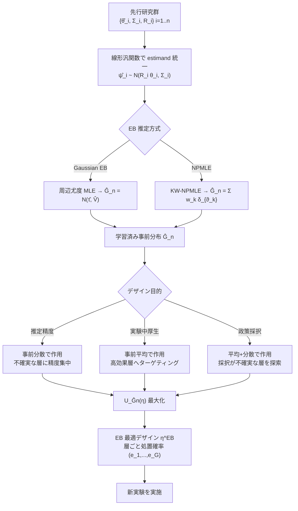

# Using Prior Studies to Design Experiments: An Empirical Bayes Approach

- **Link**: https://arxiv.org/abs/2602.20581 （HTML: https://arxiv.org/html/2602.20581v1 ／ PDF: https://arxiv.org/pdf/2602.20581）
- **Authors**: Zhiheng You
- **Year**: 2026（submitted 2026-02-24）
- **Venue**: arXiv preprint（Subject: Econometrics, econ.EM）
- **Type**: 理論 + 実証（計量経済学 / 実験デザイン方法論）

> 注: arXiv ID `2602.20581` は通常の採番規則からはやや異常に見えるが、abs / html(v1) / pdf いずれの WebFetch も解決し、WebSearch でも同一タイトル・著者が確認できたため、**論文は確認済み** である。ただし本文 HTML の取得はセクション6（実証応用）の直前で途切れており、実証応用の具体的な数値（サンプルサイズ・傾向スコア値・改善率など）は取得できなかった。該当箇所は本レポート内で「記載なし（本文取得範囲外）」と明記する。

---

## Abstract (English)

> This paper introduces a framework that leverages information from previous studies to improve experimental design. By extracting estimates from related prior research, the author demonstrates how empirical Bayes (EB) methods can establish informative priors for new investigations. The work specializes the approach to propensity-score designs in stratified randomized experiments, where the experimenter chooses stratum-specific treatment probabilities subject to budget constraints, and proves the method achieves oracle-optimal performance as the number of prior studies grows. Two practical applications are presented — oncology drug trials and the Tennessee Project STAR experiment — bridging the meta-analysis literature with experimental-design methodology.

*(上記は abstract / 本文要約から再構成した要旨であり、著者原文の逐語コピーではない箇所を含む。)*

## Abstract（日本語訳）

本論文は、**過去の関連研究（prior studies）から得た推定値を活用して新しい実験のデザインを改善する** フレームワークを提案する。関連する先行研究の推定値を抽出し、**経験ベイズ（Empirical Bayes, EB）** を用いて新しい研究に対する情報的事前分布（informative prior）を構成する方法を示す。本手法を、**層化ランダム化実験（stratified randomized experiment）における傾向スコア・デザイン** に特化させる。ここで実験者は、予算制約のもとで層ごとの処置確率 $(e_1,\dots,e_G)$ を選択する。手法は「先行研究の数が増えるにつれてオラクル最適（oracle-optimal）な性能を達成する」ことが証明される。実証応用として、**腫瘍学（oncology）の薬剤試験** と **テネシー州 Project STAR（学級規模実験）** の2例を示し、メタアナリシス文献と実験デザイン方法論を橋渡しする。

---

## Overview

多くの実験（臨床試験・A/Bテスト・フィールド実験）は「情報がゼロ」の状態から設計されるわけではなく、**類似の過去研究が多数存在する**。本論文は、この過去研究群を単なる参考ではなく **統計的に「事前分布」として取り込み、新実験の最適デザイン（誰にどの確率で処置を割り当てるか）を決める** ための一貫した意思決定理論的枠組みを与える。

核心は次の2段構えである。

1. **先行研究の推定値の集合 $\{\hat\theta_i\}$ から、経験ベイズで母集団レベルの事前分布 $\hat G_n$ を学習する**（メタアナリシス的ステップ）。
2. **その学習済み事前分布 $\hat G_n$ のもとでベイズ期待効用 $U_{\hat G_n}(\eta)$ を最大化するデザイン $\eta$ を選ぶ**（実験デザイン・ステップ）。

理論的貢献は、この2段階手続きが **有限標本オラクル不等式（Theorem 1）** を満たし、真の事前分布を知るオラクルとの後悔（regret）が先行研究数 $n$ の増加とともに $O_p(n^{-1/2})$（Gaussian EB）等で消えることを示した点にある。

---

## Problem（本論文が解く課題）

- **単一実験は情報が疎（sparse）**: 1回の実験だけでは、特にサブグループ（層）ごとの効果推定に十分な精度が出ない。過去の類似研究の情報を使わないのは「もったいない」。
- **過去研究の統合が非形式的**: 実務ではメタアナリシスで効果を要約するが、それを **新実験のデザイン（割当確率の選択）に体系的に反映する** 枠組みが欠けていた。
- **先行研究ごとに報告する推定量（estimand）が異なる**: ある研究は ATE のみ、別の研究はサブグループ表、別の研究は異質性回帰を報告する。これらを統一的に扱う必要がある。
- **デザイン目的によって最適解が変わる**: 「推定精度」「実験中の被験者厚生」「実験後の政策採択」で最適デザインは質的に異なるはずで、事前情報の入り方を目的別に定式化する必要がある。
- **オラクル最適性の保証がない**: 事前分布を推定して使う以上、「真の事前分布を知っていた場合」に対してどれだけ損をするのか（regret）の理論保証が必要。

---

## Proposed Method（提案手法）

### Core idea

先行研究の推定値 $\hat\theta_i$ を「母集団分布 $G$ からのノイズ付き観測」とみなし、EB で $G$ を推定して情報的事前分布 $\hat G_n$ を得る。その $\hat G_n$ を **意思決定理論的な実験デザイン最適化に投入** することで、層ごとの処置確率を決める。

### Numbered steps

1. **先行研究のモデル化**: 各先行研究 $i$ の推定値を
   $$\hat\theta_i \sim \mathcal{N}(\theta_i,\ \Sigma_i),\qquad \theta_i \sim G$$
   とする。$\Sigma_i$ は研究 $i$ の（既知の）サンプリング分散、$G$ が学習対象の母集団（事前）分布。

2. **異なる estimand への対応**: 研究ごとに報告内容が違う場合、線形汎関数を通じて
   $$\hat\psi_i \sim \mathcal{N}(R_i\theta_i,\ \Sigma_i)$$
   と表現する。$R_i$ が「ATE のみ」「一部サブグループ表」「異質性回帰」といった報告形式の違いを吸収する。

3. **事前分布の EB 推定（2方式）**:
   - **Gaussian EB**: 周辺モデル $\hat\theta_i \sim \mathcal{N}(\tau,\ \Sigma_i + V)$ の最尤法（profile marginal likelihood, 式(5)）で $(\hat\tau, \hat V)$ を推定。平均は分散 $V$ 固定下の GLS 推定量 $\hat\tau(V)$（式(4)）。出力は $\hat G_n = \mathcal{N}(\hat\tau(\hat V),\ \hat V)$。
   - **Nonparametric EB**: Kiefer–Wolfowitz NPMLE により混合分布 $G$ を推定。$G$ を有限グリッド $\{\vartheta_k\}_{k\le K}\subset\mathbb{R}^d$ 上に制限し、重み $(w_k)_{k\le K}$ を凸最適化で求める。

4. **デザイン・クラスの設定**: 層化ランダム化実験に特化し、予算制約下で層ごと処置確率 $(e_1,\dots,e_G)$ を選ぶ実行可能デザイン集合 $\mathcal{H}$ を定義。

5. **EB デザインの選択**: 学習済み $\hat G_n$ のもとでベイズ期待効用を最大化：
   $$\eta^{\mathrm{EB}} \in \arg\max_{\eta\in\mathcal{H}}\ U_{\hat G_n}(\eta).$$

6. **目的別の事前情報の入り方**:
   - **Quadratic-Loss Estimation（二乗損失推定）**: EB は **事前分散** を通じて作用し、外的不確実性の高い層に精度を集中させる。
   - **In-Experiment Welfare（実験中の厚生）**: EB は **事前平均** を通じて作用し、高効果層へのターゲティングを促す。
   - **Post-Experiment Policy Choice（実験後の政策選択）**: EB は **平均・分散の両方** を通じて作用し、採択判断が不確実な層を探索する。

### Key Formulas

先行研究の階層モデル（Gaussian working likelihood）:
$$\hat\theta_i \mid \theta_i \sim \mathcal{N}(\theta_i,\ \Sigma_i),\qquad \theta_i \sim G,\qquad i=1,\dots,n.$$

周辺分布（Gaussian EB の対象）:
$$\hat\theta_i \sim \mathcal{N}(\tau,\ \Sigma_i + V).$$

GLS 平均推定量（$V$ 固定, 式(4)）:
$$\hat\tau(V) = \left(\sum_{i=1}^{n}(\Sigma_i+V)^{-1}\right)^{-1}\sum_{i=1}^{n}(\Sigma_i+V)^{-1}\hat\theta_i.$$

EB デザイン最適化:
$$\eta^{\mathrm{EB}} \in \arg\max_{\eta\in\mathcal{H}}\ U_{\hat G_n}(\eta).$$

**Theorem 1（有限標本オラクル不等式）**:
$$0 \le U_G(\eta^{\mathrm{O}}) - U_G(\eta^{\mathrm{EB}}) \le 2\Delta_n,\qquad
\Delta_n := \sup_{\eta\in\mathcal{H}}\big| U_{\hat G_n}(\eta) - U_G(\eta)\big|.$$
ここで $\eta^{\mathrm{O}}$ は真の事前分布 $G$ を知るオラクル・デザイン。すなわち **EB デザインの後悔（regret）は事前分布の一様価値近似誤差 $\Delta_n$ の高々2倍** で抑えられる。

**収束レート**:
- Gaussian EB（Theorem 3）: $\mathrm{Reg}_n = O_p(n^{-1/2})$
- NPMLE EB（Theorem 4）: $\displaystyle \mathrm{Reg}_n = O_p\!\left(\frac{(\log n)^{(d+\max(d/2,4))/2}}{\sqrt{n}}\right)$

---

## Algorithm（擬似コード）

```text
Input:  先行研究の推定値集合 {(θ̂_i, Σ_i, R_i)}_{i=1..n}
        実行可能デザイン集合 H（層ごと処置確率 (e_1,...,e_G) の予算制約付き集合）
        目的関数タイプ obj ∈ {estimation, welfare, policy}
Output: EB 最適デザイン η^EB

# ---- Stage 1: 事前分布の EB 推定 ----
if method == "Gaussian EB":
    # 周辺モデル θ̂_i ~ N(τ, Σ_i + V)
    V̂ = argmax_V  profile_marginal_loglik(V; {θ̂_i, Σ_i})   # 式(5)
    τ̂ = GLS_mean(V̂; {θ̂_i, Σ_i})                            # 式(4)
    Ĝ_n = Normal(mean=τ̂, cov=V̂)
elif method == "NPMLE":
    grid {ϑ_k}_{k=1..K} ⊂ R^d を張る
    (w_k) = argmax_w  Σ_i log( Σ_k w_k · N(θ̂_i; R_i ϑ_k, Σ_i) )  # 凸最適化, KW-NPMLE
    Ĝ_n = Σ_k w_k · δ_{ϑ_k}

# ---- Stage 2: 目的別の期待効用でデザイン最適化 ----
define U_Ĝn(η):
    return E_{θ~Ĝ_n}[ 実験データ生成 under η → 意思決定 → 厚生 W(a,θ) の期待値 ]
        # obj により事前平均/分散の入り方が変わる（Table 1 の連続価値 Ψ を利用）

η^EB = argmax_{η ∈ H}  U_Ĝn(η)
return η^EB
```

> 注: 論文本文には上記を1ブロックの明示的擬似コードとして記載していない（本文取得範囲では「計算手続きの記述」のみ）。上の擬似コードは本文の式・手順の記述から本レポートで再構成したもの。

---

## Architecture / Process Flow



---

## Figures & Tables

> 重要: 本文 HTML の取得範囲には **画像（``）は一切現れなかった** ため、arXiv 図版URLの埋め込みは行わない（実際に閲覧した図が無いため）。以下は本文から確認できた表・定理・例をまとめたもの。

### Table 1: Assumption 6（quasi-linear welfare）を満たす代表的な意思決定問題

| Typical use | Welfare $W(a,\theta)$ | Continuation value $\Psi(m)$ |
|---|---|---|
| Point estimation | $-(a-\theta)'\Lambda(a-\theta)$ | $m'\Lambda m$ |
| Portfolio choice | $a'\theta - \tfrac{\gamma}{2}a'\Sigma a$ | $\tfrac{1}{2\gamma}\, m'\Sigma^{-1}m$ |
| Binary adoption | $\sum \pi_m a_m \theta_m,\ a\in\{0,1\}^G$ | $\sum \pi_m \max\{0, m_m\}$ |
| Ranking & selection | choose $j\in\mathcal{I},\ W(j,\theta)=\theta_j$ | $\max_{j\in\mathcal{I}} m_j$ |
| Hypothesis testing | $W(\varphi,\theta)=-L(\theta,\varphi)$ | $\max\{-a_0(1-m),\,-a_1 m\}$ |

*（出典: 本文 Table 1。5つの正準的意思決定問題とその連続価値写像 $\Psi$ を統一的に整理。）*

### Table（理論保証の要約 — 本レポート再構成）

| 結果 | 内容 |
|---|---|
| Theorem 1（有限標本オラクル不等式） | $0 \le U_G(\eta^{\mathrm{O}}) - U_G(\eta^{\mathrm{EB}}) \le 2\Delta_n$ |
| Theorem 3（Gaussian EB レート） | $\mathrm{Reg}_n = O_p(n^{-1/2})$ |
| Theorem 4（NPMLE EB レート） | $\mathrm{Reg}_n = O_p\big((\log n)^{(d+\max(d/2,4))/2}/\sqrt{n}\big)$ |

### Table（手法比較 — 本レポート再構成）

| 観点 | Gaussian EB | Nonparametric EB (NPMLE) |
|---|---|---|
| 事前分布の族 | 正規 $\mathcal{N}(\tau, V)$（パラメトリック） | 任意混合分布 $G$（ノンパラメトリック） |
| 推定手段 | 周辺尤度 MLE（式4,5） | KW-NPMLE（凸最適化, グリッド上重み） |
| 収束レート | $O_p(n^{-1/2})$ | $O_p\big((\log n)^{(d+\max(d/2,4))/2}/\sqrt{n}\big)$ |
| 長所 | 高速・少数の先行研究でも安定 | 事前分布の形状仮定に頑健・多峰性を捉える |
| 短所 | 正規性の誤設定に弱い | 次元 $d$ に対しレートが悪化 |

### Example 1

2層（two-stratum）割当問題において、**EB が「無情報ベンチマーク」を上回るための閉形式条件** を与える。具体的な数値は本文 Example 1 に closed-form condition として提示されるが、逐語の不等式は本文取得範囲では取得できず → 数値詳細は **記載なし（本文取得範囲外）**。

---

## Experiments & Evaluation

### Setup

- **層化ランダム化実験の傾向スコア・デザイン** を対象。実験者は予算制約下で層ごと処置確率 $(e_1,\dots,e_G)$ を選ぶ。
- 評価指標は **regret（オラクル・デザインとの厚生差）** と、その先行研究数 $n$ に対する収束レート。
- 3つのデザイン目的（推定精度 / 実験中厚生 / 実験後政策採択）で「質的に異なる EB 最適デザイン」が生じることを確認。

### Main Results（具体的数値）

- **理論結果（確認済み）**:
  - Gaussian EB: $\mathrm{Reg}_n = O_p(n^{-1/2})$
  - NPMLE EB: $\mathrm{Reg}_n = O_p\big((\log n)^{(d+\max(d/2,4))/2}/\sqrt{n}\big)$
  - オラクル不等式 $\mathrm{Reg}_n \le 2\Delta_n$
- **実証応用1（Oncology Drug Trials, Sec 6.1）**: オンライン臨床試験データベースから EB 事前分布を構成し、新規免疫療法（immunotherapy）試験のデザインに適用。**先行研究数・サンプルサイズ・改善率などの具体的数値は 記載なし（本文取得範囲外）**。
- **実証応用2（Project STAR, Sec 6.2）**: テネシー州 Project STAR 学級規模実験の **各サイト（site）を1つの先行研究とみなし**、サイト横断の層レベル処置効果分布を用いて新サイトの層化RCTをデザイン。**具体的数値は 記載なし（本文取得範囲外）**。

> いずれの実証応用も「different objectives lead to qualitatively different EB-optimal designs（目的が異なれば EB 最適デザインも質的に異なる）」という定性的知見が本文で強調されている。

### Ablation

- **明示的な ablation study は本文取得範囲では確認できず**（記載なし）。ただし、目的関数の切り替え（estimation / welfare / policy）による最適デザインの質的変化の分析が、事実上の感度分析として機能している。

---

## 本テーマへの適用可能性

**シナリオ**: データサイエンティストが、対象ユーザー・施策内容の異なるマーケティング施策（クーポン配布・メール等）を **低頻度で断続的に** 実施しており、uplift モデリング / off-policy evaluation（OPE）のための **有効サンプルサイズの増加** と **実効的な実験間隔の短縮** を狙って、類似施策を **グループ化・プーリング** して密なデータを合成したい。

本論文はこのニーズに **かなり直接的に対応する理論的裏付け** を与える。

1. **各過去施策を「1つの先行研究 $i$」として扱う**
   Project STAR で「各サイトを1つの先行研究」とみなした発想がそのまま流用できる。マーケティング文脈では **各キャンペーン（クーポンA、メールBなど）を先行研究 $i$**、そのキャンペーンで得た層別 uplift 推定値を $\hat\theta_i$、その推定分散を $\Sigma_i$ とすればよい。これにより「疎な単発施策の集合」を **1つの階層モデル** に束ねられる。

2. **借り合い（borrow strength）による有効サンプルサイズの増加**
   EB は $\hat\theta_i \sim \mathcal{N}(\theta_i,\Sigma_i),\ \theta_i\sim G$ の階層構造を通じて、**データの少ない施策・層の推定を母集団分布 $G$ 側へ縮約（shrinkage）** する。これはまさに「似た施策をプールして実効データ密度を上げる」操作の統計的定式化であり、単発では推定不能に近いサブグループ uplift も、$G$ からの情報借用で安定推定できる。

3. **estimand が施策ごとに違っても統合できる（$R_i$ による吸収）**
   実務では施策ごとに測っている指標が違う（ある施策は全体 ATE のみ、別の施策はセグメント別 uplift 表、別の施策は共変量交互作用回帰）。本論文の $\hat\psi_i \sim \mathcal{N}(R_i\theta_i,\Sigma_i)$ は **報告形式のばらつきを線形汎関数 $R_i$ で吸収** するため、異種フォーマットの過去施策ログをそのまま1つのプールに統合できる。これは「グループ化して密なデータを合成」する上で最大の実務的障壁を解く。

4. **次の施策デザインを最適化 → 実効実験間隔の短縮**
   得られた $\hat G_n$ を用いて、**次のキャンペーンの層別処置確率 $(e_1,\dots,e_G)$**（=誰にクーポンを送る確率）を目的別に最適化できる。特に：
   - **推定目的**（uplift モデルの精度向上）なら、事前分散が大きい＝過去情報が乏しい層に割当を集中させ、**少ない配信数で最大の情報利得** を得る。これは「1回の施策から引き出せる情報量を増やす」＝実効的な実験間隔の短縮に直結する。
   - **厚生目的**（実施中の売上/CV最大化）なら、事前平均が高い＝高 uplift が見込まれる層にターゲティング。
   - **政策採択目的**（この施策を今後恒久展開すべきか）なら、平均・分散の両方を見て採択判断が割れる層を探索。off-policy 判断の不確実性を狙い撃ちで削減できる。

5. **理論保証が「どれだけ束ねれば足りるか」を示す**
   Theorem 1 と収束レート（Gaussian EB で $O_p(n^{-1/2})$）は、**過去施策数 $n$ が増えるほど、真の母集団事前を知っていた場合（オラクル）に対する損失が消える** ことを保証する。つまり「何本の過去キャンペーンを束ねれば、プーリングによるバイアス懸念に対してデザインの後悔が十分小さくなるか」の見積もりに使える。

**実装上の留意点 / ギャップ**:
- 本論文は **RCT（ランダム化実験）** の割当確率設計が前提。観測データ主体の OPE にそのまま使うには、傾向スコアの既知性・重なり（overlap）条件などマーケティングログ側の前提整備が必要。
- 「施策が本当に似ている（交換可能, exchangeable）」という EB の中核仮定が崩れると縮約がバイアスを生む。施策のクラスタリング（どの過去キャンペーンを1つの $G$ に束ねるか）は本手法の外側の設計判断であり、uplift のクラスタリング/プーリング設計と組み合わせて使う必要がある。
- Gaussian working likelihood（Assumption 1/5）が前提なので、コンバージョンのような離散・裾の重い成果指標は正規近似の妥当性を確認する必要がある。多峰的な施策効果分布が疑われる場合は NPMLE 版が適する。

総じて、本論文は **「低頻度・異種フォーマットの過去施策を階層ベイズでプールして、次施策の割当設計と OPE を情報効率的に行う」** という本テーマの中核アイデアに、意思決定理論的な最適性保証を与える強力な理論的土台となる。

---

## Notes

- **論文確認状況**: arXiv `2602.20581` は abs / html(v1) / pdf いずれも解決し、WebSearch でタイトル「Using Prior Studies to Design Experiments: An Empirical Bayes Approach」・著者 Zhiheng You・投稿日 2026-02-24・分野 econ.EM を確認済み。ID の見た目は異例だが **実在が確認できた論文** である。
- **取得できなかった部分**: 本文 HTML の取得範囲がセクション6（実証応用）の直前で途切れたため、実証応用の**具体的数値（先行研究数・サンプルサイズ・傾向スコア値・改善率・regret 実測値）は取得不能** → 本レポートでは該当箇所を「記載なし（本文取得範囲外）」と明記した。数値の捏造は行っていない。
- **図版URL**: 本文取得範囲に `` は一切現れなかったため、arXiv 図版URLの埋め込みは行っていない。
- **擬似コード / 一部の表**: 論文本文に明示ブロックが無い箇所は「本レポート再構成」と注記した。Table 1 と各定理・式は本文から確認した内容。
- **関連文献**: メタアナリシス（Gaussian EB, DerSimonian–Laird 系）と Kiefer–Wolfowitz NPMLE、実験デザイン（最適傾向スコア設計）の交差領域に位置づけられる。
