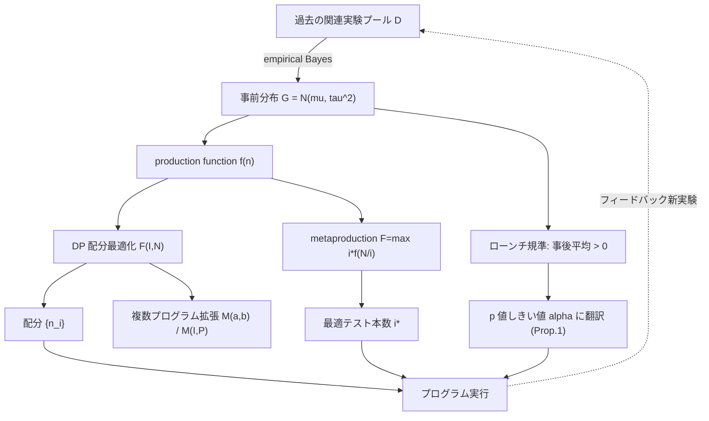

# Optimizing Returns from Experimentation Programs

- **Link**: https://arxiv.org/abs/2412.05508 / HTML: https://arxiv.org/html/2412.05508v1
- **Authors**: Timothy Sudijono, Simon Ejdemyr, Apoorva Lal, Martin Tingley（Netflix。Sudijono は当時 Netflix、現 Stanford University）
- **Year**: 2024（arXiv 初版 2024-12-07）
- **Venue**: Proceedings of the 26th ACM Conference on Economics and Computation (EC '25), DOI: 10.1145/3736252.3742638。arXiv 分類は Statistics > Methodology。Comments: 32 pages
- **Type**: 方法論論文（empirical Bayes / constrained optimization による実験プログラム設計）

---

## Abstract (English)

> Experimentation on online digital platforms is used to inform decision making. In particular, the goal of many experiments is to optimize a metric of interest. Null hypothesis statistical testing can be ill-suited to this task, as it is indifferent to the magnitude of effect sizes and opportunity costs. Given access to a pool of related past experiments, we discuss how experimentation practice should change when the goal is optimization. We survey the literature on empirical Bayes analyses of A/B test portfolios, and single out the A/B Testing Problem (Azevedo et al., 2020) as a starting point, which treats experimentation as a constrained optimization problem. We show that the framework can be solved with dynamic programming and implemented by appropriately tuning p-value thresholds. Furthermore, we develop several extensions of the A/B Testing Problem and discuss their implications for experimentation programs. Namely, we discuss how to leverage the fact that we can size experiments while accounting for the value of information, how to manage multiple experimentation programs, how to manage a single program over time, and how to allow units to be enrolled in multiple tests. We exemplify these lessons with data from Netflix experimentation programs.

*(注: 上記は abstract の趣旨を arXiv 掲載内容から再構成したもの。細部の逐語は原文を参照のこと。)*

## Abstract（日本語訳）

オンラインデジタルプラットフォーム上での実験は意思決定の材料として用いられる。特に多くの実験の目的は、ある関心指標（metric of interest）を最適化することにある。帰無仮説検定（NHST, p < 0.05）はこの目的に適さないことがある。なぜなら効果量（effect size）の大小や機会費用（opportunity cost）に対して無頓着だからである。過去の関連実験のプールにアクセスできる状況で、目的が「最適化」であるときに実験の実務がどう変わるべきかを論じる。A/B テストポートフォリオの empirical Bayes 分析に関する文献を概観し、実験を制約付き最適化問題として扱う **A/B Testing Problem**（Azevedo et al., 2020）を出発点として取り上げる。このフレームワークは動的計画法（dynamic programming）で解け、p 値しきい値を適切にチューニングすることで実装できることを示す。さらに A/B Testing Problem のいくつかの拡張を展開し、実験プログラムへの含意を議論する。具体的には、情報価値を考慮しながら実験サイズを決める方法、複数の実験プログラムを管理する方法、単一プログラムを時間軸で管理する方法、単位（ユーザー）を複数テストに登録する方法である。これらの教訓を Netflix の実験プログラムのデータで例示する。

---

## Overview

本論文は「実験の目的が仮説検定ではなく **最適化（optimization）** であるとき、実験プログラム全体をどう設計すべきか」を問う。従来の NHST は個々のテストで p < 0.05 を要求するが、これは効果量の大きさや、テストに費やしたトラフィックの機会費用を無視するため、プログラム全体の累積リターンを最大化する目的とは整合しない。

出発点は Azevedo et al. (2020) の **A/B Testing Problem**：I 個の未検証アイデアと N 単位の総トラフィック（allocation pool）が与えられたとき、各アイデアへの割り当て `nᵢ` とローンチするアイデア集合 S を選び、期待リターン `E[Σ_{i∈S} u(Δᵢ)]` を最大化する制約付き最適化問題である。効果 Δᵢ は事前分布 G から i.i.d. に引かれ、推定量 Δ̂ᵢ ~ N(Δᵢ, σ²/nᵢ)。empirical Bayes により過去実験のプールから G を推定する点が核心で、これが「関連する過去実験を束ねて情報を借りる（pooling）」ことに相当する。

主な結論（コストなし前提）：企業はもっと多くのアイデアをテストし、各テストの割り当てを小さくし、p 値しきい値を 0.05 から緩めるべき（Netflix データでは最適な片側 p 値がおよそ 0.50）。

---

## Problem

- NHST（p < 0.05）は効果量の大小・機会費用に無頓着で、「指標最適化」という真の目的と不整合。
- 限られた実験リソース（総トラフィック N、アイデア予算 I）を複数の未検証アイデアにどう配分するかが定式化されていない。
- 「少数の大きい実験」か「多数の小さい実験」か、というトレードオフに原理的な指針がない。
- 各実験から「勝ち treatment をローンチするか否か」の意思決定ルール（しきい値）が最適化目的から導かれていない。
- 複数プログラム間・時間軸・多重登録（一単位を複数テストに）といった実運用の複雑さが未整理。
- 単発・散発的な実験だけでは事前分布 G を安定推定できず、意思決定が改善しない。

---

## Proposed Method

### 核心アイデア

実験プログラムを **empirical Bayes + 制約付き最適化** として定式化し、過去の関連実験プールから効果の事前分布 G を推定する。この G のもとで、(1) トラフィック配分、(2) ローンチ判断しきい値、(3) 実験本数を、期待累積リターン最大化のために **dynamic programming** で同時に最適化する。ローンチ判断は「posterior mean（事後平均）が正か」という規準で、これは適切に調整された p 値しきい値と等価であることを示す。

### 手順

1. **プール構築と G の推定**: 関連する過去実験群から効果推定値を集め、empirical Bayes で事前分布 G（本論文では主に Gaussian prior、平均 μ・分散 τ²）を推定する。
2. **production function f(n) の計算**: N 単位のうち n 単位を単一アイデアに割り当てたときの期待リターン f(n) を、G と観測ノイズ σ²/n から算出する。
3. **DP による配分最適化**: I アイデア × N 単位の配分を `F(I,N) = max_{j=0..N} [F(I-1, N-j) + f(j)]` で解く（O(N²I)）。
4. **ローンチしきい値の導出**: 各テストで「事後平均 > 0」となる条件を p 値しきい値 α に翻訳（Proposition 1）。Gaussian prior・線形効用では最適 t 統計量しきい値が閉形式で得られる。
5. **実験本数の最適化**: metaproduction function `F(I,N) = max_i i·f(N/i)` を用い、最適サイズ x* と N, I の関係から最適本数を決定（Theorem 1 の 3 レジーム）。
6. **拡張の適用**: 複数プログラム（共有トラフィックプール／共有アイデア予算）、時間軸管理、多重登録へ DP を拡張。

### Key Formulas

目的関数（ローンチ集合 S の期待リターン）:

$$ \mathbb{E}\!\left[\sum_{i \in S} u(\Delta_i)\right],\qquad u(x)=x\ \text{(linear utility の場合)} $$

観測モデル（各アイデアの推定量）:

$$ \hat{\Delta}_i \sim \mathcal{N}\!\left(\Delta_i,\ \frac{\sigma^2}{n_i}\right),\qquad \Delta_i \sim G $$

配分の動的計画法（production function f を計算後、O(N²I)）:

$$ F(I,N) = \max_{j=0,\dots,N}\ \big[\,F(I-1,\ N-j) + f(j)\,\big] $$

最小コホートサイズ c₀ による大 N 近似:

$$ F(I,N) = \max_{j}\ \big[\,F(I-1,\ N - j c_0) + f(j c_0)\,\big] $$

Proposition 1（ローンチ規準と p 値しきい値の等価性）:

$$ \exists\,\alpha \ \text{s.t.}\quad p_i \le \alpha \iff \mathbb{E}\!\left[u(\Delta_i)\,\middle|\,\hat{\Delta}_i\right] > 0 $$

Gaussian prior・線形効用での最適 t 統計量しきい値:

$$ t^{*} = -\frac{\mu\,\sigma}{\tau^2\,\sqrt{n_i}} $$

Production function（Gaussian prior, linear utility）:

$$ f(n) = \frac{\tau^2}{\sqrt{v(n)}}\,\phi\!\left(\frac{\mu}{\tau^2}\sqrt{v(n)}\right) + \mu\,\Phi\!\left(\frac{\mu}{\tau^2}\sqrt{v(n)}\right),\qquad v(n) = \tau^2 + \frac{\sigma^2}{n} $$

Posterior mean（正規共役）:

$$ m = \hat{\Delta}_i\cdot\frac{\tau^2}{\tau^2 + \sigma^2/n_i} + \mu\cdot\frac{\sigma^2/n_i}{\tau^2 + \sigma^2/n_i} $$

metaproduction function（最適本数の連続近似）:

$$ F(I,N) := \max_{i\in[1,I]}\ i\cdot f\!\left(\frac{N}{i}\right) $$

複数プログラム — 共有トラフィックプール（total budget b をプログラム間で配分）:

$$ M(a,b) = \max_{j=0,\dots,b}\ \big[\,M(a-1,\ b-j) + F_a(j)\,\big] $$

複数プログラム — 共有アイデア予算 I:

$$ M(I,P) = \max_{j=0,\dots,I}\ \big[\,M(I-j,\ P-1) + F_p(I,\ N_p)\,\big] $$

---

## Algorithm

```text
Algorithm: Experimentation-Program Optimization (A/B Testing Problem)

Input : past-experiment pool D, total units N, idea budget I, utility u,
        (optional) implementation cost, min cohort size c0
Output: allocation {n_i}, launch threshold alpha, optimal #tests

1  Estimate prior G = (mu, tau^2) from pool D via empirical Bayes
2  For n in supported cohort sizes:
3       compute production function f(n) using G, sigma^2/n   # Eq. f(n)
4  # Allocation via dynamic programming (Bellman recursion)
5  F(0, *) <- 0
6  for i = 1..I:
7      for M = 0..N (step c0):
8          F(i, M) <- max_{j} [ F(i-1, M - j) + f(j) ]
9  Backtrack F to recover allocation {n_i}
10 # Launch rule: posterior-mean-positive  <=>  p_i <= alpha
11 alpha <- solve  E[u(Delta_i) | hat Delta_i] > 0     # Prop. 1
12 # Optimal number of tests via metaproduction function
13 i* <- argmax_i  i * f(N / i)                          # Theorem 1 regimes
14 return {n_i}, alpha, i*
```

Theorem 1 の 3 レジーム（x* = テストあたり最適サイズ）:

| 条件 | F(I,N) | 最適テスト本数 |
|------|--------|----------------|
| x* ≥ N | f(N) | 1（少数・大サイズ） |
| N/I ≤ x* ≤ N | N·f(x*)/x* | N/x* |
| x* ≤ N/I | I·f(N/I) | I（多数・小サイズ） |

---

## Architecture / Process Flow



---

## Figures & Tables

### Figure: 最適スケール（本数）と現行実務の乖離


*Program 1 の推定事前パラメータのもと、最適本数は現行実務よりおよそ 4 桁多い（Figure 3 キャプションより）。*

### Table: Theorem 1（metaproduction の 3 レジーム）

| Condition | F(I,N) | Optimal # Tests | 解釈 |
|-----------|--------|-----------------|------|
| x* ≥ N | f(N) | 1 | トラフィックが希少 → 1本に集中 |
| x* ∈ [N/I, N] | N·f(x*)/x* | N/x* | 内点解、各テストを x* に固定 |
| x* ≤ N/I | I·f(N/I) | I | アイデアが希少 → 全アイデアを薄く |

### Figure: p < 0.05 の準最適性（heatmap）


*p<0.05 を使うと、I と N の設定によってはリターンの最大でおよそ 80% を失う（Figure 5 本文説明）。*

### Table: 意思決定ルール／コスト別の最適 p 値（本文の数値まとめ）

| 状況 | 最適片側 p 値しきい値 | 出典 |
|------|----------------------|------|
| Netflix Program 1（コストなし） | 約 0.50 | Figure 2 |
| p=0.05 が最適になる実装コスト | 事前平均量の約 9 倍のコスト（Netflix 規模で「エンジニア数名の1年分の作業」相当） | Figure 7(a) |
| p=0.05 が最適になる損失回避度 | b ≈ 60（負の結果を正の 60 倍重く評価） | Figure 7(b) |
| 標準実務 | 0.05 | — |

### Figure: コスト付き効用と最適 p 値


### Figure: 複数プログラムの最適配分


*共有トラフィックプール（合計 250M）での最適配分は [112, 89, 49] million units（Figure 9(a)）。固定アイデア予算では [30, 20, 0] となり、リソース集中が最適になり得ることを示す（Figure 9(b)）。*

*（注: 上記画像は HTML 版に x3.png, x5.png, x7.png, x9.png として実在を確認した相対パスに基づく。他に x1–x2, x4, x6, x8, x10–x11 も存在するがキャプション対応は本文で確認した範囲に限定。）*

---

## Experiments & Evaluation

### Setup

- **データ**: Netflix の実験プログラムから得た treatment effect の実データ（機密保持のためランダム係数でスケーリング）。GitHub リポジトリに全図の再現ノートブックとサンプルデータセットを公開。
- **事前分布**: 主に Gaussian prior（平均 μ・分散 τ²）を empirical Bayes で推定。効用は主に線形 u(x)=x、拡張でリスク回避型 u(x)=x+b·x·1{x<0}。
- **プールサイズ**: allocation pool は最大 250 million units を想定。

### Main Results（具体数値）

- **最適スケール**: Program 1 のパラメータで、最適テスト本数は現行実務より **約 4 桁（4 orders of magnitude）多い**（Figure 3）。
- **p<0.05 の損失**: 標準ルールを使うと、I・N の設定次第で **リターンの最大約 80% を喪失**（Figure 5）。
- **最適 p 値**: Netflix Program 1 での最適片側 p 値は **約 0.50**（Figure 2）— 慣例の 0.05 よりはるかに寛容。
- **p=0.05 が正当化される条件**: 実装コストが事前平均量の **約 9 倍**（Netflix 規模で「エンジニア数名の 1 年分」相当）に達したとき、または損失回避パラメータ **b ≈ 60** の極端なケース（Figure 7）。
- **固定コスト下でも**: テストごとに大きな固定費があっても、最適スケールは現行実務の **数倍大きい**（Figure 8）。
- **複数プログラム**: 共有トラフィック 250M の最適配分 [112, 89, 49] million、固定アイデア予算では [30, 20, 0]（Figure 9）。
- **限界リターン**: 割り当てプールサイズを増やすと **急速に逓減**、アイデア数を増やすと **緩やかに逓減**（Figure 6）。

---

## 本テーマへの適用可能性

本テーマは「散発的に打つマーケティング施策（クーポン／メール等、対象ユーザーも treatment も毎回異なる）を、似た施策どうしでグループ化・プール（pooling）して密なデータを合成し、実効サンプルサイズを増やして実効的な実験間隔を短縮し、uplift modeling / off-policy evaluation につなげたい」というもの。本論文はこの要請に極めて直接的に対応する。

- **過去施策プール = 事前分布 G の源泉**: 本論文の核心は「関連する過去実験のプールから empirical Bayes で効果の事前分布 G を推定する」ことにある。これはまさに「似たキャンペーンを束ねて情報を借りる」pooling の理論的裏付けであり、単発では推定できない効果分布を、過去施策群から合成することで安定化させる。データサイエンティストは、対象ユーザー層・treatment 種別（割引率、メール文面カテゴリ等）で施策をクラスタリングし、クラスタ内で G を共有推定すれば、各施策の実効サンプルサイズを底上げできる。

- **実効実験間隔の短縮**: 本論文の「多数・小サイズのテスト（Theorem 1 の x* ≤ N/I レジーム）」への転換は、まさに「少数の大規模実験を待たず、小さい施策を高頻度で回す」戦略を正当化する。プールで G を共有していれば各小施策の情報損失が empirical Bayes shrinkage で補われるため、施策間隔が空いても累積リターンを維持できる。散発性の弱点（各施策のサンプル不足）を pooling で補償する、という本テーマの狙いと一致する。

- **ローンチ判断への off-policy 的規準**: Proposition 1 の「事後平均 > 0 ⇔ p ≤ α」という等価性は、施策の採否（クーポンを本配信するか）を、慣例の p<0.05 ではなく事後平均ベースで下すべきことを示す。マーケティング施策は効果量が小さく機会費用が大きいため、最適 p 値が 0.50 付近まで緩む本論文の知見は、「有意でない小効果施策も期待リターンが正なら打つ」という実務判断を支える。これは uplift の閾値設計・off-policy な採択ルールに直結する。

- **複数プログラムの配分最適化**: 複数キャンペーン（例: クーポン系／メール系／プッシュ系）を「共有トラフィックプール」または「共有アイデア予算」として DP で最適配分する拡張（M(a,b)／M(I,P)、Figure 9 の [112,89,49] / [30,20,0]）は、限られた配信対象ユーザーと施策アイデアを、期待 uplift が最大になるよう横断配分する枠組みとして流用できる。集中が最適になりうる（[30,20,0]）という知見は、効果の薄いキャンペーン群を切り捨てて資源集約する判断材料になる。

- **多重登録（units in multiple tests）拡張**: 一ユーザーを複数施策に登録する拡張は、同一顧客に複数のクーポン／メールを重ねる現実のマーケティングと整合し、実効サンプルをさらに稠密化する方向に働く。

- **留意点**: 本論文の主結果は Gaussian prior・線形効用に依存する。マーケティングの uplift は heterogeneous（共変量依存）で、単一 μ・τ² の spike-free Gaussian では表現しきれない。クラスタごとに G を分けるか、共変量条件付き事前分布へ拡張する必要がある。また「単位あたりコストなし」の前提は無料のメール配信には近いが、クーポン原資という直接コストがある施策では Figure 7 のコスト付き効用（実装コスト、損失回避 b）を用いた再解釈が必須。

---

## Notes

- **コード / 再現性**: GitHub リポジトリに全図の再現ノートブックと、機密保護のためランダム係数でスケーリングした Netflix 実験プログラムのサンプル treatment-effect データセットを公開（本文記載）。
- **理論的出自**: 出発点は Azevedo et al. (2020) "A/B Testing with Fat Tails" / A/B Testing Problem。本論文はこれを DP 実装・p 値翻訳・複数プログラム/時間軸/多重登録へ拡張。
- **関連 Netflix 発信**: Netflix Tech Blog "Return-Aware Experimentation"（Ejdemyr & Chou）が実務向け解説。続編的研究として arXiv:2502.08763 "Evaluating Decision Rules Across Many Weak Experiments" があり、本テーマ（弱い多数実験の意思決定）に近い。
- **Venue 確定**: ACM EC '25（26th ACM Conference on Economics and Computation）、DOI 10.1145/3736252.3742638。
- **数値の扱い**: y 軸・x 軸スケールは機密保持のため obfuscate されている図が多く（Figure 3, 9 等）、絶対値ではなく相対的な形状・比率で結論が提示されている点に注意。本レポートの数値は本文・キャプションで確認できた範囲に限り、確認できない値は記載していない。
