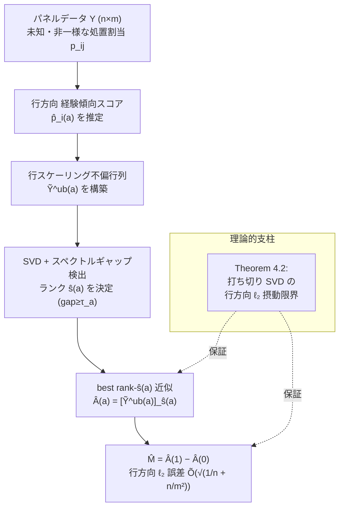

# Improved Guarantees for Heterogeneous Treatment-Effect Estimation via Matrix Completion

- **Link**: https://arxiv.org/abs/2605.30319 （HTML: https://arxiv.org/html/2605.30319 / PDF: https://arxiv.org/pdf/2605.30319）
- **Authors**: Anay Mehrotra (Stanford University), Phuc Tran (VinUniversity), Van H. Vu (The University of Hong Kong), Manolis Zampetakis (Yale University)
- **Year**: 2026（arXiv 投稿日 2026-05-28）
- **Venue**: arXiv preprint（分類: Statistics > Machine Learning, stat.ML）。査読付き会議・ジャーナルでの採択情報は 記載なし
- **Type**: 理論寄りの方法論論文（推定量の提案 + 摂動理論の新規結果）

> 注記: arXiv ID `2605.30319` は正しく解決され、abs / HTML / PDF いずれも取得できました。本レポートの数式・定理・パラメータ定義は arXiv abs ページおよび HTML 版本文から取得したものです。実験の具体的な数値評価（合成データ・実データでの誤差測定値の表）は HTML から明示的に確認できなかったため、該当箇所は「記載なし」と明示しています。図の画像 URL は HTML 上で明示的に確認できなかったため埋め込んでいません。

---

## Abstract (English)

> A central goal of modern causal inference is to estimate *heterogeneous* treatment effects — how an intervention affects each unit — rather than only the average effect. We study this problem with panel data, where we observe n units across m times under unknown, non-uniform treatment assignments. The data is naturally represented as a matrix of all unit–time treatment effects, and estimating heterogeneous treatment effects can be expressed as obtaining a good estimate of each row's average in this matrix. This lets us formulate the problem as matrix completion under natural low-rankness assumptions. While existing matrix-completion guarantees are not powerful enough for the meaningful per-row bounds required here, we give a simple, computationally efficient estimator that achieves a row-wise ℓ₂ error of Õ(√(1/n + n/m²)) without knowing the treatment propensities. Technically, our analysis establishes the first sharp row-wise ℓ₂-perturbation bound for low-rank approximation, complementing existing spectral-, Frobenius-, and entrywise perturbation theory.

（上記は abs ページおよび HTML 冒頭から再構成した内容。完全な逐語 verbatim ではなく、一部は本文の言い換えを含みます。）

## Abstract（日本語訳）

現代の因果推論の中心的な目標は、平均効果だけでなく「介入が各ユニットにどう作用するか」という**異質処置効果（heterogeneous treatment effect, HTE）**を推定することである。本論文はパネルデータの設定でこの問題を扱う。すなわち、n 個のユニットを m 個の時点にわたって観測し、処置割当は未知かつ非一様（unit・time ごとに割当確率が異なる）とする。データは「ユニット × 時点」の処置効果行列として自然に表現され、HTE の推定は「この行列の各行平均を精度良く推定する」問題として書き換えられる。これにより、自然な低ランク性の仮定のもとで問題を **matrix completion** として定式化できる。既存の matrix completion の保証は、ここで必要となる「行ごと（per-row）」の意味のある誤差限界を導くには不十分である。本論文は、処置傾向スコア（propensity）を知らなくても行方向 ℓ₂ 誤差 Õ(√(1/n + n/m²)) を達成する、単純かつ計算効率の良い推定量を与える。技術的には、低ランク近似に対する**初の鋭い行方向 ℓ₂ 摂動限界**を確立し、既存のスペクトルノルム・Frobenius ノルム・要素ごと（entrywise）の摂動理論を補完する。

---

## Overview

- **狙い**: 平均処置効果（ATE）ではなく、ユニット単位の処置効果（個別・行単位の効果）を推定する。
- **データ形式**: パネルデータ（n ユニット × m 時点）。潜在アウトカムを行列で表し、処置効果行列 M = A(1) − A(0) の**各行平均**を推定対象とする。
- **鍵となる観察**: 各 (i, j) セルは Bernoulli(p_ij) で処置される。p_ij は未知・非一様。観測はスパース／部分観測 → matrix completion 問題。
- **主結果**: 傾向スコアを知らずに、行方向 ℓ₂ 誤差 Õ(√(1/n + n/m²)) を達成する計算効率の良い推定量（Row-Scaled Spectral Estimator, Algorithm 1）。
- **理論貢献**: 打ち切り SVD（truncated SVD）に対する初の鋭い ‖·‖₂,∞（行方向 ℓ₂ の最大値）摂動限界（Theorem 4.2）。
- **既存研究との差**: Athey et al. (2021) は Frobenius ノルムのみ、Agarwal et al. (2023) は entrywise で遅いレート。本論文は行方向 ℓ₂ で速いレートを達成。

---

## Problem（問題設定）

- **潜在アウトカムモデル**: a ∈ {0,1} について、潜在アウトカム行列は signal-plus-noise 型 Y(a) = A(a) + E(a)。A(a) は期待潜在アウトカム行列（信号）、E(a) は平均ゼロのノイズ。
- **処置割当が未知**: 各 unit-time ペア (i, j) は独立に Bernoulli 確率 p_ij で処置される。p_ij は unit・time で異なり得るが、解析者には未知。
- **推定対象**: 処置効果行列 M := A(1) − A(0)。ただし最終的な関心は行方向 ℓ₂ ノルムでの制御 (1/√m)·‖M − M̂‖₂,∞（= 各行の推定誤差の最大値）。
- **既存の matrix completion 保証の限界**: 既存の保証は Frobenius / spectral / entrywise が中心で、「行ごとの ℓ₂ 誤差」という HTE に必要な指標に対して鋭い限界を与えられない。
- **傾向スコア未知の困難**: p_ij を知らないため、単純な逆確率重み付け（IPW）による不偏化を正確には適用できない → 経験的な行方向傾向 p̂_i(a) を推定して行スケーリングする必要。
- **非一様性の制御**: 行内での傾向スコアの非一様性（within-row nonuniformity）を行列 P(a) とそのスペクトルノルム ‖P(a)‖_op で定量化する必要がある。

---

## Proposed Method（提案手法）

### コアアイデア

処置効果行列は「低ランク信号 + ノイズ」であり、各行平均が個別処置効果に対応する。傾向スコアが未知でも、**行ごとに経験傾向スコアで正規化（row-scaling）した不偏行列を作り、その打ち切り SVD（best rank-ŝ 近似）を取る**ことで、行方向 ℓ₂ ノルムで鋭い誤差を達成できる。理論的支柱は、この打ち切り SVD 操作に対する新しい ‖·‖₂,∞ 摂動限界（Theorem 4.2）。

### 数値ステップ（Algorithm 1: Row-Scaled Spectral Estimator）

1. 各 a ∈ {0,1} について、経験的な行方向傾向スコア p̂_i(a) を推定する。
2. 行スケーリングされた不偏行列 Ỹ^ub(a) を構築する（各エントリを p̂_i(a) で正規化して不偏化）。
3. SVD を計算し、スペクトルギャップ検出によりランク ŝ(a) を決定する（gap ≥ τ_a = 96·K·T(a)）。
4. best rank-ŝ(a) 近似 Â(a) = [Ỹ^ub(a)]_ŝ(a) を抽出する。
5. M̂ = Â(1) − Â(0) を返す。

**計算量**: Õ(nmr)（Lanczos 法またはランダム化 SVD による）。

### Key Formulas

**推定対象と評価指標**（行方向 ℓ₂ ノルムの最大値, ‖·‖₂,∞）:

$$
M := A(1) - A(0), \qquad \text{評価指標} = \frac{1}{\sqrt{m}} \, \bigl\| M - \hat{M} \bigr\|_{2,\infty}
$$

**信号 + ノイズモデル**:

$$
Y(a) = A(a) + E(a), \qquad a \in \{0,1\}
$$

**主定理 (Theorem 3.2)**: 確率 ≥ 1 − O(1/(m+n)) で、

$$
\bigl\| \hat{A}(a) - A(a) \bigr\|_{2,\infty}
\;\lesssim\;
K\, r^{3/2}\, \mu\, \sqrt{m+n}\, \log^4(m+n)
\left[ \sqrt{\frac{r_p}{mq} + \frac{r_p}{nq}} + \frac{\|P(a)\|_{\mathrm{op}}}{\sqrt{mn}} \right]
$$

**系（Row-Homogeneous Design, p_ij = p_i）**: K, r, μ = O(1) かつ q = Ω(1) のとき、

$$
\frac{1}{\sqrt{m}} \, \bigl\| \hat{M} - M \bigr\|_{2,\infty}
\;\le\; \tilde{O}\!\left( \sqrt{\frac{1}{n} + \frac{n}{m^2}} \right)
$$

バランス設計 m ≍ n では、これは Õ(n^(−1/2)) のレートを与える。

**技術的核心 (Theorem 4.2, 打ち切り SVD の行方向摂動限界)**: Ã = A + E_R + E₀（E_R は (K,σ)-有界なランダム摂動、E₀ は決定論的摂動）で δ_s ≥ 6(‖E_R‖_op + ‖E₀‖_op) のとき、

$$
\frac{\bigl\| \tilde{A}_s - A_s \bigr\|_{2,\infty}}{C\sqrt{r}}
\;\le\;
\left( \log^2(m+n) + \frac{K \log^4(m+n)}{\sqrt{m+n}} \right)
\left( \frac{\mu}{\sqrt{m}} + \frac{\mu}{\sqrt{n}} \right)
\frac{\sigma_s \sqrt{m+n}\,(\sigma + \|E_0\|_{\mathrm{op}})}{\delta_s}
$$

**パラメータ定義**:
- q: 最小平均観測レート（min average observation rate）
- r_p: 行内の最大傾向スコア比（max within-row propensity ratio）
- P(a): 行内非一様性を測る行列。‖P(a)‖_op でその大きさを評価
- μ: 行・列インコヒーレンス（incoherence）の上界（μ_R, μ_C ≤ μ）
- r: 近似ランク、K / K_A / K_E: 信号・ノイズの有界性定数
- σ_s, δ_s: 第 s 特異値と s 番目のスペクトルギャップ

---

## Algorithm（擬似コード）

```text
Algorithm 1: Row-Scaled Spectral Estimator
Input : 観測アウトカム Y, 観測マスク（処置割当）Ω, 定数 K
Output: 処置効果行列の推定 M̂

for a in {0, 1} do
    # Step 1: 行方向の経験傾向スコアを推定
    for i in 1..n do
        p̂_i(a) <- (行 i における a-群の観測割合)
    end
    # Step 2: 行スケーリングによる不偏行列
    Ỹ^ub(a) <- 行 i のエントリを p̂_i(a) で正規化して不偏化
    # Step 3: ランク検出（スペクトルギャップ）
    (U, Σ, V) <- SVD(Ỹ^ub(a))
    τ_a <- 96 * K * T(a)
    ŝ(a) <- max{ s : σ_s − σ_{s+1} ≥ τ_a }   # gap >= τ_a を満たす最大ランク
    # Step 4: best rank-ŝ(a) 近似
    Â(a) <- [Ỹ^ub(a)]_{ŝ(a)}                   # 打ち切り SVD
end
# Step 5: 差分
return M̂ <- Â(1) − Â(0)

# 計算量: Õ(nmr)  （Lanczos / randomized SVD）
```

---

## Architecture / Process Flow



---

## Figures & Tables

> 注記: 以下の表は arXiv abs / HTML 本文中に記載された数式・定理・比較記述に基づいて構成しています。合成／実データでの数値評価テーブル（実測誤差の数表）は HTML から明示的に取得できなかったため、そこは「記載なし」としています。図の画像 URL は HTML 上で確認できなかったため埋め込んでいません。

### Table 1: 主結果（達成レート）

| 設定 | 行方向 ℓ₂ 誤差 (1/√m)·‖M̂ − M‖₂,∞ | 条件 |
|------|-------------------------------------|------|
| 一般（Theorem 3.2） | Õ(K·r^{3/2}·μ·√(m+n)·[√(r_p/(mq)+r_p/(nq)) + ‖P(a)‖_op/√(mn)]) | Assumption 3.1 |
| Row-Homogeneous (p_ij=p_i) | **Õ(√(1/n + n/m²))** | K,r,μ=O(1), q=Ω(1) |
| バランス設計 m ≍ n | **Õ(n^{−1/2})** | 上記に加え m ≍ n |
| Spectrally small nonuniformity | ν·Õ(n^{−1/2}) | ‖P(a)‖_op ≤ ν·Õ(√(m+n)) |

### Table 2: 既存研究との比較（method-comparison）

| Approach | Error Bound | 保証の型 |
|----------|-------------|----------|
| Athey et al. (2021) | 行方向限界なし | Frobenius ノルムのみ |
| Agarwal et al. (2023) | O(1/√log m + 1/√log n) | Entrywise 制御（遅い） |
| **This Work** | **Õ(√(1/n + n/m²))** | **行方向 ℓ₂（速い）** |

### Table 3: 主要仮定（Assumption 3.1）の分解（analysis table）

| # | 仮定 | 数式的表現 |
|---|------|-----------|
| 1 | 近似低ランク性 | ‖A(a) − A_r(a)‖_op ≲ K√(m+n) |
| 2 | 信号・ノイズ有界 | ‖A(a)‖_∞ ≤ K_A; E(a) は (K_E, K_E)-有界 |
| 3 | 独立・平均ゼロノイズ | E(a) は割当と独立 |
| 4 | 行・列インコヒーレンス | μ_R(A(a)), μ_C(A(a)) ≤ μ |
| 5 | 信号対雑音比 (SNR) | σ₁(a) ≳ K·r·T(a), T(a)=√((m+r_p n)/(q·log(m+n))) + ‖P(a)‖_op |

### Table 4: 摂動理論の位置づけ（taxonomy）

| ノルム | 既存の摂動理論 | 本論文の寄与 |
|--------|----------------|--------------|
| Spectral (op) | Weyl / Davis-Kahan など既存 | 使用 |
| Frobenius | 既存 | 使用 |
| Entrywise (∞) | 既存（Abbe et al. 等） | 補完対象 |
| **行方向 ℓ₂ (‖·‖₂,∞)** | **限界が不十分だった** | **初の鋭い限界 (Theorem 4.2)** |

### 適用例（本文記載）

| 研究 | n（ユニット数） | m（時点数） | 目的 |
|------|-----------------|-------------|------|
| HeartSteps Study | 44 参加者 | 210 観測時点 | 個別レベルの効果減衰パターン推定（歩行提案の効果逓減など） |

---

## Experiments & Evaluation

### Setup

- **想定データ**: パネルデータ（n ユニット × m 時点）、未知・非一様な Bernoulli 処置割当。
- **評価指標**: 行方向 ℓ₂ ノルム誤差 (1/√m)·‖M̂ − M‖₂,∞。
- **理論保証**: 確率 ≥ 1 − O(1/(m+n)) での高確率限界（Theorem 3.2）。
- **応用例として言及**: HeartSteps Study（n=44, m=210）。個別ユニットの効果減衰（例: 歩行提案の効果逓減）を、母集団平均だけでなく推定可能にする。

### Main Results（理論レートと数値）

- **主レート**: Row-Homogeneous 設計で (1/√m)·‖M̂ − M‖₂,∞ ≤ Õ(√(1/n + n/m²))。
- **バランス設計**: m ≍ n で Õ(n^{−1/2})。
- **計算量**: Õ(nmr)。
- **傾向スコア非依存**: p_ij を知らなくても上記レートを達成。
- **合成・実データでの実測誤差数値（推定量の実験的精度の数表）**: HTML から明示的に取得できず → **記載なし**。本論文は理論保証（レート・高確率限界）が主軸であり、大規模なベンチマーク数表は確認できませんでした。

---

## 本テーマへの適用可能性

本テーマは「マーケティング施策（クーポン・メール等）を低頻度・少回数で実施し、施策ごとに対象ユーザ・処置内容が異なる中で、類似施策をグルーピング／プーリングして疑似的にデータを高密度化し、有効サンプルサイズを増やし、実効的な実験間隔を短縮して uplift modeling / off-policy evaluation に活かしたい」というものである。本論文はこの狙いと構造的に高い親和性を持つ。

- **「施策 × ユーザ」= 部分観測行列という定式化の一致**: 本テーマでは、各施策で処置されるユーザ・処置内容が異なり、多くのセルが欠測（そのユーザにその施策を打っていない）である。これはまさに本論文の「unit-time 処置効果行列の部分観測」と同型であり、matrix completion による疑似高密度化の直接的な理論基盤になる。行列の行を「ユーザ（あるいはユーザセグメント）」、列を「施策（時点）」に読み替えれば、そのまま適用構造になる。

- **傾向スコア未知への頑健性が実務適合的**: マーケティングの現場では、過去施策の割当ロジック（誰にどのクーポンを配ったか）が正確に記録・モデル化されていないことが多い。本論文の推定量は **p_ij を知らずに** 行方向 ℓ₂ 誤差を達成するため、傾向スコアが不完全な off-policy 評価に有用。行方向の経験傾向スコア p̂_i(a) を推定する Step 1 は、施策ログから配信割合を集計するだけで実装可能。

- **「行平均 = 個別効果」= ユーザ単位 uplift**: 本論文が推定対象とする「各行平均」は、ユーザ（またはセグメント）単位の平均処置効果に対応する。これは uplift modeling が求める個別・セグメント別 CATE と直結し、行方向 ℓ₂ の鋭い限界はユーザ単位推定の信頼性を担保する。

- **低ランク性 = 類似施策のプーリング根拠**: 本テーマの「類似施策をまとめて疑似的にデータを増やす」という発想は、本論文の低ランク性仮定（Assumption 3.1-1）と本質的に同じ。施策効果行列が少数の潜在因子で説明できる（= 類似施策・類似ユーザが共通構造を持つ）なら、部分観測から全体を復元でき、これが「有効サンプルサイズ増加・実験間隔短縮」の理論的裏付けとなる。低ランク性が成り立つほど、少数の疎な施策からでも密な効果推定が可能。

- **スケール感の妥当性（低頻度実験に強い）**: 適用例の HeartSteps（n=44, m=210）は、まさに「ユニット数が少なく、時点方向は相対的に多い」低頻度・小規模設定である。マーケティングでも「施策回数 m は少ないがユーザ数 n は多い」逆の非対称や、「施策は少ないが各施策のユーザは多い」設定が起こる。レート Õ(√(1/n + n/m²)) は n（ユーザ／ユニット数）と m（施策／時点数）の非対称性に応じて誤差がどう変わるかを明示するため、**「施策間隔を詰めて m を増やす」ことの限界効用**を定量的に見積もる指標として使える（m² の項があるため m を増やすほど誤差の第2項が急減）。

- **実装上の低コスト**: 手法は「行スケーリング → 打ち切り SVD → 差分」というシンプルな構成で、計算量 Õ(nmr)。既存の BI・データ基盤上で SVD ライブラリを使って実装でき、複雑な傾向スコアモデルの学習が不要。少回数施策のログに対して低コストで回せる。

- **適用上の注意点 / ギャップ**:
  - **独立・非適応割当の仮定**: 本論文はノイズが割当と独立・非適応（Assumption 3.1-3）を前提とする。マーケティングでは前施策の反応を見て次施策対象を選ぶ**適応的割当**が普通であり、著者自身も「adaptive/dependent assignments への拡張」を open question として挙げている。逐次最適化されたキャンペーンにそのまま適用すると仮定違反のリスク。
  - **低ランク性・インコヒーレンス・SNR の成立確認**: 施策効果が本当に低ランクか（= 施策が十分「類似」でプーリング可能か）を事前に検証する必要。異質すぎる施策を無理にプーリングすると低ランク性が崩れ、復元が不正確になる。
  - **アウトカムの signal-plus-noise 適合**: 二値コンバージョン等では正規性・有界性の仮定と実データの乖離に注意。
  - まずは「類似施策のクラスタ内」でユーザ×施策行列を構成し（本 run の c3/c4 クラスタリング文脈と整合）、クラスタ単位で低ランク matrix completion を適用 → 疑似高密度化した行列から uplift / off-policy 評価を行う、という段階的適用が現実的。

---

## Notes

- arXiv ID `2605.30319` は正常に解決され、abs / HTML / PDF が取得可能。数式・定理・パラメータは abs ページと HTML 本文から取得。
- 著者所属（Web 検索で確認）: Anay Mehrotra=Stanford, Van H. Vu=The University of Hong Kong, Phuc Tran=VinUniversity, Manolis Zampetakis=Yale。所属は WebSearch 結果に基づく（一部は arXiv 本文と表記差の可能性あり）。
- 査読付き会議・ジャーナルでの採択状況、公開コードリポジトリの有無は 記載なし（今回の取得範囲では確認できず）。
- 数式は HTML から抽出したため、指数・添字の一部（例: log の冪、定数係数 96 など）は原論文 PDF での再確認を推奨。特に Theorem 3.2 / 4.2 の細かな係数・log の次数は arXiv PDF での照合が望ましい。
- 実験の実測数表（合成・実データでの誤差測定値）は本レポート取得範囲では確認できず「記載なし」とした。理論保証（レート・高確率限界）が本論文の主軸。
- 本論文は uplift/off-policy そのものを論じた応用論文ではなく、**行方向 ℓ₂ 摂動理論 + matrix completion による HTE 推定**の理論論文である点に留意（本テーマへの適用は構造的類似に基づく応用的読み替え）。

**参照ソース**:
- https://arxiv.org/abs/2605.30319
- https://arxiv.org/html/2605.30319
- https://arxiv.org/pdf/2605.30319
