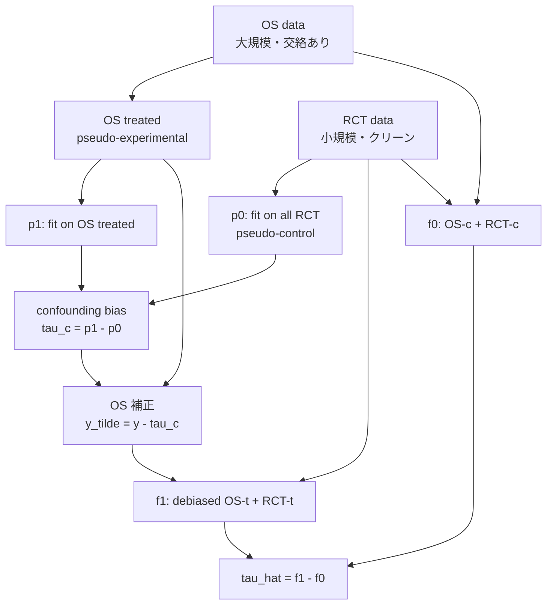

# Combining Incomplete Observational and Randomized Data for Heterogeneous Treatment Effects (CIO)

- **Link**: https://arxiv.org/abs/2410.21343 / HTML: https://arxiv.org/html/2410.21343v1
- **Authors**: Dong Yao, Caizhi Tang, Qing Cui, Longfei Li
- **Year**: 2024 (submitted 28 Oct 2024)
- **Venue**: CIKM 2024 (ACM International Conference on Information and Knowledge Management)
- **Type**: 研究論文（因果推論 / heterogeneous treatment effect estimation, data fusion）

---

## Abstract (English, verbatim)

> Data from observational studies (OSs) is widely available and readily obtainable yet frequently contains confounding biases. On the other hand, data derived from randomized controlled trials (RCTs) helps to reduce these biases; however, it is expensive to gather, resulting in a tiny size of randomized data. For this reason, effectively fusing observational data and randomized data to better estimate heterogeneous treatment effects (HTEs) has gained increasing attention. However, existing methods for integrating observational data with randomized data must require complete observational data, meaning that both treated subjects and untreated subjects must be included in OSs. This prerequisite confines the applicability of such methods to very specific situations, given that including all subjects, whether treated or untreated, in observational studies is not consistently achievable. In our paper, we propose a resilient approach to Combine Incomplete Observational data and randomized data for HTE estimation, which we abbreviate as CIO. The CIO is capable of estimating HTEs efficiently regardless of the completeness of the observational data, be it full or partial. Concretely, a confounding bias function is first derived using the pseudo-experimental group from OSs, in conjunction with the pseudo-control group from RCTs, via an effect estimation procedure. This function is subsequently utilized as a corrective residual to rectify the observed outcomes of observational data during the HTE estimation by combining the available observational data and the all randomized data. To validate our approach, we have conducted experiments on a synthetic dataset and two semi-synthetic datasets.

## Abstract (日本語訳)

観察研究（OS）データは広く入手が容易だが、しばしば交絡バイアスを含む。一方、ランダム化比較試験（RCT）データはバイアス低減に有効だが、収集コストが高くサンプルサイズが極めて小さい。このため、観察データとランダム化データを効果的に融合して heterogeneous treatment effect（HTE, 個別化処置効果）をより良く推定する手法が注目されている。しかし既存の統合手法は、**完全な観察データ（処置群と対照群の両方を含む OS）**を必要とする。この前提は適用範囲を狭める。実務では処置群・対照群の両方を OS に揃えることが常に可能とは限らないからである。本論文では、観察データが完全であっても部分的であっても頑健に HTE を推定できる手法 **CIO（Combine Incomplete Observational data）** を提案する。具体的には、まず OS からの **pseudo-experimental group** と RCT からの **pseudo-control group** を用いた効果推定手続きにより **confounding bias function** を導出する。次にこの関数を **補正残差（corrective residual）** として利用し、利用可能な観察データと全ランダム化データを組み合わせた HTE 推定において観察データの観測アウトカムを補正する。合成データ 1 種と semi-synthetic データ 2 種で検証した。

---

## Overview

本論文は「RCT（小規模だがクリーン）」と「観察データ（大規模だが交絡あり）」を融合して HTE を推定する data-fusion 問題を扱う。従来手法（IntR, RHC, CorNet 等）は OS が**完全**、すなわち処置群 (T=1) と対照群 (T=0) の両方を含むことを暗黙に要求していた。CIO の貢献は、OS が片方の群しか持たない（例: 対照群欠損）**不完全 (incomplete)** ケースでも HTE 推定を可能にする点にある。鍵は、OS の処置群（pseudo-experimental）と RCT 全体（pseudo-control）から交絡バイアス関数 `c(X)` を推定し、それを OS アウトカムの補正残差として差し引く 2 段階手続きである。論文中では、完全 OS 版を **CIO**、不完全 OS 版を **CIOIO** と表記して区別している。

---

## Problem

- **RCT は小さい**: バイアスは無いが収集コストが高く、単独では HTE 推定の分散が大きい。
- **OS は大きいが交絡あり**: 処置割当が共変量 X に依存し、単純に使うと confounding bias が乗る。
- **既存 data-fusion 手法は「完全 OS」前提**: OS に処置群と対照群の両方が必要（`T ⊥ ... | (X,S)` を両群で使う設計）。
- **実務では OS が不完全**: 片方の群しか観測されないケース（例: 全員がクーポン付与されたログ、あるいは特定施策の対象者ログのみ）が頻出し、既存手法が適用不能。
- **目標**: OS の完全/不完全を問わず、RCT と OS を融合して低分散かつ低バイアスの `τ(X)=E[Y(1)−Y(0)|X]` を得る。

---

## Proposed Method: CIO

### Core idea

観察データのアウトカムには交絡バイアス `c(X)` が混入している。CIO は、OS の処置群サンプルと RCT を突き合わせてこの `c(X)` を明示的に推定し、OS アウトカムから差し引いて「デバイアス済み OS」を作る。デバイアス後は OS を RCT と同じ分布とみなして結合し、通常の T-learner 型 HTE 推定を行う。

CIO が仮定する結合アウトカムモデルは以下:

$$
Y = T\big[\tau(X) + (1-S)\,c(X)\big] + \mu_0(X) + \epsilon
$$

ここで `S=1` が RCT、`S=0` が OS、`c(X)` は OS 特有の confounding bias function、`μ0(X)=E(Y|X,T=0,S)`。RCT では `S=1` なので `(1−S)c(X)=0` となりバイアス項が消える。

### Assumptions

- **Assumption 3.1 (Consistency / Ignorability / Overlap)**: RCT 内では処置割当が無視可能。`T ⊥ {Y(0),Y(1)} | (X,S=1)` かつ overlap 成立。
- **Assumption 3.2 (Transportability)**: `E(Y(1)−Y(0)|X,S=s)=τ(X)`（s=0,1 で共通、CATE が OS と RCT で移送可能）。
- **Assumption 3.3 (Basic)**: `S ⊥ Y | X` かつ `T(1−S) ⊥ Y | X`。

### Numbered steps

1. **Dummy treatment 定義**: `D = T(1−S)` を導入。`D=1` は「OS かつ処置群」= pseudo-experimental group、`D=0` の突合先として RCT 全体を pseudo-control group とみなす。
2. **Stage 1 — 交絡バイアス関数の推定**:
   - OS 処置データ上で `p1(·)` を回帰（$\min\sum_i [y_i^{ot} - p_1(x_i^{ot})]^2$）。
   - RCT データ全体（処置+対照）上で `p0(·)` を回帰（$\min\sum[y_i^{rt}-p_0(x_i^{rt})]^2 + \sum[y_i^{rc}-p_0(x_i^{rc})]^2$）。
   - バイアス関数を差として推定: $\hat\tau_c(x_i) = \hat p_1(x_i) - \hat p_0(x_i)$。
3. **Stage 2 — OS アウトカムの補正**: OS 処置アウトカムからバイアスを除去: $\tilde y_i^{ot} = y_i^{ot} - \hat\tau_c(x_i^{ot})$。
4. **Stage 2 — HTE 推定（T-learner 型）**:
   - `f1(·)` を「デバイアス済み OS 処置群 + RCT 処置群」で学習。
   - `f0(·)` を「OS 対照群 + RCT 対照群」で学習。
   - 最終推定: $\hat\tau(x_i) = \hat f_1(x_i) - \hat f_0(x_i)$。
5. **不完全 OS への対応 (CIOIO)**: OS に片方の群しか無い場合、欠損群を RCT 側で補い、上記手続きを適用。これにより完全/不完全を問わず動作する。

### Key formulas

$$
D = T(1-S)
$$

$$
\hat\tau_c(x) = \hat p_1(x) - \hat p_0(x)
$$

$$
\tilde y^{ot} = y^{ot} - \hat\tau_c(x^{ot})
$$

$$
\hat\tau(x) = \hat f_1(x) - \hat f_0(x)
$$

評価指標（PEHE）:

$$
\epsilon_{PEHE} = \frac{1}{N}\sum_n \Big([y_1(n)-y_0(n)] - [\hat y_1(n)-\hat y_0(n)]\Big)^2
$$

（報告値は $\sqrt{\epsilon_{PEHE}}$、小さいほど良い）

---

## Algorithm (Pseudocode)

```
Input: OS data {(x^os, t^os, y^os)}, RCT data {(x^rct, t^rct, y^rct)}
       base learner (Ridge / RF / TARNet)

# ---- Stage 1: confounding bias function ----
p1 <- fit( x^ot -> y^ot )                 # OS treated (pseudo-experimental)
p0 <- fit( x^rct -> y^rct )               # all RCT (pseudo-control)
tau_c(x) := p1(x) - p0(x)                 # confounding bias function

# ---- Stage 2: debias & HTE ----
for each OS treated sample i:
    y_tilde_i <- y^ot_i - tau_c(x^ot_i)   # corrective residual

f1 <- fit( [debiased OS treated] ∪ [RCT treated] -> y )
f0 <- fit( [OS control]          ∪ [RCT control] -> y )

tau_hat(x) := f1(x) - f0(x)

# Incomplete OS (CIOIO): missing group is supplied from RCT side,
# same Stage-1/Stage-2 pipeline is applied.
Output: tau_hat(x)
```

---

## Architecture / Process Flow



---

## Figures & Tables

### Table 1 — 主結果（メイン比較表, √ϵPEHE の Mean±SD, 10 runs, pr=0.2）

Table 1 Caption: *"Comparison of methods for combining OS and RCT data on Simulation, STAR and NSW data. Mean ±SD of √ϵPEHE over 10 runs with pr=0.2."*（低いほど良い）

| Architecture | Method | Simulation | STAR | NSW |
|---|---|---|---|---|
| **Ridge** | SFOS  | 21.97±1.06 | 25.05±2.92 | - |
|           | SFRCT | 9.74±2.39  | 4.06±0.52  | 2.49±1.06 |
|           | SI    | 21.43±1.06 | 12.82±3.48 | 15.85±0.32 |
|           | RHC   | 14.62±6.18 | 9.7±2.68   | - |
|           | IntR  | 7.68±0.34  | 8.52±0.71  | - |
|           | **CIO**   | **5.75±0.34** | **2.36±0.48** | - |
|           | **CIOIO** | **8.96±0.63** | **2.14±0.65** | **1.48±0.38** |
| **RF**    | SFOS  | 18.35±0.67 | 48.17±0.47 | - |
|           | SFRCT | 10.41±2.87 | 6.96±1.30  | 2.30±0.70 |
|           | SI    | 17.83±0.73 | 7.83±0.87  | 3.84±1.08 |
|           | RHC   | 11.76±1.28 | 18.59±0.50 | - |
|           | IntR  | 8.84±1.93  | 9.51±0.22  | - |
|           | **CIO**   | **6.65±0.26** | **5.61±0.93** | - |
|           | **CIOIO** | **10.18±2.94** | **5.35±0.96** | **2.29±0.70** |
| **TARNet**| SFOS  | 23.64±1.30 | 30.40±11.62 | - |
|           | SFRCT | 10.84±6.41 | 5.15±3.38  | 5.14±0.46 |
|           | SI    | 22.83±1.08 | 23.81±7.96 | 22.47±0.60 |
|           | RHC   | 7.89±3.40  | 7.06±2.65  | - |
|           | CorNet| 12.24±2.25 | 7.00±1.01  | - |
|           | IntR  | 6.97±0.72  | 4.93±1.81  | - |
|           | **CIO**   | **6.61±0.35** | **3.54±1.38** | - |
|           | **CIOIO** | **6.92±0.41** | **4.17±1.39** | **5.11±0.39** |

略号: SFOS = single-source OS only, SFRCT = single-source RCT only, SI = simple integration, RHC = 既存 baseline, IntR = integrative R-learner, CorNet, **CIO** = 提案手法（完全 OS）, **CIOIO** = 提案手法（不完全 OS）。NSW は OS 対照群のみのため CIO 適用不可の欄が "-"（CIOIO のみ適用可能）。

### Figure 1 — データ構成（完全 vs 不完全 OS）


Caption: *"The data composition under the two situation: complete and incomplete OS data. For illustration, the right subfigure demonstrates a case where the control group is missing."*（アーキ/問題設定図に相当）

### Figure 2 — RCT 比率を増やしたときの data-fusion 比較（分析図）


Caption: *"Comparison among data-fusion baselines under Ridge and RF with an increasing ratio of RCT data for training"*（Simulation / STAR / NSW の 3 データセット）。RCT 比率 (pr) を上げるほど各手法の PEHE がどう変化するかを示す ablation。

### Figure 3 — 交絡バイアス強度 β に対する感度（ablation）


Caption: *"For all data-fusion techniques using Ridge and RF, we observe PEHE across a range of β values that modulate the intensity of the confounding bias."*（交絡バイアスの強さ β を変えたときのロバスト性分析）

### Figure 4 — OS 対照データ量に対する性能（ablation）


Caption: *"Simulation dataset / STAR dataset — showing performance across varying OS control data sizes."*（OS 対照群のサンプル量を変えた際の性能推移）

---

## Experiments & Evaluation

### Setup

- **評価指標**: √ϵPEHE（Precision in Estimation of Heterogeneous Effect の平方根）。10 runs の Mean±SD で報告。低いほど良い。
- **base learner**: Ridge Regression / Random Forest (RF) / TARNet（ニューラルネット）の 3 種で全手法を評価。
- **メイン設定**: RCT 比率 `pr = 0.2`。
- **データセット**:
  1. **Simulation**（合成）: 共変量 p=5、RCT 200 サンプル、OS 3000 サンプル。処置割当は `T|(X,S=0) ∼ Bernoulli(1/(1+exp(−ΣXᵢ)))` で交絡を注入。
  2. **STAR**（semi-synthetic）: 4139 名の生徒、処置=少人数クラス vs 通常クラス、p=7。
  3. **NSW**（semi-synthetic）: 観察対照 2490（**処置群なし = 不完全 OS**）、ランダム化 722、p=6。CIOIO のみ適用可能。

### Main Results（具体値）

- **Simulation**: Ridge で CIO=**5.75±0.34** が全 baseline を上回る（IntR=7.68, RHC=14.62, SI=21.43, SFOS=21.97, SFRCT=9.74）。RF でも CIO=**6.65±0.26**（次点 IntR=8.84）。TARNet では CIO=**6.61±0.35** が IntR=6.97 とほぼ同等〜わずかに優位。
- **STAR**: Ridge で CIOIO=**2.14±0.65** / CIO=2.36±0.48 が最良（IntR=8.52, SFRCT=4.06 を大きく下回る）。RF でも CIOIO=**5.35±0.96** が最良。TARNet では CIO=**3.54±1.38** が最良。
- **NSW（不完全 OS）**: 対照群のみの OS のため CIO は適用不可、CIOIO=**1.48±0.38 (Ridge)** / **2.29±0.70 (RF)** / **5.11±0.39 (TARNet)**。SFRCT=2.49/2.30/5.14 と比べ Ridge・RF で明確に改善。
- **含意**: 提案手法は 3 base learner × 3 データセットで概ね最良またはトップ級。特に不完全 OS しか存在しない NSW でも動作し、既存 data-fusion 手法（IntR/RHC/CorNet は "-" = 適用不可）の穴を埋める。

---

## 本テーマへの適用可能性

データサイエンティストが**低頻度で異なるターゲット・異なる treatment のマーケティング施策（クーポン/メール）を打ち、類似施策をグルーピング/プールしてデータ密度を高め、実効サンプル数を増やし実効的な実験間隔を短縮したい**というテーマに対し、本論文は直接的に有用である。

- **RCT×観察ログの融合が中核テーマそのもの**: マーケでは「小規模なきれいな A/B テスト（RCT）」と「大量の運用ログ（観察データ・交絡あり）」が併存する。CIO は両者を融合して uplift（=HTE）を低分散・低バイアスで推定する枠組みであり、実効データ密度を上げる目的と完全に一致する。RCT の小ささを大量ログで補える。

- **「不完全 OS」がマーケの現実に刺さる**: 運用ログは往々にして片側しか無い。例えば「あるクーポンを配った人のログはあるが、同一条件の未配布者のクリーンなログが無い」「特定セグメントにしか施策を打っていない」など。従来 data-fusion（IntR/RHC）はこれで破綻するが、**CIOIO は欠損群を RCT 側で補って動作する**。手元ログが処置群のみ/対照群のみでも uplift 推定に組み込める点が実務価値が高い。

- **施策のグルーピング/プーリングへの橋渡し**: 本テーマの「類似施策をまとめて密なデータを合成」は、CIO の `Transportability`（Assumption 3.2: CATE が S に依らず共通）を複数施策間に拡張する発想に対応する。同じ `τ(X)` を共有すると見なせる類似施策群を 1 つの RCT+OS プールとして扱えば、施策単体では疎だったデータを結合して実効サンプルを増やせる。ただし施策間で `c(X)`（交絡バイアス関数）が異なりうるため、**施策ごとに `c(X)` を推定し補正してからプール**するのが CIO の思想に沿った安全な設計となる。

- **off-policy evaluation への含意**: デバイアス済み OS アウトカム `ỹ=y−τ_c(x)` は、観察ログの outcome を「RCT 相当」に補正する操作であり、OPE における交絡補正（IPW/DR の代替的アプローチ）として使える。RCT が小さくログが大量という典型状況で、補正済みログを評価データに転用して実効的な評価サンプルを増やせる。

- **実効実験間隔の短縮**: 各施策で毎回大規模 RCT を張る代わりに、小さな RCT（本論文の pr=0.2 に相当）＋既存ログで足りるようになれば、施策 1 回あたりの実験コストと待ち時間を削減できる。Table 1 で pr=0.2 でも CIO が baseline を上回っている点は、少量 RCT で運用できる裏付けになる。

- **導入時の注意**: (1) `Transportability` が施策/セグメント間で成立するかは検証が必要（成立しないグループを無理にプールすると悪化）。(2) `c(X)` 推定は base learner に依存（Ridge/RF/TARNet で性能が変わる）ため、施策データの非線形性に応じて選択する。(3) 本論文の検証は Simulation + semi-synthetic（STAR/NSW）に限られ、実マーケデータでの検証は 記載なし。(4) 公開コードの有無は 記載なし。

---

## Notes

- 論文中の完全/不完全の区別: **CIO** = 完全 OS（処置群+対照群）版、**CIOIO** = 不完全 OS 版。NSW は OS が対照群のみのため CIO 欄が "-"、CIOIO のみ報告。
- ベースライン: SFOS（OS 単独）, SFRCT（RCT 単独）, SI（単純統合）, RHC, IntR（integrative R-learner）, CorNet（TARNet 系のみ）。
- 数値はすべて Table 1（pr=0.2, 10 runs, Mean±SD の √ϵPEHE）に基づく。Figure 2/3/4 の具体的な数値プロット値は本文表として未提供のため 記載なし（図として存在）。
- 図の URL は HTML 版 (v1) で実在を確認した x1–x7.png のみ掲載。
- 公開実装・コードリポジトリの明示は本文からは 記載なし。
