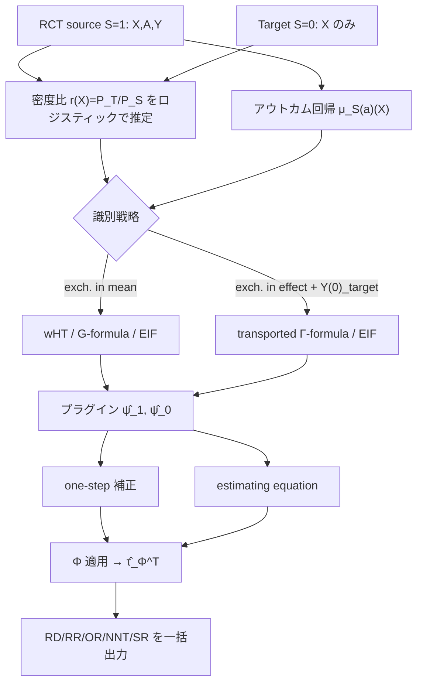

# A Unified Framework for the Transportability of Population-Level Causal Measures

- **Link**: https://arxiv.org/abs/2505.13104
- **Authors**: Ahmed Boughdiri, Clément Berenfeld, Julie Josse, Erwan Scornet
- **Year**: 2025
- **Venue**: NeurIPS 2025 (Poster) / arXiv:2505.13104 [stat.ME]（2025年5月19日投稿）
- **Type**: 方法論論文（因果推論・一般化/移送の統計理論）

---

## Abstract (English)

> Generalization methods offer a powerful solution to one of the key drawbacks of randomized controlled trials (RCTs): their limited representativeness. By enabling the transport of treatment effect estimates to target populations subject to distributional shifts, these methods are increasingly recognized as the future of meta-analysis, the current gold standard in evidence-based medicine. Yet most existing approaches focus on the risk difference, overlooking the diverse range of causal measures routinely reported in clinical research. Reporting multiple effect measures—both absolute (e.g., risk difference, number needed to treat) and relative (e.g., risk ratio, odds ratio)—is essential to ensure clinical relevance, policy utility, and interpretability across contexts. To address this gap, we propose a unified framework for transporting a broad class of first-moment population causal effect measures under covariate shift. We provide identification results under two conditional exchangeability assumptions, derive both classical and semiparametric estimators, and evaluate their performance through theoretical analysis, simulations, and real-world applications. Our analysis shows the specificity of different causal measures and thus the interest of studying them all: for instance, two common approaches (one-step, estimating equation) lead to similar estimators for the risk difference but to two distinct estimators for the odds ratio.

## Abstract (日本語)

一般化（generalization）手法は、ランダム化比較試験（RCT）の主要な弱点である「代表性の限界」に対する強力な解決策を提供する。分布シフト（covariate shift）を受けるターゲット母集団へ処置効果推定値を移送（transport）できるようにすることで、これらの手法はエビデンスに基づく医療の現行ゴールドスタンダードであるメタアナリシスの将来像として注目を集めている。しかし既存アプローチの大半はリスク差（risk difference）にのみ焦点を当てており、臨床研究で日常的に報告される多様な因果測度を見落としている。絶対測度（リスク差、治療必要数 NNT など）と相対測度（リスク比 RR、オッズ比 OR など）を併記することは、臨床的関連性・政策的有用性・文脈横断的な解釈可能性を担保するうえで不可欠である。このギャップを埋めるため、本論文は covariate shift 下で広範な「一次モーメント母集団因果測度（first-moment population causal measure）」クラスを移送するための統一枠組みを提案する。二つの条件付き交換可能性（conditional exchangeability）仮定のもとで識別結果を与え、古典的推定量と半パラメトリック推定量の双方を導出し、理論解析・シミュレーション・実データ応用によりその性能を評価する。分析は各因果測度の固有性を示し、それゆえすべてを研究する意義を明らかにする。例えば one-step と estimating equation という二つの一般的アプローチはリスク差では類似の推定量に帰着するが、オッズ比では二つの異なる推定量に分岐する。

---

## Overview

本論文の中核は、RCT（source, `S=1`）で観測される処置効果を、共変量分布が異なるターゲット母集団（`S=0`、共変量 `X` のみ観測）へ移送する問題を、**リスク差に限定せず「一次モーメント母集団因果測度」という一般クラス全体**で統一的に扱う点にある。この一般クラスには RD・RR・OR・NNT・ERR（Excess Risk Ratio）・SR（Survival Ratio）・Switch Relative Risk・Log-OR など十数種類が含まれる。

鍵となる概念は、任意の因果測度を潜在アウトカム期待値 `(E[Y(1)], E[Y(0)])` の関数 `Φ` として表現する「effect measure `Φ`」と、その逆写像「effect function `Γ`」である。これにより、collapsible な測度（RD, RR）だけでなく **non-collapsible な測度（OR, NNT）** も、二種類の交換可能性仮定のもとで識別・推定できる。特に、より弱い「効果測度における交換可能性（exchangeability in effect measure）」のもとでも non-collapsible 測度が識別可能であることを示した点は、著者らの知る限り新規の貢献である。

---

## Problem（本論文が解く課題）

- 既存の一般化/移送手法はほぼ **リスク差（RD）専用** であり、線形性と解析的便利さに依存している。
- 臨床ガイドライン・規制当局は絶対測度と相対測度の**両方**の報告を要求するが、相対測度（RR, OR）は非線形であり、CATE から ATE を直接得られない。
- **non-collapsible 測度（OR, NNT）** は「条件付き効果の加重平均」として表せないため、効果の交換可能性のもとでの移送可能性が理論的に未解明だった。
- one-step 推定量と estimating equation 推定量が、線形測度（RD）では一致するのに非線形測度（RR, OR）では**分岐する**という現象が体系的に扱われていなかった。
- 密度比推定（density ratio estimation）を用いた古典的推定量の漸近的性質（分散の閉形式）が形式的に研究されていなかった。

---

## Proposed Method

### 中核アイデア

任意の一次モーメント母集団因果測度を、潜在アウトカムの周辺期待値に対する滑らかな関数 `Φ` として抽象化し（Definition 1）、その逆写像 `Γ`（effect function）を用いる。これにより、識別と推定を「`E_T[Y(1)]`, `E_T[Y(0)]` をどう推定するか」という共通問題に還元し、あとは `Φ` を適用するだけで**すべての測度に一括対応**する。

### 因果測度の抽象化（Definition 1 / Example 1）

$$\tau^P := \Phi\!\left(\mathbb{E}_P[Y^{(1)}],\ \mathbb{E}_P[Y^{(0)}]\right)$$

主要測度の `Φ` と `Γ`（`ψ_1 = E[Y(1)]`, `ψ_0 = E[Y(0)]`）:

| 測度 | Effect Measure `Φ(ψ1, ψ0)` | Effect Function `Γ(τ, ψ0)` |
|------|------|------|
| Risk Difference (RD) | `ψ1 − ψ0` | `ψ0 + τ` |
| Risk Ratio (RR) | `ψ1 / ψ0` | `τ · ψ0` |
| Odds Ratio (OR) | `[ψ1/(1−ψ1)] · [(1−ψ0)/ψ0]` | `τ·ψ0 / (1 + τ·ψ0 − ψ0)` |
| Number Needed to Treat (NNT) | `1/(ψ1 − ψ0)` | `1/τ + ψ0` |
| Excess Risk Ratio (ERR) | `(ψ1 − ψ0)/ψ0` | `τ(1 + ψ0)`（原文は `Γ(τ,ψ0)=τ(1+ψ0)`） |
| Survival Ratio (SR) | `(1−ψ1)/(1−ψ0)` | `1 − τ(1 − ψ0)` |

### 手順（numbered steps）

1. **設定の定式化**: `(X, S, A, Y(0), Y(1))`。`S=1` が source（RCT、`A`, `Y` 観測）、`S=0` が target（`X` のみ観測）。目標は `τ_Φ^T = Φ(E_T[Y(1)], E_T[Y(0)])`。
2. **仮定の設定**: 内部妥当性（Assumption 1: 無視可能性・SUTVA・正値性/ランダム割付）、Overlap（Assumption 2）。
3. **識別（設定A: exchangeability in mean, Assumption 3）**: `E_T[Y(a)]` を source 量で表す3通りの識別式（下記 Key Formulas）を導出。
4. **古典的推定量の構築**: weighted Horvitz-Thompson（密度比 `r(X)` を重みに使用）、weighted/transported G-formula。密度比はロジスティック回帰で `P(S=1|X)` を推定して得る。
5. **半パラメトリック効率的推定量の構築**: 効率的影響関数（EIF）`φ_Φ` を導出し、(i) one-step 補正、(ii) estimating equation の二方式でダブルロバスト推定量を作る。
6. **識別（設定B: exchangeability in effect measure, Assumption 5）**: より弱い仮定。ただしターゲットの制御アウトカム `Y(0)` へのアクセスが必要（例：処置がまだ展開されていない場合に満たされる）。ここで `Γ` を用いた **transported Γ-formula** を新規に導出。
7. **評価**: 合成データ（Experiment 1, 2）と実データ（CRASH-3 × Traumabase）で全推定量を比較。

### Key Formulas（LaTeX）

**識別（exchangeability in mean, `E_T[Y(a)]` の3表現）:**

$$\mathbb{E}_T[Y^{(a)}] = \mathbb{E}_T\!\big[\mathbb{E}_S[Y^{(a)}\mid X]\big] \quad\text{(transporting conditional outcomes)}$$

$$= \mathbb{E}_S\!\left[\frac{P_T(X)}{P_S(X)}\,Y^{(a)}\right] \quad\text{(weighting outcomes)}$$

$$= \mathbb{E}_S\!\left[\frac{P_T(X)}{P_S(X)}\,\mathbb{E}_S[Y^{(a)}\mid X]\right] \quad\text{(weighting conditional outcomes)}$$

**密度比（selection odds として推定）:**

$$r(X) = \frac{P_T(X)}{P_S(X)} = \frac{P(S=1)}{P(S=0)}\cdot\frac{P(S=0\mid X=x)}{P(S=1\mid X=x)}$$

**Weighted Horvitz-Thompson 推定量:**

$$\widehat{\tau}_{\Phi,\mathrm{wHT}} = \Phi\!\left(\frac{1}{n}\sum_{S_i=1}\widehat{r}(X_i)\frac{A_i Y_i}{\pi},\ \ \frac{1}{n}\sum_{S_i=1}\widehat{r}(X_i)\frac{(1-A_i)Y_i}{1-\pi}\right)$$

**EIF の連鎖律（`Φ` を通した合成）:**

$$\varphi_\Phi(Z,\eta,\psi_1,\psi_0) = \partial_1\Phi(\psi_1,\psi_0)\,\varphi_1(Z,\eta,\psi_1) + \partial_0\Phi(\psi_1,\psi_0)\,\varphi_0(Z,\eta,\psi_0)$$

**各 `ψ_a` の影響関数（Proposition 3）:**

$$\varphi_a(Z,\eta,\psi_a) = \frac{1-S}{1-\alpha}\big(\mu^{(a)}(X)-\psi_a\big) + \frac{S\,\mathbf{1}\{A=a\}}{\alpha\,P(A=a)}\,r(X)\big(Y-\mu^{(a)}(X)\big)$$

**one-step vs estimating equation の分岐（RR の例）:**

$$\widehat{\tau}_{RR}^{EE} = \frac{\widehat{\psi}_1^{EE}}{\widehat{\psi}_0^{EE}}, \qquad
\widehat{\tau}_{RR}^{OS} = \frac{\widehat{\psi}_1}{\widehat{\psi}_0} + \frac{1}{\widehat{\psi}_0}\frac{m}{N(1-\alpha)}(\widehat{\psi}_1^{EE}-\widehat{\psi}_1) - \frac{\widehat{\psi}_1}{\widehat{\psi}_0^2}\frac{m}{N(1-\alpha)}(\widehat{\psi}_0^{EE}-\widehat{\psi}_0)$$

一般に `τ̂_RR^OS ≠ τ̂_RR^EE`。RD については両者が一致する。

**設定B（exchangeability in effect measure, Assumption 5）の識別:**

$$\tau_\Phi^T = \Phi\!\left(\mathbb{E}_T\big[\Gamma(\tau_\Phi^S(X),\ \mu_{(0)}^T(X))\big],\ \mathbb{E}_T[Y^{(0)}]\right) \quad\text{(transporting)}$$

---

## Algorithm（擬似コード）

```
入力: RCT データ {(X_i, A_i, Y_i): S_i=1}, ターゲット共変量 {X_j: S_j=0}, 測度 Φ
出力: τ̂_Φ^T

1. 密度比 r(X) を推定:
     ロジスティック回帰で P(S=1|X) を推定 → r̂(X) = (n/(N−n)) · (1−σ(X;β̂))/σ(X;β̂)
2. アウトカム回帰 μ̂_S(1)(X), μ̂_S(0)(X) を RCT 上で当てはめ
3. 交差適合(cross-fitting): データを2分割し、η̂ の推定と EIF 評価を別分割で行う
4. 初期プラグイン: ψ̂_a を wHT または G-formula で計算
5. ダブルロバスト補正:
     (i) one-step:  τ̂_Φ^OS = Φ(ψ̂_1, ψ̂_0) + (1/N) Σ φ_Φ(Z_i, η̂, ψ̂_1, ψ̂_0)
     (ii) EE:       Σ φ_Φ(Z_i, η̂, ψ̂_1^EE, ψ̂_0^EE) = 0 を解いて Φ(ψ̂_1^EE, ψ̂_0^EE)
6. 目的の測度 Φ を適用して τ̂_Φ^T を出力（RR, OR は (i)(ii) が分岐しうる）
```

---

## Architecture / Process Flow



---

## Figures & Tables（MANDATORY）

### Table 1（再構成）: 主要因果測度の Effect Measure `Φ` と Effect Function `Γ`（本文 Example 1）

| 測度 | `Φ(ψ1, ψ0)` | `Γ(τ, ψ0)` | collapsible? |
|------|------|------|------|
| RD | `ψ1 − ψ0` | `ψ0 + τ` | Yes |
| RR | `ψ1/ψ0` | `τ·ψ0` | Yes |
| OR | `[ψ1/(1−ψ1)]·[(1−ψ0)/ψ0]` | `τ·ψ0/(1+τ·ψ0−ψ0)` | No |
| NNT | `1/(ψ1−ψ0)` | `1/τ + ψ0` | No |
| ERR | `(ψ1−ψ0)/ψ0` | `τ(1+ψ0)` | — |
| SR | `(1−ψ1)/(1−ψ0)` | `1 − τ(1−ψ0)` | — |

### Table 2（再構成）: 推定量ファミリーの比較

| 推定量 | 必要仮定 | 密度比推定 | ダブルロバスト | 非線形測度(RR/OR)での挙動 |
|------|------|------|------|------|
| Weighted Horvitz-Thompson | exch. in mean | 必要 | 否 | Φ 適用で対応 |
| Weighted G-formula | exch. in mean | 必要 | 否 | 非線形応答で誤特定に脆弱 |
| Transported G-formula | exch. in mean | 不要 | 否 | 正しく特定されれば最小分散 |
| One-step (OS) | exch. in mean/effect | 必要 | RD のみ保持 | RD で正確、RR/OR では EE と分岐 |
| Estimating Equation (EE) | exch. in mean/effect | 必要 | 全測度で保持 | 全測度で不偏（DR） |
| Transported Γ-formula | exch. in effect + `Y(0)_target` | 不要 | 否 | non-collapsible も識別 |

分散順序（線形アウトカムモデル、Proposition 2）: `V_tG^OLS ≤ V_wG^OLS ≤ V_HT`。

### Table 3（再構成）: シミュレーション設定と定性的結果（本文 Section 5.1、Figure 1/2）

| 実験 | 仮定 | 応答面 | 標本数 N | 反復回数 | source 値 (RD/RR/OR) | 主要知見 |
|------|------|------|------|------|------|------|
| Experiment 1 | exch. in mean（Assumption 3） | 非線形/非ロジスティック | 50,000 | 3,000 | 0.45 / 3.2 / 7.5 | G-formula 系は全測度で大きなバイアス（線形回帰で誤特定）。EE 系は全測度で不偏（DR）。one-step は RD のみ正確 |
| Experiment 2 | exch. in effect（Assumption 5） | 線形/ロジスティック | 50,000 | 3,000 | 記載なし（図軸のみ） | Section 3 の推定量は RD では収束するが RR/OR では非線形性のため失敗。Section 4 の推定量は全測度で不偏 |

> 注: Figure 1 のキャプションに「sample size of N = 50,000 and 3,000 repetitions. Source values are 0.45 / 3.2 / 7.5.」と明記。個々のバイアス/分散の数値表は本文では図（フォレストプロット形式）で提示されており、正確な数値表は付録参照。画像 URL は arXiv HTML 版が未提供（404）のため埋め込み不可。

### Table 4（再構成）: 実データ応用（CRASH-3 × Traumabase）

| 項目 | 内容 |
|------|------|
| テーマ | 外傷性脳損傷（TBI）患者に対するトラネキサム酸の死亡率への効果 |
| Source（RCT） | CRASH-3（29カ国、9,000名超の TBI 患者） |
| Target（レジストリ） | Traumabase（フランス23外傷センター、8,000名超） |
| 共変量（6個） | 年齢、性別、受傷時間、収縮期血圧、GCS スコア、瞳孔反応 |
| 使用推定量 | Section 3 の推定量（実データでは CATE 推定が困難なため） |
| 結果 | すべての推定量が「わずかに有益な効果」を示唆（真の効果は未知） |

> 図の画像 URL: arXiv HTML 版（`/html/2505.13104`）が本調査時点で 404 のため、`` URL は取得できず埋め込みなし。数値・キャプションは PDF から抽出。

---

## Experiments & Evaluation

- **Setup**: 二値アウトカムモデル `P(Y(a)=1|X,S=s)=p_s^(a)(V)`, `V=[1,X^T]`, `X|S=s ~ N(ν_s, I_d)`。`S~B(0.3)`（RCT データが少ないことを反映）、`A|S=1 ~ B(0.5)`。nuisance（回帰面・密度比）は線形/ロジスティック回帰で推定。
- **Main Results（数値）**: Figure 1（非線形応答、`N=50,000`、`3,000` 反復、source 値 RD=0.45 / RR=3.2 / OR=7.5）で、EE 系推定量が全測度で不偏、one-step は RD のみ正確、G-formula 系は誤特定で大きなバイアス。個別のバイアス/分散の点推定値は本文では図示のみ（正確な表は付録、本調査では数値取得できず → 記載なし）。
- **Ablation**: Experiment 2（線形/ロジスティック応答、exchangeability in effect）で、strong transportability（exch. in mean）を破っても RD 推定量は線形性ゆえ収束するが、RR/OR 推定量は失敗。一方 Section 4（Γ-formula/EIF）の推定量は全測度で不偏。これが「測度ごとに手法を分けて研究する意義」を実証している。

---

## 本テーマへの適用可能性

本論文の枠組みは、**「あるキャンペーンで学習した処置効果を、共変量分布が異なる別のユーザー群・キャンペーンへ移送する」** という本テーマの外的妥当性（external validity）問題に直接対応する。

- **対応関係**: `S=1`（source RCT）＝過去に実施したマーケティングキャンペーン（処置=クーポン配布/メール送信など、アウトカム=購入/継続）。`S=0`（target）＝これから施策を打ちたい別のユーザークラスタ。ユーザー共変量 `X`（購買頻度・RFM・デモグラ）は両群で観測できるが、アウトカムは過去キャンペーンでしか観測されない — まさに論文の設定と一致する。
- **クラスタ横断の効果移送**: 行動でユーザー/キャンペーンをクラスタリングした後、あるクラスタで測った uplift（処置効果）を、密度比 `r(X)=P_T(X)/P_S(X)`（＝クラスタ間の共変量分布の比）で重み付けして別の類似クラスタへ移送できる。ロジスティック回帰で「どのクラスタ出身か」を判別する selection モデルを組むだけで密度比が得られるため、実装が軽い。
- **複数の効果測度を同時に得られる利点**: マーケティングでは「絶対的な追加購入率（RD）」だけでなく「相対的なリフト（RR）」「オッズ比（OR、ロジスティックモデルと相性が良い）」も意思決定に使う。本枠組みは同じパイプラインで RD/RR/OR/NNT を一括算出でき、例えば「クーポン1件の追加コンバージョンを得るのに必要な配布数（NNT）」を移送先クラスタごとに提示できる。
- **弱い仮定での移送（設定B）**: 「効果測度における交換可能性（Assumption 5）」は、ターゲットクラスタで**まだ施策を打っていないが制御群アウトカム `Y(0)`（自然コンバージョン）は観測できる**状況で成立する。これは「新規セグメントへ展開する前に、既存の非施策データからベースライン購入率だけ把握できている」典型的なマーケティング状況に対応し、transported Γ-formula がそのまま使える。
- **実務上の注意（DR の重要性）**: シミュレーションが示すように、非線形測度（RR/OR）では one-step ではなく **estimating equation ベースのダブルロバスト推定量**を使うべき。マーケティングの応答曲面はしばしば非線形（飽和効果・閾値効果）であるため、EE 推定量で nuisance モデルの誤特定に対する頑健性を確保するのが安全。
- **キャンペーン頻度が低い状況との相性**: 施策が稀（infrequent）でサンプルが小さい場合、`S~B(0.3)` のように source が少ない設定を著者が想定しており、少数の過去キャンペーンから多数のターゲットクラスタへ効果を外挿する本テーマの制約とよく合致する。

---

## Notes

- NeurIPS 2025 ポスター採択（OpenReview: `dI4LrguKyz`）。arXiv 版は v1（2025年5月19日）。
- non-collapsible 測度（OR, NNT）の効果交換可能性下での識別は「著者らの知る限り初」。
- one-step と estimating equation が非線形測度で分岐する点、および密度比推定を用いた古典的推定量の漸近分散の閉形式導出が理論的な新規性。
- 単一 RCT × 単一ターゲットを扱うが、著者は結果が multi-RCT（複数 source）へ自然に拡張されると明記しており、メタアナリシスの代替として位置づけている（本テーマの「複数キャンペーン集約」にも接続可能）。
- 正確な個別バイアス/分散の数値表は本文では図（フォレストプロット）で提示され、数値表は付録にあるため、本レポートでは取得できた数値（`N=50,000`, `3,000` 反復, source 値 0.45/3.2/7.5、RMSE 順序 `V_tG≤V_wG≤V_HT`）のみ確定値として記載し、それ以外は「記載なし」とした。
- arXiv HTML 版（`/html/2505.13104`）は本調査時点で 404。図の `` URL は取得できなかったため埋め込みなし。
