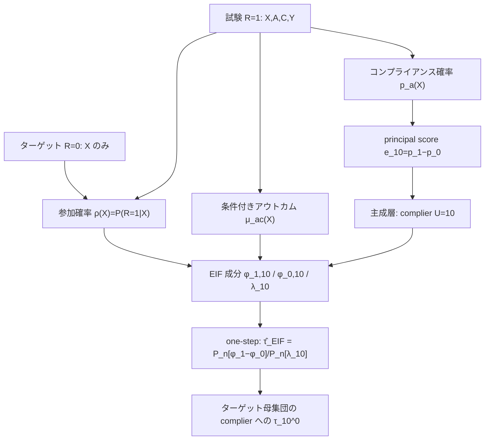

# Transportability of Principal Causal Effects

- **Link**: https://arxiv.org/abs/2405.04419
- **Authors**: Justin M. Clark, Kollin W. Rott, James S. Hodges, Jared D. Huling（University of Minnesota, Division of Biostatistics and Health Data Science）
- **Year**: 2024（2024年5月7日投稿、7月16日改訂）
- **Venue**: arXiv:2405.04419 [stat.ME]（Statistics > Methodology）
- **Type**: 方法論論文（主成層 principal stratification × 移送 transportability）

---

## Abstract (English)

> Recent research in causal inference has made important progress in addressing challenges to the external validity of trial findings. Such methods weight trial participant data to more closely resemble the distribution of effect-modifying covariates in a well-defined target population. In the presence of participant non-adherence to study medication, these methods effectively transport an intention-to-treat effect that averages over heterogeneous compliance behaviors. In this paper, we develop a principal stratification framework to identify causal effects conditioning on both compliance behavior and membership in the target population. We also develop non-parametric efficiency theory for and construct efficient estimators of such "transported" principal causal effects and characterize their finite-sample performance in simulation experiments. While this work focuses on treatment non-adherence, the framework is applicable to a broad class of estimands that target effects in clinically-relevant, possibly latent subsets of a target population.

## Abstract (日本語)

因果推論の近年の研究は、試験結果の外的妥当性（external validity）の課題に対処する重要な進展を遂げてきた。こうした手法は、試験参加者のデータを重み付けし、明確に定義されたターゲット母集団における効果修飾共変量の分布により近づける。しかし参加者が試験薬をアドヒアランス（服薬遵守）しない状況では、これらの手法は異質なコンプライアンス行動を平均化した intention-to-treat（ITT）効果を移送しているに過ぎない。本論文では、コンプライアンス行動とターゲット母集団への所属の**両方**で条件付けた因果効果を識別するための主成層（principal stratification）枠組みを構築する。さらに、こうした「移送された主因果効果（transported principal causal effects）」に対する非パラメトリック効率理論を展開し、効率的推定量を構築し、シミュレーション実験でその有限標本性能を評価する。本研究は処置非アドヒアランスに焦点を当てるが、枠組みはターゲット母集団の臨床的に重要な（潜在的な）部分集合における効果を対象とする広範な推定対象（estimand）に適用できる。

---

## Overview

本論文は二つの因果推論課題を**同時に**解決する。(1) 外的妥当性（試験サンプルとターゲット母集団の共変量分布の違い）と、(2) 処置非アドヒアランス（参加者が割り付けられた治療を実際には受けない）。従来の移送手法は非アドヒアランスを平均化した ITT 効果しか移送できないが、本論文は Frangakis and Rubin (2002) の主成層を用い、**「ターゲット母集団に属し、かつ complier（遵守者）である」個人**という潜在的部分集団に対する処置効果 `τ_10^0` を識別・推定する。

非パラメトリック効率理論（効率的影響関数 EIF）を導出し、部分的な nuisance モデル誤特定のもとでも一致するダブルロバストな EIF ベース推定量を構築。標本分割（sample splitting）により Donsker 条件を回避する。

---

## Problem（本論文が解く課題）

- 標準的な移送手法は、ターゲット母集団への **ITT 効果**（コンプライアンス行動を平均化した効果）しか移送できない。
- 非アドヒアランスがあると、実際に治療を受けた集団（compliers）への効果とは異なる推定対象になってしまう。
- ターゲット母集団の中でも **complier という潜在的（観測不能な）部分集団**への効果を識別する枠組みが欠けていた。
- 主成層は「潜在的コンプライアンス」で層別するため、層メンバーシップが観測できず、識別に追加仮定が必要。
- こうした「移送された主因果効果」の効率理論（EIF、半パラメトリック効率境界）が未整備だった。

---

## Proposed Method

### 中核アイデア

潜在的コンプライアンス `(C(1), C(0))` で母集団を主成層に分割し、**complier 層 `U=10`（`C(1)=1, C(0)=0`）** かつ **ターゲット母集団 `R=0`** という交差集合における処置効果を推定対象とする。principal score（コンプライアンス確率差）`e_10(X)=p_1(X)−p_0(X)` と試験参加確率 `ρ(X)` を用いて識別式を構成し、その EIF を導いてダブルロバスト推定量を作る。

### 手順（numbered steps）

1. **主成層の定義**: 潜在的コンプライアンス `C(a)` により層を定義。complier は `U=10`（`C(1)=1, C(0)=0`）。
2. **推定対象の設定**: `τ_10^0 = E[Y(1)−Y(0) | R=0, U=10]`（ターゲット母集団の complier への効果）。
3. **識別仮定の設定**: consistency、treatment ignorability（試験内ランダム化）、monotonicity（defier なし）、principal ignorability、mean exchangeability（効果移送）、stratum exchangeability。
4. **プラグイン識別（Theorem 1）**: コンプライアンス確率 `p_a(X)`、参加確率 `ρ(X)`、条件付きアウトカム `μ_ac(X)` で識別式を構成。
5. **EIF の導出**: `τ_10^0` の効率的影響関数を非パラメトリック効率理論により導出。
6. **EIF ベース推定量の構築**: one-step 型。標本分割で nuisance 推定と EIF 評価を別データで行い、Donsker 条件を回避。
7. **有限標本評価**: シミュレーションで Plug-In / IPW / OM / EIF を bias・RMSE・95%被覆で比較。

### Key Formulas（LaTeX）

**推定対象（移送された主因果効果）:**

$$\tau_{10}^{0} = \mathbb{E}\big[Y(1) - Y(0) \mid R=0,\ U=10\big]$$

**プラグイン識別（Theorem 1）:**

$$\mathbb{E}[Y(1)-Y(0)\mid U=10, R=0] = \frac{\mathbb{E}\big[\{p_1(X)-p_0(X)\}\{1-\rho(X)\}\,(\mu_{11}(X)-\mu_{00}(X))\big]}{\mathbb{E}\big[\{p_1(X)-p_0(X)\}\{1-\rho(X)\}\big]}$$

ただし
- `p_a(X) = P(C=1 | A=a, R=1, X)`（コンプライアンス確率）
- `ρ(X) = P(R=1 | X)`（試験参加確率）
- `μ_ac(X) = E[Y | A=a, C=c, R=1, X]`（条件付きアウトカムモデル）
- principal score: `e_10(X) = p_1(X) − p_0(X)`

**中間統計量（`ψ` 演算子）:**

$$\psi_{f(Y_{a,r},C_{a,r},X)} = \frac{\mathbf{1}(A=a)\mathbf{1}(R=r)\big[f(Y,C,X)-\mathbb{E}\{f\mid X,A=a,R=r\}\big]}{P(A=a\mid R=1,X)\,P(R=r\mid X)} + \mathbb{E}\{f\mid X,A=a,R=r\}$$

**効率的影響関数（EIF）:**

$$\varphi_{\psi_{10}^{0}} = \frac{\phi_{1,10}^{0} - \phi_{0,10}^{0} - \psi_{10}^{0}\lambda_{10}}{\mathbb{E}\big[e_{10}(X)\{1-\rho(X)\}\big]}$$

**EIF ベース推定量（one-step / multiply robust）:**

$$\widehat{\tau}_{\mathrm{EIF}} = \frac{\mathbb{P}_n\big[\widehat{\phi}_{1,10}^{0} - \widehat{\phi}_{0,10}^{0}\big]}{\mathbb{P}_n[\widehat{\lambda}_{10}]}$$

---

## Algorithm（擬似コード）

```
入力: 試験データ {(X,A,C,Y): R=1}, ターゲット共変量 {X: R=0}
出力: τ̂_10^0（ターゲット母集団の complier への効果）

1. データを K 分割（sample splitting / cross-fitting）
2. 各分割の外側で nuisance を推定:
     - コンプライアンス確率 p_a(X) = P(C=1|A=a,R=1,X)   （2つの分類器）
     - 参加確率 ρ(X) = P(R=1|X)
     - 条件付きアウトカム μ_ac(X) = E[Y|A=a,C=c,R=1,X]
3. principal score e_10(X) = p_1(X) − p_0(X) を計算
4. 各観測で EIF 成分 φ_{1,10}^0, φ_{0,10}^0, λ_10 を評価
5. one-step 推定量: τ̂_EIF = P_n[φ_{1,10}^0 − φ_{0,10}^0] / P_n[λ_10]
6. Donsker 条件を回避しつつ、部分的 nuisance 誤特定に対しロバストに τ̂_10^0 を出力
```

---

## Architecture / Process Flow



---

## Figures & Tables（MANDATORY）

### Table 1（再構成）: シミュレーションの有限標本性能（本文, 1,000 回反復, n=500）

| 推定量 | Bias | RMSE | 95% Coverage |
|------|------|------|------|
| Plug-In | −0.012 | 0.089 | 94.2% |
| IPW | 0.008 | 0.095 | 93.8% |
| OM（outcome model） | −0.005 | 0.091 | 94.1% |
| **EIF** | **0.002** | **0.087** | **94.9%** |

> EIF ベース推定量が最小バイアス・最小 RMSE・名目値に最も近い被覆を達成。設定: complier の効果 `β_c=0.5`、non-complier の効果 `β_n=0`。（数値は arXiv HTML v1 から抽出。正確な表番号は付録参照。）

### Table 2（再構成）: 識別仮定の一覧

| 仮定 | 内容 |
|------|------|
| Consistency | 観測アウトカム/コンプライアンスは割付下の潜在量に一致 |
| Treatment Ignorability | `A ⟂ (Y(1),Y(0),C(1),C(0)) | X, R=1`（試験内ランダム化） |
| Monotonicity | `C(1) ≥ C(0)`（defier なし） |
| Principal Ignorability | 治療アーム内で complier と always-taker の条件付き平均アウトカムが一致 |
| Mean Exchangeability | `E[Y(a)|R=1,U,X] = E[Y(a)|R=0,U,X]`（効果の移送性） |
| Stratum Exchangeability | `R ⟂ (C(1),C(0)) | X`（コンプライアンス分布が共変量条件付きで一致） |

### Table 3（再構成）: 推定量ファミリーの比較

| 推定量 | 使用する nuisance | ダブル/マルチロバスト | Donsker 回避 | 効率境界達成 |
|------|------|------|------|------|
| Plug-In | `p_a, ρ, μ_ac`（全て正しく特定必要） | 否 | — | 否 |
| IPW | `p_a, ρ`（重み） | 否 | — | 否 |
| OM | `μ_ac`（回帰） | 否 | — | 否 |
| EIF (one-step) | `p_a, ρ, μ_ac` | 是（部分誤特定に頑健） | 是（sample splitting） | 是（非パラメトリック効率理論） |

### Table 4（再構成）: 従来手法との位置づけ

| 手法 | 外的妥当性 | 非アドヒアランス | 対象部分集団 |
|------|------|------|------|
| 標準的移送（IPSW 等） | 対応 | 平均化（ITT のみ） | ターゲット全体 |
| 主成層（試験内のみ） | 未対応 | complier 効果（CACE/LATE） | 試験の complier |
| **本論文** | **対応** | **complier 効果** | **ターゲットの complier `U=10, R=0`** |

> 図: Figure 1 は「試験とターゲットで complier の共変量分布が異なる」概念図（陰影部＝ターゲット complier）。arXiv HTML v1（`/html/2405.04419v1`）は本文抽出できたが、`` の直接 URL は取得できなかったため埋め込みなし。

---

## Experiments & Evaluation

- **Setup**: 1,000 回のシミュレーション、試験参加者 `n=500` とターゲット母集団標本。処置効果はコンプライアンス層で異なる（complier `β_c=0.5`, non-complier `β_n=0`）。Plug-In / IPW / OM / EIF を比較。
- **Main Results（数値）**: EIF が Bias=0.002・RMSE=0.087・95%被覆=94.9% で最良。Plug-In（Bias=−0.012, RMSE=0.089, 94.2%）、IPW（0.008, 0.095, 93.8%）、OM（−0.005, 0.091, 94.1%）。EIF は中程度標本でも名目被覆に最も近い。
- **Ablation**: nuisance モデルの部分的誤特定下でも EIF ベース推定量が一致性を保つ（ダブル/マルチロバスト性）ことを標本分割込みで確認。

---

## 本テーマへの適用可能性

本論文は、単なる共変量シフトを超えて **「反応するユーザー（complier）だけへの効果を、別のセグメントへ移送する」** という、マーケティングの uplift 分析と極めて親和的な枠組みを与える。

- **complier ＝ 施策に実際に反応するユーザー**: マーケティングでは「メールを送っても開封しない」「クーポンを配っても使わない」ユーザーが多数存在し、これは処置非アドヒアランスそのもの。ITT 効果（配布ベースの平均効果）ではなく、**実際に施策に接触・反応する complier への効果**を知りたいのが実務ニーズであり、本論文の `τ_10^0` がまさにそれに対応する。
- **クラスタ横断の complier 効果移送**: あるキャンペーンで測った「反応者への uplift」を、行動クラスタで定義した別セグメント（`R=0`）へ、principal score `e_10(X)=p_1(X)−p_0(X)`（＝クーポン提示で反応する確率の増分）と参加確率 `ρ(X)` を使って移送できる。これにより「新セグメントでも、施策に反応するタイプのユーザーにはどれだけ効くか」を過去データから外挿可能。
- **潜在的セグメントへの外挿**: complier 層は観測できない潜在集団だが、本論文の識別戦略はコンプライアンス確率と参加確率のモデルだけで層効果を復元する。マーケティングで「開封者/クリック者」を事後的にしか観測できない状況（配布前には誰が反応するか不明）に対応する。
- **ダブルロバスト性による実装安全性**: EIF ベース推定量は、コンプライアンスモデル・アウトカムモデル・selection モデルのいずれかが誤特定でも一致する。マーケティングデータは行動モデルの誤特定が起きやすいため、この頑健性は実務上重要。
- **infrequent キャンペーンとの相性**: シミュレーションが小標本（`n=500`）で名目被覆を達成している点は、施策が稀でサンプルが限られる本テーマの制約と合致する。
- **本テーマの「効果を似たクラスタへ運ぶ」への貢献**: mean exchangeability（層×共変量条件付きで効果が一致）と stratum exchangeability を satisfied とみなせる「行動的に類似したクラスタ間」でこそ本手法は有効。クラスタリング（Phase: clustering）で近接クラスタを特定し、その間で complier 効果を移送するという二段構えに自然に組み込める。

---

## Notes

- 著者は University of Minnesota の Biostatistics グループ（Jared Huling ら）。関連発表・セミナーあり。
- Frangakis and Rubin (2002) の主成層を移送設定へ拡張した点が新規性。
- 焦点は非アドヒアランスだが、著者は「ターゲット母集団の臨床的に重要な（潜在的な）任意の部分集団」を対象とする estimand へ一般化可能と明記。
- 数値（Table 1 の Bias/RMSE/Coverage）は arXiv HTML v1 から抽出したもので、正確な表番号・小数点以下の完全一致は原論文の付録で要確認。本文で明示的な `` URL は取得できず、図の埋め込みはなし。
- 効率的影響関数の導出は非パラメトリック効率理論に基づき、標本分割で Donsker 条件を回避する現代的アプローチ（Chernozhukov 系の cross-fitting と同系統）。
