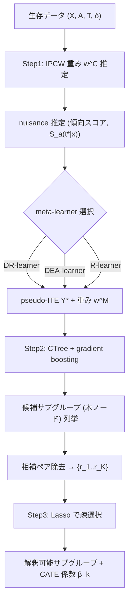

# Estimating Interpretable Heterogeneous Treatment Effect with Causal Subgroup Discovery in Survival Outcomes

- **Link**: https://arxiv.org/abs/2409.19241
- **Authors**: Na Bo, Ying Ding
- **Year**: 2024（初版 2024-09-28 提出、現行版 2025-11-26）
- **Venue**: arXiv:2409.19241 [stat.ME]（Statistics > Methodology）— ジャーナル掲載情報は記載なし
- **Type**: 手法論文（Interpretable HTE estimation / causal subgroup discovery / survival outcomes）

---

## Abstract (English)

> Estimating heterogeneous treatment effect (HTE) for survival outcomes has gained increasing attention, as it captures the variation in treatment efficacy across patients or subgroups in delaying disease progression. However, most existing methods focus on post-hoc subgroup identification rather than simultaneously estimating HTE and selecting relevant subgroups. In this paper, we propose an interpretable HTE estimation framework that integrates three meta-learners that simultaneously estimate CATE for survival outcomes and identify predictive subgroups. We evaluated the performance of our method through comprehensive simulation studies across various randomized clinical trial (RCT) settings. Additionally, we demonstrated its application in a large RCT for age-related macular degeneration (AMD), a polygenic progressive eye disease, to estimate the HTE of an antioxidant and mineral supplement on time-to-AMD progression and to identify genetics-based subgroups with enhanced treatment effects. Our method offers a direct interpretation of the estimated HTE and provides evidence to support precision healthcare.

## Abstract (日本語訳)

> 生存アウトカムに対する異質処置効果（HTE）の推定は、疾患進行の遅延における処置効果が患者やサブグループ間でどのように変動するかを捉えるものとして、注目を集めている。しかし既存手法の多くは、HTE 推定と関連サブグループ選択を同時に行うのではなく、事後的（post-hoc）なサブグループ同定に焦点を当てている。本論文では、生存アウトカムに対する CATE を推定しつつ予測的サブグループを同定する、3 つの meta-learner を統合した解釈可能な HTE 推定フレームワークを提案する。多様なランダム化臨床試験（RCT）設定を対象とした包括的なシミュレーション研究により本手法の性能を評価した。加えて、多遺伝子性の進行性眼疾患である加齢黄斑変性（AMD）の大規模 RCT に適用し、抗酸化・ミネラルサプリメントの time-to-AMD 進行に対する HTE を推定し、処置効果が増大する遺伝子ベースのサブグループを同定した。本手法は推定 HTE の直接的な解釈を提供し、精密医療を支持する証拠を与える。

---

## Overview（概要）

本研究は、**打ち切り（censoring）を伴う生存アウトカム**に対して、条件付き平均処置効果（CATE）の推定と、効果が均質かつ増大する**解釈可能なサブグループの発見を「同時に」行う**フレームワークを提案する。従来は、まずブラックボックスモデルで CATE を推定し、その後に事後的にサブグループを切り出す 2 段構えが主流であった。本手法は、meta-learner による pseudo-ITE 構築 → 条件付き推論木（CTree）による候補サブグループ生成 → Lasso による疎なサブグループ選択、という 3 ステップを一体化することで、ルールベースで直接解釈できるサブグループ（例：`SNP が特定の遺伝子型のとき効果大`）を出力する。

3 種の meta-learner（DR-learner / DEA-learner / R-learner）を選択肢として備え、右側打ち切りに対しては **IPCW（Inverse Probability Censoring Weighting）** で対処する。シミュレーションと AREDS（AMD の大規模 RCT）実データ、および独立コホート AREDS2 での外部検証により、疎で再現性のあるサブグループが得られることを示した。

---

## Problem（課題）

- 既存の HTE 手法の多くは **post-hoc**（事後的）なサブグループ同定で、HTE 推定とサブグループ選択が分断されている。
- ブラックボックス CATE 予測は、どの共変量がどの範囲で効果を持つのかという **解釈可能性** に欠ける。
- BAFT や CSF のような手法は多数のサブグループを生成し、**ノイズ変数を大量に取り込む**（過剰なサブグループ数と偽陽性）。
- 生存アウトカムでは **右側打ち切り** を適切に扱う必要があり、単純な回帰では不整合な推定になる。
- 選択したサブグループが **外部コホートで再現しない**（外的妥当性の欠如）ケースが多い。
- 高次元・相関の強い共変量（例：多数の SNP）設定でのロバストな変数選択が難しい。

---

## Proposed Method（提案手法）

### Core idea

「pseudo-ITE の構築（meta-learner + IPCW）」→「候補サブグループ生成（CTree + gradient boosting）」→「疎なサブグループ選択（Lasso）」を統合し、CATE 推定とサブグループ発見を同時に達成する。

### Numbered steps

1. **Step 1: Nuisance parameter / pseudo-ITE 構築**
   3 種の meta-learner のいずれかで各個体の pseudo-individualized treatment effect（pseudo-ITE）を推定する。
   - **DR-learner**: 効率的影響関数（efficient influence function）に基づく。手法固有の重みを必要としない。
   - **DEA-learner**: アウトカム残差を用いる efficiency-augmented アプローチ。重み付き回帰を適用。
   - **R-learner**: Robinson 分解に基づき、アウトカムと処置の中心化（centering）を適用。
   いずれも右側打ち切りに対して **IPCW** を適用する。

2. **Step 2: 候補サブグループ生成**
   条件付き推論木（CTree）を gradient boosting と組み合わせ、重み付き二乗誤差を最小化する木を構築。木のノードを候補サブグループとし、相補的（complementary）なペアを除去する。

3. **Step 3: 疎なサブグループ選択**
   サブグループ所属を二値指示変数 $r_k(\boldsymbol{x}) \in \{0,1\}$ とし、CATE を指示変数の線形結合で表現。**Lasso（L1 罰則）** により疎な係数 $\beta_k$ を得て、少数の解釈可能サブグループのみを残す。

### Key Formulas

**CATE 定義（生存確率スケール、時点 $t^*$）**

$$\tau(\boldsymbol{x};t^*) = \mathbb{E}[I(T(1)>t^*) - I(T(0)>t^*) \mid \boldsymbol{X} = \boldsymbol{x}]$$

**識別結果（生存関数の差として同定）**

$$\tau(\boldsymbol{x};t^*) = S_1(t^*|\boldsymbol{x}) - S_0(t^*|\boldsymbol{x})$$

**サブグループ指示変数によるパラメトリック表現**

$$\tau(\boldsymbol{x};t^*) = \beta_0 + \sum_{k=1}^{K} \beta_k\, r_k(\boldsymbol{x}), \qquad r_k(\boldsymbol{x}) \in \{0,1\}$$

**罰則付き目的関数（Step 3、$w_i^C$: 打ち切り重み、$w_i^M$: meta-learner 重み）**

$$\arg\min_{\boldsymbol{\beta}} \frac{1}{n^o} \sum_{i=1}^{n^o} w_i^C w_i^M \left\{ Y_i^* - \left[ \beta_0 + \sum_{k=1}^{K} \beta_k r_k(\boldsymbol{x}_i) \right] \right\}^2 + \lambda \sum_{k=1}^{K} |\beta_k|$$

**候補サブグループ生成の目的関数（Step 2）**

$$\arg\min_{\tau} \frac{1}{n^o} \sum_{i} w_i^C w_i^M \left( Y_i^* - \tau(\boldsymbol{x}_i;t^*) \right)^2$$

---

## Algorithm（擬似コード / Pseudocode）

```
Input : {(X_i, A_i, T_i, δ_i)}  (共変量, 処置, 観測時間, 事象指示),
        時点 t*, meta-learner 種別 ∈ {DR, DEA, R}, 罰則 λ
Output: 疎な解釈可能サブグループ集合 と 各サブグループの CATE 係数 β_k

# Step 1: pseudo-ITE 構築
1. 打ち切り重み w^C を IPCW で推定
2. nuisance（傾向スコア, 条件付き生存関数 S_a(t*|x) 等）を推定
3. 選択した meta-learner (DR / DEA / R) で
   各個体の pseudo-ITE  Y_i*  と meta-learner 重み w_i^M を計算

# Step 2: 候補サブグループ生成
4. 重み (w^C, w^M) 付きで CTree + gradient boosting を学習し
   Σ w^C w^M (Y_i* - τ(x_i;t*))^2 を最小化
5. 木のノードを候補サブグループとして列挙
6. 相補的(complementary)なノードペアを除去 → 候補集合 {r_1,...,r_K}

# Step 3: 疎な選択
7. 目的関数
     (1/n^o) Σ w^C w^M {Y_i* - [β0 + Σ β_k r_k(x_i)]}^2 + λ Σ|β_k|
   を Lasso で最小化
8. β_k ≠ 0 のサブグループのみ返す
```

---

## Architecture / Process Flow



---

## Figures & Tables

> 注: arXiv HTML の fetch では figure の `` URL を確認できなかったため、画像は埋め込まず、本文で報告された数値のみを表として整理する。図の画像 URL は記載なし。

### Table 1: 主要結果 — シミュレーション性能（Scenario 3、精度・F-score）

| 設定 | 手法 | Accuracy | F-score | 選択サブグループ数（中央値, 範囲） |
|------|------|----------|---------|-----------------------------------|
| 低次元・独立シグナル（10 共変量） | **DEA-learner（提案）** | 87.22%（SD 7.28） | 92.04%（SD 4.44） | 7（1–14） |
| 低次元 | DR-learner | 84.88% | 記載なし | 記載なし |
| 低次元 | R-learner | 85.53% | 記載なし | 記載なし |
| 低次元 | BAFT | 87.59% | 記載なし | 179（ノイズ過多） |
| 低次元 | CSF | 79.75% | 記載なし | 138 |
| 高次元・相関シグナル（100 共変量） | **DEA-learner（提案）** | 75.86%（SD 4.89） | 83.53%（SD 3.55） | 28（3–60） |
| 高次元 | R-learner | 78.29%（約30%の run でサブグループ生成失敗） | 記載なし | 記載なし |
| 高次元 | BAFT | 84.82% | 記載なし | 480（うち >300 がノイズ関連） |
| 高次元 | CSF | 77.68% | 記載なし | 449 |

### Table 2: アーキテクチャ / 処理段階（各ステップの役割）

| Step | 処理 | 手法・要素 | 出力 |
|------|------|-----------|------|
| 1 | pseudo-ITE 構築 | DR / DEA / R meta-learner + IPCW | pseudo-ITE $Y^*$、重み $w^C, w^M$ |
| 2 | 候補サブグループ生成 | CTree + gradient boosting | 木ノード＝候補 $\{r_1,\dots,r_K\}$ |
| 3 | 疎な選択 | Lasso（L1 罰則） | $\beta_k \ne 0$ の解釈可能サブグループ |

### Table 3: Ablation / ノイズ選択・Null 設定での挙動

| 設定 | 手法 | ノイズ変数選択率 / 挙動 |
|------|------|------------------------|
| 低次元 | DEA-learner（提案） | 直接効果変数 h(X) を >60% の run で選択、ノイズ変数 <10% |
| 高次元 | DEA-learner（提案） | ノイズ選択 ~20% |
| 高次元 | DR-learner | ノイズ選択 >50% |
| 高次元 | BAFT | ノイズ選択 >70% |
| Null（真にサブグループなし） | DEA / R-learner | 多くの run でサブグループを選ばない（望ましい） |
| Null | DR-learner | 65% の run で null サブグループ生成 |
| Null | BAFT / CSF | >300 サブグループ生成（偽陽性） |

### Table 4: 手法比較（提案 vs. ベースライン）

| 観点 | 提案（DEA/DR/R + CTree + Lasso） | BAFT | CSF |
|------|----------------------------------|------|-----|
| サブグループ発見 | HTE 推定と同時（interpretable, rule-based） | post-hoc 的、多数生成 | post-hoc 的、多数生成 |
| サブグループ数（高次元） | 中央値 28 | 480 | 449 |
| ノイズ耐性 | 高（~20%） | 低（>70%） | 記載なし |
| 打ち切り対応 | IPCW | 記載なし | あり（Causal Survival Forest） |
| 外部検証（AREDS2） | top サブグループが検証成功 | top サブグループが検証失敗 | 記載なし |
| 係数の大きさ | 実質的 | 提案の約 1/10（10× smaller） | 記載なし |

---

## Experiments & Evaluation（実験と評価）

### Setup

- **シミュレーション**: 多様な RCT 設定。低次元（10 共変量・独立シグナル）と高次元（100 共変量・相関シグナル）、および Null 設定（真にサブグループが存在しない）を含む。評価指標は bias、binned-RMSE、Accuracy、F-score、選択サブグループ数、ノイズ変数選択率。
- **実データ**: AREDS（AMD の大規模 RCT）。806 名（処置 415 / 対照 391）、12 年フォローアップ。平均年齢 68.77 歳（SD 5.05）、女性 57.82%。共変量は 46 個の treatment-efficacy SNP ＋ 67 個の prognostic SNP。処置は抗酸化・ミネラルサプリメント、アウトカムは time-to-AMD 進行。
- **外部検証**: 独立コホート AREDS2。

### Main Results（数値付き）

- **低次元 Scenario 3**: 提案（DEA-learner）Accuracy 87.22%（SD 7.28）、F-score 92.04%（SD 4.44）、選択サブグループ中央値 7（範囲 1–14）。DR 84.88%、R 85.53%。BAFT は 87.59% だが 179 サブグループでノイズ過多。CSF 79.75%（138 サブグループ）。
- **高次元 Scenario 3**: 提案 Accuracy 75.86%（SD 4.89）、F-score 83.53%（SD 3.55）、bias ~0.10、binned-RMSE ~0.45、サブグループ中央値 28（3–60）。ノイズ選択 ~20%（DR >50%、BAFT >70% と比べ低い）。R 78.29% だが約 30% の run でサブグループ生成失敗。BAFT 84.82%（480 サブグループ、うち >300 ノイズ）。CSF 77.68%（449 サブグループ）。
- **AREDS 実データ**: 14 個の SNP ＋ baseline severity を用いて 19 個の解釈可能サブグループを同定（9 個の CE4 SNP＝treatment-efficacy 関連、5 個の prognostic SNP）。19 中 12 が多共変量相互作用で定義。
  - **最も有益なサブグループ**: `rs1618927={AG,GG} または rs1056437={AT,TT}`。AREDS 内で 651 名（81%）。AREDS2 検証（n=110）では 88 名（80%）、うち 66% が正の CATE。log-rank 検定 p 値 = 0.002（KM 曲線が有意に分離）。
  - **比較**: BAFT は 367 サブグループを選択し係数は約 1/10、top サブグループは AREDS2 で外部検証に失敗。

### Ablation

- Null 設定で提案（DEA/R）はサブグループをほぼ選ばず、DR は 65% で null サブグループを生成、BAFT/CSF は >300 の偽陽性を生成。
- ノイズ変数選択率: 提案は低次元 <10%、高次元 ~20% に抑制。DR（>50%）や BAFT（>70%）を大きく下回る。

---

## 本テーマへの適用可能性

本テーマは「データサイエンティストが**低頻度**のマーケティングキャンペーンを運用し、処置効果（treatment effect）が**均質かつ増大**するサブグループを発見して、類似ユーザーをまとめ、効果を安定推定・転用したい」というもの。本論文の枠組みは、この課題に対して以下のように具体的に対応できる。

- **サブグループ単位のユーザーグルーピング**: 本手法の中核は、CATE を二値サブグループ指示変数 $r_k(\boldsymbol{x})$ の線形結合 $\tau(\boldsymbol{x}) = \beta_0 + \sum_k \beta_k r_k(\boldsymbol{x})$ として表現する点にある。マーケティングでは $r_k$ を「特定セグメント（例：`直近購入日 ≤ 30 日 かつ 会員ランク=Gold`）に属するか」のルールに置き換えれば、そのままユーザーグルーピングとして解釈できる。$\beta_k$ がそのセグメントの追加的な uplift（増分効果）を表すため、「効果が高いのはどのセグメントか」を係数で直接読み取れる。
- **低頻度キャンペーン＝サンプル希少性への耐性**: 本手法は Lasso による疎選択と CTree による相補ペア除去により、少数の再現性あるサブグループのみを残す。ノイズ選択率が低い（低次元 <10%）ことは、キャンペーン頻度が低くデータが少ない状況で「偽のセグメント」を量産しない点で有利。BAFT/CSF が数百のサブグループを吐く挙動はマーケティング運用では扱いづらく、本手法の疎さが運用適合性に直結する。
- **効果の均質性と信頼できる推定**: サブグループを「同一 $\beta_k$ を共有する均質グループ」として定義するため、個々のユーザーで不安定な individual uplift を推定するのではなく、**グループ平均として安定した効果推定**が得られる。これはキャンペーン結果のサンプルが薄い場合に特に有効。
- **効果の転用（transfer）と外部検証**: 本論文は AREDS で選んだサブグループを独立コホート AREDS2 で log-rank p=0.002 と検証している。マーケティングでも、あるキャンペーンで発見した高効果セグメントを、次回キャンペーンや別チャネルの母集団に適用し、同様の再現性検証を行う運用が可能。ルールベースなので、新しいユーザーが「その条件に該当するか」を即座に判定でき、**効果の転用が実装容易**。
- **生存アウトカムの読み替え**: 本手法は time-to-event（例：解約までの時間、初回購入までの時間、再購入までの時間）を扱える。マーケティングでの「チャーン遅延効果」「コンバージョンまでの時間短縮効果」に対し、時点 $t^*$（例：90 日後の継続確率）での CATE 差 $S_1(t^*|\boldsymbol{x}) - S_0(t^*|\boldsymbol{x})$ を推定でき、打ち切り（観測期間内に事象が起きないユーザー）を IPCW で正しく扱える点が実務的に重要。
- **meta-learner の選択自由度**: DR / DEA / R を選べるため、傾向スコアが既知（ランダム割当キャンペーン）なら DR、観測データで残差活用したいなら DEA/R、というように運用データの性質に合わせて使い分けできる。

留意点として、本手法は RCT（ランダム割当）と「未観測交絡なし」を前提とするため、観測ログのみの非ランダムキャンペーンに適用する際は傾向スコア推定や交絡調整の妥当性検証が別途必要になる。また時点 $t^*$ の選び方でサブグループ効果の大きさが変わるため、意思決定に用いる評価時点を事前に定義しておくべきである。

---

## Notes（備考）

- Venue はプレプリント（arXiv:2409.19241, stat.ME）。査読誌への正式掲載情報は記載なし。
- 図（figure）の画像 URL は HTML fetch で取得できなかったため未掲載（記載なし）。表の数値は fetch 結果に基づき記載し、欠損は「記載なし」とした。
- 手法の理論保証について、著者自身が「全体フレームワークの理論保証は欠く（meta-learner 個々は理論的に基礎づけられている）」と限界を明記している。
- 主要限界: 時点 $t^*$ の選択が効果量に影響、木分割の有意水準 $\alpha$ の指定が必要（疎さとカバレッジのトレードオフ）、未観測交絡なしの仮定。
- コード公開の有無は本 fetch では未確認（記載なし）。
