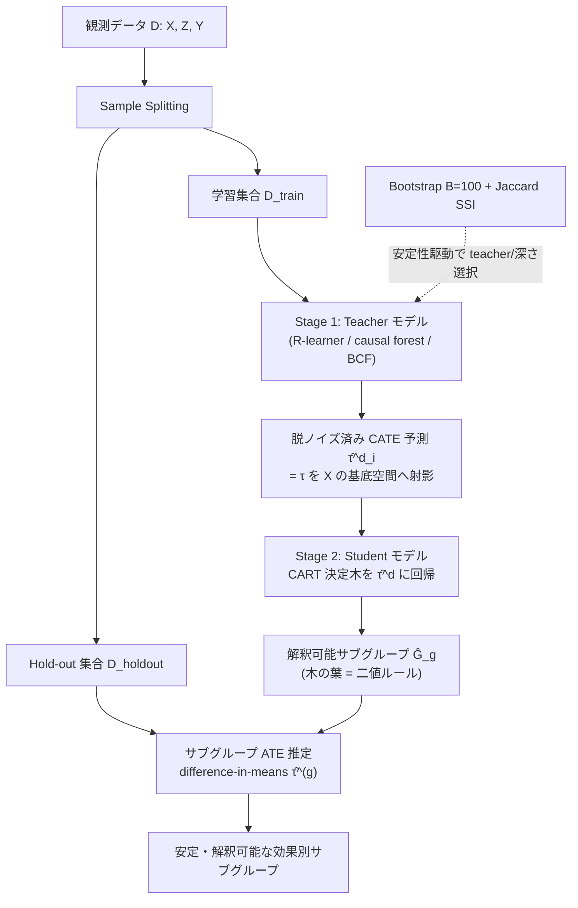

# Distilling Heterogeneous Treatment Effects: Stable Subgroup Estimation in Causal Inference

- **Link**: https://arxiv.org/abs/2502.07275 (HTML: https://arxiv.org/html/2502.07275)
- **Authors**: Melody Huang, Tiffany M. Tang, Ana M. Kenney
- **Year**: 2025
- **Venue**: arXiv preprint (Statistics > Methodology, stat.ME)。査読付き掲載先は記載なし
- **Type**: 方法論論文（因果推論 / 異質処置効果 / 解釈可能サブグループ）

---

## Abstract (English)

> Recent methodological developments have introduced new black-box approaches to better estimate heterogeneous treatment effects; however, these methods fall short of providing interpretable characterizations of the underlying individuals who may be most at risk or benefit most from receiving the treatment, thereby limiting their practical utility. In this work, we introduce *causal distillation trees* (CDT) to estimate interpretable subgroups. CDT allows researchers to fit any machine learning model to estimate the heterogeneous treatment effect, and then leverages a simple, second-stage tree-based model to "distill" the estimated treatment effect into meaningful subgroups. As a result, CDT inherits the improvements in predictive performance from black-box machine learning models while preserving the interpretability of a simple decision tree. We derive theoretical guarantees for the consistency of the estimated subgroups using CDT, and introduce stability-driven diagnostics for researchers to evaluate the quality of the estimated subgroups. We illustrate our proposed method on a randomized controlled trial of antiretroviral treatment for HIV from the AIDS Clinical Trials Group Study 175 and show that CDT out-performs state-of-the-art approaches in constructing stable, clinically relevant subgroups.

## Abstract (日本語訳)

> 近年の方法論的発展により、異質処置効果（heterogeneous treatment effects）をより良く推定する新しいブラックボックス的手法が導入されてきた。しかしこれらの手法は、処置を受けることで最もリスクを負う、あるいは最も便益を得る個人がどのような人々かを解釈可能な形で特徴づけることができず、その実用性が制約されている。本研究では、解釈可能なサブグループを推定するための *causal distillation trees* (CDT) を提案する。CDT は、異質処置効果の推定に任意の機械学習モデルを用いることを許容し、その後、単純な第二段階の木ベースモデルを活用して、推定された処置効果を意味のあるサブグループへと「蒸留(distill)」する。その結果 CDT は、ブラックボックス機械学習モデルの予測性能上の改善を継承しつつ、単純な決定木の解釈可能性を保持する。我々は CDT により推定されたサブグループの一致性に関する理論的保証を導出し、推定サブグループの品質を評価するための安定性駆動型の診断指標を導入する。提案手法を、HIV に対する抗レトロウイルス治療のランダム化比較試験（AIDS Clinical Trials Group Study 175）に適用し、CDT が安定かつ臨床的に意味のあるサブグループを構築する点で最先端手法を上回ることを示す。

---

## Overview（概要）

本論文は、**異質処置効果（HTE / CATE）の推定精度**と**サブグループの解釈可能性・安定性**を両立させる二段階手法 **Causal Distillation Trees (CDT)** を提案する。

近年の causal forest / R-learner / BCF（Bayesian Causal Forest）等のメタラーナーは個体レベルの CATE $\tau_i = \mathbb{E}[Y_i(1) - Y_i(0)\mid X_i]$ を高精度に推定できるが、出力はブラックボックスであり「誰が最も便益を得るか」を人間が理解可能な形で提示できない。一方、causal tree のように直接木を当てる手法は解釈可能だが、ノイズの多い個体効果に直接木を当てるため**分割点が不安定**になりやすい。

CDT の核心は「**知識蒸留(knowledge distillation)の因果版**」である。第一段階の柔軟な teacher モデルで CATE を推定し、その**平滑化・脱ノイズ済み予測 $\hat{\tau}^d_i$** を第二段階の student（CART 決定木）で回帰的に近似する。teacher が $\tau_i$ を共変量 $X$ の基底空間へ射影して de-noise するため、student は**より安定してサブグループ（＝木の葉）を推定**できる。さらに、bootstrap ベースの **Jaccard Subgroup Similarity Index (SSI)** により teacher モデル選択を安定性駆動で行い、sample splitting によりサブグループ ATE を post-selection バイアスなく推定する。

HIV 臨床試験（ACTG 175）への適用で、CDT は既存手法より安定かつ臨床的に妥当なサブグループを再現することを示した。

---

## Problem（課題）

- ブラックボックス HTE 手法（causal forest, R-learner, BCF 等）は高精度だが、**どの個人が便益/リスクを負うかの解釈可能な特徴づけができない**。
- causal tree / virtual twins などの直接的サブグループ探索手法は、**ノイズの多い個体効果に木を当てるため分割点（split）が不安定**で、標本を変えると異なる特徴・閾値が選ばれる。
- 実務では「解釈可能なサブグループ」と「推定精度」がトレードオフになりがちで、両立する手法が乏しい。
- 二段階(teacher→student)アプローチの先行研究には**一致性の理論的保証が不足**している。
- サブグループを選んだ同一データで ATE を推定すると **post-selection（選択後）バイアス**が生じる。
- サブグループ品質を評価する**安定性診断指標**が整備されていない。

---

## Proposed Method（提案手法）

### Core Idea（核心アイデア）

> "the first stage learner smooths the heterogeneous treatment effects by projecting $\tau_i$ into the basis space of the covariates $X$. By using the projected version of the heterogeneous treatment effect instead of $\tau_i$, the second stage learner will be able to more stably estimate the subgroups, as the teacher model will have de-noised the outcomes."

すなわち、生の（ノイズを含む）個体効果 $\tau_i$ に木を当てるのではなく、teacher が **共変量空間へ射影・脱ノイズした $\hat{\tau}^d_i$** に student 木を当てることで、分割点推定の**信号対雑音比(SNR)**を高め、サブグループを安定化する。

### Numbered Steps（手順）

1. **データ分割 (Sample Splitting)**: データを「サブグループ推定用の学習集合」と「サブグループ ATE 推定用の hold-out 集合」に分割する。これにより post-selection バイアスを回避する。
2. **Stage 1 — Teacher モデル**: 学習集合上で任意の柔軟なメタラーナー（R-learner, causal forest, BCF など）を当て、CATE 予測 $\hat{\tau}^d_i$ を得る（脱ノイズ・平滑化された効果）。
3. **Stage 2 — Student モデル**: $\hat{\tau}^d_i$ を目的変数、共変量 $X$ を説明変数として **CART 決定木**を当てる。木の各葉が解釈可能な二値ルールで定義されるサブグループ $\hat{\mathcal{G}}_g$ になる。
4. **サブグループ ATE 推定**: hold-out 集合上で、各サブグループ内の difference-in-means 推定量によりサブグループ ATE $\hat{\tau}^{(g)}$ を推定する（Theorem 3.2）。
5. **安定性駆動型モデル選択**: bootstrap（$B=100$）で SSI を計算し、平均 Jaccard SSI が最大の teacher モデル/木の深さを選択する。

### Key Formulas（主要数式）

**Proposition 3.1（単一ルール設定での収束レート）**:
$$\mathbb{E}\left[\,|\hat{\mathcal{G}}_1(X_i) - \mathcal{G}_1(X_i)|\,\right] \lesssim |\hat{s}_n - s| = O_p\!\left(n^{-1/2(\alpha-\eta)}\right)$$
（$\alpha, \eta$ は最適分割点近傍の平滑性を制御するパラメータ。）

**Example 3.1（蒸留による安定性改善 / 漸近分散比）**: $\tau_i = \tau(X_i) + v_i$ かつ $\hat{\tau}^d_i = \tau(X_i) + v^d_i$ のとき、
$$\frac{\text{asyvar}(\hat{s}^{\,orig}_n)}{\text{asyvar}(\hat{s}_n)} = \left(\frac{\text{SNR}_{\text{distil}}}{\text{SNR}_{\text{original}}}\right)^{2+4/3}$$
蒸留により SNR が改善し分割点推定の漸近分散が縮小することを示す。

**Theorem 3.1（多変量一致性）**: 分離可能性(Assumption 3.5)ほか正則条件の下で、
$$\hat{\mathcal{G}}_g(X_i) \xrightarrow{p} \mathcal{G}_g(X_i)$$
木が関連特徴を正しく選択し最適分割を回復する。

**Theorem 3.2（サブグループ ATE 推定量）**: ランダム割付の下で difference-in-means 推定量
$$\hat{\tau}^{(g)} = \frac{\sum_i Z_i Y_i \hat{\mathcal{G}}_g(X_i)}{\sum_i Z_i \hat{\mathcal{G}}_g(X_i)} - \frac{\sum_i (1-Z_i) Y_i \hat{\mathcal{G}}_g(X_i)}{\sum_i (1-Z_i) \hat{\mathcal{G}}_g(X_i)}$$
は一致性を持ち、漸近分散はサブグループ内アウトカム分散に依存する。

**Jaccard Subgroup Similarity Index (SSI)**:
$$\text{SSI}\!\left(\hat{\mathcal{G}}^{(1)}, \hat{\mathcal{G}}^{(2)}\right) = \frac{1}{2G} \sum_{\mathcal{H} \in \hat{\mathcal{G}}^{(1)} \cup \hat{\mathcal{G}}^{(2)}} \frac{N_{11}(\mathcal{H})}{N_{01}(\mathcal{H}) + N_{10}(\mathcal{H}) + N_{11}(\mathcal{H})}$$
bootstrap 標本間でサブグループ分割の重なり（Jaccard）を測る。$N_{11}$ は両分割で同一グループに属する対の数など。

---

## Algorithm（擬似コード / Pseudocode）

```
Input:  data D = {(X_i, Z_i, Y_i)}_{i=1..n}
        teacher model family M, tree depth grid Δ
Output: interpretable subgroups Ĝ, subgroup ATEs τ̂^(g)

# --- Stability-driven teacher/depth selection ---
for m in M, d in Δ:
    ssi_scores = []
    repeat B = 100 times:
        D_b        = bootstrap_sample(D)
        τ̂^d_b      = fit_teacher(m, D_b)            # Stage 1
        Ĝ_b        = fit_CART(X_b, τ̂^d_b, depth=d)  # Stage 2
        ssi_scores.append( SSI(Ĝ_b, Ĝ_reference) )
    avg_ssi[m, d] = mean(ssi_scores)
(m*, d*) = argmax(avg_ssi)                          # most stable config

# --- Final fit with sample splitting ---
(D_train, D_holdout) = split(D)
τ̂^d = fit_teacher(m*, D_train)                       # Stage 1: de-noised CATE
Ĝ   = fit_CART(X_train, τ̂^d, depth=d*)               # Stage 2: subgroups (leaves)

# --- Subgroup ATE estimation on held-out data ---
for each subgroup g in Ĝ:
    τ̂^(g) = difference_in_means( D_holdout ∩ g )     # Theorem 3.2
return Ĝ, {τ̂^(g)}
```

---

## Architecture / Process Flow



---

## Figures & Tables

> 注: arXiv HTML 取得では図の `` URL を確認できなかったため、画像は埋め込まない。以下の表の数値は本文・図 3/図 4・ACTG 175 ケーススタディの記述に基づく（レンジ/近似値は本文記述通り。厳密な単一値が本文に明示されない箇所は近似レンジとして記載）。

### 表1: シミュレーション主結果（Figure 3, 高ノイズ域含む横断比較）

| 指標 | CDT (3種 teacher) | Causal tree | Virtual twins / linear |
|---|---|---|---|
| Feature selection F₁ | 一貫して > 0.8 | 高ノイズで ~0.2 に低下 | linear 系 ~0.3 |
| True Positives | 2+ を維持 | 高ノイズで 0–1 | 高ノイズで 0–1 |
| False Positives | ≤ 0.2 | > 1.0 | virtual twins > 2.0 |
| Threshold RMSE | ~0.1–0.2 | 0.3–0.6 | 0.3–0.6 |
| Subgroup ATE RMSE | ~0.15–0.3 | ~0.4–0.8 | 記載なし（本文に個別値明示なし） |

### 表2: アーキテクチャ / 二段階構成（method architecture）

| 段階 | モデル | 入力 | 出力 | 役割 |
|---|---|---|---|---|
| Stage 1 (Teacher) | 任意メタラーナー（R-learner / causal forest / BCF） | X, Z, Y | 脱ノイズ CATE $\hat{\tau}^d_i$ | 効果の平滑化・射影・de-noise |
| Stage 2 (Student) | CART 決定木 | X, $\hat{\tau}^d_i$ | サブグループ $\hat{\mathcal{G}}_g$ | 解釈可能な二値ルール抽出 |
| 推定 | difference-in-means | X, Z, Y (hold-out) | $\hat{\tau}^{(g)}$ | サブグループ ATE の不偏推定 |
| 選択 | Bootstrap + Jaccard SSI | 反復 B=100 | teacher/深さ | 安定性駆動モデル選択 |

### 表3: Ablation / teacher モデル選択（Figure 4, Jaccard SSI）

| Teacher モデル | 平均 Jaccard SSI（深さ1–4） | 備考 |
|---|---|---|
| Distilled Causal Forest | 最高 ~0.75–0.85 | SSI と下流サブグループ推定精度の相関を確認 |
| その他 distilled teacher（R-learner / BCF） | 記載なし（CF より低いと本文記述） | — |
| 非蒸留 competitor | bootstrap 間で特徴選択が変動（低安定） | — |

### 表4: 手法比較（method comparison）

| 手法 | 解釈可能性 | 予測精度 | 分割安定性 | 一致性の理論保証 |
|---|---|---|---|---|
| Black-box メタラーナー (causal forest 等) | 低 | 高 | — | — |
| Causal tree（直接木） | 高 | 中〜低 | 低（不安定） | 限定的 |
| Virtual twins | 中 | 中 | 低（FP > 2.0） | 記載なし |
| **CDT（提案）** | 高（決定木） | 高（teacher 継承） | 高（de-noise で安定） | あり（Prop.3.1, Thm.3.1/3.2） |

---

## Experiments & Evaluation（実験と評価）

### Setup（設定）

- **シミュレーション**: $n=500$ サンプル、$p=10$ 共変量を $\text{MVN}(0, I)$ から生成。処置 $Z_i \sim \text{Bernoulli}(1/2)$（完全ランダム割付）。
- **DGP タイプ**: AND / Additive / OR の3種の効果構造。
- **アウトカム**: $Y_i = Z_i \cdot \tau_i + X_i^{(3)} + X_i^{(4)} + \nu_i$、$\nu_i \sim N(0, 0.1^2)$。
- **効果ノイズ**: $\sigma_\tau \in \{0.2, 0.4, 0.6, 0.8, 1\}$ を横断的に評価。
- **実データ**: ACTG 175（AIDS Clinical Trials Group Study 175）。CD4 数 200–500 cells/mm³ の HIV 患者、combination therapy vs monotherapy にランダム化。本文記載のサブグループ分析対象は 230 名。

### Main Results（主結果・数値）

- **Feature selection F₁**: CDT は3種 teacher いずれもノイズ全域で $F_1 > 0.8$ を一貫維持。causal tree は高ノイズで ~0.2、linear 系は ~0.3 まで低下。
- **True Positives**: CDT は 2+ 特徴を維持。競合は高ノイズで 0–1。
- **False Positives**: CDT ≤ 0.2、causal tree > 1.0、virtual twins > 2.0。
- **Threshold RMSE**: CDT ~0.1–0.2、競合 0.3–0.6。
- **Subgroup ATE RMSE**: CDT ~0.15–0.3、causal tree ~0.4–0.8。
- **ACTG 175**: 木は CD8 細胞数・体重・過去の抗レトロウイルス治療歴で分割し、いずれも HIV 進行の臨床的に妥当な予測因子。「開始時体重が高い患者は、低・高いずれの CD8 数でも combination therapy の便益が大きく（Group 2, 3 vs Group 1）、効果は低い（健康な）CD8 数の下でやや強い」。

### Ablation（アブレーション）

- **Teacher モデル選択（Figure 4）**: Distilled Causal Forest が平均 Jaccard SSI 最高（~0.75–0.85、深さ1–4）。SSI と下流サブグループ推定精度の正の相関を確認し、SSI が有効なモデル選択診断であることを裏づけ。
- **蒸留の有無**: 蒸留手法は bootstrap 標本間で同一特徴を安定選択。非蒸留競合は選ぶ特徴が標本ごとに変動。
- **理論的裏づけ**: Example 3.1 が蒸留による漸近分散縮小（SNR 改善）を定量化。

---

## 本テーマへの適用可能性

**シナリオ**: データサイエンティストが**低頻度のマーケティング施策（キャンペーン）**を運用し、処置効果（uplift）が高く・かつ**均質**なサブグループを発見して、類似ユーザをまとめ、効果を安定的に推定・転用したい。

CDT はこのニーズに直接的に適合する。以下、具体的な適用像を示す。

1. **uplift の異質性を「解釈可能なユーザセグメント」に落とす**: マーケティングでは causal forest / R-learner / meta-learner で個体 uplift $\hat{\tau}_i$ を推定できるが、キャンペーン運用者に渡すには「年齢・購買頻度・LTV・直近来訪日数などで定義されたセグメントルール」が必要。CDT の Stage 2 の CART 木の葉は、まさに**運用可能な二値ルール（例: 直近購買 < 30日 かつ 年間購買回数 ≥ 5 → 高 uplift 群）**を生む。これは施策のターゲティングリストにそのまま変換できる。

2. **低頻度施策における「効果の安定推定・転用」**: 施策が稀にしか打てないと、単一キャンペーンのサンプルはノイズが大きく、causal tree を直接当てると分割が毎回変わり再現しない。CDT は teacher で uplift を de-noise してから木を当てるため、**分割点が安定**し、次回キャンペーンや別チャネルへ**同じセグメント定義を転用**しやすい。論文の Threshold RMSE（CDT ~0.1–0.2 vs 競合 0.3–0.6）はこの安定性を示唆する。

3. **サブグループ ATE の post-selection バイアス回避**: 「高 uplift セグメントを見つけた同じデータで効果を報告」すると過大評価になりがち。CDT の sample splitting + hold-out 上の difference-in-means（Theorem 3.2）は、**選んだセグメントの効果を不偏に推定**できるため、経営報告や予算配分に耐える数字を出せる。RCT でなくとも、傾向スコア等で割付をランダム化近似できれば適用余地がある（ただし論文の理論はランダム割付前提なので、観測データでは追加の識別仮定が必要）。

4. **安定性診断で「まとめてよいユーザ群」を選ぶ**: Jaccard SSI により、bootstrap を跨いで**再現するセグメントかどうか**を定量評価できる。SSI が低いセグメントは「たまたま出た群」であり施策転用に不向き、と足切りできる。低頻度施策では特にこの安定性フィルタが重要で、「類似ユーザをまとめて効果を確実に推定・転用する」という本テーマの要求に直結する。

5. **均質性の担保**: 木の葉は同一ルールを満たすユーザ集合であり、葉内の uplift は teacher により平滑化された値に近い。結果として**葉内で効果が均質なセグメント**が得られ、「同一群には同一施策」という運用判断の根拠になる。

**留意点（適用上の限界）**: (a) 理論保証はランダム割付前提であり、観測データのマーケティングログでは unconfoundedness 等の仮定と傾向スコア補正が別途必要。(b) キャンペーン頻度が極端に低くサンプルが小さいと、teacher 自体の CATE 推定が不安定になり de-noise の恩恵が限定される。(c) SSI による選択は計算コスト（B=100 の bootstrap × teacher × 深さ）がかかる。

---

## Notes（備考）

- 本稿の数値・数式は arXiv abstract ページおよび HTML 全文取得（https://arxiv.org/html/2502.07275 ）に基づく。**図の画像 URL は HTML 取得で確認できなかったため画像埋め込みは行っていない**。
- 一部の指標（例: 表1の linear 系 Subgroup ATE RMSE、表3の CF 以外の teacher の SSI 具体値）は本文に単一値の明示がなく「記載なし」とした。表中のレンジ（~0.1–0.2 等）は Figure 3/4 の記述に基づく近似であり、厳密な単一点推定値ではない。
- 提出日: 2025年2月11日。査読付き掲載先・comments フィールドは記載なし。
- teacher モデルとして R-learner, causal forest, BCF（Bayesian Causal Forest）が例示され、student は CART。
- 実データは ACTG 175（HIV 抗レトロウイルス治療 RCT）。分割特徴は CD8 細胞数・体重・過去治療歴。
- 関連キーワード: knowledge distillation（知識蒸留）の因果版、CATE/HTE、subgroup identification、stability-driven model selection、post-selection inference。
