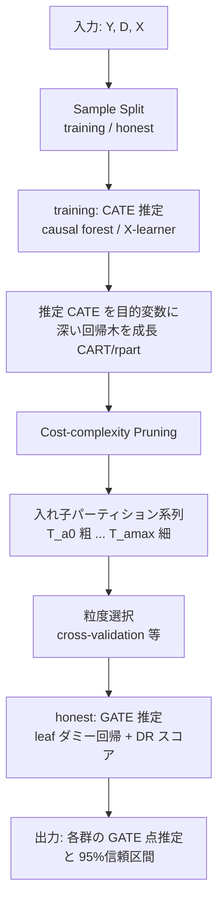

# Aggregation Trees

- **Link**: https://arxiv.org/abs/2410.11408 （HTML: https://arxiv.org/html/2410.11408v2 ）
- **Authors**: Riccardo Di Francesco
- **Year**: 2024（初版 2024-10-15 提出、2025-10-01 改訂）
- **Venue**: arXiv:2410.11408 [econ.EM]（Econometrics）— 査読誌掲載情報は記載なし（プレプリント）
- **Type**: 方法論論文（因果推論 / 異質処置効果 / ノンパラメトリック部分集団構築）

---

## Abstract (English)

> "Uncovering the heterogeneous effects of particular policies or 'treatments' is a key concern for researchers and policymakers. A common approach is to report average treatment effects across subgroups based on observable covariates. However, the choice of subgroups is crucial as it poses the risk of p-hacking and requires balancing interpretability with granularity. This paper proposes a nonparametric approach to construct heterogeneous subgroups. The approach enables a flexible exploration of the trade-off between interpretability and the discovery of more granular heterogeneity by constructing a sequence of nested groupings, each with an optimality property. By integrating our approach with 'honesty' and debiased machine learning, we provide valid inference about the average treatment effect of each group. We validate the proposed methodology through an empirical Monte-Carlo study and apply it to revisit the impact of maternal smoking on birth weight, revealing systematic heterogeneity driven by parental and birth-related characteristics."

---

## Abstract (Japanese)

> 特定の政策や「処置（treatment）」がもたらす異質な効果を明らかにすることは、研究者や政策立案者にとって重要な関心事である。一般的なアプローチは、観測可能な共変量に基づく部分集団（subgroup）ごとに平均処置効果を報告することである。しかし部分集団の選び方は極めて重要であり、p-hacking のリスクを伴うとともに、解釈可能性と粒度のバランスを取る必要がある。本論文は、異質な部分集団を構築するためのノンパラメトリックなアプローチを提案する。本手法は、それぞれが最適性を持つ入れ子（nested）のグルーピング系列を構築することで、解釈可能性とより細粒度の異質性発見との間のトレードオフを柔軟に探索できるようにする。「honesty」および debiased machine learning と統合することで、各グループの平均処置効果について妥当な統計的推論を提供する。提案手法を実証的モンテカルロ研究で検証し、母親の喫煙が出生時体重に与える影響を再検証する応用を行い、両親および出生関連の特性によって駆動される体系的な異質性を明らかにする。

---

## Overview（概要）

Aggregation Trees（集約木、以下 AT）は、Conditional Average Treatment Effect（CATE）の異質性を、**解釈可能な少数の部分集団**へと段階的に集約するノンパラメトリック手法である。従来の Causal Trees（CT; Athey and Imbens, 2016）が「1本の木を1つの粒度で切る」のに対し、AT は次の3段階で **粒度の異なる入れ子パーティションの系列** を生成する:

1. まず柔軟な機械学習（causal forest、X-learner など）で個体レベルの CATE を推定する。
2. その推定 CATE を回帰木（CART/rpart）で近似し、深い木を育てる。
3. cost-complexity pruning によって木を刈り込み、粗い（2グループ）から細かい（多グループ）までの入れ子グルーピング系列を得る。

各パーティションについて、**honest splitting**（木の構築と効果推定にサンプルを分割）と **doubly-robust（DR）スコア** を組み合わせることで、Group Average Treatment Effect（GATE）の点推定と妥当な信頼区間を得る。これにより、アナリストは「解釈可能性 vs 粒度」のトレードオフを事後的に自由に選べる。

---

## Problem（課題）

- 異質処置効果の報告では、部分集団を **アナリストが事前に恣意的に選ぶ** ことが多く、p-hacking（都合の良い部分集団の探索）のリスクがある。
- 部分集団を細かくすると解釈しづらく、各群のサンプルが小さくなり推定が不安定になる。逆に粗くすると異質性を見逃す。この **解釈可能性と粒度のトレードオフ** をどう扱うかが不明確。
- CATE を直接機械学習で推定しても、個体レベルの推定値は解釈が難しく、政策への翻訳が困難。
- Causal Trees は1つの木（1つの粒度）しか返さず、複数粒度を一貫した入れ子構造で得る仕組みがない。また観測研究では傾向スコアの偏りにより CI カバレッジが低下しやすい。
- 群ごとの平均効果に対して **妥当な統計的推論**（正しい標準誤差・信頼区間）を、部分集団選択後に提供する必要がある。

---

## Proposed Method（提案手法）

### Core Idea

推定した CATE を「教師信号」とみなして回帰木で近似し、pruning によって **最適性を持つ入れ子グルーピングの系列** を作る。効果推定は別サンプル（honest sample）上で DR スコアを用いた leaf ダミー回帰で行うため、選択後推論が妥当になる。

### 推定対象（Estimands）

平均処置効果 ATE:
$$\tau := \mathbb{E}[\xi_i]$$

条件付き平均処置効果 CATE:
$$\tau(X_i) := \mathbb{E}[\xi_i \mid X_i]$$

グループ平均処置効果 GATE（部分集団 $\mathcal{X}_g$ ごと）:
$$\tau_g := \mathbb{E}[\xi_i \mid X_i \in \mathcal{X}_g], \quad g = 1, \ldots, G$$

### 識別仮定

- **Assumption 1（Unconfoundedness）**: $\{Y_i(0), Y_i(1)\} \perp\!\!\!\perp D_i \mid X_i$
- **Assumption 2（Common Support）**: $0 < \pi(X_i) < 1$、ただし $\pi(X_i) := \mathbb{P}(D_i = 1 \mid X_i)$

### Numbered Steps

1. **サンプル分割**: データを training サンプル $\mathcal{S}^{tr}$ と honest サンプル $\mathcal{S}^{hon}$ に分割する。
2. **CATE 推定**: training サンプル上で $\hat{\tau}(\cdot)$ を causal forest や X-learner などで推定する。
3. **木の成長**: 推定 CATE $\hat{\tau}_i$ を目的変数として CART（rpart）で深い回帰木 $\mathcal{T}_0$ を育てる。
4. **Pruning**: cost-complexity pruning により入れ子パーティション系列 $\{\mathcal{T}_{\alpha_k}\}_{k=0}^{\max}$ を得る。
5. **パーティション選択**: cross-validation などで粒度 $\mathcal{T}_{\alpha^*}$ を選択（複数粒度を並べて提示することも可）。
6. **GATE 推定・推論**: honest サンプル上で、randomized experiment なら leaf ダミー×処置の OLS、observational study なら DR スコアの leaf ダミー回帰で $\{\hat{\tau}_g\}$ と標準誤差を得る。

### Key Formulas

**AT の分割基準（提案するロス関数、推定 CATE を用いる）:**
$$\widehat{MSE}_{AT}(\mathcal{S}^{te}, \mathcal{S}^{tr}, \mathcal{T}) = \frac{1}{|\mathcal{S}^{te}|}\sum_{i \in \mathcal{S}^{te}}\tilde{\tau}_{AT}^2(X_i, \mathcal{S}^{tr}, \mathcal{T}) - \frac{2}{|\mathcal{S}^{te}|}\sum_{i \in \mathcal{S}^{te}}\hat{\tau}_i \,\tilde{\tau}_{AT}(X_i, \mathcal{S}^{tr}, \mathcal{T})$$

ここで葉 $\ell(x,\mathcal{T})$ 内の CATE 平均は:
$$\tilde{\tau}_{AT}(x, \mathcal{S}, \mathcal{T}) = \frac{1}{|\{i \in \mathcal{S}: X_i \in \ell(x, \mathcal{T})\}|}\sum_{i \in \mathcal{S}: X_i \in \ell(x, \mathcal{T})}\hat{\tau}_i$$

**Causal Trees の分割基準（比較用）:**
$$\widehat{MSE}_{CT}(\mathcal{S}^{te}, \mathcal{S}^{tr}, \mathcal{T}) = \frac{1}{|\mathcal{S}^{te}|}\sum_{i \in \mathcal{S}^{te}}\tilde{\tau}_{CT}^2(X_i, \mathcal{S}^{tr}, \mathcal{T}) - \frac{2}{|\mathcal{S}^{te}|}\sum_{i \in \mathcal{S}^{te}}\tilde{\tau}_{CT}(X_i, \mathcal{S}^{te}, \mathcal{T})\,\tilde{\tau}_{CT}(X_i, \mathcal{S}^{tr}, \mathcal{T})$$

**Cost-complexity pruning 基準:**
$$C_\alpha(\mathcal{T}) = MSE(\mathcal{S}^{tr}, \mathcal{S}^{tr}, \mathcal{T}) + \alpha|\mathcal{T}|$$

**Doubly-robust スコア（観測研究向け）:**
$$\psi_i^{DR} = \mu(1, X_i) - \mu(0, X_i) + \frac{D_i[Y_i - \mu(1, X_i)]}{\pi(X_i)} - \frac{(1-D_i)[Y_i - \mu(0, X_i)]}{1-\pi(X_i)}$$

**GATE 推定回帰（randomized experiment）:**
$$Y_i = \sum_{l=1}^{|\mathcal{T}_\alpha|}L_{i,l}\gamma_l + \sum_{l=1}^{|\mathcal{T}_\alpha|}L_{i,l}D_i\beta_l + \epsilon_i$$

**GATE 推定回帰（observational study、DR スコアを従属変数化）:**
$$\widehat{\psi}_i^{DR} = \sum_{l=1}^{|\mathcal{T}_\alpha|}L_{i,l}\beta_l + \epsilon_i$$

ここで $L_{i,l}$ は葉 $l$ への所属ダミー、$\beta_l$ が葉 $l$ の GATE 推定量となる。

---

## Algorithm（擬似コード / Pseudocode）

```
Algorithm 1: Aggregation Trees

Inputs : Outcome vector Y, treatment vector D, covariate matrix X
Outputs: (i)  Sequence of nested partitions  T_{α0}, T_{α1}, ..., T_{αmax}
         (ii) GATE estimates {τ̂_g} and standard errors for each partition

Procedure:
  # Sample splitting (honesty)
  (Y_tr, D_tr, X_tr), (Y_hon, D_hon, X_hon) ← SampleSplit(Y, D, X)

  # i. Constructing a sequence of groupings
  τ̂(·)                 ← EstimateCATE(Y_tr, D_tr, X_tr)   # causal forest / X-learner
  T_0                  ← GrowTreeCART(τ̂(·), X_tr)          # rpart on predicted CATEs
  {T_{αk}}_{k=0}^{max} ← PruningTree(T_0)                  # cost-complexity pruning

  # ii. Estimation and inference (on honest sample)
  T_{α*}               ← SelectPartition({T_{αk}})          # e.g. cross-validation
  {τ̂_g}_{g=1}^{|T_{α*}|} ← EstimateGATEs(T_{α*}, Y_hon, D_hon, X_hon)
                          # OLS (RCT) or DR-score regression on leaf dummies

  return {T_{αk}}, {τ̂_g}, standard errors
```

---

## Architecture / Process Flow



粗い（少数群・高解釈性）から細かい（多群・高粒度）まで、同一の木構造から入れ子で切り出せる点が核心。

---

## Figures & Tables

> 注: HTML fetch で確認できた図の `` は相対パス `x1.png`〜`x5.png`（絶対 URL は `https://arxiv.org/html/2410.11408v2/x1.png` 等）。以下では実データ表を中心に掲載する。付録図（Figure A.I / A.II / B.I）は本文参照として確認したが、画像 URL の埋め込みは行わない。

### 図1: アーキテクチャ / プロセスフロー図（本レポート作成）

上記 Mermaid 図を参照。CATE 推定 → 木成長 → pruning → 入れ子系列 → honest GATE 推定という流れ。

（論文中の対応図: `x1.png` = aggregation tree の可視化、`x2.png`〜`x5.png` = 最適グルーピング系列の各パネル。）

### 表1: 主要結果 — Aggregation Trees vs Causal Trees（RMSE、Empirical Monte-Carlo）

| Metric / Scenario | Method | n=500 | n=1,000 | n=2,000 |
|---|---|---|---|---|
| RMSE (Random, Low het.) | AT_XL | 238.54 | 181.90 | 136.67 |
| | AT_CF | 224.59 | 175.43 | 132.89 |
| | CT | 306.66 | 304.49 | 294.14 |
| RMSE (Random, High het.) | AT_XL | 239.59 | 188.98 | 144.79 |
| | AT_CF | 231.20 | 183.63 | 140.72 |
| | CT | 318.38 | 307.98 | 302.31 |
| RMSE (Propensity, Low het.) | AT_XL | 303.39 | 228.18 | 173.94 |
| | AT_CF | 284.92 | 208.18 | 160.66 |
| | CT | 280.94 | 273.06 | 267.65 |
| RMSE (Propensity, High het.) | AT_XL | 307.69 | 237.66 | 186.39 |
| | AT_CF | 290.06 | 220.61 | 172.21 |
| | CT | 283.52 | 280.03 | 270.30 |

要点: RMSE は causal trees 比で **17〜121% 改善**。優位性はほぼ全て **分散（SD）の低さ** に由来する（下表の Bias はほぼ同水準）。

### 表2: Ablation 的分解 — |Bias| / SD / 95% CI Coverage / 平均葉数

| Metric | Method | n=500 | n=1,000 | n=2,000 |
|---|---|---|---|---|
| \|Bias\| (Random, Low) | AT_XL / AT_CF / CT | 17.07 / 16.82 / 17.59 | 16.55 / 16.53 / 17.63 | 16.26 / 16.24 / 17.48 |
| \|Bias\| (Propensity, High) | AT_XL / AT_CF / CT | 44.85 / 45.55 / 40.45 | 46.99 / 47.80 / 41.49 | 43.22 / 42.98 / 40.49 |
| SD (Random, Low) | AT_XL / AT_CF / CT | 237.56 / 223.59 / 305.86 | 180.68 / 174.19 / 303.67 | 135.07 / 131.30 / 293.31 |
| SD (Propensity, Low) | AT_XL / AT_CF / CT | 302.08 / 283.42 / 279.94 | 226.25 / 206.15 / 272.10 | 171.78 / 158.38 / 266.63 |
| 95% CI Coverage (Random, Low) | AT_XL / AT_CF / CT | 0.92 / 0.93 / 0.89 | 0.94 / 0.94 / 0.89 | 0.94 / 0.94 / 0.89 |
| 95% CI Coverage (Propensity, Low) | AT_XL / AT_CF / CT | 0.93 / 0.94 / 0.85 | 0.94 / 0.94 / 0.85 | 0.93 / 0.94 / 0.85 |
| 95% CI Coverage (Propensity, High) | AT_XL / AT_CF / CT | 0.92 / 0.93 / 0.84 | 0.92 / 0.92 / 0.85 | 0.92 / 0.92 / 0.85 |
| Avg # Leaves | AT_XL / AT_CF / CT | 9.58 / 8.83 / 15.29 | 11.75 / 11.26 / 29.81 | 13.36 / 12.84 / 56.95 |

要点: AT はほぼ名目通りの **95% CI カバレッジ（0.92〜0.94）** を達成する一方、CT は **0.84〜0.89** に低下（特に propensity 割当で顕著）。また AT は木がはるかに **簡潔**（葉数が CT の数分の1）で、解釈可能性が高い。

### 表3: 手法比較（Aggregation Trees vs Causal Trees vs 直接 CATE 推定）

| 観点 | Aggregation Trees (提案) | Causal Trees | 直接 CATE (causal forest/X-learner) |
|---|---|---|---|
| 出力 | 入れ子の粒度系列（粗〜細） | 単一粒度の1本の木 | 個体レベル連続値 |
| 解釈可能性 | 高（少数の解釈可能群） | 中（葉数が増えやすい） | 低（個体値は説明困難） |
| 粒度トレードオフの探索 | 事後に自由選択可 | 不可（固定） | 可視化が別途必要 |
| 選択後推論の妥当性 | honesty + DR で妥当（CI≈0.93） | カバレッジ低下（0.84〜0.89） | 群単位推論は別途要 |
| 平均葉数（n=2,000） | 12.84〜13.36 | 56.95 | — |
| p-hacking リスク | 低（データ駆動の最適グルーピング） | 中 | — |

### 表4: 実証応用 — GATE 推定（母親の喫煙が出生時体重に与える影響、単位: グラム）

| Leaf | GATE (g) | 95% CI | vs Leaf1 | vs Leaf2 | vs Leaf3 | vs Leaf4 |
|---|---|---|---|---|---|---|
| 1 | -252.94 | [-265.76, -240.12] | — | 0.054 | 0.000 | 0.000 |
| 2 | -205.35 | [-237.96, -172.74] | — | — | 0.551 | 0.411 |
| 3 | -193.97 | [-212.36, -175.59] | — | — | — | 0.411 |
| 4 | -176.18 | [-189.00, -163.36] | — | — | — | — |
| 5 | -151.20 | [-182.00, -120.40] | — | — | — | — |

要点: 喫煙の負の効果は全群で有意だが、Leaf 1（-252.94g）と Leaf 5（-151.20g）で **100g 超の異質性**。効果は両親・出生関連特性で体系的に変動する。

（補足: Leaf ごとの共変量プロファイル — 母親の年齢は Leaf1=30.30, Leaf3=21.19, Leaf5=20.41、prenatal visits は Leaf4=11.31, Leaf5=6.92 など。若年・prenatal ケアの少ない群でパターンが異なる。）

---

## Experiments & Evaluation（実験と評価）

### Setup

- **母集団データ**: ペンシルベニア州（1989-1991）の **435,124 観測**。
- **アウトカム**: 乳児の出生時体重（グラム）。**処置**: 妊娠中の母親の喫煙。**共変量**: 交絡・異質性変数 **39 個**。
- **サンプルサイズ**: 500 / 1,000 / 2,000。**再現回数**: 1,000。**検証サンプル**: 10,000 ユニット。training/honest は等分割。
- **処置割当シナリオ**: Random（$D_i \sim \text{Bernoulli}(0.5)$）と Propensity-based（$D_i \sim \text{Bernoulli}(\hat{\pi}(X_i))$）。
- **異質性水準**: Low（$a=20$）と High（$a=50$）。個体効果モデル: $\xi(X_i) = -a\phi(\tilde{\pi}(X_i)) - \max_i\{-a\phi(\tilde{\pi}(X_i))\}$。
- **比較手法**: AT_XL（X-learner ベース AT）、AT_CF（causal forest ベース AT）、CT（Causal Trees）。

### Main Results（数値付き）

- **RMSE**: AT は CT 比で **17〜121% 改善**（表1）。例: Random/Low, n=2,000 で AT_CF=132.89 vs CT=294.14。
- 改善は **分散低減** による。Bias は 3 手法でほぼ同等（表2）。ただし Propensity 割当では AT の |Bias| がやや大きい場面もある（例: Propensity/High, n=1,000 で AT_CF=47.80 vs CT=41.49）。
- **95% CI カバレッジ**: AT=0.92〜0.94（名目値に近い）、CT=0.84〜0.89（過小被覆、特に観測研究設定で顕著）。
- **簡潔性**: AT の平均葉数は CT の数分の1（n=2,000 で AT≈13 vs CT≈57）。

### Ablation

- **CATE 推定器の選択**（X-learner vs causal forest）: AT_CF が AT_XL よりわずかに低い RMSE/SD を示す傾向（表1・表2）。手法は特定の CATE 推定器に依存しない汎用フレームワークであることが確認される。
- **割当機構の影響**: Random では AT が全指標で CT を上回る。Propensity では RMSE・カバレッジで AT が優位だが、Bias は CT がやや小さい場面がある。
- **サンプルサイズ**: n 増加で全手法の RMSE/SD が低下。AT の葉数は緩やかに増加（過剰分割を抑制）、CT は急増（n=2,000 で 56.95）。

### 実証応用の知見

母親の喫煙の負の効果は 5 群すべてで有意だが、-151.20g〜-252.94g と大きく異質。両親の年齢・教育、prenatal ケア回数などが群を規定する（表4・共変量プロファイル）。

---

## 本テーマへの適用可能性

**想定シナリオ**: データサイエンティストが **頻度の低いマーケティングキャンペーン** を運用し、処置効果（uplift）が高くかつ均質な部分集団を発見して、類似ユーザーをグループ化し、効果を安定的に推定・転用したい。

Aggregation Trees はこの課題に対して直接的に有用である。

1. **部分集団の自動発見（恣意性・p-hacking の排除）**
   従来はアナリストが「20代女性」「高頻度購買層」等を事前に決め打ちしていたが、AT は uplift モデル（causal forest / X-learner）で推定した個体 CATE をデータ駆動で木に集約し、**均質な effect を持つ部分集団を自動的に切り出す**。キャンペーンごとに恣意的なセグメント定義を繰り返す必要がなくなり、都合の良いセグメントを探す p-hacking を回避できる。

2. **粒度トレードオフを事後に選べる（入れ子系列）**
   キャンペーンは頻度が低くサンプルが限られるため、細かすぎるセグメントは推定が不安定になる。AT は **粗い 2〜3 群から細かい多群までの入れ子系列** を返すので、「今回のデータ量なら 4 群まで信頼できる」といった判断を事後に下せる。次回サンプルが増えたら同じ木構造でより細かい粒度に移行でき、**セグメント定義の一貫性** が保たれる（効果の転用に有利）。

3. **少サンプルでの信頼できる効果推定（honesty + DR）**
   実験結果が示す通り、AT は n=500〜2,000 という **キャンペーン規模で現実的なサンプルサイズ** でも 95% CI カバレッジ 0.92〜0.94 を維持する。マーケティングでは観測データ（非ランダム配信）が多く、傾向スコアの偏りが問題になるが、AT の DR スコア回帰は **観測研究設定でもカバレッジを保つ**（CT は 0.84 まで低下）。「このセグメントの uplift は +X%、95% CI は […]」という形で意思決定者に提示できる。

4. **類似ユーザーのグループ化と効果の転用**
   得られた葉（部分集団）は共変量による解釈可能な if-then ルール（例: 年齢・購買頻度・チャネル）で定義される。よって **新規ユーザーを同じルールで即座にセグメント割当** でき、過去キャンペーンで推定した GATE を「同一ルールに属する未処置ユーザー」へ転用（ターゲティング）できる。効果が均質な群に限定して転用するため、平均効果の外挿誤差が抑えられる。

5. **運用上の注意点**
   - AT の推論妥当性は Unconfoundedness と Common Support（$0<\pi(X_i)<1$）に依存する。配信ログの傾向スコア推定と重なり領域の確認が前提。
   - CATE 推定器（causal forest/X-learner）の品質が上流で効くため、特徴量設計と検証が重要。
   - キャンペーン頻度が低いほど honest 分割でサンプルが半減する影響が大きい。粒度は保守的（粗め）に選ぶのが安全。
   - 転用時は「過去の群定義が新しい母集団でも均質か」を再検証する（分布シフトへの注意）。

要するに、AT は **「均質かつ効果の高いサブグループを自動発見 → 妥当な CI 付きで効果推定 → 一貫したルールで類似ユーザーへ転用」** という本テーマの一連の要求を、単一の解釈可能なフレームワークで満たす。R パッケージ `aggTrees`（CRAN 提供）でそのまま試せる点も実務適用の敷居を下げる。

---

## Notes（備考）

- **著者・所属**: Riccardo Di Francesco（単著）。査読誌掲載の有無は記載なし（arXiv プレプリント、[econ.EM]）。
- **ソフトウェア**: R パッケージ `aggTrees`（CRAN: https://CRAN.R-project.org/package=aggTrees 、vignette: https://riccardo-df.github.io/aggTrees/ ）。
- **関連手法**: Causal Trees（Athey and Imbens, 2016）、causal forest、X-learner、doubly-robust / debiased machine learning、honest estimation。
- **図について**: HTML 中の図 `` は相対パス `x1.png`〜`x5.png`（`x1`=aggregation tree 可視化、`x2`〜`x5`=最適グルーピング系列パネル）。付録に Figure A.I（CATE を大きさ順に並べた CI 付きプロット）、A.II（pruning パスに沿った CV リスク）、B.I（推定 CATE と生成個体効果の比較）が存在する旨を確認。画像の直接埋め込みは、絶対 URL を目視確認していないため本レポートでは省略した。
- **数値の出所**: 上記の表の数値は arXiv HTML（v2）から取得。取得できなかった項目は記載なしとした。
