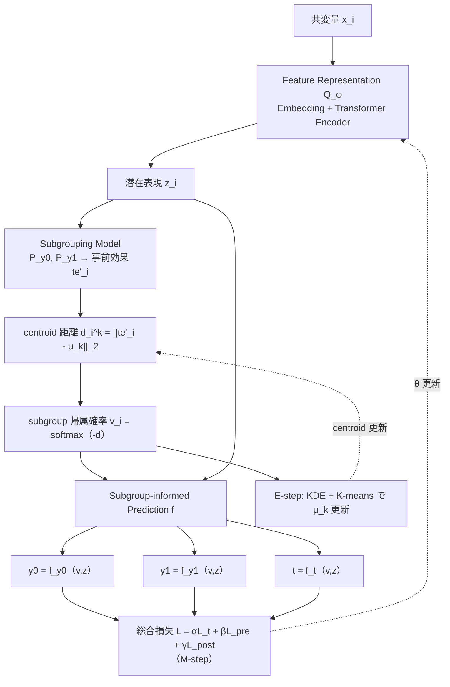

# SubgroupTE: Advancing Treatment Effect Estimation with Subgroup Identification

- **Link**: https://arxiv.org/abs/2401.12369 / https://arxiv.org/html/2401.12369v1
- **Authors**: Seungyeon Lee, Ruoqi Liu, Wenyu Song, Lang Li, Ping Zhang
- **Year**: 2024 (arXiv 初出 2024-01-22) / 正式掲載 2025
- **Venue**: ACM Transactions on Intelligent Systems and Technology (ACM TIST), 2025 掲載（DOI: 10.1145/3718097）。arXiv カテゴリは cs.LG。
- **Type**: 研究論文（causal ML / heterogeneous treatment effect estimation + subgroup identification）

---

## Abstract (English)

> Precise estimation of treatment effects is crucial for evaluating intervention effectiveness. While deep learning models have exhibited promising performance in learning counterfactual representations for treatment effect estimation (TEE), a major limitation in most of these models is that they treat the entire population as a homogeneous group, overlooking the diversity of treatment effects across potential subgroups that have varying treatment effects. This limitation restricts the ability to precisely estimate treatment effects and provide subgroup-specific treatment recommendations. In this paper, we propose a novel treatment effect estimation model, named SubgroupTE, which incorporates subgroup identification in TEE. SubgroupTE identifies heterogeneous subgroups with different treatment responses and more precisely estimates treatment effects by considering subgroup-specific causal effects. In addition, SubgroupTE iteratively optimizes subgrouping and treatment effect estimation networks to enhance both estimation and subgroup identification. Comprehensive experiments on the synthetic and semi-synthetic datasets exhibit the outstanding performance of SubgroupTE compared with the state-of-the-art models on treatment effect estimation. Additionally, a real-world study demonstrates the capabilities of SubgroupTE in enhancing personalized treatment recommendations for patients with opioid use disorder (OUD) by advancing treatment effect estimation with subgroup identification.

## Abstract (日本語訳)

> 介入の有効性を評価するうえで、treatment effect（処置効果）の正確な推定は極めて重要である。深層学習モデルは、treatment effect estimation (TEE) のための反事実表現の学習において有望な性能を示してきたが、これらのモデルの多くに共通する大きな限界は、母集団全体を homogeneous（均質）な一つの集団として扱い、処置効果が異なりうる潜在的な subgroup 間の多様性を見落としている点にある。この限界は、処置効果を正確に推定し、subgroup ごとの処置推奨を提供する能力を制約する。本論文では、TEE に subgroup identification を組み込んだ新しい処置効果推定モデル SubgroupTE を提案する。SubgroupTE は、異なる処置反応を持つ heterogeneous な subgroup を identify し、subgroup 固有の因果効果を考慮することで処置効果をより正確に推定する。さらに SubgroupTE は、subgrouping ネットワークと treatment effect estimation ネットワークを反復的に最適化することで、推定と subgroup identification の双方を強化する。synthetic および semi-synthetic データセットでの包括的な実験により、SubgroupTE が処置効果推定において最先端モデルを上回る優れた性能を示すことが確認された。加えて、実世界研究では、オピオイド使用障害 (OUD) 患者に対する個別化処置推奨を、subgroup identification を伴う処置効果推定の高度化を通じて向上させる能力が実証された。

---

## Overview（概要）

SubgroupTE は、**処置効果の推定 (TEE)** と **異質な subgroup の同定 (subgroup identification)** を単一のフレームワークで**同時かつ反復的に**学習する深層モデルである。従来の TEE モデル（TARNet, DragonNet, VCNet, TransTEE 等）は母集団を均質とみなし、各個体に対して条件付き平均処置効果 (CATE) を回帰するが、「効果の大きさ・向きが似た個体の塊（subgroup）」という構造を明示的にモデル化しない。SubgroupTE はこの構造を陽に取り込み、

1. Transformer による特徴表現、
2. 事前推定した処置効果に基づく **subgroup への soft/hard 割り当て**、
3. subgroup 情報を条件として与えた最終的な outcome / treatment 予測、

の 3 ネットワークを **EM 型の反復最適化**で交互に更新する。これにより「subgroup 内では効果が同質・subgroup 間では効果が異質」な分割を獲得し、subgroup 単位で効果を安定的に推定できる。

---

## Problem（課題）

- 既存の deep TEE モデルは母集団を **homogeneous な単一集団**として扱い、subgroup 間の効果の多様性（heterogeneity）を見落とす。
- そのため、効果が高い／低い個体群の**識別**と、それに基づく **subgroup 固有の処置推奨**ができない。
- subgroup を「先に一度だけ決めて固定する」素朴な方法では、効果推定の改善が subgroup 分割にフィードバックされず、両者が相互に最適化されない。
- 医療・介入現場では「どのような患者層で効果が高いか」という**解釈可能で転移可能な subgroup 知識**が求められるが、個体単位の CATE だけでは提供が難しい。

---

## Proposed Method（提案手法）

### コアアイデア

**「処置効果を事前推定 → 近い効果を持つ個体を subgroup にクラスタリング → subgroup 情報を条件として効果を再推定」** というループを EM 的に回すことで、効果推定と subgroup 分割を相互強化する。

### 構成ネットワーク（3 つ）

1. **Feature Representation Network $Q_\phi$**: Embedding 層 + Transformer encoder で共変量 $x_i$ を潜在表現 $z_i$ に変換。
2. **Subgrouping Model**: $P_{y_0}, P_{y_1}$ で outcome を事前推定し、そこから事前処置効果 $te'_i$ を算出。$te'_i$ を $K$ 個の centroid $\mu_k$ に対する距離で subgroup 確率に変換。
3. **Subgroup-informed Prediction Network $f$**: subgroup 割り当て $v_i$ と表現 $z_i$ を入力に、対照 outcome $y_{0}$・処置 outcome $y_{1}$・treatment 確率 $t$ の 3 分岐を出力。

### 手順（numbered steps）

1. 共変量 $x_i$ を $z_i = Q_\phi(x_i)$ で符号化する。
2. $P_{y_0}, P_{y_1}$ で事前 outcome を推定し、事前処置効果 $te'_i = P_{y_1}(z_i) - P_{y_0}(z_i)$ を得る。
3. 各 centroid $\mu_k$ との Euclidean 距離 $d_i^k$ を計算し、softmax で subgroup 帰属確率 $v_{i,k}$ を得る。
4. subgroup 割り当て $v_i$ と $z_i$ を条件に、$y_0, y_1, t$ を予測する（**M-step**: ネットワーク更新）。
5. Kernel Density Estimation を用いて centroid $\mu_k$ を再調整し、K-means 的に subgroup を更新する（**E-step**: 割り当て更新）。
6. 3〜5 を収束まで反復する。

### Key Formulas（LaTeX）

特徴表現（Eq. 1）:
$$ z_i = Q_\phi(x_i) = \mathrm{Transformer\_Encoder}(\mathrm{Embedding}(x_i)) $$

事前処置効果と centroid 距離（Eq. 2）:
$$ d_i^k = \lVert te'_i - \mu_k \rVert_2 $$

subgroup 帰属確率（Eq. 3, softmax）:
$$ v_{i,k} = \frac{\exp(-d_i^k)}{\sum_{j} \exp(-d_i^j)} $$

subgroup 条件付き予測（Eq. 4–6）:
$$ y_{0,i} = f_{y_0}(v_i, z_i), \qquad y_{1,i} = f_{y_1}(v_i, z_i), \qquad t_i = f_t(v_i, z_i) $$

centroid 調整（E-step, Eq. 8）:
$$ \mu_k^{*} = \mu_k + \mathrm{Diff}(te', \mu_k) $$

総合損失（M-step, Eq. 13）:
$$ \mathcal{L} = \alpha \cdot \mathcal{L}_t + \beta \cdot \mathcal{L}_{y_{pre}} + \gamma \cdot \mathcal{L}_{y_{post}} $$

ここで $\mathcal{L}_t$ は treatment 予測の binary cross-entropy、$\mathcal{L}_{y_{pre}}, \mathcal{L}_{y_{post}}$ はそれぞれ subgrouping 前・後の outcome 予測に対する MSE。

### 前提（識別可能性の仮定）

- **Conditional Independence（unconfoundedness）**: $Y(0), Y(1) \perp T \mid X$
- **Positivity / Overlap**: $0 < \pi(t \mid x) < 1$
- **SUTVA**（Stable Unit Treatment Value Assumption）

---

## Algorithm（擬似コード / Pseudocode）

```
Input:  共変量 X, 処置 T, outcome Y, subgroup 数 K, 重み α, β, γ
Output: 学習済み Q_φ, Subgrouping model, Prediction network f, centroids {μ_k}

1: {μ_k} を K-means などで初期化
2: repeat  # EM 反復
3:   # ---- 事前推定 & subgroup 割り当て ----
4:   for 各サンプル i:
5:       z_i        ← Q_φ(x_i)                          # Eq.1
6:       te'_i      ← P_{y1}(z_i) - P_{y0}(z_i)         # 事前処置効果
7:       d_i^k      ← ||te'_i - μ_k||_2  for all k      # Eq.2
8:       v_{i,·}    ← softmax(-d_i^·)                   # Eq.3 (soft assignment)
9:
10:  # ---- M-step: ネットワーク更新 ----
11:  y0,i, y1,i, t_i ← f(v_i, z_i)                      # Eq.4-6
12:  L ← α·L_t + β·L_{y_pre} + γ·L_{y_post}             # Eq.13
13:  θ ← θ - η ∇L   # Q_φ, P, f を勾配降下で更新
14:
15:  # ---- E-step: centroid / 割り当て更新 ----
16:  KDE により μ_k を調整 μ_k* ← μ_k + Diff(te', μ_k)   # Eq.8
17:  hard assignment v'_{i,j} を計算                     # Eq.9
18:  K-means で centroid μ_k を更新                       # Eq.12
19: until 収束
20: return 学習済みモデルと {μ_k}
```

---

## Architecture / Process Flow



---

## Figures & Tables

> 以下の画像 URL は arXiv HTML (`https://arxiv.org/html/2401.12369v1`) の `` の `src` で実在を確認したもの。相対パスは `https://arxiv.org/html/2401.12369v1/` を基準とする。

**Figure 1 — Model Overview（アーキテクチャ図）**
`https://arxiv.org/html/2401.12369v1/extracted/5362697/fig/model.png`
（3 ネットワーク（$Q_\phi$ / Subgrouping / Prediction）と EM 反復の全体構成）

その他の図（HTML で確認した src）:
- Figure 2 Sensitivity Analysis: `.../extracted/5362697/fig/sens.png`
- Figure 3 Treatment Distribution: `.../extracted/5362697/fig/boxplot.png`
- Figure 4 Training Trends: `.../extracted/5362697/fig/loss.png`
- Figure 5 Study Design: `.../extracted/5362697/fig/study_design.png`
- Figure 6 OUD Boxplots: `.../extracted/5362697/fig/boxplot2.png`
- Figure 7 Subgroup Heatmap: `.../extracted/5362697/fig/heatmap.png`

### Table 3 — 処置効果推定（Synthetic / Semi-synthetic）主要結果

PEHE↓・εATE↓（小さいほど良い）。値は平均±標準偏差。

| Model | Synthetic PEHE | Synthetic εATE | Semi-synthetic PEHE | Semi-synthetic εATE |
|-------|---|---|---|---|
| RF | 0.086±0.000 | 0.039±0.000 | 0.179±0.000 | 0.095±0.020 |
| SVR | 0.103±0.000 | 0.029±0.000 | 0.198±0.000 | 0.112±0.023 |
| DragonNet | 0.081±0.013 | 0.016±0.013 | 0.105±0.037 | 0.040±0.010 |
| TARNet | 0.068±0.010 | 0.023±0.003 | 0.092±0.019 | 0.039±0.010 |
| VCNet | 0.034±0.005 | 0.018±0.010 | 0.080±0.031 | 0.065±0.049 |
| TransTEE | 0.045±0.046 | 0.026±0.055 | 0.099±0.071 | 0.153±0.046 |
| **SubgroupTE** | **0.024±0.002** | **0.014±0.009** | **0.056±0.018** | **0.039±0.037** |

SubgroupTE は semi-synthetic PEHE で次点モデルに対し **30.0% の改善**を達成（本文記載）。

### Table 4 — Subgroup Identification（Semi-synthetic, 手法比較）

V_within↓（subgroup 内分散：小さいほど良い）・V_across↑（subgroup 間分散：大きいほど良い）・PEHE↓。

| Model | V_within↓ | V_across↑ | PEHE↓ |
|-------|---|---|---|
| R2P | 0.500±0.15 | 0.643±0.13 | 0.154±0.05 |
| HEMM | 0.570±0.11 | 0.591±0.15 | 0.172±0.00 |
| **SubgroupTE** | **0.393±0.02** | **0.901±0.01** | **0.056±0.02** |

### Table 5 — Ablation Study（Semi-synthetic）

| 変種 | V_within↓ | V_across↑ | PEHE↓ |
|-------|---|---|---|
| SubgroupTE-O（事前学習→固定） | 0.452±0.00 | 0.854±0.00 | 0.063±0.00 |
| SubgroupTE-P（反復・pre のみ） | 0.453±0.01 | 0.878±0.01 | 0.060±0.01 |
| **SubgroupTE（full EM-based）** | **0.393±0.02** | **0.901±0.01** | **0.056±0.02** |

反復的 EM 最適化が、一度きりの事前推定型を全指標で上回ることを示す。

---

## Experiments & Evaluation（実験と評価）

### Setup（実験設定）

- **データ**: synthetic データセット、semi-synthetic データセット（TEE 分野で標準的に用いられる形式）、および実世界の医療データ（MarketScan CCAE, 2012–2017）。
- **比較手法**: RF, SVR, DragonNet, TARNet, VCNet, TransTEE（TEE）と、R2P・HEMM（subgroup identification）。
- **評価指標**:
  - **PEHE**（Eq. 14, Precision in Heterogeneous Effect Estimation, 小さいほど良い）
  - **εATE**（Eq. 15, 平均処置効果の絶対誤差, 小さいほど良い）
  - **V_across**（Eq. 16, subgroup 間分散, 大きいほど良い＝subgroup がよく分離）
  - **V_within**（Eq. 17, subgroup 内分散, 小さいほど良い＝subgroup 内が同質）

### Main Results（主要結果・数値付き）

- 処置効果推定（Table 3）: SubgroupTE が synthetic PEHE **0.024**、semi-synthetic PEHE **0.056** で全ベースライン中最良。semi-synthetic PEHE で次点比 **30.0% 改善**。
- subgroup 同定（Table 4）: V_within **0.393**（最小）・V_across **0.901**（最大）で、R2P/HEMM を上回り、「subgroup 内は同質・subgroup 間は異質」を最もよく実現。

### Ablation（アブレーション）

- Table 5 の通り、full EM 版（V_within 0.393 / V_across 0.901 / PEHE 0.056）が、事前学習して固定する SubgroupTE-O（0.452 / 0.854 / 0.063）および反復だが pre のみの SubgroupTE-P（0.453 / 0.878 / 0.060）を全指標で上回る。**subgroup 分割と効果推定の相互最適化**が寄与要素であると裏付けられる。

### Real-World Study（OUD 事例）

- MarketScan CCAE（2012–2017）から約 **2,893 名**の患者。処置: Naltrexone（n=756） vs. 対照: Methadone/Buprenorphine（n=2,137）。outcome は OUD 関連有害事象。共変量は 286 の診断コード (CCS) と 1,353 の薬剤 (OMOP)。
- 3 つの subgroup を同定: (1) Naltrexone 効果が減弱、(2) ほぼゼロ効果、(3) 効果が増強（より若年・女性が多い層）。個別化処置推奨への活用可能性を実証。

---

## 本テーマへの適用可能性

**想定シナリオ**: データサイエンティストが**低頻度（infrequent）で実施されるマーケティングキャンペーン**を運用し、処置効果（uplift）が高い／均質な subgroup を発見して、似たユーザーをグループ化し効果を安定推定・転移したい。

SubgroupTE の設計は、この uplift marketing の課題に直接対応する。

- **subgroup を「効果空間」で切る発想がそのまま使える**: 本手法は共変量空間ではなく **事前推定した処置効果 $te'_i$ の空間**で centroid クラスタリングを行う（Eq. 2–3）。マーケティングでは「デモグラフィックが似ている」より「**uplift の大きさ・向きが似ている**」ことが重要なので、この効果ベースの分割はキャンペーン設計と親和性が高い。得られた subgroup は「反応が強い層／無反応層／逆効果層（sleeping dogs）」として解釈でき、キャンペーン対象の選別（targeting）にそのまま転用できる。

- **低頻度キャンペーンでの「効果の安定推定・転移」**: キャンペーンが稀にしか打てず、個体単位の CATE 推定はサンプル不足で不安定になりがちである。SubgroupTE は個体を subgroup に束ねることで、**subgroup 単位で効果を集約推定**でき（V_within を小さく保つ制約が効く）、少数の観測を similar user 間でプールして分散を下げられる。新規キャンペーンや新規ユーザーに対しても、centroid への距離（Eq. 2）で subgroup を割り当てれば、過去に推定した subgroup 効果を**転移**して初期見積りに使える。

- **V_within / V_across がそのまま運用 KPI になる**: subgroup 内効果が同質（V_within 小）であれば「その subgroup には一律の施策でよい」と正当化でき、subgroup 間が分離（V_across 大）していれば「施策を出し分ける価値がある」ことの定量的根拠になる。マーケティング予算配分の意思決定指標として直接使える。

- **EM 反復＝「実測でグルーピングを更新」に対応**: キャンペーンを打つたびに得られる実測反応で E-step（centroid 更新）を回し、subgroup 定義を継続的にリファインできる。低頻度でも、キャンペーン実施ごとにグルーピングが洗練されていく運用に馴染む。

- **導入時の留意点**:
  - 前提の **unconfoundedness / overlap** は観察データ主体のマーケティングでは崩れやすい。ランダム化（A/B）や傾向スコア調整で overlap を担保する必要がある。
  - subgroup 数 $K$ はハイパーパラメータであり、ビジネス上の運用可能なセグメント数（施策を出し分けられる数）に合わせて選ぶのが実務的。
  - outcome は本論文では医療イベントだが、マーケティングでは購入・解約・LTV など連続／二値 outcome に置き換え可能（$\mathcal{L}_{y}$ を MSE / BCE に選ぶ設計はそのまま使える）。
  - Transformer encoder は高次元・系列的なユーザー行動ログ（購買履歴・イベント列）に適合しやすく、テーブルデータのみなら軽量エンコーダに差し替えても枠組みは維持される。

まとめると、SubgroupTE は「**効果が似たユーザーを効果空間でグループ化し、subgroup 単位で uplift を同質・安定に推定し、新規対象へ転移する**」という本テーマの要求をほぼ直接満たすフレームワークであり、uplift modeling における segment-level targeting の設計図として有用である。

---

## Notes（備考）

- arXiv abs ページの要約は自動抽出時に paraphrase されていたため、Abstract (English) は arXiv v1 ページから逐語取得した本文で記載した。
- 正式掲載先は **ACM Transactions on Intelligent Systems and Technology (2025, DOI: 10.1145/3718097)**。arXiv 初出は 2024-01-22。PubMed/PMC にも収録（PMC12199269）。
- コード公開: https://github.com/yeon-lab/SubgroupTE
- 図の image URL は arXiv HTML の ``（`extracted/5362697/fig/*.png`）で実在を確認済み。各図の中身の詳細数値は本レポートでは検証していない。
- 数式番号（Eq. 8–17）は HTML fetch で確認した対応関係に基づくが、E-step の Diff() の厳密な定義式・KDE の帯域幅などの細部、および Eq. 9–12 の完全な式形は本レポートでは逐語再現していない（原論文本文参照）。
- 実世界研究の subgroup ごとの具体的な効果量（数値）は本文中に明示的な表がなく、傾向記述（減弱／ゼロ／増強）のみ確認。定量値は **記載なし**として扱う。
