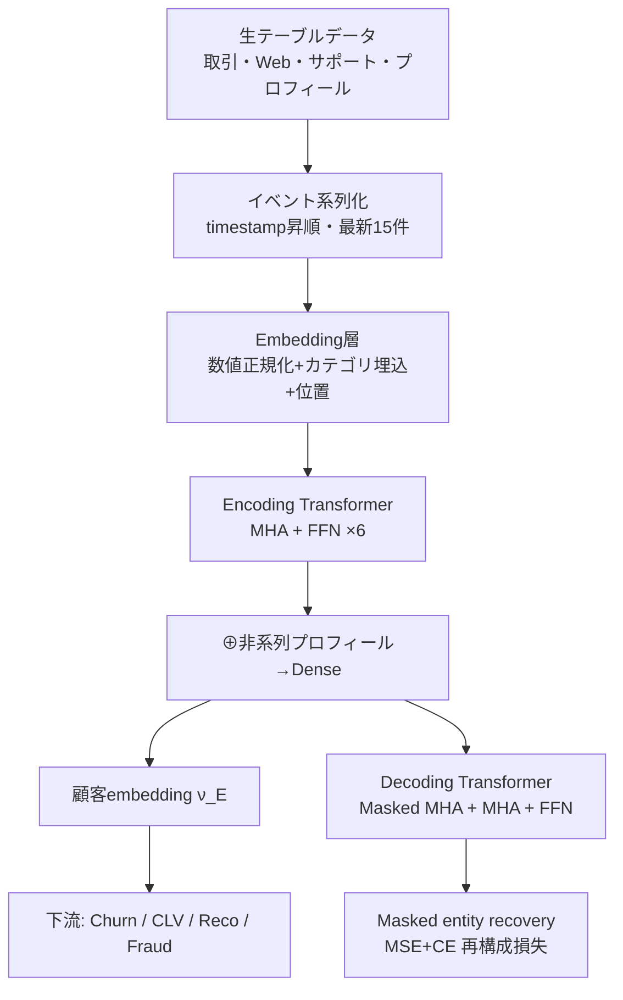

# CASPR: Customer Activity Sequence-based Prediction and Representation

- **Link**: https://arxiv.org/abs/2211.09174 （PDF: https://arxiv.org/pdf/2211.09174 / ワークショップ版 PDF: https://table-representation-learning.github.io/assets/papers/caspr_customer_activity_sequen.pdf）
- **Authors**: Pin-Jung Chen, Sahil Bhatnagar, Sagar Goyal, Damian Konrad Kowalczyk, Mayank Shrivastava（いずれも Microsoft Corporation）
- **Year**: 2022（arXiv 投稿 2022-11-16）
- **Venue**: Table Representation Learning Workshop at NeurIPS 2022（New Orleans）
- **Type**: ワークショップ論文（産業応用・表現学習 / customer embedding）

---

## Abstract（English, 原文引用）

> Tasks critical to enterprise profitability, such as customer churn prediction, fraudulent account detection or customer lifetime value estimation, are often tackled by models trained on features engineered from customer data in tabular format. Application-specific feature engineering adds development, operationalization and maintenance costs over time. Recent advances in representation learning present an opportunity to simplify and generalize feature engineering across applications. Application of these advancements to tabular data faces challenges such as data heterogeneity, variations in customer engagement history and the sheer volume of enterprise data. In this paper, we propose a novel approach to encode tabular data containing customer transactions, purchase history and other interactions into a generic representation of a customer's association with the business. We then evaluate these embeddings as features to train multiple models spanning a variety of applications. CASPR, Customer Activity Sequence-based Prediction and Representation, applies Transformer architecture to encode activity sequences to improve model performance and avoid bespoke feature engineering across applications. Our experiments at scale validate CASPR for both small & large enterprise applications.

---

## Abstract（日本語訳）

チャーン予測・不正アカウント検知・顧客生涯価値（CLV）推定といった企業収益に直結するタスクは、通常テーブル形式の顧客データから手作業で特徴量を設計してモデルを訓練する。しかしアプリケーション固有の特徴量エンジニアリングは、開発・運用・保守のコストを継続的に増大させる。近年の表現学習の進展は、この特徴量設計を単純化・汎化する機会を提供する。ただしテーブルデータへの適用には、データの異質性・顧客ごとのエンゲージメント履歴の差異・エンタープライズデータの膨大さといった課題がある。本論文は、顧客の取引・購買履歴・その他インタラクションを含むテーブルデータを、その顧客と事業との関係を表す汎用的な表現へエンコードする新手法を提案する。得られた embedding を特徴量として複数アプリケーション向けのモデルを訓練し評価する。CASPR（Customer Activity Sequence-based Prediction and Representation）は Transformer アーキテクチャを活動系列のエンコードに適用し、アプリケーション横断で個別の特徴量設計を不要にしつつモデル性能を向上させる。大規模実験により、小・大両方のエンタープライズ用途で CASPR の有効性を検証する。

---

## Overview（概要）

CASPR は、企業が保有するテーブル形式の顧客データ（取引ログ・Web 行動・サポート問い合わせ・プロフィール等）を、各顧客につき 1 本の「活動系列（activity sequence）」へ変換し、Transformer の encoder-decoder を用いて自己教師あり（self-supervised）に汎用的な顧客 embedding $\nu_E$ を学習するフレームワークである。設計思想は BERT に近く、「顧客ジャーニー = 文」「1 イベント = 単語」というアナロジーで、masked entity recovery（マスクしたイベントの復元）を事前学習タスクとする。一度事前学習すれば、その embedding をチャーン予測・CLV 推定・商品レコメンド・不正検知など多様な下流タスクへ再利用でき、タスク固有の特徴量設計を削減できる点が中核的な価値である。実験では 6 つのデータセット（公開 3・Microsoft 内部 2・パートナー 1）で GBDT / random forest / LightGBM / 協調フィルタリング（ALS）ベースラインと比較し、多くのタスクで一貫した改善を示す。さらに Spark+Horovod / PyTorch DDP など 4 種の分散環境でスケール学習のコスト効率を評価している。

---

## Problem（解こうとしている課題）

- **タスク固有特徴量の高コスト**: チャーン・CLV・不正検知など各タスクごとに手作りの RFM 特徴量やエンジニアリングが必要で、開発・運用・保守が重い。
- **タスク間の非転移性**: あるタスク（例: チャーン）向けに作った特徴量表現が別タスク（例: レコメンド）に転用できず、都度作り直しが必要。
- **テーブルデータ × 深層学習の難しさ**: 画像・テキストと異なり、テーブルデータでは依然として GBDT 等の木構造アンサンブルが支配的で、深層表現学習が効きにくい。
- **データの異質性・履歴長のばらつき**: 顧客ごとにイベント数・エンゲージメント履歴が大きく異なる。
- **エンタープライズ規模**: 数百万〜数千万顧客のデータを扱う際の分散学習・運用のスケーラビリティとコスト。

---

## Proposed Method（提案手法）

### コアアイデア

各顧客（entity）$E$ の全インタラクション行を timestamp 順に並べた活動系列に変換し、Transformer encoder-decoder を masked entity recovery で自己教師あり学習することで、その顧客を要約する潜在ベクトル $\nu_E$ を生成する。数値属性・カテゴリ属性・（プロフィール等の）非系列属性を統合的に扱う。

### 手順（番号付き）

1. **系列化**: テーブル $D$ の各行 $A$ を entity $E$・timestamp $T$・属性集合 $\{A_1,\dots,A_N\}$ の組 $A^{TE}=\{E,T,A_1,\dots,A_N\}$ とみなす。各 $E$ ごとに時刻順の部分系列 $D_E=(A^1_E, A^2_E, \dots, A^t_E)$ を生成。系列長の上限を $t$ に固定し、超過分は最新 $t$ 件のみ残す（実験では $t=15$）。
2. **埋め込み**: カテゴリ属性を学習可能な embedding 層で次元 $d=\sqrt{\mathrm{cardinality}(C)}$ のベクトルへ変換。数値属性は標準正規分布へ正規化。位置 $i$ と数値・カテゴリ表現を連結して $A'^i_E = \mathrm{concat}(i, A^i_{E,\text{numerical}}, A^i_{E,\text{categorical}})$ を作る。
3. **Transformer encoder**: multi-head scaled dot-product attention で系列をエンコード。encoder 出力に非系列ベクトル $A_{E,\text{non-sequential}}$（年齢・在籍・ステータス等のプロフィール）を連結し dense 層を通して最終 encoder 出力（= embedding）を得る。
4. **Transformer decoder**: encoder とほぼ同型だが、位置 $i$ より後を隠す masked multi-head attention 層を追加し、autoregressive 性を担保（次イベント予測＝次単語予測に相当）。
5. **事前学習（masked entity recovery）**: 入力系列の 30% をゼロベクトルでランダムにマスクし、decoder 出力と元系列の再構成損失を最小化。数値属性は MSE、カテゴリ属性は cross-entropy。
6. **下流利用**: 学習済み embedding $\nu_E$ を特徴量として random forest / LightGBM / ALS 等に投入。RFM 特徴量との連結も可能。事前学習は各データセットで一度だけ行い、embedding を複数タスクで再利用。

### Key Formulas（LaTeX）

Multi-head attention（Vaswani et al. 2017 を踏襲, 式 1–3）:

$$\mathrm{MultiHead}(h) = \mathrm{concat}(\mathrm{head}_1, \dots, \mathrm{head}_n) W^O$$

$$\mathrm{head}_i = \mathrm{Attention}(h W_i^Q, h W_i^K, h W_i^V)$$

$$\mathrm{Attention}(Q, K, V) = \mathrm{softmax}\!\left(\frac{Q K^{T}}{\sqrt{d_k}}\right) V$$

入力トークン表現（位置・数値・カテゴリの連結）:

$$A'^i_E = \mathrm{concat}\big(i,\; A^i_{E,\text{numerical}},\; A^i_{E,\text{categorical}}\big)$$

カテゴリ埋め込み次元:

$$d = \sqrt{\mathrm{cardinality}(C)}$$

事前学習損失（再構成、概念式）: マスク位置について数値属性は MSE、カテゴリ属性は cross-entropy の和を最小化。

$$\mathcal{L}_{\text{recon}} = \sum_{\text{masked}} \Big( \mathrm{MSE}(\hat{A}_{\text{num}}, A_{\text{num}}) + \mathrm{CE}(\hat{A}_{\text{cat}}, A_{\text{cat}}) \Big)$$

---

## Algorithm（擬似コード）

```
# 事前学習（masked entity recovery）
入力: テーブルデータ D, 系列上限 t=15, マスク率 0.30
1. for each entity E in D:
2.     D_E <- rows(E) を timestamp T 昇順にソート
3.     D_E <- 最新 t 件に truncate
4.     for each row A in D_E:
5.         cat_emb  <- EmbeddingLayer(categorical(A))
6.         num_vec  <- normalize(numerical(A))      # 標準正規
7.         x_i      <- concat(pos_i, num_vec, cat_emb)
8.     X_E <- (x_1, ..., x_t)
9. repeat until 収束:
10.    batch <- sample(entities)
11.    X_masked <- randomly zero-out 30% of tokens in each X_E
12.    Z  <- TransformerEncoder(X_masked) ⊕ dense(non_sequential(E))
13.    R  <- TransformerDecoder(Z)         # masked (autoregressive)
14.    loss <- MSE(R_num, X_num) + CE(R_cat, X_cat)  # マスク位置
15.    Adam.step(loss)   # lr=1e-3
16. ν_E <- Encoder 出力（顧客 embedding）

# 下流タスク
17. features <- ν_E  (任意で ⊕ RFM 特徴量)
18. downstream_model.fit(features, labels)  # RF / LightGBM / ALS 等
```

ハイパーパラメータ: hidden size 16、position-wise FFN 次元 32、層数 6、self-attention head 数 8、dropout 0.1、Adam（初期 lr 1e-3）、系列長上限 15。

---

## Architecture / Process Flow

```
 生テーブル(取引/Web行動/サポート/プロフィール)
        │  行 → イベント化・時刻順に系列化
        ▼
 [Embedding層]  数値=正規化 / カテゴリ=学習埋め込み  (+ 位置)
        │
        ▼
 ┌──────────── Encoding Transformer (N×) ────────────┐
 │  Multi-head attention → Feed forward              │
 └───────────────────────────────────────────────────┘
        │  ⊕ 非系列プロフィール → Dense
        ▼
   Encoded embedding  ν_E  ──────────────► 下流タスク特徴量
        │                                   (Churn / CLV / Reco / Fraud)
        ▼
 ┌──────────── Decoding Transformer (M×) ────────────┐
 │  Masked MHA → MHA(enc出力) → Feed forward         │
 └───────────────────────────────────────────────────┘
        │
        ▼
   Masked entity recovery（再構成損失で事前学習）
```



---

## Figures & Tables（MANDATORY ≥4）

> 注: 本論文は arXiv HTML 版が提供されていない（HTTP 404）ため、図の外部 `` URL は確認できなかった（記載なし）。以下は PDF 本文から抽出した図表の内容・正確な数値である。

### 図1（Figure 1）: CASPR 全体アーキテクチャ図
- 内容: 生テーブル顧客データ（Web Activity / Website Visit / Store Purchase / Support Call / Return / Profile / Subscription / Transactions）→ Feature Transformation → CASPR Transformer → 各顧客の潜在ベクトル表現。business model は RFM 特徴量・CASPR embedding・両者の組合せのいずれも利用可能、と明記。画像 URL: 記載なし（HTML 版なし）。

### 図2（Figure 2）: CASPR Transformer ブロック
- 内容: Sequential Feature row と Non sequential Feature row を入力。Encoding Transformer（Multi-head attention → Feed forward, N×）→ Encoded embedding representation。Decoding Transformer（Masked Multi-head attention → Multi-head attention → Feed forward, M×）→ Masked entity recovery で事前学習。画像 URL: 記載なし。

### 表4（Table 4）: チャーン予測への CASPR の効果【主要結果】

| Dataset | Representation | AUROC | F1 |
|---|---|---|---|
| KKBox | Baseline | 0.89 | 0.27 |
| KKBox | **CASPR** | **0.91** | **0.44** |
| Google Online Stores | Baseline | 0.897 | 0.96 |
| Google Online Stores | CASPR | 0.903 | 0.96 |
| Microsoft Retail Stores | Baseline | 0.761 | 0.814 |
| Microsoft Retail Stores | CASPR | 0.777 | 0.831 |
| Microsoft Retail Stores | **CASPR w/RFM features** | **0.794** | **0.837** |

（KKBox で AUROC +2 点・F1 は 0.27→0.44 と大幅改善。Google Online Stores は平均活動履歴 1.5 と疎で改善が乏しい。）

### 表5（Table 5）: CLV 予測への CASPR の効果

| Task | Dataset | Representation | AUROC | RMSE |
|---|---|---|---|---|
| Customer Lifetime Value | Microsoft Retail Stores | Baseline | 0.659 | 1108 |
| Customer Lifetime Value | Microsoft Retail Stores | **CASPR** | **0.685** | **1103** |

（AUROC は Pareto 原理で高/低価値顧客に分けたセグメントラベルで算出。約 +2.5 点改善。）

### 表6（Table 6）: 不正アカウント検知への効果

| Dataset | Representation | AUROC |
|---|---|---|
| Online fantasy sports platform | Baseline | 0.811 |
| Online fantasy sports platform | **CASPR** | **0.883** |
| Microsoft Accounts Data | Baseline | 0.873 |
| Microsoft Accounts Data | **CASPR** | **0.895** |

### 表7（Table 7）: 商品レコメンドのランキング性能【手法比較】

| Dataset | Representation | MAP | Prec@1 | Success@5 | NDCG@3 |
|---|---|---|---|---|---|
| Instacart | Baseline (ALS) | 0.21 | 0.32 | 0.61 | 0.28 |
| Instacart | **CASPR** | **0.46** | **0.62** | **1.46** | **0.56** |
| Microsoft Retail Stores | Baseline | 0.13 | 0.09 | 0.24 | 0.11 |
| Microsoft Retail Stores | **CASPR** | **0.14** | **0.10** | **0.27** | **0.12** |

（Instacart は平均 20 件超の長い購買履歴を持ち、系列モデルの効果が顕著。）

### 表1（Table 1）: 使用データセット（プライバシー保護のため丸め）

| Dataset | Size (# unique customers) | Source |
|---|---|---|
| KKBox | ∼1 million | public |
| Instacart | ∼100k | public |
| Google Online stores | ∼1 million | public |
| Microsoft Retail Stores | ∼10 million | proprietary |
| Microsoft Accounts | ∼1 million | proprietary |
| Online fantasy sports platform | ∼1 million | proprietary（約 4% が不正ラベル） |

### 表8（Table 8, Appendix）: 分散学習コスト（KKBox, 10 epoch, batch 8192）【ablation 相当】

| Environment | GPUs | training time (s) | epoch time (s) | GPU time (s) |
|---|---|---|---|---|
| Spark V100 | 4 | 218.64 | 21.86 | 1093.21 |
| HVD V100 | 4 | 182.31 | 18.23 | 729.22 |
| DDP V100 | 4 | 114.02 | 11.40 | 456.10 |
| DDP K80 | 4 | 313.07 | 31.31 | 1252.27 |

（DDP V100 が最も効率的。Spark→DDP で約 4x コスト削減、Kepler(K80)→Volta(V100) で 3〜4x 高速化、HVD は Spark 比 20% コスト減。）

---

## Experiments & Evaluation

### Setup
- **データセット**: KKBox（音楽サブスク, 公開, 平均活動履歴 15）、Google Online Stores（Kaggle, 平均活動 1.5 と疎）、Instacart（Kaggle, 平均 20 件超）、Microsoft Retail Stores / Accounts（内部）、Online fantasy sports platform（パートナー, 約 4% fraud）。
- **モデル設定**: encoder-decoder Transformer、hidden 16 / FFN 32 / 6 層 / 8 head / dropout 0.1、Adam lr 1e-3、系列長上限 15。
- **ベースライン**: チャーン・CLV は 100 本の random forest + RFM 特徴量（表2 の recency/frequency/monetary 統計）。不正検知は LightGBM + 集約統計特徴量。レコメンドは ALS（協調フィルタリング）。CASPR は同じハイパラのモデルに embedding を投入（RFM との連結版も評価）。
- **指標**: 分類 = AUROC（チャーンは F1 も）、回帰(CLV) = RMSE + セグメント AUROC、ランキング = MAP / Prec@1 / Success@5 / NDCG@3。

### Main Results（正確な数値）
- チャーン: KKBox AUROC 0.89→0.91、F1 0.27→0.44。Microsoft Retail 0.761→0.777（+RFM で 0.794）。Google Online Stores は 0.897→0.903 とほぼ改善なし（履歴が疎なため）。
- CLV: Microsoft Retail AUROC 0.659→0.685、RMSE 1108→1103。
- 不正検知: fantasy sports 0.811→0.883、Microsoft Accounts 0.873→0.895。
- レコメンド: Instacart MAP 0.21→0.46、NDCG@3 0.28→0.56 と大幅改善。

### Ablation / 追加分析
- **データ密度の影響**: 系列が長い（KKBox 15, Instacart 20+）ほど改善が大きく、疎な Google Online Stores（1.5）では効果が乏しい。系列モデルの本質的特性を示す。
- **RFM 連結**: CASPR embedding に RFM 特徴量を連結すると Microsoft Retail でさらに改善（AUROC 0.777→0.794）。embedding と手作り特徴の相補性を示唆。
- **スケール学習**: 4 分散環境比較（表8）で PyTorch DDP + Volta が最良。Spark→DDP で 4x コスト削減。

---

## 本テーマへの適用可能性（customer/campaign similarity for pooling/transfer）

本テーマ（マーケ施策を稀にしか打たないデータサイエンティストが、行動ベースの顧客セグメンテーション / 顧客 embedding を用いて「似たユーザー・似たキャンペーン」を定義し、類似クラスタ間で効果をプール/転移したい）に対し、CASPR は **顧客 embedding の生成基盤**として直接的に有用である。

- **顧客類似度の定義**: CASPR の $\nu_E$ は取引・Web 行動・サポート等の全インタラクションを 1 本の系列から自己教師ありに要約するため、RFM 3 次元よりはるかに豊かな「行動的類似度」を与える。$\nu_E$ 間のコサイン類似度や、$\nu_E$ を K-means / GMM でクラスタリングすれば、施策効果をプールすべき「似たユーザー群」を定義できる。稀な施策でも、施策履歴に依存せず購買・行動ログだけで embedding を事前学習できる点が、サンプルが乏しい状況に適合する。
- **効果のプール/転移**: あるクラスタで観測した施策リフトを、embedding 空間で近いクラスタへ事前分布や初期値として転移する使い方が考えられる。CASPR 自身が「1 度の事前学習を複数下流タスクへ再利用」する転移設計であり、チャーン向けに学んだ表現を CLV 予測へ転用して改善した実績（表4・表5）は、タスク間転移の実証として本テーマの根拠になる。
- **キャンペーン類似度への拡張**: 論文はユーザー embedding のみを対象とするが、レコメンドでは「顧客 embedding と商品 embedding の内積」を ALS に投入している（§6.1.2）。この発想を応用し、キャンペーンを「対象イベント系列」として同じ Transformer でエンコードすれば、キャンペーン embedding を作り施策間類似度を測る拡張が構想できる（論文には明示なし＝将来拡張）。
- **稀少施策への含意**: Google Online Stores の失敗例（履歴が疎だと効かない）は重要な示唆で、行動ログが十分に蓄積された顧客ほど embedding ベースのプーリングが機能する。逆に新規・低活動顧客ではベースライン（RFM 統計）との連結でカバーする設計が推奨される。

---

## Notes（補足・注意点）

- **本文の実数値はすべて PDF から確認済み**。arXiv HTML 版は提供されておらず（HTTP 404）、図の外部画像 URL は取得できなかった（記載なし）。
- **公式実装**: Microsoft がオープンソース公開（https://github.com/microsoft/CASPR）。「transformer architecture を tabular data at scale に適用する深層学習フレームワーク」と説明されている（WebSearch で確認）。
- **著者について**: arXiv abstract ページでは Sagar Goyal・Mayank Shrivastava も著者に含まれるが、ワークショップ PDF 本文の署名は Chen・Bhatnagar・Kowalczyk の 3 名（Goyal・Shrivastava は謝辞に記載）。本レポートは arXiv 記載に従い 5 名を著者とした。
- **限界**: hidden size 16 と小規模で、汎用 embedding としては軽量設計。改善幅は AUROC で +2〜3 点程度のタスクが多く、劇的改善はレコメンド等の長系列タスクに集中する。効果はデータ密度（平均活動履歴長）に強く依存する。
