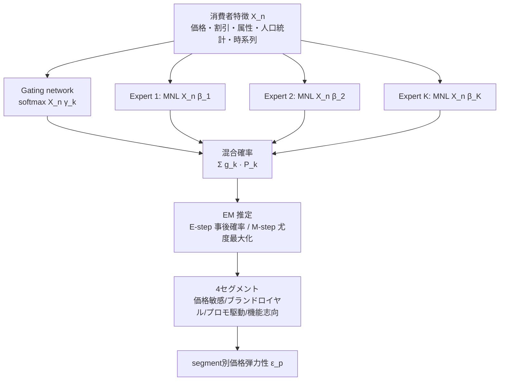

# How Do Consumers Really Choose? Exposing Hidden Preferences with the Mixture of Experts Model

- **Link**: https://arxiv.org/abs/2503.05800 （PDF: https://arxiv.org/pdf/2503.05800）
- **Authors**: Diego Vallarino（EGADE Business School, Tec de Monterrey）
- **Year**: 2025（arXiv 投稿 2025-03-03）
- **Venue**: arXiv preprint（cs.LG; econ.EM）。査読付き会議・ジャーナルでの採録は未確認（記載なし）
- **Type**: 単著プレプリント（計量経済 × 機械学習 / 消費者選択モデリング）

---

## Abstract（English, 原文引用）

> Understanding consumer choice is fundamental to marketing and management research, as firms increasingly seek to personalize offerings and optimize customer engagement. Traditional choice modeling frameworks, such as multinomial logit (MNL) and mixed logit models, impose rigid parametric assumptions that limit their ability to capture the complexity of consumer decision-making. This study introduces the Mixture of Experts (MoE) framework as a machine learning-driven alternative that dynamically segments consumers based on latent behavioral patterns. By leveraging probabilistic gating functions and specialized expert networks, MoE provides a flexible, nonparametric approach to modeling heterogeneous preferences. Empirical validation using large-scale retail data demonstrates that MoE significantly enhances predictive accuracy over traditional econometric models, capturing nonlinear consumer responses to price variations, brand preferences, and product attributes. The findings underscore MoE's potential to improve demand forecasting, optimize targeted marketing strategies, and refine segmentation practices. By offering a more granular and adaptive framework, this study bridges the gap between data-driven machine learning approaches and marketing theory, advocating for the integration of AI techniques in managerial decision-making and strategic consumer insights.

**Keywords**: Consumer choice modeling; Mixture of Experts (MoE); Heterogeneous decision-making; Pricing strategies; Demand forecasting. **JEL Codes**: C53, D12, L81, M31, C45.

---

## Abstract（日本語訳）

消費者選択の理解はマーケティング・経営研究の根幹であり、企業はオファーのパーソナライズと顧客エンゲージメント最適化を志向している。従来の選択モデル（多項ロジット MNL、混合ロジット）は硬直的なパラメトリック仮定を課し、意思決定の複雑さを捉える能力を制限する。本研究は、潜在的な行動パターンに基づいて消費者を動的にセグメント化する機械学習ベースの代替として Mixture of Experts（MoE）フレームワークを導入する。確率的な gating function と専門化した expert network を活用し、MoE は異質な選好を柔軟かつノンパラメトリックにモデル化する。大規模な小売データによる実証で、MoE は価格変動・ブランド選好・製品属性への非線形反応を捉え、従来の計量経済モデルを大きく上回る予測精度を示した。需要予測の改善・ターゲティング施策の最適化・セグメンテーション精緻化への MoE の可能性を示し、データ駆動の機械学習と marketing theory の橋渡しを行う。

---

## Overview（概要）

本論文は、離散選択モデルの標準（MNL / 混合ロジット MXL / 潜在クラスモデル LCM）が抱える「パラメトリック仮定の硬直性」「セグメント数の事前指定要求」を克服するため、**Mixture of Experts（MoE, Jacobs et al. 1991 起源）を消費者選択モデリングに正式導入**する理論・実証研究である。MoE は softmax の gating function で各消費者を確率的に複数の expert（各 expert は MNL ベースの選択モデル）へソフト割当し、EM アルゴリズムで gating と expert を同時推定する。北米オンライン小売の 5 年分（2018–2023）取引データ 100,000 件を用い、MNL / MXL / LCM をベースラインに log-likelihood・AIC・BIC・予測精度・AUC で比較。MoE は予測精度 78.9%・AUC 0.91 で全ベースラインを上回り、4 つの解釈可能な消費者セグメント（価格敏感・ブランドロイヤル・プロモ駆動・機能志向）とセグメント別の価格弾力性を推定した。

---

## Problem（解こうとしている課題）

- **MNL の IIA 仮定**: independence of irrelevant alternatives が一定の代替パターンを強制し、ブランドロイヤルティ等の非現実的予測を生む。
- **混合ロジット（MXL）の分布仮定依存**: 選好の異質性に正規・対数正規等の事前分布を仮定するため、誤指定すると弾力性推定にバイアス。
- **潜在クラスモデル（LCM）のセグメント数事前指定**: クラス数を ex-ante に決める必要があり、過剰/過少セグメント化のリスク。
- **ベイズ階層モデルの計算コスト**: 適応的セグメンテーションは可能だが計算重く、強い事前分布に依存し大規模データにスケールしにくい。
- **機械学習セグメンテーションの解釈性**: 深層クラスタリング等は柔軟だが解釈性・経済理論との整合が課題。
→ 「柔軟性（ノンパラメトリック）と解釈性・経済理論の両立」を実現するモデルが求められている。

---

## Proposed Method（提案手法）

### コアアイデア

消費者 $n$ が選択肢 $i$ を選ぶ確率を、gating function が確率的に割り当てる複数 expert の混合として表現。各 expert は segment 固有の効用 $V^k_{ni}=X_n\beta_k$ を持つ MNL で、価格弾力性・ブランド選好・施策感応度が segment ごとに異なる。セグメント数 $K$ は事前指定せず、gating が data-driven に決める。

### 手順（番号付き）

1. **効用の定義**: 個人 $n$ が選択肢 $i$ から得る潜在効用 $U_{ni}=V_{ni}+\varepsilon_{ni}$（$\varepsilon$ は極値分布）。
2. **expert 定義**: 各 expert $E_k$ を MNL で構成し、segment 固有効用 $V^k_{ni}=X_n\beta_k$ を持たせる。
3. **gating function**: softmax で消費者特徴 $X_n$ から各 expert への所属確率 $g_k$ を出力（総和 1）。
4. **混合確率**: $P(y_n=i\mid X_n)=\sum_k g_k(X_n;\theta_g)\,P(y_n=i\mid X_n,E_k;\theta_k)$。
5. **前処理**: 欠損は multiple imputation（欠損 20% 超の変数は除去）、外れ値は IQR + Mahalanobis 距離で検出、所得・価格は対数変換、カテゴリは one-hot / embedding、時系列特徴（移動平均・購買頻度）を生成、消費者ごとの価格弾力性係数を派生。train/val/test = 70/15/15 の層化サンプリング。
6. **推定（EM）**: E-step で各消費者の segment 事後確率を更新、M-step で対数尤度を最大化。SGD / Adam で数値安定化、相対対数尤度変化 $<\epsilon\,(\approx 10^{-6})$ で収束判定。$K$ は cross-validation で決定。

### Key Formulas（LaTeX）

MoE 混合確率:

$$P(y_n=i\mid X_n)=\sum_{k=1}^{K} g_k(X_n;\theta_g)\,P(y_n=i\mid X_n,E_k;\theta_k)$$

expert（segment 固有 MNL）:

$$P(y_n=i\mid X_n,E_k)=\frac{\exp(V^k_{ni})}{\sum_j \exp(V^k_{nj})}, \qquad V^k_{ni}=X_n\beta_k$$

gating function（softmax）:

$$g_k(X_n;\theta_g)=\frac{\exp(X_n\gamma_k)}{\sum_{j=1}^{K}\exp(X_n\gamma_j)}$$

E-step 事後確率:

$$P(E_k\mid X_n,y_n)=\frac{g_k(X_n;\theta_g)\,P(y_n\mid X_n,E_k;\theta_k)}{\sum_{j=1}^{K} g_j(X_n;\theta_g)\,P(y_n\mid X_n,E_j;\theta_j)}$$

対数尤度（M-step 目的関数）:

$$\mathcal{L}(\theta)=\sum_{n=1}^{N}\log\!\left(\sum_{k=1}^{K} g_k(X_n;\theta_g)\,P(y_n\mid X_n,E_k;\theta_k)\right)$$

収束判定:

$$\frac{\mathcal{L}(\theta^{(t+1)})-\mathcal{L}(\theta^{(t)})}{|\mathcal{L}(\theta^{(t)})|}<\epsilon, \quad \epsilon\approx 10^{-6}$$

価格弾力性（segment 別）:

$$\varepsilon_p=\frac{\partial P(y_n=i\mid X_n)}{\partial P}$$

---

## Algorithm（擬似コード）

```
# MoE 推定（EM）
入力: 消費者特徴 X, 選択 y, expert 数 K（CV で決定）, 許容 ε≈1e-6
1. 初期化: gating γ_k, expert β_k を小さな乱数に
2. repeat:
3.    # E-step: 各消費者 n の segment 事後確率
4.    for n, k:
5.        r_nk <- g_k(X_n;γ) * P(y_n|X_n,E_k;β_k)
6.        r_nk <- r_nk / Σ_j g_j(X_n;γ) * P(y_n|X_n,E_j;β_j)
7.    # M-step: 対数尤度最大化
8.    (γ, β) <- argmax Σ_n log( Σ_k g_k(X_n;γ) P(y_n|X_n,E_k;β_k) )
9.               （SGD / Adam で更新）
10.   L_new <- L(γ, β)
11. until |L_new - L_old| / |L_old| < ε
12. return gating γ, experts β
# 推論: P(y_n=i|X_n) = Σ_k g_k(X_n;γ) * softmax(X_n β_k)_i
# 弾力性: 各 expert で ∂P/∂price を評価し segment 別 ε_p を算出
```

---

## Architecture / Process Flow

```
        入力特徴 X_n（価格・割引・属性・人口統計・時系列・弾力性）
                       │
          ┌────────────┴─────────────┐
          ▼                          ▼
   [Gating network]           [Expert networks E_1..E_K]
   softmax(X_n γ_k)            各 expert = MNL(X_n β_k)
   → 所属確率 g_k              → segment 別選択確率
          │                          │
          └──────────┬───────────────┘
                     ▼
        P(y_n=i|X_n)=Σ_k g_k · P_k   （加重混合）
                     │
                     ▼
        EM（E-step 事後確率 / M-step 尤度最大化）
                     │
                     ▼
        4 セグメント + segment 別価格弾力性
```



---

## Figures & Tables（MANDATORY ≥4）

> 注: arXiv HTML 版は提供されていない（HTTP 404）ため図の外部 `` URL は確認できなかった（記載なし）。以下は PDF 本文から抽出した表・正確な数値。

### 表1（Table 1）: モデル比較性能【主要結果】

| Model | Log-Likelihood | AIC | BIC | Predictive Accuracy (%) |
|---|---|---|---|---|
| Multinomial Logit (MNL) | −12845.3 | 25724.6 | 25862.1 | 64.2 |
| Mixed Logit (MXL) | −11512.8 | 23097.5 | 23289.3 | 71.3 |
| Latent Class Model (LCM) | −11249.1 | 22789.4 | 22987.2 | 73.1 |
| **Mixture of Experts (MoE)** | **−10742.3** | **21589.1** | **21831.8** | **78.9** |

（log-likelihood 最大・AIC/BIC 最小・予測精度最高。原文は小数点にカンマ表記 "-12845,3" 等だが、本表では小数点に統一。）

### 表2（Table 2）: AUC スコア比較【手法比較】

| Model | AUC Score |
|---|---|
| Multinomial Logit (MNL) | 0.72 |
| Mixed Logit (MXL) | 0.81 |
| Latent Class Model (LCM) | 0.83 |
| **Mixture of Experts (MoE)** | **0.91** |

### 表（本文抽出）: セグメント別価格弾力性【ablation / 解釈分析】

| Segment | 価格弾力性 $\varepsilon_p$ | 特徴 |
|---|---|---|
| Price-sensitive（価格敏感） | −2.35 | 1% 値上げで購買確率 約2.35% 減。他ブランドへ乗換えやすい。cross-price 弾力性が高い。 |
| Brand-loyal（ブランドロイヤル） | −0.42 | 価格変動に鈍感。プレミアム価格が可能。cross-price 弾力性ほぼ 0。 |
| Promotion-driven（プロモ駆動） | −1.85 | 値引き・一時的価格低下に強反応。20% 超の割引で購買確率が非線形に急増（閾値効果）。 |
| Feature-oriented（機能志向） | −0.78 | 価格より品質・技術仕様・成分を重視。高スペックが価格感応を相殺。 |

（Shapley 値分解では、ブランドロイヤルティが消費者の約 27.8% で最重要決定要因。）

### 表（本文抽出）: データセット・前処理

| 項目 | 内容 |
|---|---|
| データ源 | 北米オンライン小売プラットフォーム（匿名化） |
| 期間 | 2018–2023（5 年） |
| レコード数 | 100,000 件のユニーク購買記録 |
| 特徴 | 製品カテゴリ・原価格・割引率・最終価格・年齢層・所得階層・世帯規模・地域・広告接触・メール施策・ロイヤルティ参加・派生価格弾力性 |
| 分割 | train 70% / val 15% / test 15%（層化） |
| 前処理 | multiple imputation、IQR+Mahalanobis 外れ値検出、対数変換、one-hot/embedding、時系列集約 |

### 計算効率（本文抽出）
- MoE は同等の異質性を持つ Mixed Logit より **約 40% 高速に学習**。データ規模増加でも out-of-sample 汎化が安定。

---

## Experiments & Evaluation

### Setup
- **データ**: 北米オンライン小売 5 年分（2018–2023）、匿名化購買記録 100,000 件。世帯単位で集約、PII 除去。
- **ベースライン**: MNL / MXL / LCM。
- **推定**: 最尤推定（MLE）＋ EM。$K$ は cross-validation（5〜10 fold）で決定。SGD / Adam。
- **指標**: log-likelihood、AIC、BIC、out-of-sample 予測精度、AUC（ROC 分析）。予測精度は 80/20 の k-fold で評価。

### Main Results（正確な数値）
- **モデル適合**: MoE の log-likelihood −10742.3 は最良（MNL −12845.3、MXL −11512.8、LCM −11249.1）。AIC 21589.1・BIC 21831.8 も最小。
- **予測精度**: MoE 78.9% ＞ LCM 73.1% ＞ MXL 71.3% ＞ MNL 64.2%。
- **AUC**: MoE 0.91 ＞ LCM 0.83 ＞ MXL 0.81 ＞ MNL 0.72。
- **計算効率**: MoE は MXL 比 約 40% 高速。

### Ablation / 解釈分析
- **セグメント発見**: gating が ex-ante のセグメント数指定なしに 4 つの行動クラスタ（価格敏感/ブランドロイヤル/プロモ駆動/機能志向）を確率的（ソフト割当）に発見。消費者は複数セグメントへの部分所属が可能。
- **セグメント別弾力性**: −2.35 / −0.42 / −1.85 / −0.78 と大きく異なり、MNL の単一係数では捉えられない異質性を明示。
- **非線形効果**: プロモ駆動セグメントで割引 20% 超が閾値効果を持つ、機能志向で高スペックが価格感応を相殺するといった相互作用を検出。
- **時間的遷移**: gating の逐次更新により、価格敏感→機能志向のような選好の時間変化を捕捉できると主張。

---

## 本テーマへの適用可能性（customer/campaign similarity for pooling/transfer）

本テーマ（稀な施策・行動ベースセグメンテーション・類似クラスタ間での効果プール/転移）に対し、MoE は **「ソフトなセグメンテーション」と「セグメント別の施策感応度（弾力性）」を同時に与える枠組み**として有用である。

- **類似ユーザーの定義（ソフト割当）**: gating function の出力 $g_k(X_n)$ は各消費者の segment 所属確率ベクトルであり、これ自体が低次元の「顧客 embedding」として使える。$g_k$ ベクトルの近さでユーザー類似度を測れば、K-means の硬い割当より柔軟に「効果をプールすべき似たユーザー群」を定義できる。論文も MoE を k-means / 階層クラスタリングの上位互換として位置づけている（§4.1）。
- **効果のプール/転移の直接的手掛かり**: MoE は segment ごとに価格弾力性（−2.35 / −0.42 / −1.85 / −0.78）と施策感応度を推定するため、「同一 expert に高確率で属する顧客は施策リフトが似る」という仮説の下、稀な施策の観測データを expert 単位でプールして推定を安定化できる。プロモ駆動セグメントの閾値効果（割引 20% 超で急増）のような非線形リフトも捉えられ、施策設計に直結する。
- **キャンペーン類似度への応用**: expert を「施策タイプ別の反応関数」とみなせば、新規キャンペーンを既存 expert の混合として表現し、gating が推定する所属確率で「似たキャンペーン」を定義する発想が可能（論文はユーザー側のセグメンテーションが主眼で、キャンペーン embedding は明示的に扱っていない＝拡張余地）。
- **稀少施策との相性**: パラメトリック分布や事前セグメント数を要求せず、EM で data-driven にセグメントを学ぶため、施策イベントが少ない状況でも購買ログ全体から expert を推定でき、施策データはプール推定の弱教師として使える。MXL 比 40% 高速で大規模データに適用しやすい点も実務向き。
- **留意点**: 本研究は観測データでの予測精度・弾力性推定であり、**因果的な施策効果（uplift）の識別は行っていない**。効果転移に用いる際は、gating で定義したセグメントを uplift モデリング（T-learner 等）と組み合わせ、セグメント内で因果効果を推定する二段構えが望ましい。

---

## Notes（補足・注意点）

- **数値はすべて PDF から確認済み**。原文の表は小数点をカンマ（"-12845,3"）で表記しているため、本レポートではピリオドに正規化した。
- arXiv HTML 版は未提供（HTTP 404）で、図の外部画像 URL は取得できなかった（記載なし）。ROC 曲線図は本文で言及されるが画像 URL なし。
- **査読状況**: cs.LG / econ.EM の単著プレプリント。会議・ジャーナル採録は確認できなかった（記載なし）。同著者 Diego Vallarino は関連分野で多数の単著プレプリントを出している。
- **限界**: (1) 単一の小売データセット・100k 件での実証にとどまる。(2) データセットが匿名化・集約済みで再現性検証が難しい。(3) 予測・記述分析中心で、施策の因果効果（uplift）識別は範囲外。(4) expert 数 $K$ の具体値・セグメント規模の内訳など一部詳細は本文に数値記載なし。
