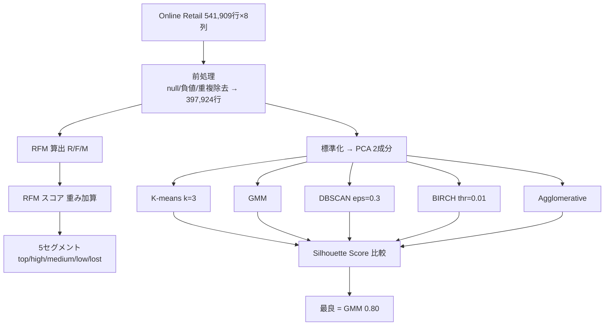

# An Exploration of Clustering Algorithms for Customer Segmentation in the UK Retail Market

- **Link**: https://arxiv.org/abs/2402.04103 （PDF: https://arxiv.org/pdf/2402.04103 / 公式掲載: https://www.mdpi.com/2673-4591 系列 Analytics 誌）
- **Authors**: Jeen Mary John（Sheffield Hallam University）, Olamilekan Shobayo（Sheffield Hallam University, 責任著者）, Bayode Ogunleye（University of Brighton）
- **Year**: 2024（arXiv 投稿 2024-02-06）／原掲載 2023
- **Venue**: *Analytics*（MDPI）, Vol. 2, Issue 4, pp. 809–823, 2023. DOI: 10.3390/analytics2040042（Received 2023-09-03 / Accepted 2023-10-09 / Published 2023-10-12）
- **Type**: 査読付きジャーナル論文（顧客セグメンテーション / クラスタリング比較）

---

## Abstract（English, 原文引用）

> Recently, peoples' awareness of online purchases has significantly risen. This has given rise to online retail platforms and the need for a better understanding of customer purchasing behaviour. Retail companies are pressed with the need to deal with a high volume of customer purchases, which requires sophisticated approaches to perform more accurate and efficient customer segmentation. Customer segmentation is a marketing analytical tool that aids customer-centric service and thus enhances profitability. In this paper, we aim to develop a customer segmentation model to improve decision-making processes in the retail market industry. To achieve this, we employed a UK-based online retail dataset obtained from the UCI machine learning repository. The retail dataset consists of 541,909 customer records and eight features. Our study adopted the RFM (recency, frequency, and monetary) framework to quantify customer values. Thereafter, we compared several state-of-the-art (SOTA) clustering algorithms, namely, K-means clustering, the Gaussian mixture model (GMM), density-based spatial clustering of applications with noise (DBSCAN), agglomerative clustering, and balanced iterative reducing and clustering using hierarchies (BIRCH). The results showed the GMM outperformed other approaches, with a Silhouette Score of 0.80.

**Keywords**: customer segmentation; DBSCAN; Gaussian mixture model; K-means clustering; BIRCH; RFM framework.

---

## Abstract（日本語訳）

近年、オンライン購買への意識が大きく高まり、オンライン小売プラットフォームと顧客購買行動のより深い理解の必要性が生じている。小売企業は大量の購買を扱う必要に迫られ、より正確・効率的な顧客セグメンテーションのための高度な手法を要する。顧客セグメンテーションは顧客中心のサービスを支え収益を高めるマーケティング分析ツールである。本論文は小売業界の意思決定を改善する顧客セグメンテーションモデルの構築を目的とする。UCI 機械学習リポジトリの英国オンライン小売データセット（541,909 レコード・8 特徴量）を用い、RFM（recency, frequency, monetary）フレームワークで顧客価値を定量化した。その上で SOTA クラスタリング手法—K-means・Gaussian mixture model（GMM）・DBSCAN・agglomerative clustering・BIRCH—を比較した。結果、GMM が Silhouette Score 0.80 で他を上回った。

---

## Overview（概要）

本研究は、UCI の英国オンライン小売データ（Online Retail Data Set, 541,909 レコード・8 特徴量）に対し、**RFM で顧客価値を定量化した上で 5 種のクラスタリング手法を Silhouette Score で比較**する実証研究である。前処理で欠損・負値・重複を除去し 397,924 レコードに整えた後、顧客ごとに Recency・Frequency・Monetary を算出。RFM スコアで顧客を top / high / medium / low / lost の 5 セグメントへ分類する（重み付き加算スコアによるルールベース分類）。並行して、PCA で次元削減した特徴に対し K-means・GMM・DBSCAN・BIRCH・agglomerative を適用し、Silhouette Score で評価。**GMM（+PCA）が 0.80 で最良**、K-means・BIRCH・agglomerative が 0.64、DBSCAN が 0.626。GMM が分散を捉え重なりのない凝集した clusters を生成する点、および PCA が GMM の高次元弱点を補う点が優位の理由と分析している。コードは GitHub 公開。

---

## Problem（解こうとしている課題）

- **オンライン小売の大量購買データ**を、正確かつ効率的にセグメント化する高度な手法が必要。
- **手法選択の指針不足**: 小売セグメンテーションで複数の高度な教師なしクラスタリング手法を体系的に比較した研究が限られる。
- **RFM 単独の限界**: RFM は簡便だが消費・行動の差異を十分に反映できず、クラスタリングとの補完が望まれる。
- **実務接続**: 科学的評価（Silhouette Score）とビジネス視点（セグメント解釈・施策）の両面から論じる必要。

---

## Proposed Method（提案手法）

### コアアイデア

RFM で顧客を数量化し、PCA で次元削減した特徴空間に対し 5 種のクラスタリングを適用、Silhouette Score で最良手法を選定する。RFM スコアによるルールベースの 5 セグメント分類と、教師なしクラスタリングによる 3 クラスタ発見を併用する。

### 手順（番号付き）

1. **前処理**: 541,909 → 'Description'・'CustomerID' の null 除去で 406,829 → 'Quantity' 負値 8,905 件除去・重複除去で **397,924 レコード**（8 列）に整形。
2. **RFM 算出**: 顧客ごとに Recency（最新請求日からの日数）・Frequency（distinct 請求日数）・Monetary（総請求額 GBP）を計算。
3. **RFM スコア化**: 各要素を rank 化し、最高 rank で割って ×100 で正規化。重み付き加算で RFM スコアを算出。
4. **セグメント分類（ルールベース）**: スコア >4.5 = top、>4 = high-value、>3 = medium-value、>1.6 = low-value、<1.6 = lost の 5 区分。
5. **PCA**: 標準化後、共分散行列の固有値分解で主成分を抽出。可視化のため 2 主成分（P1, P2）を採用し GMM へ入力。
6. **クラスタリング適用**: K-means（Min–Max スケーリング、elbow 法で最適 k=3）、GMM（PCA 2 成分）、DBSCAN（eps=0.3）、BIRCH（threshold=0.01）、agglomerative を適用。
7. **評価**: Silhouette Score で各手法を比較し最良手法を選定。

### Key Formulas（LaTeX）

K-means の目的関数（WCSS, 式6）:

$$\mathrm{WCSS}=\sum_{i=1}^{N}\sum_{k=1}^{K} r_{ik}\,\lVert x_i-\mu_k\rVert^2$$

（$r_{ik}=1$ if $x_i\in$ cluster $k$ else 0）

GMM（式7）:

$$P(x)=\sum_{k=1}^{K}\pi_k\,\mathcal{N}(x\mid\mu_k,\Sigma_k)$$

DBSCAN reachability distance（式8）:

$$\mathrm{reach\text{-}dist}(p,q)=\max\big(\mathrm{core\text{-}dist}(p),\ \lVert p-q\rVert\big)$$

BIRCH クラスタ間距離（式9）:

$$D(C_1,C_2)=\sqrt{\frac{N_1 N_2}{N_1+N_2}\cdot\left(\frac{\mathrm{LSUM}_1}{N_1}-\frac{\mathrm{LSUM}_2}{N_2}\right)}$$

Agglomerative linkage（式10–12）:

$$d_{\text{single}}(A,B)=\min_{a\in A,b\in B} d(a,b),\quad d_{\text{complete}}(A,B)=\max_{a\in A,b\in B} d(a,b)$$

Silhouette Score（式13）:

$$s(i)=\frac{b(i)-a(i)}{\max\big(a(i),\,b(i)\big)}$$

RFM スコア（式14）:

$$\text{RFM Score}=(R_{\text{score}}\times R_w)+(F_{\text{score}}\times F_w)+(M_{\text{score}}\times M_w)$$

---

## Algorithm（擬似コード）

```
入力: Online Retail データ（541,909 行, 8 列）
1. 前処理:
   drop null(Description, CustomerID)      # → 406,829
   drop Quantity<0（8,905 件）, drop 重複    # → 397,924
2. RFM 算出（顧客ごと）:
   Recency   = today - last_invoice_date
   Frequency = count(distinct invoice_date)
   Monetary  = sum(invoice_price)
3. RFM スコア:
   各要素を rank → rank/max_rank × 100
   RFM_Score = R*R_w + F*F_w + M*M_w
4. セグメント（ルールベース）:
   >4.5→top, >4→high, >3→medium, >1.6→low, <1.6→lost
5. 標準化 → PCA（2 主成分 P1,P2）
6. for algo in {KMeans(k=3), GMM, DBSCAN(eps=0.3),
                BIRCH(thr=0.01), Agglomerative}:
       labels <- algo.fit_predict(features)
       score  <- silhouette_score(features, labels)
7. return argmax_algo score   # → GMM(0.80)
```

---

## Architecture / Process Flow

```
 Online Retail（541,909 行, 8 列）
        │  前処理: null/負値/重複除去 → 397,924 行
        ▼
 ┌──────────────┐        ┌──────────────────────────┐
 │  RFM 算出     │        │  標準化 → PCA(2成分)      │
 │  R / F / M    │        └──────────────┬───────────┘
 └──────┬───────┘                        │
        │ RFM スコア(重み加算)            ▼
        ▼                     ┌──────────────────────────┐
 5セグメント分類              │ K-means / GMM / DBSCAN    │
 (top/high/med/low/lost)     │ BIRCH / Agglomerative     │
                             └──────────────┬───────────┘
                                            ▼
                             Silhouette Score で比較
                                            ▼
                                 最良 = GMM (0.80)
```



---

## Figures & Tables（MANDATORY ≥4）

> 注: arXiv HTML 版は未提供（HTTP 404）、MDPI 公式ページは 403 で取得不可。以下は PDF 本文から抽出した図表の内容・正確な数値である。図の外部 `` URL は確認できなかった（記載なし）。

### 表5（Table 5）: クラスタリング手法の Silhouette Score 比較【主要結果 / 手法比較】

| Research Studies | Clustering Algorithm | Silhouette Score |
|---|---|---|
| Existing Studies | Mean shift [28] | 0.54 |
| Existing Studies | K-means [5] | 0.71 |
| Existing Studies | K-means [28] | 0.57 |
| Existing Studies | K-means [6] | 0.61 |
| Existing Studies | DBSCAN [5] | 0.72 |
| Existing Studies | Agglomerative [28] | 0.57 |
| **Our study** | K-means | 0.64 |
| **Our study** | BIRCH | 0.64 |
| **Our study** | DBSCAN | 0.62 |
| **Our study** | Agglomerative | 0.64 |
| **Our study** | **Gaussian Mixture Model** | **0.80** |

（本研究の GMM 0.80 が既存研究含め最良。K-means は初期中心のランダム性で ±0.06 変動。DBSCAN は本文では 0.626 と記載され、表5 では 0.62 に丸め。）

### 図3（Figure 3）: 顧客セグメント可視化（RFM スコアベース）【セグメント分布】

| セグメント | 割合 | RFM スコア基準 |
|---|---|---|
| Lost customer | 31% | <1.6 |
| Low-value customer | 30% | >1.6 |
| Medium-value customer | 21% | >3 |
| High-value customer | 10% | >4 |
| Top customer | 8% | >4.5 |

画像 URL: 記載なし。

### 表2（Table 2）: RFM 構成要素（サンプル 5 顧客）

| Customer ID | Recency | Frequency | Monetary (GBP) |
|---|---|---|---|
| 12346 | 325 | 1 | 77,183.60 |
| 12347 | 1 | 182 | 4,310.00 |
| 12348 | 74 | 31 | 1,797.24 |
| 12349 | 18 | 73 | 1,757.55 |
| 12350 | 309 | 17 | 334.40 |

### 表4（Table 4）: RFM スコアに基づくセグメント（サンプル）

| Customer ID | RFM_Score | Customer_Segment |
|---|---|---|
| 12346 | 0.06 | Lost customer |
| 12347 | 4.48 | High-value customer |
| 12348 | 2.09 | Low-value customer |
| 12349 | 3.41 | Medium-value customer |
| 12350 | 1.10 | Lost customer |
| 12356 | 3.11 | Medium-value customer |

### ハイパーパラメータ（本文抽出）【設定 / ablation 相当】

| Algorithm | 主要設定 | 決定方法 |
|---|---|---|
| K-means | k=3, Min–Max scaling | elbow 法（inertia, k=2..10） |
| GMM | 2 PCA 成分 | PCA 次元削減後に適用 |
| DBSCAN | eps=0.3 | K-distance plot + 実験的探索 |
| BIRCH | threshold=0.01 | 0.01–1 を探索し最良 |
| Agglomerative | Ward / average / single / complete linkage | — |

### 図2（Figure 2）: 実験セットアップ図。図4: elbow 法（最適 k=3）。図5–9: 各手法（K-means / GMM / DBSCAN / BIRCH / agglomerative）のクラスタ可視化。いずれも画像 URL は記載なし。

---

## Experiments & Evaluation

### Setup
- **データ**: UCI Online Retail Data Set（英国オンライン小売, 541,909 レコード・8 特徴: InvoiceNo, StockCode, Description, Quantity, InvoiceDate, UnitPrice, CustomerID, Country）。
- **前処理後**: 397,924 レコード（null 除去で 406,829 → 負値 8,905 件・重複除去）。
- **実装**: Python（Pandas, NumPy, StatsModels, Matplotlib, Scikit-Learn, Seaborn, Deap）。RandomizedSearchCV, LabelEncoder, MinMaxScaler, StandardScaler, PCA 等を使用。
- **train/test**: RFM 分析は 80%/20% 分割。
- **評価指標**: Silhouette Score（式13）。

### Main Results（正確な数値）
- **GMM（+PCA）が Silhouette Score 0.80 で最良**。
- K-means = 0.64、BIRCH = 0.64、agglomerative = 0.64、DBSCAN = 0.626（表5 では 0.62）。
- 教師なしクラスタリングはいずれも 3 クラスタを発見（K-means elbow で k=3、DBSCAN も黄/緑/赤の 3 クラスタ、BIRCH も 3 群）。
- RFM ルールベース分類の分布: lost 31% / low 30% / medium 21% / high 10% / top 8%。
- 既存研究比較: Hicham & Karim [5] のアンサンブルは 0.72、Turkmen [6] の k-means は 0.6。本研究 GMM 0.80 が上回る。

### Ablation / 分析
- **PCA の効果**: GMM は一般に高次元で苦戦するが、PCA による次元削減で性能を発揮（0.80）。BIRCH・DBSCAN は密度・近接に基づくため高次元耐性がある一方、分布を明示的にモデル化する GMM が分散を捉え最良となった。
- **K-means のランダム性**: 初期中心のランダム性により結果が ±0.06 変動。Big Data 文脈での限界として指摘。
- **ハイパラ探索**: DBSCAN は eps 探索で 0.3、BIRCH は threshold 0.01–1 探索で 0.01 が最良。

---

## 本テーマへの適用可能性（customer/campaign similarity for pooling/transfer）

本テーマ（稀な施策・行動ベースセグメンテーション・類似クラスタ間での効果プール/転移）に対し、本論文は **RFM + クラスタリングによる「軽量で解釈可能な顧客セグメンテーションのベースライン」**を提供する。

- **顧客類似度の実務的ベースライン**: RFM（recency/frequency/monetary）の 3 次元は購買ログさえあれば計算でき、施策履歴に依存しない。稀な施策しか打たない状況でも、RFM 空間で GMM クラスタリングして「似たユーザー群」を定義でき、施策効果をクラスタ単位でプールする最初の分割軸として使える。GMM は**確率的（ソフト）割当**なので、顧客がクラスタ境界にまたがる場合の重み付きプーリングにも拡張しやすい。
- **手法選択の指針**: 本論文の直接の貢献は「小売 RFM 特徴では GMM(+PCA) が Silhouette 0.80 で K-means/BIRCH/DBSCAN(0.62–0.64) を上回る」という実証。本テーマでセグメンテーション器を選ぶ際、GMM を第一候補とし、Silhouette Score でクラスタ品質を検証する評価プロトコルがそのまま流用できる。
- **セグメント別施策設計**: top(8%)/high(10%)/medium(21%)/low(30%)/lost(31%) の 5 区分は、施策の優先順位付け（高価値顧客の維持 vs lost 顧客の再活性化）に直結する。効果転移の文脈では「high-value クラスタで有効だった施策を、embedding/RFM 空間で隣接する medium-value クラスタへ試す」という段階的展開の枠組みになる。
- **限界と補完（重要）**: 著者自身が「RFM は消費・行動の差異を十分反映できない」と明記している。本テーマでより精緻な類似度が必要なら、RFM を **CASPR のような系列 embedding（本ラン 12 番）や MoE の gating ベクトル（13 番）で置き換え・補完**するのが自然な発展。すなわち本論文は「解釈可能な出発点」、深層 embedding 系は「行動を細かく捉える上位互換」という位置づけで組み合わせられる。
- **キャンペーン類似度**: 本論文はユーザーセグメンテーションのみで、キャンペーン間類似度・効果転移は扱っていない（記載なし）。ただし RFM でクラスタ化した各セグメントを「施策の反応単位」とみなし、少数施策の観測をセグメント内でプールする素朴な転移設計の土台にはなる。

---

## Notes（補足・注意点）

- **数値はすべて PDF から確認済み**。arXiv HTML 版は未提供（HTTP 404）、MDPI 公式ページは 403 で取得不可のため、図の外部画像 URL は取得できなかった（記載なし）。
- **初回 WebFetch の誤り訂正**: 抽象取得時に 5 手法として「SOM（Self-Organizing Maps）」が挙がったが、PDF 本文の正しい 5 手法は **K-means・GMM・DBSCAN・agglomerative・BIRCH** であり SOM は含まれない。本レポートは PDF 本文に準拠。
- **DBSCAN スコアの表記揺れ**: 本文 §4.3 では 0.626、表5 では 0.62 と記載。丸めの差。
- **コード公開**: https://github.com/jeenmary55/Retail-Customer-Segmentaion （本文記載, 2023-09-02 アクセス）。データは UCI Online Retail Data Set（https://archive.ics.uci.edu/dataset/352/online+retail）。
- **引用**: 本論文（Jeen et al. 2023）は同ラン 13 番の MoE 論文（Vallarino 2025）でも先行研究として引用されており、RFM+クラスタリングの代表例として位置づけられている。
- **限界**: (1) RFM 3 次元のみで行動の細部を捉えられない。(2) 評価は Silhouette Score 単一指標（Davies-Bouldin・Calinski-Harabasz は本研究では未使用＝記載なし）。(3) クラスタ数はいずれも 3 に固定的で、セグメントの経営的意味付けは限定的。(4) 施策の因果効果は範囲外。
