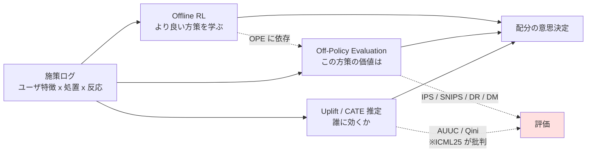

# Cluster 1: 手法論の地図 — uplift / OPE / offline RL

## Overview

施策効果最大化に使う推定量・評価指標の全体像を押さえるクラスタ。アップリフトモデル（CATE 推定）、オフ方策評価（OPE）、オフライン強化学習という3つの手法群は、いずれも「介入しなかった場合の反実仮想」を扱う点で共通するが、**扱う意思決定の構造が異なる**。uplift は「誰に配るか」（単発処置）、OPE は「あるログから別の方策の価値を測る」（方策評価）、offline RL は「ログから方策そのものを学ぶ」。数ヶ月に一度の施策サイクルでは、オンライン探索を前提とするバンディットは適合せず、**ログデータに対する OPE / offline RL** が現実的な選択肢となる。

本クラスタの最重要論点は、**AUUC / Qini による評価の正当性が査読済み文献で崩されつつある**こと。単なる「ノイズが多い」という話ではなく、ICML 2025 の主張は「**系統的に誤ったモデルを選ばせる**」である。評価指標を無批判に採用すると、モデル選択自体が壊れる。

## 手法群の関係

## 手法の使い分け

| 手法 | 問い | 施策サイクル数ヶ月での適合 |
|------|------|------------------------|
| Uplift / CATE | 誰に配ると増分効果が大きいか | ◎ 本命 |
| OPE | 新しい配布ルールはログ上でどう評価されるか | ◎ A/B の前段として有効 |
| Offline RL | ログから配分方策を直接学習 | ○ 予算制約付きなら有力（BCORLE 等） |
| Online bandit | 逐次探索しながら最適化 | ✗ 年4回程度では探索が成立しない |

## Keywords

- `uplift modeling`
- `CATE (Conditional Average Treatment Effect)`
- `metalearner (S-learner / T-learner / X-learner / DR-learner / R-learner)`
- `Causal Forest / DML (Double Machine Learning)`
- `off-policy evaluation (OPE)`
- `IPS (Inverse Propensity Score)`
- `SNIPS (Self-Normalized IPS)`
- `Doubly Robust (DR) / DRos / Switch-DR`
- `Direct Method (DM)`
- `MIPS (Marginalized IPS) / large action space`
- `propensity logging / 傾向スコアのロギング`
- `offline reinforcement learning`
- `AUUC / Qini coefficient / uplift@k`
- `PUC (Principled Uplift Curve)`
- `多値処置 / 一般化傾向スコア (GPS)`

## Research Strategy

- **AUUC 批判から入る**。ICML 2025「Rethinking Causal Ranking」を最初に読む。ここを知らずに評価設計をすると手戻りが最大になる。次に Bokelmann & Lessmann（EJOR）で分散の問題を押さえる。
- **推定量の選択は「一つに決められない」前提で臨む**。Sony の研究はアウトカム定義を変えるだけで最良推定量が入れ替わることを示し、Adyen の本番では IPS/SNIPS が DR に勝った。「DR が常に最良」は誤り。
- **推定量より propensity ロギングが本質**という視点を持つ。決定的な本番方策は propensity を残さないため、Adyen の「探索トラフィックからの復元」パターンが実務上の鍵。
- 検索クエリ: `uplift evaluation AUUC bias`, `off-policy evaluation production`, `propensity logging deterministic policy`, `budget constrained uplift`
- 日本語: メルカリの JSAI2020 発表（AUUC が費用対効果に直結しないという実務側からの批判）は、ICML25 の学術的批判と独立に同じ問題を指摘しており対比が有益。

## Representative Resources

| Title | Type | Year | Summary |
|-------|------|------|---------|
| [Rethinking Causal Ranking: A Balanced Perspective on Uplift Model Evaluation](https://proceedings.mlr.press/v267/zhu25s.html) | 論文 (ICML 2025) | 2025 | uplift/Qini 曲線が二値負アウトカム個体を誤ランク付けし、**系統的に誤ったモデル選択**を招くと主張。PUC/PUL/PTONet を提案。[code](https://github.com/euzmin/PUC) |
| [Off-policy Evaluation for Payments at Adyen](https://arxiv.org/abs/2501.10470) | 論文 / 本番事例 | 2025 | **本番 OPE の最重要事例**。IPS/SNIPS が DM/DR に勝つ（相関 >0.8、DM は負の相関）。OBP を使わず PySpark で再実装 |
| [Bokelmann & Lessmann, Improving Uplift Model Evaluation](https://arxiv.org/abs/2210.02152) | 論文 (EJOR) | 2022 | AUUC/Qini は分散に苦しみシグナルが「恣意的」。RCT データ上でもバイアスがあることを示す |
| [Sony: Towards Automated Off-Policy Evaluator Selection](https://arxiv.org/abs/2109.08621) | 論文 | 2021 | 最良推定量はアウトカム定義次第で入れ替わる。推定量選択そのものを問題化 |
| [PAS-IF: 推定量選択の自動化](https://arxiv.org/abs/2211.13904) | 論文 (AAAI'23) | 2022 | OPE 推定量選択のためのデータ分割法 |
| [MIPS: Off-Policy Evaluation for Large Action Spaces](https://arxiv.org/abs/2202.06317) | 論文 | 2022 | 行動空間が大きいと IPS が崩壊 → 埋め込みによる周辺化。多クーポン額設定に直結 |
| [メルカリ: Uplift Modeling で費用対効果最大化](https://www.jstage.jst.go.jp/article/pjsai/JSAI2020/0/JSAI2020_1H4OS12b02/_article/-char/ja/) 🇯🇵 | 発表 (JSAI2020) | 2020 | 「従来の uplift 評価指標(AUUC等)が費用対効果の改善に必ずしも結びつかない」— 実務からの AUUC 批判 |
| [ZOZO: HTE 手法の実用性検証](https://techblog.zozo.com/entry/hte_analysis) 🇯🇵 | 技術ブログ | 2025 | S/T/X/DR-Learner vs Causal Forest DML の比較。DML 系が最高精度だが**サンプル少・効果小では精緻な評価は困難**という正直な失敗報告 |
| [ZOZO: Open Bandit Project](https://techblog.zozo.com/entry/openbanditproject) 🇯🇵 | 技術ブログ | 2020 | 実測相対誤差 DM 0.2319 / IPW 0.1147 / DR 0.1181。IPW/DR が DM を大幅に上回る実データ検証 |
| [CyberAgent AI Lab: 多値処置 uplift と GPS](https://cyberagent.ai/blog/research/economics/12482/) 🇯🇵 | 技術ブログ | 2020 | 多値処置 uplift + 一般化傾向スコア。クリエイティブ3本で **AUUC が負**という結果を公開 |
| [Criteo-UPLIFT Dataset](https://ailab.criteo.com/criteo-uplift-prediction-dataset/) | データセット | 2018 | 25.3M行（unbiased版 13.98M行）。業界標準ベンチマーク |
| [連続処置 uplift における MISE と AUUC の乖離](https://arxiv.org/html/2412.09232v1) | 論文 | 2024 | 予測品質と配分品質が乖離することを文書化。クーポン額が連続量の場合に重要 |
