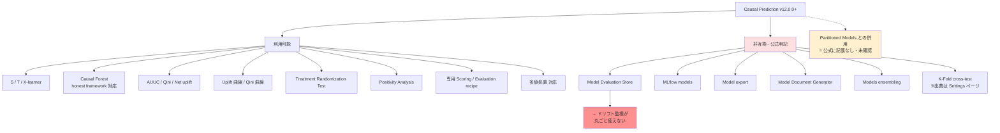

# Cluster 2: Dataiku ネイティブ Causal Prediction

## Overview

Dataiku には **Causal Prediction** という名前で uplift モデリングがネイティブ実装されている。プラグインではなく Lab の第一級 Visual ML 分析タイプであり、**v12.0.0（2023-05-26）で導入**された。S/T/X-learner と Causal Forest を備え、AUUC・Qini・Net uplift を最適化指標として選択でき、さらに **Treatment Randomization Test** と **Positivity Analysis** という因果識別の仮定そのものを検定する画面を持つ。AutoML ツールとしては異例に踏み込んだ実装である。

しかし本クラスタの核心は機能一覧ではなく、**その機能境界**にある。Causal Prediction は Model Evaluation Store・MLflow・モデルエクスポート・Model Document Generator・モデルアンサンブルと公式に非互換であり、加えて K-fold CV も非対応である。これは「まだ実装されていない」ではなく公式ドキュメントに明記された制約であり、**ネイティブ uplift を選んだ瞬間に Dataiku の MLOps 監視基盤が丸ごと使えなくなる**ことを意味する。この一点が本調査全体の分岐点である。

> **訂正（gather フェーズの一次情報確認による）**: 本ファイルの初版は「Partitioned Model とも非互換」「IPW と多値処置は 12.0.0 の機能」と記載していたが、いずれも誤りであった。公式の非互換リストは **5項目のみ**で Partitioned Models を含まない（サイドバーのナビ要素の誤読と判明）。また **IPW/Treatment Analysis は 12.4.0、多値処置は 12.2.0** の追加である。詳細は gather の `dataiku_native_causal` を参照。

## 機能と制約の全体像

## 仕様の要点

| 項目 | 内容 |
|------|------|
| 導入バージョン | **12.0.0**（2023-05-26、"Major new features" に記載） |
| アルゴリズム | メタラーナー **S / T / X-learner**（任意の Python ベース学習器を基底に使用可）+ **Causal Forest**（honest framework オプション付き） |
| 処置変数 | 二値 **および多値**（＝クーポン額の水準違いを直接扱える）。**多値対応は 12.2.0 で追加** |
| アウトカム | 数値（causal regression）/ **二値カテゴリのみ**（causal classification） |
| 最適化指標 | **AUUC**、**Qini coefficient**、**Net uplift**（既定は上位50%地点） |
| 傾向補正 | Treatment Analysis を有効化すると **逆確率重み付け (IPW)** で非ランダム処置を補正。**12.4.0 で追加**（＝実用上の推奨最低バージョン） |
| 結果画面 | Uplift 曲線、Qini 曲線、予測効果の分布、代理木による特徴量重要度、Treatment Randomization Test（二項検定 + p 値）、Positivity Analysis（較正曲線 + 積み上げヒストグラム） |
| 必要環境 | コード環境に **"Visual Causal Machine Learning"** パッケージプリセット、Python 3.8–3.13 |

## ユースケースへの当てはまり

| 要件 | 判定 |
|------|------|
| クーポン額の水準違いを扱う | ◎ 多値処置に対応 |
| 訴求内容（クリエイティブ）違いを扱う | ◎ 多値処置として表現可能 |
| 施策ごとに対象ユーザーが異なる | △ Positivity Analysis で重なりを検証できるのは利点。施策別個別学習（Partitioned Model）との併用可否は**公式に記載がなく未確認** |
| 反応（購入・開封）を予測 | ◎ causal classification（二値）で対応 |
| **予測結果とモデルの評価** | ○ 学習時の Qini/AUUC は充実。ただし**時系列的な性能追跡は MES 非互換のため不可** |
| 予算制約下での配分最適化 | ✗ ネイティブ機能なし。CATE を出力した後の最適化は自作（→ C6） |

## Keywords

- `Causal Prediction`
- `Visual Causal Machine Learning (code env preset)`
- `S-learner / T-learner / X-learner`
- `Causal Forest / honest framework`
- `AUUC / Qini coefficient / Net uplift`
- `Treatment Analysis / inverse probability weighting`
- `Treatment Randomization Test`
- `Positivity Analysis`
- `causal Evaluation recipe / causal Scoring recipe`
- `multi-valued treatment`
- `Model Evaluation Store 非互換`
- `DSS 12.0.0 release notes`

## Research Strategy

- **まず公式の Introduction ページの非互換リストを読む**。ここが全ての意思決定の起点。二次情報は v13 導入と誤記していることが多いので、必ずリリースノートで一次確認する。
- **Positivity Analysis と Treatment Randomization Test を重視する**。施策ごとに対象ユーザーが異なるという運用実態は、処置群と対照群の重なり（positivity）が壊れやすいことを意味する。この2画面はまさにその診断に使える Dataiku 側の強み。
- **内部実装ライブラリは公式に非公開**。EconML や CausalML への言及は一切無いため、「EconML 相当だろう」という推測に依存した設計はしない。
- 検索クエリ: `Dataiku causal prediction`, `Dataiku uplift AUUC Qini`, `DSS 12 release notes causal`, `Dataiku treatment analysis IPW`
- **日本語情報は事実上存在しない**。Dataiku 公式 Qiita に因果推論の動機を説明した記事があるのみで製品ドキュメントではない。英語ドキュメントを正とすること。

## Representative Resources

| Title | Type | Year | Summary |
|-------|------|------|---------|
| [Causal Prediction — Introduction](https://doc.dataiku.com/dss/latest/machine-learning/causal-prediction/introduction.html) | 公式ドキュメント | — | **最重要**。非互換リスト（MES / MLflow / export / ensembling / Model Document Generator）が明記されている |
| [Causal Prediction Algorithms](https://doc.dataiku.com/dss/latest/machine-learning/causal-prediction/causal-prediction-algorithms.html) | 公式ドキュメント | — | S/T/X-learner と Causal Forest の仕様。honest framework の説明 |
| [Causal Prediction Settings](https://doc.dataiku.com/dss/latest/machine-learning/causal-prediction/settings.html) | 公式ドキュメント | — | AUUC/Qini/Net uplift の選択、Treatment Analysis、**K-Fold 非対応の記載** |
| [Causal Prediction Results](https://doc.dataiku.com/dss/latest/machine-learning/causal-prediction/results.html) | 公式ドキュメント | — | Uplift/Qini 曲線、Treatment Randomization Test、Positivity Analysis の読み方 |
| [Causal Prediction Evaluation recipe](https://doc.dataiku.com/dss/latest/machine-learning/causal-prediction/evaluation.html) | 公式ドキュメント | — | MES とは別系統の専用評価機構。ドリフト分析には接続しない |
| [Causal Prediction Scoring recipe](https://doc.dataiku.com/dss/latest/machine-learning/causal-prediction/scoring.html) | 公式ドキュメント | — | Flow へのデプロイと推論 |
| [DSS 12 Release Notes](https://doc.dataiku.com/dss/latest/release_notes/12.html) | 公式ドキュメント | 2023 | 導入バージョンの一次確認先（v13 ノートには causal の記載が無い） |
| [Concept \| Causal prediction (KB)](https://knowledge.dataiku.com/latest/ml-analytics/causal-prediction/concept-causal-prediction.html) | 公式 KB | — | 概念解説。割引（discount）を処置とする例が明示されている |
| [Tutorial \| Causal prediction (KB)](https://knowledge.dataiku.com/latest/ml-analytics/causal-prediction/tutorial-causal-prediction.html) | 公式 KB | — | ハンズオン。最初に手を動かす対象 |
| [Partitioned Models](https://doc.dataiku.com/dss/latest/machine-learning/partitioned.html) | 公式ドキュメント | — | **prediction (supervised) のみ対応 = causal prediction 非対応**の根拠 |
| [Enterprise Causal Inference: Beyond Churn Modeling](https://blog.dataiku.com/enterprise-causal-inference-beyond-churn-modeling) | 公式ブログ | — | 「uplift は因果推論の最も成熟した業務応用」という Dataiku 自身の位置づけ |
| [Dataiku 公式 Qiita: 因果推論](https://qiita.com/Dataiku/items/25b23182717a0cee6235) 🇯🇵 | ブログ | — | 数少ない日本語情報。ただし概念説明であり製品ドキュメントではない |

## ⚠️ 注意すべき「マーケティング表現」

- **Optimizing Omnichannel Marketing** ソリューション（v13.2+）は uplift + Next Best Action を明示的に使うが、**製薬・ライフサイエンス専用**であり汎用マーケティング向けではない。名称が誤解を招く。定量効果（HCP満足度 5–10% 等）は**方法論の開示が無いベンダー表現**であり根拠として扱わないこと。
- **Next Best Offer for Banking**（v13.4+）は uplift を使うか**ドキュメント上は確認できない**（予測ターゲティングとしか記載が無い）。
- 汎用マーケティングページは「あらゆる業界向けの NBA テンプレート」を謳うが、KB 上で確認できるのは製薬版と銀行版のみ。**「any industry」は広告表現**と見なすべき。
