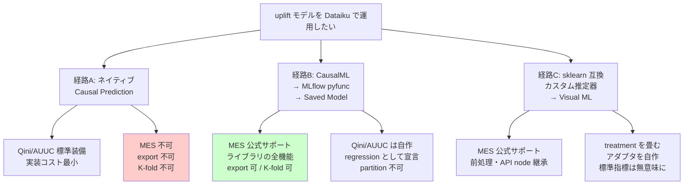
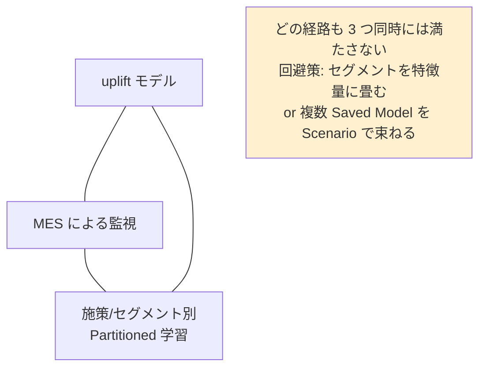

# Cluster 3: カスタム Python 経路と運用化

## Overview

クラスタ 2 で判明した「ネイティブ Causal Prediction は Model Evaluation Store と非互換」という制約の**回避経路**を扱うクラスタ。本番でのモデル監視・ドリフト検知が必須なら、ネイティブ経路は選べず、CausalML / EconML を Dataiku 内で動かす道を選ぶことになる。

> **訂正（gather フェーズの一次情報確認による）**: 本ファイルの初版は「Causal Prediction は Partitioned Model とも非互換」としていたが、**公式ドキュメントにその記載はなく未確認**である。一方で**確定した事実**として、**Partitioned Model は Evaluate recipe で評価不可**（「The model must be a non-partitioned ...」と明記）であり、**「パーティション別 uplift モデル」と「MES による監視」が両立しないという結論自体は変わらない**。詳細は gather の `custom_python_path` を参照。

調査の結果、**CausalML の uplift モデルを `mlflow.pyfunc.PythonModel` でラップ → Dataiku の Saved Model としてインポート → Model Evaluation Store で評価**という経路が、「uplift モデル」と「MES」の両方が公式ドキュメント上で動作すると明記された**唯一の経路**であることが分かった。代償は、uplift を regression（CATE スコア）として宣言せざるを得ず、**Qini/AUUC を Custom Evaluation Metric として自作する必要がある**こと。MES には uplift を理解する面が存在しないためである。

もう一つの選択肢は sklearn 互換のカスタム推定器を Visual ML に差し込む方法で、これも MES を維持できる。ただし CausalML のメタラーナーは `fit(X, treatment, y)` という sklearn 非準拠のシグネチャを持つため、処置を `X` に畳み込むアダプタを自作し、その正しさを自分で担保することになる。

## 三経路の比較

## 経路ごとの機能マトリクス

| | A: ネイティブ Causal | B: MLflow pyfunc | C: カスタム推定器 |
|---|---|---|---|
| uplift としての正しさ | ✅ 専用設計 | ✅ ライブラリ本来の力 | ⚠️ アダプタの正しさは自己責任 |
| **MES / ドリフト** | ❌ **公式に非互換** | ✅ **公式にサポート** | ✅ 公式にサポート |
| Model export | ❌ | ✅ | ✅ |
| K-fold CV | ❌ | ✅（自前で実施） | ✅ |
| Partitioned Model | ⚠️ 記載なし・未確認 | ❌ | ⚠️ **未確認** |
| Partitioned + MES の併用 | ❌ | ❌ | ❌（**Evaluate recipe が non-partitioned 限定**） |
| API node | ⚠️ 記載なし・不明 | ✅ | ✅ |
| MES 上の Qini/AUUC | — | ⚠️ Custom Metric 自作 | ⚠️ Custom Metric 自作 |
| 実装コスト | 小 | 中〜大 | 大 |

## 三条件のトリレンマ

## Keywords

- `mlflow.pyfunc.PythonModel`
- `create_mlflow_pyfunc_model`
- `import_mlflow_version_from_path`
- `MLFlowVersionHandler.set_core_metadata`
- `Saved Model / MLflow model import`
- `Custom Evaluation Metrics (score 関数)`
- `custom model in Visual ML (clf 変数)`
- `BaseCustomPredictionAlgorithm`
- `plugin prediction algorithm`
- `RegressionPredictor / ClassificationPredictor`
- `Python prediction endpoint / custom_keys`
- `code environment / package preset`
- `CausalML / EconML on Dataiku`
- `Partitioned model + custom algorithm（未確認領域）`

## Research Strategy

- **経路 B を第一候補として検証する**。「MES は Visual ML で学習したモデルとインポートされた MLflow モデルの両方に適用される」という公式記述が根拠。ただし公式は「すべてのモデルであらゆる機能の利用を保証はしない」と明記しているため、**初日に自分の pyfunc を Evaluate recipe に通すスモークテストを行う**こと。これが最大のリスク低減策。
- **Qini/AUUC の自作を工数に織り込む**。MES の Custom Evaluation Metric は float を返す `score` 関数として実装する。CausalML の `causalml.metrics`（`auuc_score`, `qini_score`）を内部で呼べばよいが、MES 側は uplift の意味を理解しないため、`y_true` / `y_pred` の受け渡し設計は自分で詰める必要がある。
- **API node の `custom_keys` 返却チャネルに注目**。CATE スコアに加えて各処置アームの予測値や propensity を同時に返せるため、uplift の診断情報を推論結果と一緒に運べる。
- **Partitioned + カスタムアルゴリズムの併用可否は本調査で最も不確実**。ドキュメント間で記述が食い違う（「Visual ML のみ = カスタム実装は除く」とする要約がある一方、カスタムモデルは技術的には Visual ML の Python バックエンド）。**自インスタンスでの検証必須**。
- **プラグイン方式には落とし穴**: 「プラグインアルゴリズムはプラグインのコード環境を使用できない」ため、インストール先の各インスタンスで専用コード環境を作る必要がある。CausalML は依存が重いため実運用上の摩擦になる。
- 検索クエリ: `Dataiku MLflow pyfunc import saved model`, `Dataiku custom evaluation metric`, `Dataiku custom model clf sklearn`, `Dataiku plugin prediction algorithm`

## Representative Resources

| Title | Type | Year | Summary |
|-------|------|------|---------|
| [Evaluating Dataiku Prediction models](https://doc.dataiku.com/dss/latest/mlops/model-evaluations/dss-models.html) | 公式ドキュメント | — | **経路 B の根拠**。「Visual ML で学習したモデルと**インポートされた MLflow モデルの両方**に適用される」と明記 |
| [Importing MLflow models](https://doc.dataiku.com/dss/latest/mlops/mlflow-models/importing.html) | 公式ドキュメント | — | `create_mlflow_pyfunc_model` → `import_mlflow_version_from_path` → `set_core_metadata` → `evaluate` の手順 |
| [Using MLflow models](https://doc.dataiku.com/dss/latest/mlops/mlflow-models/using.html) | 公式ドキュメント | — | MES・性能分析・Model Comparison がインポート済み MLflow Saved Model で利用可能なことを確認 |
| [MLflow models — training](https://doc.dataiku.com/dss/latest/mlops/mlflow-models/training.html) | 公式ドキュメント | — | pyfunc は「より特殊な ML ライブラリやカスタムモデル」向けの推奨経路と明記 |
| [Writing custom models](https://doc.dataiku.com/dss/latest/machine-learning/custom-models.html) | 公式ドキュメント | — | **経路 C の契約**: `clf` 変数が sklearn 互換推定器（`fit`/`predict`、分類は `classes_`） |
| [Concept \| Custom modeling (KB)](https://knowledge.dataiku.com/latest/ml-analytics/custom-models/concept-custom-modeling.html) | 公式 KB | — | カスタムモデルが前処理・解釈・scoring/evaluate recipe・**MES**・API node を維持することを列挙 |
| [Plugin prediction algorithms](https://doc.dataiku.com/dss/latest/plugins/reference/prediction-algorithms.html) | 公式ドキュメント | — | `BaseCustomPredictionAlgorithm`。対応は二値/多クラス/回帰のみ = **causal は プラグイン拡張不可**。「プラグインのコード環境は使えない」制約も |
| [Python prediction endpoint](https://doc.dataiku.com/dss/latest/apinode/endpoint-python-prediction.html) | 公式ドキュメント | — | `RegressionPredictor` / `ClassificationPredictor`。`custom_keys` で診断情報を併走させられる |
| [Metrics, checks and Data Quality](https://doc.dataiku.com/dss/latest/metrics-check-data-quality/index.html) | 公式ドキュメント | — | MES が使えない場合の代替監視（Custom metric = float を返す `score` 関数） |
| [Automating model evaluations](https://doc.dataiku.com/dss/latest/mlops/model-evaluations/automating.html) | 公式ドキュメント | — | Scenario による評価自動化 |
| [CausalML (Uber)](https://github.com/uber/causalml) | OSS | 2026 | **v0.17.0 / 2026-07-04 リリース、活発**。`causalml.metrics` に `auuc_score`/`qini_score`/TMLE補正/RATE·TOC/`dr_score` 等。⚠️ **Python ≥3.11 必須** |
| [EconML (py-why)](https://github.com/py-why/EconML) | OSS | 2025 | v0.16.0。**あえて Qini/AUUC を持たず** `DRPolicyTree`/`DRPolicyForest` で方策を直接学習・解釈する設計思想 |

## ⚠️ 経路 B の既知制約（公式記載）

- **非表形式（non-tabular）の MLflow 入力は非対応**。表形式 pyfunc なら可。
- 予測タイプは **Classification / Regression / Time Series Forecasting のみ**。**"causal/uplift" タイプは存在しない** → uplift は regression か classification として宣言する。
- 文字列・真偽値の特徴量は **Categorical** として扱われる。
- **Partitioned model は MES で評価できない**。
- R / Spark の MLflow モデルは非対応。
- 推奨は MLflow 3.10.1 / Python 3.10（2.22.0 と 3.10.1 が検証済み、2.0.0 未満は非推奨）。

## ⚠️ Dataiku 公式の uplift プラグインは存在しない

プラグインストアおよびコミュニティを検索したが、**uplift / causal 向けの公式・コミュニティプラグインは見つからなかった**。Dataiku の uplift に対する回答はプラグインではなく**ネイティブ Causal Prediction 機能**である。非公開プラグインの存在は否定できないが、公開されているものは無い。
