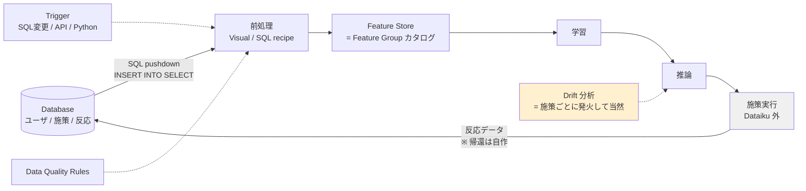

# Cluster 4: データ基盤と施策サイクル

## Overview

「DB からユーザーのメタデータ・施策データ・反応を取得し、特徴量として管理し、パイプラインを回す」という要件そのものを扱うクラスタ。Dataiku は自身を**計算エンジンではなくオーケストレータ**と位置づけており、処理はデータのある場所（SQL DB / Spark / Kubernetes）へ押し下げる（pushdown）のが設計思想である。

本クラスタで実務上最も重要な発見は3つ。第一に、**pandas を使う Python recipe は全データを DSS サーバのメモリに載せる**ため、大規模ユーザーテーブルでの最大の性能崖になる。公式の回避策は partial recipe（Python で SQL を動的生成し DB で実行）と Snowpark。第二に、施策が数ヶ月に一度という不規則な周期であるため、**時間ベースのトリガ（月次/週次/日次しか表現できない）は最悪の選択**であり、SQL クエリ変更トリガや API トリガによるイベント駆動が正解。第三に、**A/B テストは Dataiku のネイティブ機能ではなくプラグイン**であり、施策結果を学習データへ還流させる「ループを閉じる」機構も**ネイティブには存在しない**（自分で Flow を設計する）。

## データフローと機能の対応

## トリガ選択（数ヶ月に一度の施策）

| トリガ種別 | 適合 | 備考 |
|-----------|------|------|
| 時間ベース | ✗ | 月次/週次/日次/毎時しか表現できない。「施策が起きたとき」を表現不可 |
| **SQL クエリ変更** | ◎ | `SELECT MAX(campaign_launch_date)` 等の結果変化で発火。DB 上のイベント駆動に最適 |
| **公開 API / 手動** | ◎ | 施策管理システムから `scenario.run()` を push。最もクリーン |
| カスタム Python | ○ | 外部 API を叩いて発火判定。柔軟だが自作 |
| Scenario 連鎖 | ○ | 前段 Scenario の成否に応じて連結 |

- **Grace delay**（再チェック付き）は反応データが到着し切るのを待つのに重要。
- **トリガはパラメータを渡せる**（`dataiku.scenario` → `get_trigger_params()`）。`campaign_id` を注入して対象パーティションを指定する、という形でパーティショニングと接続する。
- 注意: データセット変更トリガは **SQL の変更を自動検知しない**。SQL には SQL クエリ変更トリガを使う。

## パーティショニング

`campaign_id` を discrete dimension とする列ベースパーティショニングは**設計意図どおりの使い方**で適合する。ただし:

- パーティション化された SQL recipe は **`$DKU_SRC_<dim>` 変数で読み取りを自分で絞る必要がある**（ファイルベースと違い自動フィルタされない）。
- 書き込みは `$DKU_DST_<dim>`、**"equals" 依存関係でのみ**機能。
- SQL スクリプトでは**冪等性を自分で担保**（挿入前に既存パーティションを削除）。

**ただし施策ごとの個別モデル（Partitioned Model）は推奨しない**: causal prediction 非対応・MLflow 非対応・MES 評価不可に加え、「各パーティションに十分なサンプルと全ターゲットクラスが必要」という制約が、小規模・新規施策で容易に破綻する。施策をまたいだ学習の共有が欲しいはずなので、**施策別なのはデータのパーティションであってモデルではない**、と読むのが妥当。

## Keywords

- `SQL pushdown / INSERT INTO SELECT`
- `partial recipe（Python で SQL 生成 → DB 実行）`
- `Snowpark / Snowflake fast-write / Java UDF pushdown`
- `in-memory pandas recipe の性能崖`
- `column-based partitioning / discrete dimension`
- `$DKU_SRC_<dim> / $DKU_DST_<dim>`
- `SQL query change trigger`
- `scenario trigger params / get_trigger_params`
- `grace delay`
- `Feature Store / Feature Group`
- `Data Quality Rules（checks の後継）`
- `input data drift / prediction drift / domain classifier`
- `AB Test Calculator plugin`
- `champion / challenger（≠ A/B テスト）`
- `Dataiku Govern / sign-off`

## Research Strategy

- **性能設計を最初に決める**。pandas recipe を素朴に使うと大規模ユーザーテーブルで破綻する。partial recipe か Snowpark を前提に置く。Snowflake を使うなら最適化が最も厚い（bulk COPY による fast-write、Java UDF による prepare/scoring の pushdown）。
- **ドリフトを「アラート」ではなく「説明」として扱う**。施策ごとに対象ユーザーが異なる以上、入力データドリフトは**設計上発生して当然**。素朴にドリフト警報を設定すると毎施策で発火して無意味になる。Dataiku のドリフト手法は domain classifier（どちらのサンプル由来かを当てる分類器の精度が高いほどドリフト大）+ 特徴量ごとの KS 検定なので、「どの特徴量が動いたか」の診断に使うのが正しい。
- **ground truth 無しで入力ドリフトが測れる**点は uplift で特に価値が高い。個体レベルの真の増分効果は原理的に観測できないため。
- **A/B テストの期待値を下げる**。プラグインの「AB Test Calculator」はサンプルサイズ計算 webapp + Experiment Summary recipe + 結果分析 webapp からなる**頻度論の2群計算機**。割当・ランダム化サービス、逐次検定、多変量、実験レジストリは**無い**。必要なら自作。
- **champion/challenger を A/B テストと混同しない**。challenger は同じリクエストを影武者として採点しログを取るだけでトラフィックは捌かない。測るのは**モデル間の一致**であって施策の uplift ではない。Dataiku の広報表現はここを曖昧にすることがある。
- 検索クエリ: `Dataiku SQL pushdown partial recipe`, `Dataiku partitioning column-based campaign`, `Dataiku scenario SQL change trigger`, `Dataiku data quality rules`, `Dataiku drift domain classifier`

## Representative Resources

| Title | Type | Year | Summary |
|-------|------|------|---------|
| [Concept \| Where does computation happen? (KB)](https://knowledge.dataiku.com/latest/data-preparation/pipelines/concept-where-compute-happens.html) | 公式 KB | — | 4エンジン（DSS/Database/Spark/K8s）とオーケストレータという設計思想 |
| [SQL recipes](https://doc.dataiku.com/dss/latest/code_recipes/sql.html) | 公式ドキュメント | — | 同一接続なら `INSERT INTO … SELECT` に書き換えて完全に DB 内実行 |
| [SQL in code (Developer)](https://developer.dataiku.com/latest/tutorials/data-engineering/sql-in-code/index.html) | 公式 Developer | — | **partial recipe**: Python で SQL を動的生成し DB で実行。動的な施策ロジックに最適 |
| [Snowflake connection](https://doc.dataiku.com/dss/latest/connecting/snowflake.html) | 公式ドキュメント | — | fast-write（S3/Blob/GCS 経由 bulk COPY）、Java UDF pushdown。最も最適化が厚い |
| [Partitioning](https://doc.dataiku.com/dss/latest/partitions/index.html) | 公式ドキュメント | — | file-based / column-based、time / discrete dimension |
| [Partitioned SQL recipes](https://doc.dataiku.com/dss/latest/partitions/sql_recipes.html) | 公式ドキュメント | — | `$DKU_SRC_` による手動フィルタ、冪等性の自己責任 |
| [Scenario triggers](https://doc.dataiku.com/dss/latest/scenarios/triggers.html) | 公式ドキュメント | — | **SQL クエリ変更トリガ**が数ヶ月周期の施策に最適である根拠。grace delay |
| [Scenarios inside Python API](https://doc.dataiku.com/dss/latest/python-api/scenarios-inside.html) | 公式ドキュメント | — | `get_trigger_params()` で `campaign_id` を注入 → パーティションと接続 |
| [Metrics, checks and Data Quality](https://doc.dataiku.com/dss/latest/metrics-check-data-quality/index.html) | 公式ドキュメント | — | **Data Quality Rules は checks の後継**。schema matches/contains は上流スキーマ変化の防壁 |
| [Input data drift](https://doc.dataiku.com/dss/latest/mlops/drift-analysis/input-data-drift.html) | 公式ドキュメント | — | domain classifier 方式 + 特徴量ごと KS 検定。**ground truth 不要** |
| [Feature Store](https://doc.dataiku.com/dss/latest/mlops/feature-store/index.html) | 公式ドキュメント | 2022 (v11.0.0) | Feature Group の登録・検索・利用追跡。⚠️ **point-in-time / as-of join の記載が無い** = 学習/推論スキューのリスクは自分で管理 |
| [Tutorial \| A/B testing plugin (KB)](https://knowledge.dataiku.com/latest/use-cases/plugins/tutorial-a-b-testing.html) | 公式 KB | — | **ネイティブではなくプラグイン**。頻度論2群の計算機に留まる |
| [Champion/Challenger model evaluation](https://blog.dataiku.com/mlops-champion-challenger-model-evaluation) | 公式ブログ | — | challenger は影武者採点のみ。**A/B テストではない** |
| [Dataiku Govern — sign-off](https://doc.dataiku.com/dss/latest/governance/sign-off.html) | 公式ドキュメント | — | 別ライセンス製品。承認前バンドルのデプロイをブロック/警告できる |
| [プッシュダウン実行と automatic fast-write](https://community.dataiku.com/discussion/41196/) 🇯🇵 | Community | — | 日本語で最も技術的に有用な項目。ただし全体として日本語一次情報は乏しい |

## ⚠️ Dataiku に RL / バンディットのネイティブ機能は無い

- 公式 ML 機能一覧（causal / deep learning / time series / image / text / Responsible AI）に **RL は含まれない**。バンディット recipe もプラグインも存在しない。
- 検索で現れる `knowledge.dataiku.com` の "reinforcement-learning-visual" ページは**実体が無い陳腐化インデックス**。信頼しないこと。
- 公式の RL チュートリアルは **Random Forest のハイパーパラメータ調整に Q-learning を使う**もので、施策方策とは無関係。RLHF/RLAIF は LLM アライメント向け。
- 実装するなら recipe / webapp 内の手書き Python + 自前の状態ストア。Dataiku は「コードを動かす場所」以上のものを提供しない。
- そもそも**施策サイクルが年4回程度ではバンディットは成立しない**（多数の高速フィードバックラウンドが前提）。→ uplift + OPE を選ぶのが構造的に正しい。
