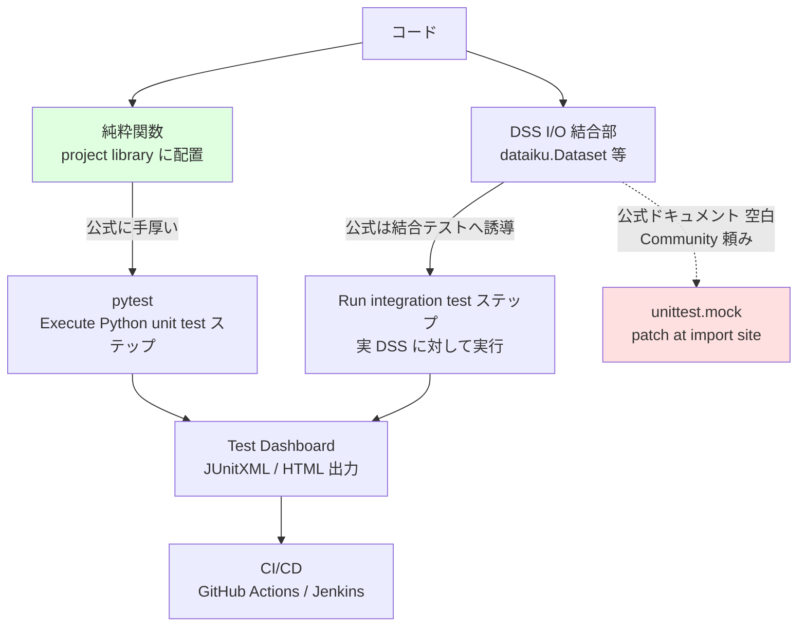

# Cluster 5: Python API と運用品質 — テスト・モック・CI/CD

## Overview

Dataiku の Python API を実務品質で運用するための知見を扱うクラスタ。**明示的なご要望（テストやモック等の運用観点）に直接対応する。**

Dataiku の Python API は2系統ある。`dataiku`（内部 API、DSS 内でのみ動作）と `dataikuapi`（公開 REST クライアント、どこでも動作）。両者は**厳密な包含関係になく**、`dataiku.Dataset.get_dataframe()` のように内部 API にしか無いメソッドが存在する。この非対称性こそがテストの痛みの根源である — **モックしたい対象こそが REST 等価物を持たない**。

本クラスタの最大の発見は、**モックに関する公式ドキュメントが「薄い」のではなく事実上「存在しない」**こと。`DSSClient` のモック方法を問うコミュニティスレッド（2023-11 投稿、2024-07 編集）は**返信ゼロのまま約2.5年放置**されている。中心的なユースケースに対する2年半の無回答は、それ自体が最も明確なシグナルである。

> **GitHub 実地検証による更新（gather フェーズ）**: 2点の重要な訂正がある。
> 1. **`dataiku-api-client-python` には `tests/` ディレクトリが存在しない**。「公式クライアントのテストがモックの参照になるのでは」という期待は成立しない。`.travis.yml` は `nosetests` を指定するが対象テストが無く、対象 Python は 2.7 / 3.4 という化石設定。
> 2. **OSS モックは存在する**。本ファイル初版の「OSS モックライブラリは存在しないと見られる」は**反証された**。**telia-oss/birgitta** が `sys.modules['dataiku'] = mock.MagicMock()` を実装している（MIT / ★16 / 最終 push 2023-11-09）。ただし **PySpark レシピ専用**で汎用 `dataiku` モックではなく、5年以上更新が無い。**「保守された汎用モックは存在しない」と言い直すのが正確**。
>
> そして最も重要な発見は、**公式が示すテストの型そのもの**である。`dss-plugin-template` の Makefile は `export PYTHONPATH=$(PWD)/python-lib` を設定して単体テストを走らせ、その単体テストは **`dataiku` を一切 import しない**（依存は pytest と allure-pytest のみで `mock` すら入っていない）。つまり **Dataiku 公式の推奨は「モックしない」こと**であり、本ファイルが独自に導いた結論は、公式のテンプレートによって裏付けられていた。

その結果、エコシステムは**モックを避ける方向へ誘導している**: ビジネスロジックを project library の純粋関数に寄せて pytest でテストし、DSS 結合部分は実インスタンスに対する結合テスト / test scenario で担保する。公式チュートリアルが**純粋な pandas 変換関数しかテストしていない**（`dataiku.Dataset` に一切触れない）ことは、この設計思想の暗黙の前提を露呈している。

## テスト戦略の全体像



**設計上の含意**: この図の緑（純粋関数）を厚く、赤（モックが必要な領域）を薄くするほど運用が楽になる。**recipe のコードは小さく保ち、ロジックは project library に置く**という公式推奨は、テスト容易性から必然的に導かれる。

## `dataiku` と `dataikuapi`

| | `dataiku` | `dataikuapi` |
|---|---|---|
| 役割 | 内部 API | 公開 REST クライアント |
| 実行場所 | DSS 内のみ | どこでも |
| 対象 | Dataset, Folder, Saved Model, Recipe | Project, Scenario, Bundle 等の管理・自動化 |
| 導入 | DSS にプリインストール | `pip install dataiku-api-client` |

- DSS 内のコードは両方使える。DSS 外は `dataikuapi` のみ。
- **マルチインスタンス注意**: 内部クライアントは multi-client safe ではない。複数サーバに接続する場合は `dataiku.clear_remote_dss()` が必要で、公式は複数環境を扱うなら `dataikuapi` を推奨。CI で複数環境を触る場合に効く。
- **バージョン整合**: PyPI `dataiku-api-client` は DSS と同期リリース（2026-07-13 時点 14.7.1）。**インスタンスの DSS バージョンに合わせてピン留めすること**。

## Keywords

- `dataiku vs dataikuapi`
- `project libraries / lib/python/`
- `external-libraries.json / importLibrariesFromProject`
- `pytest / pytest.ini`
- `Execute Python unit test（scenario step）`
- `Run integration test / WebApp test（scenario step）`
- `Test Dashboard / JUnitXML export`
- `unittest.mock / patch at import site`
- `PYTHONPATH=<DATADIR>/lib/python`
- `dataiku-plugin-tests-utils`
- `Project Deployer / bundle / publish_bundle`
- `GitOps app-note / dataiku_gitops_action.py`
- `code environment / base vs requested packages`
- `Code Studios / VS Code / PyCharm 連携`

## Research Strategy

- **公式チュートリアル「Running unit tests on project libraries」から始める**。構成は `lib/python/<pkg>/` に `__init__.py` + モジュール + `test_*.py` + `pytest.ini`。Build ステップを `pytest.main()` の「Execute Python code」ステップの後段に置き、**グリーンのときだけビルドする**ゲートにするのが公式の型。
- **テスト依存を code env に入れ忘れない**。`pytest` も `mock` も、scenario ステップが選択するコード環境に明示的に追加する必要がある。**これがテストステップ失敗の最頻原因**。`mock` の追加は Dataiku 社員が回答で確認済み（Py3 は `unittest.mock`、Py2 は `mock`）。
- **DSS 外でテストを走らせるには PYTHONPATH を通す**。DSS 内では `<DATADIR>/lib/python` が PYTHONPATH に入っているため `from foo.bar import fun` が解決するが、外では `ModuleNotFoundError` になる。CI でも同様に export する:
  ```bash
  export PYTHONPATH=$PYTHONPATH:/path/to/<DATADIR>/lib/python
  ```
- **モックは定義元ではなくインポート先にパッチする**（標準の `unittest.mock` の作法）。`@patch('your_module.api_client')`。コミュニティの整理が的確: **あなたは Dataiku の API をテストしたいのではない**のだから、フィクスチャを返すようモックしてよい。
- **結合テストのためにデータセット差し替え可能な書き方をする**。差し替わるのはハンドル生成呼び出しの**内側の参照だけ**。`dataiku.Dataset("NAME")` としてテーブル名はオブジェクトから導出する:
  - `.get_config().get('params').get('table')` — 未解決
  - `.get_location_info().get('info').get('table')` — 解決済み
  - `...get('quotedResolvedTableName')` — DB/スキーマ修飾付き
  - SQL クエリを直接参照するデータセットでは機能しない。
- **`dataiku-plugin-tests-utils` をモックライブラリと誤解しない**。これは**実 DSS インスタンスに対して実シナリオを走らせる** pytest プラグインで、モックの正反対。しかも**コミット約19、正式リリース無し**で git ブランチ/タグ指定インストール — 保守性に懸念があり、専用の結合テスト環境にのみ入れるべき（pytest プラグインとして未使用フィクスチャの警告を撒く）。
- 検索クエリ: `Dataiku pytest project libraries`, `Dataiku mock dataiku API unit test`, `Dataiku PYTHONPATH lib python test`, `Dataiku GitOps GitHub Actions bundle`

## Representative Resources

| Title | Type | Year | Summary |
|-------|------|------|---------|
| [Running unit tests on project libraries](https://developer.dataiku.com/latest/tutorials/devtools/project-libs-unit-tests/index.html) | 公式 Developer | — | **出発点**。pytest 構成と Build ゲート。ただし**純粋 pandas 関数しかテストしない**点に注意 |
| [Testing a project (test scenarios)](https://doc.dataiku.com/dss/latest/scenarios/test_scenarios.html) | 公式ドキュメント | — | test scenario フラグ → **Test Dashboard**、**JUnitXML / HTML 出力**（CI 連携の実務的な継ぎ目） |
| [Scenario steps](https://doc.dataiku.com/dss/latest/scenarios/steps.html) | 公式ドキュメント | — | Execute Python unit test（pytest セレクタ）/ Run integration test / WebApp test の3種 |
| [Tutorial \| Test scenarios (KB)](https://knowledge.dataiku.com/latest/automate-tasks/scenarios/tutorial-test-scenarios.html) | 公式 KB | — | Design で作成 → 専用 QA Automation ノードで実行 → レポート出力の推奨フロー |
| [Dataiku Python APIs 入門](https://developer.dataiku.com/latest/getting-started/dataiku-python-apis/index.html) | 公式 Developer | — | `dataiku` / `dataikuapi` の役割分担 |
| [Concept \| Project libraries (KB)](https://knowledge.dataiku.com/latest/code/shared/concept-project-libraries.html) | 公式 KB | — | `lib/python/`、プロジェクト横断共有（`external-libraries.json`）、Global Shared Code の3スコープ |
| [Lib dataiku-api-client-python in unit test mock DSSClient](https://community.dataiku.com/discussion/39164/) | Community | 2023–24 | **公式ドキュメント欠落の証拠。返信ゼロのまま約2.5年**。`get_connection` → `DSSConnectionSettings` → `save()` のモック方法を問うている |
| [Running unit tests and dealing with project paths](https://community.dataiku.com/discussion/24210/) | Community | — | **PYTHONPATH トリック**の一次情報 |
| [Unit Testing: Mock list_users method in Python](https://community.dataiku.com/discussion/35559/) | Community | — | インポート先へのパッチ。「Dataiku の API をテストしているのではない」という整理 |
| [pytest/unittest で mock.patch を使う](https://community.dataiku.com/discussion/20495/) | Community（社員回答） | — | **`mock` を code env の "Packages to Install" に追加**する必要（社員が確認） |
| [How to run integration tests on flows with Python recipes](https://community.dataiku.com/discussion/44854/) | Community | — | データセット差し替えが効く書き方。`get_location_info()` 等の使い分け |
| [dataiku-plugin-tests-utils](https://github.com/dataiku/dataiku-plugin-tests-utils) | OSS（Dataiku） | — | **モックではなく実インスタンス結合テスト用** pytest プラグイン。⚠️ コミット約19・リリース無し |
| [Implementing GitOps for Dataiku (app-note v13)](https://doc.dataiku.com/app-notes/13/implementing-gitops-for-dataiku/) | 公式 app-note | 2024 | **最も完成された GitHub Actions 事例**。dev/staging/prod、`pr.yml`/`release.yml`、`dataiku_gitops_action.py` が **Git と Dataiku の commit SHA を照合**してから進行（Design ノードは Git 外で可変なので実効的な安全弁） |
| [Project Deployer (Python API)](https://developer.dataiku.com/latest/api-reference/python/project-deployer.html) | 公式 Developer | — | `export_bundle` → `publish_bundle` → `start_update`。DSS 9 以降 |
| [CI/CD tutorials (KB)](https://knowledge.dataiku.com/latest/mlops-o16n/ci-cd/) | 公式 KB | — | Jenkins（Deployer 有/無）、API services 向け、Azure Pipelines |
| [Code environments](https://doc.dataiku.com/dss/latest/code-envs/index.html) | 公式ドキュメント | — | 環境ごとに独立。Base Packages（バージョン固定）vs Requested Packages |
| [dss-integration-vscode](https://github.com/dataiku/dss-integration-vscode) / [dss-integration-pycharm](https://github.com/dataiku/dss-integration-pycharm) | OSS（Dataiku） | — | ローカル IDE 連携。recipe / plugin / webapp の編集・実行・デバッグ |

## 公式 vs コミュニティ回避策の切り分け

| 領域 | 状態 |
|------|------|
| `dataiku` / `dataikuapi` の分離 | **公式** |
| project library、`external-libraries.json` | **公式** |
| 純粋関数への pytest | **公式（チュートリアルあり）** |
| unit / integration / webapp シナリオステップ、Test Dashboard、JUnit 出力 | **公式** |
| Project Deployer、bundle、Jenkins/Azure、GitOps GH Action | **公式** |
| code env、IDE 連携、Code Studios | **公式** |
| code env への `mock` 追加 | **コミュニティ（社員確認済み）** |
| `PYTHONPATH=<DATADIR>/lib/python` | **コミュニティ** |
| `dataiku.*` のインポート先パッチ | **コミュニティ**（一般的な Python 作法） |
| データセット差し替え安全な recipe 記法 | **コミュニティ** |
| **`DSSClient` / `DSSConnectionSettings` のモック** | **未回答 — 公式にもコミュニティにも解が無い** |
| `dataiku` 用の OSS モックライブラリ | ⚠️ **telia-oss/birgitta が実在**（PySpark 専用・2023年で停止）。保守された汎用モックは存在しない |
| 公式クライアント（`dataiku-api-client-python`）のテスト | **存在しない**（`tests/` ディレクトリ自体が無い） |
| 公式テンプレート（`dss-plugin-template`）のテスト | **存在する**。`PYTHONPATH=python-lib` で分離し **`dataiku` を import しない純粋関数のみ**を単体テスト |

## 実務上の結論

**モックと戦うのではなく、モックが要らない構造に寄せる。** ビジネスロジック（特徴量生成、uplift スコアの後処理、予算配分計算）を DSS 非依存の純粋関数として project library に置けば、公式に手厚い pytest 経路にそのまま乗る。DSS I/O に触るコードは薄いアダプタ層に閉じ込め、実インスタンスに対する test scenario で担保する。これは Dataiku 公式の「recipe のコードは小さく、project library を厚く」という推奨と完全に一致しており、テスト容易性がその推奨の本当の理由である。
