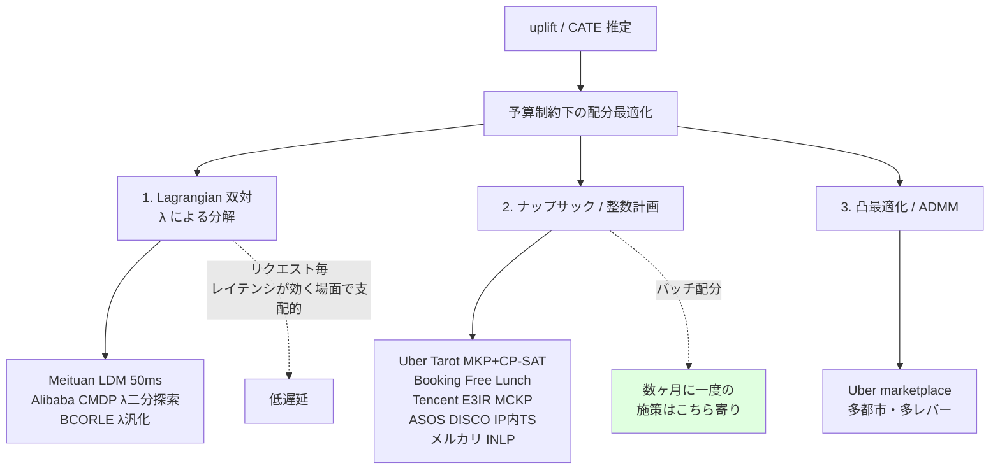
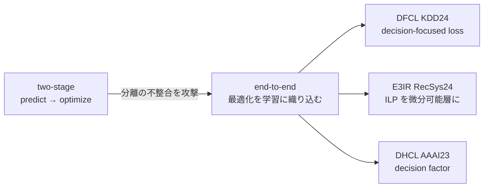

# Cluster 6: 業界事例と予算制約付き配分

## Overview

「他社は実際に何をどう本番投入したか」を扱うクラスタ。**ビジネス事例調査の中核**である。調査の結果、クーポン・インセンティブ配分の本番事例は**ほぼ例外なく「予算制約付き配分」の問題として定式化されている**ことが分かった。純粋な uplift スコアリングで終わる事例は少なく、CATE を推定した後に「限られた原資をどう割り当てるか」という最適化が必ず接続される。この最適化は Dataiku のネイティブ機能には無く、自作が前提になる（→ C3）。

方法論の最大の潮流は **two-stage（predict-then-optimize）から end-to-end への移行**。予測と最適化を分離することの不整合を明示的に攻撃するのが DFCL（decision-focused loss）、E3IR（微分可能 ILP 層）、DHCL（decision factor）で、2023–24 年の industry track に共通する軸である。

日本語一次情報がこのクラスタでは**豊富**（ZOZO / メルカリ / サイバーエージェント / LINEヤフー / DeNA）。しかも**失敗事例が公開されている**点で価値が高い。

## 予算制約付き配分の3パターン

**本ユースケースへの含意**: 施策が数ヶ月に一度＝バッチ配分なので、50ms のリアルタイム制約は無い。したがって Lagrangian の低遅延メリットは不要で、**ナップサック / 整数計画を素直に解く経路（Uber Tarot 型）が最も適合する**。

## two-stage → end-to-end の潮流

## Keywords

- `budget-constrained incentive allocation`
- `Lagrangian duality / dual decomposition`
- `multiple knapsack problem (MKP) / MCKP`
- `OR-Tools CP-SAT`
- `integer nonlinear programming (INLP)`
- `ADMM`
- `decision-focused learning / predict-then-optimize`
- `differentiable ILP layer`
- `isotonic regression（単調性の担保）`
- `Thompson Sampling`
- `two-sided marketplace incentive`
- `多値処置 / 連続割引空間`
- `ROI 制約 / 機会費用`

## Research Strategy

- **Meituan LDM を最良の本番リファレンスとして読む**。XGBoost + isotonic regression + Lagrangian Dual、50ms レイテンシ、1億超ユーザー、年間 CNY 800万の追加利益、Offline-IP 比 300倍高速 — 定量情報の開示が最も充実している。
- **Uber Tarot が本ユースケースに最も近い**。MKP を OR-Tools CP-SAT で解く（HiGHS LP では24時間以上かかったが CP-SAT なら数分）。**四半期予算の消化率 68% → 99.99%** という結果は、「数ヶ月に一度・予算枠あり」という状況にそのまま重なる。Lagrangian を使わず直接 CP で解いている点も、バッチ配分なら妥当。
- **日本語の失敗事例を軽視しない**。サイバーエージェントの Clustered Thompson Sampling は本番4日の A/B で **CTR が減少**（クラスタ分割によるデータ断片化で探索不足）。DeNA は小規模データでは context-free がcontextual を上回ると報告。これらは「バンディットは数ヶ月周期の施策に向かない」という本調査の結論を実証的に補強する。
- **ROI を明示した稀な事例としてメルカリ RIETI DP を押さえる**。「クーポンコスト10円あたり会社収益 約80円増」— OPE ベースでこの水準の開示は珍しい。
- 検索クエリ: `budget constrained incentive allocation uplift`, `knapsack coupon allocation production`, `decision-focused causal learning`, `クーポン配布 アップリフト 予算制約`

## Representative Resources — 国際

| Title | Type | Year | Summary |
|-------|------|------|---------|
| [Meituan: LDM (Lagrangian Dual Method)](https://arxiv.org/abs/2406.05987) | 論文 / 本番 | 2024 | **最良の production 事例**。XGBoost + isotonic regression + Lagrangian Dual。**50ms**、>1億ユーザー/110都市、**年間 CNY 800万の追加利益**、Offline-IP 比 **300倍高速** |
| [Uber: Tarot — Solving Multiple Knapsack](https://www.uber.com/us/en/blog/solving-multiple-knapsack/) | 技術ブログ | 2026-05 | **本ユースケースに最も近い**。MKP を **OR-Tools CP-SAT** で（HiGHS LP は24h+ → CP-SAT は数分）。**四半期予算消化率 68% → 99.99%**。Lagrangian 不使用 |
| [Uber: Practical Marketplace Optimization](https://arxiv.org/html/2407.19078) | 論文 (KDD24 Causal Inference WS) | 2024 | S-Learner+ResNet、単調・凸制約付き B スプライン、ADMM。**wMAPE 7.1%→3.3%、限界効率 +9.23% (US)** |
| [Tencent FiT: E3IR](https://arxiv.org/abs/2408.11623) | 論文 (RecSys 2024) | 2024 | **多選択ナップサック (MCKP)**、**ILP を微分可能層として埋め込み** = end-to-end。隣接処置間の単調性・平滑性制約 |
| [Meituan: DFCL](https://arxiv.org/abs/2407.13664) | 論文 (KDD 2024) | 2024 | decision-focused causal learning、0-1 整数確率計画 |
| [Alibaba: DHCL](https://arxiv.org/abs/2211.15728) | 論文 (AAAI'23) | 2022 | decision factor により OR 解をソート/比較のみで導出、two-stage 分離を回避 |
| [Ant/Alipay: BCORLE(λ)](https://proceedings.neurips.cc/paper/2021/hash/ab452534c5ce28c4fbb0e102d4a4fb2e-Abstract.html) | 論文 (NeurIPS'21) | 2021 | R-BCQ + REME + **λ-generalization**（予算ごとの再学習を回避）。オフライン RL によるクーポン配分 |
| [Ant Group: Offline constrained RL](https://arxiv.org/abs/2309.02669) | 論文 (WSDM'23 Best Paper Candidate) | 2023 | 混合方策で保存量を有限化。**数千万ユーザー、予算10億超、全トラフィック展開** |
| [Booking.com: Free Lunch!](https://arxiv.org/abs/2008.06293) | 論文 (RecSys'20) | 2020 | ナップサック + ROI 制約、Retrospective Estimation。⚠️ CIKM と誤引用されがち |
| [Booking.com: RecSys'22](https://dl.acm.org/doi/10.1145/3523227.3547381) | 論文 | 2022 | **ROI 0.36 で全体処置の 66% の累積 uplift**。promotion の機会費用を明示 |
| [ASOS: DISCO](https://arxiv.org/abs/2406.06433) | 論文 (ECML/PKDD'24 ADS) | 2024 | **IP の内側に Thompson Sampling を埋込**、**連続割引空間上の RBF**、負の価格弾力性を保存。**本番 A/B で平均バスケット額 >1% 改善** |
| [DoorDash: Smarter Promotions with Causal ML](https://careersatdoordash.com/blog/doordash-smarter-promotions-with-causal-machine-learning/) | 技術ブログ | — | Causal ML で incremental orders per dollar を最大化。**RL/バンディットは "future work" と明言** |
| [Lyft: Incentives Platform](https://dl.acm.org/doi/10.1145/3488560.3510018) | 発表 (WSDM'22 Industry Day) | 2022 | 因果推論 + ML + RL のプラットフォーム |
| [Meituan: ECUP](https://arxiv.org/abs/2402.03379) | 論文 (WWW'24 Companion) | 2024 | chain-bias / treatment-unadaptive。**多処置＋全チェーンラベル付きの公開クーポンデータセット**。⚠️ **arXiv 撤回済 (2026-01-23)** |
| [MTMT](https://arxiv.org/abs/2408.12803) | 論文 | 2024 | MMOE + base/incremental 効果分解による多処置 uplift |

## Representative Resources — 日本語 🇯🇵

| Title | Type | Year | Summary |
|-------|------|------|---------|
| [メルカリ: RIETI DP 22-E-097](https://www.rieti.go.jp/jp/publications/nts/22e097.html) | 論文 (RIETI) | 2022 | 成田悠輔・清水亮洋ら。OPE。**クーポンコスト10円あたり会社収益 約80円増** — 稀な ROI 明示事例 |
| [メルカリ: Strategic Coupon Allocation](https://arxiv.org/html/2407.14895v1) | 論文 (KDD 2024 TSMO WS) | 2024 | Uplift + **整数非線形計画**。**供給者側**への配分という two-sided marketplace の珍しい切り口 |
| [メルカリ: Uplift Modeling プロジェクト](https://ai.mercari.com/projects/uplift-modeling/) | 技術サイト | 2022 | Uplift Score で persuadable を特定 → 通知送信可否。**scikit-uplift** を参照 |
| [LINEヤフー: 費用対効果の高いクーポン配布対象者の決定法](https://research.lycorp.co.jp/jp/publications/1960) | 発表 (JSAI2024) | 2024 | 政廣蓮・土岐佳輝。Uplift + **予算制約下**での配布対象決定。※結果はシミュレーションのみ、定量値非公開 |
| [ZOZO: クーポン推薦の改善](https://techblog.zozo.com/entry/improve-coupon-recommendation) | 技術ブログ | 2024 | ⚠️ **uplift ではなく Two-Stage Recommender**（Candidate Generation → Reranking）。LightFM + LightGBM + Vertex AI + MLflow。**本番 A/B: 売上 124.69%・注文数 120.08%** |
| [ZOZO研究所: バンディットアルゴリズムの実運用](https://techblog.zozo.com/entry/zozoresearch-bandit-overviews) | 技術ブログ | 2020 | Bernoulli TS / Logistic TS を **ZOZOTOWN トップページで実配信**。Go + Dataflow ストリーミング学習 |
| [サイバーエージェント: Clustered Thompson Sampling](https://developers.cyberagent.co.jp/blog/archives/25099/) | 技術ブログ | 2020 | **貴重な失敗事例: 本番4日 A/B で CTR 減少**。原因はクラスタ分割によるデータ断片化で探索不足 |
| [サイバーエージェント: バンディットと因果推論](https://speakerdeck.com/cyberagentdevelopers/bandit-algorithm-and-casual-inference) | 発表 (CA BASE CAMP) | 2019 | 安井翔太。バンディットログの素朴評価はバイアス → **IPW で不偏推定**。「意思決定システムと事後評価は一体で設計すべき」 |
| [DeNA: Pococha でのバンディット検証](https://engineering.dena.com/blog/2021/11/pococha-bandit/) | 技術ブログ | 2021 | UCB/LinUCB のオフライン検証。**小規模データではセグメント分割+context-free が contextual を上回る**。コールドスタートではランダムと差なし |
| [Gunosy: クーポン分析](https://data.gunosy.io/entry/coupon-analysis) | 技術ブログ | 2019/20 | EDA 中心（アルゴリズム未適用）/ 傾向スコアマッチング |

## OSS 保守状況（2026-07-15 時点、PyPI/GitHub API で実測）

| Library | PyPI | 最終リリース | 最終コミット | 状態 |
|---|---|---|---|---|
| **CausalML** (Uber) | 0.17.0 | 2026-07-04 | 2026-07-13 | ✅ **活発**。⚠️ Python ≥3.11 必須 |
| **EconML** (py-why/MS) | 0.16.0 | 2025-07-10 | 2026-06-11 | ✅ 活発 |
| **d3rlpy** | 2.8.1 | 2025-03-02 | 2025-09-10 | ✅ 活発 |
| **CausalLift** | 1.1.0 | 2026-04-12 | 2026-04-15 | 🟡 ⚠️ **生存**（放棄説は誤り） |
| **scikit-uplift** | 0.5.1 | 2022-08-11 | 2022-08-11 | ❌ 約4年停止 |
| **OBP / zr-obp** (ZOZO) | 0.5.7 | 2023-04-14 | 2022-11-05 | ❌ 約3.7年休眠 |
| **SCOPE-RL** | 0.2.1 | 2023-07-30 | 2023-12-01 | ❌ 休眠 |
| **UpliftML** (Booking) | 0.0.2 | 2022-11-22 | 2022-12-20 | ❌ 休眠 |
| **pylift** (Wayfair) | — | — | 2022-10-28 | ⛔️ アーカイブ済 |

**エコシステムの二極化**: 網羅的なリファレンス実装（OBP, SCOPE-RL, scikit-uplift, pylift, UpliftML）は 2022–23 で凍結。保守されているのは狭く実用的なもの（CausalML, EconML, d3rlpy, CausalLift）のみ。**研究の産出速度がソフトウェア保守を大きく上回っている**。

⚠️ **注意**: GitHub の `pushed_at` は当てにならない（タグ/ブランチ操作で更新される）。OBP の `pushed_at` は 2024-06-03 だが master 最終コミットは 2022-11-05。`/commits` を見ること。

⚠️ **d3rlpy ↔ SCOPE-RL の連携は壊れている可能性が高い**。SCOPE-RL は 2023年中頃の d3rlpy 2.x 時代に固定されたまま（2023-12 以降コミット無し）、d3rlpy は PyTorch ≥2.5 へ移行済み。古い d3rlpy をピン留めするか自分でパッチする覚悟が必要。
