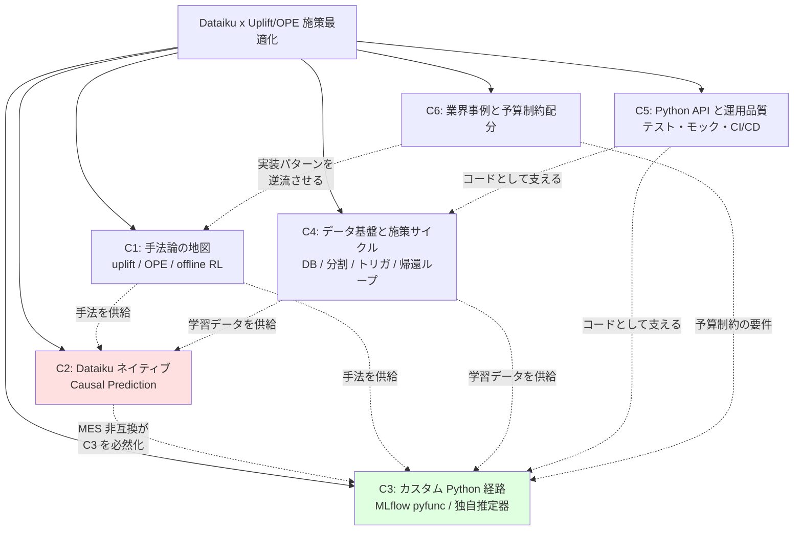
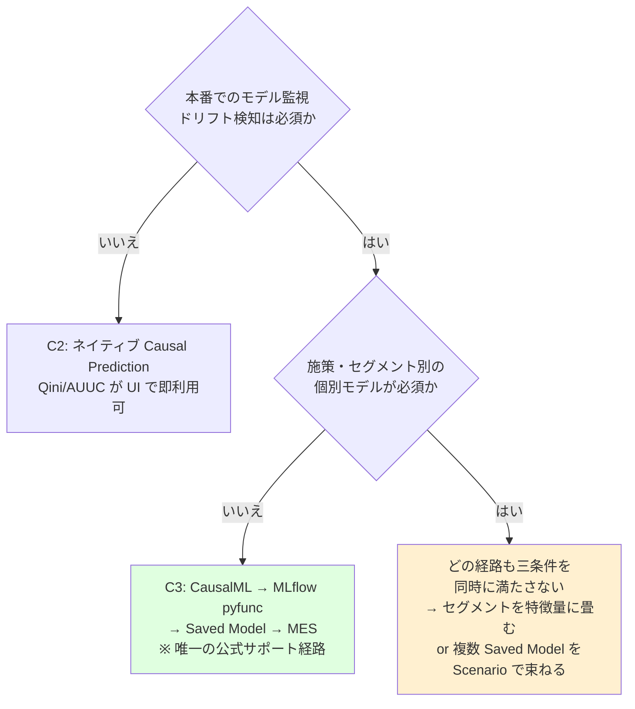
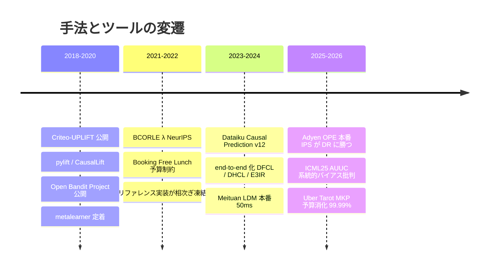

# Dataiku によるマーケティング施策の Uplift / OPE / RL 運用

## Research Parameters

- **調査種別**: 技術トレンド調査 + ビジネス事例調査
- **時間範囲**: 2022 – 2026（過去4年）
- **生成日**: 2026-07-15
- **検索言語**: 英語 + 日本語
- **入力キーワード**: Dataiku, uplift modeling, off-policy evaluation, 強化学習, クーポン配布, 訴求メール, 特徴量管理, 予測パイプライン, モデル評価, Python API, テスト, モック

## Big Picture

本テーマは「**学術的手法論**」「**Dataiku というベンダー製品の実際の機能境界**」「**Python API を用いた実務運用**」の3層が交差する領域である。調査の結果、この3層は素直に積み重ならず、**製品の機能境界に起因する構造的な緊張**がテーマ全体を支配していることが判明した。

最大の発見は、Dataiku のネイティブ Causal Prediction（uplift モデリング、v12.0.0 / 2023-05 導入）が、**Model Evaluation Store・MLflow・モデルエクスポート・Model Document Generator・アンサンブルと公式に非互換**であり、加えて **K-fold CV も非対応**である点である。つまり「Dataiku の組み込み uplift を使う」道と「Dataiku の MLOps 監視基盤でモデルを運用する」道は**同時に選べない**。この非互換は本調査の分割軸そのものであり、クラスタ 2（ネイティブ機能）とクラスタ 3（カスタム Python 経路）を分ける根拠になっている。

> **訂正（gather フェーズで一次情報を確認した結果）**: 本 index の初版は非互換リストに **Partitioned Model** を含めていたが、これは**誤り**であった。公式ドキュメントの非互換リストは上記5項目のみで Partitioned Models を含まない（サイドバーのナビゲーション要素の誤読と判明）。また **IPW / Treatment Analysis は 12.4.0、多値処置は 12.2.0** の追加であり、12.0.0 の機能ではない。**ただし「パーティション別 uplift モデルと MES 監視は両立しない」という結論自体は別経路で確定している**（Evaluate recipe が non-partitioned 限定のため）。

第二の発見は、施策サイクルが「数ヶ月に一度」である以上、**バンディット / オンライン強化学習は形式的に適合しない**ことである。バンディットは高速なフィードバックラウンドを多数必要とするが、年4回程度の施策では探索が成立しない。加えて Dataiku には RL / バンディットのネイティブ機能が**一切存在しない**（検索で見つかる "reinforcement-learning-visual" の KB ページは実体が無い陳腐化インデックス、公式 RL チュートリアルはハイパーパラメータ調整用の Q-learning）。したがって本テーマにおける RL は、**オンライン学習ではなくログデータに対するオフライン方策評価（OPE）・オフライン RL** として位置づけるのが正しい（クラスタ 4）。

第三に、OSS エコシステムは**二極化**している。教科書的に網羅的なリファレンス実装群（OBP, scikit-uplift, pylift, UpliftML, SCOPE-RL）は 2022–2023 年で凍結し、実際に保守されているのは CausalML / EconML / d3rlpy / CausalLift に限られる。研究の産出速度がソフトウェア保守を大きく上回っており、2025 年に Adyen が OPE を本番投入した際も **OBP を採用せず PySpark で推定量を再実装した**。

## Domain Map

**この図の読み方**: 赤（C2）と緑（C3）が本調査の中心的な二者択一である。C2 は実装が容易だが監視・運用が閉ざされ、C3 は自前実装のコストを払う代わりに MLOps 基盤に接続できる。C1 は両者に手法を供給する上流、C4 はデータを供給する上流、C5 は全体を支える横断層、C6 は現実の制約（予算）を突きつける外部知見である。

### 意思決定フロー

### 時系列で見た手法の変遷

## Cluster Summary

| # | クラスタ名 | KW数 | 一行要約 |
|---|-----------|------|---------|
| 1 | 手法論の地図: uplift / OPE / offline RL | 15 | 施策最適化に使う推定量と評価指標の全体像。AUUC 批判が本丸 |
| 2 | Dataiku ネイティブ Causal Prediction | 12 | v12+ の組み込み uplift。強力だが MES 非互換という決定的制約 |
| 3 | カスタム Python 経路と運用化 | 14 | CausalML→MLflow pyfunc が監視と両立する唯一の公式経路 |
| 4 | データ基盤と施策サイクル | 15 | DB pushdown・campaign 別分割・イベント駆動トリガ・帰還ループ |
| 5 | Python API と運用品質（テスト・モック） | 14 | pytest は公式、モックは公式文書が事実上存在しない空白地帯 |
| 6 | 業界事例と予算制約付き配分 | 13 | 国内外の本番事例。予算制約は Lagrangian / ナップサック / ADMM |

## Cluster Details

各クラスタの詳細は個別ファイルを参照。

| # | ファイル | 優先度 |
|---|---------|-------|
| 1 | [cluster-01-methodology-map.md](cluster-01-methodology-map.md) | 中（他クラスタの前提知識） |
| 2 | [cluster-02-dataiku-native-causal.md](cluster-02-dataiku-native-causal.md) | **最高**（意思決定の起点） |
| 3 | [cluster-03-custom-python-path.md](cluster-03-custom-python-path.md) | **最高**（現実的な本命経路） |
| 4 | [cluster-04-data-platform-cycle.md](cluster-04-data-platform-cycle.md) | 高 |
| 5 | [cluster-05-python-api-testing.md](cluster-05-python-api-testing.md) | 高（明示的なご要望） |
| 6 | [cluster-06-industry-cases-budget.md](cluster-06-industry-cases-budget.md) | 中 |

## 推奨読解順序

1. **C2 → C3**: まず製品の機能境界を把握し、ネイティブ経路が自分の要件で成立するか判定する。ここが全ての起点。
2. **C5**: Python API の運用前提（コードをどこに置き、どうテストするか）を固める。C3 の実装可否に直結。
3. **C4**: データ供給とサイクル設計。施策が数ヶ月に一度である以上、トリガ設計が特殊。
4. **C1 → C6**: 手法の選択肢と、他社が実際に何をどう本番投入したかを突き合わせる。

## 調査上の注意（信頼度）

| 項目 | 状態 |
|------|------|
| Dataiku Causal Prediction の MES 非互換 | **公式ドキュメントで明記**（一次情報確認済み・逐語引用まで確認） |
| Causal Prediction の導入バージョン = 12.0.0 | **確認済み**。v13 とする二次情報は誤り |
| v13 / v14 での causal 機能追加 | **無し**。リリースノート全文 grep で確認。**3年間 新機能ゼロ・制約解除ゼロ**（全6件がバグ修正・高速化） |
| IPW / 多値処置の導入バージョン | **訂正済**。IPW=12.4.0、多値処置=12.2.0。**12.0.0 ではない** |
| Causal Prediction と Partitioned Model の非互換 | ⚠️ **公式に記載なし＝未確認**。初版の記載は誤り（サイドバー要素の誤読） |
| MLflow pyfunc → MES 経路 | **公式ドキュメントで明記**。ただし uplift 特化の記述は無く、Qini/AUUC は自作が必要 |
| pyfunc で uplift を宣言する型 | ⚠️ **原理的に未解決**。predict type は分類/回帰/時系列のみで **causal 型が無い**。`set_core_metadata` に何を渡すかも不明 |
| Partitioned Model + カスタムアルゴリズムの併用 | **未確認**。自インスタンスでの検証を推奨 |
| Partitioned Model + MES の併用 | ❌ **不可で確定**。Evaluate recipe が "non-partitioned" 限定と明記 |
| Dataiku の RL / バンディット機能 | **存在しない**（公式 ML 機能一覧に無し。KB の RL ページは実体無し） |
| Dataiku 内部の causal 実装ライブラリ | **非公開**。EconML/CausalML への言及は公式には一切無い |
| `dataiku-api-client-python` の公式テスト | ❌ **`tests/` が存在しない**（GitHub 実地検証）。「公式のモック参照実装」は存在しない |
| `dataiku` の OSS モックライブラリ | ⚠️ **存在する**（telia-oss/birgitta が `sys.modules['dataiku'] = MagicMock()`）。ただし PySpark 専用・2023年で停止。**「皆無」とする初版の記載は反証された** |
| Dataiku 公式のテスト設計思想 | **モックを使わない**。`PYTHONPATH=python-lib` でロジックを分離し純粋関数のみ単体テスト（dss-plugin-template の Makefile で確認） |
| 日本語一次情報（Dataiku 製品側） | **ほぼ皆無**。英語ドキュメントを正とすべき |
| 日本語一次情報（手法・事例側） | **豊富**。ZOZO / メルカリ / サイバーエージェント / LINEヤフー 等 |
