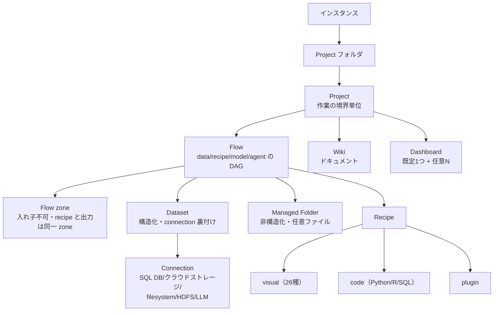
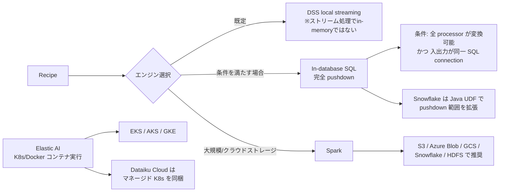

# クラスタ 1: プラットフォーム基盤と実行アーキテクチャ

## 概要

Dataiku の中核オブジェクトモデル（Project / Flow / Dataset / Recipe / Connection）と、その上で計算がどこで実行されるか（pushdown / Spark / Elastic AI）を扱うクラスタです。**DSS 12 → 14 を通じてほとんど変化しない安定した概念基盤**であり、新しいレイヤ（GenAI、エージェント）を読む際の「アンカー」として機能します。

Dataiku 最大の技術的差別化は **pushdown アーキテクチャ** — データを動かさず、既存の SQL DB / Spark / Kubernetes へ計算を押し込む設計です。これが Snowflake / Databricks パートナー戦略（C7）とコスト構造の両方を規定します。

一次資料（公式 doc / Knowledge Base の "Concept |" ページ群）が非常に厚く、信頼性の高い領域です。

## オブジェクトモデル

**Flow の視覚文法**: 青い四角 = Dataset、黄色い丸 = visual recipe、オレンジ = code recipe、赤 = plugin recipe。

## 実行エンジンと pushdown

**pushdown 対象**: Snowflake、BigQuery、Redshift、SQL Server、PostgreSQL、Databricks（SQL warehouse + cluster）、Spark。

**設計思想**: 計算をデータの近くへ移し、ネットワーク越しのデータ移動と帯域コストを最小化する。

## キーワード

- `Project` / `Project folder`
- `Flow` / `Flow zone` / `Flow Assistant`（14）
- `Dataset` / `Managed Folder`
- `Recipe`（visual / code / plugin）
- `Connection`
- `Wiki` / `Dashboard` / `Workspace`
- `Data Catalog` / `Data Collections`（12）
- `build mode` / 依存解決
- `execution engine` / `pushdown`
- `In-database SQL` / `Java UDF`（Snowflake）
- `Spark`
- `Elastic AI` / containerized execution
- `Apache Iceberg`（14）
- `Prepare recipe` / 100+ processors

## visual recipe の全体像（DSS 14 時点で26種）

| 分類 | recipe |
|------|--------|
| 結合 | Join、Fuzzy join、Geo join、Stack、**Upsert**（13） |
| 集約 | Group、Window、Distinct |
| 変形 | Pivot、Split、TopN、Sort、Sample、Sync |
| 生成 | Generate features（12）、Generate statistics、**Extract document content**（14）、Extract failed rows（13） |
| 運用 | Download、List folder contents、List access、Push to editable、Dynamic recipe repeat、Email tester |
| AI 支援 | **Generate Recipe**（13.3.0）、**AI Prepare**（12.5.0） |

**Prepare recipe の processor 分類**（100+）: 変換 / 文字列（正規表現、split） / 日付時刻 / フィルタ・フラグ / 配列・JSON（JSONPath、fold/unfold） / 地理（GeoPoint、GeoIP、距離） / 数値（離散化、丸め、基数変換） / 結合・エンリッチ（fuzzy、geo 含む） / 再形状（pivot、転置、fold）。脱出口として **Python 関数 processor** と **Formula 言語**。

共通ステップ: pre-filter / post-filter / 計算列（Group、Distinct、Sort、Join、Split、Stack、Window、Pivot、TopN で共有）。

## 調査戦略

1. **KB の "Concept |" ページ群を起点にする** — 公式 doc よりも概念の説明が丁寧で、このクラスタは KB の質が特に高い
2. **pushdown を C7（事例・市場）と結び付けて読む** — Snowflake 300+ 共同顧客という数字は pushdown アーキテクチャの帰結であり、技術と GTM が直結している
3. **バージョン固定 URL で recipe セットの成長を測る** — `/dss/7.0/other_recipes/` と `/dss/latest/other_recipes/` の差分が機能追加史になる
4. **他クラスタの実行基盤として参照する** — C3（特徴量）も C4（ML）も、最終的にここで定義されたエンジン上で動く

## 代表リソース

### 中核概念

| タイトル | 種別 | 年 | 概要 |
|---------|------|-----|------|
| [The Flow](https://doc.dataiku.com/dss/latest/flow/index.html) | 公式doc | 2025-26 | data / recipe / model / agent がパイプラインへ繋がる視覚表現 |
| [Flow zones](https://doc.dataiku.com/dss/latest/flow/zones.html) | 公式doc | 2025-26 | 大規模 Flow の分割。入れ子不可、recipe と出力は同一 zone |
| [Concept｜Flow](https://knowledge.dataiku.com/latest/getting-started/dataiku-ui/concept-flow.html) | KB | 2025-26 | 色の意味論: 青四角=dataset、黄丸=visual recipe、橙=code、赤=plugin |
| [Concept｜Project](https://knowledge.dataiku.com/latest/ui/projects/concept-project.html) | KB | 2025-26 | Project = 作業の基本境界単位 |
| [Concept｜Managed folders](https://knowledge.dataiku.com/latest/code/managed-folders/concept-managed-folders.html) | KB | 2025-26 | 非構造化ストレージ。出力には filesystem 系 connection が必要 |
| [Concept｜Dashboards](https://knowledge.dataiku.com/latest/visualize-data/dashboards/concept-dashboards.html) | KB | 2025-26 | 全 project に既定 dashboard が 1つ |
| [Concept｜Build modes](https://knowledge.dataiku.com/latest/data-preparation/pipelines/concept-dataset-build-modes.html) | KB | 2025-26 | dataset の build/rebuild 依存解決 |
| [Projects, Folders, Workspaces, Wikis Views](https://doc.dataiku.com/dss/13//concepts/homepage/projects-folders-dashboards-wikis.html) | 公式doc | 2024 | DSS 13 のオブジェクト分類 — 13 vs 14 の差分基準線 |

### データ準備

| タイトル | 種別 | 年 | 概要 |
|---------|------|-----|------|
| [Visual recipes](https://doc.dataiku.com/dss/latest/other_recipes/index.html) | 公式doc | 2025-26 | 正典的な一覧 — 26種（Upsert、Extract Content、Generate Features 等） |
| [Processors reference](https://doc.dataiku.com/dss/latest/preparation/processors/index.html) | 公式doc | 2025-26 | 約9カテゴリ 100+ processor |
| [Concept｜Group recipe](https://knowledge.dataiku.com/latest/data-preparation/visual-recipes/concept-group-recipe.html) | KB | 2025-26 | SQL の GROUP BY 相当 |
| [Concept｜Window recipe](https://knowledge.dataiku.com/latest/data-preparation/visual-recipes/concept-window-recipe.html) | KB | 2025-26 | 行単位に適用される集約計算 |
| [Concept｜Common steps in visual recipes](https://knowledge.dataiku.com/latest/data-preparation/visual-recipes/concept-common-recipe-steps.html) | KB | 2025-26 | pre/post-filter・計算列の共通仕様 |
| [Visual recipes（DSS 7.0）](https://doc.dataiku.com/dss/7.0/other_recipes/index.html) | 公式doc（旧） | 2020 | recipe セット成長の測定基準線 |
| [Visual Recipes（Academy）](https://academy.dataiku.com/visual-recipes) | 研修 | 2025-26 | 公式ハンズオン |

### 実行アーキテクチャ

| タイトル | 種別 | 年 | 概要 |
|---------|------|-----|------|
| [Execution engines](https://doc.dataiku.com/dss/latest/preparation/engines.html) | 公式doc | 2025-26 | 3エンジン: DSS local streaming / Spark / In-database。Snowflake Java UDF |
| [Concept｜Computation engines](https://knowledge.dataiku.com/latest/data-preparation/pipelines/concept-computation-engine.html) | KB | 2025-26 | recipe ごとのエンジン選択 |
| [Concept｜Where computation happens](https://knowledge.dataiku.com/latest/data-preparation/pipelines/concept-where-compute-happens.html) | KB | 2025-26 | pushdown vs local のメンタルモデル |
| [Reference｜Compute engines on Dataiku Cloud](https://knowledge.dataiku.com/latest/cloud-connections/quotas-compute/reference-compute-engine-overview.html) | KB | 2025-26 | Cloud 固有のエンジン可用性とクォータ |
| [AI Ecosystem / Architecture](https://dataiku.com/product/key-capabilities/architecture) | ベンダー | 2025-26 | pushdown アーキテクチャのベンダー説明 |
| [AI Without Constraints: Harnessing the Right Compute](https://www.dataiku.com/stories/blog/harnessing-the-right-compute-every-time) | ベンダーblog | 2024-25 | 弾力的コンピュート選択の物語 |
| [Best practices for leveraging Dataiku and Snowflake](https://goamplifi.com/knowledge-base/best-practices-for-leveraging-dataiku-and-snowflake) | 第三者 | — | パートナー視点の pushdown 実践 |

### エコシステム

| タイトル | 種別 | 年 | 概要 |
|---------|------|-----|------|
| [Dataiku + Snowflake](https://www.dataiku.com/partners/snowflake) | ベンダー | 2025-26 | **300+ 共同顧客**、Cortex AI 連携、業界コンピテンシー |
| [Dataiku + Databricks](https://www.dataiku.com/partners/databricks) | ベンダー | 2025-26 | SQL warehouse + cluster 連携 |
| [Connect to Dataiku（Azure Databricks）](https://learn.microsoft.com/en-us/azure/databricks/partners/ml/dataiku) | Microsoft Learn | 2025-26 | **第三者執筆**の連携ドキュメント |
| [Connect to Dataiku（Databricks on AWS）](https://docs.databricks.com/aws/en/partners/ml/dataiku) | Databricks Docs | 2025-26 | Databricks 側の連携ドキュメント |

### 日本語

| タイトル | 種別 | 年 | 概要 |
|---------|------|-----|------|
| [DataikuのBasicsチュートリアルをやってみた](https://dev.classmethod.jp/articles/dataiku-basic-tutorial/) | Classmethod | 2023-24 | 日本語オンボーディング |
| [Dataikuを使って、世界一利用者が多い空港を探そう](https://blog.truestar.co.jp/dataiku/20231002/56336/) | truestar | 2023 | 日本語チュートリアル |
| [Dataiku ETLで"データパイプライン"を標準化する](https://note.com/tama_digima/n/ndf145aec5972) | note | 2025 | 情シス視点の ETL 統治 |
| [ビジュアルレシピ上級編（Academy JA）](https://academy.dataiku.com/visual-recipes-102-ja) | 研修(JA) | 2025-26 | **ローカライズ済み公式研修** — 日本市場投資の signal |

## このクラスタの検証課題

| 課題 | 状態 |
|------|------|
| `/dss/latest/` の浮動参照 | DSS 15 公開時に無言で移動する。再現性のため `/dss/14/` へピン留めすること |
| 公開価格 | **存在しない**（contact-sales のみ）。流通する数値（"月$4,000"、"6桁/年"）は全て第三者アグリゲータ発で未検証 |
| 「Dataiku Universe」 | **実在しない**。イベント名は Succeed / Summit / Exchange。調査枠から除外済み |
