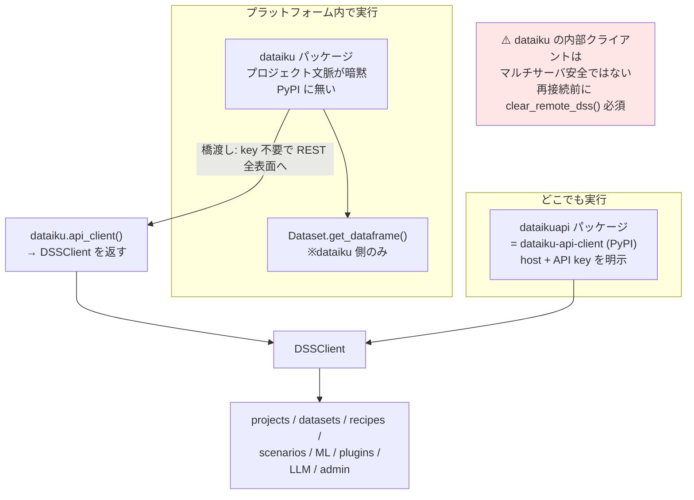
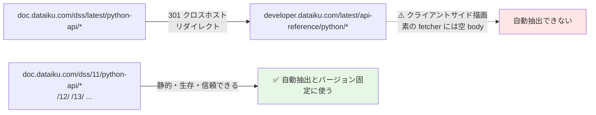
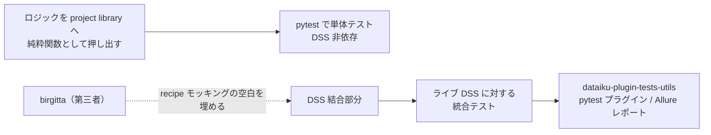

# クラスタ 2: Python SDK と拡張開発 ★重点

## 概要

Dataiku の Python API は **2つのパッケージの二層構造**です。`dataiku` はプラットフォーム内で動く in-platform パッケージ（プロジェクト文脈が暗黙）、`dataikuapi` は公開 REST API のクライアント（host + API key を明示、どこでも動く）。両者は `dataiku.api_client()` が `DSSClient` を返すことで橋渡しされ、in-platform コードは API key 無しで REST 表面全体に到達できます。

本クラスタで最も重要な発見は **`dataiku` パッケージが PyPI に存在しない（過去にも一度も無い）** ことです。`dataiku-internal-client.tar.gz` として**自分の DSS インスタンス自身**（`/public/packages/`）から配布されるため、**到達可能な DSS インスタンス無しに Dataiku の開発環境をブートストラップできません**。公開 PyPI パッケージは `dataiku-api-client` と `dataiku-scoring` の 2つのみで、いずれも DSS バージョンに 1:1 追従します。

もう 1つの構造的制約: **公開 REST API は free edition で利用不可**。外部 IDE 連携の作業が丸ごとブロックされます。

## 二層構造

**解決順序**: `set_remote_dss()` → 環境変数 → `~/.dataiku/config.json` → ローカル文脈。

## パッケージ配布の実態

| パッケージ | PyPI | バージョン | 備考 |
|-----------|------|-----------|------|
| **`dataiku`**（内部） | ❌ **存在しない** | インスタンス依存 | `dataiku-internal-client.tar.gz` を自 DSS の `/public/packages/` から取得。**引いてきたインスタンスにバージョンが溶接される** |
| `dataiku-api-client` | ✅ | 14.7.1（90 リリース） | Apache-2.0。依存は `requests<3` + `python-dateutil` のみ |
| `dataiku-scoring` | ✅ | 14.7.2 | DSS 無しでエクスポート済みモデルを実行 |

> **13.x と 14.x のクライアント系列は並行保守**されています（13.5.6 が 14.0.0 の 3週間後の 2025-07-16 に出荷）。`dataiku-api-client==<DSS_VERSION>` へピン留めしてください。

## ドキュメントの地形（引用作業で重要）

`doc.dataiku.com/dss/latest/` は 2026-07 時点で **DSS 14**。

## 主要な API 表面

| 領域 | 主なクラス / メソッド |
|------|---------------------|
| **クライアント** | `DSSClient`（host / api_key / internal_ticket / jwt_bearer_token）、`dataiku.api_client()`、`get_client_as()`（なりすまし） |
| **Dataset** | `dataiku.Dataset`（`get_dataframe` / `iter_dataframes` / `write_with_schema` / `get_writer`）、`DSSDataset`、サンプリング、パーティション |
| **SQL** | `SQLExecutor2` / `HiveExecutor` / `ImpalaExecutor`（※ DSS 2.1 以来シグネチャ不変 — 製品中で最も安定した表面） |
| **Recipe** | `DSSRecipe` + 型付き settings サブクラス群（Grouping/Sort/Join/Split/Prepare/Window/Pivot…）、`project.new_recipe()` の builder パターン |
| **Project / Flow** | `DSSProject`、`DSSProjectFlow`（zone、グラフ走査、スキーマ伝播） |
| **Folder** | `dataiku.Folder` / `DSSManagedFolder` |
| **Scenario** | `DSSScenario`（外部制御）vs `dataiku.scenario.Scenario`（in-platform）— **紛らわしい分裂**。doc も `scenarios.html` と `scenarios-inside.html` に分かれる |
| **ML** | `create_prediction_ml_task()` / `create_clustering_ml_task()` / `create_timeseries_forecasting_ml_task()` / **`create_causal_prediction_ml_task()`**、`DSSMLTask`（guess → settings → train → `deploy_to_flow`） |
| **MLOps** | Saved Model、MLflow import（Databricks / Unity Catalog 含む）、Model Evaluation Store |
| **API サービス** | `DSSAPIService`、`DSSAPIDeployer`（STATIC/K8S/AZURE_ML/SAGEMAKER/SNOWPARK/VERTEX_AI）、`APINodeClient` |
| **Govern** | `GovernClient`（artifact / blueprint / sign-off）。⚠️ **Unified Monitoring は `DSSClient.get_unified_monitoring()` であって `GovernClient` ではない** |
| **LLM Mesh** | `DSSLLM`、`new_completion()` / `new_embeddings()` / `new_reranking()`、`DSSKnowledgeBank`、`DSSAgent` / `DSSAgentTool`、`BaseAgentTool`、LangChain アダプタ（`DKULLM` / `DKUChatModel` / `DKUEmbeddings`） |
| **管理** | `DSSUser` / `DSSGroup` / `DSSConnection` / `DSSGeneralSettings` / `DSSInstanceVariables` |

### 制御プレーンとデータプレーンの区別

> **最も多いランドスケープ誤認**: Public API = **制御プレーン**（サービスを配備・管理する）、API node user API = **データプレーン**（実際にスコアリングする）。これは**完全に別の 2つの API** であり、混同してはいけません。

## プラグイン開発

**14種以上のコンポーネント型**（doc 自身が「非網羅」と明記）: custom recipes / datasets / macros / formats / webapps / fields / FS providers / preparation processors / prediction algorithms / ML preprocessors / charts elements / sample datasets / LLM connections / tools / agents。

構成: `plugin.json` + コンポーネント別ディレクトリ。recipe は `recipe.json`（meta / inputRoles / outputRoles / params）+ `recipe.py`。dataset は `connector.json` + `connector.py`（`Connector`、`generate_rows`、`get_writer`）。プラグイン用 code env は `code-env/python/spec/`。

## テスト戦略

**公式のモッキングライブラリは存在しません**。Dataiku の指針はアーキテクチャ的です:

`PYTHONPATH` の扱いが要点: DSS 内では `<DATADIR>/lib/python` が含まれるため `lib.python` 接頭辞が不要。外部でテストする際は同じ挙動になるよう `PYTHONPATH` を事前設定します。DSS 内からは `pytest.main()` を project library の絶対パス付きで呼びます。

環境変数: `DKU_DSS_URL` / `DKU_API_KEY`。

## 開発ツール

| ツール | 状態 |
|-------|------|
| **VS Code 拡張** | v1.3.1。recipe / library / wiki / webapp / plugin の編集、リモート+ローカル実行 |
| **PyCharm プラグイン** | ID 12511。recipe / plugin の編集・実行・デバッグ、自動同期（2分ポーリング） |
| `dsscli` | `./bin/dsscli`。users / jobs / scenarios / projects / bundles、`--output json` |
| `dssadmin` / `apinode-admin` | インスタンス運用 / API node 運用 |

## OSS エコシステム（`github.com/dataiku` に約207リポジトリ）

| リポジトリ | ★ | 概要 |
|-----------|---|------|
| **`kiji-proxy`** | **411** | 2025-10 作成。OpenAI リクエストのプライバシープロキシ。**org 内で最多スター** |
| `kiji-inspector` | 109 | 2026 作成。kiji-proxy の相棒 |
| `dataiku-contrib` | 108 | 歴史的な公開プラグインリポジトリ |
| `dataiku-api-client-python` | 43 | SDK ソース。活発に保守 |
| `dataiku-tools` | 36 | 自動化・配備ツール |
| `dataiku-research/cardinal` | 52 | Active Learning → ml-assisted-labeling プラグインへ製品化 |
| `dataiku-research/mealy` | 30 | Model Error Analysis → model-error-analysis プラグインへ製品化 |
| `dss-plugin-template` | 12 | CI 付きプラグイン雛形 |
| `dataiku-plugin-tests-utils` | — | pytest プラグイン、統合テスト用 |

> **注目すべき戦略シグナル**: `kiji-proxy`（411★）と `kiji-inspector`（109★）は **DSS と無関係の LLM プライバシー製品**でありながら、org で最もスターが多いリポジトリになっています。SDK ランドスケープの外側ですが、企業の方向性として記録に値します。
>
> **`dataiku-research` は休眠中**（2023-01 以降更新なし）ですが、成果はプラグインとして製品化されました。

## キーワード

- `dataiku` vs `dataikuapi`
- `DSSClient` / `api_client()` / `set_remote_dss()` / `clear_remote_dss()`
- `dataiku-internal-client.tar.gz` / `/public/packages/`
- `dataiku-api-client` / `dataiku-scoring`（PyPI）
- `SQLExecutor2` / `HiveExecutor` / `ImpalaExecutor`
- `get_settings()` + 型付きサブクラス + `.save()`（新）vs `get_definition_and_payload()`（旧・非推奨）
- `DSSMLTask` / `create_causal_prediction_ml_task()`
- `DSSScenario` vs `dataiku.scenario.Scenario`
- `DSSAPIService` / `DSSAPIDeployer` / `APINodeClient`
- `GovernClient` / `DSSUnifiedMonitoring`
- `DSSLLM` / `DSSKnowledgeBank` / `DSSAgent` / `BaseAgentTool`
- `DKULLM` / `DKUChatModel` / `DKUEmbeddings`（LangChain アダプタ）
- `plugin.json` / `recipe.json` / `connector.json`
- `dsscli` / `dssadmin` / `apinode-admin`
- `dataiku-plugin-tests-utils` / `PYTHONPATH`

## 調査戦略

1. **バージョン固定 URL を使う** — `developer.dataiku.com` はクライアントサイド描画で素の fetcher に空を返す。`doc.dataiku.com/dss/11/python-api/*` 等の静的ミラーが自動抽出の唯一の実用手段
2. **settings-over-payload の近代化（DSS 9→11）を意識する** — `get_definition_and_payload()` / `set_definition_and_payload()` は非推奨だが**両方のパターンが野に残っている**。古い記事のコードは現在の推奨と乖離する
3. **制御プレーン / データプレーンの区別を最初に固定する** — ここを混同したまま調べると全体像が歪む
4. **`create_causal_prediction_ml_task()` に注目** — uplift / 因果推論を Python から制御する入口（C4 参照）
5. **テストは「ロジックを library へ押し出す」前提で読む** — モッキングライブラリを探しても存在しない。設計上の指針そのものが答え
6. **free edition の制約を前提に検証環境を計画する** — 公開 REST API が使えないため外部 IDE 連携が丸ごと不可

### 日本語情報について

**Dataiku Python API に関する実質的な日本語技術資料は発見できませんでした**（`ui_language: "ja"` が `DSSUserPreferences` の値として現れる程度）。このクラスタは事実上英語のみのコーパスです。

## 代表リソース

### 基礎・二層構造

| タイトル | 種別 | 年 | 概要 |
|---------|------|-----|------|
| [The Dataiku Python APIs](https://developer.dataiku.com/latest/getting-started/dataiku-python-apis/index.html) | Getting started | 2026 | **`dataiku`/`dataikuapi` 分裂の正典的説明** |
| [What is the difference between dataiku and dataikuapi?](https://community.dataiku.com/discussion/43588/) | Community | 2024 | 分裂についての公式回答 |
| [The main API client](https://developer.dataiku.com/latest/api-reference/python/client.html) | API ref | 2026 | `DSSClient` の全表面 |
| [The main DSSClient class — DSS 11](https://doc.dataiku.com/dss/11/python-api/client.html) | API ref | 2022 | **静的で取得可能な v11 ミラー** |
| [Reference API doc of dataikuapi — DSS 11](https://doc.dataiku.com/dss/11/python-api/dataikuapi-reference.html) | API ref | 2022 | 全 `dataikuapi` クラスの平坦索引 |
| [Using the APIs outside of DSS](https://doc.dataiku.com/dss/latest/python-api/outside-usage.html) | 公式doc | 2026 | **`dataiku-internal-client.tar.gz`**、`set_remote_dss`、config.json |
| [Using the APIs outside of DSS — DSS 11](https://doc.dataiku.com/dss/11/python-api/outside-usage.html) | 公式doc | 2022 | 全スニペット付きの静的ミラー |
| [Using Dataiku's Python packages](https://developer.dataiku.com/latest/tutorials/devtools/python-client/index.html) | Tutorial | 2026 | ローカル API 環境の構築 |

### データ I/O・Flow 操作

| タイトル | 種別 | 年 | 概要 |
|---------|------|-----|------|
| [Datasets (API reference)](https://developer.dataiku.com/latest/api-reference/python/datasets.html) | API ref | 2026 | `dataiku.Dataset` + `DSSDataset` + `DatasetWriter` |
| [Datasets (reference) — DSS 11](https://doc.dataiku.com/dss/11/python-api/datasets-reference.html) | API ref | 2022 | **最も保存状態の良いスナップショット**（`latest` は 404） |
| [Performing SQL, Hive and Impala queries](https://developer.dataiku.com/latest/concepts-and-examples/sql.html) | Guide | 2026 | executor と `post_queries=['COMMIT']` の注意点 |
| [SQL/Hive/Impala — DSS 7.0](https://doc.dataiku.com/dss/7.0/python-api/sql.html) | 公式doc（旧） | 2019 | **DSS 2.1 以来シグネチャ不変** — 製品中最も安定した表面 |
| [Recipes (API reference)](https://developer.dataiku.com/latest/api-reference/python/recipes.html) | API ref | 2026 | `DSSRecipe`、全 settings サブクラス、creator |
| [Managing recipes — DSS 7.0](https://doc.dataiku.com/dss/7.0/python-api/rest-api-client/recipes.html) | 公式doc（旧） | 2019 | settings 以前の時代 — 非推奨化の時期を特定できる |
| [Projects (API reference)](https://developer.dataiku.com/latest/api-reference/python/projects.html) | API ref | 2026 | `DSSProject`: dataset / ML / job / bundle / LLM / KB |
| [Flow creation and management](https://developer.dataiku.com/latest/api-reference/python/flow.html) | API ref | 2026 | `DSSProjectFlow`、グラフ走査、zone、スキーマ伝播 |
| [Managed folders (API reference)](https://developer.dataiku.com/latest/api-reference/python/managed-folders.html) | API ref | 2026 | `dataiku.Folder` + `DSSManagedFolder` |
| [Working with partitions](https://doc.dataiku.com/dss/latest/partitions/index.html) | 公式doc | 2026 | パーティションモデル |
| [Tip: Interacting with partitioned datasets via API](https://knowledge.dataiku.com/latest/automation/partitioning/tip-interacting-with-partitioned-datasets-api.html) | KB | 2026 | `set_write_partition` / `add_read_partitions` の実践 |

### オーケストレーション

| タイトル | 種別 | 年 | 概要 |
|---------|------|-----|------|
| [Scenarios (API reference)](https://developer.dataiku.com/latest/api-reference/python/scenarios.html) | API ref | 2026 | `DSSScenario`（外部制御） |
| [Scenarios (in a scenario)](https://developer.dataiku.com/latest/api-reference/python/scenarios-inside.html) | API ref | 2026 | in-platform `Scenario` + `BuildFlowItemsStepDefHelper` |
| [Custom scenarios](https://doc.dataiku.com/dss/latest/scenarios/custom_scenarios.html) | 公式doc | 2026 | Python スクリプト scenario |
| [Creating a bundle](https://doc.dataiku.com/dss/latest/deployment/creating-bundles.html) | 公式doc | 2026 | design node での bundle 作成 |

### ML / MLOps

| タイトル | 種別 | 年 | 概要 |
|---------|------|-----|------|
| [Machine learning (API reference)](https://developer.dataiku.com/latest/api-reference/python/ml.html) | API ref | 2026 | `DSSMLTask`、hyperparameter search、forecasting |
| [Visual Machine learning (concepts)](https://developer.dataiku.com/latest/concepts-and-examples/ml.html) | Guide | 2026 | create→guess→settings→train→deploy の実例 |
| [Model Evaluation Stores (concepts)](https://developer.dataiku.com/latest/concepts-and-examples/model-evaluation-stores.html) | Guide | 2026 | MES、drift 計算、制約 |
| [Importing MLFlow models — DSS 10.0](https://doc.dataiku.com/dss/10.0/mlops/mlflow-models/importing.html) | 公式doc | 2021 | **MLflow 対応を DSS 10 に日付特定できる最古のページ** |
| [Quickstart Step 3: Create a Saved Model](https://developer.dataiku.com/latest/getting-started/quickstart-tutorial/step3_ml_deploy_and_eval.html) | Tutorial | 2026 | end-to-end の deploy + eval |

### REST API・認証・管理

| タイトル | 種別 | 年 | 概要 |
|---------|------|-----|------|
| [The REST API](https://doc.dataiku.com/dss/latest/publicapi/rest.html) | 公式doc | 2026 | `/public/api` ベース、Bearer/Basic |
| [Public API Keys](https://doc.dataiku.com/dss/latest/publicapi/keys.html) | 公式doc | 2026 | personal / project / global の 3種、なりすまし |
| [REST API endpoint reference (v14)](https://doc.dataiku.com/dss/api/14/rest) | API ref | 2026 | 全 HTTP エンドポイント仕様（パスのバージョンを差し替え可） |
| [Users and groups](https://developer.dataiku.com/latest/api-reference/python/users-groups.html) | API ref | 2026 | `DSSUser` / `DSSGroup`、`get_client_as()` |

### API サービス / node

| タイトル | 種別 | 年 | 概要 |
|---------|------|-----|------|
| [API Designer](https://developer.dataiku.com/latest/api-reference/python/api-designer.html) | API ref | 2026 | `DSSAPIService`、endpoint builder |
| [API Deployer](https://developer.dataiku.com/latest/api-reference/python/api-deployer.html) | API ref | 2026 | infra（STATIC/K8S/AZURE_ML/SAGEMAKER/SNOWPARK/VERTEX_AI） |
| [API node user API](https://doc.dataiku.com/dss/latest/apinode/api/user-api.html) | 公式doc | 2026 | **スコアリング契約 = データプレーン** |
| [Calling another endpoint](https://doc.dataiku.com/dss/latest/apinode/api/endpoints-api.html) | 公式doc | 2026 | `utils.get_self_client()` の連鎖 |

### プラグイン開発

| タイトル | 種別 | 年 | 概要 |
|---------|------|-----|------|
| [Plugin Components](https://doc.dataiku.com/dss/latest/plugins/reference/plugins-components.html) | 公式doc | 2026 | コンポーネント一覧（**doc 自身が非網羅と明記**）+ 構造 |
| [Component: Recipes](https://doc.dataiku.com/dss/latest/plugins/reference/recipes.html) | 公式doc | 2026 | recipe.json / recipe.py、roles、params |
| [API for plugin datasets](https://developer.dataiku.com/latest/api-reference/python/plugin-components/custom_datasets.html) | API ref | 2026 | `Connector`、`generate_rows`、`get_writer` |
| [Plugins: Other topics](https://doc.dataiku.com/dss/latest/plugins/reference/other.html) | 公式doc | 2026 | `code-env/python` ツリー、`python-lib`、`resource/` |
| [Creating and configuring a plugin](https://developer.dataiku.com/latest/tutorials/plugins/creation-configuration/index.html) | Tutorial | 2026 | plugin.json、dev ディレクトリ、命名 |
| [Setting up a dedicated plugin dev instance](https://developer.dataiku.com/latest/tutorials/plugins/setup-a-dev-env/index.html) | Tutorial | 2026 | 推奨される隔離構成 |
| [Plugin author reference — DSS 3.0](https://doc.dataiku.com/dss/3.0/plugins/writing_reference.html) | 公式doc（旧） | 2015 | 最古の authoring リファレンス |

### 開発ツール・テスト・OSS

| タイトル | 種別 | 年 | 概要 |
|---------|------|-----|------|
| [dataiku-api-client (PyPI)](https://pypi.org/project/dataiku-api-client/) | パッケージ | 2015–2026 | v14.7.1、90 リリース、Apache-2.0 |
| [dataiku-scoring (PyPI)](https://pypi.org/project/dataiku-scoring/) | パッケージ | 2022–2026 | v14.7.2、DSS 無しでモデル実行 |
| [dataiku-api-client-python](https://github.com/dataiku/dataiku-api-client-python) | Repo | 2015–2026 | SDK ソース、43★、活発 |
| [Dataiku DSS VS Code Extension](https://marketplace.visualstudio.com/items?itemName=dataiku.dataiku-dss) | 拡張 | 2019–2025 | v1.3.1 |
| [Dataiku PyCharm plugin](https://plugins.jetbrains.com/plugin/12511) | 拡張 | 2019–2025 | 自動同期、2分ポーリング |
| [dsscli tool](https://doc.dataiku.com/dss/latest/operations/dsscli.html) | 公式doc | 2026 | `--output json` 対応 |
| [Running unit tests on project libraries](https://developer.dataiku.com/latest/tutorials/devtools/project-libs-unit-tests/index.html) | Tutorial | 2026 | **正典的な pytest パターン** |
| [dataiku-plugin-tests-utils](https://github.com/dataiku/dataiku-plugin-tests-utils) | Repo | 2021–2025 | `dku_plugin_test_utils` pytest プラグイン、Allure |
| [dss-plugin-template](https://github.com/dataiku/dss-plugin-template) | Repo | 2020–2025 | CI 付き雛形、12★ |
| [telia-oss/birgitta](https://github.com/telia-oss/birgitta) | 第三者 Repo | 2019– | pyspark recipe 用の ETL テスト/スキーマ枠組み |
| [Reusing Python code](https://doc.dataiku.com/dss/latest/python/reusing-code.html) | 公式doc | 2026 | lib パス、`external-libraries.json`、`pythonPath` |
| [kiji-proxy](https://github.com/dataiku/kiji-proxy) | Repo | 2025–2026 | **411★ — org 最多**。OpenAI プライバシープロキシ（DSS と無関係） |

### LLM Mesh / エージェント（Python 側）

| タイトル | 種別 | 年 | 概要 |
|---------|------|-----|------|
| [LLM Mesh (concepts & examples)](https://developer.dataiku.com/latest/concepts-and-examples/llm-mesh.html) | Guide | 2026 | **この領域で最もコード例が豊富なページ** |
| [LLM Mesh Core](https://developer.dataiku.com/latest/api-reference/python/llm-mesh-core.html) | API ref | 2026 | `DSSLLM`、completion / embeddings |
| [LLM Mesh Integrations](https://developer.dataiku.com/latest/api-reference/python/llm-mesh-integrations.html) | API ref | 2026 | `DKULLM` / `DKUChatModel` / `DKUEmbeddings` |
| [Agents (concepts & examples)](https://developer.dataiku.com/latest/concepts-and-examples/agents.html) | Guide | 2026 | Code / Visual / RAG エージェント、tool、trace、streaming |
| [Creating a Custom Python Tool](https://developer.dataiku.com/latest/tutorials/genai/agents-and-tools/custom-python-tool/index.html) | Tutorial | 2026 | `BaseAgentTool` のライフサイクル |
| [Using OpenAI-compatible API calls via LLM Mesh](https://developer.dataiku.com/latest/tutorials/genai/nlp/openaiXmesh/index.html) | Tutorial | 2026 | OpenAI SDK を `/llms/openai/v1/` に向ける |
| [Building your MCP Server in Dataiku](https://developer.dataiku.com/latest/tutorials/genai/agents-and-tools/mcp/my-mcp/index.html) | Tutorial | 2026 | エージェントを MCP tool として公開 |

## このクラスタの検証課題

| 課題 | 状態 |
|------|------|
| **404 / 未検証の URL**（再確認せず引用しないこと） | `api-reference/python/saved-models.html`、`agents-and-tools.html`（正: `agents.html`）、`api-services.html`（`latest` に無く `/13/` に存在）、`plugins/reference/datasets.html` |
| **未検証のシンボル** | `DSSClient.get_licensing_status()`、`dataiku.Model`、`DSSMLflowExtension`、`ExternalModelVersionHandler`、`get_predecessor_recipes`、`set_scenario_run_result` |
| 「custom auth」プラグインコンポーネント | **文書化されたコンポーネント型ではない** |
| Streamlit「14.3 からネイティブ」 | 検索要約由来でページ本文からは未確認。14.3 リリースノートで要確認 |
| Sphinx の "New in version X" 注記 | 取得した HTML に現れないため、本クラスタのバージョン帰属は**リリースノートからの再構成**であって API ページからの読み取りではない |
| Jenkins CI/CD チュートリアル | **DSS 9 未満に明示的に限定された陳腐化資料**。現行指針は Project Deployer |
