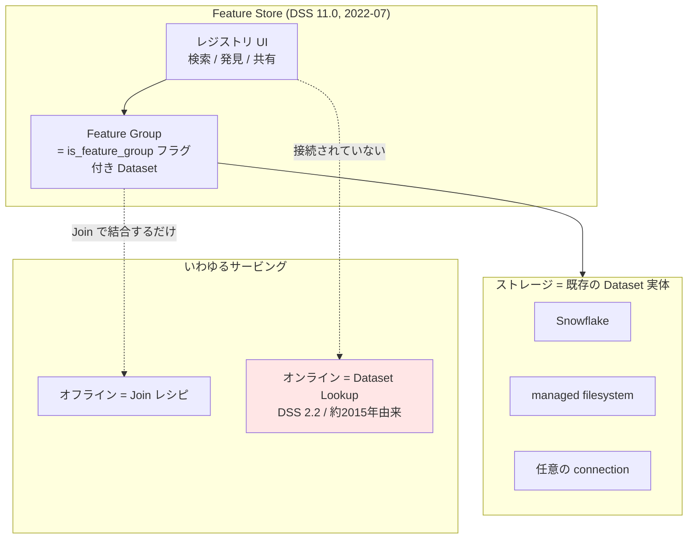

# クラスタ 3: 特徴量エンジニアリングと Feature Store ★★重点

## 概要

Dataiku の Feature Store は DSS 11.0（2022年7月12日）で初出した機能ですが、本調査の結論は明確です — **これは Feast / Tecton が定義する意味での「特徴量ストア」ではなく、統治された「特徴量カタログ」です**。Feature Group の実体は「フラグを立てられた通常の Dataset」であり、専用ストレージ層も特徴量定義 DSL も materialization レイヤも存在しません。発見・再利用・統治という軸では専用 FS より優れる一方、**FS というカテゴリを生んだ 2つの中核課題（point-in-time 正当な学習セット組立、train/serve 一致を伴う低レイテンシ供給）は未解決**です。

さらに重要な構造的発見として、Dataiku が特徴量エンジニアリングで実際に強い部分（Generate Features レシピ、Window レシピ、visual ML の features handling）は **Feature Store とは接続されていません**。「Dataiku は特徴量生成が得意」と「Dataiku は feature store を持つ」は別の命題として扱う必要があります。

## Feature Store の実態



**決定的な証拠**: DSS 11 以前、Dataiku 側は「DSS には専用の feature store コンポーネントが無い」と明言し、代替として (a) Dataset を feature group として使う (b) バッチは Join レシピ (c) オンラインは Dataset Lookup (d) 共有は catalog、を挙げていました。**DSS 11 の Feature Store が出荷したのは、事実上この同じリスト + レジストリ UI** です。新インフラではなく既存回避策の製品化と読むのが正確です。

## Python API の全表面積

```python
import dataiku
client = dataiku.api_client()

# Feature Store の参照
feature_store = client.get_feature_store()            # DSSFeatureStore
feature_groups = feature_store.list_feature_groups()  # -> [DSSFeatureGroupListItem]

# Dataset を Feature Group に昇格 / 解除
project = client.get_project('PROJECT_ID')
ds = project.get_dataset('DATASET_ID')
settings = ds.get_settings()
settings.set_feature_group(True)   # False で解除
settings.save()
```

**これで全部です。** 存在しないもの: `get_historical_features()`、`get_online_features()`、エンティティ / 結合キー登録、feature view 定義、materialization 呼び出し。**API の小ささ自体が最大の発見**です。

既知の注意点: 読み取り権限のあるプロジェクトの feature group のみ列挙される / 作成後インデックスされるまで数秒の遅延がある。

## 専用 Feature Store との比較

| 観点 | Dataiku | Feast / Tecton / Databricks FS / SageMaker FS |
|------|---------|---------------------------------------------|
| レジストリ・発見 | ✅ 良好（per-feature ビュー、タグ、説明） | ✅ |
| オフラインストア | △ 任意の Dataset（専用実装ではない） | ✅ 専用・バージョン管理付き |
| **オンラインストア** | ❌ SQL の Dataset Lookup のみ | ✅ Redis / DynamoDB / Bigtable 級 KV |
| **point-in-time join** | ❌ ネイティブ非対応 | ✅ 中核プリミティブ |
| feature 定義の code 化 | ❌ Dataset であって feature view ではない | ✅ 宣言的（Python / YAML） |
| ストリーミング取込 | ❌ | ✅ Tecton は push ベースで強い |
| **train/serve 一致保証** | △ 規約（共有ライブラリ）のみ | ✅ 単一定義による構造的保証 |
| feature バージョニング | ❌ 手動回避策 | ✅ 組込 |
| 他社 FS との統合 | ❌ ネイティブ無し（各社 Python/R API を叩く） | n/a |
| **lineage / catalog / 統治** | ✅✅ **列レベル lineage、Data Catalog、Govern、Collibra/Alation 連携** | △ 一般に弱い |

**成熟度評価**: 正典的な FS 定義に対して**中核プリミティブ 9項目中およそ 4項目**。周辺（統治・lineage）は専用 FS より強い。

## point-in-time correctness について

公式ドキュメントに記述が一切なく、KB チュートリアルへの逐語照会でも point-in-time / 時間軸 join / データリーク / train-serve skew のいずれもゼロ件でした。2021年の community スレッドは「point-in-time 特徴量取得はカスタム対応が必要」を**制約として**列挙しています。

> ⚠️ **この結論は「文書化された不在」+ community の裏付けによる論証**であり、ベンダーによる明示的否定ではありません。検索スニペットに point-in-time 対応を示唆する文言が現れることがありますが、これは FS 一般論であって Dataiku 固有の記述ではないため、根拠として採用していません。

Dataiku が文書化している唯一の skew 緩和策は**コード共有**（エンドポイントがオフライン生成パイプラインと同じ Python ライブラリを参照できる）ですが、これは強制ではなく規約です。

## 断絶: Generate Features は Feature Store の外にある

**Generate Features レシピ**（v12.0 は SQL 限定、v12.1 で Spark 追加）は 1対1 / 1対多 / 多対1 の関係宣言と時間窓計算により「予測リークの回避」を明示的に謳っています。これは Dataiku における point-in-time 正当な特徴量生成に最も近い機能ですが、**特徴量エンジニアリング側に属し、Feature Store レジストリとは完全に分離**しています。

同様に Data Catalog のドキュメントは Feature Store を一切相互参照しません。

## キーワード

- `Feature Store`
- `Feature Group`
- `is_feature_group` / `set_feature_group`
- `DSSFeatureStore` / `DSSFeatureGroupListItem`
- `Manage Feature Store` 権限
- `Quick sharing`
- `Generate Features レシピ`
- `Window レシピ`
- `Join レシピ`（オフライン供給）
- `Dataset Lookup` / `query enrichment`（オンライン供給）
- `features handling`（visual ML）
- `point-in-time correctness`
- `training/serving skew`
- `列レベル lineage` / `Data Catalog`

## 調査戦略

1. **まず「実態は Dataset である」を起点に読む** — 公式 doc の Feature Store ページより先に community スレッド 17173（2021年6月）を読むと、機能の由来と限界が最短で理解できる
2. **バージョン固定 URL で機能の出自を追う** — `/dss/11/` と `/dss/latest/` の差分、`/dss/2.2/apinode/data_enrich.html` の存在が「オンラインサービングは FS より 7年古い」ことを証明する
3. **マーケ資料と doc を分けて読む** — blog.dataiku.com の主張（「オフライン・オンライン両対応をネイティブサポート」）と doc の実装記述の乖離がこのクラスタの核心
4. **featurestore.org の能力分類でスコアリングする** — 第三者の正典的定義に対して機械的に採点するのが最も公平
5. **「特徴量マート」を Dataiku で作る場合の現実解を評価する** — Marlan（community, 2021）の Netezza 上 270特徴量・日次更新の自前構築が、実は最も実質的な事例。FS 機能を使わない SQL ネイティブ構築である点が示唆的

### 日本語情報について

**4種のクエリ（特徴量ストア / フィーチャーストア / 特徴量マート × 事例/解説/ブログ）で Dataiku Feature Store の日本語記事はゼロ件**でした。これは検索失敗ではなく実在する空白です。日本語の feature store 情報は Databricks / Vertex 系（dotData、Japan Digital Design、ZOZO TECH BLOG）が占めています。日本市場向け成果物を作る場合、**翻訳ではなく原著作業になります**。

## 代表リソース

| タイトル | 種別 | 年 | 概要 |
|---------|------|-----|------|
| [DSS Feature Store（community 17173）](https://community.dataiku.com/discussion/17173/dss-feature-store) | Community | 2021-06 | **最重要**。Dataiku 側が「専用 FS コンポーネントは無い」と回答。point-in-time はカスタム対応要と明記。Marlan の 270特徴量 Netezza 構築事例を含む |
| [Include some feature store functionalities](https://community.dataiku.com/discussion/21879/include-some-feature-store-functionalities) | Community | 2021-12→2022-07 | FEAST を引いた要望 → PM バックログ → 「Dataiku 11 now comes with its feature store」で完結。機能の由来が辿れる |
| [Feature Store（DSS 14 リファレンス）](https://doc.dataiku.com/dss/latest/mlops/feature-store/index.html) | 公式doc | 2026 | 正典的定義: 「Feature Group の中央レジストリ」。offline=Join / online=Dataset Lookup を明記 |
| [Feature Store（DSS 11 python-api）](https://doc.dataiku.com/dss/11/python-api/feature-store.html) | 公式doc | 2022 | バージョン固定の初出 API ページ。11.0 時点の表面積を確定できる |
| [DSS 11 リリースノート](https://doc.dataiku.com/dss/latest/release_notes/11.html) | 公式doc | 2022 | 11.0.0（2022-07-12）の major new features に "MLOps: Feature Store"。11.3.0 で per-feature ビュー追加 |
| [Feature Store — API reference](https://developer.dataiku.com/latest/api-reference/python/feature-store.html) | Developer Guide | 2026 | `DSSFeatureStore` / `DSSFeatureGroupListItem` の全メソッド |
| [Feature Store — concepts & examples](https://developer.dataiku.com/latest/concepts-and-examples/feature-store.html) | Developer Guide | 2026 | `set_feature_group()` / `is_feature_group()`、インデックス遅延と権限の注意点 |
| [Tutorial｜Building your feature store in Dataiku](https://knowledge.dataiku.com/latest/mlops-o16n/feature-store/tutorial-building-feature-store.html) | KB | 2022+ | **能力マッピング表**（registry/offline/online が何に対応するか）。11.0+ と Full Designer ライセンス必須 |
| [How-to｜Add a dataset to the feature store](https://knowledge.dataiku.com/latest/mlops-o16n/feature-store/how-to-add-dataset-to-feature-store.html) | KB | 2026 | 昇格手順: Actions→Publish→Promote as Feature Group。`Manage Feature Store` 権限が必要 |
| [How-to｜Add a feature group to the Flow](https://knowledge.dataiku.com/latest/mlops-o16n/feature-store/how-to-add-feature-group-to-flow.html) | KB | 2026 | 消費側手順: +Dataset > Feature Group → Use |
| [Feature Store（community 33103）](https://community.dataiku.com/t5/General-Discussion/Feature-Store/m-p/33103) | Community | 2023-03 | FS はストレージモデルを強制しないことを確認。スケール時は DB 実体推奨 |
| [Enriching prediction queries](https://doc.dataiku.com/dss/latest/apinode/enrich-prediction-queries.html) | 公式doc | 2026 | 実際の「オンラインサービング」機構 |
| [Exposing a lookup in a dataset](https://doc.dataiku.com/dss/latest/apinode/endpoint-dataset-lookup.html) | 公式doc | 2026 | bundled（数百万行まで）vs referenced（SQL参照）。パイプライン数で同時実行を調整 |
| [Enriching queries in real-time（DSS 2.2）](https://doc.dataiku.com/dss/2.2/apinode/data_enrich.html) | 公式doc | 約2015 | **enrichment が約2015年由来であることの証拠** = オンラインサービングは FS より 7年古い |
| [Concept｜API query enrichments](https://knowledge.dataiku.com/latest/mlops-o16n/real-time-apis/concept-query-enrichments.html) | KB | 2026 | 不正検知/FICO の例。**doc は enrichment と feature group を一度も結び付けない** |
| [Generate features（レシピ）](https://doc.dataiku.com/dss/latest/other_recipes/generate-features.html) | 公式doc | 2023+ | v12.0 SQL限定 → v12.1 Spark 対応 |
| [Concept｜Generate features recipe](https://knowledge.dataiku.com/latest/ml-analytics/feature-engineering/concept-generate-features-recipe.html) | KB | 2023+ | 1-1/1-多/多-1 の関係宣言と「予測リーク回避」。**FS に最も近いが FS の外** |
| [Features handling（visual ML）](https://doc.dataiku.com/dss/latest/machine-learning/features-handling/index.html) | 公式doc | 2026 | target/ordinal/frequency エンコーディング、循環日付、遺伝的アルゴリズム、SSL 表形式埋め込み |
| [Concept｜Window recipe](https://knowledge.dataiku.com/latest/prepare-transform-data/aggregate/concept-window-recipe.html) | KB | 2026 | 累積和・移動平均・順位 = 時間窓の特徴量生成 |
| [Concept｜Data lineage](https://knowledge.dataiku.com/latest/automation/data-quality/concept-data-lineage.html) | KB | 2026 | 列レベル lineage。**Dataiku が専用 FS に勝る軸** |
| [Data Catalog](https://doc.dataiku.com/dss/latest/data-catalog/index.html) | 公式doc | 2026 | Data Collections 等。**Feature Store への相互参照が無い**のが発見 |
| [Setting up Your Feature Store With Dataiku](https://blog.dataiku.com/set-up-feature-store-with-dataiku) | ベンダーblog | 約2022 | 「オフライン・オンライン両対応をネイティブサポート」主張の出典。※301 リダイレクトで全文未取得 |
| [Reuse at Its Best: The Benefits of Feature Stores](https://blog.dataiku.com/reuse-at-its-best-the-benefits-of-feature-stores) | ベンダーblog | 2022年3月頃 | **11.0 より前の日付**であること自体が発見。※全文未取得 |
| [Feature Store Comparison 2026: Feast, Tecton, Hopsworks](https://mlopsplatforms.com/posts/feature-store-comparison-2026/) | 第三者 | 2026 | ランドスケープの基準線。**Dataiku は比較対象に入っていない** |
| [What Is a Feature Store? Feast, Tecton & AWS Compared](https://tacnode.io/post/what-is-an-online-feature-store-definition-architecture-use-cases) | 第三者 | 2026 | dual-store vs unified のアーキテクチャ分類 |
| [How to Evaluate a Feature Store](https://tacnode.io/post/how-to-evaluate-a-feature-store) | 第三者 | 2026 | Dataiku を採点するための評価基準 |
| [Why You Don't Want to Use Your Data Warehouse as a Feature Store](https://mlops.community/why-you-dont-want-to-use-your-data-warehouse-as-a-feature-store/) | 第三者 | n/a | **直接適用可能な批判** — Dataiku FS は warehouse-as-FS に近い |
| [featurestore.org](https://www.featurestore.org/) | リファレンス | 2026 | 正典的な能力分類 |
| [[Dataiku v12] 新機能! Generate Features](https://blog.truestar.co.jp/dataiku/20230629/54622/) | 日本語blog | 2023-06-29 | **唯一の実質的な日本語 FE 記事**。ただし Feature Store ではなく Generate Features |
| [Dataikuのコラボレーション（日本語）](https://www.dataiku.com/ja/製品/key-capabilities/コラボレーション/) | 公式(JA) | 2026 | 「フィーチャーストア」の唯一の日本語言及 — ハブ列挙の中の一単語のみ |

## このクラスタの検証課題

| 課題 | 状態 |
|------|------|
| DSS 11.0.0 リリースノートの Feature Store 本文 | 全 fetch で切り詰められ、箇条書き見出しのみ逐語確認済み |
| blog.dataiku.com の 3記事 | 301 リダイレクトで全文未取得。`/stories/blog/` slug での再試行を推奨 |
| point-in-time 非対応 | 文書化された不在 + community 裏付け。ベンダーの明示的否定は未取得 |
| ベンダー blog の公開年 | LinkedIn アクティビティからの推定を含む。近似値として扱うこと |
