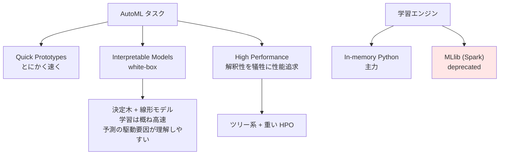
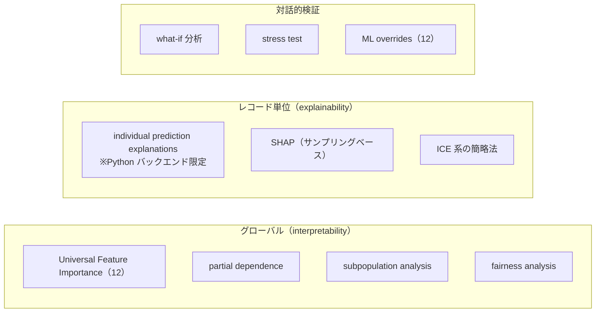

# クラスタ 4: Visual ML / AutoML と解釈性

## 概要

Dataiku の visual ML は「AutoML でありながらブラックボックスではない」ことを設計思想に据えています。Lab 上の **visual analysis** で試行し、Flow へ **Saved Model** としてデプロイする流れが基本形で、**3つの予測スタイル**（Quick Prototypes / Interpretable Models / High Performance）によって速度・解釈性・性能のトレードオフを明示的に選ばせます。

解釈性まわりは Dataiku の強い領域で、SHAP・partial dependence・subpopulation analysis・fairness report・what-if・stress test を標準搭載します。ただし **individual prediction explanations は Python バックエンドで学習したモデル限定**という制約があります。

本クラスタは設計時（design-time）に限定し、デプロイ後の運用（Saved Model のバージョン管理、drift、MES）は **C5（MLOps）** の担当です。

## 予測スタイルと解釈性のトレードオフ

**解釈性 vs 説明性の区別**（KB が明示）: interpretability = グローバル（モデル全体の振る舞い）、explainability = レコード単位（個別予測の根拠）。

## 対応タスクとアルゴリズム

| タスク | 備考 |
|--------|------|
| prediction（教師あり） | 分類・回帰。回帰は予測区間の出力可（12） |
| clustering | 教師なし |
| **time series forecasting** | 11 で visual 化。SARIMA（13 で固定次数）、**TFT / NHITS / TabICL（14）** |
| **causal prediction** | **12 で追加** — uplift/因果推論に関心があるなら要注目 |
| computer vision | 画像分類・物体検出 |
| deep learning | |
| **Visual GLM** | **14 で追加** |

**特徴量処理の自動化**: features handling（target/ordinal/frequency エンコーディング、rescaling、循環日付、テキスト/ベクトル/画像、遺伝的アルゴリズム、SSL 表形式埋め込み）、準自動の大量特徴量生成、任意の特徴量選択、**XGBoost/LightGBM/TabICL ではカテゴリ前処理をスキップ可（14）**。

## 解釈性・説明性の機能群

**個別予測説明の 2方式**: (1) Shapley 値ベースの簡略法 — 特徴量をランダムに入れ替えた予測群の平均との差分で寄与を計算、(2) もう 1方式。いずれも **Python バックエンドで学習した visual ML モデルのみ**で利用可能。

## キーワード

- `visual analysis` / `Lab` / `Saved Model`
- `AutoML モード` vs `Expert モード`
- `Quick Prototypes` / `Interpretable Models` / `High Performance`
- `In-memory Python` エンジン / `MLlib`（deprecated）
- `causal prediction`（12）
- `Visual GLM`（14）
- `TFT` / `NHITS` / `TabICL`（14）/ `SARIMA`
- `features handling`
- `SHAP` / `Shapley values`
- `partial dependence` / `ICE`
- `Universal Feature Importance`（12）
- `subpopulation analysis`
- `fairness analysis`
- `what-if` / `stress test`
- `ML overrides`（12）

## 調査戦略

1. **設計時と運用時の境界を意識する** — Saved Model が Flow に出た瞬間から C5 の領域。両クラスタで重複調査しないよう注意
2. **causal prediction（12）に注目する** — uplift / 因果推論の文脈では、Dataiku がネイティブに何を持つかがこの機能に集約される
3. **「AutoML だがブラックボックスではない」というベンダー主張を検証する** — Interpretable Models スタイルと解釈性機能群がその根拠。実際に white-box を選べる設計になっているかを doc で確認できる
4. **アルゴリズムの網羅列挙には追加取得が必要** — DSS 14 の algorithms hub ページはナビゲーション索引であり、実際のアルゴリズム一覧はエンジン別の子ページにある
5. **MLlib の deprecated 化に注意** — Spark ベースの ML を前提とした古い記事は現在の推奨と乖離している

## 代表リソース

| タイトル | 種別 | 年 | 概要 |
|---------|------|-----|------|
| [Automated machine learning](https://doc.dataiku.com/dss/latest/machine-learning/auto-ml.html) | 公式doc | 2025-26 | 3つの予測スタイルの定義 |
| [ML algorithms（hub）](https://doc.dataiku.com/dss/latest/machine-learning/algorithms/index.html) | 公式doc | 2025-26 | 2エンジン: **In-memory Python** と **MLlib（deprecated）** |
| [Individual prediction explanations](https://doc.dataiku.com/dss/latest/machine-learning/supervised/explanations.html) | 公式doc | 2025-26 | **Python バックエンド限定**。Shapley 簡略法を含む2方式 |
| [Features handling（visual ML）](https://doc.dataiku.com/dss/latest/machine-learning/features-handling/index.html) | 公式doc | 2026 | 各種エンコーディング、循環日付、遺伝的アルゴリズム、SSL 表形式埋め込み |
| [Concept｜Interpretability](https://knowledge.dataiku.com/latest/ml-analytics/responsible-ai/concept-interpretability.html) | KB | 2025-26 | **interpretability（グローバル）vs explainability（レコード単位）**の区別 |
| [Concept｜Quick models in Dataiku](https://knowledge.dataiku.com/latest/ml-analytics/model-design/concept-quick-visual-ml-models.html) | KB | 2025-26 | Quick Prototypes の位置づけ |
| [Concept｜Features handling](https://knowledge.dataiku.com/latest/ml-analytics/model-design/concept-feature-handling.html) | KB | 2026 | KB レベルの特徴量処理入門 |
| [Machine Learning & Analytics（KB hub）](https://knowledge.dataiku.com/latest/kb/analytics-ml/visual-ml.html) | KB | 2025-26 | visual ML の入口 |
| [AutoML Model Design（ハンズオン）](https://knowledge.dataiku.com/latest/courses/visual-machine-learning/advanced/visual-ml-enhancements/visual-ml-enhancements-hands-on.html) | KB course | 2025-26 | 上級 visual ML 設計ラボ |
| [AutoML Model Results](https://knowledge.dataiku.com/latest/ml/model-results/index.html) | KB | 2025-26 | モデル結果の読み方 |
| [Concept｜Model validation and evaluation](https://knowledge.dataiku.com/latest/ml-analytics/model-scoring/concept-model-validation-evaluation.html) | KB | 2024-25 | validation と evaluation の区別 — C5 への接続点 |
| [SHAP (Shapley values) in Dataiku](https://community.dataiku.com/discussion/22241/shap-shapley-values-in-dataiku) | Community | 2022-24 | SHAP のサンプリング行の仕組みを解説 |
| [How Dataiku Keeps You in the Driver's Seat With AutoML](https://www.dataiku.com/stories/blog/how-dataiku-keeps-you-in-the-drivers-seat-with-automl) | ベンダーblog | 2022-24 | 反ブラックボックス AutoML の位置づけ |
| [Explaining AutoML: What It Is and How Dataiku Can Help](https://blog.dataiku.com/explaining-automl-what-it-is-and-how-dataiku-can-help) | ベンダーblog | 2022-23 | AutoML の定義的解説 |
| [Dataiku Makes ML Accessible, Transparent, & Universal](https://www.dataiku.com/stories/blog/dataiku-ml-key-capabilities) | ベンダーblog | 2022-24 | fairness・what-if・stress test を扱う |
| [Enterprise ML platform / AutoML capability](https://www.dataiku.com/product/key-capabilities/deliver-more-models-with-dataiku-automl/) | ベンダー | 2025-26 | 能力マーケティングページ |
| [Alteryx to Dataiku: AutoML](https://www.dataiku.com/stories/blog/alteryx-to-dataiku-automl) | ベンダーblog | 2023-25 | 競合移行の位置づけ |
| [AI & 機械学習のためのDataiku（日本語）](https://www.dataiku.com/ja/製品/aiと機械学習のためのdataiku/) | 公式(JA) | 2026 | 日本語の 自動特徴量生成・削減 / AutoML 説明 |

## このクラスタの検証課題

| 課題 | 状態 |
|------|------|
| アルゴリズムの完全な列挙 | DSS 14 の algorithms hub は索引ページ。エンジン別子ページの追加取得が必要 |
| individual prediction explanations の 2方式 | 1方式（Shapley 簡略法）は確認済み。もう1方式の詳細は未取得 |
| MLlib deprecated の正確な時期 | deprecated 表記は確認したが、どのバージョンからかは未特定 |
