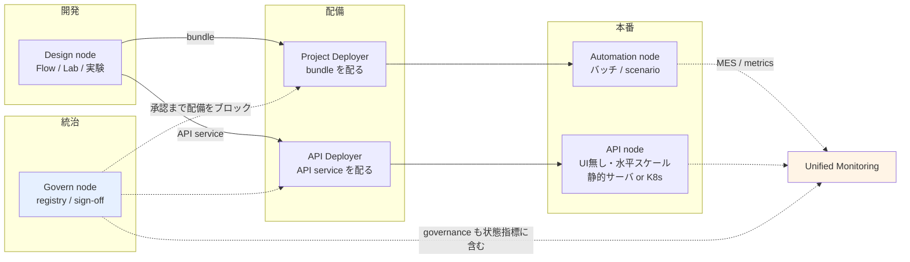
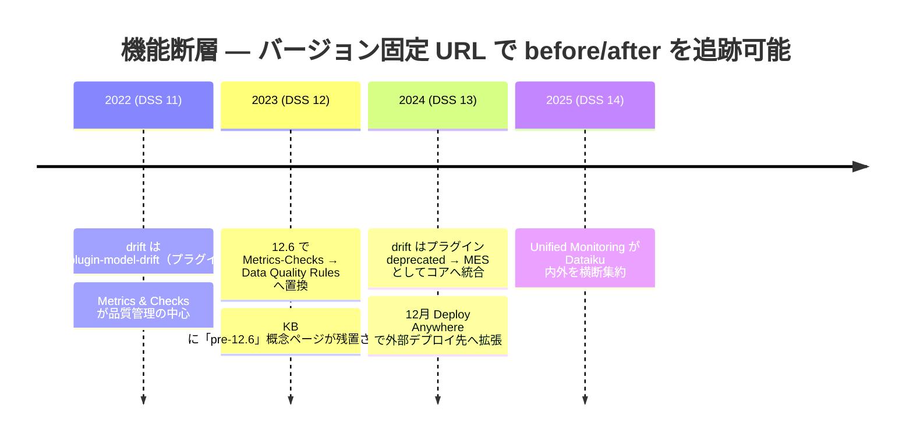
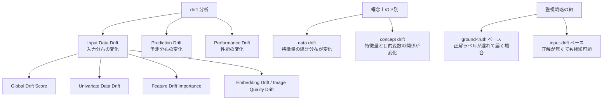

# クラスタ 5: MLOps と本番運用 ★★重点

## 概要

Dataiku の MLOps は、MLflow のような「ライブラリ + マネージドサービス」ではなく **node 分離アーキテクチャ**として構成される点が最大の構造的差異です。Design（開発）/ Automation（本番バッチ）/ API（リアルタイム）/ Deployer（配備）/ Govern（統治）の 5 node が役割を分担し、**Deployer が全体の組織原理**として機能します。

一次資料が最も厚い領域で、公式 doc・Knowledge Base ともに充実しています。2022–2026 の窓には**明確に日付を特定できる 2つの機能断層**があり、これが本クラスタの時間軸を規定します — (1) drift がプラグインからコア（MES）へ移動、(2) Metrics & Checks が DSS 12.6 で Data Quality Rules に置換。

さらに 2024年12月の **Deploy Anywhere** 以降、Dataiku は競合クラウド ML プラットフォームと**競合する**位置から、それらの**上に乗る**位置へ移行しており、「Dataiku vs SageMaker」という比較の立て方自体が部分的に無効化されています。

## node 構成

**Deployer は 2つに分かれます**: Project Deployer（bundle → Automation node）と API Deployer（API service → API node）。Deployer は専用 node にも Design node への同居にも構成できます。配備には *infrastructure* と *deployment stage*（Dev/Test/Prod）の概念が伴います。

## 2つの機能断層（2022-2026）

| 断層 | 証拠 |
|------|------|
| **drift: プラグイン → コア** | `dss-plugin-model-drift` の GitHub とプラグインページが**明示的に deprecated 表記**。以降は Model Evaluation Store がネイティブに担当 |
| **Metrics & Checks → Data Quality Rules** | DSS 12.6 で置換。KB が「pre-12.6」概念ページを意図的に残しており、移行そのものが追跡可能 |

## drift の分類

> ⚠️ **未確認事項**: PSI・Kolmogorov–Smirnov 検定・domain classifier といった具体的な統計量名は Dataiku に広く帰属されていますが、取得した doc ページからは**確認できていません**。drift 種別ごとの子ページを追加取得するまで、これらの名称は未検証として扱ってください。

## Unified Monitoring

Dataiku Projects / DSS Endpoints / External Endpoints を横断する監視ハブで、**Prometheus 連携**とアラートを備えます。6つの状態指標を持ちます: global / deployment / model / execution / data / **governance**。

**governance が状態指標に含まれる**点が重要で、これは C5（MLOps）と C6（ガバナンス）が主題的にではなく**製品レベルで結合している**ことを意味します。両者を完全に独立したクラスタとして扱うべきではありません。

> ⚠️ **未確認事項**: Unified Monitoring の導入バージョンは特定できていません。DSS 14 の doc にも記載がなく、「6つの状態指標」は KB 概念ページと 2025年のベンダーページ由来です。2024年の "Superlative Awards" 記事から**2024年時点で主要機能だった**ことは分かりますが、初出バージョンは DSS 12/13 のリリースノートで要検証です。

## CI/CD の構造

全ての CI/CD 経路は **Python API client（`dataiku-api-client`）** を通ります。したがって Python を実行できる CI ツールなら何でも動作します。**bundle が成果物（artifact）の単位**です。

標準ステージ: `PREPARE → PROJECT_VALIDATION → CREATE_BUNDLE → PREPROD_TEST → DEPLOY_TO_PROD`

> **発見: GitHub Actions の公式資料が存在しない**。Dataiku は **Jenkins（3パターン）**と **Azure DevOps** の一次チュートリアルを提供する一方、GitHub Actions と GitLab CI の公式資料はありません。実務上は Python API 経由で問題なく動きますが、公式資料の不在自体がランドスケープ上の意味を持ちます。ユーザーは community / 第三者記事へ誘導されています。

Jenkins の「Project Deployer あり / なし」の 2パターンが公式に併存することは、**アーキテクチャ上の分岐が公認されている**ことを示します。

## キーワード

- `Design / Automation / API / Deployer / Govern node`
- `Project Deployer` / `API Deployer`
- `bundle` / `infrastructure` / `deployment stage`
- `Saved Model` / `active version` / `Make Active`
- `Model Evaluation Store (MES)`
- `champion / challenger` / `Model Comparisons`
- `Evaluate レシピ`
- `Input Data Drift` / `Prediction Drift` / `Performance Drift`
- `data drift` vs `concept drift`
- `Unified Monitoring` / `Prometheus`
- `Scenario` / `trigger` / `metrics` / `checks`
- `Data Quality Rules`（12.6 で Metrics & Checks を置換）
- `dataiku-api-client`（CI/CD の実装手段）
- `External Models` / `Deploy Anywhere`
- `MLflow import` / `Unity Catalog`
- `Elastic AI` / containerized execution

## 調査戦略

1. **Deployer を軸に読む** — node を個別に追うより、Project Deployer / API Deployer が何を配るかを先に押さえると全体が繋がる。クラスタを統合する必要が生じた場合、「Deployer 中心の運用化」が自然な統合軸
2. **バージョン固定 URL で断層を追う** — `/dss/11/`・`/dss/12/`・`/dss/10.0/` と `/dss/latest/` の差分が、機能の導入時期を確定する唯一の信頼できる手段。`/dss/latest/` は浮動参照で DSS 15 公開時に無言で移動する
3. **C6（ガバナンス）と併せて読む** — Unified Monitoring の状態指標に governance が含まれる以上、分離は不正確
4. **C9 相当（相互運用）と C10 相当（競合比較）を同時に扱う** — Deploy Anywhere により「Dataiku vs SageMaker」の問いは部分的に解消される。分離して調べると誤ったランドスケープを描く
5. **一次資料の質を活かす** — 本クラスタは doc/KB が非常に厚い希少領域。ベンダーマーケに頼る必要がほぼない

### 日本語情報について

日本語の独立した技術記事は**実質的に存在しません**。日本語コーパスは Qiita の公式 Dataiku アカウント投稿、`/ja/` ミラー、Academy JP に限られます。独立した日本語記事 2件（tcdigital、NTT）は**ベンダー中立な MLOps 一般論で、Dataiku に一度も言及しません**。これは言語ファセットであってクラスタではないため、C1–C7 の属性として記録すべき「発見」です。

## 代表リソース

### node 構成・配備

| タイトル | 種別 | 年 | 概要 |
|---------|------|-----|------|
| [Production deployments and bundles](https://doc.dataiku.com/dss/latest/deployment/index.html) | 公式doc | 2025 | 配備ドキュメント群の起点。bundle / Deployer / infrastructure / stage |
| [Setting up the Deployer](https://doc.dataiku.com/dss/latest/deployment/setup.html) | 公式doc | 2025 | 専用 node vs Design 同居。Project / API Deployer の分割 |
| [Concept｜Dataiku architecture for MLOps](https://knowledge.dataiku.com/latest/mlops-o16n/architecture/concept-dataiku-architecture.html) | KB | 2024–25 | 5 node の正典的概観と結線 |
| [API Node & API Deployer](https://doc.dataiku.com/dss/latest/apinode/index.html) | 公式doc | 2025 | API node は UI 無しのサーバアプリ |
| [Concept｜API Deployer](https://knowledge.dataiku.com/latest/mlops-o16n/real-time-apis/concept-api-deployer.html) | KB | 2024–25 | 1つの service を複数 API node へ展開する仕組み |
| [Automation nodes（code envs）](https://doc.dataiku.com/dss/latest/code-envs/automation.html) | 公式doc | 2025 | Automation node の code env 管理 — 本番でよくある落とし穴 |

### モデルライフサイクル

| タイトル | 種別 | 年 | 概要 |
|---------|------|-----|------|
| [Concept｜Model evaluation stores](https://knowledge.dataiku.com/latest/mlops-o16n/model-monitoring/concept-model-evaluation-stores.html) | KB | 2024–25 | **MES = Dataiku の看板オブジェクト**。MLflow に 1:1 対応物が無い |
| [Automating model evaluations and drift analysis](https://doc.dataiku.com/dss/latest/mlops/model-evaluations/automating.html) | 公式doc | 2025 | Evaluate レシピ + MES を scenario に組み込む |
| [Model Comparisons](https://doc.dataiku.com/dss/latest/mlops/model-comparisons/index.html) | 公式doc | 2025 | champion vs challengers の比較 |
| [Concept｜Model comparisons](https://knowledge.dataiku.com/latest/mlops-o16n/model-monitoring/concept-model-comparisons.html) | KB | 2024–25 | champion = 配備中 or 最良モデル |
| [MLOps: Champion/Challenger Model Evaluation](https://blog.dataiku.com/mlops-champion-challenger-model-evaluation) | ベンダーblog | 2022–23 | 比較ではなく**配備パターン**としての champion/challenger |
| [Interaction with saved models（Python API）](https://doc.dataiku.com/dss/11/python-api/saved_models.html) | 公式doc | 2022 | プログラム的なバージョン管理・active version 意味論 |
| [Automate selecting champion model and challenger model](https://community.dataiku.com/discussion/33215/automate-selecting-champion-model-and-challenger-model) | Community | 2023 | **実務の摩擦**: 昇格の自動化は標準機能ではない |
| [change model version](https://community.dataiku.com/discussion/33877/change-model-version) | Community | 2023 | Make Active / rollback の実際 |

### 監視・drift

| タイトル | 種別 | 年 | 概要 |
|---------|------|-----|------|
| [Drift analysis](https://doc.dataiku.com/dss/latest/mlops/drift-analysis/index.html) | 公式doc | 2025 | 3種の drift と data/concept drift の定義 |
| [Input Data Drift](https://doc.dataiku.com/dss/latest/mlops/drift-analysis/input-data-drift.html) | 公式doc | 2025 | Global Drift Score / Univariate / Feature Drift Importance / Embedding / Image Quality |
| [Input Data Drift（DSS 11）](https://doc.dataiku.com/dss/11/mlops/drift-analysis/input-data-drift.html) | 公式doc | 2022 | v11 基準線 — v14 と差分を取ると非構造化/埋め込み drift の追加時期が分かる |
| [Drift analysis（DSS 10.0）](https://doc.dataiku.com/dss/10.0/mlops/drift-analysis/index.html) | 公式doc | 2022 | ネイティブ drift 分析の窓内最古スナップショット |
| [Concept｜Monitoring model performance and drift in production](https://knowledge.dataiku.com/latest/deploy/model-monitoring/concept-monitoring-models-in-production.html) | KB | 2024–25 | **ground-truth ベース vs input-drift ベース**の戦略軸 |
| [Unified Monitoring](https://doc.dataiku.com/dss/latest/mlops/unified-monitoring/index.html) | 公式doc | 2025 | Projects / DSS Endpoints / External Endpoints + Prometheus |
| [Concept｜Unified Monitoring](https://knowledge.dataiku.com/latest/deploy/scaling-automation/concept-unified-monitoring.html) | KB | 2024–25 | 6つの状態指標（governance を含む） |
| [dss-plugin-model-drift（GitHub）](https://github.com/dataiku/dss-plugin-model-drift) | OSS | 2019–22 | **deprecated**。drift がプラグイン→コアへ移動した証拠 |
| [Plugin: Model Drift Monitoring（deprecated）](https://www.dataiku.com/product/plugins/model-drift/) | ベンダー | 2022 | ネイティブ MES drift への置換を確認 |

### CI/CD

| タイトル | 種別 | 年 | 概要 |
|---------|------|-----|------|
| [Implementing GitOps for Dataiku: Technical Guide](https://doc.dataiku.com/app-notes/13/implementing-gitops-for-dataiku/) | 公式app-note | 2024 | **CI/CD 最重要資料**。公式 GitOps リファレンスアーキテクチャ |
| [Tutorial｜Getting started with CI/CD pipelines](https://knowledge.dataiku.com/latest/mlops-o16n/ci-cd/tutorial-getting-started-ci-cd.html) | KB | 2024–25 | 正典的ステージ構成 |
| [Tutorial｜Jenkins pipeline **with** the Project Deployer](https://knowledge.dataiku.com/latest/mlops-o16n/ci-cd/tutorial-jenkins-pipeline-project-deployer.html) | KB | 2024–25 | Deployer 経由 |
| [Tutorial｜Jenkins pipeline **without** the Project Deployer](https://knowledge.dataiku.com/latest/mlops-o16n/ci-cd/tutorial-jenkins-pipeline.html) | KB | 2024–25 | Automation node 直結。**with/without の併存が構造的分岐** |
| [Tutorial｜Jenkins pipeline for API services](https://knowledge.dataiku.com/latest/mlops-o16n/ci-cd/tutorial-jenkins-pipeline-api-services.html) | KB | 2024–25 | API service の CI/CD（bundle とは別） |
| [Tutorial｜Azure pipeline with the Project Deployer](https://knowledge.dataiku.com/latest/mlops-o16n/ci-cd/tutorial-azure-pipeline-project-deployer.html) | KB | 2024–25 | Azure DevOps 版 |
| [How to Automate Your DS Workflow with CI/CD in GitLab and Dataiku](https://medium.com/@aniketmish/how-to-automate-your-data-science-workflow-with-ci-cd-in-gitlab-and-dataiku-99411852c4e4) | 第三者 | 2023 | 独立した GitLab CI 解説。bundle-as-artifact |
| [Gitlab CI CD](https://community.dataiku.com/discussion/32527/gitlab-ci-cd) | Community | 2023 | **空白の証拠**: 公式 GitLab 資料が無く community が埋めている |

### scenario / データ品質

| タイトル | 種別 | 年 | 概要 |
|---------|------|-----|------|
| [Metrics, checks and Data Quality](https://doc.dataiku.com/dss/latest/metrics-check-data-quality/index.html) | 公式doc | 2025 | 品質管理ドキュメント群の起点 |
| [Data Quality Rules](https://doc.dataiku.com/dss/latest/metrics-check-data-quality/data-quality-rules.html) | 公式doc | 2025 | ルール種別・一括計算・パーティション単位計算 |
| [Data Quality Rules（DSS 12）](https://doc.dataiku.com/dss/12/metrics-check-data-quality/data-quality-rules.html) | 公式doc | 2023 | v12 スナップショット — 12.6 移行の日付特定に使う |
| [Concept｜Metrics & checks（pre-12.6）](https://knowledge.dataiku.com/latest/automation/data-quality/concept-metrics-checks.html) | KB | 2023 | **明示的にレガシー**。12.6 以前のパラダイムを文書化 |
| [Scenario steps](https://doc.dataiku.com/dss/latest/scenarios/steps.html) | 公式doc | 2025 | ステップ一覧（checks / DQ rules の計算を含む） |
| [Tutorial｜Automation scenarios](https://knowledge.dataiku.com/latest/automate-tasks/scenarios/tutorial-scenarios.html) | KB | 2024–25 | trigger が「いつ」、step が「どう」を制御 |

### 相互運用（Deploy Anywhere）

| タイトル | 種別 | 年 | 概要 |
|---------|------|-----|------|
| [External Models](https://doc.dataiku.com/dss/latest/mlops/external-models/index.html) | 公式doc | 2025 | SageMaker/Azure ML/Vertex/Databricks のエンドポイントを Saved Model として扱う |
| [Importing MLflow models](https://doc.dataiku.com/dss/latest/mlops/mlflow-models/importing.html) | 公式doc | 2025 | Databricks registry / Unity Catalog から取込 |
| [Exposing an MLflow model](https://doc.dataiku.com/dss/latest/apinode/endpoint-mlflow.html) | 公式doc | 2025 | MLflow モデルを API node エンドポイント化 |
| [Tutorial｜Surface external models within Dataiku](https://knowledge.dataiku.com/latest/mlops-o16n/external-models/tutorial-external-models.html) | KB | 2024–25 | 外部モデルの取込と並列メトリクス比較 |
| [December Release Notes: Deploy Anywhere](https://community.dataiku.com/discussion/39380/december-release-notes-deploy-anywhere-new-databricks-integrations-and-much-more) | リリースノート | 2024 | **Deploy Anywhere を 2024年12月に確定** |
| [Unifying Your MLOps: Deploy Anywhere With Dataiku](https://www.dataiku.com/stories/blog/redefining-flexibility-in-mlops-deploy-anywhere-with-dataiku) | ベンダーblog | 2024 | 外部配備モデルまで監視を拡張 |

### 実行基盤

| タイトル | 種別 | 年 | 概要 |
|---------|------|-----|------|
| [Elastic AI computation](https://doc.dataiku.com/dss/latest/containers/index.html) | 公式doc | 2025 | K8s 上での実行 |
| [Concepts（containers）](https://doc.dataiku.com/dss/latest/containers/concepts.html) | 公式doc | 2025 | 実行設定・ワークロード種別・リソース制限 |
| [Reference｜The Dataiku elastic AI stack](https://knowledge.dataiku.com/latest/admin-deploying/architecture/reference-elastic-ai-stack.html) | KB | 2024–25 | API node を静的サーバ / K8s のどちらでも動かせる |
| [MLOps w/ Dataiku DSS on Kubernetes](https://towardsdatascience.com/mlops-w-dataiku-dss-on-kubernetes-505ee9a2e15a/) | 第三者 | 2022 | 独立した実務者による K8s 解説 |

### 競合比較

| タイトル | 種別 | 年 | 概要 |
|---------|------|-----|------|
| [thoughtworks/mlops-platforms](https://github.com/thoughtworks/mlops-platforms) | OSS比較 | 2022–24 | **最良の独立情報源**。SageMaker/Vertex/AzureML/Dataiku/Databricks/kubeflow/mlflow の構造的比較 |
| [mlops-platforms/Dataiku_Databricks.md](https://github.com/thoughtworks/mlops-platforms/blob/main/Dataiku_Databricks.md) | OSS比較 | 2022–24 | 直接対決: Databricks はストレージ/エンジニアリング起点、Dataiku はアナリスト起点 |
| [MLOps Platforms Compared](https://valohai.com/mlops-platforms-compared/) | 競合系 | 2023–24 | 競合が書いた比較表 — バイアスに注意 |

### 日本語

| タイトル | 種別 | 年 | 概要 |
|---------|------|-----|------|
| [Dataiku MLOps：プロジェクトを運用および監視する方法](https://qiita.com/Dataiku/items/0799ef988537ba87aa3e) | Qiita（公式アカウント） | 2023 | **最も実質的な日本語技術記事**。MES メトリクス、drift チェックリスト、再学習アラート、バージョン rollback |
| [MLOps プラクティショナー（Academy JA）](https://academy.dataiku.com/path/mlops-ja) | ベンダー研修(JA) | 2023–25 | Deployer → Automation/API node、メトリクス設定 |
| [DataikuのMLOps（公式JA）](https://www.dataiku.com/ja/製品/key-capabilities/mlops/) | 公式(JA) | 2024–26 | MLOps 能力ページの日本語ミラー |

## このクラスタの検証課題

| 課題 | 状態 |
|------|------|
| drift の具体的統計量名（PSI / KS 検定 / domain classifier） | **未検証**。doc は指標ファミリー名のみ記載。drift 種別ごとの子ページ取得が必要 |
| Unified Monitoring の導入バージョン | **未特定**。DSS 12/13 のリリースノートで要確認 |
| `/dss/latest/` の浮動参照 | DSS 15 公開時に無言で移動する。再現性のため `/dss/14/` へピン留めすること |
| doc/ベンダーページの年 | 継続更新されるページには公開日が無く、表中の年は近似値。バージョン固定 URL のみが信頼できる日付根拠 |
