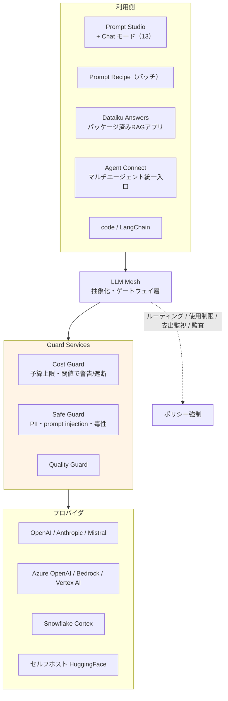
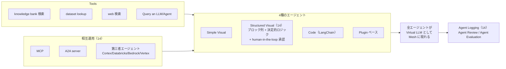
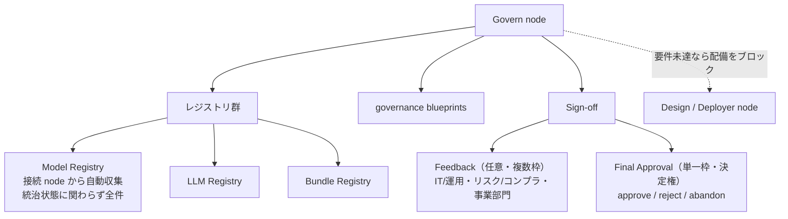

# クラスタ 6: GenAI・エージェントとガバナンス

## 概要

DSS 12.5（2023）の **LLM Mesh** GA 以降、Dataiku の機能追加の重心はこの領域に移りました。DSS 13（2024）で Answers / Visual Agents、DSS 14（2025）で Structured Visual Agents / MCP / A2A、そして 2026年3月の「Platform for AI Success」で **Agent Management**（エージェントの横断統治）へ至ります。**2026年に公開された顧客事例は事実上すべてエージェント案件**です（C7 参照）。

**LLM Mesh の設計思想**は「プロバイダをハードコードさせない」ゲートウェイ層で、接続・ルーティング・使用制限・支出監視・監査を接続レイヤに埋め込みます。エージェントについての最重要の設計特性は、**すべてのエージェントが "Virtual LLM" として Mesh に現れる**こと — つまり LLM を使える場所ならどこでもエージェントを使えます。

ガバナンス（Govern node）は別 node・別ドキュメントツリー・別購買層（リスク/コンプライアンス）を持ちますが、**Unified Monitoring の状態指標に governance が含まれる**ため、C5（MLOps）と製品レベルで結合しています。

> ⚠️ **本クラスタは一次資料が構造的に不足しています**。GenAI/LLMOps 領域で実際のドキュメントと言えるのは `generative-ai/cost-control.html` くらいで、大半がマーケティングページです。調査時はこの制約を前提に工数を見積もってください。

## LLM Mesh の構造

## エージェント

## RAG / Knowledge Bank

| 要素 | 内容 |
|------|------|
| レシピ | **Embed dataset** / **Embed documents**（.pdf .docx .pptx .txt .md） |
| ベクトルストア | **Chroma**（既定・設定不要）、**Qdrant**、**FAISS**、**Pinecone** |
| 高度な機能 | マルチモーダル埋め込み（13）、**GraphRAG**、Automated RAG Optimization、**Document-Level Security** |
| RAG guardrails | 補助 LLM による relevancy / faithfulness の閾値判定 |

## Govern node

**規制文脈**: EU AI Act 時代（2024–2026）における AI 統治の要請が、この node の存在意義を強めています。**「shadow AI を作らせない」**がベンダーの主要な訴求軸です。

## キーワード

- `LLM Mesh` / `LLM connection` / `Virtual LLM`
- `Prompt Studio` / `Prompt Recipe`
- `Dataiku Answers` / `Agent Connect` / `Agent Hub`（14.2.0）
- `Knowledge Bank` / `RAG` / `GraphRAG`
- `Embed dataset` / `Embed documents` レシピ
- `Chroma` / `Qdrant` / `FAISS` / `Pinecone`
- `Document-Level Security`
- `guardrails`（PII / prompt injection / 毒性 / トピック境界 / バイアス）
- `Cost Guard` / `Safe Guard` / `Quality Guard`
- `Simple Visual` / `Structured Visual` / `Code` / `Plugin` エージェント
- `MCP` / `A2A`（14）
- `Agent Logging` / `Agent Review` / `Agent Evaluation`
- `Govern node` / `Model Registry` / `LLM Registry` / `Bundle Registry`
- `sign-off`（Feedback + Final Approval）
- `Agent Management`（2026-03、Early Access）

## 調査戦略

1. **一次資料の乏しさを前提に工数を積む** — `generative-ai/cost-control.html` が数少ない実ドキュメント。それ以外はマーケ資料であり、機能の実在と挙動を doc で裏取りできないことが多い
2. **C5（MLOps）と併読する** — Unified Monitoring の状態指標に governance が含まれる以上、両者を独立に扱うのは不正確。LLMOps/AgentOps ページは C5 との境界に位置するので重複調査に注意
3. **競合集合が古典的 MLOps と異なる**ことに注意 — LLM Mesh の比較対象は SageMaker ではなく **LiteLLM / Portkey / LangSmith**
4. **バージョン固定 URL で RAG の変遷を追う** — `/dss/12/generative-ai/rag.html`（初出）→ `/dss/latest/generative-ai/rag.html`（13）→ `/dss/latest/generative-ai/knowledge/`（14 で再構成）の 3世代が追える
5. **2026年3月発表の 3機能は成熟度が異なる** — Agent Management は Early Access、Cobuild は GA 2026年6月、Reasoning Systems は Manufacturing のみ提供中。ステージを混同しないこと

## 代表リソース

### LLM Mesh / GenAI

| タイトル | 種別 | 年 | 概要 |
|---------|------|-----|------|
| [Generative AI and LLM Mesh](https://doc.dataiku.com/dss/latest/generative-ai/index.html) | 公式doc | 2025-26 | GenAI ドキュメントツリーの起点 |
| [Introduction（GenAI）](https://doc.dataiku.com/dss/latest/generative-ai/introduction.html) | 公式doc | 2025-26 | Prompt Studio / Recipe / Answers / Agent Connect が全て Mesh 上に建つ |
| [**Cost Control**](https://doc.dataiku.com/dss/latest/generative-ai/cost-control.html) | 公式doc | 2025 | **本クラスタで最も価値の高い一次資料** — LLM コスト制御の実ドキュメント |
| [Introduction to Knowledge Banks and RAG](https://doc.dataiku.com/dss/latest/generative-ai/knowledge/introduction.html) | 公式doc | 2025-26 | Knowledge Bank = RAG のオブジェクト |
| [Adding Knowledge to LLMs](https://doc.dataiku.com/dss/latest/generative-ai/knowledge/index.html) | 公式doc | 2025-26 | GraphRAG、Automated RAG Optimization、Document-Level Security |
| [RAG guardrails](https://doc.dataiku.com/dss/latest/generative-ai/knowledge/rag-guardrails.html) | 公式doc | 2025-26 | 補助 LLM による relevancy / faithfulness 閾値 |
| [Retrieval-Augmented Generation（DSS 12）](https://doc.dataiku.com/dss/12/generative-ai/rag.html) | 公式doc（旧） | 2023 | **RAG の初出ドキュメント** — 機能の由来が辿れる |
| [Concept｜LLM connections](https://knowledge.dataiku.com/latest/ml-analytics/gen-ai/concept-llm-connections.html) | KB | 2025-26 | プロバイダを抽象化する connection |
| [Concept｜Embed recipes and RAG](https://knowledge.dataiku.com/latest/genai/rag/concept-rag.html) | KB | 2025-26 | FAISS / Pinecone / ChromaDB |
| [Tutorial｜Multimodal knowledge bank for RAG](https://knowledge.dataiku.com/latest/gen-ai/rag/tutorial-multimodal-embedding.html) | KB | 2025-26 | マルチモーダル埋め込み（13+） |
| [LLM Mesh（Developer Guide）](https://developer.dataiku.com/latest/concepts-and-examples/llm-mesh.html) | Developer Guide | 2025-26 | プログラム的な Mesh API |
| [Programmatic RAG with LLM Mesh and Langchain](https://developer.dataiku.com/latest/tutorials/genai/nlp/llm-mesh-rag/index.html) | Developer Guide | 2025-26 | コードファーストの RAG |
| [The LLM Mesh: a common backbone for generative AI](https://www.dataiku.com/blog/llm-mesh) | ベンダーblog | 2023 | **LLM Mesh 概念の原典** |
| [Dataiku LLM Guard Services](https://www.dataiku.com/product/key-capabilities/guard-services/) | ベンダー | 2024-26 | Cost / Safe / Quality Guard の三点セット |
| [Introducing LLM Cost Guard](https://www.dataiku.com/stories/blog/llm-cost-guard) | ベンダーblog | 2024 | プロジェクト/ユーザ群/プロバイダ別の予算上限、閾値で警告 or 自動遮断 |
| [Dataiku Debuts LLM Cost, Quality, and Safety Guardrail Services](https://www.enterpriseaiworld.com/Articles/News/News/Dataiku-Debuts-LLM-Cost-Quality-and-Safety-Guardrail-Services-166191.aspx) | 業界紙 | 2024 | **Guard Services の launch 時期を独立に確定** |

### エージェント

| タイトル | 種別 | 年 | 概要 |
|---------|------|-----|------|
| [Introduction to Agents in Dataiku](https://doc.dataiku.com/dss/latest/agents/introduction.html) | 公式doc | 2025-26 | 4種のエージェント。**全エージェントが Virtual LLM になる** |
| [Agent Connect](https://doc.dataiku.com/dss/latest/generative-ai/chat-ui/agent-connect.html) | 公式doc | 2025-26 | Answers / Mesh エージェント / 拡張 LLM を束ねるマルチエージェント front-end |
| [Query an LLM/Agent（tool）](https://doc.dataiku.com/dss/latest/agents/tools/llm-mesh-query.html) | 公式doc | 2025-26 | 組込 tool のリファレンス |
| [Building and using an agent with LLM Mesh and Langchain](https://developer.dataiku.com/latest/tutorials/genai/agents-and-tools/agent/index.html) | Developer Guide | 2025-26 | code エージェントの実装 |
| [LLM Mesh agentic applications](https://developer.dataiku.com/latest/tutorials/genai/agents-and-tools/llm-agentic/index.html) | Developer Guide | 2025-26 | エージェント型アプリの構築 |
| [Create and Control AI Agents at Scale](https://www.dataiku.com/stories/blog/ai-agents-with-dataiku) | ベンダーblog | 2025-26 | エージェント統治の訴求 |
| [Deliver AI agents at enterprise scale](https://www.dataiku.com/product/deliver-ai-agents) | ベンダー | 2025-26 | 継続的評価と drift 検知を含む |
| [Unified AI Ops: How to Scale AgentOps, MLOps, DataOps, & LLMOps](https://blog.dataiku.com/unified-ai-ops) | ベンダーblog | 2025 | 4つの ops の収斂テーゼ |
| [Dataiku champions AI agent creation mechanisms](https://www.computerweekly.com/blog/CW-Developer-Network/Dataiku-champions-AI-agent-creation-mechanisms) | 業界紙 | 2025-26 | **独立した第三者によるエージェント機能の報道** |

### ガバナンス

| タイトル | 種別 | 年 | 概要 |
|---------|------|-----|------|
| [Dataiku Govern concepts](https://doc.dataiku.com/dss/latest/governance/definitions.html) | 公式doc | 2025 | 中核オブジェクトモデル: blueprint / artifact / registry |
| [Governance Process Features](https://doc.dataiku.com/dss/latest/governance/governance-features.html) | 公式doc | 2025 | ワークフロー・レビュー・プロセス機能 |
| [Sign-off Scenario](https://doc.dataiku.com/dss/latest/governance/sign-off.html) | 公式doc | 2023-25 | **Feedback（任意・複数）+ Final Approval（単一・決定権）** |
| [Concept｜The Govern node's role](https://knowledge.dataiku.com/latest/govern/overview/concept-govern-in-dataiku-architecture.html) | KB | 2024-25 | Design / Automation / Deployer との位置関係 |
| [Concept｜Increasing AI asset visibility in the Govern node](https://knowledge.dataiku.com/latest/govern/overview/concept-centralization-in-govern.html) | KB | 2024-25 | Model Registry は統治状態に関わらず接続 node から自動収集 |
| [Dataiku Govern（製品）](https://www.dataiku.com/product/govern) | ベンダー | 2024-26 | sign-off まで配備をブロック。shadow AI の枠組み |
| [Govern AI everywhere with Dataiku](https://www.dataiku.com/product/govern-ai-everywhere) | ベンダー | 2025-26 | 外部/第三者 AI 資産まで統治を拡張 |
| [Dataiku Govern Review 2026](https://aicompliancevendors.com/vendors/dataiku-govern) | 第三者 | 2026 | 稀な独立 Govern 評価。⚠️ **編集独立性を要検証** |

### 2026年3月の再定位

| タイトル | 種別 | 年 | 概要 |
|---------|------|-----|------|
| [Dataiku Launches the Platform for AI Success](https://www.dataiku.com/company/news/dataiku-launches-the-platform-for-ai-success) | プレスリリース | 2026-03-09 | **Agent Management**（Early Access）/ **Cobuild**（GA 2026年6月）/ **Reasoning Systems**（Manufacturing のみ提供中） |
| [同（BusinessWire）](https://www.businesswire.com/news/home/20260309701716/en/Dataiku-Launches-the-Platform-for-AI-Success) | プレスリリース | 2026-03-09 | 一次配信 |
| [同（BigDATAwire）](https://www.hpcwire.com/bigdatawire/this-just-in/dataiku-launches-the-platform-for-ai-success/) | 業界紙 | 2026-03 | 第三者報道 |

### 日本語

| タイトル | 種別 | 年 | 概要 |
|---------|------|-----|------|
| [生成AIのより有効・手軽なビジネス活用へ](https://special.nikkeibp.co.jp/atclh/NXT/24/xwif0110/dataiku/) | 日経xTECH Special | 2024 | **一次級の日本ビジネス媒体**による LLM Mesh 統治の解説 |
| [Dataiku LLMメッシュ（公式JA）](https://www.dataiku.com/ja/製品/key-capabilities/llmメッシュ/) | 公式(JA) | 2025-26 | ハードコード依存を排する API ゲートウェイとしての説明 |
| [LLMメッシュの紹介](https://qiita.com/Dataiku/items/f41e0846717bab462739) | Qiita（公式アカウント） | 2023-24 | LLM Mesh 原典の日本語訳 |
| [Dataiku LLMメッシュをつかってRAGをつくってみた](https://www.keywalker.co.jp/blog/dataiku-llm-mesh-rag.html) | パートナーblog | 2024-25 | 日本語のハンズオン RAG 構築 |
| [DataikuがLLMメッシュを拡大](https://prtimes.jp/main/html/rd/p/000000023.000084325.html) | PR TIMES | 2024 | **Dataiku Japan株式会社**の公式日本語リリース |

## このクラスタの検証課題

| 課題 | 状態 |
|------|------|
| **一次資料の構造的不足** | 実ドキュメントは `cost-control.html` 程度。大半がマーケページで、機能の挙動を doc で裏取りできない |
| Cobuild の日付不整合 | DSS 14 リリースノートは 14.7.0 に紐付ける一方、2026年3月のプレスリリースは「2026年6月 GA」と述べる。Early Access と GA の差と推定されるが要確認 |
| Guard Services の詳細仕様 | launch は 2024年で独立確認済みだが、各 Guard の具体的な判定ロジックは doc 化が薄い |
| LLMOps/AgentOps ページの帰属 | C5（MLOps）との境界に位置。重複調査を避けるため担当を決めること |
