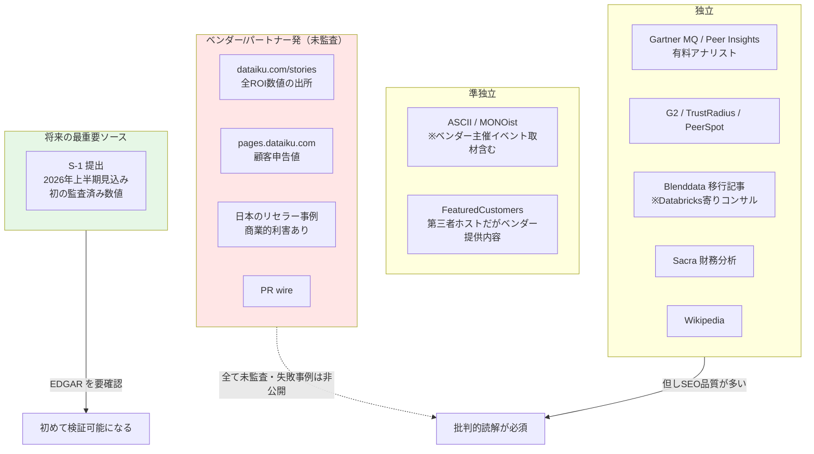
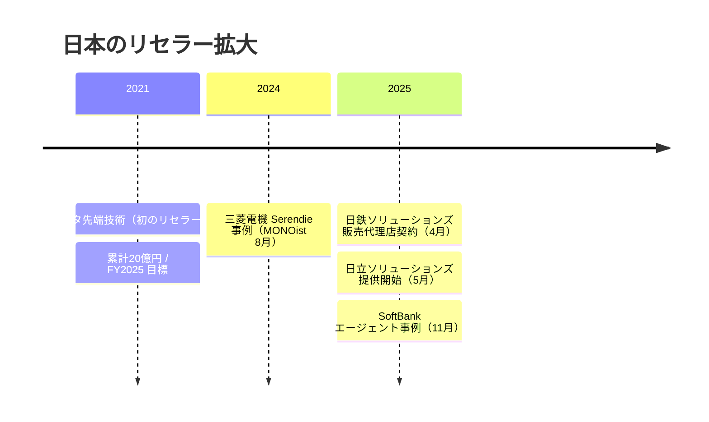

# クラスタ 7: 導入事例と市場ポジション ★重点

## 概要

Dataiku は 2013年2月14日パリ創業（Florian Douetteau 他3名）、2015年から NYC 本社。**ARR $350M（2025年10月）、750+ 組織、Forbes Global 2000 の 4社に1社**が利用し、**2026年上半期の米国 IPO** を Morgan Stanley / Citigroup 主幹事で準備中です。Gartner MQ は **5年連続 Leader**。

しかし本クラスタで最も重要な発見は方法論的なものです — **本調査で見つかった定量的成果（ROI）は例外なくベンダーチャネル経由の顧客申告値であり、監査されたものは 1件もありません。失敗事例の公開もゼロです**。したがって全ての数値は「選択バイアスのかかった未監査値」として読む必要があります。

また、**Gartner MQ 5年連続 Leader** と **PeerSpot マインドシェアの半減**という一見矛盾する signal が併存します。ただし Databricks（18.2%→8.3%）・KNIME（11.8%→5.8%）も同様に半減しており、**Dataiku 固有の凋落ではなくカテゴリ断片化ないし算定方法変更の可能性が高い**ため、PeerSpot の方法論を検証せずに「Dataiku が Databricks に負けている」と読んではいけません。

## 情報源の信頼度マップ

## 業界別の事例分布

| 業界 | 事例社名 | 定量的成果 | 証拠の質 |
|------|---------|-----------|---------|
| **製造・産業** | 三菱電機、Michelin、村田製作所、カネカ、ENEOSマテリアル、Safran、NXP | 三菱電機 分析提供 **60%高速化** / エネルギー効率 **約20%改善**、カネカ **+100t/年**、Safran 納入遅延 **−50%**、NXP **数千万ドル規模** | **最も厚い** — 社名も数値も最多 |
| **通信** | SoftBank | **年間25万時間**削減見込み、売り手の90%が改善報告、会話の80%をCRM連携、プロトタイプ1ヶ月 | 単一だが**最も深い**事例 |
| **製薬・ライフサイエンス** | Roche（特許ワークフローのエージェント）、Novartis、J&J Vision | 数値なし | 社名は充実、数値ゼロ |
| **金融・保険** | Standard Chartered、Aviva、Euronext | **数値ゼロ** | ⚠️ **主力業界なのに数値が皆無** |
| **物流・運輸** | Geodis、Australia Post、Prologis | Australia Post **AUD 15M+** 削減 | 中程度 |
| **小売・CPG** | Perdue Farms、キッコーマン | 数値なし | 薄い（テンプレート中心） |
| **エネルギー** | SLB | 数値なし | 薄い |
| **公共部門** | **該当なし** | — | ⚠️ **専用ページがあるのに社名が 1件も無い**（NDA/調達制約か） |

## 日本市場

日本は**リセラー主導の GTM** という構造的に異なる市場です。

- **顧客**: SoftBank、三菱電機、村田製作所、カネカ、ENEOSマテリアル、キッコーマン
- **法人**: Dataiku Japan株式会社（東京都渋谷区神宮前1-5-8 Level 14）
- **リセラー/SI**: NTTデータ先端技術、NRI、日立ソリューションズ、日鉄ソリューションズ、NTTインテグレーション、keywalker、エアー、デジタルフォルン
- **日本語ローカライズ**: Academy 日本語ラーニングパス、`/ja/` ストーリーページ

**日本市場の語り口の特徴**: 「データ分析の民主化」「AI 内製化」が繰り返し現れます。カネカ・キッコーマンは**ツール導入ではなく人材育成主導**として明示的に語られ、データサイエンティストを雇うのではなく現場の domain expert（工場オペレータ、事業部門）を育てる筋書きです。村田製作所は情シスのデータサイエンティストから始めて全社展開する **bottom-up-from-IT** の典型例。

> **2025年のリセラー急増**は日本市場へのプッシュを示す先行指標として注目に値します。

## 市場ポジション

| 指標 | 内容 |
|------|------|
| **Gartner MQ** | **5年連続 Leader**（2022→2026）。2026年版（2026-06-22 公開）でカテゴリ名が「**MQ for AI Platforms for DSML**」へ改称。16ベンダー中 Product Owner Use Case で **1位** |
| **Gartner Peer Insights** | **4.7/5（780レビュー）**。2025年5月時点で 4.8/5・推奨率94%。2024 Customers' Choice |
| **Forrester** | 確認できた最後の Leader は **Multimodal Predictive Analytics & ML Solutions, Q3 2020**。**2025–26 の Wave に Dataiku の掲載を確認できず** — 評価対象外か Leader ではないか。要確認 |
| **PeerSpot マインドシェア**（2026年4月） | Databricks 8.3%（↓18.2%）、**Dataiku 5.9%（↓12.7%）**、KNIME 5.8%（↓11.8%）— **全社が半減**。方法論の検証が必須 |

## 資金調達と企業動向

| 時期 | 内容 |
|------|------|
| 2015-01 | $3.6M |
| 2016-10 | $14M（FirstMark） |
| 2017-09 | $28M Series B（Battery） |
| 2018-12 | $101M Series C（ICONIQ） |
| 2019-12 | セカンダリ @ **$1.4B**（CapitalG）ユニコーン化 |
| 2020-08 | $100M Series D（Stripes / Tiger） |
| 2021-08 | $400M Series E **@ $4.6B**（Tiger） |
| 2022-12 | $200M Series F **@ $3.7B**（Wellington）— **ダウンラウンド** |
| 2025-01 | ARR **$300M** 突破 |
| 2025-10 | ARR **$350M** 突破 |
| 2026 H1 | **IPO 予定**（Morgan Stanley + Citigroup）。憶測評価額 $6–9B |

その他: 従業員 1,250+、13拠点。**Kiji Inspector（2026）** — NVIDIA Nemotron と組んだオープンソースの AI 透明性フレームワーク。

## 実務者の評価

**強み（一貫して言及される）**
- 単一ツールでのエンドツーエンドなワークフロー
- ノー/ロー/フルコードが 1つに同居する range
- サポート品質が本当に良い
- visual pipeline の可読性

**不満（G2 / TrustRadius / Gartner PI / Blenddata で独立に裏付けあり）**

| 不満 | 詳細 |
|------|------|
| **価格** | 最も多い。「高価」、席の追加を阻む、固定ライセンスが小規模チームに不利。**公開価格表が存在しない**（contact-sales のみ）。流通する数値は第三者アグリゲータ発で未検証 |
| **スケール時の性能** | 大容量データで重い、プロジェクト数が増えると UI が劣化、マルチユーザ競合で遅延 |
| **コードの統治** | **誰が何を変えたかの追跡が弱い**、ロジックが visual flow に分散、自動テスト/レビューが限定的 — Blenddata の移行動機の中核 |
| **ドキュメント** | Python API のドキュメントに深さが足りない |

**移行事例**: Blenddata（2025-05-09）が Dataiku → Databricks 移行で**ライセンス最大 65% 削減**を主張。⚠️ ただし Blenddata は Databricks 寄りのコンサルで顧客名も非公開。

> **注意**: Reddit の実質的な議論は発見できず、sentiment はレビュープラットフォームに偏っています。これは IC 実務者より**管理者/購買層の視点に寄る**ことを意味します。

## キーワード

- `Gartner Magic Quadrant` / `AI Platforms for DSML`
- `Gartner Peer Insights` / `Customers' Choice`
- `PeerSpot mindshare`
- `ARR` / `IPO` / `S-1` / `EDGAR`
- `Dataiku Japan株式会社`
- `導入事例` / `活用事例` / `データ分析の民主化`
- `リセラー` / `SI パートナー`
- `Serendie`（三菱電機）
- `LLM Mesh`（2026年事例の主軸）
- `Deploy Anywhere`
- `Kiji Inspector`
- `champion` 顧客: SoftBank / 三菱電機 / カネカ / 村田製作所
- 競合: `Databricks` / `Alteryx` / `KNIME` / `SAS` / `DataRobot` / `Palantir` / `Snowflake`

## 調査戦略

1. **ベンダー発と独立を機械的に分離して読む** — これが本クラスタの最重要規律。dataiku.com/stories と pages.dataiku.com の数値は全て顧客申告。日本の「事例」記事もリセラー執筆で商業的利害がある
2. **2026年の事例は全てエージェント案件**であることに注目 — Dataiku は「DSML プラットフォーム」から「**The Universal AI Platform™**」へ再定位し、Gartner も MQ 名称を「AI Platforms」へ改称して追随した。分類の変化自体がトレンドの証拠
3. **C5（MLOps）と併読する** — ROI 主張の技術的裏付けは MLOps 側にある
4. **S-1 を待つ / EDGAR を確認する** — 2026年上半期の IPO 提出が、ARR・継続率・顧客数・顧客集中度について**初の監査済み開示**をもたらす。本クラスタの証拠水準を一変させる単一で最大の要因
5. **PeerSpot の方法論を先に検証する** — 全ベンダー一律半減は算定方法変更を強く示唆する。検証前に競争力低下と解釈しないこと

## 代表リソース

### ベンダー発（未監査 — ROI 主張の出所）

| タイトル | 種別 | 年 | 概要 |
|---------|------|-----|------|
| [SoftBank: AI agent sales model](https://www.dataiku.com/stories/blog/softbank) | ベンダー事例 | 2025-11-24 | 3種のエージェント。売り手の90%が改善報告、会話の80%をCRM連携、**約20時間/人/月 → 年間25万時間**見込み。プロトタイプ1ヶ月 |
| [ソフトバンク事例（日本語）](https://www.dataiku.com/ja/ストーリー/詳細/softbank/) | ベンダー事例(JA) | 2025 | 年間25万時間削減目標の日本語版 |
| [Mitsubishi Electric](https://www.dataiku.com/stories/detail/mitsubishi-electric/) | ベンダー事例 | 2024–25 | Serendie 基盤。**分析提供 60% 高速化** |
| [Kaneka: 連続乾燥設備 AI 自動化](https://pages.dataiku.com/jp-client-story-kaneka) | ベンダー事例(JA) | 約2023 | 樹脂工場の連続乾燥最適化。**年産 +100t**。現場人材の育成 |
| [予知保全ユースケースページ](https://www.dataiku.com/solutions/use-cases/predictive-maintenance/) | ベンダー | — | **Safran 納入遅延 −50%、NXP 数千万ドル規模、Australia Post AUD 15M+** — 定量値が最も集中。全てベンダー主張 |
| [Roche](https://www.dataiku.com/stories/detail/roche-2) | ベンダー事例 | 2026 | 特許ワークフローのエージェント |
| [Euronext](https://www.dataiku.com/stories/detail/euronext) | ベンダー事例 | 2026-03-16 | 市場シェア分析のエージェント |
| [Geodis](https://www.dataiku.com/stories/detail/geodis) | ベンダー事例 | 2026-04-29 | IT サポート効率化のエージェント |
| [Standard Chartered](https://www.dataiku.com/stories/detail/scb) / [Aviva](https://www.dataiku.com/stories/detail/aviva) | ベンダー事例 | — | 金融。**数値の公開なし** |
| [Michelin](https://www.dataiku.com/stories/detail/michelin) / [SLB](https://www.dataiku.com/stories/detail/dataiku-slb) / [Novartis](https://www.dataiku.com/stories/detail/novartis) | ベンダー事例 | — | 数値なし |
| [FSI Solutions index](https://knowledge.dataiku.com/latest/solutions/financial-services/index.html) | 公式doc | — | AML Alerts Triage、Credit Scoring、**CECL/IFRS9 ストレステスト**等のテンプレート。doc なのでマーケより信頼できる |
| [$350M ARR 発表](https://www.globenewswire.com/news-release/2025/01/16/3010869/0/en/dataiku-surpasses-300m-arr-milestone-accelerating-genai-adoption-and-roai-in-global-enterprises.html) | ベンダーPR | 2025 | $300M（2025-01）→ **$350M（2025-10）**。750+組織、Forbes G2000 の 1/4 |
| [2026 Gartner MQ ランディング](https://pages.dataiku.com/2026-gartner-mq-ai-platforms-dsml) | ベンダーホストの再掲 | 2026-06-22 | **5年連続 Leader**。カテゴリ改称。16社中 Product Owner Use Case 1位 |
| [NTTデータ先端技術 Dataiku](https://www.intellilink.co.jp/dataiku/index.aspx) | パートナー(JA) | 2021– | 初の日本リセラー（2021-12-01）。**累計20億円 / FY2025** 目標 |
| [日立ソリューションズ 提供開始](https://www.hitachi-solutions.co.jp/company/press/news/2025/0527.html) | パートナーPR(JA) | 2025-05-27 | 2025-05-28 から販売。「AIの民主化」 |
| [日鉄ソリューションズ 販売代理店契約](https://www.nssol.nipponsteel.com/press/2025/20250409_130000.html) | パートナーPR(JA) | 2025-04-09 | NSSOL リセラー契約 |
| [キッコーマン 導入事例](https://www.keywalker.co.jp/dataiku/case_study_18.html) | パートナー事例(JA) | — | 伴走支援サービス。人材育成のための PoC |
| [Dataiku Academy](https://academy.dataiku.com/) | ベンダー教育 | — | 無料。Core Designer / ML Practitioner / Advanced Designer / Developer 認定。**日本語パスあり** |

### 独立・第三者

| タイトル | 種別 | 年 | 概要 |
|---------|------|-----|------|
| [From Dataiku to Databricks: 5 lessons](https://www.blenddata.nl/en/articles/from-dataiku-to-databricks-5-lessons-for-a-successful-migration) | 独立コンサル | 2025-05-09 | **最も価値の高い批判的資料**。誰が何を変えたかの追跡不足、ロジックの分散、自動テスト/レビューの限定。**ライセンス最大65%削減**主張。⚠️ Databricks 寄り・顧客名非公開 |
| [Gartner Peer Insights — Dataiku](https://www.gartner.com/reviews/market/data-science-and-machine-learning-platforms/vendor/dataiku) | アナリスト集計 | 2025–26 | **4.7/5（780レビュー）**。長所: サポート、コード範囲。短所: **価格が「かなり高い」** |
| [Gartner MQ for DSML Platforms](https://www.gartner.com/en/documents/6533902) | 有料アナリスト | 2025-05-28 | Leader 主張の一次成果物。**ペイウォール** — ベンダー再掲ではなく直接検証すべき |
| [PeerSpot: Alteryx vs Dataiku vs KNIME](https://www.peerspot.com/products/comparisons/alteryx_vs_dataiku_vs_knime) | レビュー集計 | 2026 | **マインドシェア: Databricks 8.3%(↓18.2%)、Dataiku 5.9%(↓12.7%)、KNIME 5.8%(↓11.8%)** — 全社半減 |
| [G2 Dataiku pros & cons](https://www.g2.com/products/dataiku/reviews?qs=pros-and-cons) | レビュー集計 | 2026 | 短所: 大容量で重い、プロジェクト増で UI 劣化、マルチユーザ遅延、**Python API ドキュメントの薄さ** |
| [TrustRadius Dataiku](https://www.trustradius.com/products/dataiku/reviews?qs=pros-and-cons) | レビュー集計 | 2025–26 | 価格障壁と複雑性のテーマを裏付け |
| [Wikipedia: Dataiku](https://en.wikipedia.org/wiki/Dataiku) | 百科事典 | 2026 | 2013-02-14 パリ創業、2015年から NYC。資金調達履歴。**Kiji Inspector（2026）** |
| [Dataiku plans IPO in the US](https://www.techzine.eu/news/data-management/135115/dataiku-plans-ipo-in-the-us/) | 業界紙（Reuters 出典） | 2025-10 | **IPO 2026年上半期**。Morgan Stanley + Citigroup |
| [Dataiku bags $200M Series F at $3.7B](https://www.fintechfutures.com/data-privacy-security/dataiku-bags-200m-series-f-funding-at-3-7bn-valuation) | 業界紙 | 2022-12 | **ダウンラウンド**（$4.6B → $3.7B）。Wellington 主導 |
| [Sacra: Dataiku](https://sacra.com/c/dataiku/) | 独立リサーチ | 2025–26 | 独立した ARR / 評価額モデリング。**S-1 前では最良の非ベンダー財務情報源** |
| [三菱電機 Serendie 事例](https://monoist.itmedia.co.jp/mn/articles/2408/23/news082.html) | 業界紙(JA) | 2024-08-23 | MONOist。Dataiku が Serendie の分析層。2024-05 初ソリューション（ガスタービン/カーボンニュートラル）、顧客別エネルギー効率 **約20%改善** |
| [村田製作所 Dataiku 導入](https://it.impress.co.jp/articles/-/24526) | 業界紙(JA) | — | IT Leaders。visual GUI + コーディング併存とライフサイクル可視性で選定。情シスから全社展開 |
| [カネカ・ENEOSマテリアル 事例](https://ascii.jp/elem/000/004/166/4166128/) | 業界紙・**イベント取材**(JA) | 2023-11-02 | ASCII。⚠️ **Dataiku 主催 Data & AI Day 2023 の取材**なので準ベンダー扱い。カネカ: 温度から中間投入量を予測、**年産+100t**、暗黙知の形式知化 |
| [thoughtworks/mlops-platforms](https://github.com/thoughtworks/mlops-platforms) | OSS比較 | 2022–24 | 競合比較で唯一厳密な情報源 |
| [FeaturedCustomers Dataiku](https://www.featuredcustomers.com/vendor/dataiku/case-studies) | アグリゲータ | 2026 | 150事例、4.8/5。⚠️ **第三者ホストだが内容はベンダー提供** — 独立ではない |

## このクラスタの検証課題

| 課題 | 状態 |
|------|------|
| **公共部門の事例** | 専用ページがあるのに社名が 1件も無い。NDA/調達制約の可能性 |
| **金融の定量値** | 主力業界なのに数値ゼロ — 際立った空白 |
| **Forrester Wave 2025–26** | Dataiku の掲載を確認できず。**不在自体に意味がある可能性** |
| **PeerSpot マインドシェア半減** | 全ベンダー一律のため方法論の検証が必須。検証前に競争力低下と解釈しないこと |
| **ENEOSマテリアルの詳細** | ASCII 記事の 2ページ目に存在、未取得 |
| **全 ROI 数値** | ベンダーチャネル経由の顧客申告。独立検証は 1件も存在しない |
| **S-1（2026年上半期見込み）** | **最重要の将来ソース**。EDGAR を要確認 |
| **Gartner MQ 全文** | ペイウォール。Leader 主張は現状ベンダー再掲に依存 |
