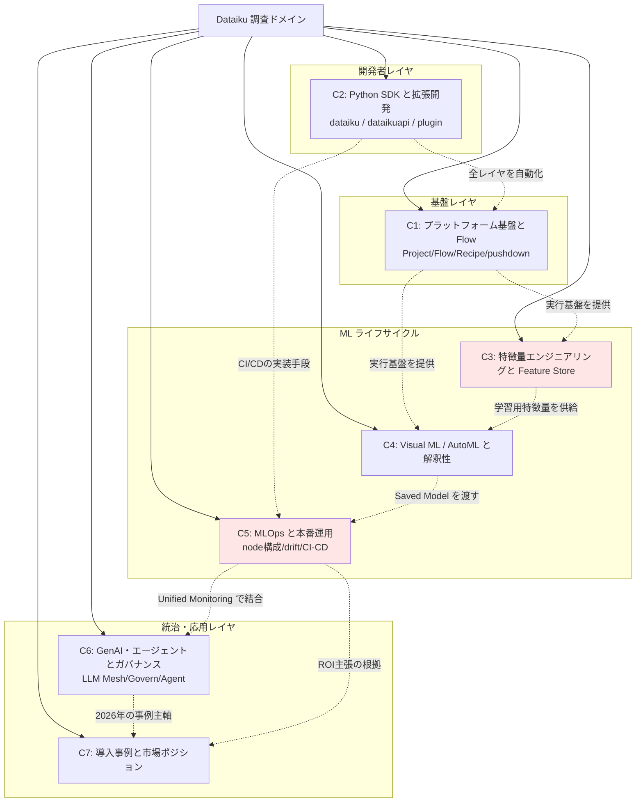
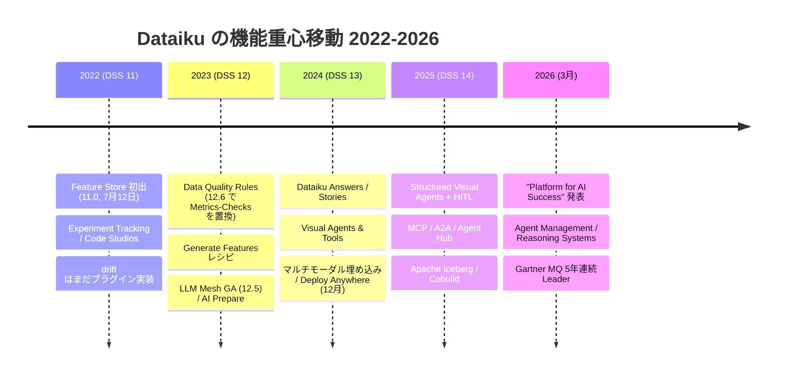
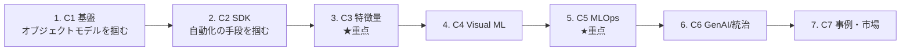
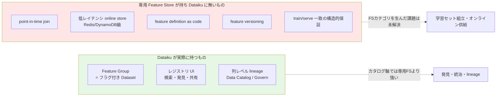

# Dataiku 活用事例・Python SDK・機能 — ドメインマップ

## 調査パラメータ

- **調査タイプ**: 技術トレンド分析 + ビジネス事例調査
- **時間範囲**: 2022 – 2026（DSS 11 〜 DSS 14 / 2026年3月 "Platform for AI Success" まで）
- **生成日**: 2026-07-16
- **入力キーワード**: Dataiku, 活用事例, Python SDK, 機能, 特徴量マート, ML-Ops
- **検索言語**: 英語 + 日本語
- **注記**: 本 run は同ドメインの過去 run とは独立に、事前知識を参照せず再構築したものです。

## 全体像（Big Picture）

Dataiku は 2013年パリ創業・2015年から NYC 本社の**エンドツーエンド AI プラットフォーム**で、ノーコード / ローコード / フルコードを単一の Flow 上で混在させる点を最大の差別化としています。ARR は $300M（2025年1月）から **$350M（2025年10月）**へ伸び、**750+ 組織 / Forbes Global 2000 の 4社に1社**が利用、**2026年上半期の米国 IPO** が進行中です。Gartner MQ では **5年連続 Leader**（2026年版でカテゴリ名自体が "AI Platforms for DSML" に改称）。

技術的な重心は明確に移動しています: **データ準備・AutoML（〜2023）→ GenAI / LLM Mesh（DSS 12.5, 2023）→ エージェント（DSS 13–14, 2024–25）→ エージェント統治（2026年3月）**。2026年に公開された事例は事実上すべてエージェント案件です。

一方、本調査で最も重要な発見は **公称機能と実装実態のギャップ**です。特に Feature Store は「特徴量ストア」ではなく**特徴量カタログ**であり（クラスタ3）、Python API は `dataiku` / `dataikuapi` の二層構造がドキュメント上も混乱を生んでいます（クラスタ2）。ROI 数値は**すべてベンダー経由の顧客申告値で、監査されたものは皆無**です（クラスタ7）。

## ドメインマップ

> 赤色のクラスタ（C3 / C5）はユーザーが明示的に重点指定した領域です。

### 時間軸（機能の重心移動）

## クラスタ一覧

| # | クラスタ名 | キーワード数 | 概要 | 重点 |
|---|-----------|------------|------|------|
| 1 | プラットフォーム基盤と実行アーキテクチャ | 15 | Project / Flow / Recipe の中核オブジェクトモデルと、SQL pushdown・Spark・Elastic AI による実行層 | |
| 2 | Python SDK と拡張開発 | 14 | `dataiku` / `dataikuapi` の二層構造、プラグイン開発、ローカル開発とテスト | ★ |
| 3 | 特徴量エンジニアリングと Feature Store | 14 | Feature Group の実態（=フラグ付きDataset）、point-in-time 非対応、Generate Features との断絶 | ★★ |
| 4 | Visual ML / AutoML と解釈性 | 13 | 3つの予測スタイル、SHAP/PDP、fairness、causal prediction | |
| 5 | MLOps と本番運用 | 16 | Design/Automation/API/Deployer/Govern の node 構成、MES、drift、CI/CD | ★★ |
| 6 | GenAI・エージェントとガバナンス | 15 | LLM Mesh、RAG/Knowledge Bank、4種のエージェント、Guard Services、Govern node | |
| 7 | 導入事例と市場ポジション | 13 | 国内外事例、Gartner MQ、競合比較、実務者の批判、IPO | ★ |

★ = ユーザー指定の重点領域

## クラスタ間の関係と読む順序

推奨読解順は C1 → C2 → C3 → C4 → C5 → C6 → C7 ですが、**重点領域だけを追う場合は C1（基盤の最小限）→ C3 → C5 → C7** が最短経路です。

## 本 run の主要な発見（クラスタ横断）

### 発見1: Feature Store は「ストア」ではなく「カタログ」

Feature Group は **単にフラグを立てられた Dataset** であり、専用ストレージも feature-view DSL も存在しません。Python API の全表面積は 4メソッドのみ。**point-in-time correctness はネイティブ非対応**で、「オンラインサービング」と称されるものは Feature Store（DSS 11, 2022）より 7年古い **Dataset Lookup（DSS 2.2, 約2015年）**の再利用であり、レジストリとは接続されていません。

決定的な証拠として、DSS 11 以前に Dataiku 自身が「専用の feature store コンポーネントは無い」と回答した際に挙げた回避策リストと、DSS 11 が実際に出荷した内容がほぼ一致します。**v11 の Feature Store は新インフラではなく既存回避策の製品化**です。

### 発見2: drift はプラグインからコアへ移動した

`dss-plugin-model-drift` は**明示的に deprecated** となり、drift 機能は **Model Evaluation Store (MES)** としてコアに統合されました。同様に **Metrics & Checks は DSS 12.6 で Data Quality Rules に置換**されています。両者ともバージョン固定 URL で before/after を追跡可能で、この 2 つが 2022–2026 窓の主要な機能断層です。

### 発見3: 「Deploy Anywhere」が競合の問いを変質させた

2024年12月の Deploy Anywhere 以降、Dataiku は SageMaker / Vertex / Azure ML / Databricks / Snowflake と**競合する**のではなく、それらの**上に乗る**位置取りへ移行しました。External Models で他社エンドポイントを Saved Model として取り込み、Unified Monitoring で他社デプロイまで監視します。したがって「Dataiku vs SageMaker」という問いの立て方自体が部分的に無効化されています。

### 発見4: ROI 数値はすべて未監査

本調査で発見した定量的成果（Safran −50%、SoftBank 25万時間/年、カネカ +100t/年、三菱電機 60%高速化 等）は**例外なくベンダーチャネル経由の顧客申告値**です。失敗事例は 1件も公開されていません。**2026年上半期の IPO に伴う S-1 提出が、初めて監査済み数値をもたらす最重要の将来ソース**です（EDGAR を要確認）。

### 発見5: `dataiku` パッケージは PyPI に存在しない

開発者体験を規定する構造的制約です。in-platform パッケージ `dataiku` は **PyPI に一度も存在したことがなく**、`dataiku-internal-client.tar.gz` として**自分の DSS インスタンス自身**（`/public/packages/`）から配布されます。つまり **到達可能な DSS インスタンス無しに開発環境をブートストラップできず**、パッケージのバージョンは引いてきたインスタンスに溶接されます。公開 PyPI パッケージは `dataiku-api-client` と `dataiku-scoring` の 2つのみ。

さらに **公開 REST API は free edition で利用不可**であり、外部 IDE 連携の作業が丸ごとブロックされます。実務者の「Python API ドキュメントが薄い」という不満（発見4 の批判群）は、この配布モデルと併せて読むべきです。

### 発見6: 日本語情報の偏り

日本市場は**リセラー主導**で 2025年に急拡大（日立ソリューションズ 5月、日鉄ソリューションズ 4月）。事例は SoftBank・三菱電機・村田製作所・カネカ・ENEOSマテリアル・キッコーマンと厚い一方、**技術的な日本語情報は Feature Store に関して事実上ゼロ**（4種のクエリで該当記事なし）。日本語コンテンツはベンダー/パートナー執筆に偏り、独立した技術批評はほぼ存在しません。

## 参考: 情報源の質の分布

| クラスタ | 一次資料（公式doc/KB） | 独立した第三者 | ベンダーマーケ | 総合評価 |
|---------|---------------------|--------------|--------------|---------|
| C1 基盤 | ◎ 非常に厚い | △ | ○ | 信頼性高 |
| C2 SDK | ◎ Developer Guide 充実 | △ Medium 等少数 | — | 信頼性高 |
| C3 特徴量 | ○ 但し量は少ない | ○ community が最良 | △ 誇大 | **要批判的読解** |
| C4 Visual ML | ◎ | △ | ○ | 信頼性高 |
| C5 MLOps | ◎ 最も厚い | △ thoughtworks のみ | ○ | 信頼性高 |
| C6 GenAI | △ **doc は cost-control のみ** | △ | ◎ 大半がマーケ | **一次資料不足** |
| C7 事例 | — | ○ Gartner PI / G2 / 移行事例 | ◎ 全ROI がここ | **要批判的読解** |

> **C6 と C7 は逆方向の問題を抱えます**。C6 は一次資料が乏しくマーケ資料しかない。C7 は第三者情報はあるが SEO 品質が多く、厳密なのは `thoughtworks/mlops-platforms` と Blenddata の移行記事程度です。

## 各クラスタの詳細

詳細は個別ファイルを参照してください。

1. [C1: プラットフォーム基盤と実行アーキテクチャ](cluster-01-platform-core.md)
2. [C2: Python SDK と拡張開発](cluster-02-python-sdk.md) ★
3. [C3: 特徴量エンジニアリングと Feature Store](cluster-03-feature-store.md) ★★
4. [C4: Visual ML / AutoML と解釈性](cluster-04-visual-ml.md)
5. [C5: MLOps と本番運用](cluster-05-mlops.md) ★★
6. [C6: GenAI・エージェントとガバナンス](cluster-06-genai-governance.md)
7. [C7: 導入事例と市場ポジション](cluster-07-cases-market.md) ★

## 次フェーズへの申し送り

| 項目 | 内容 |
|------|------|
| **最優先で埋めるべき空白** | 公共部門の事例が 1件も無い / 金融は社名はあるが数値ゼロ / Forrester Wave 2025–26 の Dataiku 評価が不明 |
| **要検証の主張** | drift 統計量の具体名（PSI・KS 検定等）は未確認 / Unified Monitoring の導入バージョン未特定 / Cobuild の 14.7.0 と 2026年6月GA の日付不整合 |
| **URL 固定の注意** | `/dss/latest/` は浮動参照で DSS 15 公開時に無言で移動する。再現性のため `/dss/14/` へピン留めすること |
| **存在しない前提の排除** | 「Dataiku Universe」は実在しない（イベント名は Succeed / Summit / Exchange）。調査枠から除外済み |
| **最重要の将来ソース** | IPO に伴う S-1（2026年上半期見込み、EDGAR）— 初の監査済み ARR / 継続率 / 顧客集中度 |
