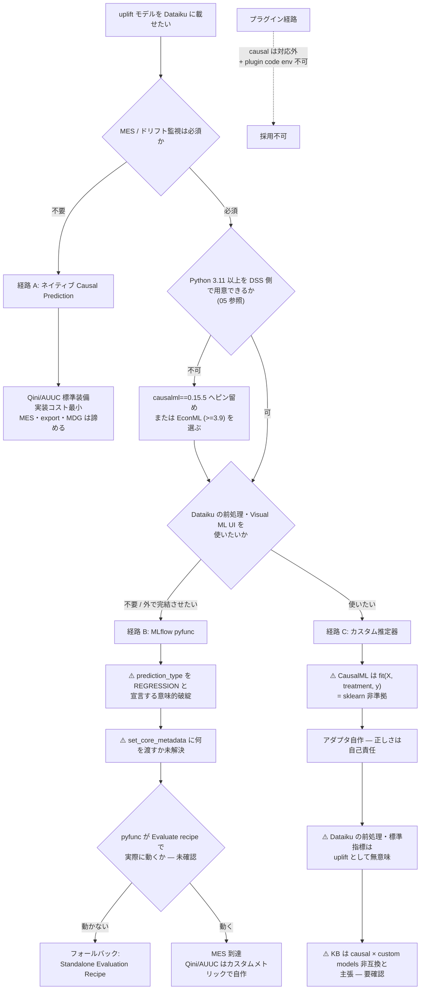

# 三経路の比較 — ネイティブ / MLflow pyfunc / カスタム推定器

## この問題の形

Dataiku で uplift モデリングを運用に載せようとすると、**「uplift として正しく学習・評価すること」**と**「Dataiku の MLOps 機構（とりわけ Model Evaluation Store）に載せること」**が正面から衝突する。この衝突は偶発的な実装上の穴ではなく、ネイティブ Causal Prediction の制約リストに明記された設計上の境界である。

Causal Prediction の Introduction ページは以下を逐語で述べている。

> "Causal prediction is incompatible with the following: MLflow models, Models ensembling, Model export, Model Evaluation Stores, Model Document Generator"

つまり **MES はネイティブ Causal Prediction では最初から使えない**。この一行が本クラスタ全体の出発点であり、以降の三経路はすべて「この制約をどう迂回するか」の変奏である。

さらに別ページ（Causal Prediction Settings）に分離して、

> "Causal prediction does not support K-Fold cross-test."

とも記載されている。制約が**複数ページに分散して記述されている**点は、ドキュメントを読む際の実務的な注意点として押さえておきたい（後述の KB との食い違いも同根の問題である）。

## 三経路の定義

| 経路 | 実体 | 一言でいうと |
|------|------|------------|
| **A. ネイティブ** | Dataiku Visual ML の Causal Prediction | uplift として正しいが MES に載らない |
| **B. MLflow pyfunc** | CausalML/EconML を `mlflow.pyfunc.PythonModel` で包み Saved Model として import | MES に載るが uplift の意味は Dataiku に伝わらない |
| **C. カスタム推定器** | Visual ML の Custom Models（`clf` 契約）に sklearn 互換クラスを持ち込む | MES は維持できるがアダプタの正しさが自己責任 |

## 能力マトリクス

| 能力 | A. ネイティブ | B. MLflow pyfunc | C. カスタム推定器 |
|------|-------------|-----------------|-----------------|
| Qini / AUUC 標準装備 | **○ 標準装備** | ✗ 自作（03 参照） | ✗ 自作（03 参照） |
| Model Evaluation Store | **✗ 公式に非互換** | **○ 公式サポート** | ○（Visual ML 由来のため） |
| Model export | ✗ 公式に非互換 | 記載なし | 記載なし |
| Models ensembling | ✗ 公式に非互換 | 記載なし | ✗（partitioned 併用時、04 参照） |
| Model Document Generator | ✗ 公式に非互換 | 記載なし | 記載なし |
| K-Fold cross-test | ✗ 非サポート | — | — |
| uplift として意味的に正しい prediction type | ○ | **✗ regression として宣言せざるを得ない** | ✗ 同左の問題を抱える |
| 前処理・標準指標の意味 | ○ uplift 前提 | — （Dataiku 外で完結） | **✗ uplift としては無意味になる** |
| Dataiku 側のアルゴリズム内部 | 非公開 | 自分で書く | 自分で書く |
| コミュニティの前例 | ○ 公式チュートリアルあり | **✗ 事実上ゼロ** | ✗ uplift 用途の前例なし |

「記載なし」は**公式に不可と書かれていない**という意味であり、動作保証があるという意味ではない。MLflow Models の概念ページは以下を明記している。

> "MLflow imposes extremely few constraints on models"

ゆえに**全機能の動作保証はない**という注意書きが公式に付されている。B 経路の「○」はすべてこの留保の下にある。

## 経路 A: ネイティブ Causal Prediction

**得られるもの**: Qini / AUUC が標準装備で、uplift 評価が最初から正しい。Dataiku の Causal 機能の理論的系譜は Gutierrez & Gérardy (PAPIs 2016) の "Causal Inference and Uplift Modelling: A Review of the Literature" にあり、**両著者とも Dataiku 所属**である。Qini 係数そのものの原典は Radcliffe (2007) "Using control groups to target on predicted lift"。ネイティブ実装は uplift 文献の系譜に素直に乗っている。

**失うもの**: MES。これが決定的である。モデルを本番で監視し、性能推移を蓄積し、ドリフトを検知するという MLOps の中核が、ネイティブ経路では公式に閉ざされている。

**未確認**: Dataiku の Causal Prediction が内部で EconML/CausalML を使っているかは**非公開**。したがって「ネイティブと CausalML で結果が一致するはず」といった前提は置けない。

## 経路 B: MLflow pyfunc

**得られるもの**: MES。Evaluating Dataiku Prediction models のページは Custom Evaluation Metrics が「Visual ML と**インポートされた MLflow モデルの両方**に適用」されると述べており、MLflow 経由なら MES 機構に乗る道が公式に開いている。

**失うもの / 抱える問題**:

1. **Qini / AUUC は自作**。Dataiku は uplift 指標を提供しない（03 で詳述）。
2. **`prediction_type` の意味的な破綻**。`create_mlflow_pyfunc_model(name, prediction_type=None)` が受け付けるのは `BINARY_CLASSIFICATION` / `MULTICLASS` / `REGRESSION` / `None` のみ。uplift の予測は CATE（連続値）であり、このいずれにも意味的に収まらない。**`REGRESSION` として宣言する**のが実務上の唯一の選択肢だが、これは嘘をついているに近い。
3. **`set_core_metadata(target_column_name=...)` に何を渡すのか**が原理的に未解決。実測値 Y なのか、観測不能な真の uplift なのか。gather はこれを**本クラスタ最大のリスク**と位置づけている。
4. `prediction_type=None` にすると performance analysis と explainability が利用不可になる。**その状態で MES に載るか否かは公式に明記なし**。載らないなら Standalone Evaluation Recipe (SER) 経由が唯一の道になる。

**前例の不在**: 「CausalML/EconML を `mlflow.pyfunc.PythonModel` で包む」チュートリアルは 3 方向から検索して**ゼロ**。最も近い先行事例は "MLflow and Databricks for CausalOps" (2024-11) で、これは因果モデルの pyfunc ラップを実際に示す唯一の記事だが、**CATE ではなく因果探索**を扱っている。しかもこの記事は**「固定 signature と因果モデルの可変 I/O の不一致」を課題として明示**しており、uplift 化でも同じ壁に当たることが予想される。

## 経路 C: Visual ML のカスタム推定器

Visual ML の Custom Models 機能は `clf` 契約を定めている。In-memory Python ページの「Custom Models」節が実体で、要件は以下。

| 要件 | 内容 |
|------|------|
| クローン可能性 | `sklearn.base.clone()` でクローンできること |
| コンストラクタ | `__init__` は明示キーワード引数 |
| 分類器 | `classes_` 属性が必須 |
| **packaging** | **クラスはコードウィンドウで直接宣言できず、ライブラリに packaging して import する必須要件がある** |

**得られるもの**: Visual ML の枠内にとどまるため、MES が維持できる。

**失うもの / 抱える問題**:

1. **シグネチャの非準拠**。CausalML のメタラーナーは `fit(X, treatment, y)` という **sklearn 非準拠のシグネチャ**を持つ。sklearn の契約は `fit(X, y)` であり、`treatment` という第 3 引数は存在しない。したがって**アダプタを自作する必要があり、そのアダプタの正しさは完全に自己責任**になる。treatment をどう X に紛れ込ませ、どう取り出すか、その過程で情報の漏れや取り違えが起きていないか、Dataiku は何も検証してくれない。
2. **Dataiku の前処理・標準指標が uplift として無意味になる**。Visual ML は与えられたタスクを分類または回帰として扱い、その前提で特徴量前処理を施し、AUC や RMSE を計算する。uplift モデルにこれらを適用しても、出てくる数字は uplift の性能を測っていない。**枠は残るが中身が空洞化する**。

## プラグイン経路が閉じている理由

Visual ML への持ち込み手段としてもう一つ「Prediction algorithm プラグインコンポーネント」（`BaseCustomPredictionAlgorithm`）があるが、この経路は二重に閉じている。

1. **対応する prediction type は二値分類 / 多クラス分類 / 回帰のみ**。＝ **causal はプラグイン拡張の対象外**。
2. **「Plugin algorithms cannot utilize the plugin code environment」** という制約が公式に明記されている。これは CausalML のような**重い依存（Cython 30.7%、05 参照）を持つライブラリを持ち込む際に、実運用上の深刻な摩擦**になる。プラグイン自身の code env が使えないなら、依存は別の場所で解決するしかない。

構成自体は algo.json + algo.py の 2 ファイルと軽量だが、上記 2 点により uplift 用途では選択肢に入らない。

## ⚠️ KB と本体ドキュメントの食い違い

**ここは経路選択に直結するため、断定を避けて記録しておく。**

| ソース | Causal Prediction の非互換リスト |
|--------|--------------------------------|
| **公式ドキュメント** (Introduction) | MLflow models / Models ensembling / Model export / Model Evaluation Stores / Model Document Generator の**5項目のみ** |
| **公式KB** (Tutorial \| Causal prediction) | 上記に加えて **`custom models`** と **`SQL/Spark scoring`** の非対応を挙げる |

つまり **KB は「Causal Prediction は custom models と非互換」と主張しているが、本体ドキュメントの逐語リストにはそれがない**。

これが重要なのは、**KB 側の主張が正しければ経路 C の位置づけが変わる**からである。ただし解釈には注意が要る。KB の言う「custom models と非互換」は「Causal Prediction タスクの中で custom model を使えない」という意味であって、「Visual ML の通常の回帰/分類タスクに CausalML ベースの custom model を持ち込めない」という意味ではない可能性が高い。経路 C は後者を想定している。とはいえ**この読み分けは推測であり、公式に確認できていない**。実機で確かめるべき事項である。

同様に、Causal Prediction Settings の K-Fold 制約が Introduction とは**別ページに別記**されている事実は、「Introduction のリストが網羅的である」という前提自体が危ういことを示唆する。**制約リストの完全性を信用しないほうがよい**。

## 判断ロジック

## 決定の要点

**MES が必須でないなら、迷わず経路 A。** ネイティブは uplift として正しく、Qini/AUUC が最初から出る。実装コストが桁で違う。MES を諦められるかどうかが最初の分岐であり、多くの場合ここで話が終わる。

**MES が必須なら経路 B が本命**だが、以下の順で足元を固める必要がある。

1. **Python バージョンゲート（05）を先に潰す。** ここが通らなければ以降は机上の空論。gather はこれを「本経路の実務上の最大のブロッカー候補」と位置づけている。
2. **pyfunc uplift モデルが Evaluate recipe でエンドツーエンドに動くかを実機確認する。** 公式が「全機能の動作保証はない」と明記している以上、ここは検証なしに前提にできない。
3. **動かなければ SER にフォールバックする。** Standalone Evaluation Recipe は DSS Visual ML / MLflow 外のモデル評価用に**実在する**機構で、入力は予測値カラムを含む評価データセット、出力は MES。pyfunc import が難航した場合の最有力フォールバックである。

**経路 C は「Visual ML の UI と MES を両方使いたい」場合のみ検討に値する**が、アダプタの正しさが自己責任である上に、Dataiku の前処理・標準指標が uplift として意味をなさないため、**得られるものが見た目ほど多くない**。加えて KB の主張が正しければ経路自体が塞がっている可能性がある。

**プラグイン経路は causal に対しては閉じている。** 検討の必要はない。

## 未解決事項の要約

| # | 事項 | 状態 |
|---|------|------|
| 1 | pyfunc uplift モデルが Evaluate recipe で動くか | **未確認・最大のリスク** |
| 2 | `set_core_metadata(target_column_name=...)` に何を渡すか | **原理的に未解決** |
| 3 | `prediction_type=None` で MES に載るか | 公式に明記なし |
| 4 | KB の「causal × custom models 非互換」の真偽と射程 | **要確認** |
| 5 | Dataiku Causal Prediction の内部実装 | 非公開 |
| 6 | Causal Prediction × Partitioned Models の互換性 | 公式に記載なし（04 参照） |

## 参照した一次ソース

- Introduction — Causal Prediction（公式ドキュメント）— 非互換リストの逐語ソース
- Causal Prediction Settings（公式ドキュメント）— K-Fold 制約
- Causal Prediction Algorithms（公式ドキュメント）— 内部実装は非公開
- Tutorial | Causal prediction（公式KB）— 独立した制約列挙、`custom models` / `SQL/Spark scoring` 非対応
- In-memory Python「Custom Models」節（公式ドキュメント）— `clf` 契約の実体
- Writing custom models（公式ドキュメント）— ハブページ
- Concept | Custom modeling within the visual ML tool（公式KB）— scikit-learn 互換要件
- Component: Prediction algorithm（公式ドキュメント）— plugin code env 制約、対応 prediction type
- Creating a plugin Prediction Algorithm component（公式Developer）— algo.json + algo.py
- MLflow Models（概念）（公式ドキュメント）— 「extremely few constraints」の注意書き
- Projects — Python API ref（公式Developer）— `create_mlflow_pyfunc_model` の正式リファレンス
- Evaluating Dataiku Prediction models（公式ドキュメント）— Custom Evaluation Metrics の適用範囲
- Evaluating other models（Standalone Evaluation Recipe）（公式ドキュメント）— SER の存在
- MLflow and Databricks for CausalOps（Blog, 2024-11）— 因果モデル pyfunc ラップの唯一の記事
- Causal Inference and Uplift Modelling: A Review of the Literature（Gutierrez & Gérardy, PAPIs 2016）
- Using control groups to target on predicted lift（Radcliffe 2007）— Qini 係数の原典
