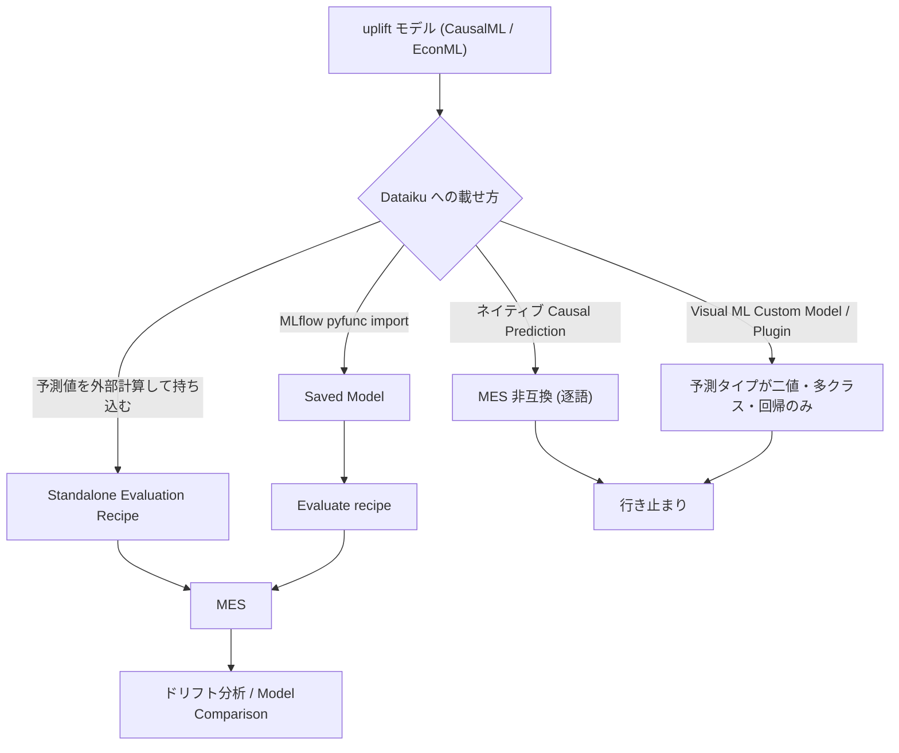
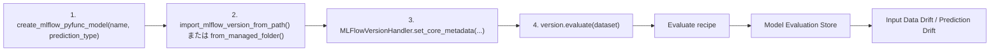
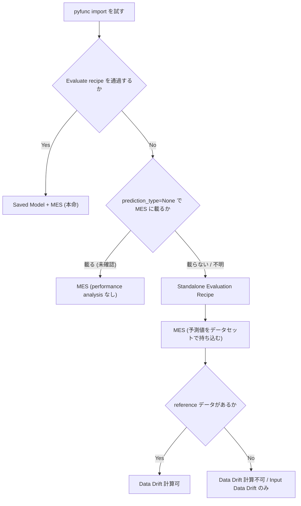

# MLflow pyfunc 経路 — 監視と両立する唯一の公式ルート

CausalML / EconML で学習した uplift モデルを `mlflow.pyfunc.PythonModel` で包み、Dataiku の Saved Model として import し、Evaluate recipe → Model Evaluation Store (MES) → ドリフト分析へ載せる経路を精査する。本レポートは custom_python_path クラスタの中核であり、**「この経路が公式に記述されている唯一の道である」ことと「その中核に未解決の原理的問題が残ること」を同時に**扱う。

## 1. なぜこの経路なのか

### 1.1 ネイティブ Causal Prediction は MES と公式に非互換

Dataiku の Causal Prediction 導入ページ（[Introduction — Causal Prediction](https://doc.dataiku.com/dss/latest/machine-learning/causal-prediction/introduction.html)）は、非互換対象を逐語で列挙している。

> "Causal prediction is incompatible with the following: MLflow models, Models ensembling, Model export, Model Evaluation Stores, Model Document Generator"

この 5 項目のうち **Model Evaluation Stores** が含まれる時点で、「ネイティブ Causal Prediction で学習し、MES で監視する」構成は公式に閉じている。同時に **MLflow models** も列挙されているため、「ネイティブ Causal Prediction を MLflow 経由で流用する」道も閉じている。つまりネイティブ機能と MES は、どちらの方向からも接続できない。

さらに [Causal Prediction Settings](https://doc.dataiku.com/dss/latest/machine-learning/causal-prediction/settings.html) は "Causal prediction does not support K-Fold cross-test." を**別ページに別記**しており、制約が単一ページに集約されていない点に注意が必要である。加えて公式 KB の [Tutorial | Causal prediction](https://knowledge.dataiku.com/latest/ml-analytics/causal-prediction/tutorial-causal-prediction.html) は、本体ドキュメントにない **`custom models` 非対応**・**`SQL/Spark scoring` 非対応**を独自に挙げており、KB と本体ドキュメントで制約列挙が食い違っている（本クラスタの未解決論点 18）。

### 1.2 MLflow モデルは MES に載ると公式に明記されている

一方、[Evaluating Dataiku Prediction models](https://doc.dataiku.com/dss/latest/mlops/model-evaluations/dss-models.html) は、Evaluate recipe と MES の適用範囲について次のように述べる。

> Visual ML で学習したモデルと **インポートされた MLflow モデルの両方** に適用される

この一文が本経路の全根拠である。「uplift モデル（を含む任意の Python モデル）」と「MES」の両方が公式に動作すると書かれた経路は、他に存在しない。

### 1.3 消去法としての位置づけ

| 経路 | uplift 実装 | MES 接続 | 公式記述 |
|------|------------|---------|---------|
| ネイティブ Causal Prediction | 可 | **不可**（逐語で非互換） | 明記あり（否定） |
| Visual ML Custom Models (`clf` 契約) | 二値/多クラス/回帰のみ | 可 | causal 予測タイプが存在しない |
| Plugin Prediction Algorithm | 二値/多クラス/回帰のみ | 可 | 「Plugin algorithms cannot utilize the plugin code environment」 |
| **MLflow pyfunc import** | **原理上可** | **可（明記あり）** | **明記あり（肯定）** |
| Standalone Evaluation Recipe (SER) | 経路外（予測値を持ち込む） | 可 | 明記あり（肯定） |

[Component: Prediction algorithm](https://doc.dataiku.com/dss/latest/plugins/reference/prediction-algorithms.html) は `BaseCustomPredictionAlgorithm` が二値分類・多クラス分類・回帰のみに対応すると述べており、**causal はプラグインとしても拡張できない**。[In-memory Python の Custom Models 節](https://doc.dataiku.com/dss/latest/machine-learning/algorithms/in-memory-python.html) の `clf` 契約も同じ予測タイプの枠に閉じている。したがって pyfunc 経路が第一候補、SER がフォールバックという構図になる。



## 2. 手順 — 4 ステップの公式コード経路

[Importing MLflow models](https://doc.dataiku.com/dss/latest/mlops/mlflow-models/importing.html) が中核の一次ソースであり、`create_mlflow_pyfunc_model` → `import_mlflow_version_from_path` / `..._from_managed_folder` → `set_core_metadata` → `evaluate` の 4 ステップを完全なコード例で示している。



### 2.1 pyfunc のオーサリング

[mlflow.pyfunc API reference](https://mlflow.org/docs/latest/api_reference/python_api/mlflow.pyfunc.html) および [MLflow PythonModel Guide](https://mlflow.org/docs/latest/ml/model/python_model/) に従い、`PythonModel` をサブクラス化する。`load_context` で重い初期化を行い、`predict(context, model_input, params=None)` で推論を返すのが標準形である（[Understanding PyFunc in MLflow](https://mlflow.org/docs/latest/ml/traditional-ml/tutorials/creating-custom-pyfunc/part2-pyfunc-components/)）。

```python
import mlflow
import pandas as pd


class UpliftPyfunc(mlflow.pyfunc.PythonModel):
    """CATE を返す uplift モデルのラッパ。

    NOTE: 出力の意味論が Dataiku のどの prediction_type にも
    収まらない点は本レポート 4 章の未解決問題を参照。
    """

    def load_context(self, context):
        import cloudpickle

        with open(context.artifacts["model"], "rb") as f:
            self._learner = cloudpickle.load(f)

    def predict(self, context, model_input: pd.DataFrame, params=None):
        # CausalML の *Learner は predict(X) で CATE を返す
        cate = self._learner.predict(model_input.values)
        return pd.DataFrame({"cate": cate.ravel()})
```

シグネチャは [Model Signatures and Input Examples](https://mlflow.org/docs/latest/ml/model/signatures/) の `infer_signature` で付与するのが定石だが、uplift の多出力（CATE に加えて傾向スコアや baseline 予測を返したい場合）を通す際の要になる。型ヒントによるスキーマ推論は MLflow 2.20.0 以降で利用できる（PythonModel Guide）。

### 2.2 Dataiku への import

```python
import dataiku

client = dataiku.api_client()
project = client.get_project("UPLIFT_OPS")

# 1. pyfunc Saved Model を作る
#    prediction_type は BINARY_CLASSIFICATION / MULTICLASS / REGRESSION / None
sm = project.create_mlflow_pyfunc_model(
    name="uplift_cate",
    prediction_type="REGRESSION",  # ← 4 章の未解決問題の核心
)

# 2. アーティファクトを version として取り込む
mlflow_version = sm.import_mlflow_version_from_path(
    version_id="v1",
    path="/path/to/mlflow_model_dir",
    code_env_name="py310_uplift",
)
# もしくは managed folder 経由:
# mlflow_version = sm.import_mlflow_version_from_managed_folder(
#     version_id="v1",
#     managed_folder=folder,
#     path_in_folder="mlflow_model_dir",
#     code_env_name="py310_uplift",
# )

# 3. Dataiku 側のスキーマ・意味論メタデータを与える
mlflow_version.set_core_metadata(
    target_column_name="???",   # ← 何を渡すのかが原理的に未解決（4 章）
    class_labels=None,          # REGRESSION では不要
    get_features_from_dataset="uplift_eval",
)

# 4. 評価してパフォーマンスタブを埋める
mlflow_version.evaluate("uplift_eval")
```

[Training MLflow models](https://doc.dataiku.com/dss/latest/mlops/mlflow-models/training.html) は `mlflow.<framework>.save_model()` → managed folder 経由の import という流れを示しており、Dataiku 内で学習からそのまま import するなら managed folder 版が自然である。[Importing serialized scikit-learn pipelines as Saved Models](https://developer.dataiku.com/latest/tutorials/machine-learning/model-import/scikit-pipeline/index.html) は pickle → MLflow → Saved Model の実践例で、**pyfunc 経路に最も近い公式チュートリアル**である（ただし対象は通常の教師あり学習であり uplift ではない）。

### 2.3 MES への接続

import 済みの MLflow モデルは Evaluate recipe の入力にできる（[Evaluating Dataiku Prediction models](https://doc.dataiku.com/dss/latest/mlops/model-evaluations/dss-models.html)）。出力が MES となり、実行ごとに性能が蓄積されて推移が可視化される（[Concept | Model evaluation stores](https://knowledge.dataiku.com/latest/mlops-o16n/model-monitoring/concept-model-evaluation-stores.html)）。MES の Python API は [Model Evaluation Stores — Developer Guide](https://developer.dataiku.com/latest/concepts-and-examples/model-evaluation-stores.html) にある。

ドリフトは 2 系統に分かれる。

| ドリフト種別 | 定義 | ground truth | uplift への転用 |
|------------|------|-------------|----------------|
| [Input Data Drift](https://doc.dataiku.com/dss/latest/mlops/drift-analysis/input-data-drift.html) | 特徴量分布の分析 | **不要** | そのまま使える。uplift でも共変量分布の監視は意味を持つ |
| [Prediction Drift](https://doc.dataiku.com/dss/latest/mlops/drift-analysis/prediction-drift.html) | 予測値分布の変化 | 不要 | **uplift スコア分布の監視に転用可能** |
| Data Drift（MES 定義） | 学習時テストセットと評価データセットの行を識別するモデルの accuracy | 不要（reference は必要） | reference データがあれば成立 |

**ground truth を必要としないドリフト分析は uplift でも素直に機能する**。逆に、ground truth を要求する performance metrics 側が 4 章の問題に直撃する。

## 3. 公式が明記する制約

[Limitations and supported versions](https://doc.dataiku.com/dss/latest/mlops/mlflow-models/limitations.html) が予測タイプ制約の一次ソースである。以下は本経路に効く制約の整理である。

| # | 制約 | 一次ソース | uplift への影響 |
|---|------|-----------|----------------|
| 1 | 非表形式 MLflow 入力は非対応 | Limitations | 表形式で設計すれば回避可能 |
| 2 | 予測タイプは Classification・Regression・Time Series Forecasting のみ | Limitations | **致命的**。causal / uplift 型が存在しない（4 章） |
| 3 | 文字列・真偽値は Categorical 扱い | Limitations | 処置フラグ T を bool で渡すと Categorical 化される点に注意 |
| 4 | partitioned model は MES 評価不可 | dss-models（"The model must be a **non-partitioned** ..."） | 「パーティション別 uplift」と「MES 監視」は両立しない |
| 5 | R・Spark の MLflow モデル非対応 | Limitations | Python のみで組む前提なら影響なし |
| 6 | MLflow 2.0.0 未満は非サポート | Limitations | 古い環境からの移行時に効く |
| 7 | 推奨 MLflow 3.10.1 / Python 3.10（2.22.0 と 3.10.1 が検証済） | Limitations | **CausalML 0.17.0 の `>=3.11` と正面衝突する候補**（5.2 節） |
| 8 | Model Comparison から partitioned / ensemble / clustering / non-tabular MLflow を除外、同一 prediction type のみ比較可 | [Model Comparisons](https://doc.dataiku.com/dss/latest/mlops/model-comparisons/index.html) | uplift 同士の比較は prediction type を揃えれば可能 |
| 9 | 「MLflow imposes extremely few constraints on models」ため全機能の動作保証はない | [MLflow Models（概念）](https://doc.dataiku.com/dss/latest/mlops/mlflow-models/index.html) | **本経路のリスクの根拠**（7 章） |

制約 4 と制約 8 は同じ方向を指している。[Partitioned Models](https://doc.dataiku.com/dss/latest/machine-learning/partitioned.html) はさらに「Only top-level (overall model) metrics and checks are available」と述べており、パーティション単位の metrics/checks も取れない。**つまり partitioned uplift モデルは MES 経路も metrics/checks による MES 代替経路も両方塞がれる**。partition 化は本経路と併用しないのが安全である。

なお「Causal Prediction が Partitioned Models と非互換」という主張は**公式ドキュメント上で確認できなかった**（Introduction の逐語リストは 5 項目のみで Partitioned Models を含まない）。非対応と断定する根拠はなく、要確認事項として扱うべきである。

## 4. 本経路の中核的な未解決問題（最重要）

**ここが本クラスタ最大のリスクであり、正直に記述する。本レポートはこの問題を解決しない。**

### 4.1 uplift の出力はどの prediction type にも意味的に収まらない

[Projects — Python API ref](https://developer.dataiku.com/latest/api-reference/python/projects.html) が示す `create_mlflow_pyfunc_model(name, prediction_type=None)` の `prediction_type` の取り得る値は次の 4 つのみである。

| 値 | 意味論 | uplift との適合 |
|----|-------|----------------|
| `BINARY_CLASSIFICATION` | クラス確率 → ラベル | ✗ CATE は確率でもラベルでもない |
| `MULTICLASS` | 多クラス確率 → ラベル | ✗ 同上 |
| `REGRESSION` | 連続値の点予測 | △ 型は合うが**意味論が合わない**（4.2） |
| `None` | 予測タイプ未指定 | △ 到達範囲が不明（5 章） |

**"causal" / "uplift" という prediction type は存在しない。** これは Limitations の「予測タイプは Classification・Regression・Time Series Forecasting のみ」という記述とも整合する。uplift の予測は CATE（Conditional Average Treatment Effect、連続値）であり、`BINARY_CLASSIFICATION` / `MULTICLASS` / `REGRESSION` のいずれにも意味的に収まらない。

### 4.2 `set_core_metadata(target_column_name=...)` に何を渡すのか — 原理的に未解決

`REGRESSION` として import した場合、`set_core_metadata` の `target_column_name` に渡すべきカラムが決まらない。

| 候補 | 内容 | 帰結 |
|------|------|------|
| 実測アウトカム Y | 実際に観測された結果変数 | Evaluate recipe は「CATE 予測 vs 実測 Y」で RMSE 等を計算する。**この数値は uplift 性能を意味しない**（予測しているものと正解が別物） |
| 真の uplift τ | 個体レベルの真の処置効果 | **観測不能**。反実仮想（同一個体を処置した場合と処置しなかった場合の両方の結果）は原理的に得られないため、カラムとして存在させられない |
| 疑似アウトカム（DR pseudo-outcome 等） | `causalml.metrics.cate_scoring.compute_dr_pseudo_outcomes` が生成する類 | 理論上は代理になり得るが、**Dataiku の evaluate に渡した場合の挙動は未検証**。かつ「MES に記録された数値の解釈」が別途必要になる |

**個体レベルの真の処置効果は反実仮想であり観測できないため、MES が期待する「予測 vs 正解」の枠組みと uplift は根本的に噛み合わない。** これは Dataiku の実装上の不備ではなく、uplift modeling の性質と supervised evaluation の枠組みのミスマッチである。[Uplift Curves with TMLE Example](https://causalml.readthedocs.io/en/latest/examples/validation_with_tmle.html) も、真の処置効果が未知だと uplift curve が lift を検出できない問題を扱い、TMLE を代理として持ち出している。

### 4.3 逃げ道の可能性 — Custom Evaluation Metrics

[Evaluating Dataiku Prediction models](https://doc.dataiku.com/dss/latest/mlops/model-evaluations/dss-models.html) は Custom Evaluation Metrics の一次ソースでもあり、次の 2 点が uplift にとって重要である。

> "you must define a 'score' function that returns a single float"

かつ **MES 出力時は reference dataframe も score 関数に渡される**。reference が手に入るなら、Qini / AUUC のような群比較を要するメトリックを score 関数の中で計算する余地がある。

```python
# 概念スケッチ — 実機未検証。score 関数のシグネチャは要実測。
def score(y_valid, y_pred, X_valid=None, sample_weight=None):
    """Qini 係数を返す。

    WARNING: 引数名・引数順・reference dataframe の受け取り方は
    公式ドキュメントの散文記述から推測したものであり、
    実機で確認する必要がある。
    """
    import pandas as pd
    from causalml.metrics import qini_score

    df = pd.DataFrame({
        "uplift_pred": y_pred,
        "y": y_valid,
        "w": X_valid["treatment"],
    })
    return float(qini_score(df, outcome_col="y", treatment_col="w").iloc[0])
```

`causalml.metrics` の実在エクスポートは [`causalml/metrics/__init__.py`](https://github.com/uber/causalml/blob/master/causalml/metrics/__init__.py) が正典であり（専用 API ページは 404）、`auuc_score` / `qini_score` / `get_cumgain` / `get_qini` の定義は [visualize のソース](https://causalml.readthedocs.io/en/latest/_modules/causalml/metrics/visualize.html) で確認できる。

ただし **この逃げ道は 4.2 の問題を解消しない**。custom metric が動いたとしても、`set_core_metadata(target_column_name=...)` に何を宣言するかという import 時の問題は残るし、Dataiku 標準の RMSE 等が意味のない値として MES に併記される可能性も残る。Prediction settings のカスタムスコア関数（[Prediction settings](https://doc.dataiku.com/dss/latest/machine-learning/supervised/settings.html)）は sklearn scorer プロトコル準拠かつ **"Python in-memory" 学習エンジン限定**であり、MLflow import モデルには適用経路が異なる点にも注意。

## 5. `prediction_type=None` の逃げ道とその限界

### 5.1 明記されていること／されていないこと

Projects API リファレンスは `prediction_type=None` について「**performance analysis と explainability が利用不可**」と明記する。[Deploying MLflow models (Experiment Tracking)](https://doc.dataiku.com/dss/latest/mlops/experiment-tracking/deploying.html) も、prediction type を "Other" にすれば**評価をバイパス可能**と述べる。

しかし、**`None`（あるいは "Other"）の状態で MES に載るか否かは公式に明記がない**。

| 項目 | `REGRESSION` | `None` / "Other" |
|------|-------------|-----------------|
| import 自体 | 可 | 可 |
| スコアリング | 可 | 可（と読める） |
| performance analysis | 可 | **不可（明記）** |
| explainability | 可 | **不可（明記）** |
| `set_core_metadata` の target | 4.2 の問題に直撃 | 不要（評価バイパス） |
| **MES に載るか** | 可（明記） | **記載なし — 未解決** |

「performance analysis が使えない」と「Evaluate recipe / MES に載らない」は同義とは限らない。Input Data Drift と Prediction Drift は ground truth を必要としないため、原理的には prediction type が未指定でも成立し得る。だがこれは推測であり、**公式に書かれていない**。

**もし `None` で MES に載らないなら、SER 経由が唯一の道になる**（8 章）。この分岐が本経路の設計を決めるため、実機検証の最優先項目である。

### 5.2 Python バージョンゲート（併走する制約）

| コンポーネント | 要求 | 出典 |
|--------------|------|------|
| Dataiku の MLflow 検証済み構成 | **Python 3.10** / MLflow 2.22.0・3.10.1 | Limitations |
| CausalML 0.17.0 | **`>=3.11`**（ハードゲート、PyPI JSON で実測） | [causalml · PyPI](https://pypi.org/project/causalml/) / [Installation](https://causalml.readthedocs.io/en/latest/installation.html) |
| CausalML 0.15.5（2025-07-09） | `>=3.9`（`>=3.11` 導入前の最後のリリース） | PyPI |
| EconML 0.16.0 | `>=3.9`（Python 3.9–3.13） | [econml · PyPI](https://pypi.org/project/econml/) |

**DSS の検証済み構成が 3.10 なら CausalML 0.17.0（`>=3.11`）と正面衝突する。** 回避策は (a) `causalml==0.15.5` へのピン留め（ただし RATE/TOC 等の新 API の可否は要確認）、(b) EconML を主軸にする（ゲートなし）、(c) DSS 側の Python 3.11 提供可否を確認する、の 3 択。ただし **DSS 側が提供する Python バージョンの上限は未確認**であり、「3.10 検証済み」は「3.11 不可」を意味しない。この 3.10 vs 3.11 の齟齬は**本経路の実務上の最大のブロッカー候補**である。

## 6. `set_core_metadata` の必須性のニュアンス

原文の表現は 2 箇所に分かれており、単純な「必須／任意」ではない。

| 原文 | 読み |
|------|------|
| "Optional, only for regression or classification models" | **import 自体には不要** |
| "mandatory to have access to the saved model performance tab" | **performance タブには必須** |

すなわち **import には不要、performance タブには必須**。この非対称性は 5.1 の分岐とも整合する — performance タブを諦めるなら `set_core_metadata` を省略でき、4.2 の「target に何を渡すか」問題も回避できるが、その代償として performance analysis を失う。

なお `MLflowVersionHandler` / `ExternalModelVersionHandler` の**ブラウズ可能な公式 API リファレンスは事実上存在しない**（10 章）。上記の逐語は Importing MLflow models ページの散文からの引用であり、正式なシグネチャは [`dataikuapi/dss/savedmodel.py`](https://github.com/dataiku/dataiku-api-client-python/blob/master/dataikuapi/dss/savedmodel.py) を読むしかない。

## 7. CausalML の Cython 依存と可搬性

[uber/causalml](https://github.com/uber/causalml) の言語構成は **Python 69.3% / Cython 30.7%** である（★5.9k、Apache 2.0、最新 v0.17.0 = 2026-07-04）。この 30.7% の Cython が pyfunc アーティファクトの可搬性に直結する。

| 論点 | 状態 |
|------|------|
| pyfunc アーティファクトに CausalML を含めた場合、スコアリング code env で **Cython の再ビルドが要るのか** | **未確認** |
| PyPI の wheel が解決するのか | **未確認**（プラットフォーム・Python バージョンの組み合わせに依存） |
| cloudpickle 化した学習済み `*Learner` が別環境で復元できるか | **未確認**（Cython 拡張型のシリアライズは環境依存） |

緩和策の候補として [Models From Code](https://mlflow.org/docs/latest/ml/model/models-from-code/)（MLflow 2.12.2+）がある。これはモデルをシリアライズせず**可読な Python スクリプトとして保存**する新推奨方式であり、pickle 互換性に起因する破損を避けられる。Cython 拡張を持つライブラリを扱う場合、シリアライズされたオブジェクトではなく「code env に入った同一バージョンのライブラリを import して再構築する」形に寄せられるため理屈上は有利である。ただし **CausalML / EconML × Models From Code の前例は見つかっていない**。

```python
# Models From Code の形（概念）— シリアライズされた学習器ではなく
# スクリプト自体が model として保存される。CausalML の Cython 依存に対する
# 緩和策候補だが、この組み合わせの前例は未発見。
import mlflow

mlflow.pyfunc.log_model(
    name="uplift_cate",
    python_model="uplift_model_script.py",  # パスを渡す = Models From Code
    artifacts={"learner": "s3://.../learner.pkl"},
    pip_requirements=["causalml==0.15.5", "cloudpickle"],
)
```

## 8. フォールバック — Standalone Evaluation Recipe (SER)

pyfunc import が難航した場合の最有力フォールバックが SER である（[Evaluating other models](https://doc.dataiku.com/dss/latest/mlops/model-evaluations/external-models.html)）。SER は DSS Visual ML / MLflow の**外**にあるモデルを評価するための仕組みで、**モデルそのものを Dataiku に載せない**。

| 項目 | 内容 |
|------|------|
| 入力 | 評価データセット（**予測値カラムを含む**） |
| 出力 | MES |
| モデルの登録 | 不要 |
| 4.2 の問題 | **回避できる**（prediction_type も set_core_metadata も介在しない） |
| **制約 1** | **reference データがないと Data Drift が計算不可** |
| **制約 2** | Model Evaluation は**最大 20000 行のサンプル** |

制約 2 は uplift にとって無視できない。uplift スコアの裾（最上位・最下位デシル）を見たい場合、20000 行サンプリングが効く可能性がある。Qini / AUUC は分布全体の順序に依存するため、サンプリングの影響を事前に見積もるべきである。



## 9. 先行事例がほぼ無い

**「CausalML/EconML を `mlflow.pyfunc.PythonModel` で包む」チュートリアルは 3 方向から検索してゼロ**である。

| 事例 | 内容 | 本経路との距離 |
|------|------|--------------|
| [MLflow and Databricks for CausalOps](https://awadrahman.medium.com/mlflow-and-databricks-for-causalops-6b11d8b07c0e)（2024-11） | **因果モデルの pyfunc ラップを実際に示す唯一の記事** | ⚠️ 対象は因果**探索**（gCastle）であり **CATE ではない** |
| [causal-incentive（Databricks Solution Accelerator）](https://github.com/databricks-industry-solutions/causal-incentive) | PyWhy（DoWhy + EconML）+ Double ML で顧客別インセンティブ推薦、MLflow でモデル管理 | 因果 ML 運用化に最も近い実コード。ただし Dataiku ではない |
| Dataiku 公式 | [scikit-learn pipeline の import チュートリアル](https://developer.dataiku.com/latest/tutorials/machine-learning/model-import/scikit-pipeline/index.html) | pyfunc 経路に最も近いが、対象は通常の教師あり学習 |

最も近い CausalOps 記事は、**「固定 signature と因果モデルの可変 I/O の不一致」を課題として明示している**。因果モデルは推論時に処置変数・共変量・傾向スコアなど可変の入力を要求し、複数の出力（点推定・信頼区間・ポリシー）を返すが、MLflow の signature は固定である。**uplift 化でも同じ壁に当たる**ことが強く予想される。

加えて、**uplift モデルのリアルタイムサービング専門の解説も未発見**、**Microsoft/Azure の EconML + MLflow コンテンツも存在しない**。

**結論: 本経路はコミュニティの前例がほぼない領域であり、設計・検証コストを高めに見積もるべきである。**

## 10. 文書化ギャップ

| ギャップ | 実態 |
|---------|------|
| `MLflowVersionHandler` / `ExternalModelVersionHandler` の API リファレンス | **ブラウズ可能な公式リファレンスは事実上存在しない**。[`dataikuapi/dss/savedmodel.py`](https://github.com/dataiku/dataiku-api-client-python/blob/master/dataikuapi/dss/savedmodel.py) が**唯一の正典** |
| [Machine learning — Python API ref](https://developer.dataiku.com/latest/api-reference/python/ml.html) | ⚠️ **要注意**。`DSSMLTask` 系のみで、`set_core_metadata` / `MLflowVersionHandler` / `import_mlflow_version_from_path` は**いずれも存在しない**。旧 `saved_models.html` はここへ 301 |
| `causalml.metrics` の API ページ | 404。[`__init__.py`](https://github.com/uber/causalml/blob/master/causalml/metrics/__init__.py) が代替の正典 |
| KB と本体ドキュメントの Causal Prediction 制約列挙 | 食い違う（KB のみ `custom models` / `SQL/Spark scoring` 非対応を挙げる） |
| Dataiku の Causal Prediction が内部で EconML/CausalML を使っているか | **非公開** |

`set_core_metadata` / `evaluate` の実署名を確認したい場合、公式ドキュメントの散文ではなく GitHub ソースを直接読むこと。

## 11. 公式の但し書きと、最大のリスク低減策

[MLflow Models（概念）](https://doc.dataiku.com/dss/latest/mlops/mlflow-models/index.html) は、MLflow モデルでスコアリング / API node / 評価 / ドリフト / ガバナンスが可能と述べる一方、次の注意書きを置いている。

> "MLflow imposes extremely few constraints on models" ため **全機能の動作保証はない**

これは本経路のリスクの公式な根拠である。「MLflow モデルは MES に載る」と「あなたの pyfunc が MES に載る」の間には、Dataiku 自身が認める隙間がある。

**したがって、最大のリスク低減策は次の一点に尽きる。**

> **初日に、自分の pyfunc を Evaluate recipe に通すスモークテストを行う。**

設計を詰める前に、最小構成（ダミーの CATE を返すだけの `PythonModel`）で `create_mlflow_pyfunc_model` → `import_mlflow_version_from_path` → `set_core_metadata` → `evaluate` → Evaluate recipe → MES を一周させる。これで 4 章・5 章の未解決問題のうち、**実機で答えが出るもの**が一気に確定する。

### 初日スモークテストで確定させるべき項目

| # | 検証項目 | 分岐後の設計影響 |
|---|---------|----------------|
| 1 | `REGRESSION` + `target_column_name=Y` で Evaluate recipe が通るか | 通れば「意味のない RMSE が出る」ことを承知で MES に載せられる |
| 2 | **`prediction_type=None` で MES に載るか** | 載らなければ SER が唯一の道（5.1） |
| 3 | `set_core_metadata` を省略した場合の evaluate の挙動 | 6 章の非対称性を実測 |
| 4 | Custom Evaluation Metric の score 関数に reference dataframe が実際に渡るか・その形状 | Qini/AUUC を MES に載せられるかが決まる（4.3） |
| 5 | Input Data Drift / Prediction Drift が prediction_type 非依存で動くか | ground truth なし監視の成否 |
| 6 | code env で CausalML の Cython 拡張が解決するか（wheel か再ビルドか） | Models From Code への切替判断（7 章） |
| 7 | DSS が提供する Python の上限（3.10 か 3.11 か） | CausalML 0.17.0 か 0.15.5 ピンか EconML 主軸か（5.2） |

## 12. まとめ

- **MLflow pyfunc 経路は、「uplift モデル」と「MES」の両方が公式に動作すると書かれた唯一の経路である**。ネイティブ Causal Prediction は MES と逐語で非互換、Custom Models / Plugin Algorithm は予測タイプの枠に閉じている。
- **その中核に、原理的な未解決問題が残る**。uplift の予測は CATE（連続値）であり、`BINARY_CLASSIFICATION` / `MULTICLASS` / `REGRESSION` のいずれにも意味的に収まらない。"causal/uplift" という prediction type は存在しない。`set_core_metadata(target_column_name=...)` に何を渡すのか（実測 Y か、観測不能な真の uplift か）は本レポートでは解決しない。個体レベルの真の処置効果は反実仮想であり観測できないため、MES の「予測 vs 正解」の枠組みと uplift は根本的に噛み合わない。**これがこのクラスタ最大のリスクである。**
- **`prediction_type=None` は逃げ道になり得るが、MES への到達可否が公式に未記載**。載らないなら SER が唯一の道。
- **ground truth を要さない監視（Input Data Drift / Prediction Drift）は uplift でも素直に機能する見込み**があり、performance metrics を諦める形の縮退運転は現実的な着地点になり得る。
- **CausalML の Cython 依存（30.7%）と Python `>=3.11` ゲートが、DSS の検証済み構成（Python 3.10）と衝突する可能性**がある。0.15.5 ピンか EconML 主軸かの判断が要る。
- **先行事例がほぼ無い**（3 方向の検索でゼロ）。最も近い CausalOps 記事も因果探索であり、しかも「固定 signature と因果モデルの可変 I/O の不一致」という同じ壁を明示している。設計・検証コストは高めに見積もるべき。
- **最大のリスク低減策は、初日に自分の pyfunc を Evaluate recipe に通すスモークテストを行うこと。** Dataiku 自身が「全機能の動作保証はない」と書いている以上、机上検討で埋まらない隙間は実機でしか埋まらない。
