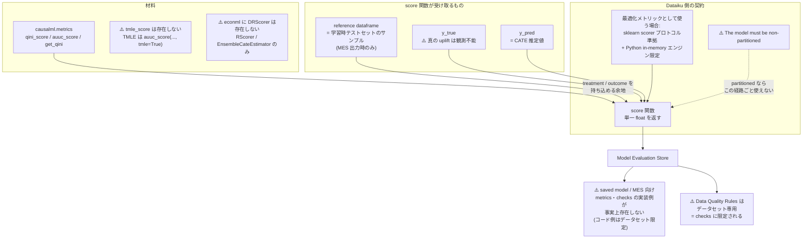

# カスタム評価メトリックで Qini/AUUC を実装する

## なぜこれが必要になるのか

ネイティブ Causal Prediction を離れた瞬間、**Qini / AUUC は誰も計算してくれなくなる**。MLflow pyfunc 経路（02）にせよカスタム推定器経路にせよ、Dataiku から見れば手元にあるのは「回帰モデル」であり、回帰モデルに対して Dataiku が出す指標は R² や RMSE である。それらは uplift の性能を一切測っていない。

したがって **uplift 指標を自分で書いて Dataiku に持ち込む**必要がある。その口が Custom Evaluation Metrics である。

## Custom Evaluation Metrics の契約

一次ソースは Evaluating Dataiku Prediction models（公式ドキュメント）。これは経路 B の根拠であると同時に、Custom Evaluation Metrics の仕様ページでもある。

### 適用範囲

> 「Visual ML と**インポートされた MLflow モデルの両方**に適用」

これが重要である。**pyfunc として import したモデルにもカスタムメトリックを適用できる**。ここが uplift 指標を取り戻す唯一の合法的な入口になる。

### 関数の形

> "you must define a 'score' function that returns a single float"

契約は極端に単純で、**float を 1 つ返す `score` 関数**。Qini 係数も AUUC も単一のスカラーなので、**戻り値の形の面では相性は良い**。問題は入力側にある。

### ⚠️ 制約: non-partitioned

同ページは以下を明記している。

> "The model must be a **non-partitioned** ..."

**パーティション化されたモデルにはカスタム評価メトリックが使えない**。これは 04 で扱うトリレンマの構成要素の一つである。

### 最適化メトリックとしてのカスタムスコア関数

学習時の最適化メトリックとしてカスタムスコア関数を使う場合、Prediction settings ページが別の制約を課している。

| 制約 | 内容 |
|------|------|
| プロトコル | **sklearn scorer プロトコル準拠必須** |
| 学習エンジン | **"Python in-memory" 学習エンジン限定** |

sklearn scorer プロトコルは `scorer(estimator, X, y)` の形を要求する。**ここに treatment 列が入る余地は契約上ない**。uplift 指標は本質的に `(y_true, uplift_score, treatment)` の 3 つを必要とするため、この時点で素直には収まらない。treatment を X の中に残して scorer 内部で取り出すという回避策が考えられるが、その場合 treatment が特徴量としてモデルに渡ることになり、設計として一貫させるのが難しい。

## reference dataframe — 突破口

Custom Evaluation Metrics には uplift 指標を書く上で決定的に重要な性質がある。

> **MES 出力時は reference dataframe（学習時テストセットのサンプル）も score 関数に渡される**

つまり **MES 経由でメトリックが評価されるとき、score 関数は評価データセットだけでなく学習時テストセットのサンプルも受け取れる**。

これがなぜ効くのか。Qini / AUUC は「処置群と対照群を uplift スコア順に並べて累積効果を比較する」ものであり、**単一の予測ベクトルだけでは計算できない**。少なくとも treatment 割当と実測 outcome が要る。reference dataframe が渡されるなら、そこに treatment 列と outcome 列を含めておくことで、**Qini/AUUC を計算するための材料を score 関数の中に持ち込める余地が生まれる**。

**ただしこれは「余地がある」以上のことは言えない。** 以下の理由による。

### ⚠️ MES は uplift の意味を理解しない

MES 側は y_true / y_pred という**教師あり学習の枠組みでしか物を渡してこない**。「y_true に何が入るか」「y_pred に何が入るか」は、02 で論じた `set_core_metadata(target_column_name=...)` に何を渡すかという未解決問題と直結している。

uplift において：

- **真の uplift は観測不能**である（個体レベルでは処置した場合としなかった場合の両方は見られない）
- したがって y_true に「真の uplift」を入れることは**原理的に不可能**
- y_true に実測 outcome Y を入れると、y_pred（CATE 推定値）と**次元も意味も違うものを比較する**ことになる

**y_true / y_pred の受け渡し設計は自分で詰める必要がある。** Dataiku は何も助けてくれないし、間違った設計をしても何も警告しない。ここは本項目における最大の設計上の負債である。

### ⚠️ 実装例が事実上存在しない

Custom probes and checks（公式ドキュメント）は、カスタム check が「the folder, **saved model, model evaluation store** or dataset」を引数に取れると述べている。**saved model と MES が明示的に列挙されている**。

しかし **コード例はデータセット限定**である。saved model / MES 向けの metrics / checks の実装例は事実上存在しない。「引数に取れる」とだけ書いてあり、**その引数オブジェクトがどういう API 形状をしているかは実機で確かめるしかない**。

さらに Data Quality Rules（12.6.0 導入）は以下を明記している。

> "Other flow objects (managed folders, saved models, model evaluation store) still use checks"

**＝ DQ Rules はデータセット専用**。「新しい DQ Rules 機構を MES 監視に使う」という構想は成立せず、**旧来の checks に限定される**。

## `causalml.metrics` の実在関数

Qini/AUUC を自作すると言っても、ゼロから書く必要はない。CausalML が提供している。ただし**`causalml.metrics` 専用の API ドキュメントページは存在しない（404）**ため、`__init__.py` のエクスポート一覧が実質的な正典になる。

| サブモジュール | エクスポート |
|--------------|------------|
| `visualize` | plot, **plot_gain**, plot_lift, **plot_qini**, plot_tmlegain, plot_tmleqini, **get_cumgain**, get_cumlift, **get_qini**, get_tmlegain, get_tmleqini, **auuc_score**, **qini_score** |
| `rate` | **get_toc**, **rate_score**, **plot_toc** |
| `cate_scoring` | compute_dr_pseudo_outcomes, **dr_score**, **plug_in_t_score**, **rlearner_score** |
| `sensitivity` | Sensitivity, SensitivityPlaceboTreatment, SensitivityRandomCause, SensitivityRandomReplace, SensitivitySubsetData, SensitivitySelectionBias |

`auuc_score` / `qini_score` / `get_cumgain` / `get_qini` の定義は `causalml.metrics.visualize` のソースで確認できる。

CausalML の Validation ページは検証の枠組みとして Multiple Estimates / Synthetic Data / Uplift Curve (AUUC) / Sensitivity Analysis の 4 つを挙げている。感度分析クラス群（6 クラス）は、uplift の推定が交絡にどれだけ頑健かを見る道具であり、**単一 float を返す score 関数の枠には収まりにくい**が、別途 check として回す価値はある。

### ⚠️ 訂正 1: `tmle_score` / `TMLELearner` は存在しない

**`tmle_score` および `TMLELearner` は `causalml.metrics` に存在しない。** 事前情報にこれらの名前があった場合、それは誤りである。

TMLE 系は以下の形で提供されている。

- `plot_tmlegain` / `get_tmlegain` / `plot_tmleqini` / `get_tmleqini` — 関数として
- **`auuc_score(..., tmle=True)` — 引数フラグとして**

TMLE は独立した関数ではなく、**`auuc_score` の引数**である。この区別は重要で、`from causalml.metrics import tmle_score` は ImportError になる。

TMLE がなぜ uplift 評価に出てくるかは Uplift Curves with TMLE Example に説明がある。**真の処置効果が未知だと uplift curve が lift を検出できない**という問題があり、TMLE がその代理として使われる。

### ⚠️ 訂正 2: EconML の `DRScorer` は存在しない

**`econml.score` にあるのは `RScorer` と `EnsembleCateEstimator` の 2 つのみ。** `DRScorer` は存在しない。

なお EconML 側で uplift の下流に効く道具として `econml.policy.DRPolicyTree` がある。これは二重頑健補正で選択バイアスを調整し、決定木で最適処置割当を学習するもので、スコアリングではなく方策学習の道具である。

また EconML のドキュメントは `econml.azurewebsites.net` から `pywhy.org/EconML` へ **301 で恒久移転**している。古いブックマークやリンクは更新が要る。

## 実装のスケッチ

gather の情報が支えられる範囲でのスケッチを示す。**これは動作確認されたコードではなく、契約から演繹した骨格である。**

```python
from causalml.metrics import qini_score


def score(y_valid, y_pred, **kwargs):
    """Custom Evaluation Metric: Qini 係数を返す。

    契約:
      - 単一の float を返すこと
      - MES 出力時は reference dataframe も渡される

    ⚠️ 未解決:
      - y_valid に何が入るかは set_core_metadata の
        target_column_name に何を渡したかに依存する。
        真の uplift は観測不能なため、実測 outcome Y が
        入る想定になるが、y_pred (CATE 推定値) とは
        意味が異なる。
      - treatment 列の受け渡し経路は自分で設計する必要がある。
      - reference dataframe の実際の引数名・形状は
        公式に実装例がなく、実機確認が必要。
    """
    # treatment をどう取得するかがこの経路の核心的な未解決点。
    # 評価データセット側に treatment 列を残しておき、
    # kwargs 経由で受け取れるかは実機で確認すること。
    raise NotImplementedError("treatment の受け渡し経路を実機で確定させてから実装する")
```

`qini_score` を呼ぶこと自体は難しくない。**難しいのは「Dataiku がこの関数に何を渡してくるか」を確定させることであり、そこに公式の答えがない。**

## 構造



## 何が確定していて何が確定していないか

| 事項 | 状態 |
|------|------|
| Custom Evaluation Metrics は float を返す `score` 関数 | **確定**（公式逐語） |
| Visual ML と import された MLflow モデルの両方に適用可 | **確定**（公式逐語） |
| MES 出力時は reference dataframe も渡される | **確定**（公式） |
| モデルは non-partitioned でなければならない | **確定**（公式逐語） |
| 最適化メトリックは sklearn scorer プロトコル準拠・Python in-memory 限定 | **確定**（公式） |
| `causalml.metrics` の実在関数一覧 | **確定**（`__init__.py` で確認） |
| `tmle_score` / `TMLELearner` は存在しない | **確定**（訂正済み） |
| `econml.score` に `DRScorer` は存在しない | **確定**（訂正済み） |
| Data Quality Rules は saved model / MES に使えない | **確定**（公式逐語） |
| **y_true / y_pred に何が入るか（uplift の場合）** | **未解決 — 自分で設計する必要がある** |
| **reference dataframe の引数名・実際の形状** | **未確認 — 実装例が存在しない** |
| **treatment 列の受け渡し経路** | **未確認 — 契約上の口がない** |
| **saved model / MES 向け metrics/checks の API 形状** | **未確認 — 実機で確かめるしかない** |

## 結論

**Qini/AUUC を Dataiku のカスタム評価メトリックとして実装する余地は確かにある。** 決め手は 2 つ。

1. Custom Evaluation Metrics が **import された MLflow モデルにも適用される**こと
2. **MES 出力時に reference dataframe が score 関数に渡される**こと

この 2 つがなければ、そもそも uplift 指標を MES 経路に載せる話は成り立たなかった。

**しかし「余地がある」と「実装できる」の間には、公式ドキュメントが埋めてくれない距離がある。**

- **MES は uplift の意味を理解しない。** y_true / y_pred の受け渡し設計は自分で詰めるしかなく、真の uplift が観測不能である以上、この設計には原理的な妥協が入る。
- **saved model / MES 向けの実装例が事実上存在しない。** 公式は「引数に取れる」と述べるのみで、コード例はすべてデータセット向け。API 形状は実機で確かめるしかない。
- **treatment 列をどう score 関数に届けるかに、契約上の正規の口がない。**

したがって本項目の実務的な進め方は、**「まず reference dataframe に実際に何が渡ってくるかを実機で観測する」ことから始める**べきである。設計を先に固めてから実装すると、渡ってくるものが想定と違った時点で全部やり直しになる。**最小の score 関数を書いて引数をログに吐かせる**のが最初の一手になる。

## 参照した一次ソース

- Evaluating Dataiku Prediction models（公式ドキュメント）— `score` 関数契約、reference dataframe、non-partitioned 制約
- Prediction settings（最適化メトリック）（公式ドキュメント）— sklearn scorer プロトコル、Python in-memory 限定
- Custom probes and checks（公式ドキュメント）— saved model / MES を引数に取れる、⚠️ コード例はデータセット限定
- Data Quality Rules（公式ドキュメント）— DQ Rules はデータセット専用
- Metrics, checks and Data Quality（index）（公式ドキュメント）
- causalml/metrics/`__init__`.py（GitHub）— 実在関数一覧の正典
- Source code for causalml.metrics.visualize（公式ドキュメント）— `auuc_score` / `qini_score` / `get_cumgain` / `get_qini` の定義
- Validation（CausalML）（公式ドキュメント）— 検証の 4 枠組み
- Uplift Curves with TMLE Example（公式ドキュメント）— 真の処置効果未知の問題と TMLE 代理
- econml.score.RScorer（公式ドキュメント）— `RScorer` と `EnsembleCateEstimator` のみ
- econml.policy.DRPolicyTree（公式ドキュメント）— 二重頑健補正 + 決定木による方策学習
- Welcome to econml's documentation!（公式ドキュメント）— 301 移転先
- Model Evaluation Stores — Developer Guide（公式Developer）— MES の Python API
