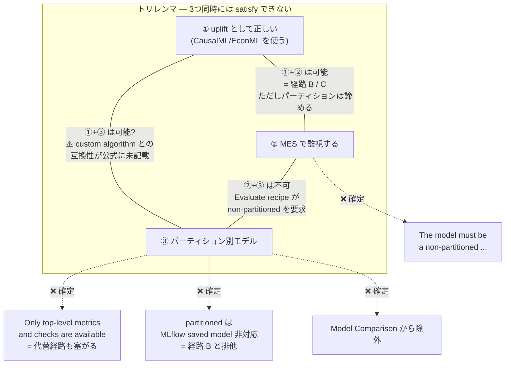
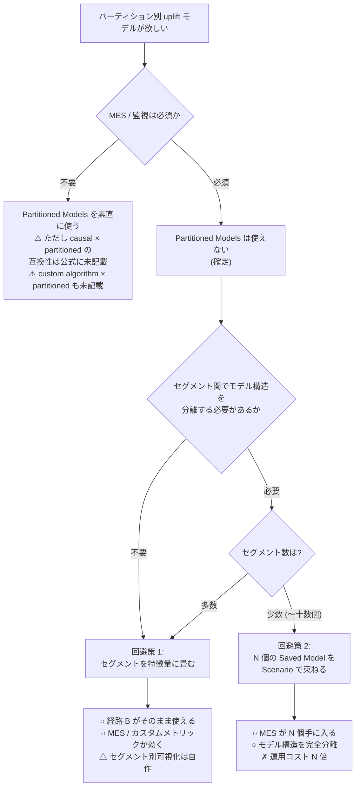

# Partitioned Model と MES は両立しない

## 結論を先に

**「パーティション別 uplift モデル」と「MES による監視」は両立しない。** これは推測ではなく、複数の公式ドキュメントの逐語記述から確定できる。

セグメント別に uplift モデルを作りたい（地域別、チャネル別、顧客セグメント別など）という要求は uplift モデリングでは自然に出てくるが、Dataiku の Partitioned Models でそれを実現すると、**監視の道が全部塞がる**。しかも「MES がダメなら metrics/checks で代替する」という迂回路まで同時に塞がっている点が厄介である。

## 確定事実 — 4 つの逐語記述

### 1. Evaluate recipe は partitioned モデルを受け付けない

Evaluating Dataiku Prediction models（公式ドキュメント）が明記している。

> "The model must be a **non-partitioned** ..."

**MES は Evaluate recipe の出力である。** Evaluate recipe が partitioned モデルを拒否するなら、**partitioned モデルは MES に載らない**。これが一次の衝突であり、最も直接的である。

同時にこれは 03 で扱った Custom Evaluation Metrics も巻き込む。カスタムメトリックは Evaluate recipe の文脈で評価されるため、**partitioned モデルには Qini/AUUC のカスタム実装も適用できない**。

### 2. Model Comparison から partitioned は除外

Model Comparisons（公式ドキュメント）の除外リスト。

> **除外: partitioned / ensemble / clustering / non-tabular MLflow**

同一 prediction type のモデル同士でしか比較できないという制約に加えて、**partitioned モデルはそもそも比較の土俵に上がれない**。

「MES がダメでも Model Comparison でモデル間の性能推移くらいは見られるだろう」という期待は成立しない。

### 3. パーティション単位の metrics/checks も取れない

ここが**最も効く**。Partitioned Models（公式ドキュメント）自身が以下を明記している。

> **"Only top-level (overall model) metrics and checks are available"**

つまり **パーティションごとの metrics / checks は取得できない**。取れるのは全体モデルのトップレベル指標のみ。

これがなぜ致命的か。「MES が使えないなら、metrics と checks を自分で書いてパーティションごとの性能を追跡すればいい」というのが自然な代替案だが、**その代替経路自体が公式に閉じている**。Metrics, checks and Data Quality の index は metrics が saved models / MES にも適用可能だと述べているが、partitioned model については「トップレベルのみ」という上書きの制約がかかる。

さらに Concept | Partitioned models（公式KB）は、**全体 R² が合算の近似値として表示される**と述べている。つまりトップレベルで見える数字ですら、パーティションごとの実態を正確に反映したものではない。

**＝ MES も塞がり、MES 代替経路も塞がる。**

### 4. Partitioned Models のその他の制約

Partitioned Models ページの制約リスト全体。

| 制約 | 内容 |
|------|------|
| 学習エンジン | **Python backend の Visual ML のみ** |
| タスク種別 | **prediction のみ** |
| ensembling | **不可** |
| PMML export | **不可** |
| metrics / checks | **トップレベル（overall model）のみ** |
| MLflow saved model | **非対応** |

最後の行が経路 B（MLflow pyfunc、02 参照）と直接ぶつかる。**partitioned は MLflow saved model に対応していない**ため、「CausalML を pyfunc で包んでパーティション別に学習する」という組み合わせは最初から存在しない。

つまり partitioned を採るなら、**必然的に Visual ML のカスタム推定器経路（01 の経路 C）に限定される**。

## ⚠️ 未確認 — Causal Prediction × Partitioned Models

**「Causal Prediction が Partitioned Models と非互換」という主張は、公式ドキュメント上で確認できなかった。**

事前情報にこの主張があった場合、それは**誤り、または少なくとも未確認**として扱うべきである。

根拠：

- Causal Prediction の Introduction の逐語リストは **5 項目のみ**（MLflow models / Models ensembling / Model export / Model Evaluation Stores / Model Document Generator）で、**Partitioned Models を含まない**
- Partitioned Models ページ側も Causal Prediction を明示的に除外していない

**「非対応と断定する根拠がない」**というのが正確な状態である。ただし裏を返せば「対応していると断定する根拠もない」。Partitioned Models は「prediction のみ」と述べており、causal prediction がその「prediction」に含まれるかは解釈の余地がある。**要確認事項**として扱うのが妥当。

なお 01 で述べた通り、Causal Prediction の制約が Introduction と Settings の**別ページに分散して記述されている**前例がある以上、**Introduction のリストが網羅的であるという前提自体が危うい**。Partitioned Models との非互換が別の場所に書かれている、あるいはどこにも書かれていないが実際には動かない、という可能性は排除できない。

## ⚠️ 未確認 — Partitioned Model × Custom Algorithm

**Partitioned model とカスタムアルゴリズムの互換性は公式に未記載。**

- Partitioned Models ページは **"Visual ML with Python backend" 全体を許可**しており、custom algorithm を除外していない
- しかし**明示的な許可もない**

**消極的な読みしかできない。** 「除外リストに載っていないから使えるはずだ」という推論は、Dataiku のドキュメントが制約を網羅的に列挙していない前例（上述）を踏まえると、あまり強い根拠にならない。

これは実務的に重要である。なぜなら **partitioned を採る場合、01 の経路 C（カスタム推定器）以外に選択肢がない**（MLflow saved model が非対応のため）にもかかわらず、**その唯一の選択肢の互換性が公式に確認できない**からである。

## トリレンマ

以上を統合すると、次の 3 つは**同時に満たせない**。

各辺の状態を整理する。

| 組み合わせ | 可否 | 根拠 |
|-----------|------|------|
| ① uplift + ② MES | **可能**（ただし険しい） | 経路 B / C。01・02・03 で扱った困難はあるが、原理的な閉塞はない |
| ② MES + ③ partitioned | **不可能（確定）** | "The model must be a non-partitioned ..." + Model Comparison 除外 + トップレベル metrics のみ |
| ① uplift + ③ partitioned | **⚠️ 不明** | MLflow 経路は排他（saved model 非対応）。カスタム推定器経路の互換性は公式に未記載 |

**②と③の辺だけが確定的に切れている。** そしてこの辺が切れていることが、トリレンマを成立させている。

## 回避策

パーティション別 uplift モデルが要求される場合、Dataiku の Partitioned Models 機構を使わずに同じ目的を達成する道が 2 つある。

### 回避策 1: セグメントを特徴量に畳む

パーティションキーを**単なる特徴量として X に含める**。モデルは 1 本のまま、セグメント情報はモデル内部で扱う。

| 観点 | 評価 |
|------|------|
| MES | **○ 使える**（non-partitioned なので Evaluate recipe が通る） |
| Custom Evaluation Metrics | **○ 使える**（同上） |
| Model Comparison | **○ 使える** |
| MLflow pyfunc 経路 | **○ 使える**（partitioned でないため） |
| セグメント別の性能可視化 | **△ 自分で作る必要がある** |
| セグメント別のモデル構造の分離 | **✗ できない** — 木の分岐に任せることになる |

**MLOps 的には圧倒的に有利**である。経路 B がそのまま使え、03 のカスタムメトリックもそのまま効く。

代償は、セグメント間で**モデルの構造そのものを変えたい**場合に対応できないこと。ただし uplift モデリングにおいてセグメントを特徴量として扱うのは理論的にも不自然ではない（CATE は元々 X の関数として定義される）ため、**多くの場合これで十分**なはずである。

セグメント別の性能を見たい場合は、03 のカスタムメトリックの中でセグメント別に `qini_score` を計算し、**代表値を 1 つの float に畳んで返す**（最悪セグメントの Qini、加重平均の Qini など）という設計が考えられる。score 関数が返せるのは単一 float なので、複数セグメントの指標を返したければ**メトリックを複数定義する**ことになる。

### 回避策 2: N 個の Saved Model を Scenario で束ねる

セグメントごとに**独立した Saved Model** を作り、Scenario でまとめて学習・評価する。

| 観点 | 評価 |
|------|------|
| MES | **○ 使える** — 各 Saved Model は non-partitioned なので、それぞれが自分の MES を持てる |
| Custom Evaluation Metrics | **○ 使える** |
| セグメント別のモデル構造の分離 | **○ 完全に分離できる** |
| 運用の複雑さ | **✗ N 倍** — Flow が N 本、MES が N 個、Scenario で束ねる管理コスト |
| セグメント数のスケール | **✗ 悪い** — セグメントが増えるほど破綻する |
| 全体性能の把握 | **△ N 個の MES を横断して自分で集約する必要がある** |

**Partitioned Models が提供するはずだった機能を手で実装し直す**ことになる。ただし引き換えに MES が全セグメントで手に入る。

セグメント数が少なく（十数個まで）、セグメント間でモデルを本当に分離したい場合には現実的な選択肢である。セグメントが数十〜数百に及ぶなら回避策 1 一択。

### 選択

## MES 代替経路が塞がっていることの再確認

「MES が使えないなら metrics/checks で代替する」という発想は自然だが、partitioned の文脈では二重に塞がれている。

| 代替案 | 状態 |
|--------|------|
| パーティション単位の metrics/checks | **✗ 確定的に不可** — "Only top-level (overall model) metrics and checks are available" |
| トップレベル metrics/checks | **△ 取れるが** — 全体 R² は合算の近似値表示（公式KB）。パーティションごとの実態は見えない |
| Data Quality Rules | **✗ 不可** — 「Other flow objects (managed folders, saved models, model evaluation store) still use checks」＝ DQ Rules はデータセット専用（03 参照） |
| Model Comparison | **✗ 不可** — 除外リストに partitioned |
| Standalone Evaluation Recipe (SER) | **△ 未検証** — SER は「予測値カラムを含む評価データセット」を入力に取るため、partitioned モデルのスコア出力を SER に食わせられる可能性はある。ただし公式にこの組み合わせの記述はなく、reference データがないと Data Drift が計算不可、Model Evaluation は最大 20000 行のサンプルという制約もある |

SER 経由の抜け道は理論上ありうるが、**公式の裏付けがない上に、SER 自身の制約（20000 行サンプリング）が uplift の裾を見たい場合に効いてくる可能性がある**。積極的に推せる道ではない。

## まとめ

| 事項 | 状態 |
|------|------|
| Evaluate recipe は non-partitioned モデルを要求 | **確定**（公式逐語） |
| Model Comparison から partitioned は除外 | **確定**（公式） |
| パーティション単位の metrics/checks は取得不可 | **確定**（公式逐語） |
| partitioned は MLflow saved model 非対応 | **確定**（公式） |
| partitioned は Python backend の Visual ML のみ / prediction のみ / ensembling 不可 / PMML export 不可 | **確定**（公式） |
| 全体 R² は合算の近似値 | **確定**（公式KB） |
| **「uplift + MES + partitioned」のトリレンマ** | **確定** |
| **Causal Prediction × Partitioned Models の非互換** | **⚠️ 公式に記載なし・未確認**（事前情報の誤り） |
| **Partitioned model × custom algorithm の互換性** | **⚠️ 公式に未記載・消極的な読みしかできない** |

**実務的な指針**: MES による監視が要件に入っているなら、**Partitioned Models は選択肢から外す**。これは確定事実に基づく判断であり、迷う余地がない。代わりに**回避策 1（セグメントを特徴量に畳む）を第一候補**とし、モデル構造の分離がどうしても要る場合のみ回避策 2（N 個の Saved Model）を検討する。

Partitioned Models を採るのは「監視を諦める」という判断とセットになる。そしてその場合でも、**causal × partitioned および custom algorithm × partitioned の互換性は公式に確認できていない**ため、実機検証なしに計画に組み込むべきではない。

## 参照した一次ソース

- Partitioned Models（公式ドキュメント）— 制約リストの一次ソース、「Only top-level (overall model) metrics and checks are available」
- Concept | Partitioned models（公式KB）— 全体 R² は合算の近似値表示
- Evaluating Dataiku Prediction models（公式ドキュメント）— 「The model must be a non-partitioned ...」
- Model Comparisons（公式ドキュメント）— 除外: partitioned / ensemble / clustering / non-tabular MLflow
- Introduction — Causal Prediction（公式ドキュメント）— 逐語リスト 5 項目（Partitioned Models を含まない）
- Metrics, checks and Data Quality（index）（公式ドキュメント）— metrics は saved models / MES にも適用可
- Custom probes and checks（公式ドキュメント）— saved model / MES を引数に取れる
- Data Quality Rules（公式ドキュメント）— DQ Rules はデータセット専用
- Evaluating other models（Standalone Evaluation Recipe）（公式ドキュメント）— SER の入出力
- Model Evaluation Stores — Developer Guide（公式Developer）
