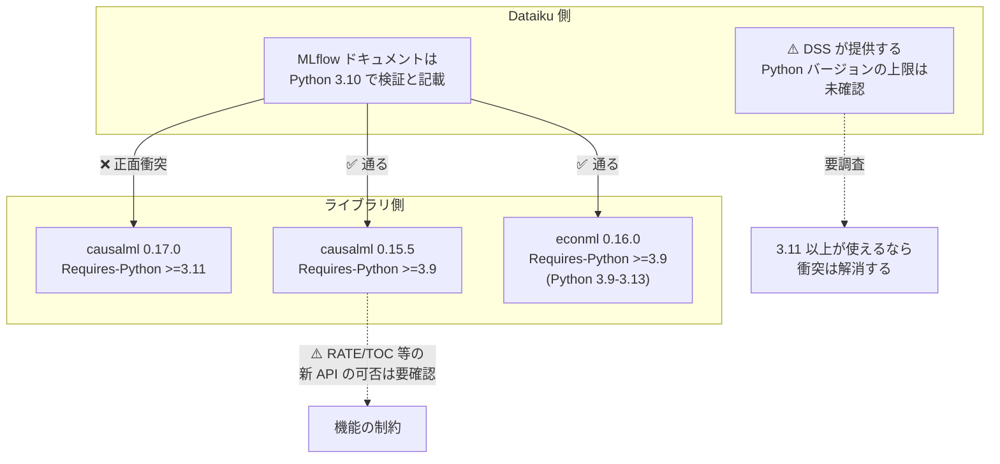
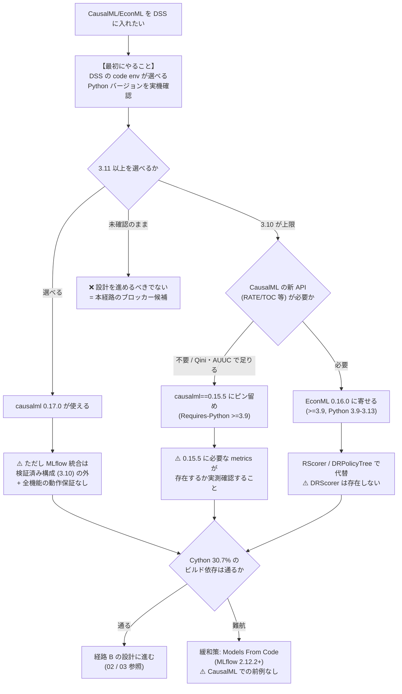

# Python バージョンゲート — 3.10 vs 3.11 の衝突

## なぜこれを最初に読むべきか

01〜04 で論じた設計上の困難は、すべて「CausalML が DSS 上で動く」ことを前提にしている。**その前提が成り立たない可能性がある。**

gather はこの問題を **「本経路の実務上の最大のブロッカー候補」** と位置づけている。設計の巧拙以前に、**ライブラリがインストールできなければ話が終わる**。しかもこれは設計で回避できる種類の問題ではなく、環境の制約である。

## 事実 — CausalML 0.17.0 は Python 3.11 以上を要求

PyPI の JSON メタデータで**実測確認済み**の事実。

| 項目 | 値 |
|------|-----|
| パッケージ | causalml |
| 最新バージョン | **v0.17.0**（2026-07-04 リリース） |
| **Requires-Python** | **`>=3.11`** |

CausalML の Installation ページも独立して同じことを述べている。

> 「Python 3.11 or later is required」

**これはハードゲートである。** pip は Requires-Python を満たさない環境ではインストールを拒否する。回避は「無視する」ことではできない。

## 事実 — `>=3.11` は新しい制約である

ここが本レポートの核心であり、**回避策の存在を決定づける**。

`>=3.11` は CausalML が昔から要求していたものではない。**0.16.0 で導入された新しい制約**である。

| バージョン | リリース日 | Requires-Python |
|-----------|-----------|-----------------|
| **0.17.0** | 2026-07-04 | **`>=3.11`** |
| **0.16.0** | 2026-02-06 | **`>=3.11`** ← ここで導入 |
| **0.15.5** | 2025-07-09 | **`>=3.9`** ← 最後の `>=3.9` 系 |

**0.15.5（2025-07-09）が最後の `>=3.9` 系。** つまり Python 3.10 環境でも **causalml==0.15.5 にピン留めすれば動く**。

これは重要な逃げ道である。「CausalML は Python 3.11 が要るから経路 B は不可能」という結論は**早すぎる**。

### ⚠️ ピン留めの代償 — 要確認

ただし 0.15.5 に留めることには代償がある可能性がある。

**0.15.5 で RATE / TOC 等の新 API が使えるかは要確認。** 03 で扱った `causalml.metrics` の実在関数一覧のうち、`rate` サブモジュール（`get_toc` / `rate_score` / `plot_toc`）は比較的新しい追加である可能性が高く、**0.15.5 に存在するかは確認していない**。

`auuc_score` / `qini_score` / `get_cumgain` / `get_qini`（`visualize` サブモジュール）は CausalML の中核機能であり、0.15.5 にも存在する蓋然性が高いが、**これも実測確認はしていない**。

**Qini/AUUC だけで足りるなら 0.15.5 で問題ない可能性が高い。RATE/TOC を使いたいなら要確認。** ピン留めを採用する前に、**0.15.5 の `causalml/metrics/__init__.py` を実際に確認する**のが確実である。

## 事実 — EconML にはゲートがない

| 項目 | 値 |
|------|-----|
| パッケージ | econml |
| 最新バージョン | **v0.16.0**（2025-07-14 リリース） |
| **Requires-Python** | **`>=3.9`**（実測確認済み） |
| サポート範囲 | **Python 3.9 - 3.13** |

**EconML 0.16.0 は Python 3.9 以上で動き、バージョンゲートの問題がない。**

これは経路選択に直接効く。**CausalML と EconML のどちらを使うかを、Python バージョン制約から逆算して決められる**ということである。DSS 側が 3.10 に固定されていて、かつ CausalML 0.15.5 へのピン留めが（新 API の必要性などで）許容できないなら、**EconML に寄せるのが素直な解**になる。

EconML 側にも uplift 系の道具は揃っている。`econml.score` の `RScorer`（⚠️ `DRScorer` は存在しない、03 参照）、`econml.policy.DRPolicyTree`（二重頑健補正 + 決定木で最適処置割当を学習）など。

## ⚠️ 衝突 — Dataiku の MLflow ドキュメントは Python 3.10 で検証と記載

**ここが問題の核心。**

Limitations and supported versions（公式ドキュメント）は、MLflow 統合の検証環境について **Python 3.10** で検証したと記載している。

すると次の構図になる。

| 側 | Python バージョン |
|----|-----------------|
| **Dataiku の MLflow 検証済み構成** | **3.10** |
| **CausalML 0.17.0 の要求** | **`>=3.11`** |

**DSS の検証済み構成が 3.10 なら、CausalML 0.17.0 と正面衝突する。**

### ⚠️ ただし「3.10 で検証」は「3.10 しか使えない」ではない

**この区別は決定的に重要であり、断定を避けなければならない。**

Dataiku のドキュメントが述べているのは **「Python 3.10 で検証した」** ということであって、**「Python 3.11 以上は使えない」とは述べていない**。

- **DSS 側が提供する Python バージョンの上限は未確認である。**
- DSS の code env が Python 3.11 / 3.12 を選択できるなら、CausalML 0.17.0 はインストールできる。
- ただしその場合、**MLflow 統合が「検証済み構成の外」で動くことになる**。MLflow Models の概念ページが「全機能の動作保証はない」と明記していることを踏まえると、検証外の構成でさらにリスクを積むことになる。

**したがって「3.10 vs 3.11 の齟齬」は確定した閉塞ではなく、確定した不確実性である。** 実機で DSS の code env が選べる Python バージョンを確認することが、本経路の**最初にやるべきこと**である。

## Cython ビルド依存という第二の層

バージョンゲートを突破できたとしても、CausalML には**もう一つの環境的な障害**がある。

uber/causalml の GitHub リポジトリの言語構成は以下。

| 言語 | 割合 |
|------|------|
| Python | 69.3% |
| **Cython** | **30.7%** |

その他: ★5.9k、Apache 2.0 ライセンス。

**Cython が 30.7% を占めるということは、CausalML は純粋な Python パッケージではなく、C 拡張のビルドを伴う**ということである。これが 3 つの場所で効いてくる。

### 1. インストール時のビルド依存

wheel が提供されていない Python バージョン / プラットフォームの組み合わせでは、**ソースからビルドすることになり、コンパイラとヘッダが要る**。DSS の code env でこれが通るかは環境依存。

これは Python バージョンゲートと**相互作用する**。仮に DSS で Python 3.12 が選べたとしても、CausalML 0.17.0 がその Python バージョン向けの wheel を提供していなければ、ビルドが走る。

### 2. pyfunc アーティファクトの可搬性

**CausalML の Cython 依存を pyfunc アーティファクトに含めた場合の可搬性は未確認。** スコアリング用の code env で**再ビルドが必要になるか**が分かっていない。

MLflow の pyfunc は「モデルとその依存を可搬な形で固める」ことを目指すが、C 拡張を含むパッケージはこの前提と相性が悪い。学習環境でビルドされたバイナリが、スコアリング環境でそのまま動く保証はない。

### 3. プラグイン経路との相互作用

01 で述べた通り、Prediction algorithm プラグインには **「Plugin algorithms cannot utilize the plugin code environment」** という制約がある。**プラグイン自身の code env が使えないなら、CausalML の重い依存をどこで解決するのか**という問題が生じる。これがプラグイン経路を実運用上さらに困難にしている（もっとも causal はそもそもプラグイン拡張の対象外なので、この点は理論的な指摘に留まる）。

### 緩和策 — Models From Code

MLflow の **Models From Code**（2.12.2+）が緩和策になり得る。これは pyfunc の**新推奨方式**で、モデルをシリアライズするのではなく**可読な Python スクリプトとして保存**する。

**CausalML の Cython 依存を考えると重要**である。シリアライズされたオブジェクトを環境間で持ち回るのではなく、コードとして保存して実行時に再構成するなら、C 拡張のバイナリ互換性の問題を回避できる可能性がある。

**ただし前例がない。** 「CausalML を Models From Code で保存する」事例は確認できていない。

## 意思決定

## 各選択肢の評価

| 選択肢 | Python 要件 | 得られるもの | 代償・リスク |
|--------|-----------|------------|------------|
| **causalml 0.17.0** | `>=3.11` | 最新 API（RATE/TOC 含む） | **DSS が 3.11+ を提供できるかが未確認**。MLflow 統合が検証済み構成の外になる |
| **causalml 0.15.5 ピン留め** | `>=3.9` | 3.10 環境で動く。Qini/AUUC は使える公算が高い | **⚠️ RATE/TOC 等の新 API の可否は要確認**。2025-07-09 リリースで以後 1 年分の改善を放棄 |
| **econml 0.16.0** | `>=3.9` | **バージョンゲートなし**。Python 3.9-3.13 の広い範囲 | CausalML のメタラーナー群・Qini/AUUC 実装が使えない。`RScorer` はあるが `DRScorer` はない |

## まとめ

| 事項 | 状態 |
|------|------|
| causalml 0.17.0 の Requires-Python は `>=3.11` | **確定**（PyPI JSON で実測） |
| CausalML Installation ページも「Python 3.11 or later is required」 | **確定**（公式） |
| `>=3.11` は 0.16.0（2026-02-06）で導入された新制約 | **確定** |
| 0.15.5（2025-07-09）が最後の `>=3.9` 系 | **確定** |
| econml 0.16.0 の Requires-Python は `>=3.9`（Python 3.9-3.13） | **確定**（実測） |
| Dataiku の MLflow ドキュメントは Python 3.10 で検証と記載 | **確定**（公式） |
| CausalML は Cython 30.7% | **確定**（GitHub） |
| **DSS 側が提供する Python バージョンの上限** | **⚠️ 未確認 — 要調査** |
| **0.15.5 に RATE/TOC 等の新 API があるか** | **⚠️ 要確認** |
| **Cython 依存を pyfunc に含めた場合の可搬性 / 再ビルドの要否** | **⚠️ 未確認** |
| **Models From Code が CausalML の緩和策になるか** | **⚠️ 前例なし** |

**実務的な指針**: **DSS の code env で選択可能な Python バージョンを確認することが、本経路における最初の作業である。** 01〜04 の設計論はすべてこの確認の後に意味を持つ。

確認の結果：

- **3.11+ が選べる** → causalml 0.17.0 が使える。ただし MLflow 統合が検証済み構成の外になるリスクを認識した上で進む。
- **3.10 が上限** → **causalml==0.15.5 へのピン留めが現実的**。0.15.5 に必要な metrics が揃っているかを `causalml/metrics/__init__.py` で実測確認してから採用する。新 API がどうしても要るなら **EconML に寄せる**。

**「3.10 で検証」は「3.11 は不可」ではない**という点は、繰り返し強調しておく。この齟齬は確定した閉塞ではなく、**確定した不確実性**である。実測せずに諦めるのも、実測せずに前提にするのも、どちらも誤りである。

## 参照した一次ソース

- causalml · PyPI — v0.17.0 / Requires-Python `>=3.11`（実測確認済み）、0.16.0 での制約導入、0.15.5 が最後の `>=3.9` 系
- Installation（CausalML）（公式ドキュメント）— 「Python 3.11 or later is required」
- uber/causalml（GitHub）— ★5.9k、Apache 2.0、Python 69.3% / Cython 30.7%、v0.17.0（2026-07-04）
- econml · PyPI — v0.16.0 / Requires-Python `>=3.9`（実測確認済み）、Python 3.9-3.13
- py-why/EconML（GitHub）— ★4.7k、v0.16.0（2025-07-14）
- Limitations and supported versions（公式ドキュメント）— MLflow 2.0.0 未満は非サポート、R/Spark MLflow モデル非対応、**Python 3.10 で検証**
- MLflow Models（概念）（公式ドキュメント）— 「MLflow imposes extremely few constraints on models」＝全機能の動作保証はない
- Models From Code（MLflow公式）— pyfunc 記述の新推奨方式（2.12.2+）
- Component: Prediction algorithm（公式ドキュメント）— 「Plugin algorithms cannot utilize the plugin code environment」
- econml.score.RScorer（公式ドキュメント）
- econml.policy.DRPolicyTree（公式ドキュメント）
- CausalML: Python Package for Causal Machine Learning（Chen, Harinen, Lee, Yung, Zhao 2020, arXiv:2002.11631）
