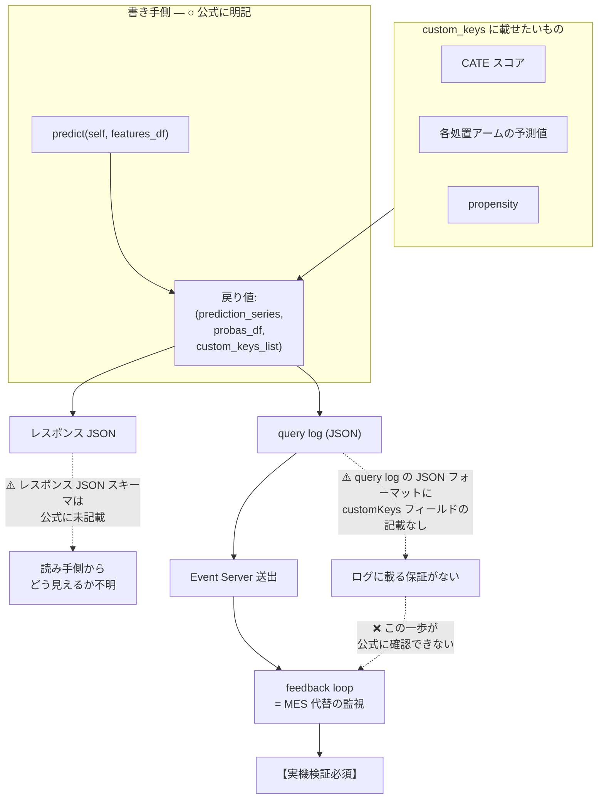
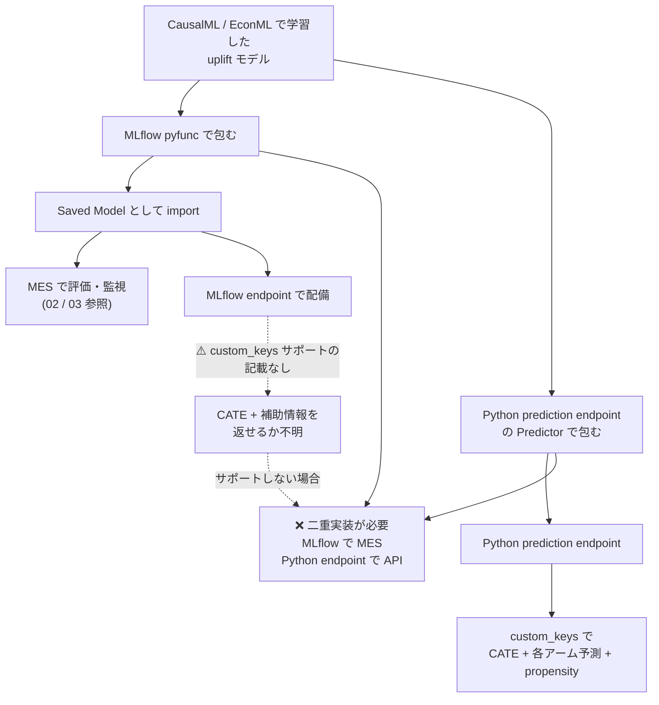

# API node での uplift サービング

## 問題設定

学習と評価の経路（01〜05）が固まったとして、次は本番でリアルタイムに uplift スコアを返す段になる。ここで uplift 特有の要求が出てくる。

**uplift のサービングでは「予測値ひとつ」では足りない。** 実務では以下を同時に欲しいことが多い。

- **CATE スコア**（処置効果の推定値）— 誰に介入するかの判断に使う
- **各処置アームの予測値** — 処置した場合 / しなかった場合それぞれの outcome 予測
- **propensity**（傾向スコア）— 推定の信頼性評価や補正に使う

通常の予測エンドポイントは「予測値 + 確率」しか返さない。**この追加情報をどう返すか**が本レポートの主題である。

そして結論から言えば、**Dataiku の Python prediction endpoint はこれに答える器を持っている**。ただし文書化に穴がある。

## Python prediction endpoint の契約

一次ソースは Exposing a Python prediction model（公式ドキュメント）。これが **`custom_keys` の一次情報源**である。

### 実装の形

| 要素 | 内容 |
|------|------|
| 継承 | **`RegressionPredictor`** または **`ClassificationPredictor`** |
| 実装するメソッド | **`predict(self, features_df)`** |
| 戻り値 | **`(prediction_series, probas_df, custom_keys_list)`** |

戻り値のタプルの**第 3 要素が `custom_keys_list`**。ここが uplift にとって決定的である。

```python
from dataiku.apinode.predict.predictor import RegressionPredictor


class MyPredictor(RegressionPredictor):
    def __init__(self, data_folder=None):
        # コンストラクタは managed folder のパスを受け取る。
        # モデル成果物の標準的な置き場所になる。
        self.model = load_uplift_model(data_folder)

    def predict(self, features_df):
        # CATE スコアを主たる予測値として返す
        cate = self.model.predict(features_df)

        # custom_keys に補助情報を載せる。
        # 各処置アームの予測値、propensity などをここに同梱できる。
        custom_keys = [
            {
                "cate": float(c),
                # 例: 各処置アームの outcome 予測、propensity など
            }
            for c in cate
        ]

        # RegressionPredictor なので probas は None
        return (cate, None, custom_keys)
```

⚠️ 上記は公式に記載された契約（継承クラス / `predict(self, features_df)` / 戻り値タプル / コンストラクタが managed folder パスを受け取ること）から組んだ骨格であり、**動作確認されたコードではない**。特に `custom_keys_list` の各要素の構造（dict か否か、ネストの可否）については、gather の情報からは確定できない。

### custom_keys が本命の器である理由

**`custom_keys` は CATE スコアに加えて、各処置アームの予測値や propensity を同時に返せる本命の器である。**

uplift モデルの出力は本質的に多次元だが、Dataiku の prediction endpoint の契約は「予測値 1 本 + 確率」という教師あり学習の形をしている。`custom_keys` はこのミスマッチを吸収する唯一の正規の口である。

これは 01 で触れた先行事例 "MLflow and Databricks for CausalOps" が指摘した課題 — **「固定 signature と因果モデルの可変 I/O の不一致」** — に対する、Dataiku 側の答えとも言える。MLflow の signature 側ではこの不一致が壁になるが、API node の `custom_keys` は可変の追加出力を許す。

### コンストラクタと managed folder

**コンストラクタは managed folder のパスを受け取り、モデル成果物の標準的な置き場所になる。** CausalML/EconML のモデルを pickle なり Models From Code なりで保存しておき、`__init__` でロードする。これが Dataiku における標準パターンである。

**専用の code env を用意することが推奨されている。** 05 で論じた CausalML の Cython 依存（30.7%）を考えると、この推奨は uplift 経路では**必須要件に近い**。API node の実行環境で CausalML が正しくビルド・ロードできるかは、05 の Python バージョンゲートと同じ検証が要る。

### プーリングパラメータ

エンドポイントにはプーリングパラメータがあり、**スループットとメモリのトレードオフ**を制御する。CausalML/EconML のモデルは決して軽くないため、ここは実測でチューニングする領域になる。プロセスを増やせばスループットは上がるがメモリを食う。モデルのサイズ次第では、想定より少ない並列度しか取れない可能性がある。

## ⚠️ 文書化の非対称 — 最大の問題

**`custom_keys` の文書化は書き手側と読み手側で非対称である。**

| 側 | 状態 |
|----|------|
| **書き手側**（`predict` の戻り値） | **○ 明記されている** — 戻り値タプルの第 3 要素として公式に記載 |
| **読み手側**（レスポンス JSON スキーマ） | **✗ 未記載** — custom_keys がレスポンス JSON のどこにどう現れるかの記述がない |

つまり **「custom_keys に値を入れる方法」は書いてあるが、「入れた値がクライアントからどう見えるか」は書いていない**。

### さらに: query log にも記載がない

Logging and auditing（公式ドキュメント）は、**MES 代替の監視経路**として有望に見える機構を提供している。

- query log が **JSON で出力**される
- **入力特徴量・予測・タイミングを含む**
- **Event Server へ送出して feedback loop 化**できる

これは 04 で MES が塞がれた場合の代替として、また一般に本番監視の基盤として魅力的である。

**しかし query log の JSON フォーマットにも `customKeys` フィールドの記載がない。**

### 帰結

**「custom_keys で CATE を返し、query log で回収して監視する」という feedback loop は魅力的だが、ログに載る保証が公式にない。実機検証必須。**

これは本レポートで最も重要な指摘である。この feedback loop が成立するなら：

- CATE スコアがリアルタイムで返る
- 同じスコアが query log に自動的に蓄積される
- Event Server 経由で監視基盤に流れる
- **MES を使わずに uplift スコアの分布監視が成立する**

という美しい構図が描ける。**だがその中核の一歩（custom_keys が query log に載るか）が公式に確認できない。**



## ⚠️ 表記揺れ

| 側 | 表記 |
|----|------|
| Python 側（`predict` の戻り値） | **`custom_keys_list`**（snake_case） |
| 実出力キー | **`customKeys`**（camelCase） |

Python の命名規約と JSON の命名規約の境界で変換が起きている。**ログやレスポンスを grep する際に `custom_keys` で探すと見つからない**可能性がある。実機検証の際はこの点に注意すること。

この表記揺れ自体は珍しいことではないが、**上述の「読み手側が未記載」という問題と組み合わさると厄介**である。何を探せばいいのかが確実には分からないまま、実機で探すことになる。

## ⚠️ MLflow endpoint との分断

Exposing a MLflow model（公式ドキュメント）は、MLflow モデルを API node に配備する経路を示している。出力は **Raw data / Restructured の 2 択**。

**MLflow endpoint が custom_keys をサポートするかは記載がない。**

これが効いてくる構図は以下である。

02 で論じた通り、**MES に載せるには MLflow pyfunc 経路が本命**だった。ところが API node で uplift の多次元出力を返すには **Python prediction endpoint の custom_keys が本命**である。

**この 2 つが別の経路だとすると、二重実装が必要になる。**

| 目的 | 必要な経路 |
|------|----------|
| MES で評価・監視する | MLflow pyfunc として import した Saved Model |
| API node で CATE + 補助情報を返す | Python prediction endpoint（custom_keys） |

**同じモデルを 2 通りにパッケージングする**ことになる。学習成果物は共有できるとしても、ラッパーが 2 種類、テストが 2 種類、デプロイ経路が 2 本になる。

**MLflow endpoint が custom_keys をサポートするなら**、MLflow 経路で統一でき、この分断は解消する。**しかしそれは公式に記載がない。**



## エンドポイントの選択肢

Types of Endpoints（公式ドキュメント）は 8 種のエンドポイントを列挙している。uplift に関係するのは以下 3 つ。

| エンドポイント | 適性 | 評価 |
|--------------|------|------|
| **Python prediction** | **○ 本命** | `custom_keys` で多次元出力を返せる。専用 code env、managed folder からのモデルロード、プーリング制御 |
| **MLflow** | **△** | MES 経路と統一できる可能性があるが、**custom_keys サポートは記載なし**。出力は Raw data / Restructured の 2 択 |
| **Python function** | **△** | 任意関数を REST 化できる。契約の自由度は最大だが、**Dataiku の prediction 機構（query log の予測フィールドなど）の恩恵を受けられない可能性がある** |

Python function endpoint は「契約に縛られたくないなら何でも返せる」という逃げ道だが、**prediction endpoint として扱われないため、query log の構造化された予測ログや監視機構との統合が期待できない**。custom_keys の問題を回避しようとして、より大きなものを失う可能性がある。

## まとめ

| 事項 | 状態 |
|------|------|
| `RegressionPredictor` / `ClassificationPredictor` を継承 | **確定**（公式） |
| `predict(self, features_df)` を実装 | **確定**（公式） |
| 戻り値は `(prediction_series, probas_df, custom_keys_list)` | **確定**（公式） |
| コンストラクタが managed folder パスを受け取る | **確定**（公式） |
| 専用 code env が推奨 | **確定**（公式） |
| プーリングパラメータでスループット/メモリを制御 | **確定**（公式） |
| query log は JSON で入力特徴量・予測・タイミングを含む | **確定**（公式） |
| Event Server 送出で feedback loop 化できる | **確定**（公式） |
| 表記揺れ: `custom_keys_list` (snake) vs `customKeys` (camel) | **確定** |
| **レスポンス JSON における custom_keys の現れ方** | **⚠️ 公式に未記載** |
| **query log に `customKeys` が載るか** | **⚠️ 公式に記載なし — 実機検証必須** |
| **MLflow endpoint が custom_keys をサポートするか** | **⚠️ 記載なし — 二重実装のリスク** |

## 実務的な指針

**`custom_keys` は uplift サービングにとって正しい器である。** CATE、各処置アームの予測値、propensity を一度に返せる正規の口は他にない。ここは設計の起点にしてよい。

**ただし検証すべきことが 3 つあり、いずれも公式ドキュメントでは埋まらない。**

1. **custom_keys がレスポンス JSON にどう現れるか。** 読み手側の契約を実機で確定させる。クライアント側の実装はこれが分かるまで書けない。探す際は **`customKeys`（camelCase）** で探すこと。
2. **custom_keys が query log に載るか。** これが本レポート最大の未確認事項。載るなら MES 代替の監視経路が開け、04 のトリレンマにも一定の逃げ道ができる。**載らないなら、CATE スコアの本番監視は別の手段を考える必要がある。**
3. **MLflow endpoint が custom_keys をサポートするか。** サポートするなら MES 経路と統一でき、二重実装を避けられる。**サポートしないなら二重実装のコストを計画に織り込む必要がある。**

**検証の順序としては 2 → 3 → 1 を推奨する。** 2 が否なら監視設計を根本から考え直すことになり、3 が否なら実装量が倍になる。どちらも設計の骨格に影響する。1 はクライアント実装の詳細であり、骨格が固まってからでよい。

いずれも**最小のエンドポイントを 1 本立てて custom_keys に目印になる値を入れ、レスポンスと query log の両方を観測する**ことで、短時間で確定できるはずである。gather が繰り返し指摘する通り、**この領域はコミュニティの前例がほぼなく、公式ドキュメントも穴がある。実機検証を設計プロセスの前段に置くこと。**

## 参照した一次ソース

- Exposing a Python prediction model（公式ドキュメント）— **`custom_keys` の一次情報源**。`ClassificationPredictor`/`RegressionPredictor` 継承、`predict(self, features_df)`、戻り値 `(prediction_series, probas_df, custom_keys_list)`
- Exposing a MLflow model（公式ドキュメント）— 出力は Raw data / Restructured の 2 択。⚠️ custom_keys サポートの記載なし
- Exposing a Python function（公式ドキュメント）— 任意関数の REST 化
- Types of Endpoints（公式ドキュメント）— 8 種一覧
- Logging and auditing（公式ドキュメント）— query log が JSON で入力特徴量・予測・タイミングを含む。Event Server 送出。⚠️ `customKeys` フィールドの記載なし
- MLflow and Databricks for CausalOps（Blog, 2024-11）— 「固定 signature と因果モデルの可変 I/O の不一致」
- Model Evaluation Stores — Developer Guide（公式Developer）
- Prediction Drift（公式ドキュメント）— 予測値分布の変化。uplift スコア分布の監視に転用可能
