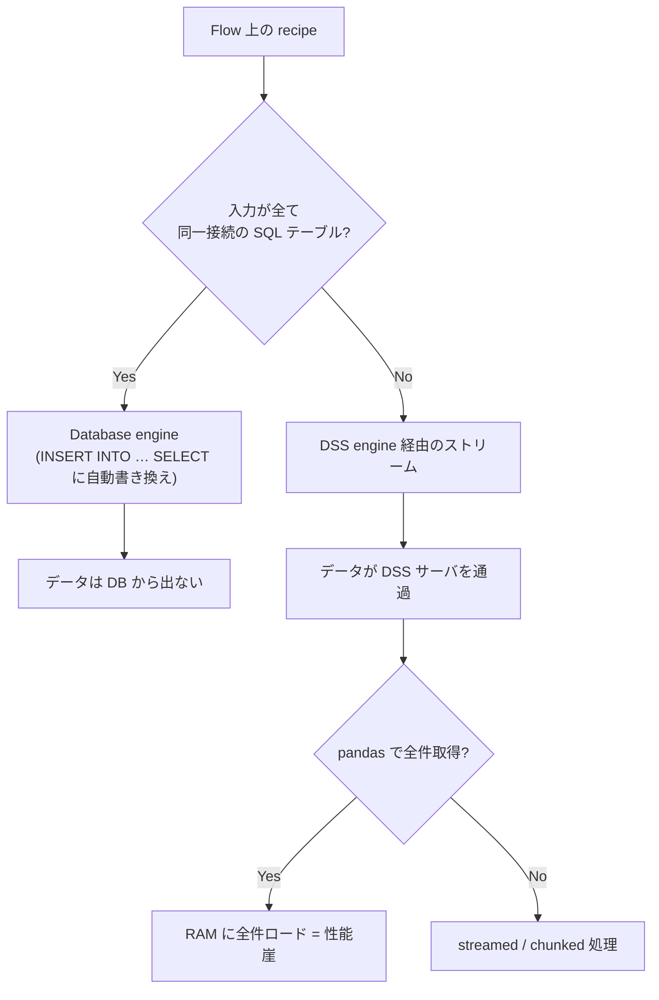
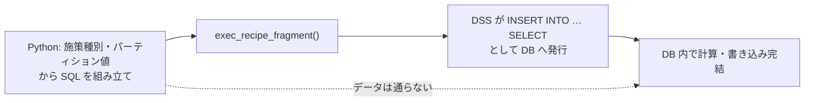

# SQL プッシュダウンと性能設計

## 概要

Dataiku の性能設計を理解する出発点は、Dataiku を「計算エンジンそのもの」ではなく **「接続先エンジンのオーケストレータ」** と捉える設計思想にある。公式 KB の *Concept | Where computation happens*（<https://knowledge.dataiku.com/latest/data-preparation/pipelines/concept-where-compute-happens.html>）が本クラスタの起点であり、Dataiku 上に描かれた Flow は「どこで計算するか」を決める指示であって、計算の実体は接続先（SQL データベース、Spark クラスタ、Kubernetes、あるいは DSS サーバ自身）にある。

この視点を持つと、本件（マーケ施策の ML パイプライン）で最も効く性能上の意思決定は **コードの書き方ではなく接続の設計** だと分かる。以下、エンジン選択の条件、pandas recipe の性能崖、逃げ道の優先順位、partial recipe、DWH 別の具体という順で整理する。

## 1. 4 つの実行エンジン

正典は *Execution engines*（<https://doc.dataiku.com/dss/latest/preparation/engines.html>）。入門的な整理は *Concept | Computation engines*（<https://knowledge.dataiku.com/latest/data-preparation/pipelines/concept-computation-engine.html>）にある。

| エンジン | 計算する場所 | 適する状況 | 本件での位置づけ |
|---------|------------|-----------|----------------|
| **DSS（in-memory）** | DSS サーバの RAM | 小規模データ、SQL に変換できない処理 | **落ちてはいけない先**。性能崖の正体 |
| **DSS（streamed）** | DSS サーバ（行ストリーム） | 大規模だが行単位で処理可能 | メモリは持つが DSS を必ず経由する |
| **Database（in-database SQL）** | 接続先 DB | 入力が全て同一接続の SQL テーブル | **本命**。ここに押し込むのが設計目標 |
| **Spark** | Spark クラスタ | 分散が必要な大規模非 SQL 処理 | 本件では原則不要（後述） |
| **Kubernetes（containerized）** | K8s コンテナ | DSS エンジンの RAM/CPU を弾力化 | **最後の逃げ道**（RAM 増強） |

Spark については *Tip | Using Spark*（<https://knowledge.dataiku.com/latest/cloud-quotas-compute/tip-using-spark.html>）が使うべき／使うべきでない判断基準を示している。DWH に押し込める処理を Spark に持ち出すのは、DWH からデータを引き出すコストを払ったうえで分散する二重の無駄になりやすい。本件のように起点が DB（Snowflake / BigQuery / Redshift / PostgreSQL）である場合、まず in-database、押し込めない部分だけコンテナ化した DSS エンジン、という順序が合理的である。

Kubernetes 上での DSS エンジン実行は *Containerized DSS engine*（<https://doc.dataiku.com/dss/latest/containers/containerized-dss-engine.html>）に規定されている。これは「押し込めなかった処理の RAM をスケールさせる」手段であって、押し込む努力の代替ではない。



## 2. 分岐点は「同一接続」——性能崖の発生条件

*SQL recipes*（<https://doc.dataiku.com/dss/latest/code_recipes/sql.html>）が本レポートで最も重要な一次ソースである。ここには次の条件が明記されている。

> **入力が全て同一接続の SQL テーブルであるときにのみ**、Dataiku は recipe を `INSERT INTO … SELECT` へ書き換え、完全に in-database で実行する。**それ以外の場合は DSS を経由してストリームされる**。

補足として *Concept | SQL code recipes*（<https://knowledge.dataiku.com/latest/code/sql/concept-sql-code-recipes.html>）が SQL recipe の種別（query / script）を整理している。

この条件は二値である。「概ね同一接続」や「大半が同じ DB」では意味がない。**接続が 1 つでも異なれば、その recipe は即座に DSS 経由ストリームへ落ちる**。ここが本件で最も注意すべき点になる。

### 実務上の含意

マーケ施策の Flow は、性質上「異種の入力を混ぜたくなる」形をしている。

- 顧客マスタ・行動ログ → DWH
- キャンペーン定義・配信リスト → 施策管理システム由来の CSV / 別 DB
- 反応データ → また別の経路

これらを素朴に 1 つの recipe で結合すると、条件を満たさず全量が DSS サーバを通る。しかも Flow 図の見た目は変わらないため、**性能劣化が構造的に不可視**になる。

したがって設計原則は次のようになる。

1. **外部データは早い段階で DWH の同一接続へ着地させる**（sync recipe などで取り込む）
2. その後の結合・集計・特徴量生成は **すべて同一接続内で完結** させる
3. どうしても接続をまたぐ箇所を、Flow 上で **意識的に 1 箇所に固定** する

なお、複数の SQL recipe を単一クエリに融合して中間テーブルの書き出しを回避する仕組みとして *Using SQL pipelines*（<https://doc.dataiku.com/dss/7.0/sql/pipelines/sql_pipelines.html>）がある。同一接続で押し込めている前提が成立して初めて効く最適化であり、順序としては「まず同一接続、次に pipeline 融合」となる。

## 3. pandas recipe の性能崖

*Python recipes*（<https://doc.dataiku.com/dss/latest/code_recipes/python.html>）は、性能崖の **一次ソース** である。ここには `get_dataframe()` について、**データセット全体が DSS サーバの RAM に載る必要がある** と公式に明記されている。

これは「大きいと遅くなる」という程度の話ではない。載らなければ落ちる、という不連続な挙動である。しかも `get_dataframe()` は Python recipe のもっとも自然で、もっとも最初に書く一行でもある。

```python
# 最も自然に書かれ、最も静かに壊れる形
import dataiku
df = dataiku.Dataset("customer_features").get_dataframe()
```

開発時のサンプルデータでは通り、本番の全量で初めて破綻する。キャンペーンごとに対象母集団のサイズが変わる本件では、**施策によって通ったり落ちたりする**という最悪の再現性を生む。

## 4. 逃げ道の優先順位

gather の整理に従い、優先順位を明示する。上から順に検討し、上が使えるなら下は使わない。

| 順位 | 手段 | 根拠 | 性質 |
|------|------|------|------|
| ① | **SQL / partial recipe で DB に押し込む** | *SQL recipes* / *Performing SQL queries* | 根本解決。データが DSS に来ない |
| ② | **パーティション単位に分割する** | *Working with partitions* | 一度に扱う量そのものを削る |
| ③ | **`iter_dataframes(chunksize)` でチャンク化** | *Datasets (reading and writing data)* | 対症療法。罠あり（後述） |
| ④ | **コンテナ化して RAM を増やす** | *Containerized DSS engine* | 最後の手段。上限を上げるだけ |

### ① が原則である理由

①は「メモリに載らない問題」を解くのではなく、**問題を発生させない**。②以下はいずれも「DSS サーバを通る」という前提を維持したまま量を調整しているにすぎない。データ量が増えれば再び同じ壁に当たる。

### ③ の罠

*Datasets (reading and writing data)*（<https://developer.dataiku.com/latest/concepts-and-examples/datasets/datasets-data.html>）が逃げ道の正典で、`iter_dataframes(chunksize=...)`、`get_writer()`、row-by-row streaming を示す。API 仕様は *Datasets API reference*（<https://developer.dataiku.com/latest/api-reference/python/datasets.html>）にある。

ただし Community の *Writing df on chunks with built-in Dataiku functionality*（<https://community.dataiku.com/discussion/13327/writing-df-on-chunks-with-buillt-in-dataiku-functionality>）が報告する罠がある。

> チャンク書き出し時には `write_with_schema()` が使えず、**先に schema を設定しておく必要がある**。

`write_with_schema()` は「DataFrame からスキーマを推論して書く」という便利さゆえに常用されるが、チャンク書き出しではチャンクごとにスキーマを書き換えることになり成立しない。よって `write_schema_from_dataframe()` などで **事前にスキーマを確定させてから** writer を回す形になる。

つまり③は「1 行を書き換えるだけ」では済まず、読み・書き・スキーマの三点を組み替える改修になる。逃げ道としてのコストは見た目より高い。

## 5. partial recipe — 本件の主力パターン

*Performing SQL queries*（<https://developer.dataiku.com/latest/concepts-and-examples/sql.html>）が partial recipe / `SQLExecutor2` の正典である。概念説明としては旧版専用ページ *API for performing SQL queries like the recipes*（<https://doc.dataiku.com/dss/7.0/python-api/partial.html>）が最も明示的で、チュートリアルは *Leveraging SQL in Python & R*（<https://developer.dataiku.com/latest/tutorials/data-engineering/sql-in-code/index.html>）にある。

partial recipe の要点は次の一点に尽きる。

> **Python で SQL を動的に生成し、`exec_recipe_fragment()` で DSS に実行させる。** SQL 文の組み立ては Python が行うが、**実行は DB 内で完結し、データは DSS に返らない**。

これは本件の要求に正面から噛み合う。

| 要求 | 素朴な解 | 問題 | partial recipe |
|------|---------|------|---------------|
| 施策ごとに特徴量の定義が変わる | Python recipe で分岐 | 全件を RAM に載せる | SQL を分岐で組み立て、実行は DB |
| キャンペーン種別ごとに集計軸が違う | SQL recipe を種別分だけ作る | Flow が増殖し保守不能 | 1 つの recipe が分岐を吸収 |
| 対象パーティションだけ処理したい | 条件を手書き | 抜け漏れ | 変数から `WHERE` を生成 |

つまり **「複雑な分岐は Python、計算は DB」** を両立させる。SQL recipe は分岐に弱く、Python recipe はメモリに弱い。partial recipe はその両方の弱点を回避する唯一の位置にある。だからこそ本件の **主力パターン** となる。



なお実践知として、Community の *SQLExecutor2 exec_recipe_fragment: multiple statements*（<https://community.dataiku.com/t5/Using-Dataiku/SQLExecutor2-exec-recipe-fragment-multiple-statements-and/td-p/3534>）が `pre_queries` による一時テーブルの準備を示している。単一の `SELECT` に押し込みきれない前処理を、それでも DB 側に置いたまま解決する手立てになる。

## 6. DWH 別の具体

対応 DB の一覧と共通概念は *SQL databases: Introduction*（<https://doc.dataiku.com/dss/latest/connecting/sql/introduction.html>）にまとまっている。

| DWH | ドキュメント | 最適化の厚み |
|-----|------------|------------|
| **Snowflake** | <https://doc.dataiku.com/dss/latest/connecting/snowflake.html> | **最も厚い**。fast-write、recipe 単位の Virtual Warehouse 選択、Snowpark |
| BigQuery | <https://doc.dataiku.com/dss/latest/connecting/bigquery.html> | 標準 SQL 接続。JDBC 4.2 ドライバの導入が必要 |
| Redshift | <https://doc.dataiku.com/dss/latest/connecting/redshift.html> | 標準 SQL 接続。Spectrum や 20 億件超では専用ドライバが必要 |
| PostgreSQL | <https://doc.dataiku.com/dss/latest/connecting/sql/postgresql.html> | 標準 SQL 接続。ドライバ同梱で追加導入不要 |

### Snowflake が突出している理由

Snowflake だけが、SQL に変換できる処理の押し込みに留まらない層を持つ。

- **fast-write による bulk COPY** — DSS から Snowflake への書き込み経路そのものの最適化。日本語 Community の *プッシュダウン実行と automatic fast-write*（<https://community.dataiku.com/discussion/41196/>）が本クラスタで日本語として最も技術的に有用な項目である。
- **Java UDF によるプッシュダウン** — *Snowflake, Dataiku, Java UDFs & Snowpark*（<https://blog.dataiku.com/snowflake-dataiku-java-udfs-snowpark>）が正典的解説。**visual recipe（prepare）とスコアリングを Snowflake 内に押し込む**。通常なら SQL に落ちない処理まで DB 内に留められる点が決定的に違う。
- **Snowpark** — *Dataiku and Snowflake: Snowpark New Capabilities*（<https://blog.dataiku.com/dataiku-snowflake-snowpark-new-capabilities>）。DW 内での実行を DataFrame API 的に記述する。
- **recipe 単位の Virtual Warehouse 選択** — 重い recipe だけ大きな warehouse に割り当てるといったコスト制御ができる。

実務的なまとめとしては *Best Practices for Leveraging Dataiku and Snowflake*（<https://www.snowfoxdata.com/resources/blog/best-practices-for-leveraging-dataiku-and-snowflake-part-one>）がある。

### 含意

**prepare recipe とスコアリングを DB 内で回せるかどうかは、DWH の選択に依存する**。Snowflake なら Java UDF 経由で押し込めるが、BigQuery / Redshift / PostgreSQL では「SQL に変換可能な処理」の範囲に留まる。押し込めない部分は DSS 側に落ちるため、**同じ Flow でも DWH によって性能プロファイルが変わる**。

本件で DWH が既に決まっているなら、Snowflake 以外では「visual recipe を素朴に積む」設計が通用しないと想定し、**partial recipe への依存度を上げる**前提を置くべきである。

## 7. 設計チェックリスト

| 確認項目 | 満たされない場合の帰結 |
|---------|---------------------|
| Flow の全 recipe で入力が同一接続の SQL テーブルか | DSS 経由ストリームに落ち、性能崖に近づく |
| 外部データは早期に DWH へ着地しているか | 結合のたびに接続をまたぐ |
| Python recipe で `get_dataframe()` を全量に対して呼んでいないか | 施策規模により不定期に OOM |
| 分岐が必要な処理を partial recipe に寄せているか | recipe の増殖か、メモリ超過の二択になる |
| チャンク化する箇所でスキーマを事前設定しているか | `write_with_schema()` が使えず書き出しが破綻 |
| DWH が Snowflake 以外の場合、visual recipe の押し込み範囲を確認したか | 想定外の DSS 実行が混入 |

## 未確認・注意事項

- **カラムベースパーティションの DWH 別プッシュダウン効率** — Snowflake の micro-partition や BigQuery のネイティブパーティションと Dataiku のパーティション定義がどう対応づくか（二重管理になるのか）を論じた資料は発見できなかった。パーティション設計時の実機検証が必要（詳細は 02 レポート）。
- 本レポートの partial recipe の概念説明は DSS 7.0 の旧版ページに依存する箇所がある。最新版での挙動は現行 Developer Guide 側を優先して確認すべきである。

## 参照リソース

| # | タイトル | URL |
|---|---------|-----|
| 1 | Concept \| Where computation happens | <https://knowledge.dataiku.com/latest/data-preparation/pipelines/concept-where-compute-happens.html> |
| 2 | Execution engines | <https://doc.dataiku.com/dss/latest/preparation/engines.html> |
| 3 | Concept \| Computation engines | <https://knowledge.dataiku.com/latest/data-preparation/pipelines/concept-computation-engine.html> |
| 4 | SQL recipes | <https://doc.dataiku.com/dss/latest/code_recipes/sql.html> |
| 5 | Concept \| SQL code recipes | <https://knowledge.dataiku.com/latest/code/sql/concept-sql-code-recipes.html> |
| 6 | Performing SQL queries（partial recipe / SQLExecutor2） | <https://developer.dataiku.com/latest/concepts-and-examples/sql.html> |
| 7 | API for performing SQL queries like the recipes（partial） | <https://doc.dataiku.com/dss/7.0/python-api/partial.html> |
| 8 | Leveraging SQL in Python & R | <https://developer.dataiku.com/latest/tutorials/data-engineering/sql-in-code/index.html> |
| 9 | Using SQL pipelines | <https://doc.dataiku.com/dss/7.0/sql/pipelines/sql_pipelines.html> |
| 10 | Containerized DSS engine | <https://doc.dataiku.com/dss/latest/containers/containerized-dss-engine.html> |
| 11 | Tip \| Using Spark | <https://knowledge.dataiku.com/latest/cloud-quotas-compute/tip-using-spark.html> |
| 12 | SQLExecutor2 exec_recipe_fragment: multiple statements | <https://community.dataiku.com/t5/Using-Dataiku/SQLExecutor2-exec-recipe-fragment-multiple-statements-and/td-p/3534> |
| 13 | Snowflake connection | <https://doc.dataiku.com/dss/latest/connecting/snowflake.html> |
| 14 | Dataiku and Snowflake: Snowpark New Capabilities | <https://blog.dataiku.com/dataiku-snowflake-snowpark-new-capabilities> |
| 15 | Snowflake, Dataiku, Java UDFs & Snowpark | <https://blog.dataiku.com/snowflake-dataiku-java-udfs-snowpark> |
| 16 | Google BigQuery connection | <https://doc.dataiku.com/dss/latest/connecting/bigquery.html> |
| 17 | Amazon Redshift connection | <https://doc.dataiku.com/dss/latest/connecting/redshift.html> |
| 18 | PostgreSQL connection | <https://doc.dataiku.com/dss/latest/connecting/sql/postgresql.html> |
| 19 | SQL databases: Introduction | <https://doc.dataiku.com/dss/latest/connecting/sql/introduction.html> |
| 20 | Best Practices for Leveraging Dataiku and Snowflake | <https://www.snowfoxdata.com/resources/blog/best-practices-for-leveraging-dataiku-and-snowflake-part-one> |
| 21 | Python recipes | <https://doc.dataiku.com/dss/latest/code_recipes/python.html> |
| 22 | Datasets (reading and writing data) | <https://developer.dataiku.com/latest/concepts-and-examples/datasets/datasets-data.html> |
| 23 | Datasets API reference | <https://developer.dataiku.com/latest/api-reference/python/datasets.html> |
| 24 | Writing df on chunks with built-in Dataiku functionality | <https://community.dataiku.com/discussion/13327/writing-df-on-chunks-with-buillt-in-dataiku-functionality> |
| 80 | プッシュダウン実行と automatic fast-write | <https://community.dataiku.com/discussion/41196/> |
