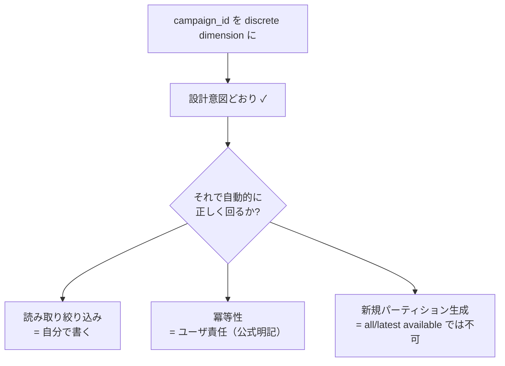
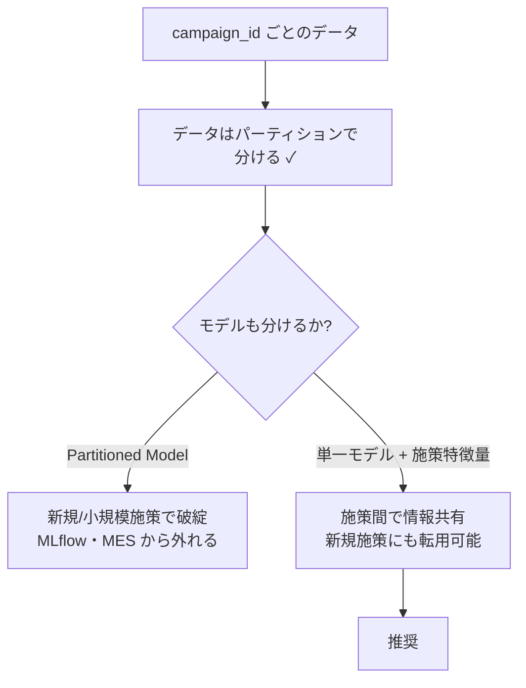

# パーティショニングと施策サイクル

## 概要

本件の中心的要求は「不定期に発生するキャンペーンごとに、対象データを切り出して学習・推論・評価を回す」ことである。Dataiku の **パーティショニング** はこの要求に正面から対応する機構であり、`campaign_id` を離散次元（discrete dimension）として使う設計は **製品の設計意図どおりの使い方** にあたる。

しかし正典 *Working with partitions*（<https://doc.dataiku.com/dss/latest/partitions/index.html>）を読み込むと、SQL データセットのパーティションには **ファイルベースとは根本的に異なる制約** があり、特に **冪等性が公式にユーザ責任と明記されている** ことが分かる。「パーティションを切れば自動的に増分処理が正しく回る」という期待は成立しない。

本レポートでは、二方式の区別 → 次元の型 → `campaign_id` 設計 → 落とし穴（変数・冪等性・依存関数）→ 不定期サイクルの欠損問題 → Partitioned Model を推奨しない理由、の順で整理する。

## 1. file-based と column-based の根本的な違い

| 観点 | file-based | column-based（SQL） |
|------|-----------|-------------------|
| 正典 | <https://doc.dataiku.com/dss/latest/partitions/fs_datasets.html> | <https://doc.dataiku.com/dss/latest/partitions/sql_datasets.html> |
| 分割の決まり方 | **ディスク上のレイアウト** | テーブルのカラム値 |
| データの中身を見るか | **見ない** | 見る |
| 分割列のスキーマ | **消える**（パスに埋め込まれるため） | 残る |
| 読み取りの自動絞り込み | あり（該当パスのみ読む） | **なし**（後述） |
| 本件での適用 | 対象外 | **DB 由来なので実質こちら** |

### file-based の落とし穴

*Partitioning files-based datasets* が明記するとおり、file-based のパーティションは **ディスク上のレイアウトで決まり、データの中身は一切使わない**。`/data/campaign_id=C123/part.csv` のようなパス構造がそのまま分割定義になる。

ここから **分割列がスキーマから消える** という落とし穴が生じる。`campaign_id` はパスに埋め込まれているのでファイル内には存在せず、データセットのスキーマにも現れない。パーティション値を列として使いたい場合、明示的に復元する必要がある。ハンズオンは *Tutorial | File-based partitioning*（<https://knowledge.dataiku.com/latest/automate-tasks/partitioning/tutorial-file-based.html>）にある。

### column-based が本件の前提

本件のデータは DWH 由来である。したがって *Partitioned SQL datasets* が定める **カラムベース分割** が実質的な選択肢になる。入口としては *Tutorial | Column-based partitioning*（<https://knowledge.dataiku.com/latest/automation/partitioning/tutorial-column-based.html>）が「DB データならここから」と位置づけられる。日本語では *【Dataiku】パーティション機能についてご紹介*（<https://blog.truestar.co.jp/dataiku/20250606/63144/>、2025/06）が最もまとまった解説である。

column-based では分割列はテーブルの実カラムとして存在し続ける。file-based のような「列が消える」問題はない。代わりに、**自動絞り込みが効かない** という別の問題が発生する（第 4 節）。

## 2. 次元の型 — time と discrete dimension

正典が区別するのは 2 種類である。

| 型 | 値の性質 | 依存関数 | 典型例 |
|----|---------|---------|--------|
| **time dimension** | 年/月/日/時の階層を持つ | equals / **time range** / all available / latest available | `date=2026-07-15` |
| **discrete dimension** | 順序を持たない任意の値 | equals / all available / latest available | `country=JP`, **`campaign_id=C123`** |

time dimension は「範囲」という概念を持つため time range 依存が使える。discrete dimension は範囲を持たないため、equals による 1 対 1 の対応が基本になる。

## 3. `campaign_id` を discrete dimension とする — 設計意図どおり

**`campaign_id` を discrete dimension として切るのは、製品の設計意図に沿った正しい使い方である。** これは本件にとって重要な確認事項になる。

理由は次のとおり。

- キャンペーンは順序も範囲も持たない離散的な識別子であり、discrete dimension の定義にそのまま合致する
- 施策ごとに「対象データを切り出して処理する」という要求が、パーティション単位の増分計算とそのまま対応する
- 新しい施策が発生したら新しいパーティション値が増える、という成長の仕方が自然

つまり「無理な流用」ではない。ここは安心してよい。

**ただし** ——「設計意図どおり」であることと「自動で正しく動く」ことは別である。以下の落とし穴はすべて、この正しい設計を採ったうえでなお発生する。



## 4. 落とし穴 ① — 読み取りは自分で絞る

*Partitioning variables substitutions*（<https://doc.dataiku.com/dss/latest/partitions/variables.html>）が `$DKU_SRC_<dim>` / `$DKU_DST_<dim>` の正典であり、*Partitioned SQL recipes*（<https://doc.dataiku.com/dss/latest/partitions/sql_recipes.html>）と *Recipes for partitioned datasets*（<https://doc.dataiku.com/dss/latest/partitions/recipes.html>）が recipe 側の一般則を定める。

ここでの決定的な差は次の点である。

> **パーティション化された SQL recipe では、読み取りを `$DKU_SRC_<dim>` で自分で絞り込む必要がある。** ファイルベースのように自動でフィルタされることはない。

file-based では、Dataiku は該当パーティションのパスだけを読めばよいので絞り込みが自動的に成立する。column-based では入力は 1 枚のテーブルであり、**Dataiku が `WHERE` を勝手に足すことはしない**。書き忘れれば、全キャンペーンのデータを読んだうえで 1 パーティションに書き込む、という結果になる。

```sql
-- 読み取りの絞り込みは自分で書く
SELECT
    user_id,
    feature_a,
    feature_b
FROM "customer_events"
WHERE campaign_id = '$DKU_SRC_campaign_id'
```

書き込み側の `$DKU_DST_<dim>` にも制約がある。

> **`$DKU_DST_<dim>` は "equals" 依存関係でのみ機能する。**

出力パーティションが 1 つに定まらない依存関係（time range など複数入力を束ねる形）では、「どの値を書くか」が一意に決まらないため `$DKU_DST_` は意味を持たない。discrete dimension で equals を使う本件の構成では成立するが、依存関数を変更する際には連動して壊れうる点に注意が要る。

## 5. 落とし穴 ② — 冪等性はユーザ責任（公式明記）

これが本レポートで最も重要な指摘である。*Partitioned SQL recipes* に次の趣旨が **公式に明記** されている。

> スクリプトを複数回実行しても 1 回実行したのと同じ出力になることの保証は、**ユーザの責任である**。

つまり Dataiku は、パーティション付き SQL recipe の再実行時に **既存データを消してくれない**。素朴に `INSERT` を書けば、再実行のたびに行が二重・三重に積み上がる。

不定期・イベント駆動の本件では、これは理論上の懸念では済まない。

- トリガの再発火
- 失敗したシナリオの手動リラン
- 施策データの修正に伴う再処理

いずれも「同じパーティションを 2 回処理する」を日常的に発生させる。

### 対処 — 対象パーティション限定の DELETE を自作する

標準的な形は、挿入前に **対象パーティション値に限定した DELETE** を自分で書くことである。

```sql
-- 冪等性は自分で担保する
DELETE FROM "customer_features" WHERE campaign_id = '$DKU_DST_campaign_id';

INSERT INTO "customer_features"
SELECT
    user_id,
    '$DKU_DST_campaign_id' AS campaign_id,
    feature_a,
    feature_b
FROM "customer_events"
WHERE campaign_id = '$DKU_SRC_campaign_id';
```

ここで `DELETE` の `WHERE` を **必ず対象パーティションに限定する** ことが要点になる。限定を忘れれば他施策のデータを消す。冪等性の担保と破壊的操作が同じ一行に同居するため、レビューの重点箇所になる。

### Hive だけが例外

*Partitioned Hive recipes*（<https://doc.dataiku.com/dss/latest/partitions/hive.html>）では、Dataiku が `INSERT OVERWRITE TABLE … PARTITION (date='$DKU_DST_date')` への自動変換を行う。`INSERT OVERWRITE` は定義上パーティションを置き換えるため、冪等性が自動的に成立する。

**この自動化は Hive のみ** である。Snowflake / BigQuery / Redshift / PostgreSQL では手当てが要る。とはいえ Hive 版の変換結果は「SQL 側で冪等性をどう実装すべきか」の参考形として有用である。

| DB | 冪等性 | 手当て |
|----|--------|--------|
| Hive | **自動** | `INSERT OVERWRITE` へ変換 |
| Snowflake / BigQuery / Redshift / PostgreSQL | **自作** | 対象パーティション限定の DELETE を先行させる |

## 6. 落とし穴 ③ — 依存関数と「新規パーティションは生成できない」

*Specifying partition dependencies*（<https://doc.dataiku.com/dss/latest/partitions/dependencies.html>）が正典である。

| 依存関数 | 意味 | discrete で使えるか |
|---------|------|-------------------|
| **equals** | 出力 P に対し入力 P | ◯（本件の基本） |
| **time range** | 出力日付に対し入力の日付範囲 | ✗（time 専用） |
| **all available** | 存在する全パーティション | ◯ |
| **latest available** | 存在する中で最新 | ◯ |

ここに **決定的な制約** がある。

> **all available と latest available は、既に存在するパーティションしか返せない。新規のパーティションを生成することはできない。**

これは名前から受ける印象と食い違う。「latest available = 最新のものを使う」と読めるが、実際は「**すでに構築済みのものの中から**最新」である。まだ構築されていないパーティションは対象外であり、これらの依存関数が新規パーティションの構築を駆動することはない。

したがって本件では、**新しいキャンペーンのパーティションは「明示的に指定して構築させる」しかない**。この「明示的な指定」をどこから供給するかが、トリガ設計（03 レポート）との接続点になる。具体的には `get_trigger_params()` で受け取った `campaign_id` をシナリオ変数に注入し、それを対象パーティションとして build する形になる。シナリオから変数を操作する手法は *【Dataiku】シナリオから自動で変数を変更する方法*（<https://blog.truestar.co.jp/dataiku/20231218/57887/>）が日本語で示している。

## 7. 不定期サイクルと欠損期間

本件の「不定期」という性質は、time dimension を併用する場合に固有の問題を生む。キャンペーンが数ヶ月おきにしか発生しなければ、**日付パーティションには大量の欠損が生じる**。time range 依存は範囲内の全パーティションを期待するため、欠損があると失敗しうる。

Community の *How to ignore missing partitions when using time range dependency*（<https://community.dataiku.com/discussion/36194/how-to-ignore-missing-partitions-when-using-time-range-dependency>）が、この **本件に直結する** 実務回避策を扱っている。不定期キャンペーンで欠損期間が出る前提を置くなら、参照必須の議論になる。

### 設計上の含意

この問題は、そもそも **主たる次元を time にしないことで大部分が回避できる**。

| 次元設計 | 欠損問題 | 評価 |
|---------|---------|------|
| `date` を主次元 | **発生する**（施策のない日が大量に空く） | 不定期サイクルと相性が悪い |
| `campaign_id` を主次元 | **発生しない**（存在する施策の分だけパーティションがある） | 本件に適合 |
| `campaign_id` × `date` の二次元 | 発生しうる | 必要性を吟味してから |

「不定期」であるがゆえに **時間軸ではなくイベント軸で切る** ——これが本件のパーティション設計の骨格になる。時間軸で切ろうとすると、欠損の回避策を延々と積むことになる。

## 8. 施策別の個別モデル（Partitioned Model）を推奨しない

「施策ごとにパーティションを切るなら、モデルも施策ごとに作ればよいのでは」という発想は自然に出てくる。Dataiku には Partitioned Model の機構がある。しかし **本件では推奨しない**。

理由を重い順に挙げる。

| # | 理由 | 深刻度 |
|---|------|--------|
| 1 | **各パーティションに十分なサンプルと全ターゲットクラスが必要** | **致命的** |
| 2 | MLflow 非対応 | 高 |
| 3 | Model Evaluation Store での評価が不可 | 高 |
| 4 | causal（uplift）非対応 **（※未確認）** | 高（要確認） |

### 理由 1 が決定的

Partitioned Model は、各パーティションで独立にモデルを学習する。したがって **各パーティションに十分なサンプル数があり、かつターゲットの全クラスが揃っている必要がある**。

本件でこれが破綻する状況は容易に想像できる。

- **新規施策**: 過去データが存在しない。初回はサンプルがゼロ
- **小規模施策**: 対象母集団が小さく、反応者が一桁ということもある
- **反応が偏る施策**: ターゲットクラスの片方が出現しない

つまり **最もモデルの助けが要る場面（新規・小規模）で、最初に壊れる**。施策数が増えるほど、破綻するパーティションの数も増える。

### 理由 2・3 — MLOps 機構から切り離される

MLflow 非対応と MES 評価不可は、04 レポートで扱うドリフト監視・モデル評価の全体系から Partitioned Model が外れることを意味する。施策サイクルの品質ゲートを MES に置く設計と両立しない。

### 理由 4 — causal 非対応（未確認）

uplift モデリングは causal な手法群に依存する。Partitioned Model がこれに対応しないという理解があるが、**この点は本調査では確認できていない**。設計判断の根拠にする前に一次ドキュメントでの確認が必要である。ただし理由 1 だけで結論を出すには十分であり、理由 4 の確否は結論を変えない。

### 結論

> **施策別なのは「データのパーティション」であって「モデル」ではない。**

`campaign_id` でデータを切ることと、`campaign_id` でモデルを分けることは、別の意思決定である。前者は正しく、後者は本件では避ける。単一モデルに `campaign_id` 由来の特徴量（施策種別、チャネル、オファー内容など）を与えることで、施策間の情報を共有しつつ施策差を表現できる。新規施策に対しても、既存施策から学んだ構造を転用できる。



## 9. 設計チェックリスト

| 確認項目 | 根拠 |
|---------|------|
| column-based を前提にしているか（DB 由来のため） | *Partitioned SQL datasets* |
| SQL recipe で `$DKU_SRC_<dim>` による読み取り絞り込みを書いたか | *Partitioning variables substitutions* |
| `$DKU_DST_<dim>` を使う箇所が equals 依存になっているか | *Partitioning variables substitutions* |
| 挿入前に対象パーティション限定の DELETE を置いたか | *Partitioned SQL recipes*（冪等性はユーザ責任） |
| DELETE の `WHERE` が対象パーティションに限定されているか | 他施策のデータ破壊を防ぐ |
| 新規パーティションの構築を all/latest available に期待していないか | *Specifying partition dependencies* |
| 新規 `campaign_id` を外部から明示注入する経路があるか | 03 レポート（トリガ）と接続 |
| time dimension を主次元にしていないか（欠損の回避） | Community #35 |
| Partitioned Model を採用していないか | 各パーティションのサンプル数要件 |

## 未確認・注意事項

1. **Partitioned Model の causal（uplift）非対応** — 本調査では確認できていない。設計根拠として使う前に一次ドキュメントで検証すること。ただし「各パーティションに十分なサンプルと全ターゲットクラスが必要」という要件だけで、本件では非推奨の結論に足りる。
2. **カラムベースパーティションの DWH 別プッシュダウン効率** — Snowflake の micro-partition や BigQuery のネイティブパーティションと Dataiku のパーティション定義がどう対応づくか（二重管理になるのか）を論じた資料は発見できなかった。DWH 側のパーティション/クラスタリング設計と Dataiku のパーティション定義が独立に管理される可能性があり、**要実機検証**。
3. **SQL query change trigger 由来のパーティション値注入** — DB 種別により `get_trigger_params()` で値が取れない報告がある（03 レポート）。パーティション構築を SQL トリガに依存させる設計は事前検証が必須。

## 参照リソース

| # | タイトル | URL |
|---|---------|-----|
| 25 | Working with partitions | <https://doc.dataiku.com/dss/latest/partitions/index.html> |
| 26 | Partitioning files-based datasets | <https://doc.dataiku.com/dss/latest/partitions/fs_datasets.html> |
| 27 | Partitioned SQL datasets | <https://doc.dataiku.com/dss/latest/partitions/sql_datasets.html> |
| 28 | Partitioning variables substitutions | <https://doc.dataiku.com/dss/latest/partitions/variables.html> |
| 29 | Partitioned SQL recipes | <https://doc.dataiku.com/dss/latest/partitions/sql_recipes.html> |
| 30 | Specifying partition dependencies | <https://doc.dataiku.com/dss/latest/partitions/dependencies.html> |
| 31 | Recipes for partitioned datasets | <https://doc.dataiku.com/dss/latest/partitions/recipes.html> |
| 32 | Partitioned Hive recipes | <https://doc.dataiku.com/dss/latest/partitions/hive.html> |
| 33 | Tutorial \| Column-based partitioning | <https://knowledge.dataiku.com/latest/automation/partitioning/tutorial-column-based.html> |
| 34 | Tutorial \| File-based partitioning | <https://knowledge.dataiku.com/latest/automate-tasks/partitioning/tutorial-file-based.html> |
| 35 | How to ignore missing partitions when using time range dependency | <https://community.dataiku.com/discussion/36194/how-to-ignore-missing-partitions-when-using-time-range-dependency> |
| 76 | 【Dataiku】パーティション機能についてご紹介 | <https://blog.truestar.co.jp/dataiku/20250606/63144/> |
| 79 | 【Dataiku】シナリオから自動で変数を変更する方法 | <https://blog.truestar.co.jp/dataiku/20231218/57887/> |
