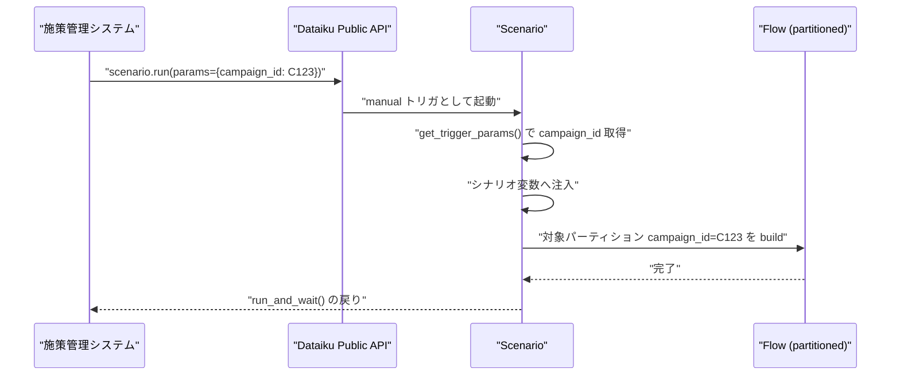
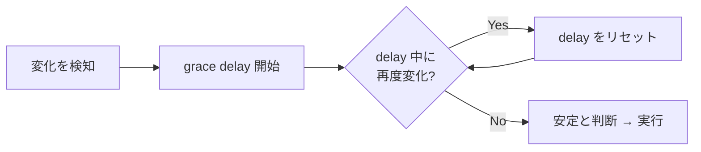
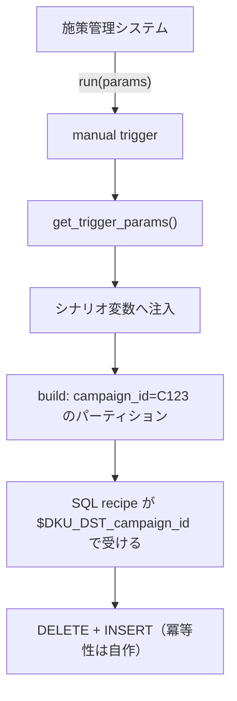

# イベント駆動のトリガ設計

## 概要

本件の要求は「**施策が起きたとき**にパイプラインを回す」ことである。これは「毎週月曜に回す」とは本質的に異なる。キャンペーンは不定期に発生し、その発生タイミングを事前に知ることはできない。

Dataiku のシナリオトリガの正典は *Launching a scenario*（<https://doc.dataiku.com/dss/latest/scenarios/triggers.html>）であり、本クラスタで最も重要なドキュメントである。結論を先に述べる。

> **Dataiku には cron に頼らない起動手段が一通り揃っている。** 本件の本命は **Public API の manual trigger**（外部の施策管理システムから push する形）であり、`get_trigger_params()` によってパーティション値を注入できる点が、02 レポートのパーティション設計と接続する機構になる。

## 1. 時間ベースは最悪の選択

まず消去法から入る。time-based trigger は月次 / 週次 / 日次 / 毎時といった周期しか表現できない。ここから直ちに次の帰結が出る。

> **時間ベースのトリガでは「施策が起きたとき」を表現できない。**

無理に使おうとすると、次のいずれかになる。

| 回避策 | 帰結 |
|--------|------|
| 高頻度（毎時）で回してデータの有無を見る | 施策のない大半の時間で空振り。計算資源とウェアハウスコストを浪費 |
| 低頻度（週次）で回す | 施策発生から最大 1 週間の遅延。配信スケジュールに乗らない |
| 施策予定に合わせて手動でスケジュールを変える | 自動化の放棄。運用が人手に戻る |

高頻度案は一見動くが、実質的には「トリガの中でイベント検知を自作している」ことになる。それなら最初からイベント検知の機構を使うほうがよい。

**時間ベースは本件において最悪の選択である。** これは Dataiku の制約ではなく、cron 的発想と不定期イベントの本質的なミスマッチである。

## 2. トリガ選択表

*Launching a scenario* が定めるトリガ種別を、本件の観点から評価する。

| トリガ | 発火条件 | パラメータ受け渡し | 本件での評価 |
|--------|---------|------------------|------------|
| **time-based** | 周期（月/週/日/時） | なし | ✗ **不適**。イベントを表現できない |
| **dataset change** | データセットの変更 | 限定的 | △ 変更の粒度が施策単位と一致しない |
| **SQL query change** | クエリ結果の変化 | 条件付き（**DB 依存**） | △ 有力だが要検証（第 4 節） |
| **custom Python** | 任意のロジック | `t.fire()` 経由 | ◯ 最も自由。自作コスト有 |
| **manual / API** | 外部からの `run()` | **あり（明示的）** | ◎ **本命**（第 3 節） |
| **scenario-following** | 別シナリオの完了 | — | ◯ 段階分割に有用（第 6 節） |

## 3. 本命 — Public API の manual trigger

*Scenarios（Developer Guide）*（<https://developer.dataiku.com/latest/concepts-and-examples/scenarios.html>）に、本件の設計を決定づける記述がある。

> **手動 / API による起動は、内部的に「manual トリガ」として扱われ、パラメータを渡せる。**

REST API クライアント側の仕様は *Managing scenarios (REST API client)*（<https://doc.dataiku.com/dss/latest/python-api/rest-api-client/scenarios.html>）にあり、`run()` / `run_and_wait()` で外部システムから発火できる。

これが本命である理由は、**制御の向きが正しい** ことに尽きる。

| 方式 | 制御の向き | 施策発生の知識をどこが持つか |
|------|----------|---------------------------|
| ポーリング（time / SQL query change） | Dataiku が **推測しに行く**（pull） | Dataiku がデータから逆算する |
| **manual / API trigger** | 施策管理システムが **教えに来る**（push） | **施策管理システムが本来から持っている** |

施策がいつ始まるかを最もよく知っているのは、施策を管理しているシステムである。その知識を Dataiku 側でデータから推測し直すのは、情報を一度捨ててから復元する作業にほかならない。**push すればよい。**



### `run()` と `run_and_wait()` の使い分け

| メソッド | 挙動 | 適する状況 |
|---------|------|-----------|
| `run()` | 起動して即座に返る | 施策管理システム側をブロックしたくない。完了は別途確認 |
| `run_and_wait()` | 完了まで待つ | 後続処理（配信リスト取得など）が結果に依存する |

数ヶ月サイクルで走る重い学習を含む場合、`run_and_wait()` は長時間ブロックする。起動と結果取得を分離する設計のほうが堅牢になりやすい。

## 4. SQL query change trigger — 有力だが要検証

push が使えない場合（施策管理システムを改修できない等）の次善策が **SQL query change trigger** である。

考え方は単純で、施策の発生を示すクエリを定期的に評価し、**結果が変化したら発火** する。

```sql
-- 新しいキャンペーンの登録を検知する例
SELECT MAX(campaign_launch_date) FROM campaign_master
```

Community の *Scenario SQL query change trigger*（<https://community.dataiku.com/discussion/13943/scenario-sql-query-change-trigger>）が重要な性質を示している。

> **行数だけでなく、値の変化でも発火する。**

これは有用である。行数だけの検知なら「レコードが更新されたが件数は同じ」というケースを取り逃がすが、値の変化を見るため `MAX(campaign_launch_date)` のような集約値の変化を捉えられる。

### ⚠️ 重要な注意 — パラメータ取得は DB 種別に依存する

しかしここに、本件の設計判断に直結する **重大な未確認事項** がある。Community の *Retrieve the result of a scenario's SQL query change trigger*（<https://community.dataiku.com/discussion/11320/retrieve-the-result-of-a-scenario-s-sql-query-change-trigger>）が報告している。

> **SQL トリガの結果が `get_trigger_params()` で常に取得できるとは限らず、DB 種別に依存する。**

さらに悪いことに、**どの DB で取得できるのかを示す公式な一覧を本調査では発見できなかった**。

これが深刻なのは、SQL query change trigger の価値の大部分が「変化した値（＝どのキャンペーンが発生したか）を受け取れること」にあるためである。発火だけして値が取れないなら、シナリオ側は「何かが変わった」ことしか知らず、**どのパーティションを構築すべきか分からない**。結局クエリを再実行して値を取り直すことになり、その間に状態が変わればトリガ時点との不整合が生じる。

| 状況 | 帰結 |
|------|------|
| 値が取れる DB | SQL トリガで完結。パーティション値を注入できる |
| 値が取れない DB | 発火の合図にしかならず、値の再取得を自作。競合の余地が残る |
| **どちらか不明** | **設計の前提が立たない** |

**結論**: SQL query change trigger に依存する設計を採るなら、**使用する DB での実機検証が必須** である。検証前にこのトリガを前提にアーキテクチャを固めてはならない。この点でも manual / API トリガのほうが堅牢である（パラメータ受け渡しが明示的に規定されているため、DB 種別に左右されない）。

## 5. custom Python trigger

任意のロジックで発火させたい場合は custom Python trigger を使う。実装例は Community の *Assistance Needed with Custom Python Triggers*（<https://community.dataiku.com/discussion/42920/assistance-needed-with-custom-python-triggers-in-dataiku>）にある。

```python
from dataiku.scenario import Trigger

t = Trigger()

# 任意の条件判定（外部 API 照会、複数ソースの突合など）
if should_run():
    t.fire()
```

`t.fire()` を呼べば発火し、呼ばなければ発火しない。それだけの単純な機構だが、判定ロジックに制約がないため最も自由度が高い。SQL トリガで表現しきれない条件（複数システムの状態を突き合わせる等）を扱える。

代償は、この trigger 自体が定期的に評価される点にある。すなわち **内部的にはポーリングであり、push ではない**。判定コストと検知遅延のトレードオフは残る。

## 6. scenario-following — 同時実行を防ぐ

*Triggering scenario after another scenario*（<https://community.dataiku.com/discussion/20583/triggering-scenario-after-another-scenario>）が、scenario-following の実務的価値を示している。

> **scenario-following は、同時実行を防げる点で安全である。**

これは本件で効く。学習と評価を別シナリオに分け、後段を前段の完了に追随させれば、両者が同時に走ることがない。一方、両方を time-based で組めば「前段が終わる前に後段が始まる」を防ぐ保証がない。

シナリオのステップ種別は *Scenario steps*（<https://doc.dataiku.com/dss/latest/scenarios/steps.html>）を参照。単一シナリオ内でステップを並べるか、シナリオを分割して following で繋ぐかは、再実行の粒度をどこに置きたいかで決める。

| 構成 | 利点 | 欠点 |
|------|------|------|
| 単一シナリオ内のステップ | 変数が共有され、パラメータ受け渡しが素直 | 一部だけの再実行がしにくい |
| 複数シナリオ + following | 段階ごとに再実行可能。同時実行を防げる | パラメータの引き継ぎを設計する必要 |

## 7. grace delay + re-check — 反応データの到着待ち

*Launching a scenario* が定める grace delay の意味論を、Community の *Triggering custom python: run every / grace delay*（<https://community.dataiku.com/discussion/38698/triggering-custom-python-how-to-properly-set-run-every-seconds-and-grace-delay-seconds>）が明快に説明している。

> **変化が続く限り遅延がリセットされ、安定してから実行される。**

これは単なる「待ち時間」ではない。「**変化が止まるまで待つ**」という意味論である。



### 本件での価値

キャンペーンの反応データは一度に揃わない。配信直後から少しずつ到着し、しばらく増え続ける。ここで素朴な dataset change / SQL query change トリガを使うと、**データが到着するたびに発火する**。1 回の施策で何十回もパイプラインが走りかねない。

grace delay を設定すれば、到着が続く間は待ち、止まってから 1 回だけ実行される。**「外部リソースの安定を待つ」機構がネイティブに存在する** ことは、イベント駆動設計における実質的な利点になる。

ただし delay の長さは施策の性質（反応の集まり方）に依存し、汎用的な推奨値は本調査では見つかっていない。

## 8. `get_trigger_params()` — トリガとパーティションを繋ぐ

*Scenarios (in a scenario)*（<https://developer.dataiku.com/latest/api-reference/python/scenarios-inside.html>）が `get_trigger_params()` の正典である。

> **トリガが設定したパラメータを dict として取得できる。**

これが本クラスタの二つの柱——トリガ（本レポート）とパーティション（02 レポート）——を接続する機構である。

```python
from dataiku.scenario import Scenario

scenario = Scenario()
params = scenario.get_trigger_params()

# manual/API トリガで渡された campaign_id を取得
campaign_id = params.get("campaign_id")

# シナリオ変数へ注入し、後続ステップの build 対象パーティションを決める
scenario.set_scenario_variables(campaign_id=campaign_id)
```

02 レポートで確認したとおり、**all available / latest available は新規パーティションを生成できない**。したがって新しいキャンペーンのパーティションを構築するには、`campaign_id` を外部から明示的に与えるしかない。その供給経路がまさにこれである。



パラメータをシナリオ変数として扱う実務例は日本語で *【Dataiku】シナリオから自動で変数を変更する方法*（<https://blog.truestar.co.jp/dataiku/20231218/57887/>）が参考になる。日本語のシナリオ/トリガ入門としては *自動化（Academy 日本語）*（<https://academy.dataiku.com/automation-ja>）がある。

## 9. 推奨構成

| 層 | 選択 | 根拠 |
|----|------|------|
| 起動 | **manual / API trigger（push）** | パラメータ受け渡しが明示的で DB 種別に依存しない |
| 代替（push 不可の場合） | SQL query change trigger + **実機検証** | 値取得の DB 依存を事前に潰す |
| 特殊条件 | custom Python trigger | 判定ロジックが複雑な場合のみ |
| 安定待ち | grace delay + re-check | 反応データの逐次到着に対応 |
| 段階分割 | scenario-following | 同時実行を防ぐ |
| パラメータ | `get_trigger_params()` → シナリオ変数 → build 対象 | パーティションとの接続点 |
| **不採用** | **time-based** | イベントを表現できない |

## 未確認・注意事項

1. **SQL query change trigger のパラメータ取得可否の DB 別条件** — Community に「DB 種別により取れないことがある」との報告があるが、**公式な対応 DB 一覧は発見できなかった**。SQL トリガに依存する設計を採るなら **事前の実機検証が必須**。本件で使用予定の DWH での確認を、設計確定前のタスクとして置くこと。
2. **grace delay の推奨値** — 反応データの到着パターンに依存し、汎用的なガイダンスは見つかっていない。実データでの観測が必要。
3. **dataset change trigger の変更検知粒度** — 施策単位の粒度とどう対応づくかを詳細に論じた資料は本調査の範囲では確認していない。

## 参照リソース

| # | タイトル | URL |
|---|---------|-----|
| 36 | Launching a scenario（triggers） | <https://doc.dataiku.com/dss/latest/scenarios/triggers.html> |
| 37 | Scenarios (in a scenario) — get_trigger_params | <https://developer.dataiku.com/latest/api-reference/python/scenarios-inside.html> |
| 38 | Scenarios（Developer Guide / 外部起動） | <https://developer.dataiku.com/latest/concepts-and-examples/scenarios.html> |
| 39 | Managing scenarios (REST API client) | <https://doc.dataiku.com/dss/latest/python-api/rest-api-client/scenarios.html> |
| 40 | Scenario steps | <https://doc.dataiku.com/dss/latest/scenarios/steps.html> |
| 41 | Scenario SQL query change trigger | <https://community.dataiku.com/discussion/13943/scenario-sql-query-change-trigger> |
| 42 | Retrieve the result of a scenario's SQL query change trigger | <https://community.dataiku.com/discussion/11320/retrieve-the-result-of-a-scenario-s-sql-query-change-trigger> |
| 43 | Assistance Needed with Custom Python Triggers | <https://community.dataiku.com/discussion/42920/assistance-needed-with-custom-python-triggers-in-dataiku> |
| 44 | Triggering custom python: run every / grace delay | <https://community.dataiku.com/discussion/38698/triggering-custom-python-how-to-properly-set-run-every-seconds-and-grace-delay-seconds> |
| 45 | Triggering scenario after another scenario | <https://community.dataiku.com/discussion/20583/triggering-scenario-after-another-scenario> |
| 79 | 【Dataiku】シナリオから自動で変数を変更する方法 | <https://blog.truestar.co.jp/dataiku/20231218/57887/> |
| 81 | 自動化（Academy 日本語） | <https://academy.dataiku.com/automation-ja> |
