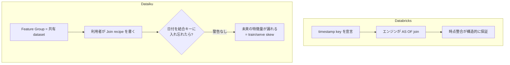
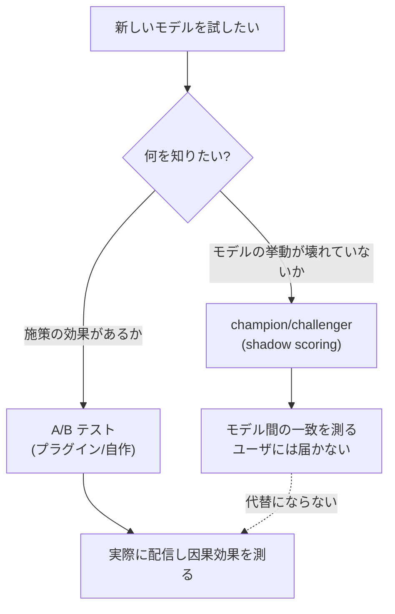
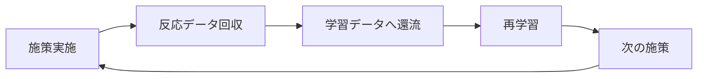

# Feature Store・ドリフト・A/B テスト — ネイティブの限界

## 概要

01〜03 で扱ったプッシュダウン・パーティション・トリガは、いずれも「Dataiku のネイティブ機能が要求に応えられる」領域だった。本レポートが扱う三領域は違う。ここで問われるのは **どこまでがネイティブで、どこからが自作か** の線引きであり、線は思ったより手前に引かれている。

結論を先に置く。

| 領域 | ネイティブの到達点 | 自作が必要な部分 | リスク |
|------|-----------------|----------------|--------|
| **Feature Store** | 特徴量の共有・発見 | **point-in-time 整合の全て** | **最大** |
| **Data Quality** | データセットの品質ルール | モデル/MES 側は旧世代 API | 中（二世代併用） |
| **ドリフト** | 3 系統の検知機構 | 不定期サイクル向けの閾値運用 | 中 |
| **A/B テスト** | **なし（プラグイン）** | 実験基盤の大半 | 高（サステナビリティ） |

## 1. Feature Store の point-in-time 問題 — 最大のリスク

### 1.1 何が無いか

正典は *Feature Store*（<https://doc.dataiku.com/dss/latest/mlops/feature-store/>）である。ここに定義されるのは次の要素にとどまる。

- **Feature Group** = 横断的に共有される curated dataset
- **offline での利用** = Join recipe
- **online での利用** = Dataset Lookup

そして本調査の中心的な発見がこれである。

> **一次ドキュメントを直接確認した結果、point-in-time / as-of join / timestamp key のいずれの言及も存在しない。**

ハンズオンの *Tutorial | Building your feature store in Dataiku*（<https://knowledge.dataiku.com/latest/kb/o16n/feature-store/features-store-overview.html>）でも as-of join は登場しない。

### 1.2 公式ブログ自身が不在を裏づけている

決定的なのは *Setting up Your Feature Store With Dataiku*（<https://blog.dataiku.com/set-up-feature-store-with-dataiku>）の記述である。ここでは point-in-time correctness を、

> **取引日と特徴量生成日を「結合キーに加えることで」実現する**

と説明している。

これは **製品機能の説明ではなく、利用者が手で組む設計パターンの説明** である。宣言的な時点整合機能が存在するなら、公式ブログが「日付を結合キーに追加せよ」と手順を説く必要はない。**その説明の存在自体が、機能の不在を裏づけている。**

関連して *Building a Feature Store for Quicker and More Accurate ML Models*（<https://blog.dataiku.com/building-a-feature-store>）は課題を認識しているものの、Dataiku 側の実装機構は示していない。

### 1.3 対照 — Databricks は何をしているか

*Point-in-time feature joins — Databricks*（<https://docs.databricks.com/aws/en/machine-learning/feature-store/time-series>）が **機能差を示す基準線** になる。

| | Dataiku | Databricks |
|---|---------|-----------|
| timestamp key の宣言 | **なし** | あり |
| `AS OF` join の実行 | **なし（利用者が Join を書く）** | **エンジンが実行** |
| 時点整合の責任 | **利用者** | 製品 |
| 誤った Join のガード | なし | 宣言により構造的に防止 |

差は「便利さ」ではなく **責任の所在** にある。Databricks では timestamp key を宣言すればエンジンが正しい時点の値を引く。Dataiku では Join を書く人が毎回正しく書かねばならず、間違っても何も警告されない。

### 1.4 なぜ本件で致命的になりうるか

> **train/serve skew は利用者側の Join 設計責任である。**

本件は「数ヶ月おきのキャンペーン **時点** でのユーザ属性」を再現する必要がある。素朴に Feature Group を Join すれば、**最新の**特徴量が付く。これは学習時に「未来の情報」を与えることを意味する。

具体的な破綻の形はこうなる。

| 場面 | 素朴な Join の結果 | あるべき姿 |
|------|-----------------|-----------|
| 2026-01 の施策の学習データを作る | **現在（2026-07）の** ユーザ属性が付く | 2026-01 時点の属性 |
| 学習時の評価 | 未来情報でスコアが不当に高く出る | 実際の予測可能性を反映 |
| 本番推論 | 当然「その時点」の属性しかない | 同左 |
| **帰結** | **学習時に良く、本番で劣化する** | 一致する |

数ヶ月のサイクルという性質が事態を悪化させる。施策間の間隔が長いほど、「最新」と「施策時点」の乖離が大きくなる。日次で回すパイプラインなら誤差は小さいが、数ヶ月では属性が実質的に別物になる。しかも **skew は静かに起きる**——エラーは出ず、学習スコアはむしろ良くなる。本番で uplift が出ないという形でしか現れない。

### 1.5 設計上の帰結

> **日付付きスナップショット保存 + 明示的な日付結合を自作する前提で設計すべきである。**

具体的には次を Flow 上に明示的に構築する。

1. 特徴量を **生成日付とともに** スナップショットとして保存する（追記型）
2. 学習データ生成時、**キャンペーン日 ≧ 特徴量生成日** の条件で結合する
3. 各ユーザについて条件を満たす最新のスナップショットを 1 件選ぶ

この「自作の as-of join」を、02 レポートのパーティション設計と組み合わせる。`campaign_id` パーティションごとに、その施策時点のスナップショットを引く形になる。

重要なのは、**これを Flow 上の明示的な構造として設計する** ことである。個々の Join recipe の中に埋め込むと、レビューできず、書き手が変われば壊れる。

### 1.6 Feature Group への DQ Rules 適用は未確認

Feature Group の実体は dataset なので Data Quality Rules（次節）が効くと推測されるが、**明示的な記述はない**。むしろ Feature Store のドキュメントは「Data monitoring is implemented using **Metrics & Checks**」と、**旧世代の表現のまま** になっている。

これは単なる記述の古さかもしれないし、Feature Group が DQ Rules の対象外である可能性も否定できない。**要実機確認**。

## 2. Data Quality Rules の世代交代

### 2.1 何が起きたか

正典 *Data Quality Rules*（<https://doc.dataiku.com/dss/latest/metrics-check-data-quality/data-quality-rules.html>、一次確認済み）は、次の 2 点を明記している。

> **DSS 12.6.0** で checks system に対する **an improvement** として導入された。
>
> **Other flow objects (managed folders, saved models, model evaluation store) still use checks.**

つまり **DQ Rules はデータセット専用で確定** である。

*Concept | Data quality rules*（<https://knowledge.dataiku.com/latest/data-quality/concept-data-quality.html>）が示すとおり、DQ Rules の利点は「metric を作ってから check を適用する」という 2 段構えが不要になり、直接ルールを定義できる点にある。ハンズオンは *Tutorial | Data quality*（<https://knowledge.dataiku.com/latest/automation/data-quality/tutorial-data-quality.html>）。

### 2.2 旧世代は現役である

*Concept | Metrics & checks (pre-12.6)*（<https://knowledge.dataiku.com/latest/data-quality/concept-metrics-checks.html>）は「旧世代」だが、**データセット以外（MES / saved model / managed folder）では現役** である。したがって必読になる。check 自体の詳細は *Concept | Checks*（<https://knowledge.dataiku.com/latest/automation/data-quality/concept-checks.html>）にある。両世代の関係の俯瞰は *Metrics, checks and Data Quality*（<https://doc.dataiku.com/dss/latest/metrics-check-data-quality/index.html>）。

### 2.3 本件への帰結

| ゲートしたい対象 | 使う世代 | API |
|----------------|---------|-----|
| 入力データの品質 | **DQ Rules**（12.6.0+） | 新 |
| 特徴量データセットの品質 | **DQ Rules** | 新 |
| Feature Group | **不明（要確認）** | ? |
| **saved model の品質** | **metrics & checks** | 旧 |
| **Model Evaluation Store の判定** | **metrics & checks** | 旧 |
| managed folder | metrics & checks | 旧 |

> **モデル品質のゲートは依然 metrics & checks 側にあり、施策サイクルの品質ゲートは二世代 API の併用になる。**

本件のシナリオは「データ品質を確認 → 学習 → モデル品質を確認 → 配信」という流れを持つ。前半は DQ Rules、後半は metrics & checks。**同一シナリオ内で二世代の API が混在する** ことを、最初から設計として受け入れる必要がある。日本語では *DataikuにおけるData QualityとMetricsを使ったデータの品質監視*（<https://www.keywalker.co.jp/blog/dataiku-data-management.html>）が両者を解説している。

## 3. ドリフト

### 3.1 3 系統と ground truth 要否

正典は *Drift analysis*（<https://doc.dataiku.com/dss/latest/mlops/drift-analysis/index.html>）。

| 種別 | 見るもの | ground truth | 本件での価値 |
|------|---------|-------------|------------|
| **input data drift** | 特徴量分布の変化 | **不要** | ◎ 結果を待たず監視可 |
| **prediction drift** | 予測分布の変化 | **不要** | ◎ 同上 |
| **performance drift** | 実性能の劣化 | **必須** | △ 検知が大きく遅れる |

### 3.2 domain classifier 方式

*Input Data Drift*（<https://doc.dataiku.com/dss/latest/mlops/drift-analysis/input-data-drift.html>）が **domain classifier 方式の一次ソース** である。仕組みはこうである。

> **学習時のサンプルと評価データを連結し、「どちらの標本に属するか」を予測するモデルを作る。精度が高いほどドリフトが大きい。**

直観的に明快である。二つの標本が同じ分布から来ているなら、どちらに属するかは当てられない（精度 ≒ 0.5）。当てられるということは、区別できる差があるということである。

*A Primer on Data Drift & Drift Detection Techniques*（<https://pages.dataiku.com/data-drift-detection-techniques>）が、domain classifier は「変化検知と非典型サンプルの特定に強い」理由を説明している。加えて特徴量ごとの **KS 検定** も提供され、「どの特徴量が動いたか」の粒度で見られる。

*Prediction Drift*（<https://doc.dataiku.com/dss/latest/mlops/drift-analysis/prediction-drift.html>）も同様に ground truth 不要である。

### 3.3 ground truth 不要が本件で決定的な理由

> **input data drift と prediction drift は ground truth 不要＝キャンペーン結果が出る前でも監視できる。**

これは uplift モデリングにおいて特に価値が高い。理由は uplift の原理的な性質にある。**個体レベルの真の増分効果は観測できない**——同じ人に「介入した場合」と「しなかった場合」の両方を同時に観測することは原理的に不可能である。したがって「正解ラベル」に相当するものが、集団レベルの推定を経ずには得られない。

ground truth を必要としない監視手段は、この制約を迂回できる数少ない道具になる。

### 3.4 performance drift の遅さ

*Performance Drift*（<https://doc.dataiku.com/dss/latest/mlops/drift-analysis/performance-drift.html>）は **ground truth が必須** であり、レスポンス回収後にしか評価できない。

数ヶ月サイクルの本件では次のようになる。

| 時点 | 状況 |
|------|------|
| T | 施策実施・配信 |
| T + 数週 | 反応データが揃う |
| T + 数週 | performance drift を初めて評価できる |
| **T + 数ヶ月** | **次の施策**——ここで初めて改善を反映できる |

つまり **検知が大きく遅れ、しかも改善の反映機会は次の施策まで来ない**。performance drift を主たる監視手段に据えると、実質的にフィードバックループが機能しない。ラベル不要の 2 系統を前線に、performance drift を事後検証に、と役割を分けるべきである。

### 3.5 施策ごとに対象が違う——ドリフトは「起きて当然」

ここが本件固有の重要な論点である。

> **施策ごとに対象ユーザーが異なるため、ドリフトは設計上発生して当然である。**

キャンペーン A は 20 代向け、キャンペーン B は既存優良顧客向け——そもそも母集団が違うのだから、特徴量分布は当然変わる。domain classifier は高い精度でこれを検知する。しかしそれは **モデルの劣化ではなく、施策の設計どおり** である。

したがって：

> **素朴なアラートは毎施策で発火して無意味になる。「どの特徴量が動いたか」の診断として使う。**

| 使い方 | 評価 |
|--------|------|
| 「ドリフト検知 → アラート → 再学習」の自動化 | ✗ 毎回発火し、狼少年になる |
| 「どの特徴量がどう動いたか」を見て、施策の意図と照合する | ◯ 診断として機能 |
| 意図しない特徴量が動いていないかの確認 | ◯ 本来の価値 |

つまり問うべきは「ドリフトしたか」ではなく **「想定した以外のものがドリフトしていないか」** である。年齢分布が動くのは意図どおり。しかし購買頻度の分布まで想定外に動いているなら、それはターゲティングの副作用か、データ側の問題かもしれない。

Dataiku 公式 Qiita の *機械学習 - Dataikuによる予測モデルの維持と改善*（<https://qiita.com/Dataiku/items/b0b7bfc0a3bb73195610>）がドリフト検知 → 通知 or 再学習のシナリオ連携を扱っているが、これは定常運用を前提とした形であり、本件にそのまま適用すべきではない。

### 3.6 閾値設定のガイダンスは存在しない

> **不定期サイクル向けのドリフト閾値設定ガイダンスは、公式・非公式とも発見できなかった。**

**Dataiku の文書は日次/週次の定常運用を暗黙の前提としている。** 「前週と比べて」「継続的に監視して」といった枠組みは、施策が数ヶ月おきにしか発生しない状況を想定していない。比較対象の基準（何と比べるのか）自体が自明でない。

| 比較対象の候補 | 問題 |
|--------------|------|
| 学習時サンプル | 施策ごとに母集団が違うので毎回大きく出る |
| 前回の施策 | 前回も別の母集団。何を意味するか不明 |
| 全ユーザ母集団 | 「ターゲティングした度合い」を測ってしまう |

ここは **本件の設計者が自分で決めるしかない領域** であり、参照できる先行知見がないことを前提に置くべきである。

### 3.7 非推奨プラグインへの注意

*Plugin: Model Drift Monitoring*（<https://www.dataiku.com/product/plugins/model-drift/>）は **deprecated** であり、ネイティブ機能に置換済みである。ドリフト関連の旧記事を参照する際、このプラグインを前提にした手順が出てきたら無視すること。

**この事実は次節の A/B テストにとって重要な先例になる。** Dataiku はプラグインを非推奨化する。

## 4. A/B テスト

### 4.1 ネイティブ機能ではない

> **A/B テストは Dataiku のネイティブ機能ではなく、プラグインである。**

*AB Test Calculator plugin*（<https://www.dataiku.com/product/plugins/ab-test-calculator/>）が提供するものは次のとおり。ソースは *dss-plugin-ab-testing*（<https://github.com/dataiku/dss-plugin-ab-testing/blob/master/README.md>）で確認できる。

| 構成要素 | 内容 |
|---------|------|
| サンプルサイズ計算 webapp | 必要 n の算出 |
| population split | `dku_ab_group` 列を付与して群を割り当てる |
| Experiment Summary recipe | 実験結果の集計 |
| 結果分析 webapp | 有意差の判定 |

イベント販促の A/B という **本件に最も近いチュートリアル** は *Tutorial | A/B testing for event promotion*（<https://knowledge.dataiku.com/latest/use-cases/plugins/tutorial-a-b-testing.html>）である。

### 4.2 何が無いか

このプラグインは **頻度論の 2 群計算機に留まる**。実験基盤として期待される次の機能は存在しない。

| 期待される機能 | 有無 |
|--------------|------|
| 割当・ランダム化サービス（実行時に群を返す） | **なし** |
| 逐次検定（early stopping） | **なし** |
| 多変量テスト | **なし** |
| 実験レジストリ（実験の一覧・履歴管理） | **なし** |
| 2 群のサンプルサイズ計算 | あり |
| バッチでの群割付（`dku_ab_group`） | あり |

本件はバッチ配信なので「実行時の割当サービス」は必須ではないかもしれない。しかし **実験レジストリの不在** は数ヶ月サイクルで効いてくる。「前回の施策で何を検証し、どういう結果だったか」を追える仕組みが無ければ、施策をまたいだ学習が蓄積しない。

### 4.3 プラグイン依存はサステナビリティのリスク

> **AB Test Calculator プラグインの保守状況（最終更新時期、最新 DSS でのサポート、非推奨化の可能性）を確認できなかった。**

そして前節で見たとおり、**Model Drift Monitoring プラグインは実際に非推奨化されている**。Dataiku がプラグインを非推奨にする前例は存在する。

したがってこのプラグインは、**アーキテクチャの基盤として依存すべきではない**。

| 位置づけ | 妥当性 |
|---------|--------|
| サンプルサイズ計算の補助ツールとして使う | ◯ 依存が浅い |
| 群割付のリファレンス実装として参考にする | ◯ ソースが公開されている |
| **実験基盤の中核として依存する** | ✗ 非推奨化で全体が止まる |

ソースが GitHub で公開されている（#65）ことは緩和材料になる。挙動の一次確認ができ、必要ならカスタマイズや内製化の出発点にできる。

### 4.4 champion/challenger は A/B テストではない

これが本レポートで最も混同されやすく、最も重要な区別である。

*MLOps: Champion/Challenger Model Evaluation*（<https://blog.dataiku.com/mlops-champion-challenger-model-evaluation>）が区別の核心を示している。

> **challenger は同じリクエストを採点するが、応答を返さない（shadow scoring）。**

ここからすべてが従う。

| | champion/challenger | A/B テスト |
|---|-------------------|-----------|
| challenger の応答 | **返さない（shadow）** | 実際にユーザに届く |
| ユーザ体験への影響 | **なし** | あり |
| 測っているもの | **モデル間の一致/不一致** | **施策の効果** |
| 因果推論 | **できない** | できる |
| 目的 | 新モデルの安全な検証 | 施策の意思決定 |

> **challenger は応答を返さないのでユーザ体験に影響を与えず、したがって施策効果の因果推論はできない。測っているのはモデル間の一致であって、施策の uplift ではない。**

challenger が「champion と違うスコアを出した」ことは分かる。しかし **そのスコアで配信していたら結果がどうだったか** は分からない。介入が発生していないのだから、効果を測る手立てがない。

公式 KB の *Concept | Monitoring and feedback in the AI project lifecycle*（<https://knowledge.dataiku.com/latest/mlops-o16n/model-monitoring/concept-monitoring-feedback.html>）自身が「shadow scoring (champion/challenger) **setup or with** A/B testing」と **両者を並置** している。Dataiku 自身が別物として扱っているということである。

なお *Model Comparisons*（<https://doc.dataiku.com/dss/latest/mlops/model-comparisons/index.html>）は champion を challengers と比較する機能を提供するが、Community の *Automate selecting champion model and challenger model*（<https://community.dataiku.com/discussion/33215/automate-selecting-champion-model-and-challenger-model>）が示すとおり、**昇格の自動化にはネイティブ機能がなく自作が要る**。比較はできるが、比較結果に基づいて champion を差し替える部分は自分で書く。

### 4.5 ループを閉じる機構はネイティブに存在しない

> **施策結果を学習データへ還流させる「ループを閉じる」機構は、ネイティブには存在しない。自分で Flow を設計する。**

本件のサイクルは次の形をしている。

このうち Dataiku がネイティブに提供するのは D（学習）と、A の入口（トリガ）である。**B → C の還流は自作** になる。具体的には、反応データを施策時点の特徴量スナップショット（第 1 節）と結合し、学習データセットに追記する Flow を、パーティション構造の上に自分で構築することになる。

数ヶ月サイクルではこのループが年に数回しか回らない。**1 回の設計ミスが取り返しにくい** ため、ここは慎重に設計すべき箇所である。

## 5. 設計チェックリスト

| 確認項目 | 帰結 |
|---------|------|
| 特徴量を **生成日付付きスナップショット** として保存しているか | 無ければ point-in-time 整合が原理的に不可能 |
| 学習データ生成の Join に **施策日 ≧ 特徴量生成日** の条件があるか | 無ければ train/serve skew が静かに発生 |
| その Join が Flow 上の明示的な構造になっているか | recipe 内に埋め込むとレビュー不能 |
| Feature Group への DQ Rules 適用を実機確認したか | ドキュメントが旧世代表現のまま |
| モデル品質のゲートを metrics & checks 側で書いているか | DQ Rules はデータセット専用 |
| ドリフト監視を「アラート」でなく「診断」として設計しているか | 施策ごとに母集団が違うので毎回発火する |
| performance drift を主たる監視手段にしていないか | 検知が数ヶ月遅れる |
| A/B テストのプラグインを基盤として依存していないか | 非推奨化の前例あり |
| champion/challenger を A/B テストの代替と誤解していないか | shadow scoring では因果推論不能 |
| 施策結果の学習データ還流 Flow を設計したか | ネイティブには存在しない |
| 配信前の人手承認が必要なら Govern を前提にしているか | sign-off は Govern 機能 |

## 6. 補足 — Govern による配信前ゲート

本クラスタの範囲外に近いが、施策サイクルの品質ゲートに関わるため触れておく。*Sign-off Scenario*（<https://doc.dataiku.com/dss/latest/governance/sign-off.html>）が定めるとおり、sign-off は **Feedback（複数レビュアー）+ Final Approval（最終承認者 1 名）** で構成される。*Concept | Sign-offs in workflows of Govern items*（<https://knowledge.dataiku.com/latest/mlops-o16n/govern/concept-reviews-signoffs.html>）によれば **却下・放棄時はワークフローがロックされデプロイ不可** になる。

承認をシナリオ実行の関門にする方法は *How to trigger Scenarios from a Govern node*（<https://developer.dataiku.com/latest/tutorials/govern/hooks-and-scenarios/index.html>）にあり、配信前の人手ゲートに直結する。数ヶ月サイクルで 1 回の施策の重みが大きい本件では、この人手ゲートは合理的な設計になりうる。自動化 API は *Govern API（Python）*（<https://developer.dataiku.com/latest/api-reference/python/govern.html>）。

ただしこれは **Dataiku Govern（別ノード）が必要** である点に注意。

## 7. 未確認・注意事項

1. **Feature Store の point-in-time / as-of join** — 一次ドキュメントを直接取得して確認した結果、**いずれの言及も存在しない**。ただし「文書にない」ことは「実装が絶対にない」ことの証明ではない。**現時点では『無い前提で設計する』が唯一の安全策**。
2. **Feature Group に対する DQ Rules の適用可否** — Feature Group の実体は dataset なので効くと推測されるが明示的な記述はない。Feature Store のドキュメントは「Data monitoring is implemented using Metrics & Checks」と **旧世代の表現のまま**。要実機確認。
3. **AB Test Calculator プラグインの保守状況** — 最終更新時期・最新 DSS でのサポート状況・非推奨化の可能性を確認できず。**プラグイン依存はサステナビリティのリスク** として扱うべき。Model Drift Monitoring プラグインの非推奨化が前例。
4. **不定期サイクルにおけるドリフト検知の実務的な閾値設定** — Dataiku の文書は **日次/週次のような定常運用を暗黙の前提** としており、**不定期サイクル向けのガイダンスは公式・非公式とも発見できなかった**。
5. **日本語資料の不足** — Feature Store、drift の domain classifier、A/B プラグインについて **日本語の一次資料は事実上存在しない**。本領域の設計判断は英語一次ドキュメントに依拠する前提を置くべき。

## 参照リソース

| # | タイトル | URL |
|---|---------|-----|
| 46 | Feature Store | <https://doc.dataiku.com/dss/latest/mlops/feature-store/> |
| 47 | Tutorial \| Building your feature store in Dataiku | <https://knowledge.dataiku.com/latest/kb/o16n/feature-store/features-store-overview.html> |
| 48 | Setting up Your Feature Store With Dataiku | <https://blog.dataiku.com/set-up-feature-store-with-dataiku> |
| 49 | Building a Feature Store for Quicker and More Accurate ML Models | <https://blog.dataiku.com/building-a-feature-store> |
| 50 | Point-in-time feature joins — Databricks（対照） | <https://docs.databricks.com/aws/en/machine-learning/feature-store/time-series> |
| 51 | Data Quality Rules | <https://doc.dataiku.com/dss/latest/metrics-check-data-quality/data-quality-rules.html> |
| 52 | Metrics, checks and Data Quality（索引） | <https://doc.dataiku.com/dss/latest/metrics-check-data-quality/index.html> |
| 53 | Concept \| Data quality rules | <https://knowledge.dataiku.com/latest/data-quality/concept-data-quality.html> |
| 54 | Concept \| Metrics & checks (pre-12.6) | <https://knowledge.dataiku.com/latest/data-quality/concept-metrics-checks.html> |
| 55 | Concept \| Checks | <https://knowledge.dataiku.com/latest/automation/data-quality/concept-checks.html> |
| 56 | Tutorial \| Data quality | <https://knowledge.dataiku.com/latest/automation/data-quality/tutorial-data-quality.html> |
| 57 | Drift analysis | <https://doc.dataiku.com/dss/latest/mlops/drift-analysis/index.html> |
| 58 | Input Data Drift | <https://doc.dataiku.com/dss/latest/mlops/drift-analysis/input-data-drift.html> |
| 59 | Prediction Drift | <https://doc.dataiku.com/dss/latest/mlops/drift-analysis/prediction-drift.html> |
| 60 | Performance Drift | <https://doc.dataiku.com/dss/latest/mlops/drift-analysis/performance-drift.html> |
| 61 | Automating model evaluations and drift analysis | <https://doc.dataiku.com/dss/latest/mlops/model-evaluations/automating.html> |
| 62 | A Primer on Data Drift & Drift Detection Techniques | <https://pages.dataiku.com/data-drift-detection-techniques> |
| 63 | Plugin: Model Drift Monitoring（非推奨） | <https://www.dataiku.com/product/plugins/model-drift/> |
| 64 | AB Test Calculator plugin | <https://www.dataiku.com/product/plugins/ab-test-calculator/> |
| 65 | dss-plugin-ab-testing（GitHub） | <https://github.com/dataiku/dss-plugin-ab-testing/blob/master/README.md> |
| 66 | Tutorial \| A/B testing for event promotion | <https://knowledge.dataiku.com/latest/use-cases/plugins/tutorial-a-b-testing.html> |
| 67 | Concept \| Monitoring and feedback in the AI project lifecycle | <https://knowledge.dataiku.com/latest/mlops-o16n/model-monitoring/concept-monitoring-feedback.html> |
| 68 | MLOps: Champion/Challenger Model Evaluation | <https://blog.dataiku.com/mlops-champion-challenger-model-evaluation> |
| 69 | Model Comparisons | <https://doc.dataiku.com/dss/latest/mlops/model-comparisons/index.html> |
| 70 | Automate selecting champion model and challenger model | <https://community.dataiku.com/discussion/33215/automate-selecting-champion-model-and-challenger-model> |
| 71 | Sign-off Scenario | <https://doc.dataiku.com/dss/latest/governance/sign-off.html> |
| 72 | Governance Process Features | <https://doc.dataiku.com/dss/latest/governance/governance-features.html> |
| 73 | Concept \| Sign-offs in workflows of Govern items | <https://knowledge.dataiku.com/latest/mlops-o16n/govern/concept-reviews-signoffs.html> |
| 74 | How to trigger Scenarios from a Govern node | <https://developer.dataiku.com/latest/tutorials/govern/hooks-and-scenarios/index.html> |
| 75 | Govern API（Python） | <https://developer.dataiku.com/latest/api-reference/python/govern.html> |
| 77 | 機械学習 - Dataikuによる予測モデルの維持と改善 | <https://qiita.com/Dataiku/items/b0b7bfc0a3bb73195610> |
| 78 | DataikuにおけるData QualityとMetricsを使ったデータの品質監視 | <https://www.keywalker.co.jp/blog/dataiku-data-management.html> |
