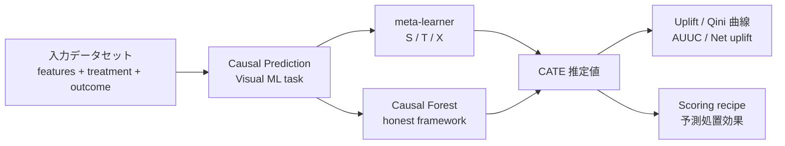
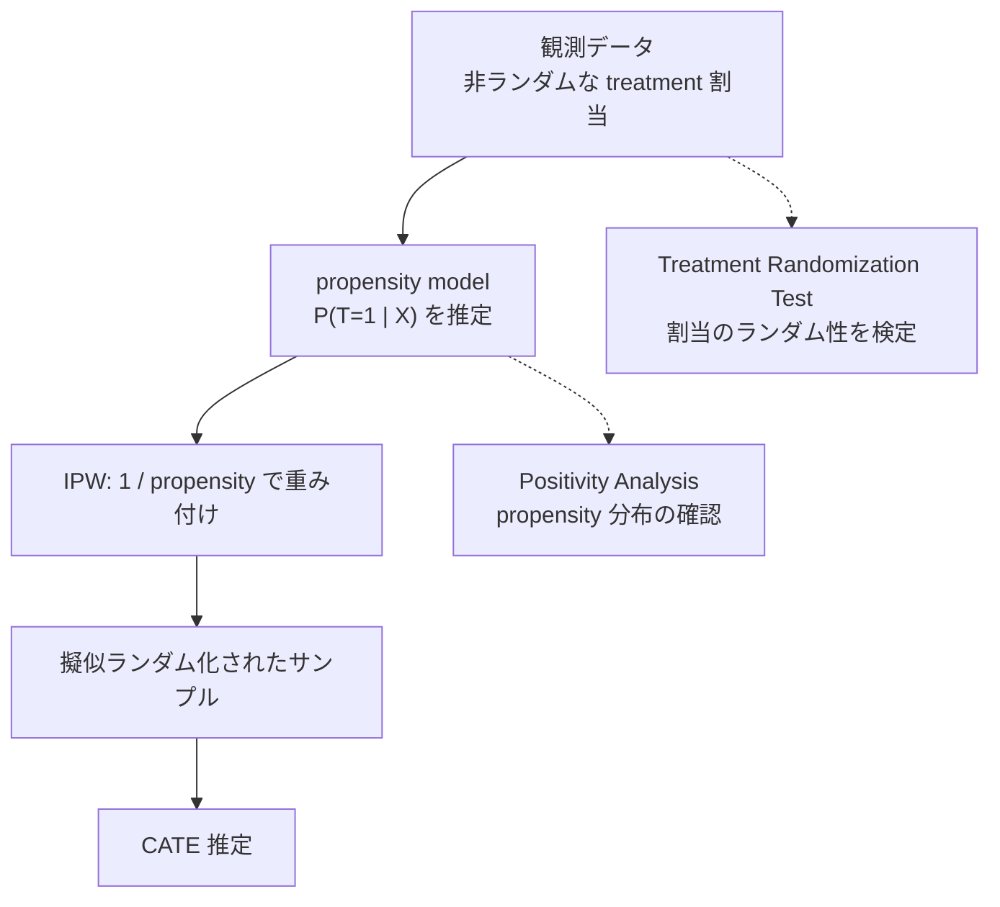

# 01. Dataiku Causal Prediction — 機能仕様の全体像

- **主要出典**:
  - [Introduction — Causal Prediction](https://doc.dataiku.com/dss/latest/machine-learning/causal-prediction/introduction.html)
  - [Causal Prediction Algorithms](https://doc.dataiku.com/dss/latest/machine-learning/causal-prediction/causal-prediction-algorithms.html)
  - [Causal Prediction Settings](https://doc.dataiku.com/dss/latest/machine-learning/causal-prediction/settings.html)
  - [Causal Prediction Results](https://doc.dataiku.com/dss/latest/machine-learning/causal-prediction/results.html)
  - [Concept | Causal prediction (KB)](https://knowledge.dataiku.com/latest/ml-analytics/causal-prediction/concept-causal-prediction.html)
- **ドキュメント規模**: `machine-learning/causal-prediction/` 配下は **6ページで全構成**（ページ棚卸しで確認済み）。Visual ML の他機能に比べて極端に小さい

## 1. 何を解く機能か

Causal Prediction は Visual ML のタスク種別の一つで、**CATE（Conditional Average Treatment Effect）を推定する**。通常の supervised prediction が「この顧客は購入するか」を予測するのに対し、Causal Prediction は「**この顧客に施策を打った場合と打たなかった場合の差**」を予測する。

KB の Concept ページが明示する通り、この差は**原理的に観測不能**である。同一個人について「施策を打った世界」と「打たなかった世界」の両方を観測することはできない（反実仮想の根本問題）。モデルは観測されたデータから、この観測不能な量を統計的仮定のもとで推定しているにすぎない。この点はレポート 04 で詳述する。

## 2. アルゴリズム

出典: [Causal Prediction Algorithms](https://doc.dataiku.com/dss/latest/machine-learning/causal-prediction/causal-prediction-algorithms.html)

提供されるのは **meta-learner 3種（S / T / X）と Causal Forest** の計4系統である。

| アルゴリズム | 種別 | 概要 |
|------------|------|------|
| **S-learner** | meta-learner | treatment を単一の特徴量としてモデルに入れ、単一モデルで学習する。treatment 有無を入れ替えて予測差分を取る |
| **T-learner** | meta-learner | treatment 群と control 群で**別々のモデル**を学習し、両者の予測差を CATE とする |
| **X-learner** | meta-learner | T-learner を拡張し、群間で交差的に擬似アウトカムを構成する。**群サイズが不均衡な場合に強い**とされる設計 |
| **Causal Forest** | 木ベース | **honest framework** に基づくランダムフォレスト系推定量 |

### 2.1 base learner の自由度

meta-learner の base learner には **「任意の Python ベース ML アルゴリズム」**を指定できる。つまり S/T/X-learner の内側は、Dataiku の Visual ML が持つ Python 系アルゴリズム（勾配ブースティング、ランダムフォレスト、線形モデル等）をそのまま流用できる構造になっている。

これは実務上重要で、**meta-learner の選択と base learner の選択が直交している**ため、探索空間は「4系統」ではなく「3 meta-learner × base learner 種数 + Causal Forest」となる。

### 2.2 Causal Forest のハイパーパラメータ

Causal Forest では以下が設定可能である。

| パラメータ | 備考 |
|-----------|------|
| 木の本数 | — |
| 特徴サンプリング率 | **既定 30%** |
| 最大深度 | — |
| 並列度 | 学習の並列実行数 |

**honest framework** とは、木の分割を決めるデータと葉での効果推定に使うデータを分離する手法で、過学習によるバイアスを抑え推定量の統計的性質（信頼区間の妥当性）を担保する。Causal Forest 系の標準的な設計であり、Dataiku がこれを採用していることは実装の質を示す妥当な兆候である。

### 2.3 追加されていないもの

⚠️ **DR-learner / R-learner は提供されていない**。リリースノート全文の grep では、12.0.0 以降**アルゴリズムの追加が一度もない**ことが確認されている（レポート 03 参照）。CausalML / EconML が提供する DR-learner、R-learner、DRPolicyTree 等を使いたい場合、ネイティブ機能の範囲外となり、姉妹クラスタ `custom_python_path` の経路を検討することになる。

なお、**Dataiku の Causal Prediction が内部で EconML / CausalML を使っているかは非公開**である。ドキュメントには実装の依存関係についての記述がない。

## 3. treatment / outcome の型制約

出典: [Introduction](https://doc.dataiku.com/dss/latest/machine-learning/causal-prediction/introduction.html) / [Settings](https://doc.dataiku.com/dss/latest/machine-learning/causal-prediction/settings.html)

これは設計初期に必ず確認すべき制約である。

| 項目 | 対応範囲 |
|------|---------|
| **treatment** | **binary** および **multi-valued**（多値処置） |
| **outcome（分類）** | ⚠️ **binary outcome のみ** |
| **outcome（回帰）** | 連続値に対応 |
| **control value** | 明示的に指定する（どの treatment 値を対照群とみなすか） |

### 3.1 multi-valued treatment

多値処置は **12.2.0（2023-09-01）で追加された**機能である（12.0.0 の当初機能ではない — レポート 03 の訂正参照）。Community の [Dataiku 12.2 Summer Special](https://community.dataiku.com/discussion/37208/dataiku-12-2-summer-special-a-new-wave-of-product-features-and-enhancements) が「Multiple Treatments for Causal ML」として解説しており、これが裏付けとなる。

マーケティング文脈では「メール / アプリ通知 / DM / 何もしない」のような複数チャネルの比較に相当し、実務価値は高い。KB の [Tutorial](https://knowledge.dataiku.com/latest/ml-analytics/causal-prediction/tutorial-causal-prediction.html) が単一 treatment と複数 treatment の両方をハンズオンで扱っている。

### 3.2 binary outcome 限定の含意

⚠️ **分類タスクの outcome は binary に限られる**。「購入した / しなかった」は扱えるが、「購入カテゴリ A / B / C のどれか」という multiclass outcome に対する uplift はネイティブでは扱えない。

ただし**回帰は連続値 outcome に対応する**ため、「購入金額の uplift」「LTV の uplift」といった売上ベースの目的変数は扱える。マーケティングの実務では CVR uplift より収益 uplift の方が意思決定に直結することが多く、回帰側が使える点は実用上の救いである。

## 4. サンプリングと学習設定

出典: [Settings](https://doc.dataiku.com/dss/latest/machine-learning/causal-prediction/settings.html)

| 項目 | 仕様 |
|------|------|
| **既定サンプリング** | **10 万行**（デフォルト） |
| **K-Fold cross-test** | ⚠️ **非対応**（"Causal prediction does not support K-Fold cross-test."） |

**既定 10 万行のサンプリングは見落としやすい罠である**。uplift のシグナルは outcome そのものより弱いことが多く、さらに treatment 群と control 群に分割されるため、実効サンプルサイズは急速に痩せる。数百万行のデータセットを投入しても既定のまま学習すれば 10 万行しか使われない。**明示的に上げるかフルデータを指定する判断が要る**。

**K-Fold 非対応**は評価の信頼性に直結する制約である。ホールドアウト 1 分割での評価しかできず、uplift 指標（AUUC / Qini）はもともと分散が大きいため、**単一分割の評価値をそのまま信じるのは危険**である。この制約の出典が Introduction の非互換リストではなく Settings ページの独立した一文である点は、レポート 02 で扱う。

## 5. 評価指標

出典: [Results](https://doc.dataiku.com/dss/latest/machine-learning/causal-prediction/results.html)

| 指標 / 可視化 | 内容 |
|--------------|------|
| **Uplift 曲線** | CATE 降順にソートし、上位 k% をターゲットしたときの累積増分効果 |
| **Qini 曲線** | 群サイズ不均衡を補正した累積増分。Radcliffe (2007) が原典 |
| **AUUC** | Uplift 曲線下の面積。モデル選択の主指標 |
| **Net uplift** | 施策コストを考慮した正味効果 |

Results ページには **Uplift / Qini 曲線の数式が明記されている**。ブラックボックスにせず定義を開示している点は評価できる。

### 5.1 feature importance の意味論（重要）

Results ページによれば、feature importance は **surrogate tree を用いて算出され、Gini で正規化される**。

⚠️ ここに**解釈上の重大な注意点**がある。KB の Concept ページが明示する通り、Causal Prediction の feature importance が示すのは **「アウトカムへの影響」ではなく「処置への反応の差」**である。

この違いは実務で誤読されやすい。例えば「年齢」が高い重要度を持つ場合、それは「年齢が購入率を左右する」という意味ではなく、「**年齢によって施策への反応の仕方が変わる**」という意味である。通常の予測モデルの feature importance に慣れた読み手は、ほぼ確実にこれを取り違える。レポーティングの際は明示的な注記が必要である。

## 6. Treatment Analysis と IPW

出典: [Settings](https://doc.dataiku.com/dss/latest/machine-learning/causal-prediction/settings.html)

**Treatment Analysis オプション**は **12.4.0（2023-12-06）で追加された**（12.0.0 ではない — レポート 03 の訂正参照）。中核は **IPW（Inverse Propensity Weighting）**である。

### 6.1 IPW が解く問題

観測データでは treatment の割当がランダムでないことが多い。マーケティングの現場データはほぼ常にそうである（「反応しそうな顧客を選んで送る」のが通常の運用であり、それ自体が選択バイアスを生む）。

IPW は各サンプルを**傾向スコア（propensity score）の逆数で重み付け**することで、擬似的にランダム割当に近い状況を再現し、選択バイアスを補正する。

### 6.2 IPW の限界

⚠️ **IPW は観測された交絡因子しか補正できない**。未観測の交絡には無力である。「営業担当の勘で送付先を選んだ」場合、その勘の内容がデータに入っていなければ IPW は何も直せない。

この点はレポート 04 で詳述する。**ツールが仮定違反を検出できることと、検出された違反が解決されることは別問題**である。

### 6.3 関連する ML Diagnostics

12.4.0 では **不均衡 treatment を自動検出する ML Diagnostics** も同時に追加された。学習時に treatment 群サイズの偏りを警告する仕組みである。

## 7. 診断ツール

出典: [Results](https://doc.dataiku.com/dss/latest/machine-learning/causal-prediction/results.html)

| ツール | 仕様 |
|-------|------|
| **Treatment Randomization Test** | **二項検定**により treatment 割当のランダム性を検定。**p 閾値 0.05** |
| **Positivity Analysis** | **積み上げヒストグラム + 較正曲線**により propensity の分布を可視化 |

これらは統計的仮定の充足を確認するためのツールであり、詳細はレポート 04 で扱う。**Visual ML の GUI にこの水準の因果診断が組み込まれている製品は多くない**点は、Dataiku の Causal Prediction の明確な美点である。

## 8. コード環境

出典: [Introduction](https://doc.dataiku.com/dss/latest/machine-learning/causal-prediction/introduction.html) / [Code environments](https://doc.dataiku.com/dss/latest/code-envs/index.html)

| 項目 | 仕様 |
|------|------|
| **プリセット名** | **「Visual Causal Machine Learning」** |
| **Python バージョン** | **3.8 – 3.13** |

Causal Prediction を使うには、この専用プリセットを含むコード環境を作成する必要がある。

⚠️ **Python バージョンには履歴的な注意点がある**。12.5.0（2024-01-23）で DSS が Python 3.11 対応を追加した際、**Visual Deep Learning と Causal ML は対象外**と明記された。現在の Introduction が 3.8–3.13 を謳っている以上、その後に解消されたと読めるが、**14.4.0（2026-02-09）で「Python 3.9+ での causal モデル学習の低速化を修正」というバグ修正が入っている**ことから、新しい Python バージョンでの causal の動作は必ずしも枯れていない可能性がある。バージョン選定の詳細はレポート 03 を参照。

## 9. Scoring / Evaluation recipe

| recipe | 出典 | 内容 |
|--------|------|------|
| **Scoring recipe** | [scoring.html](https://doc.dataiku.com/dss/latest/machine-learning/causal-prediction/scoring.html) | 保存済み causal モデルで**予測処置効果**を算出する |
| **Evaluation recipe** | [evaluation.html](https://doc.dataiku.com/dss/latest/machine-learning/causal-prediction/evaluation.html) | ⚠️ **「Model Evaluation Stores (MES) are not supported for causal prediction models.」を明記** |

Evaluation recipe のページは、**MES 非互換の第二の出典**として重要である（第一の出典は Introduction の非互換リスト）。同じ制約が2箇所で独立に明記されているという事実は、これが記述ミスではなく確定した仕様であることを強く裏付ける。

## 10. まとめ — 仕様面の評価

**できること**:

- S/T/X-learner + Causal Forest（honest framework）による CATE 推定
- binary / multi-valued treatment
- binary outcome の分類、連続値の回帰
- AUUC / Qini / Net uplift による評価
- IPW による選択バイアス補正（12.4.0+）
- Treatment Randomization Test / Positivity Analysis による仮定の診断
- Scoring recipe による本番スコアリング

**できないこと（仕様面）**:

- DR-learner / R-learner 等の追加アルゴリズム
- multiclass outcome の uplift
- K-Fold cross-test
- MES による監視

**設計時に必ず確認すべき既定値**:

- サンプリング **10 万行**（大規模データでは明示的に変更が必要）
- Causal Forest の特徴サンプリング率 **30%**
- Treatment Randomization Test の p 閾値 **0.05**

アルゴリズムと診断の設計は堅実である。問題は**制約が3年間まったく緩和されていない**ことと、**MES 非互換が MLOps の主要導線を塞ぐ**ことである。前者はレポート 03、後者はレポート 02 で扱う。
