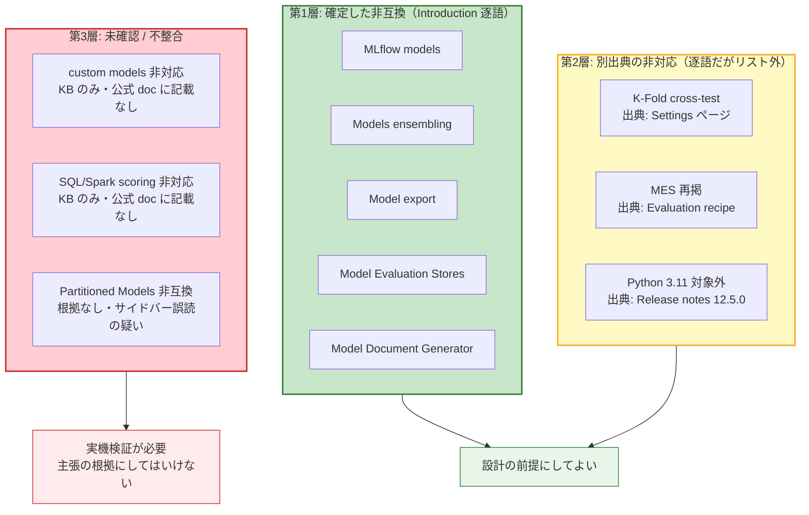
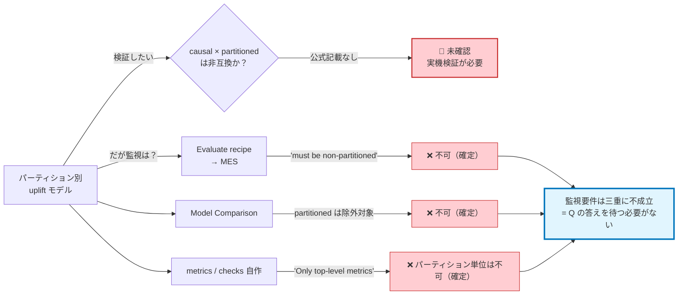
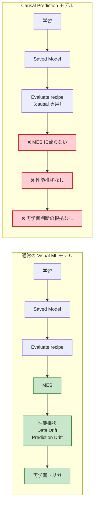

# 機能境界 — 何が本当に非互換なのか

Dataiku ネイティブ Causal Prediction を採用するとき、最初に踏むべき問いは「何ができるか」ではなく「**何が公式に非互換と宣言されているか**」である。本レポートは、その境界線を一次情報の逐語レベルまで遡って引き直す。

結論を先に述べる。

1. 公式の非互換リストは **Introduction ページの5項目のみ**であり、それが全てである。
2. K-Fold 非対応は事実だが、**そのリストの外**（Settings ページ）が出典である。
3. 事前調査が主張していた「Partitioned Models とも非互換」は、**公式ドキュメント上に根拠が存在しない**。これは誤読である可能性が高い。
4. ただし、Partitioned model と MES による監視は、causal との非互換を持ち出すまでもなく**別の理由で両立しない**。
5. KB と公式ドキュメントで制約列挙が**食い違っている**。KB 側の「custom models 非対応」は回避策設計に直結する。

---

## 1. 公式の非互換リスト — Introduction 原文ママ

一次ソース: [Introduction — Causal Prediction](https://doc.dataiku.com/dss/latest/machine-learning/causal-prediction/introduction.html)

逐語:

> Causal prediction is incompatible with the following:
>
> - MLflow models
> - Models ensembling
> - Model export
> - Model Evaluation Stores
> - Model Document Generator

**これが全てである。** 5項目。それ以上でもそれ以下でもない。

この5項目を「制約の総体」と誤解してはならないが、同時に「ここに書いていないものを非互換と断定してもいけない」。ドキュメントの沈黙は否定の証拠ではないが、肯定の証拠でもない。この非対称性が本レポートの主題である。

### 5項目の実務的な重み

| 項目 | 実務インパクト | 理由 |
|------|--------------|------|
| **Model Evaluation Stores** | **致命的** | MLOps 監視基盤の中核。時系列的な性能追跡が丸ごと不可 |
| **MLflow models** | **致命的** | 外部ライブラリ（CausalML/EconML）を import する経路が塞がれる |
| **Model export** | 大 | モデルを外部にポータブルに持ち出せない。ベンダーロックイン |
| **Models ensembling** | 中 | S/T/X-learner の組み合わせによる性能改善ができない |
| **Model Document Generator** | 小〜中 | 規制産業ではモデル文書の自動生成が要件になり得る |

重要なのは、**MES と MLflow models の2つが同時に非互換である**という点である。これは偶然の並列ではない。MES に載せる標準的な逃げ道が MLflow 経由の import であるため、**両方が塞がれていることで「ネイティブ causal モデルを監視する公式経路が完全に存在しない」状態**が成立している。片方だけなら回避できたはずのものが、二重に閉じられている。

---

## 2. K-Fold 非対応 — 事実だが出典が違う

事前調査は K-Fold 非対応を「非互換リストの一項目」として扱っていた。**これは不正確である。**

一次ソース: [Causal Prediction Settings](https://doc.dataiku.com/dss/latest/machine-learning/causal-prediction/settings.html)

逐語:

> Causal prediction does not support K-Fold cross-test.

この一文は **Settings ページに独立して記載**されており、Introduction の非互換リストには含まれない。

### なぜこの区別が重要か

- **文言が違う**: リストは "is incompatible with"、こちらは "does not support"。Dataiku がこの2語を意図的に使い分けているかは不明だが、少なくとも**同一の文書上の構造に属していない**。
- **発見可能性が違う**: Introduction だけを読んだ利用者は K-Fold 非対応を知らないまま設計に入る。制約が1ページに集約されていないこと自体が、この機能のドキュメンテーション品質の指標である。
- **引用の正確性**: 「非互換リストは6項目」と書いた資料は、その時点で一次情報を読んでいない。

### 実務的な帰結

K-Fold が使えないということは、**評価は単一の train/test split に依存する**ということである。causal モデルの評価指標（Qini/AUUC）は、そもそも真の uplift が観測不能なため推定値の分散が大きい。その上で cross-validation による分散低減の手段が奪われている。**「Qini が 0.12 だった」という数字の信頼区間を、標準機能では出せない。**

---

## 3. MES 非互換には第二の出典がある

MES の非互換は、Introduction のリストに加えて **Evaluation recipe ページにも独立して明記**されている。

一次ソース: [Evaluation recipe — Causal Prediction](https://doc.dataiku.com/dss/latest/machine-learning/causal-prediction/evaluation.html)

逐語:

> Model Evaluation Stores (MES) are not supported for causal prediction models.

**二重に明記されている制約は、この5項目の中で MES だけである。** これは偶然ではないと読むべきだろう。Evaluation recipe のページに書かれているということは、「causal モデルを評価しようとしてこのページに来た人が、そこで初めて MES が使えないと知る」という導線が想定されている。つまり Dataiku 自身が、この制約が最も頻繁に踏まれるものだと認識している可能性が高い。

| 出典 | 逐語 | 文脈 |
|------|------|------|
| Introduction | "Model Evaluation Stores"（リスト項目） | 機能導入時の全体的な非互換宣言 |
| Evaluation recipe | "Model Evaluation Stores (MES) are not supported for causal prediction models." | 評価作業の最中に遭遇する制約として |

---

## 4. 重要な訂正 — 「Partitioned Models と非互換」は文書化されていない

### 事前調査の主張

事前情報は「Causal Prediction は Partitioned Models とも非互換」としていた。**この主張には公式ドキュメント上の根拠がない。**

### 検証の結果

- Introduction の逐語リストは5項目であり、**Partitioned Models を含まない**。
- 「Partitioned Models」という文字列は causal 関連ページ内に確かに出現する。**しかし、それは causal ページの全ページで同一の行番号（〜392行目）に現れる**。
- 全ページの同じ行に同じ文字列が出るということは、それが**本文ではなく、テンプレートとして各ページに埋め込まれたサイドバーのナビゲーション項目**であることを意味する。Machine learning セクションの目次に "Partitioned Models" があり、それが causal ページのサイドバーにもレンダリングされているだけである。

つまり、「causal ページに Partitioned Models と書いてある」は真だが、「causal ページが Partitioned Models との非互換を述べている」は**偽**である。

### なぜこの誤読が起きるのか — 二次情報を信じることの危険

この誤りの生成過程は、機械的な情報収集の失敗様式として典型的である。

1. **grep がページ全体をフラットなテキストとして扱う**。HTML の意味構造（`<nav>` と `<main>` の区別）が消える。
2. **「causal のページに partitioned という語がある」という共起が、意味的関連と誤って解釈される**。
3. その解釈が一度どこかに書かれると、**次の調査者はそれを二次情報として引用し、一次情報に戻らない**。
4. 誤りが「複数のソースが一致して述べている」という見かけの合意を獲得する。

同一行番号に出現するという事実は、**本文なら絶対に起こり得ないパターン**である。異なる主題の6ページが、たまたま全く同じ行で同じ語を使うことはない。この一点だけで、テンプレート由来だと判定できる。**逆に言えば、行番号を確認しなければこの誤りは検出できなかった。**

### 補助的な傍証

[Partitioned Models](https://doc.dataiku.com/dss/latest/machine-learning/partitioned.html) ページ側からも確認したが、**causal 非対応の明記はない**。同ページは "Visual ML with Python backend" / prediction のみ、という記述を持つ。causal がここに含まれるか否かは、**この記述からは決定できない**。「Python backend の Visual ML」に causal が該当するとも読めるし、"prediction" が supervised prediction のみを指すとも読める。

### 取り扱いの結論

> **Partitioned Models × Causal Prediction は「非対応の可能性は高いが、現時点で文書化された根拠はない」ものとして扱う。**

「非対応の可能性が高い」と考える理由はある（causal は独自の学習パイプラインを持ち、partitioning の一般機構に載っていない蓋然性は高い）。しかしそれは**推測であって、引用可能な事実ではない**。設計判断に使うなら、実機検証を経る必要がある。

---

## 5. 一方で確定している事実 — Partitioned は別の理由で MES と両立しない

ここが本レポートで最も実務的に重要な箇所である。**「causal × partitioned が非互換か」を解決しなくても、「パーティション別 uplift モデル」と「MES による監視」が両立しないことは既に確定している。**

### 確定事実 1: Partitioned model は Evaluate recipe で評価不可

一次ソース: [Evaluating Dataiku Prediction models](https://doc.dataiku.com/dss/latest/mlops/model-evaluations/dss-models.html)

逐語:

> The model must be a non-partitioned Classification, Regression or Time series Forecasting model

Evaluate recipe が MES を生成する唯一の標準経路である以上、**partitioned model は原理的に MES に載らない**。causal かどうかは一切関係しない。

### 確定事実 2: Model Comparison からも partitioned は除外

一次ソース: [Model Comparisons](https://doc.dataiku.com/dss/latest/mlops/model-comparisons/index.html)

除外対象: partitioned / ensemble / clustering / non-tabular MLflow。

MES が使えないなら Model Comparison で代替、という逃げ道もここで塞がる。

### 確定事実 3: Partitioned Models ページ自身が metrics の粒度を限定している

一次ソース: [Partitioned Models](https://doc.dataiku.com/dss/latest/machine-learning/partitioned.html)

逐語:

> Only top-level (overall model) metrics and checks are available

これが決定的である。**MES が使えないなら metrics/checks で自作監視を、という最後のフォールバックも、パーティション単位では成立しない。** 取れるのは全体集計値のみであり、「どのパーティションのモデルが劣化したか」は原理的に検出できない。[KB の Partitioned models](https://knowledge.dataiku.com/latest/ml-analytics/partitioned-models/concept-partitioned-models.html) が「全体 R² は合算の近似値表示」と述べているのも同じ構造を反映している。

### 統合された結論

```text
「パーティション別 uplift モデル」 × 「MES による監視」
  → Evaluate recipe:      不可（non-partitioned 必須）
  → Model Comparison:     不可（partitioned は除外）
  → metrics/checks 自作:  不可（top-level のみ）
  → 結論: 三重に塞がれている。causal かどうかを問う前に終わっている。
```

これは実務上、非常に有用な単純化である。**「causal × partitioned の非互換を実機で確かめる」という高コストな検証を行う前に、そもそもその組み合わせが監視要件を満たせないことが分かる。** 検証の必要性自体が消える。

もし要件が「セグメント別に uplift モデルを持ち、かつセグメント別に性能を監視したい」なら、**Dataiku の partitioned models 機構を使ってはいけない**。セグメントごとに独立した saved model として構成するしかない。

---

## 6. KB と公式ドキュメントの不一致

### 事実

[KB Tutorial | Causal prediction](https://knowledge.dataiku.com/latest/ml-analytics/causal-prediction/tutorial-causal-prediction.html) は、**独立した制約列挙を持つ**。そしてそこには Introduction にない項目が含まれる。

| 項目 | Introduction（doc.dataiku.com） | KB Tutorial（knowledge.dataiku.com） |
|------|------------------------------|-----------------------------------|
| MLflow models | ✅ 記載 | — |
| Models ensembling | ✅ 記載 | — |
| Model export | ✅ 記載 | — |
| Model Evaluation Stores | ✅ 記載 | — |
| Model Document Generator | ✅ 記載 | — |
| **custom models** | ❌ **記載なし** | ✅ **記載あり** |
| **SQL/Spark scoring** | ❌ **記載なし** | ✅ **記載あり** |

**どちらが最新かは不明である。** 二つの可能性がある。

- **KB が古い**: 導入初期の制約が、その後解除されたが KB が更新されていない。→ ただし、リリースノート全体を通じて **causal の制約解除は一件も記録されていない**（12.0.0 から 14.x まで、causal 関連の変更は全てバグ修正・高速化）。この可能性は**低い**。
- **Introduction が不完全**: リストが網羅的でなく、KB のほうが実装の実態に近い。→ K-Fold 制約が Introduction のリスト外に置かれている前例があることを踏まえると、**Introduction のリストが網羅的でないことは既に一度証明されている**。この可能性は**相対的に高い**。

後者の解釈を支持する構造的な理由がある。**Introduction のリストは既に「全ての制約を列挙したもの」ではないと分かっている**（K-Fold がその証拠）。したがって「Introduction にないから存在しない」という推論は、この機能に関しては使えない。

### 「custom models 非対応」の重み

これは単なる文書の不整合ではない。**カスタム経路の設計に直結する。**

ネイティブ causal の制約を回避しようとするとき、最初に思いつくのは「causal の base learner にカスタムモデルを差し込む」という発想である。[Causal Prediction Algorithms](https://doc.dataiku.com/dss/latest/machine-learning/causal-prediction/causal-prediction-algorithms.html) が base learner を「任意の Python ベース ML アルゴリズム」と述べているため、この発想は自然に見える。

しかし KB が「custom models 非対応」と言うなら、**「任意の Python ベース ML アルゴリズム」とは「Dataiku が提供する組み込みアルゴリズムの中の任意のもの」を意味する**ことになる。これは全く違う話である。

さらに、[Component: Prediction algorithm](https://doc.dataiku.com/dss/latest/plugins/reference/prediction-algorithms.html) は plugin algorithm の対応を「二値/多クラス/回帰のみ」と限定しており、**causal はプラグイン拡張の対象外**である。KB の記述と整合する。

→ **要確認事項として最優先。** 実機で「causal の base learner にライブラリ packaging した custom model を指定できるか」を確かめるまで、カスタム経路の設計は始められない。

---

## 7. 制約の一覧表 — 出典と確実性

以下が本レポートの中心的成果物である。**逐語で確認できたもの / 別ページが出典のもの / 未確認のもの**を厳密に区別する。

| # | 制約項目 | 出典ページ | 逐語の有無 | 確実性 |
|---|---------|-----------|----------|-------|
| 1 | MLflow models と非互換 | Introduction | ✅ 逐語 | **確定** |
| 2 | Models ensembling と非互換 | Introduction | ✅ 逐語 | **確定** |
| 3 | Model export と非互換 | Introduction | ✅ 逐語 | **確定** |
| 4 | Model Evaluation Stores と非互換 | Introduction | ✅ 逐語 | **確定** |
| 5 | Model Document Generator と非互換 | Introduction | ✅ 逐語 | **確定** |
| 6 | MES 非対応（再掲・第二出典） | Evaluation recipe | ✅ 逐語 | **確定**（二重出典） |
| 7 | K-Fold cross-test 非対応 | **Settings**（リスト外） | ✅ 逐語 | **確定**（別出典） |
| 8 | Python 3.11 対応から causal は除外 | Release notes 12.5.0 | ✅ 記載 | **確定**（別出典） |
| 9 | 分類は binary outcome のみ | Introduction | ✅ 記載 | **確定** |
| 10 | custom models 非対応 | **KB Tutorial のみ** | ✅ 逐語（KB） | ⚠️ **不整合**（公式 doc に記載なし） |
| 11 | SQL/Spark scoring 非対応 | **KB Tutorial のみ** | ✅ 逐語（KB） | ⚠️ **不整合**（公式 doc に記載なし） |
| 12 | Partitioned Models と非互換 | **どこにもない** | ❌ **なし** | 🔴 **未確認（根拠なし）** |
| 13 | Partitioned model は Evaluate recipe 不可 | Evaluating DSS Prediction models | ✅ 逐語 | **確定**（causal とは無関係に成立） |
| 14 | Partitioned model は Model Comparison 除外 | Model Comparisons | ✅ 記載 | **確定**（causal とは無関係に成立） |
| 15 | Partitioned は top-level metrics のみ | Partitioned Models | ✅ 逐語 | **確定**（causal とは無関係に成立） |
| 16 | Plugin algorithm は causal 非対応 | Component: Prediction algorithm | ✅ 記載（二値/多クラス/回帰のみ） | **確定**（間接的） |

### 確実性のレベル定義

| レベル | 意味 | 設計判断への使用 |
|-------|------|---------------|
| **確定** | 公式ドキュメントに逐語の記述があり、出典を特定できる | そのまま使ってよい |
| **確定（別出典）** | 確定だが、Introduction の非互換リストではない場所が出典 | 使ってよいが、引用時に出典を正しく示すこと |
| ⚠️ **不整合** | KB と公式 doc で記述が食い違う | **実機検証まで設計の前提にしない** |
| 🔴 **未確認** | 文書化された根拠が存在しない | **主張してはいけない。可能性として保持するのみ** |

---

## 8. 三層の境界 — 図解



### Partitioned をめぐる論理構造

causal × partitioned の非互換が未確認であっても、監視要件は別経路で塞がれている。



---

## 9. この境界がもたらす帰結

### 9.1 ネイティブ uplift を選んだ瞬間に MLOps 監視基盤が使えなくなる

これが最も重い帰結である。Dataiku の価値提案の中核は「Visual ML で作ったモデルを MLOps 基盤に乗せて運用する」ことである。Causal Prediction は Visual ML の一機能として提供されながら、**その基盤に乗らない**。



### 9.2 時系列的な性能追跡ができない — 「作った時点の評価」と「運用中の監視」の区別

ここに、この機能の設計思想を示す重要な非対称がある。

**学習時の評価は充実している。** [Results](https://doc.dataiku.com/dss/latest/machine-learning/causal-prediction/results.html) が提供するものを列挙すると：

| 機能 | 内容 |
|------|------|
| Uplift / Qini 曲線 | 数式まで明記 |
| Feature importance | surrogate tree による、Gini 正規化 |
| Treatment Randomization Test | 二項検定、p 閾値 0.05 |
| Positivity Analysis | 積み上げヒストグラム + 較正曲線 |
| Treatment Analysis / IPW | 12.4.0 以降 |
| ML Diagnostics | 不均衡 treatment の自動検出（12.4.0 以降） |

これは**誠実で、技術的に真面目な評価スイート**である。因果推論の3仮定（ignorability / positivity / SUTVA）を [KB Concept](https://knowledge.dataiku.com/latest/ml-analytics/causal-prediction/concept-causal-prediction.html) が明示し、**仮定違反を検出するツールまで提供している**。多くのベンダーがやらないことをやっている。

**しかし、それは全て「作った時点の評価」である。**

| 軸 | ネイティブ causal |
|----|-----------------|
| 学習時に Qini を見る | ✅ 可能。むしろ充実 |
| 学習時に仮定違反を検出する | ✅ 可能（Randomization Test / Positivity Analysis） |
| **3ヶ月後に Qini が劣化したか見る** | ❌ **不可** |
| **入力分布のドリフトを検出する** | ❌ **不可**（MES 非対応） |
| **uplift スコア分布の変化を追う** | ❌ **不可**（MES 非対応） |
| **モデル間の性能を時系列比較する** | ❌ **不可**（MES / Model Comparison） |
| **再学習の判断根拠を自動取得する** | ❌ **不可** |

**「Qini が 0.15 で良好です」という学習時のスクリーンショットは、3ヶ月後のモデルについて何も語らない。** そして Dataiku には、3ヶ月後に同じ数字を取り直して並べる標準的な仕組みが存在しない。

この区別は、uplift モデルにおいて特に致命的である。理由は uplift の性質にある：

- **uplift の劣化は静かに起こる**。予測精度と違い、真の uplift は観測不能であるため、「外している」ことが直接には見えない。
- **処置の環境は変わり続ける**。マーケティング施策の内容、競合の動き、顧客の慣れ（同じオファーへの反応の減衰）。causal モデルが依拠する ignorability の仮定は、**学習時に成立していても運用中に崩れうる**。
- **崩れたことを検出する唯一の方法が、時系列的な監視である**。そしてそれが塞がれている。

つまり Dataiku は、**「仮定違反を学習時に検出するツール」を提供しながら、「運用中に仮定違反が発生したことを検出する手段」を提供していない**。前者だけでは、片肺である。

### 9.3 制約は3年間まったく緩和されていない

リリースノートの全文 grep により確定した事実：

| バージョン系 | causal 関連の変更 |
|------------|-----------------|
| 12.x（2023） | 導入 + 複数 treatment + Treatment Analysis/IPW |
| 13.x（2024–2025） | **新機能ゼロ**。バグ修正・高速化のみ（全5件） |
| 14.x（2025–2026） | **言及1件のみ**（14.4.0 の性能修正） |

**非互換5項目 + K-Fold は、12.0.0 から 14.x まで一貫している。導入から約3年、制約は1つも緩和されていない。**

これは「境界が動く見込みは薄い」ことを意味する。「そのうち MES 対応するだろうから待とう」は、根拠のない期待である。3年間の実績が反証している。

---

## 10. 設計判断への含意

この境界を踏まえると、選択肢は次のように整理される。

| 選択 | 得られるもの | 失うもの |
|------|------------|---------|
| **ネイティブ causal を使う** | 充実した学習時評価、Visual UI、実装コスト最小 | **運用監視の全て**、モデルポータビリティ、ensembling、K-Fold |
| **MLflow pyfunc でカスタム実装** | MES / 監視、任意のライブラリ（CausalML/EconML） | 学習時の causal 専用評価 UI、実装コスト大、**前例がほぼない** |
| **両方（学習=ネイティブ、監視=別途）** | — | **不可能**。model export も非互換のため、ネイティブモデルを外に出せない |

**3つ目の選択肢が存在しないことを見落としてはならない。** "Model export" が非互換リストにあることの意味はここにある。「ネイティブで学習して、モデルを export して外部で監視する」というハイブリッドは、**export が塞がれているため成立しない**。MES 非互換と Model export 非互換の組み合わせは、**ネイティブ causal を完全な袋小路にしている**。

これは偶然の制約の集合ではなく、**構造的な閉鎖**である。

---

## 11. 要確認事項（優先度順）

| 優先度 | 項目 | 確認方法 | 理由 |
|-------|------|---------|------|
| 🔴 **最高** | KB の「custom models 非対応」の真偽 | 実機で causal の base learner にライブラリ packaging した custom model を指定 | カスタム経路の設計全体が依存 |
| 🔴 **最高** | KB の「SQL/Spark scoring 非対応」の真偽 | 実機で causal saved model の scoring recipe のエンジン選択を確認 | 大規模スコアリングの成否を決める |
| 🟡 中 | causal × partitioned の実際の挙動 | 実機で causal モデルに partitioning を設定できるか | ただし**監視要件が別途塞がれているため、実務上は確認不要な可能性が高い** |
| 🟡 中 | Introduction のリストの網羅性 | Dataiku サポートへの問い合わせ | K-Fold の前例により、網羅的でないことは既に判明済み |

---

## 12. まとめ

- **公式の非互換リストは5項目**: MLflow models / Models ensembling / Model export / Model Evaluation Stores / Model Document Generator。これが全て。
- **K-Fold 非対応は事実だが、リストの外**（Settings ページ）が出典。「非互換リストは6項目」と書く資料は一次情報を読んでいない。
- **MES 非互換は二重出典**（Introduction + Evaluation recipe）。5項目中で唯一。最も踏まれやすい制約であることの示唆。
- **「Partitioned Models と非互換」は根拠なし**。causal ページの全ページ同一行番号に現れる**サイドバーのナビゲーション項目**の誤読。非対応の可能性は高いが、**文書化された根拠は存在しない**。
- **ただし Partitioned × MES は別の理由で三重に不成立**: Evaluate recipe の "non-partitioned" 要件 / Model Comparison の除外 / "Only top-level metrics"。causal の非互換を問うまでもない。
- **KB と公式 doc が食い違う**: KB のみが `custom models` / `SQL/Spark scoring` 非対応を挙げる。**Introduction のリストが網羅的でないことは K-Fold の件で既に証明済み**のため、KB 側を軽視できない。
- **最大の帰結**: ネイティブ uplift を選んだ瞬間に MLOps 監視基盤が使えなくなる。学習時の Qini/AUUC は充実しているが、それは「作った時点の評価」であって「運用中の監視」ではない。そして Model export も非互換であるため、外部に持ち出して監視することもできない。**構造的な袋小路**である。
- **3年間、制約は1つも緩和されていない**。境界が動く見込みは薄い。

最後に方法論的な教訓を一つ。**この調査で最も有用だったのは、「Partitioned Models という文字列が全ページの同一行に現れる」という気づきである。** 内容の解釈ではなく、出現パターンの機械的な異常が誤りを暴いた。二次情報が繰り返す主張ほど、一次情報の**構造**まで遡って確認する価値がある。
